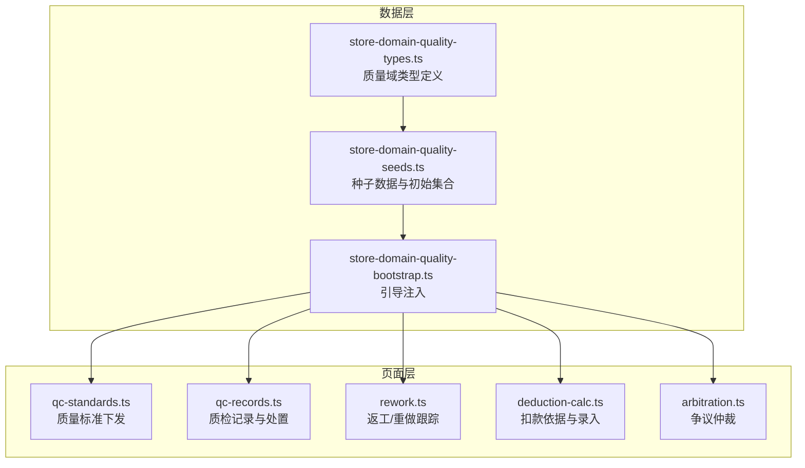
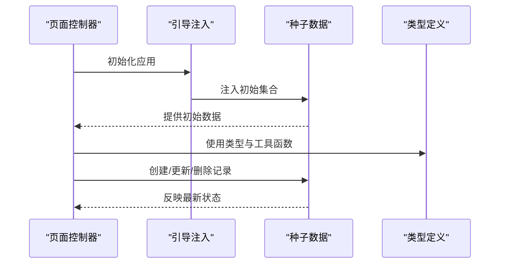
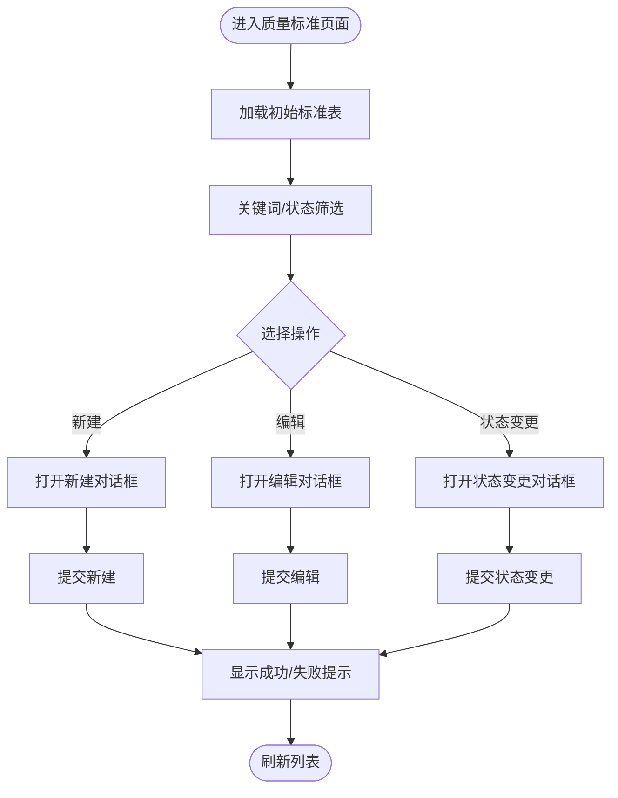
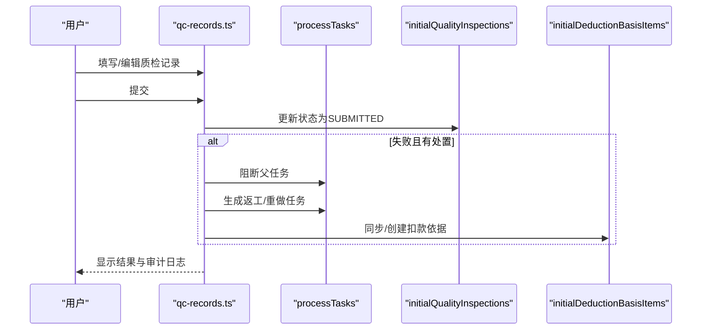
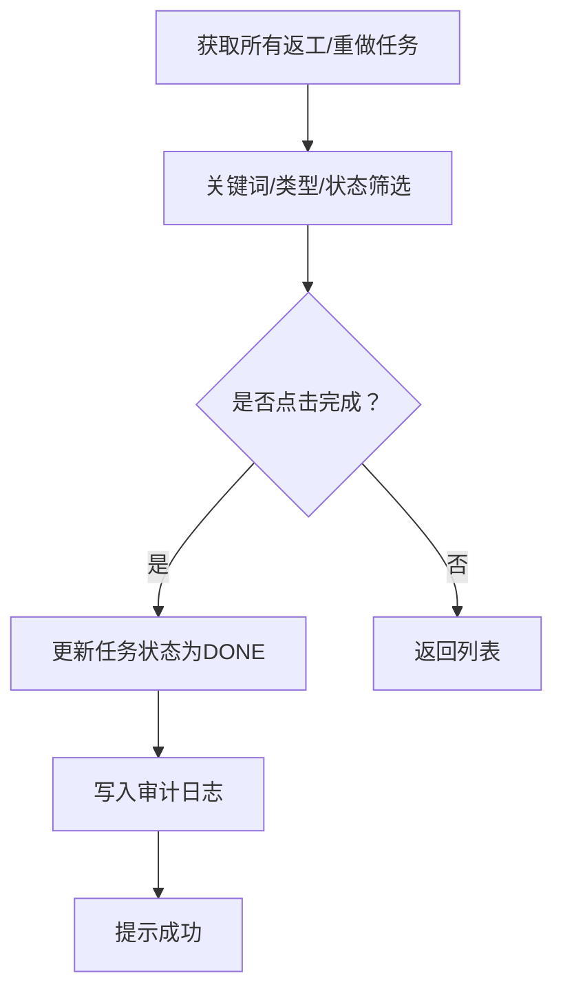
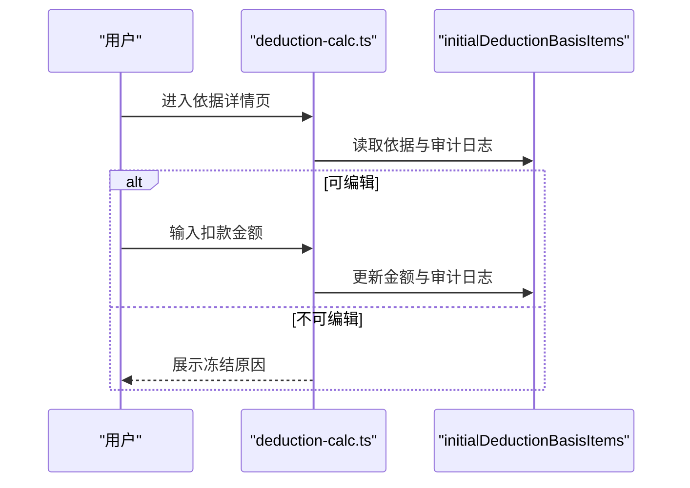
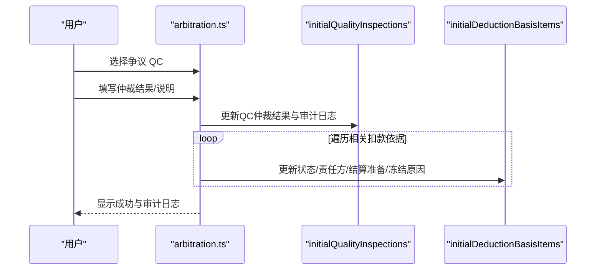
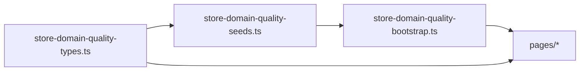
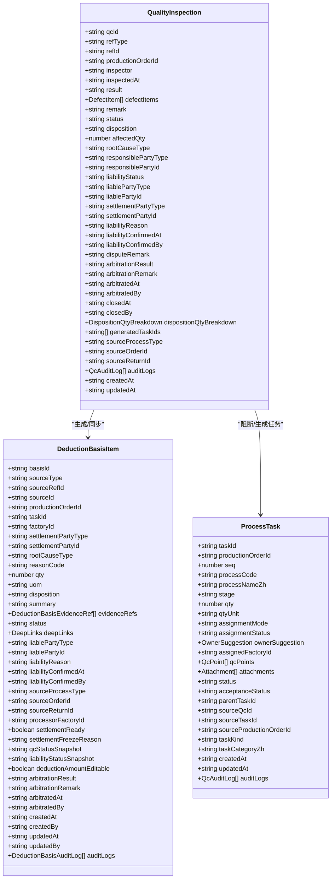

# 质量管理

<cite>
**本文引用的文件**
- [store-domain-quality-types.ts](file://src/data/fcs/store-domain-quality-types.ts)
- [store-domain-quality-seeds.ts](file://src/data/fcs/store-domain-quality-seeds.ts)
- [store-domain-quality-bootstrap.ts](file://src/data/fcs/store-domain-quality-bootstrap.ts)
- [qc-standards.ts](file://src/pages/qc-standards.ts)
- [qc-records.ts](file://src/pages/qc-records.ts)
- [rework.ts](file://src/pages/rework.ts)
- [deduction-calc.ts](file://src/pages/deduction-calc.ts)
- [arbitration.ts](file://src/pages/arbitration.ts)
</cite>

## 目录
1. [引言](#引言)
2. [项目结构](#项目结构)
3. [核心组件](#核心组件)
4. [架构总览](#架构总览)
5. [详细组件分析](#详细组件分析)
6. [依赖关系分析](#依赖关系分析)
7. [性能考量](#性能考量)
8. [故障排查指南](#故障排查指南)
9. [结论](#结论)
10. [附录](#附录)

## 引言
本技术文档面向“质量管理系统”的完整实现，围绕以下核心业务闭环展开：质量标准制定、质检记录管理、返工重做处理、扣款计算、争议仲裁、处罚输出。文档从数据模型、流程控制、页面交互与状态流转四个维度，系统化梳理系统架构与实现细节，并提供可视化图示帮助读者快速理解。

## 项目结构
本项目采用按领域与页面职责分离的组织方式：
- 数据层（src/data/fcs）：定义质量域的纯 TypeScript 类型与种子数据，提供跨页面共享的静态数据与工具函数。
- 页面层（src/pages）：实现各功能页面的渲染与交互逻辑，调用数据层提供的类型与种子数据，驱动业务流程。
- 组件壳（src/components/shell.ts）：应用外壳组件，承载页面路由与通用 UI。

图表来源
- [store-domain-quality-types.ts:1-304](file://src/data/fcs/store-domain-quality-types.ts#L1-L304)
- [store-domain-quality-seeds.ts:1-269](file://src/data/fcs/store-domain-quality-seeds.ts#L1-L269)
- [store-domain-quality-bootstrap.ts:1-37](file://src/data/fcs/store-domain-quality-bootstrap.ts#L1-L37)
- [qc-standards.ts:1-857](file://src/pages/qc-standards.ts#L1-L857)
- [qc-records.ts:1-1919](file://src/pages/qc-records.ts#L1-L1919)
- [rework.ts:1-406](file://src/pages/rework.ts#L1-L406)
- [deduction-calc.ts:1-808](file://src/pages/deduction-calc.ts#L1-L808)
- [arbitration.ts:1-817](file://src/pages/arbitration.ts#L1-L817)

章节来源
- [store-domain-quality-types.ts:1-304](file://src/data/fcs/store-domain-quality-types.ts#L1-L304)
- [store-domain-quality-seeds.ts:1-269](file://src/data/fcs/store-domain-quality-seeds.ts#L1-L269)
- [store-domain-quality-bootstrap.ts:1-37](file://src/data/fcs/store-domain-quality-bootstrap.ts#L1-L37)
- [qc-standards.ts:1-857](file://src/pages/qc-standards.ts#L1-L857)
- [qc-records.ts:1-1919](file://src/pages/qc-records.ts#L1-L1919)
- [rework.ts:1-406](file://src/pages/rework.ts#L1-L406)
- [deduction-calc.ts:1-808](file://src/pages/deduction-calc.ts#L1-L808)
- [arbitration.ts:1-817](file://src/pages/arbitration.ts#L1-L817)

## 核心组件
- 质量域类型与工具：定义质检结果、处置方式、责任状态、扣款依据来源类型、审计日志等核心数据结构与默认责任推断函数。
- 种子数据与初始集合：包含大量 QC 记录、扣款依据、任务与生产单快照，以及工厂、染印订单等关联实体的初始数据。
- 页面控制器：分别负责质量标准下发、质检记录创建/提交/处置拆分、返工/重做任务跟踪、扣款依据详情与金额录入、争议仲裁处理。

章节来源
- [store-domain-quality-types.ts:1-304](file://src/data/fcs/store-domain-quality-types.ts#L1-L304)
- [store-domain-quality-seeds.ts:1-269](file://src/data/fcs/store-domain-quality-seeds.ts#L1-L269)
- [qc-standards.ts:1-857](file://src/pages/qc-standards.ts#L1-L857)
- [qc-records.ts:1-1919](file://src/pages/qc-records.ts#L1-L1919)
- [rework.ts:1-406](file://src/pages/rework.ts#L1-L406)
- [deduction-calc.ts:1-808](file://src/pages/deduction-calc.ts#L1-L808)
- [arbitration.ts:1-817](file://src/pages/arbitration.ts#L1-L817)

## 架构总览
系统以“类型定义 + 种子数据 + 页面控制器”三层结构运行。页面通过引导注入将种子数据挂载至全局可访问的数组，再在用户交互时对这些数组进行增删改查与状态迁移，形成完整的业务闭环。

图表来源
- [store-domain-quality-bootstrap.ts:13-37](file://src/data/fcs/store-domain-quality-bootstrap.ts#L13-L37)
- [store-domain-quality-seeds.ts:24-78](file://src/data/fcs/store-domain-quality-seeds.ts#L24-L78)
- [store-domain-quality-types.ts:123-137](file://src/data/fcs/store-domain-quality-types.ts#L123-L137)

## 详细组件分析

### 质量标准制定与管理（qc-standards.ts）
- 功能要点
  - 新建/编辑/状态变更：支持草稿、待下发、已下发、作废四种状态，限定状态流转。
  - 关键字段：任务ID、质检点摘要、验收标准摘要、抽检说明、备注等。
  - 状态机：DRAFT → TO_RELEASE → RELEASED，或直接作废。
- 数据来源
  - 质量标准表（QcStandardSheet）来自种子数据模块的初始集合。
- 交互流程
  - 表单校验、状态变更、提示反馈、列表筛选与统计。

图表来源
- [qc-standards.ts:149-800](file://src/pages/qc-standards.ts#L149-L800)

章节来源
- [qc-standards.ts:1-857](file://src/pages/qc-standards.ts#L1-L857)
- [store-domain-quality-seeds.ts:1-269](file://src/data/fcs/store-domain-quality-seeds.ts#L1-L269)

### 质检记录与处置（qc-records.ts）
- 功能要点
  - 草稿保存、提交、处置拆分、生成返工/重做任务、同步扣款依据。
  - 失败时自动阻断父任务，生成返工/重做任务，同步扣款依据。
  - 处置拆分校验：合计必须等于受影响数量。
- 关键流程
  - 提交流程：失败→阻断父任务→生成返工/重做→同步扣款依据→更新审计日志。
  - 处置拆分：校验非负与合计一致性，同步扣款数量到扣款依据。

图表来源
- [qc-records.ts:561-635](file://src/pages/qc-records.ts#L561-L635)
- [qc-records.ts:390-456](file://src/pages/qc-records.ts#L390-L456)
- [qc-records.ts:458-559](file://src/pages/qc-records.ts#L458-L559)

章节来源
- [qc-records.ts:1-1919](file://src/pages/qc-records.ts#L1-L1919)
- [store-domain-quality-types.ts:14-203](file://src/data/fcs/store-domain-quality-types.ts#L14-L203)

### 返工/重做任务生命周期（rework.ts）
- 功能要点
  - 追踪由 QC 失败自动生成的返工/重做任务，支持标记完成。
  - 支持按类型（返工/重做）与状态（未开始/进行中/完成/暂不能继续）筛选。
- 关键流程
  - 识别返工/重做任务（含来源 QC 的任务）→ 列表筛选与统计 → 标记完成更新状态与审计日志。

图表来源
- [rework.ts:104-196](file://src/pages/rework.ts#L104-L196)

章节来源
- [rework.ts:1-406](file://src/pages/rework.ts#L1-L406)

### 扣款依据与金额录入（deduction-calc.ts）
- 功能要点
  - 依据台账：只读展示，支持来源类型、状态、工厂、结算状态、关键词筛选。
  - 金额录入：根据冻结状态与可编辑标记决定是否允许录入金额。
  - 审计日志：记录创建、更新、仲裁等关键动作。
- 关键流程
  - 依据生成/更新：由 QC 失败或瑕疵接受同步而来。
  - 冻结与可编辑：由质检结案、争议状态、结算准备等条件决定。

图表来源
- [deduction-calc.ts:396-717](file://src/pages/deduction-calc.ts#L396-L717)
- [deduction-calc.ts:719-808](file://src/pages/deduction-calc.ts#L719-L808)

章节来源
- [deduction-calc.ts:1-808](file://src/pages/deduction-calc.ts#L1-L808)

### 争议仲裁（arbitration.ts）
- 功能要点
  - 仲裁入口：仅“争议中”的 QC 单可仲裁。
  - 仲裁结果：维持原判、改判责任方、作废扣款依据。
  - 影响范围：同步更新 QC 与相关扣款依据的状态、责任方、结算准备与冻结原因。
- 关键流程
  - 选择 QC → 填写仲裁结果与说明 → 提交 → 同步 QC 与扣款依据 → 写入审计日志。

图表来源
- [arbitration.ts:258-373](file://src/pages/arbitration.ts#L258-L373)
- [arbitration.ts:406-500](file://src/pages/arbitration.ts#L406-L500)

章节来源
- [arbitration.ts:1-817](file://src/pages/arbitration.ts#L1-L817)

## 依赖关系分析
- 类型依赖：页面控制器严格使用类型定义文件中的接口与枚举，确保数据结构一致。
- 数据依赖：页面通过引导注入将种子数据挂载到全局数组，页面逻辑围绕这些数组进行 CRUD 与状态迁移。
- 工具依赖：默认责任推断函数用于在未显式指定责任方时自动推导。

图表来源
- [store-domain-quality-types.ts:1-304](file://src/data/fcs/store-domain-quality-types.ts#L1-L304)
- [store-domain-quality-seeds.ts:1-269](file://src/data/fcs/store-domain-quality-seeds.ts#L1-L269)
- [store-domain-quality-bootstrap.ts:1-37](file://src/data/fcs/store-domain-quality-bootstrap.ts#L1-L37)
- [qc-standards.ts:1-857](file://src/pages/qc-standards.ts#L1-L857)
- [qc-records.ts:1-1919](file://src/pages/qc-records.ts#L1-L1919)
- [rework.ts:1-406](file://src/pages/rework.ts#L1-L406)
- [deduction-calc.ts:1-808](file://src/pages/deduction-calc.ts#L1-L808)
- [arbitration.ts:1-817](file://src/pages/arbitration.ts#L1-L817)

章节来源
- [store-domain-quality-types.ts:1-304](file://src/data/fcs/store-domain-quality-types.ts#L1-L304)
- [store-domain-quality-seeds.ts:1-269](file://src/data/fcs/store-domain-quality-seeds.ts#L1-L269)
- [store-domain-quality-bootstrap.ts:1-37](file://src/data/fcs/store-domain-quality-bootstrap.ts#L1-L37)
- [qc-standards.ts:1-857](file://src/pages/qc-standards.ts#L1-L857)
- [qc-records.ts:1-1919](file://src/pages/qc-records.ts#L1-L1919)
- [rework.ts:1-406](file://src/pages/rework.ts#L1-L406)
- [deduction-calc.ts:1-808](file://src/pages/deduction-calc.ts#L1-L808)
- [arbitration.ts:1-817](file://src/pages/arbitration.ts#L1-L817)

## 性能考量
- 前端内存占用：种子数据与全局数组在页面初始化时一次性注入，适合原型阶段的演示与测试。
- 查询与筛选：页面层对数组进行过滤与统计，建议在数据量增长时引入索引或服务端分页。
- 渲染优化：列表渲染采用虚拟滚动或分页可进一步提升大数据量下的交互体验。
- 状态一致性：通过统一的类型与工具函数保证状态迁移的一致性，减少边界错误。

## 故障排查指南
- 质检记录提交失败
  - 检查是否填写了引用 ID、质检员、缺陷明细、处置方式与受影响数量。
  - 若受影响数量超过任务总量，将被拒绝。
- 返工/重做任务无法生成
  - 父任务未分配工厂或受影响数量为空/非正数会导致生成失败。
- 扣款金额不可录入
  - 质检未结案、争议中、冻结结算等状态下会禁止录入。
- 仲裁失败
  - 仅“争议中”的 QC 可仲裁；改判责任方时需同时填写责任方与扣款对象。

章节来源
- [qc-records.ts:759-786](file://src/pages/qc-records.ts#L759-L786)
- [qc-records.ts:390-456](file://src/pages/qc-records.ts#L390-L456)
- [deduction-calc.ts:164-169](file://src/pages/deduction-calc.ts#L164-L169)
- [arbitration.ts:258-280](file://src/pages/arbitration.ts#L258-L280)

## 结论
本质量管理系统以清晰的数据模型与严格的页面控制器分工，实现了从“质量标准制定”到“争议仲裁”的完整闭环。通过种子数据与引导注入，系统在前端即可演示真实业务场景；通过类型约束与工具函数，保障了状态迁移与责任推断的正确性。后续可在数据规模扩大时引入服务端存储与分页策略，进一步提升性能与可维护性。

## 附录

### 质量数据模型设计（类图）

图表来源
- [store-domain-quality-types.ts:142-203](file://src/data/fcs/store-domain-quality-types.ts#L142-L203)
- [store-domain-quality-types.ts:259-303](file://src/data/fcs/store-domain-quality-types.ts#L259-L303)
- [store-domain-quality-seeds.ts:84-187](file://src/data/fcs/store-domain-quality-seeds.ts#L84-L187)

### 代码示例路径（不展示具体代码内容）
- 质量标准创建与状态变更
  - [创建标准:158-198](file://src/pages/qc-standards.ts#L158-L198)
  - [更新标准:200-231](file://src/pages/qc-standards.ts#L200-L231)
  - [状态变更:233-254](file://src/pages/qc-standards.ts#L233-L254)
- 质检记录提交与处置拆分
  - [提交流程:561-635](file://src/pages/qc-records.ts#L561-L635)
  - [处置拆分:637-719](file://src/pages/qc-records.ts#L637-L719)
- 返工/重做任务标记完成
  - [标记完成:161-196](file://src/pages/rework.ts#L161-L196)
- 扣款依据金额录入
  - [金额录入与冻结提示:164-169](file://src/pages/deduction-calc.ts#L164-L169)
  - [详情页渲染与事件处理:396-717](file://src/pages/deduction-calc.ts#L396-L717)
- 争议仲裁
  - [仲裁处理:258-373](file://src/pages/arbitration.ts#L258-L373)
  - [对话框渲染与提交:406-500](file://src/pages/arbitration.ts#L406-L500)