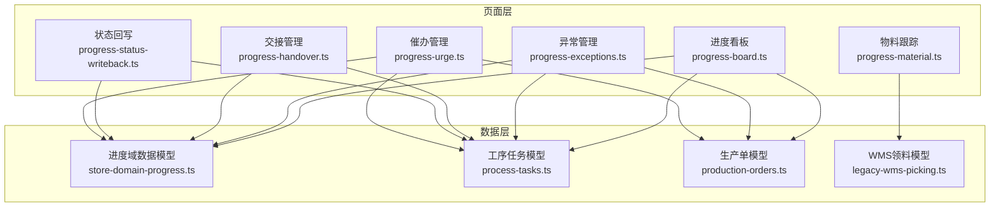
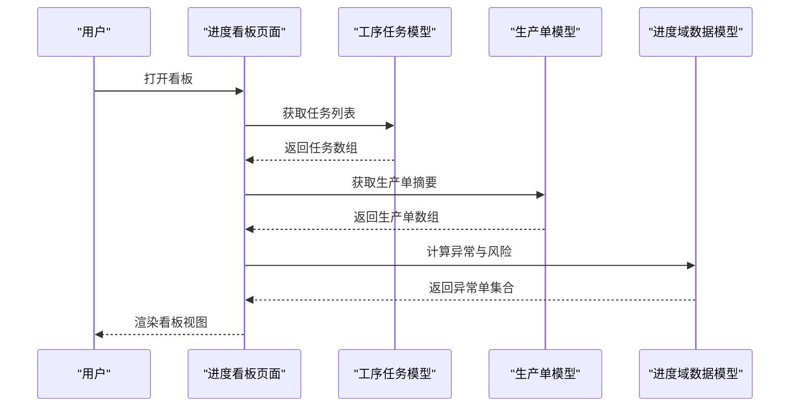
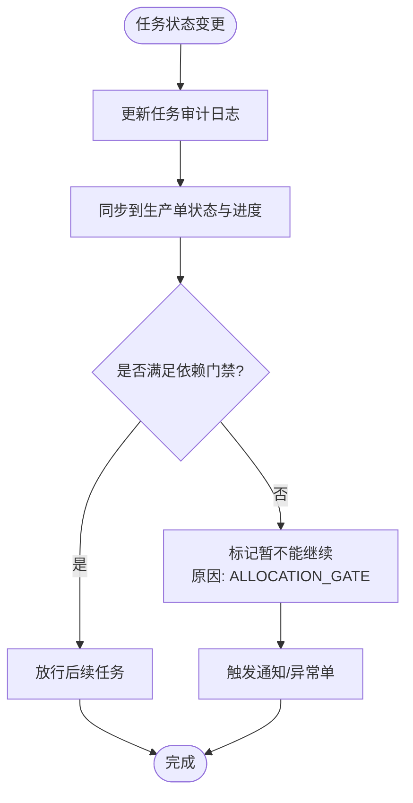
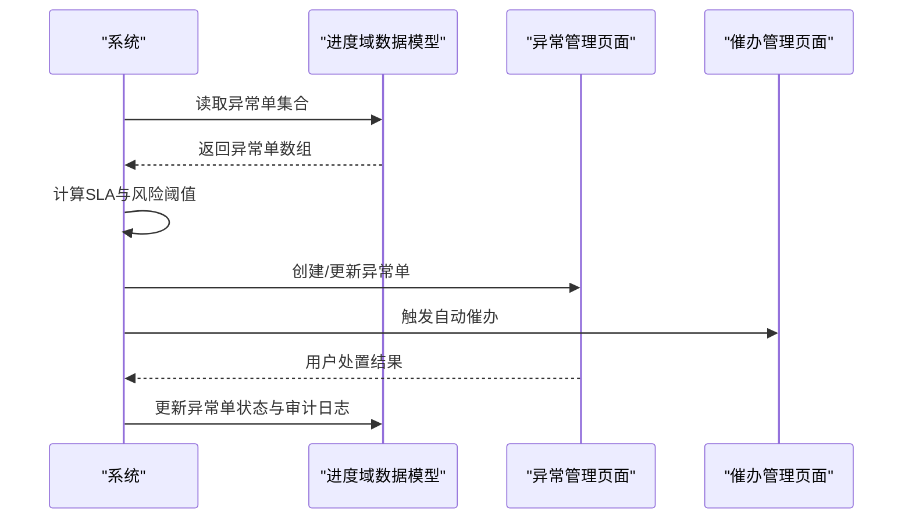
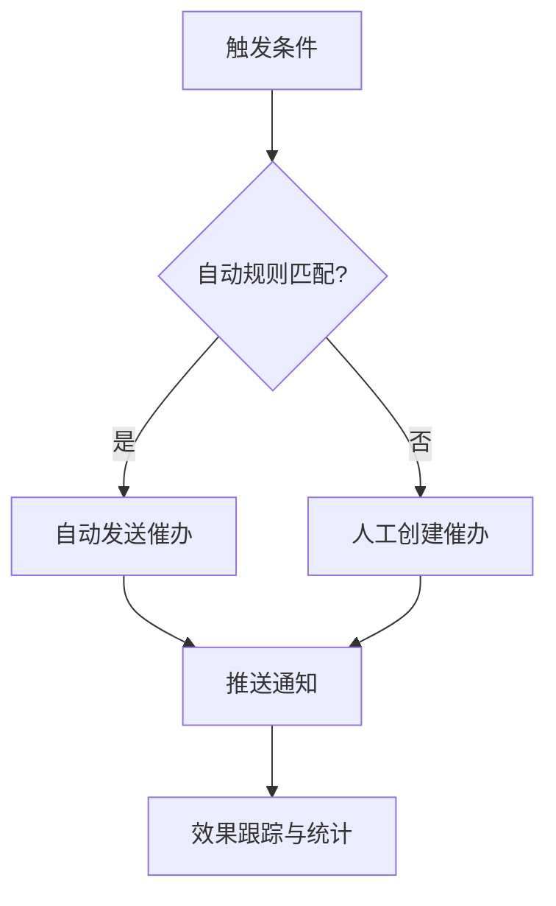
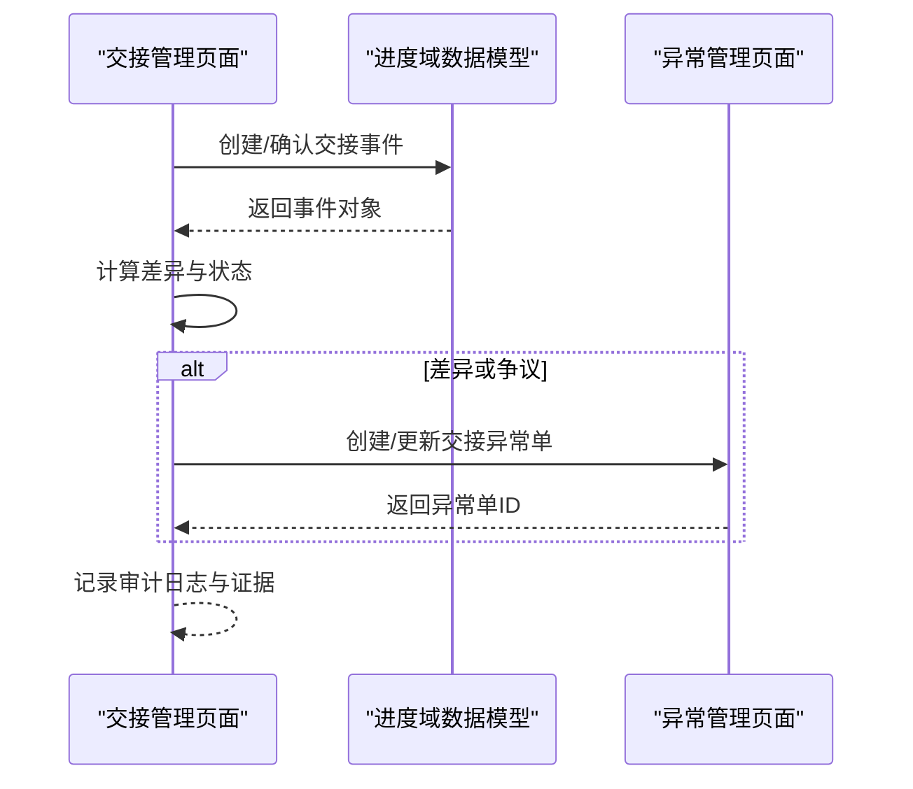
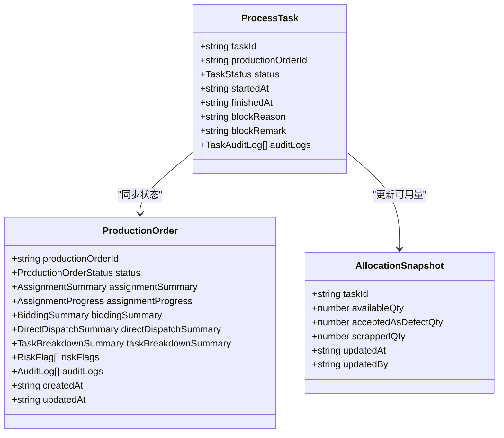
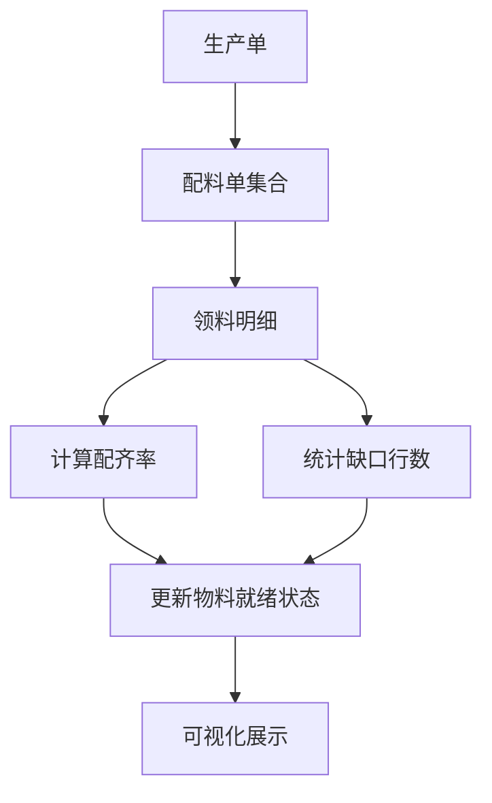
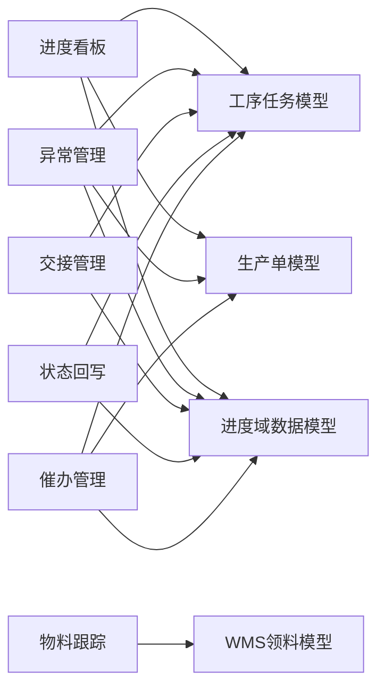

# 进度跟踪

<cite>
**本文引用的文件**
- [进度看板页面](file://src/pages/progress-board.ts)
- [异常管理页面](file://src/pages/progress-exceptions.ts)
- [交接管理页面](file://src/pages/progress-handover.ts)
- [物料跟踪页面](file://src/pages/progress-material.ts)
- [状态回写页面](file://src/pages/progress-status-writeback.ts)
- [催办管理页面](file://src/pages/progress-urge.ts)
- [进度域数据模型](file://src/data/fcs/store-domain-progress.ts)
- [工序任务数据模型](file://src/data/fcs/process-tasks.ts)
- [生产单数据模型](file://src/data/fcs/production-orders.ts)
- [WMS领料数据模型](file://src/data/fcs/legacy-wms-picking.ts)
</cite>

## 目录
1. [引言](#引言)
2. [项目结构](#项目结构)
3. [核心组件](#核心组件)
4. [架构总览](#架构总览)
5. [详细组件分析](#详细组件分析)
6. [依赖关系分析](#依赖关系分析)
7. [性能考虑](#性能考虑)
8. [故障排查指南](#故障排查指南)
9. [结论](#结论)

## 引言
本技术文档围绕进度跟踪系统进行全面解析，覆盖生产进度的全流程跟踪机制，包括进度看板、异常监控、催办管理、交接管理、状态回写、物料跟踪、溯源查询等核心功能。文档重点阐述：
- 进度看板的数据可视化实现，包括甘特图展示、实时进度更新、关键节点提醒等
- 异常监控系统的智能识别算法，包括进度延迟检测、质量异常预警、资源短缺提示等异常情况的自动发现和处理
- 催办管理机制，包括自动催办规则、人工催办流程、催办效果跟踪
- 交接管理的流程控制，包括工序交接标准、质量保证措施、责任划分机制
- 状态回写的实时同步机制和数据一致性保障
- 提供具体代码示例路径，展示进度数据采集逻辑、异常检测算法和状态同步机制

## 项目结构
进度跟踪系统采用前端页面与数据模型分离的组织方式：
- 页面层：位于 src/pages，包含各功能页面的业务逻辑与视图渲染
- 数据层：位于 src/data/fcs，包含进度域、工序任务、生产单、WMS领料等数据模型与种子数据
- 状态层：位于 src/state/store.ts，提供全局状态管理

**图表来源**
- [进度看板页面:1-800](file://src/pages/progress-board.ts#L1-L800)
- [异常管理页面:1-800](file://src/pages/progress-exceptions.ts#L1-L800)
- [交接管理页面:1-800](file://src/pages/progress-handover.ts#L1-L800)
- [物料跟踪页面:1-800](file://src/pages/progress-material.ts#L1-L800)
- [状态回写页面:1-725](file://src/pages/progress-status-writeback.ts#L1-L725)
- [催办管理页面:1-800](file://src/pages/progress-urge.ts#L1-L800)
- [进度域数据模型:1-800](file://src/data/fcs/store-domain-progress.ts#L1-L800)
- [工序任务数据模型:1-800](file://src/data/fcs/process-tasks.ts#L1-L800)
- [生产单数据模型:1-800](file://src/data/fcs/production-orders.ts#L1-L800)
- [WMS领料数据模型:1-336](file://src/data/fcs/legacy-wms-picking.ts#L1-L336)

**章节来源**
- [进度看板页面:1-800](file://src/pages/progress-board.ts#L1-L800)
- [进度域数据模型:1-800](file://src/data/fcs/store-domain-progress.ts#L1-L800)

## 核心组件
- 进度看板：负责生产单与工序任务的全景视图，支持列表/看板双视图、多维过滤、生命周期状态推演、风险标识与关键节点提醒
- 异常管理：提供异常单的创建、分类、分级、处置流程，支持SLA自动提醒、跨维度聚合统计
- 交接管理：覆盖裁片、成衣、物料三类交接场景，支持差异标注、争议处理、证据链管理
- 物料跟踪：基于WMS领料数据，提供齐套率、缺口行、配齐进度的可视化跟踪
- 状态回写：实现任务状态变更到生产单的自动同步，支持Allocation门禁联动与回货批次质检判定
- 催办管理：内置多种催办类型与自动触发规则，支持人工催办与效果跟踪

**章节来源**
- [进度看板页面:70-142](file://src/pages/progress-board.ts#L70-L142)
- [异常管理页面:50-114](file://src/pages/progress-exceptions.ts#L50-L114)
- [交接管理页面:35-72](file://src/pages/progress-handover.ts#L35-L72)
- [物料跟踪页面:27-97](file://src/pages/progress-material.ts#L27-L97)
- [状态回写页面:23-37](file://src/pages/progress-status-writeback.ts#L23-L37)
- [催办管理页面:32-98](file://src/pages/progress-urge.ts#L32-L98)

## 架构总览
系统采用“页面-数据模型-状态”的分层架构，页面通过函数式API访问数据模型中的静态数组与工厂方法，实现数据驱动的视图渲染与交互。

**图表来源**
- [进度看板页面:405-438](file://src/pages/progress-board.ts#L405-L438)
- [工序任务数据模型:87-2033](file://src/data/fcs/process-tasks.ts#L87-L2033)
- [生产单数据模型:179-855](file://src/data/fcs/production-orders.ts#L179-L855)
- [进度域数据模型:92-597](file://src/data/fcs/store-domain-progress.ts#L92-L597)

## 详细组件分析

### 进度看板：数据可视化与实时更新
- 可视化维度
  - 任务级：按状态分组（未开始/进行中/已完成/暂不能继续），支持按工厂、工序、阶段过滤
  - 订单级：按生命周期（准备中/待分配/执行中/待质检/待结算/已结案）分组，支持看板视图
- 实时更新机制
  - 任务状态变更时自动更新生产单状态与进度百分比
  - 依赖门禁（Allocation Gate）自动阻塞/放行后续任务
- 关键节点提醒
  - 技术包未发布、竞价逾期/临近、派单拒单/确认超时、质量返工等风险标识
  - 通过颜色与图标直观提示，支持点击跳转到异常单或交接事件

**图表来源**
- [状态回写页面:137-192](file://src/pages/progress-status-writeback.ts#L137-L192)
- [进度看板页面:731-800](file://src/pages/progress-board.ts#L731-L800)

**章节来源**
- [进度看板页面:295-346](file://src/pages/progress-board.ts#L295-L346)
- [进度看板页面:383-403](file://src/pages/progress-board.ts#L383-L403)
- [进度看板页面:405-438](file://src/pages/progress-board.ts#L405-L438)
- [状态回写页面:137-192](file://src/pages/progress-status-writeback.ts#L137-L192)

### 异常监控：智能识别与自动处置
- 异常分类与分级
  - 分类：生产暂不能继续、分配异常、技术包、交接、物料
  - 级别：S1/S2/S3，对应不同SLA时限
- 自动识别规则
  - 竞价逾期/临近、技术包未发布、派单拒单/确认超时、交接差异、物料未齐套等
- 处置流程
  - 自动生成异常单，设置SLA截止时间，自动推送通知
  - 支持人工指派、处理动作记录、状态流转（OPEN/IN_PROGRESS/WAITING_EXTERNAL/RESOLVED/CLOSED）

**图表来源**
- [进度域数据模型:92-597](file://src/data/fcs/store-domain-progress.ts#L92-L597)
- [异常管理页面:442-531](file://src/pages/progress-exceptions.ts#L442-L531)
- [催办管理页面:317-647](file://src/pages/progress-urge.ts#L317-L647)

**章节来源**
- [进度域数据模型:10-64](file://src/data/fcs/store-domain-progress.ts#L10-L64)
- [进度域数据模型:66-81](file://src/data/fcs/store-domain-progress.ts#L66-L81)
- [进度域数据模型:92-597](file://src/data/fcs/store-domain-progress.ts#L92-L597)
- [异常管理页面:442-531](file://src/pages/progress-exceptions.ts#L442-L531)
- [催办管理页面:317-647](file://src/pages/progress-urge.ts#L317-L647)

### 催办管理：自动化与人工协同
- 自动催办规则
  - S1异常单SLA临近/逾期、交接待确认超时、竞价临近/逾期、任务暂不能继续、派单确认超时等
- 人工催办流程
  - 选择目标类型（任务/异常单/交接/竞价/生产单）、选择接收方、填写催办内容与类型
  - 支持批量发送与效果跟踪（已发送/已确认/已处理）
- 效果跟踪
  - 催办日志与通知联动，支持查看历史与统计

**图表来源**
- [催办管理页面:317-647](file://src/pages/progress-urge.ts#L317-L647)
- [催办管理页面:649-684](file://src/pages/progress-urge.ts#L649-L684)

**章节来源**
- [催办管理页面:317-647](file://src/pages/progress-urge.ts#L317-L647)
- [催办管理页面:649-684](file://src/pages/progress-urge.ts#L649-L684)

### 交接管理：流程控制与质量保证
- 交接类型
  - 裁片交接主工厂、成衣交接仓库、物料交接加工方
- 差异处理
  - 差异标注（短缺/超发/损坏/混批/未知），支持争议标记与证据上传
- 质量保证
  - 差异触发异常单，自动记录处理动作与审计日志
- 责任划分
  - 明确交接双方（工厂/仓库/法律实体），支持按责任方统计与追溯

**图表来源**
- [交接管理页面:393-421](file://src/pages/progress-handover.ts#L393-L421)
- [交接管理页面:423-455](file://src/pages/progress-handover.ts#L423-L455)
- [交接管理页面:457-485](file://src/pages/progress-handover.ts#L457-L485)
- [进度域数据模型:628-648](file://src/data/fcs/store-domain-progress.ts#L628-L648)

**章节来源**
- [交接管理页面:393-421](file://src/pages/progress-handover.ts#L393-L421)
- [交接管理页面:423-455](file://src/pages/progress-handover.ts#L423-L455)
- [交接管理页面:457-485](file://src/pages/progress-handover.ts#L457-L485)
- [进度域数据模型:628-648](file://src/data/fcs/store-domain-progress.ts#L628-L648)

### 状态回写：实时同步与一致性保障
- 任务状态变更到生产单的同步
  - 任务完成/取消/暂不能继续时，自动更新生产单状态与进度百分比
- Allocation门禁联动
  - 上游任务可用量为0时，下游任务自动标记暂不能继续；上游恢复后自动放行
- 回货批次与质检判定
  - 支持按批登记回货，合格可继续或不合格处理，自动更新Allocation与触发质量异常

**图表来源**
- [工序任务数据模型:26-84](file://src/data/fcs/process-tasks.ts#L26-L84)
- [生产单数据模型:115-161](file://src/data/fcs/production-orders.ts#L115-L161)
- [状态回写页面:137-192](file://src/pages/progress-status-writeback.ts#L137-L192)
- [状态回写页面:253-271](file://src/pages/progress-status-writeback.ts#L253-L271)

**章节来源**
- [状态回写页面:137-192](file://src/pages/progress-status-writeback.ts#L137-L192)
- [状态回写页面:253-271](file://src/pages/progress-status-writeback.ts#L253-L271)
- [状态回写页面:359-399](file://src/pages/progress-status-writeback.ts#L359-L399)

### 物料跟踪：齐套率与缺口管理
- 数据来源
  - 基于WMS领料数据，按生产单聚合配齐进度
- 关键指标
  - 物料就绪状态（未创建/已创建/领料中/部分齐套/已齐套）
  - 配齐率、缺口行数、最近更新时间
- 可视化
  - 列表页支持关键词、就绪状态、是否缺口、交付期范围筛选
  - 详情页支持配料单明细、缺口原因分类、抽屉式明细查看

**图表来源**
- [物料跟踪页面:145-151](file://src/pages/progress-material.ts#L145-L151)
- [物料跟踪页面:153-174](file://src/pages/progress-material.ts#L153-L174)
- [WMS领料数据模型:290-335](file://src/data/fcs/legacy-wms-picking.ts#L290-L335)

**章节来源**
- [物料跟踪页面:145-151](file://src/pages/progress-material.ts#L145-L151)
- [物料跟踪页面:153-174](file://src/pages/progress-material.ts#L153-L174)
- [WMS领料数据模型:290-335](file://src/data/fcs/legacy-wms-picking.ts#L290-L335)

## 依赖关系分析
- 页面对数据模型的依赖
  - 进度看板依赖工序任务、生产单与进度域数据模型
  - 异常管理依赖进度域数据模型与工序任务
  - 交接管理依赖进度域数据模型与工序任务
  - 物料跟踪依赖WMS领料数据模型
  - 状态回写依赖工序任务与进度域数据模型
  - 催办管理依赖进度域数据模型、工序任务与生产单
- 内聚性与耦合性
  - 页面内聚于单一功能域，减少跨页面耦合
  - 数据模型独立封装，便于测试与复用
  - 通过统一的工厂方法与静态数组降低模块间耦合

**图表来源**
- [进度看板页面:1-30](file://src/pages/progress-board.ts#L1-L30)
- [异常管理页面:1-36](file://src/pages/progress-exceptions.ts#L1-L36)
- [交接管理页面:1-30](file://src/pages/progress-handover.ts#L1-L30)
- [物料跟踪页面:1-17](file://src/pages/progress-material.ts#L1-L17)
- [状态回写页面:1-19](file://src/pages/progress-status-writeback.ts#L1-L19)
- [催办管理页面:1-27](file://src/pages/progress-urge.ts#L1-L27)

**章节来源**
- [进度看板页面:1-30](file://src/pages/progress-board.ts#L1-L30)
- [异常管理页面:1-36](file://src/pages/progress-exceptions.ts#L1-L36)
- [交接管理页面:1-30](file://src/pages/progress-handover.ts#L1-L30)
- [物料跟踪页面:1-17](file://src/pages/progress-material.ts#L1-L17)
- [状态回写页面:1-19](file://src/pages/progress-status-writeback.ts#L1-L19)
- [催办管理页面:1-27](file://src/pages/progress-urge.ts#L1-L27)

## 性能考虑
- 数据规模与渲染优化
  - 使用分页与虚拟滚动策略，避免一次性渲染大量任务与异常单
  - 采用懒加载与缓存机制，减少重复计算与网络请求
- 计算复杂度
  - 看板聚合与过滤采用O(n)扫描，异常计算按阈值短路，确保在大数据量下仍具响应性
- 状态同步
  - 状态回写采用增量更新与批量提交，避免频繁重绘与抖动

## 故障排查指南
- 常见问题定位
  - 任务状态未更新：检查审计日志与状态回写逻辑，确认依赖门禁是否满足
  - 异常单未生成：核对自动识别规则与SLA配置，检查通知推送链路
  - 交接差异未触发异常：确认差异计算逻辑与异常单创建条件
  - 物料齐套显示异常：检查WMS数据生成与聚合逻辑
- 调试工具
  - 页面内提供Toast提示与URL参数同步，便于快速定位问题来源
  - 通过审计日志与异常单流水，回溯问题发生的时间点与责任人

**章节来源**
- [状态回写页面:53-94](file://src/pages/progress-status-writeback.ts#L53-L94)
- [催办管理页面:179-220](file://src/pages/progress-urge.ts#L179-L220)
- [进度看板页面:235-243](file://src/pages/progress-board.ts#L235-L243)

## 结论
进度跟踪系统通过清晰的分层架构与数据驱动设计，实现了从任务到订单的全链路进度可视化与智能监控。系统具备完善的异常识别、自动催办、交接差异处理、物料齐套跟踪与状态回写能力，能够有效支撑生产运营的实时决策与质量管控。建议持续优化大数据量下的渲染性能，并完善异常处置的闭环管理与效果评估体系。