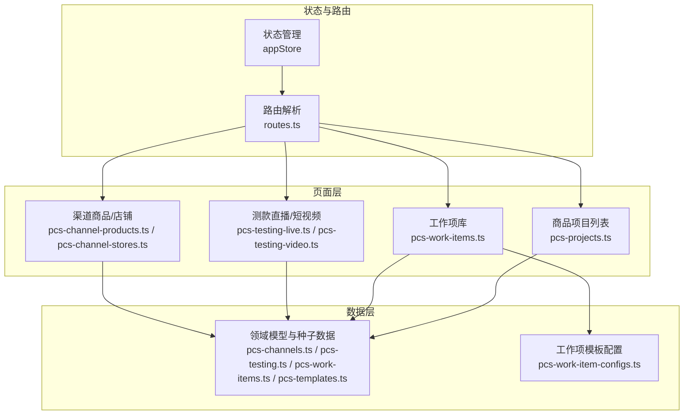
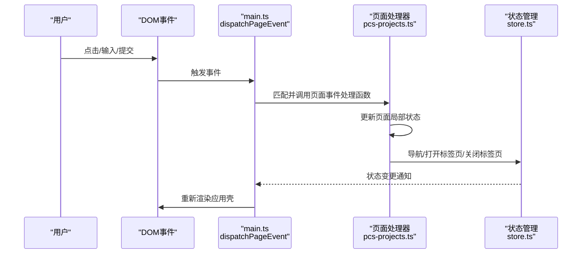
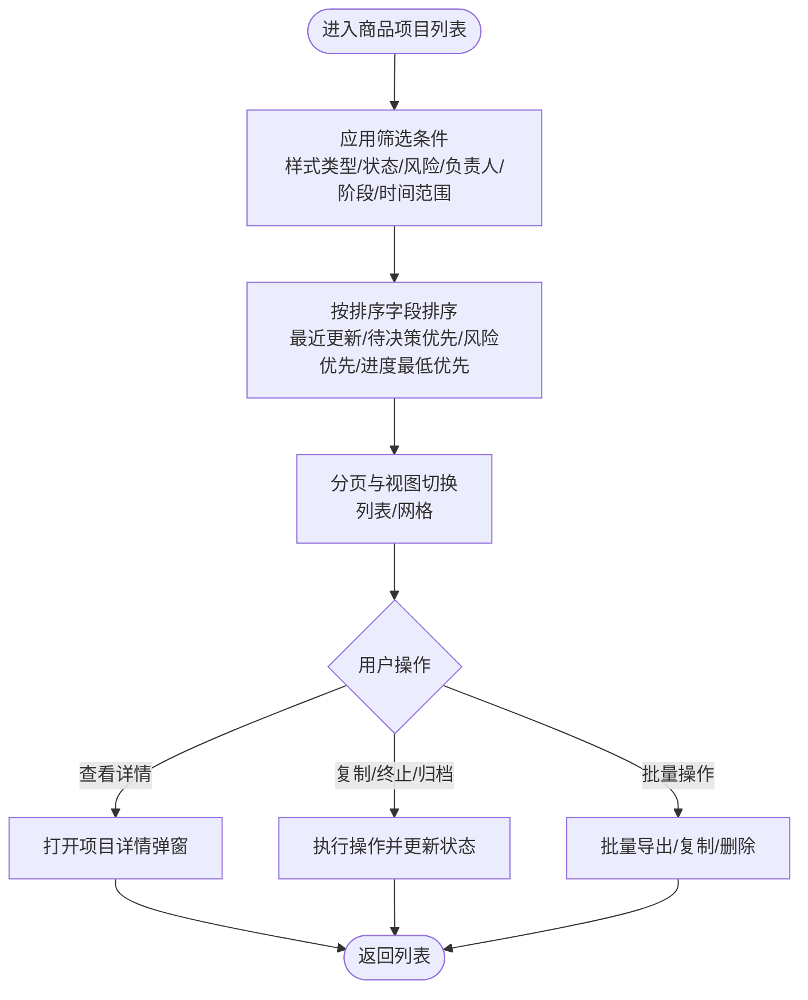
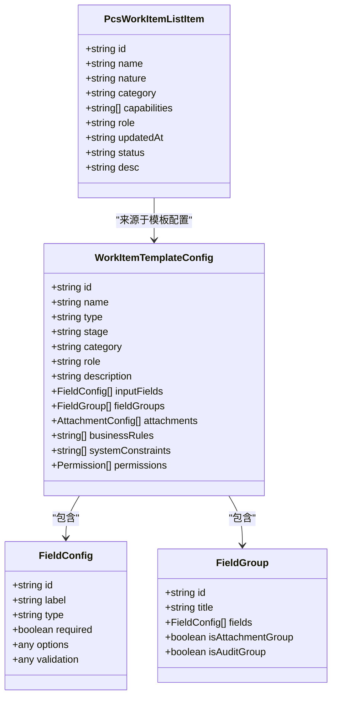
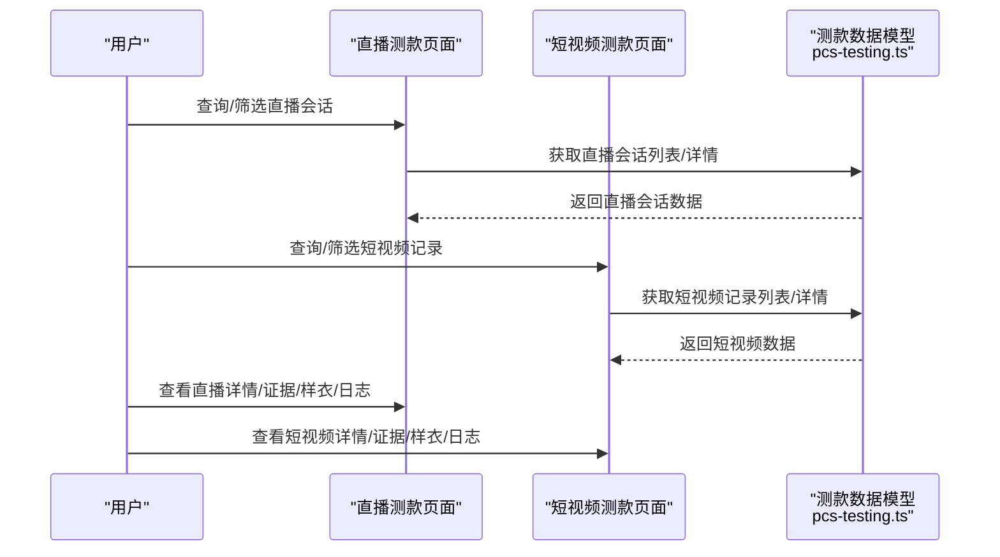
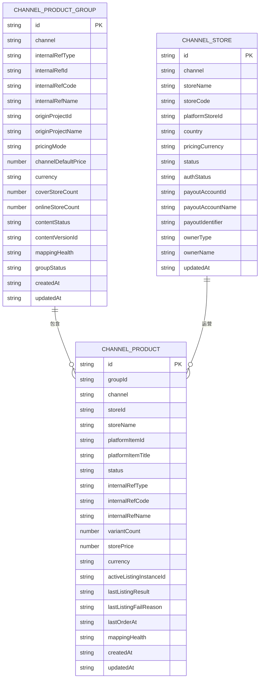
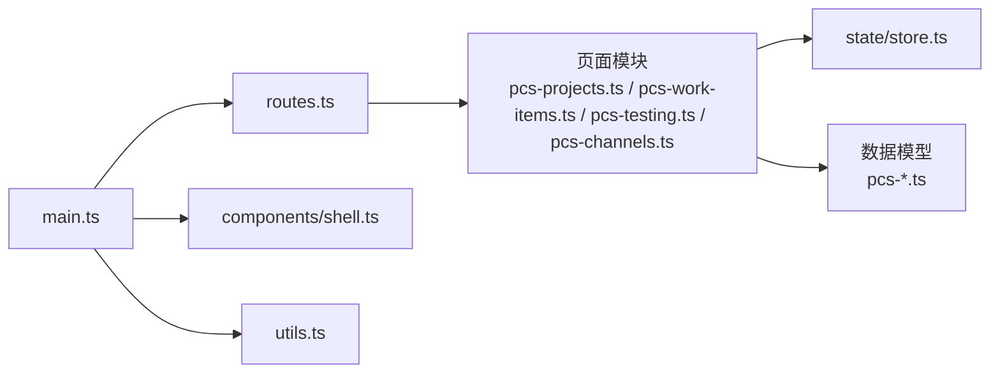

# PCS 商品中心系统

<cite>
**本文档引用的文件**
- [src/main.ts](file://src/main.ts)
- [src/state/store.ts](file://src/state/store.ts)
- [src/router/routes.ts](file://src/router/routes.ts)
- [src/components/shell.ts](file://src/components/shell.ts)
- [src/utils.ts](file://src/utils.ts)
- [src/data/pcs-channels.ts](file://src/data/pcs-channels.ts)
- [src/data/pcs-testing.ts](file://src/data/pcs-testing.ts)
- [src/data/pcs-work-items.ts](file://src/data/pcs-work-items.ts)
- [src/data/pcs-work-item-configs.ts](file://src/data/pcs-work-item-configs.ts)
- [src/data/pcs-templates.ts](file://src/data/pcs-templates.ts)
- [src/pages/pcs-projects.ts](file://src/pages/pcs-projects.ts)
- [src/pages/pcs-work-items.ts](file://src/pages/pcs-work-items.ts)
</cite>

## 目录
1. [简介](#简介)
2. [项目结构](#项目结构)
3. [核心组件](#核心组件)
4. [架构总览](#架构总览)
5. [详细组件分析](#详细组件分析)
6. [依赖分析](#依赖分析)
7. [性能考虑](#性能考虑)
8. [故障排除指南](#故障排除指南)
9. [结论](#结论)
10. [附录](#附录)

## 简介
PCS 商品中心系统是一个面向商品全生命周期管理的前端应用，围绕“商品项目管理、工作项库、测款管理、渠道管理、直播管理、短视频管理”等核心子系统构建。系统通过统一的状态管理与路由分发机制，提供商品立项、测款验证、渠道上架、直播短视频运营、样衣资产管理等能力，并与供应链、销售、财务等系统形成业务闭环。

## 项目结构
系统采用“数据层-页面层-路由层-状态层”的分层架构：
- 数据层：提供领域模型与种子数据，如商品渠道、测款会话、工作项模板等。
- 页面层：负责具体业务页面的渲染与事件处理，如商品项目列表、工作项库、测款直播/短视频等。
- 路由层：基于路径解析与菜单联动，支持静态路由与动态路由。
- 状态层：集中管理应用状态（导航、侧边栏、标签页等），并与页面事件解耦。

**图表来源**
- [src/state/store.ts:89-304](file://src/state/store.ts#L89-L304)
- [src/router/routes.ts:116-461](file://src/router/routes.ts#L116-L461)
- [src/pages/pcs-projects.ts:1-800](file://src/pages/pcs-projects.ts#L1-L800)
- [src/pages/pcs-work-items.ts:1-471](file://src/pages/pcs-work-items.ts#L1-L471)
- [src/data/pcs-channels.ts:1-960](file://src/data/pcs-channels.ts#L1-L960)
- [src/data/pcs-testing.ts:1-703](file://src/data/pcs-testing.ts#L1-L703)
- [src/data/pcs-work-items.ts:1-267](file://src/data/pcs-work-items.ts#L1-L267)
- [src/data/pcs-templates.ts:1-789](file://src/data/pcs-templates.ts#L1-L789)
- [src/data/pcs-work-item-configs.ts:1-800](file://src/data/pcs-work-item-configs.ts#L1-L800)

**章节来源**
- [src/main.ts:249-517](file://src/main.ts#L249-L517)
- [src/state/store.ts:1-329](file://src/state/store.ts#L1-L329)
- [src/router/routes.ts:1-462](file://src/router/routes.ts#L1-L462)

## 核心组件
- 应用壳与事件分发：统一的事件分发器，将 DOM 事件路由到各页面处理器，避免全局监听器爆炸。
- 状态管理：集中维护导航路径、侧边栏状态、标签页集合，支持跨页面状态共享。
- 路由系统：精确匹配与动态匹配结合，支持系统切换、菜单联动与占位页提示。
- 页面渲染：每个页面模块导出渲染函数与事件处理函数，遵循单一职责与可测试性。

**章节来源**
- [src/main.ts:259-339](file://src/main.ts#L259-L339)
- [src/state/store.ts:89-304](file://src/state/store.ts#L89-L304)
- [src/router/routes.ts:436-461](file://src/router/routes.ts#L436-L461)

## 架构总览
系统采用“事件驱动 + 状态驱动”的前端架构：
- 事件驱动：DOM 事件通过 dispatchPageEvent 分发到具体页面处理器，页面内部维护局部状态与渲染。
- 状态驱动：appStore 统一管理应用状态，页面通过 appStore.navigate/openTab/closeTab 等方法与状态交互。
- 路由驱动：routes.ts 将 URL 解析为页面渲染函数，支持静态路由与动态路由参数。

**图表来源**
- [src/main.ts:397-484](file://src/main.ts#L397-L484)
- [src/state/store.ts:172-269](file://src/state/store.ts#L172-L269)
- [src/pages/pcs-projects.ts:359-409](file://src/pages/pcs-projects.ts#L359-L409)

**章节来源**
- [src/main.ts:397-484](file://src/main.ts#L397-L484)
- [src/state/store.ts:172-269](file://src/state/store.ts#L172-L269)

## 详细组件分析

### 商品项目管理
- 功能概述：商品项目列表展示、筛选、排序、视图切换、项目详情、复制/终止/归档等操作。
- 关键数据模型：项目实体包含样式类型、分类、标签、进度、风险、负责人等字段；支持按样式类型、状态、风险、负责人、阶段、时间范围等多维过滤。
- 交互模式：支持关键词搜索、快速筛选、高级筛选、排序、分页；支持批量操作与详情弹窗。
- 业务规则：项目状态分为“进行中/已终止/已归档”，风险状态分为“正常/延期”，支持阻塞状态与门禁原因。

**图表来源**
- [src/pages/pcs-projects.ts:359-409](file://src/pages/pcs-projects.ts#L359-L409)
- [src/pages/pcs-projects.ts:411-428](file://src/pages/pcs-projects.ts#L411-L428)
- [src/pages/pcs-projects.ts:667-783](file://src/pages/pcs-projects.ts#L667-L783)

**章节来源**
- [src/pages/pcs-projects.ts:66-268](file://src/pages/pcs-projects.ts#L66-L268)
- [src/pages/pcs-projects.ts:359-409](file://src/pages/pcs-projects.ts#L359-L409)
- [src/pages/pcs-projects.ts:411-428](file://src/pages/pcs-projects.ts#L411-L428)
- [src/pages/pcs-projects.ts:667-783](file://src/pages/pcs-projects.ts#L667-L783)

### 工作项库与工作项模板
- 功能概述：工作项库列表展示、筛选、分页、启用/停用、复制、详情/编辑、模板化工作项。
- 关键数据模型：工作项实体包含性质（决策类/执行类）、能力（可复用/可多实例/可回退/可并行）、角色、描述等；模板配置定义字段类型、分组、附件、业务规则、权限等。
- 交互模式：支持关键词搜索、性质/角色/状态筛选、分页；支持对话框确认启用/停用；支持复制工作项生成新版本。
- 模板能力：模板配置支持字段类型（文本/数字/选择/日期/附件/级联/用户/团队/引用/布尔/JSON等）、条件显示/必填、计算字段、验证规则、状态流、回退规则、权限控制等。

**图表来源**
- [src/data/pcs-work-items.ts:10-30](file://src/data/pcs-work-items.ts#L10-L30)
- [src/data/pcs-work-item-configs.ts:4-63](file://src/data/pcs-work-item-configs.ts#L4-L63)
- [src/data/pcs-work-item-configs.ts:65-75](file://src/data/pcs-work-item-configs.ts#L65-L75)
- [src/data/pcs-work-item-configs.ts:77-86](file://src/data/pcs-work-item-configs.ts#L77-L86)

**章节来源**
- [src/pages/pcs-work-items.ts:1-471](file://src/pages/pcs-work-items.ts#L1-L471)
- [src/data/pcs-work-items.ts:1-267](file://src/data/pcs-work-items.ts#L1-L267)
- [src/data/pcs-work-item-configs.ts:95-158](file://src/data/pcs-work-item-configs.ts#L95-L158)

### 测款管理（直播与短视频）
- 功能概述：直播测款会话管理（草稿/核对中/已关账/已取消）、短视频测款记录管理、证据资产、样衣与日志。
- 关键数据模型：直播会话包含目的（测款/带货/复播/清仓/上新/内容）、账户/主播/站点、GMV/订单/曝光/点击/购物车等指标；短视频记录包含平台（TikTok/抖音/快手/其他）、创作者/发布者、播放/点赞/GMV 等指标。
- 交互模式：支持按目的/平台/状态/是否启用测款核算等筛选；支持分页与详情查看；支持证据素材上传与样衣管理。

**图表来源**
- [src/pages/pcs-testing-live.ts](file://src/pages/pcs-testing-live.ts)
- [src/pages/pcs-testing-video.ts](file://src/pages/pcs-testing-video.ts)
- [src/data/pcs-testing.ts:17-44](file://src/data/pcs-testing.ts#L17-L44)
- [src/data/pcs-testing.ts:84-106](file://src/data/pcs-testing.ts#L84-L106)

**章节来源**
- [src/data/pcs-testing.ts:1-703](file://src/data/pcs-testing.ts#L1-L703)

### 渠道管理（商品与店铺）
- 功能概述：渠道商品组/商品/变体管理、映射记录、订单追踪、日志、店铺与结算账户管理。
- 关键数据模型：渠道商品组包含定价模式（统一/店铺差异）、内容状态（草稿/已发布/归档）、覆盖/在线店铺数、映射健康度；商品包含状态（草稿/就绪/上架中/在售/已下架/受限/归档）、价格/货币、最后上架结果/失败原因等；店铺包含状态（启用/停用）、授权状态（已连接/已过期/连接错误）、结算账户等。
- 交互模式：支持按渠道/状态/映射健康度/定价模式等筛选；支持详情查看、映射管理、同步错误排查、结算账户绑定历史等。

**图表来源**
- [src/data/pcs-channels.ts:19-83](file://src/data/pcs-channels.ts#L19-L83)
- [src/data/pcs-channels.ts:163-179](file://src/data/pcs-channels.ts#L163-L179)
- [src/data/pcs-channels.ts:316-403](file://src/data/pcs-channels.ts#L316-L403)
- [src/data/pcs-channels.ts:418-552](file://src/data/pcs-channels.ts#L418-L552)
- [src/data/pcs-channels.ts:669-721](file://src/data/pcs-channels.ts#L669-L721)

**章节来源**
- [src/data/pcs-channels.ts:1-960](file://src/data/pcs-channels.ts#L1-L960)

### 样衣资产管理（演示态）
- 功能概述：样衣获取工作项支持外采/打样/借样/复刻等多方式，记录样衣编号、状态、物流、入库、库存等信息；支持回退与并行执行。
- 关键数据模型：样衣资产记录包含获取方式、用途、关联项目、申请人、数量/颜色/尺码组合、预计到货时间、快递公司/单号、到货确认人、入库仓库、库存记录等。
- 交互模式：支持条件必填字段（外采信息仅在获取方式=外采时显示）、状态流转（草稿→在途→已到库/已退回/已作废）、UI 建议（快递单号生成查询链接、样衣照片拖拽上传等）。

**章节来源**
- [src/data/pcs-work-item-configs.ts:410-668](file://src/data/pcs-work-item-configs.ts#L410-L668)

### 商品项目模板库
- 功能概述：项目模板库支持基础款/快时尚款/改版款/设计款四种风格类型，按阶段（立项获取/评估定价/市场测款/结论与推进/资产处置）组织工作项，支持模板启用/停用、复制、编辑。
- 关键数据模型：模板包含阶段与工作项集合，工作项包含类型（执行类/决策类/里程碑类/事实类）、角色、字段模板、备注等。
- 交互模式：支持按风格类型筛选、模板状态切换、复制模板生成副本并停用、编辑模板结构与字段。

**章节来源**
- [src/data/pcs-templates.ts:24-34](file://src/data/pcs-templates.ts#L24-L34)
- [src/data/pcs-templates.ts:66-120](file://src/data/pcs-templates.ts#L66-L120)
- [src/data/pcs-templates.ts:636-743](file://src/data/pcs-templates.ts#L636-L743)

## 依赖分析
- 页面到状态：页面通过 appStore.navigate/openTab/closeTab 等方法与状态交互，避免直接操作 DOM。
- 页面到路由：路由解析将 URL 映射到页面渲染函数，支持静态与动态路由。
- 页面到数据：页面依赖数据层提供的领域模型与种子数据，工作项库依赖模板配置。
- 事件到页面：main.ts 的事件分发器将 DOM 事件路由到具体页面处理器，减少重复监听器。

**图表来源**
- [src/main.ts:259-339](file://src/main.ts#L259-L339)
- [src/router/routes.ts:436-461](file://src/router/routes.ts#L436-L461)
- [src/state/store.ts:172-269](file://src/state/store.ts#L172-L269)

**章节来源**
- [src/main.ts:259-339](file://src/main.ts#L259-L339)
- [src/router/routes.ts:436-461](file://src/router/routes.ts#L436-L461)

## 性能考虑
- 事件分发去抖：通过 shouldBypassClickDispatch 避免对原生控件与字段输入触发全量重渲染，减少闪烁与焦点丢失。
- 状态持久化：标签页与侧边栏折叠状态本地存储，提升用户体验一致性。
- 分页与虚拟滚动：列表页面采用分页与条件渲染，避免一次性渲染大量节点。
- 模板与数据缓存：工作项模板与项目模板采用克隆策略，避免深拷贝开销；种子数据按需加载。

**章节来源**
- [src/main.ts:372-395](file://src/main.ts#L372-L395)
- [src/state/store.ts:30-56](file://src/state/store.ts#L30-L56)
- [src/pages/pcs-projects.ts:411-428](file://src/pages/pcs-projects.ts#L411-L428)

## 故障排除指南
- 页面无法渲染或空白：检查路由解析是否命中，确认 exactRoutes 与 dynamicRoutes 是否包含对应路径；若未命中，将返回占位页或 404。
- 事件无效：确认事件节点是否带有 data-* 属性，是否被 shouldBypassClickDispatch 捕获；检查页面事件处理函数返回值。
- 状态不同步：确认 appStore.navigate/openTab/closeTab 是否正确调用；检查标签页本地存储是否异常。
- 数据不更新：确认页面是否重新渲染（render），事件处理后是否调用 appStore.subscribe 订阅者刷新。

**章节来源**
- [src/router/routes.ts:436-461](file://src/router/routes.ts#L436-L461)
- [src/main.ts:397-484](file://src/main.ts#L397-L484)
- [src/state/store.ts:119-134](file://src/state/store.ts#L119-L134)

## 结论
PCS 商品中心系统以清晰的分层架构与事件驱动机制，实现了商品项目、工作项、测款、渠道等核心业务的前端管理。通过统一的状态管理与路由系统，系统具备良好的扩展性与可维护性。建议在后续迭代中完善真实 API 集成、权限控制与数据安全策略，并持续优化交互体验与性能表现。

## 附录
- 代码示例路径（不展示具体代码内容）：
  - 商品项目列表渲染与事件处理：[src/pages/pcs-projects.ts:359-409](file://src/pages/pcs-projects.ts#L359-L409)
  - 工作项库列表渲染与事件处理：[src/pages/pcs-work-items.ts:354-465](file://src/pages/pcs-work-items.ts#L354-L465)
  - 应用事件分发与渲染：[src/main.ts:259-339](file://src/main.ts#L259-L339)
  - 状态管理与标签页持久化：[src/state/store.ts:30-56](file://src/state/store.ts#L30-L56)
  - 路由解析与动态路由：[src/router/routes.ts:335-412](file://src/router/routes.ts#L335-L412)
  - 渠道商品数据模型：[src/data/pcs-channels.ts:19-83](file://src/data/pcs-channels.ts#L19-L83)
  - 测款直播/短视频数据模型：[src/data/pcs-testing.ts:17-44](file://src/data/pcs-testing.ts#L17-L44)
  - 工作项模板配置：[src/data/pcs-work-item-configs.ts:95-158](file://src/data/pcs-work-item-configs.ts#L95-L158)
  - 项目模板库：[src/data/pcs-templates.ts:66-120](file://src/data/pcs-templates.ts#L66-L120)