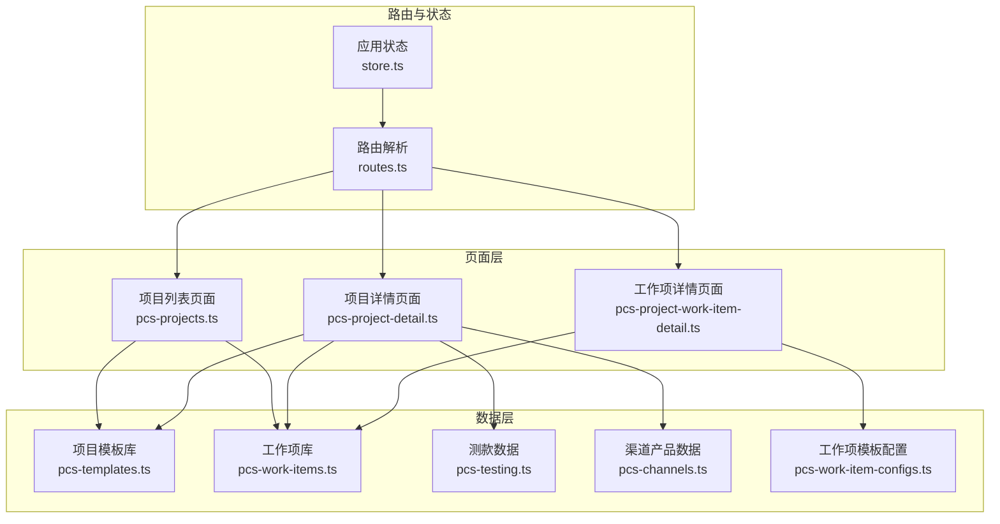
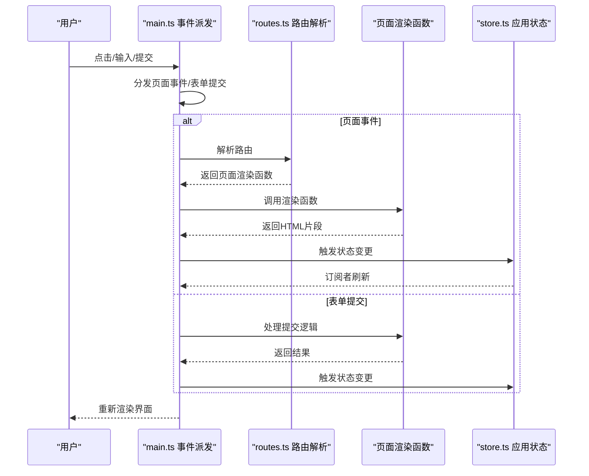
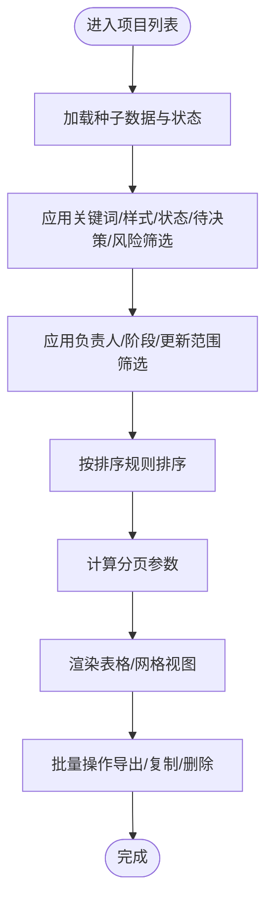
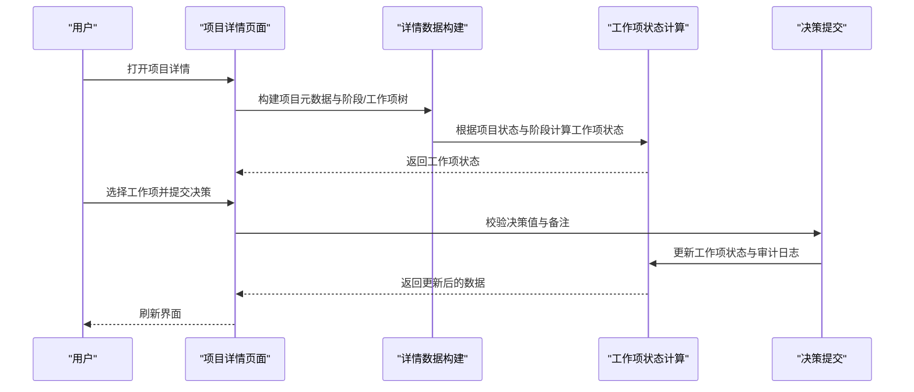
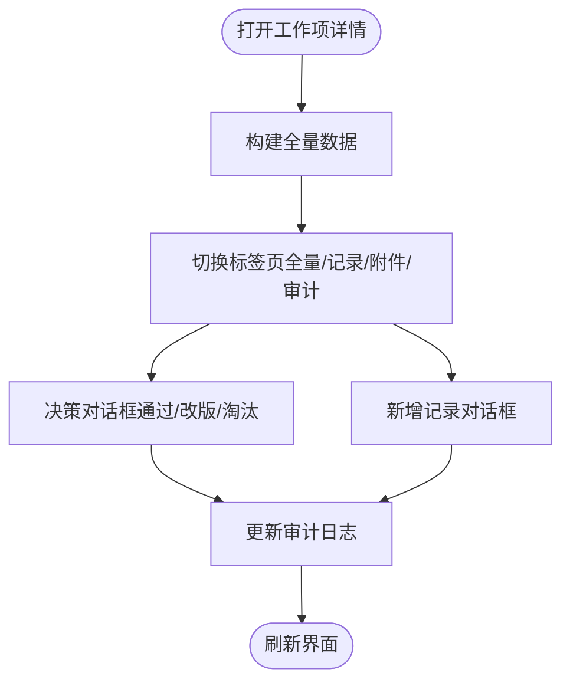
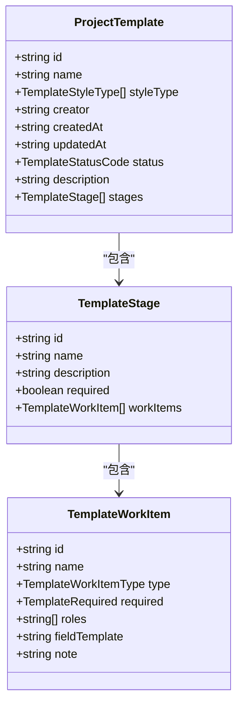
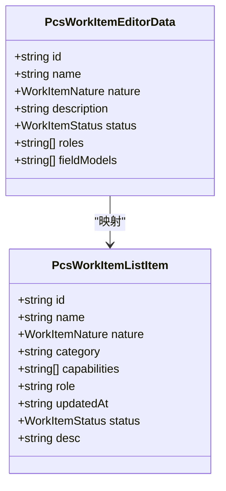
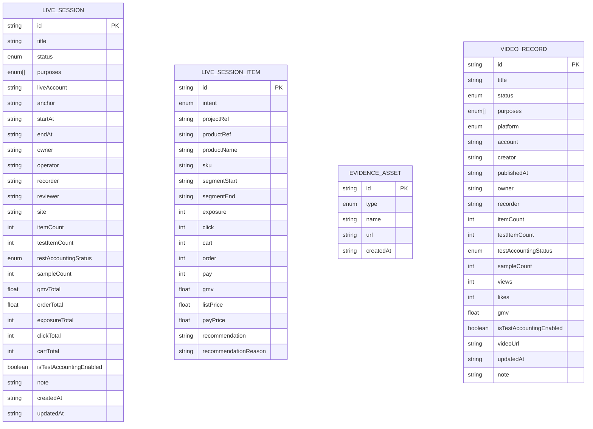
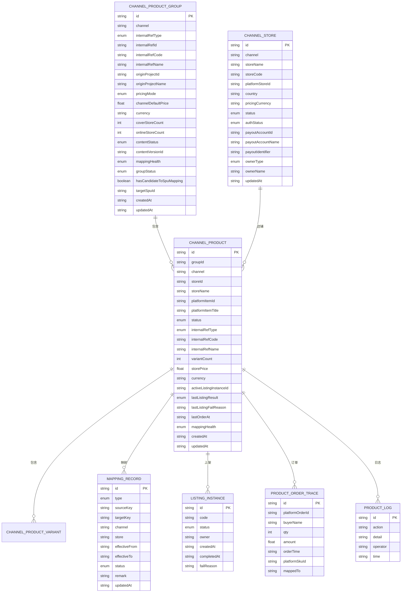
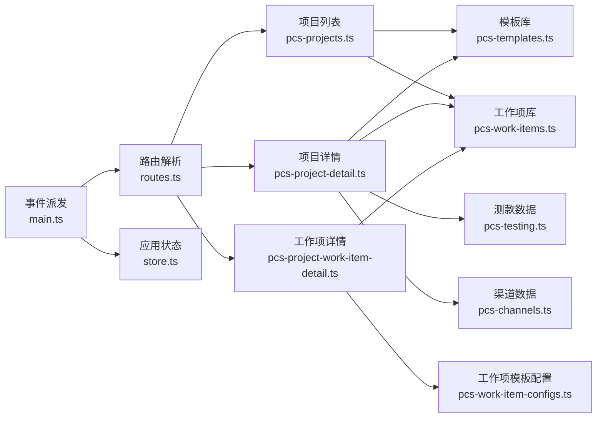

# 商品项目管理

<cite>
**本文档引用的文件**
- [src/pages/pcs-projects.ts](file://src/pages/pcs-projects.ts)
- [src/pages/pcs-project-detail.ts](file://src/pages/pcs-project-detail.ts)
- [src/pages/pcs-project-work-item-detail.ts](file://src/pages/pcs-project-work-item-detail.ts)
- [src/data/pcs-templates.ts](file://src/data/pcs-templates.ts)
- [src/data/pcs-work-items.ts](file://src/data/pcs-work-items.ts)
- [src/data/pcs-testing.ts](file://src/data/pcs-testing.ts)
- [src/data/pcs-channels.ts](file://src/data/pcs-channels.ts)
- [src/data/pcs-work-item-configs.ts](file://src/data/pcs-work-item-configs.ts)
- [src/router/routes.ts](file://src/router/routes.ts)
- [src/state/store.ts](file://src/state/store.ts)
- [src/main.ts](file://src/main.ts)
- [src/utils.ts](file://src/utils.ts)
</cite>

## 目录
1. [简介](#简介)
2. [项目结构](#项目结构)
3. [核心组件](#核心组件)
4. [架构总览](#架构总览)
5. [详细组件分析](#详细组件分析)
6. [依赖分析](#依赖分析)
7. [性能考虑](#性能考虑)
8. [故障排查指南](#故障排查指南)
9. [结论](#结论)
10. [附录](#附录)

## 简介
本技术文档围绕“商品项目管理”模块，系统性阐述项目创建、编辑、查询与管理工作流程，覆盖项目基本信息、项目模板配置、工作项关联、项目与工作项库、测款管理、渠道管理的关联关系，以及项目生命周期管理、批量操作与导出能力。文档以代码为依据，结合可视化图表与路径引用，帮助开发者与产品人员快速理解与扩展该模块。

## 项目结构
商品项目管理模块主要由以下层次构成：
- 页面层：项目列表、项目详情、工作项详情等页面逻辑与渲染函数
- 数据层：项目模板、工作项模板、测款数据、渠道产品数据等业务数据模型与工具方法
- 路由层：基于路径的静态与动态路由解析
- 状态层：应用状态与导航状态管理
- 事件分发层：页面事件与表单提交的统一派发机制

**图表来源**
- [src/pages/pcs-projects.ts](file://src/pages/pcs-projects.ts)
- [src/pages/pcs-project-detail.ts](file://src/pages/pcs-project-detail.ts)
- [src/pages/pcs-project-work-item-detail.ts](file://src/pages/pcs-project-work-item-detail.ts)
- [src/data/pcs-templates.ts](file://src/data/pcs-templates.ts)
- [src/data/pcs-work-items.ts](file://src/data/pcs-work-items.ts)
- [src/data/pcs-testing.ts](file://src/data/pcs-testing.ts)
- [src/data/pcs-channels.ts](file://src/data/pcs-channels.ts)
- [src/data/pcs-work-item-configs.ts](file://src/data/pcs-work-item-configs.ts)
- [src/router/routes.ts](file://src/router/routes.ts)
- [src/state/store.ts](file://src/state/store.ts)

**章节来源**
- [src/router/routes.ts](file://src/router/routes.ts)
- [src/state/store.ts](file://src/state/store.ts)

## 核心组件
- 项目列表页面：负责项目检索、过滤、排序、分页、视图切换、批量操作与导出
- 项目详情页面：负责项目元数据、阶段与工作项树、工作项状态与决策流程
- 工作项详情页面：负责工作项全量信息、记录、附件与引用、操作日志、决策与记录提交
- 项目模板库：提供模板列表、复制、启停、统计与阶段/工作项构建
- 工作项库：提供工作项列表、编辑器数据、角色与字段模型、创建/更新/复制/启停
- 测款数据：直播/短视频测款会话、明细、样衣、证据与日志
- 渠道产品数据：渠道/店铺/商品/变体/映射/上架实例/订单追踪/日志
- 路由与状态：静态/动态路由解析、页面事件派发、应用状态与导航

**章节来源**
- [src/pages/pcs-projects.ts](file://src/pages/pcs-projects.ts)
- [src/pages/pcs-project-detail.ts](file://src/pages/pcs-project-detail.ts)
- [src/pages/pcs-project-work-item-detail.ts](file://src/pages/pcs-project-work-item-detail.ts)
- [src/data/pcs-templates.ts](file://src/data/pcs-templates.ts)
- [src/data/pcs-work-items.ts](file://src/data/pcs-work-items.ts)
- [src/data/pcs-testing.ts](file://src/data/pcs-testing.ts)
- [src/data/pcs-channels.ts](file://src/data/pcs-channels.ts)
- [src/router/routes.ts](file://src/router/routes.ts)
- [src/state/store.ts](file://src/state/store.ts)

## 架构总览
商品项目管理采用“页面-数据-路由-状态”的分层架构，页面通过统一事件派发与状态管理实现交互，数据层提供模板与业务数据，路由层负责页面解析与导航。

**图表来源**
- [src/main.ts](file://src/main.ts)
- [src/router/routes.ts](file://src/router/routes.ts)
- [src/state/store.ts](file://src/state/store.ts)

**章节来源**
- [src/main.ts](file://src/main.ts)
- [src/router/routes.ts](file://src/router/routes.ts)
- [src/state/store.ts](file://src/state/store.ts)

## 详细组件分析

### 项目列表页面（项目检索、过滤、排序、分页、视图切换、批量操作）
- 关键职责
  - 项目检索与过滤：关键词、样式类型、状态、待决策、风险、负责人、阶段、更新时间范围
  - 排序：按最近更新、待决策优先、风险优先、进度最低优先
  - 分页：计算总条数、页码、起止索引
  - 视图切换：网格/列表模式
  - 批量操作：批量导出、批量复制、批量删除
- 数据模型
  - 项目实体包含：编码、名称、样式类型、分类、标签、状态、SPU、阶段、进度、下一步工作项、风险状态、负责人、更新时间等
  - 状态包含：进行中、已终止、已归档
  - 风险状态包含：正常、延期
- 交互流程
  - 输入关键词与筛选条件，触发查询
  - 支持切换视图模式与排序方式
  - 支持全选/反选与批量操作
  - 支持重置筛选与高级筛选展开/收起

**图表来源**
- [src/pages/pcs-projects.ts](file://src/pages/pcs-projects.ts)

**章节来源**
- [src/pages/pcs-projects.ts](file://src/pages/pcs-projects.ts)

### 项目详情页面（项目元数据、阶段与工作项树、工作项状态与决策）
- 关键职责
  - 展示项目元数据（编码、名称、状态、样式类型、分类、标签、负责人、最后更新、阶段）
  - 构建阶段与工作项树，按项目当前阶段与状态动态计算工作项状态
  - 支持工作项展开/折叠、状态变更、决策提交
- 数据模型
  - 阶段：阶段ID、编号、名称、描述、工作项列表
  - 工作项：工作项ID、名称、性质（执行/决策）、状态、阶段ID、负责人、更新时间、摘要、多实例KPI与记录
  - 日志：状态变更、工作项、决策记录
- 决策流程
  - 对于“测款结论判定”等决策类工作项，支持通过/改版/淘汰三种结论
  - 提交后更新工作项状态与审计日志

**图表来源**
- [src/pages/pcs-project-detail.ts](file://src/pages/pcs-project-detail.ts)

**章节来源**
- [src/pages/pcs-project-detail.ts](file://src/pages/pcs-project-detail.ts)

### 工作项详情页面（全量信息、记录、附件与引用、操作日志、决策与记录提交）
- 关键职责
  - 全量信息：按工作项类型渲染字段与表格
  - 记录：支持新增记录（演示态），展示历史记录
  - 附件与引用：附件列表与下载、外部链接打开
  - 操作日志：审计轨迹
  - 决策与记录提交：提交决策与新增记录，更新审计日志
- 数据模型
  - 全量数据：字段分组、表格、附件、链接、审计
  - 记录：标题、摘要、时间
  - 附件：名称、类型、时间
  - 链接：名称、URL
  - 审计：时间、动作、操作人、备注

**图表来源**
- [src/pages/pcs-project-work-item-detail.ts](file://src/pages/pcs-project-work-item-detail.ts)

**章节来源**
- [src/pages/pcs-project-work-item-detail.ts](file://src/pages/pcs-project-work-item-detail.ts)

### 项目模板配置（模板列表、复制、启停、统计与阶段/工作项构建）
- 关键职责
  - 模板列表：名称、样式类型、创建者、创建/更新时间、状态、描述
  - 模板复制：复制并停用
  - 模板启停：切换状态
  - 统计：统计阶段数与工作项总数
  - 阶段与工作项：构建阶段ID/工作项ID，支持空阶段与空工作项占位
- 数据模型
  - 模板：ID、名称、样式类型数组、创建者、创建/更新时间、状态、描述、阶段列表
  - 阶段：ID、名称、描述、是否必做、工作项列表
  - 工作项：ID、名称、类型、是否必做、角色、字段模板、备注

**图表来源**
- [src/data/pcs-templates.ts](file://src/data/pcs-templates.ts)

**章节来源**
- [src/data/pcs-templates.ts](file://src/data/pcs-templates.ts)

### 工作项库（工作项列表、编辑器数据、角色与字段模型、创建/更新/复制/启停）
- 关键职责
  - 列表：ID、名称、性质、分类、能力、角色、更新时间、状态、描述
  - 编辑器数据：名称、性质、描述、状态、角色、字段模型
  - 角色与字段模型推断：从模板配置中提取
  - 创建/更新/复制/启停：维护工作项元数据与模板元数据
- 数据模型
  - 工作项：ID、名称、性质、分类、能力、角色、更新时间、状态、描述
  - 编辑器数据：ID、名称、性质、描述、状态、角色、字段模型
  - 元数据：角色数组、字段模型数组

**图表来源**
- [src/data/pcs-work-items.ts](file://src/data/pcs-work-items.ts)

**章节来源**
- [src/data/pcs-work-items.ts](file://src/data/pcs-work-items.ts)

### 测款管理（直播/短视频测款会话、明细、样衣、证据与日志）
- 关键职责
  - 直播会话：状态、目的、主播、开始/结束时间、样衣数量、GMV/订单/曝光/点击/购物车等指标
  - 直播明细：项目/产品/SKU、曝光/点击/购物车/订单/支付/GMV、推荐与原因
  - 直播样衣：样衣编号、站点、状态、位置、持有者
  - 直播日志：操作时间、动作、用户、详情
  - 短视频记录：状态、目的、平台、账号、发布时间、指标、视频链接
  - 短视频明细/证据/样衣/日志：同直播对应结构
- 数据模型
  - 直播会话、明细、样衣、日志
  - 短视频记录、明细、证据、样衣、日志

**图表来源**
- [src/data/pcs-testing.ts](file://src/data/pcs-testing.ts)

**章节来源**
- [src/data/pcs-testing.ts](file://src/data/pcs-testing.ts)

### 渠道管理（渠道/店铺/商品/变体/映射/上架实例/订单追踪/日志）
- 关键职责
  - 渠道与店铺：渠道选项、店铺选项、认证状态、结算账户
  - 商品组与商品：商品组状态、映射健康度、商品状态、变体映射状态
  - 上架实例：上架状态、失败原因
  - 订单追踪：平台订单号、买家、数量、金额、时间、SKU映射
  - 映射记录：映射类型、源/目标键、生效时间、状态、备注
  - 日志：操作时间、动作、操作人、详情
- 数据模型
  - 渠道产品组、项目来源、渠道产品、变体、映射记录、上架实例、订单追踪、日志

**图表来源**
- [src/data/pcs-channels.ts](file://src/data/pcs-channels.ts)

**章节来源**
- [src/data/pcs-channels.ts](file://src/data/pcs-channels.ts)

## 依赖分析
- 页面到数据层
  - 项目列表依赖模板库与工作项库进行筛选与排序
  - 项目详情依赖模板库与工作项库构建阶段/工作项树
  - 工作项详情依赖工作项模板配置与测款/渠道数据
- 路由与状态
  - 路由解析静态与动态路径，页面事件统一派发
  - 应用状态管理导航、标签页与侧边栏状态

**图表来源**
- [src/pages/pcs-projects.ts](file://src/pages/pcs-projects.ts)
- [src/pages/pcs-project-detail.ts](file://src/pages/pcs-project-detail.ts)
- [src/pages/pcs-project-work-item-detail.ts](file://src/pages/pcs-project-work-item-detail.ts)
- [src/data/pcs-templates.ts](file://src/data/pcs-templates.ts)
- [src/data/pcs-work-items.ts](file://src/data/pcs-work-items.ts)
- [src/data/pcs-testing.ts](file://src/data/pcs-testing.ts)
- [src/data/pcs-channels.ts](file://src/data/pcs-channels.ts)
- [src/data/pcs-work-item-configs.ts](file://src/data/pcs-work-item-configs.ts)
- [src/router/routes.ts](file://src/router/routes.ts)
- [src/main.ts](file://src/main.ts)
- [src/state/store.ts](file://src/state/store.ts)

**章节来源**
- [src/router/routes.ts](file://src/router/routes.ts)
- [src/main.ts](file://src/main.ts)
- [src/state/store.ts](file://src/state/store.ts)

## 性能考虑
- 列表渲染优化
  - 使用分页减少一次性渲染的数据量
  - 过滤与排序在内存中进行，建议限制种子数据规模或引入服务端分页
- 状态更新
  - 事件派发与状态变更最小化重渲染，避免不必要的全量重绘
- 数据克隆
  - 深拷贝用于避免共享引用导致的状态污染，注意在大数据量场景下的性能开销

## 故障排查指南
- 页面无法渲染或空白
  - 检查路由解析是否命中正确页面渲染函数
  - 检查事件派发是否拦截了必要的点击/输入/提交事件
- 项目详情/工作项详情状态异常
  - 检查项目状态与阶段映射逻辑是否正确
  - 检查工作项状态计算与决策提交逻辑
- 测款/渠道数据不一致
  - 检查数据克隆与只读字段设置
  - 检查映射记录与上架实例状态一致性

**章节来源**
- [src/main.ts](file://src/main.ts)
- [src/pages/pcs-project-detail.ts](file://src/pages/pcs-project-detail.ts)
- [src/pages/pcs-project-work-item-detail.ts](file://src/pages/pcs-project-work-item-detail.ts)
- [src/data/pcs-testing.ts](file://src/data/pcs-testing.ts)
- [src/data/pcs-channels.ts](file://src/data/pcs-channels.ts)

## 结论
商品项目管理模块通过清晰的分层架构与完善的页面/数据/路由/状态协同，实现了从项目创建、模板配置、工作项关联到测款与渠道对接的全链路管理。模块具备良好的可扩展性与可维护性，适合在现有基础上持续演进与扩展。

## 附录
- 代码示例路径（用于定位具体实现）
  - 项目列表页面：[项目列表渲染与交互](file://src/pages/pcs-projects.ts)
  - 项目详情页面：[项目详情构建与工作项状态计算](file://src/pages/pcs-project-detail.ts)
  - 工作项详情页面：[工作项全量信息与决策提交](file://src/pages/pcs-project-work-item-detail.ts)
  - 项目模板配置：[模板列表、复制、启停与统计](file://src/data/pcs-templates.ts)
  - 工作项库：[工作项列表与编辑器数据](file://src/data/pcs-work-items.ts)
  - 测款数据：[直播/短视频会话与明细](file://src/data/pcs-testing.ts)
  - 渠道产品数据：[渠道/店铺/商品/变体/映射/上架/订单/日志](file://src/data/pcs-channels.ts)
  - 路由与状态：[路由解析与事件派发](file://src/router/routes.ts), [应用状态管理](file://src/state/store.ts)
  - 工具函数：[HTML转义与类名拼接](file://src/utils.ts)