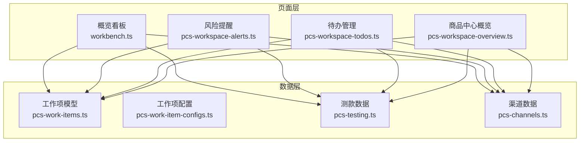
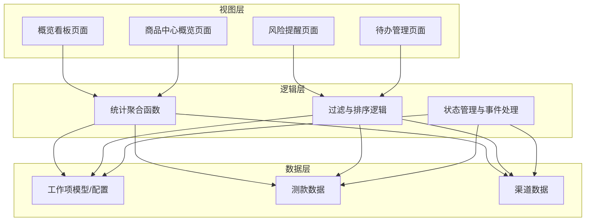
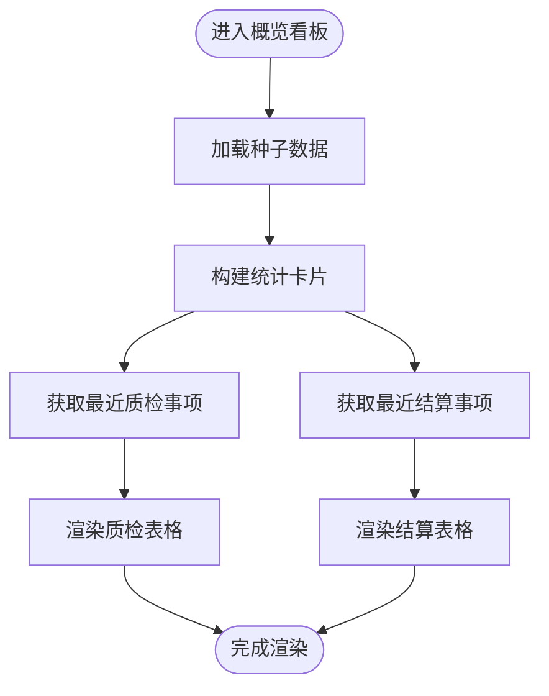
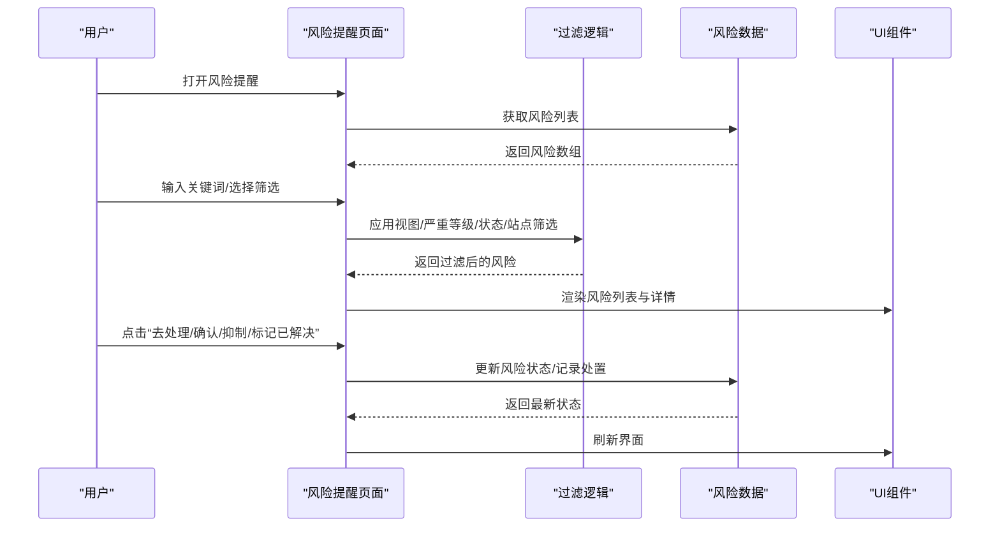
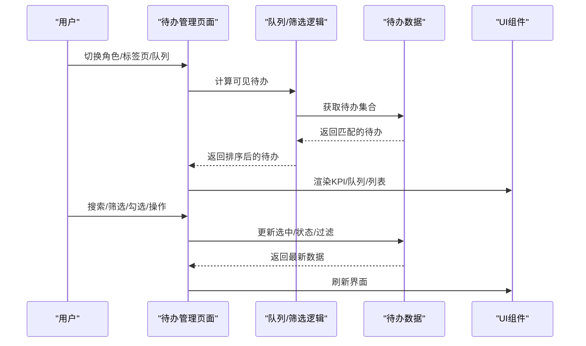
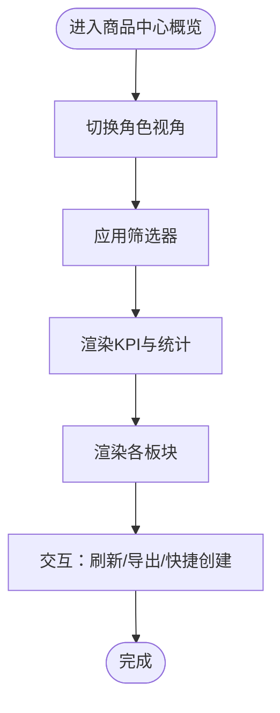
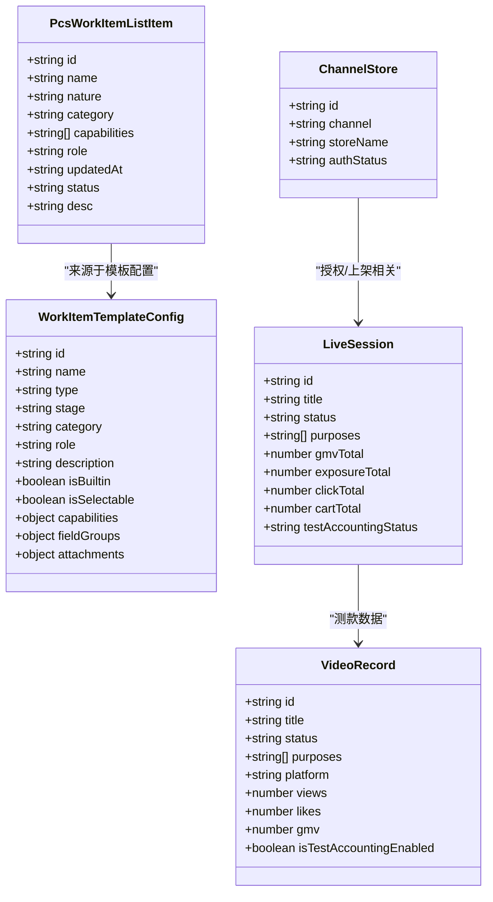
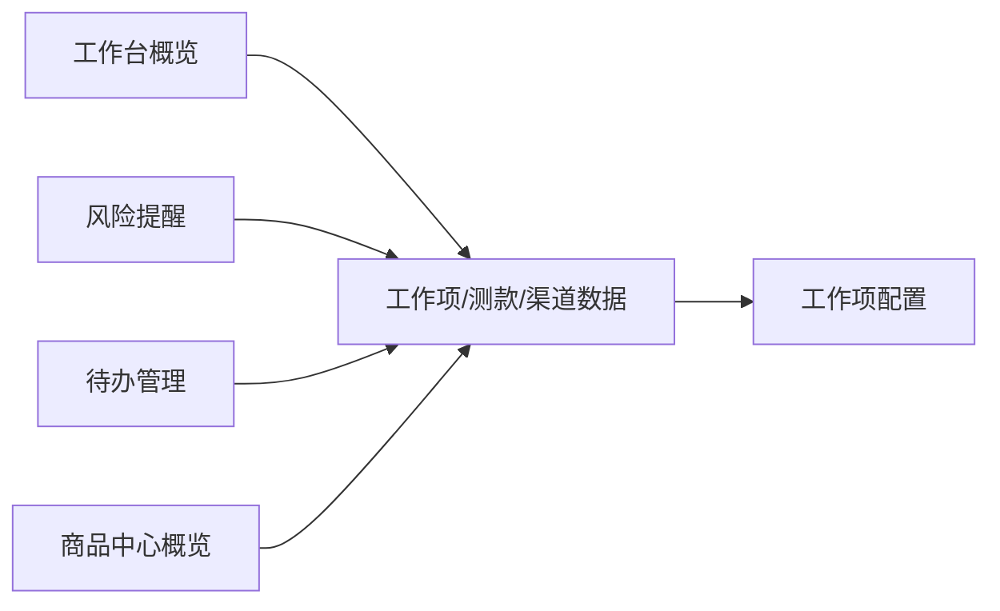

# 工作台管理

<cite>
**本文档引用的文件**
- [workbench.ts](file://src/pages/workbench.ts)
- [pcs-workspace-overview.ts](file://src/pages/pcs-workspace-overview.ts)
- [pcs-workspace-alerts.ts](file://src/pages/pcs-workspace-alerts.ts)
- [pcs-workspace-todos.ts](file://src/pages/pcs-workspace-todos.ts)
- [pcs-work-items.ts](file://src/data/pcs-work-items.ts)
- [pcs-work-item-configs.ts](file://src/data/pcs-work-item-configs.ts)
- [pcs-testing.ts](file://src/data/pcs-testing.ts)
- [pcs-channels.ts](file://src/data/pcs-channels.ts)
</cite>

## 目录
1. [简介](#简介)
2. [项目结构](#项目结构)
3. [核心组件](#核心组件)
4. [架构总览](#架构总览)
5. [详细组件分析](#详细组件分析)
6. [依赖分析](#依赖分析)
7. [性能考虑](#性能考虑)
8. [故障排查指南](#故障排查指南)
9. [结论](#结论)
10. [附录](#附录)

## 简介
本文件面向“工作台管理”模块，系统化梳理概览看板、风险提醒与待办管理三大功能域，覆盖数据统计、预警机制、任务提醒、个性化配置、通知设置与报表导出等能力。文档以代码为依据，结合数据模型与业务模块关联关系，提供可视化架构图、流程图与类图，帮助开发者快速理解与扩展。

## 项目结构
工作台管理相关代码主要位于以下位置：
- 页面渲染与交互：src/pages 下的概览、风险、待办页面
- 数据模型与种子数据：src/data 下的工作项、测款、渠道等模块
- 通用工具与状态：utils、state 等

**图表来源**
- [workbench.ts](file://src/pages/workbench.ts)
- [pcs-workspace-alerts.ts](file://src/pages/pcs-workspace-alerts.ts)
- [pcs-workspace-todos.ts](file://src/pages/pcs-workspace-todos.ts)
- [pcs-workspace-overview.ts](file://src/pages/pcs-workspace-overview.ts)
- [pcs-work-items.ts](file://src/data/pcs-work-items.ts)
- [pcs-work-item-configs.ts](file://src/data/pcs-work-item-configs.ts)
- [pcs-testing.ts](file://src/data/pcs-testing.ts)
- [pcs-channels.ts](file://src/data/pcs-channels.ts)

**章节来源**
- [workbench.ts](file://src/pages/workbench.ts)
- [pcs-workspace-overview.ts](file://src/pages/pcs-workspace-overview.ts)
- [pcs-workspace-alerts.ts](file://src/pages/pcs-workspace-alerts.ts)
- [pcs-workspace-todos.ts](file://src/pages/pcs-workspace-todos.ts)
- [pcs-work-items.ts](file://src/data/pcs-work-items.ts)
- [pcs-work-item-configs.ts](file://src/data/pcs-work-item-configs.ts)
- [pcs-testing.ts](file://src/data/pcs-testing.ts)
- [pcs-channels.ts](file://src/data/pcs-channels.ts)

## 核心组件
- 概览看板：聚合核心运营指标、近期质检与结算事项，支持卡片式统计与表格展示。
- 风险提醒：基于业务规则与阈值生成风险清单，支持分级、筛选与处置流程。
- 待办管理：按角色与队列聚合待办任务，支持搜索、筛选、优先级排序与批量操作。
- 商品中心概览：面向商品中心的全链路看板，包含项目阶段、样衣资产、渠道健康与异常监控。

**章节来源**
- [workbench.ts](file://src/pages/workbench.ts)
- [pcs-workspace-alerts.ts](file://src/pages/pcs-workspace-alerts.ts)
- [pcs-workspace-todos.ts](file://src/pages/pcs-workspace-todos.ts)
- [pcs-workspace-overview.ts](file://src/pages/pcs-workspace-overview.ts)

## 架构总览
工作台管理采用“页面渲染 + 数据模型 + 种子数据”的分层架构。页面通过函数式渲染构建视图，数据模型提供结构化类型与方法，种子数据提供演示态数据源。风险与待办均支持过滤、排序与状态管理；概览看板通过聚合函数生成统计卡片与表格行。

**图表来源**
- [workbench.ts](file://src/pages/workbench.ts)
- [pcs-workspace-alerts.ts](file://src/pages/pcs-workspace-alerts.ts)
- [pcs-workspace-todos.ts](file://src/pages/pcs-workspace-todos.ts)
- [pcs-workspace-overview.ts](file://src/pages/pcs-workspace-overview.ts)
- [pcs-work-items.ts](file://src/data/pcs-work-items.ts)
- [pcs-testing.ts](file://src/data/pcs-testing.ts)
- [pcs-channels.ts](file://src/data/pcs-channels.ts)

## 详细组件分析

### 概览看板（工作台）
- 统计卡片：生产任务总数、当前暂不能继续任务数、质检未结案数、争议中数、可进入结算依据数、冻结中依据数、对账单草稿数、处理中结算批次数。
- 近期事项：最近质检事项与最近结算事项的表格，支持跳转到详情页。
- 渲染函数：renderOverviewPage、statCard、renderSectionTable。
- 数据来源：processTasks、initialQualityInspections、initialStatementDrafts、initialSettlementBatches、initialDyePrintOrders 等种子数据。

**图表来源**
- [workbench.ts](file://src/pages/workbench.ts)

**章节来源**
- [workbench.ts](file://src/pages/workbench.ts)

### 风险提醒（工作台）
- 风险类型：当前暂不能继续、争议冻结、质检超期、返工未完成、对账单滞留。
- 风险生成：buildRisks 基于任务阻塞、争议、超期、返工与对账单滞留阈值生成。
- 视图与交互：KPI 卡片、筛选器（视图、严重等级、状态、站点）、风险列表、详情抽屉、处置动作（确认、去处理、分派、抑制、标记已解决）。
- 事件处理：handlePcsAlertsEvent（刷新、导出、规则配置、搜索、筛选、状态变更等）。

**图表来源**
- [pcs-workspace-alerts.ts](file://src/pages/pcs-workspace-alerts.ts)

**章节来源**
- [pcs-workspace-alerts.ts](file://src/pages/pcs-workspace-alerts.ts)

### 待办管理（工作台）
- 待办类型：工作项、审核、样衣、上架、店铺授权、映射、入账。
- 队列导航：P0 紧急、今日到期、本周到期、待我审核、待到样签收、待核对入库、待寄出、待签收、待处置、退货处理中、授权异常、上架失败、上架中待跟进、映射异常、直播待入账、短视频待入账、测款结论待决策。
- 视图与交互：KPI 统计、标签页切换、搜索与筛选、队列面板、待办列表、详情抽屉、批量选择与操作。
- 事件处理：handlePcsTodosEvent（角色切换、搜索、筛选、队列切换、刷新、导出、配置等）。

**图表来源**
- [pcs-workspace-todos.ts](file://src/pages/pcs-workspace-todos.ts)

**章节来源**
- [pcs-workspace-todos.ts](file://src/pages/pcs-workspace-todos.ts)

### 商品中心概览（PCS）
- 角色视角：我的概览、管理概览、仓管概览、渠道概览、测款概览。
- 关键板块：异常监控、我的待办、项目阶段分布、工作项状态看板、风险项目、样衣资产分布、仓管待处理、超期未归还样衣、店铺授权、上架推进、映射与内容入账。
- 交互：角色切换、筛选器、刷新、导出、快捷创建。

**图表来源**
- [pcs-workspace-overview.ts](file://src/pages/pcs-workspace-overview.ts)

**章节来源**
- [pcs-workspace-overview.ts](file://src/pages/pcs-workspace-overview.ts)

### 数据模型与业务关联
- 工作项模型：提供工作项列表、编辑数据、模板配置、能力与字段模型推导、增删改查接口。
- 测款数据：直播场次、短视频记录、入账状态、目的类型、证据资产、日志等。
- 渠道数据：渠道商店、商品组、商品、变体、映射记录、授权状态、结算账户等。

**图表来源**
- [pcs-work-items.ts](file://src/data/pcs-work-items.ts)
- [pcs-work-item-configs.ts](file://src/data/pcs-work-item-configs.ts)
- [pcs-testing.ts](file://src/data/pcs-testing.ts)
- [pcs-channels.ts](file://src/data/pcs-channels.ts)

**章节来源**
- [pcs-work-items.ts](file://src/data/pcs-work-items.ts)
- [pcs-work-item-configs.ts](file://src/data/pcs-work-item-configs.ts)
- [pcs-testing.ts](file://src/data/pcs-testing.ts)
- [pcs-channels.ts](file://src/data/pcs-channels.ts)

## 依赖分析
- 页面到数据：概览看板依赖工作项、测款与渠道数据；风险与待办同样依赖上述数据；商品中心概览复用相同数据模型。
- 事件驱动：风险与待办页面通过事件处理器集中处理交互，降低页面复杂度。
- 可扩展性：工作项配置支持字段类型、分组、附件、权限、业务规则等，便于扩展新的工作流。

**图表来源**
- [workbench.ts](file://src/pages/workbench.ts)
- [pcs-workspace-alerts.ts](file://src/pages/pcs-workspace-alerts.ts)
- [pcs-workspace-todos.ts](file://src/pages/pcs-workspace-todos.ts)
- [pcs-workspace-overview.ts](file://src/pages/pcs-workspace-overview.ts)
- [pcs-work-items.ts](file://src/data/pcs-work-items.ts)
- [pcs-work-item-configs.ts](file://src/data/pcs-work-item-configs.ts)
- [pcs-testing.ts](file://src/data/pcs-testing.ts)
- [pcs-channels.ts](file://src/data/pcs-channels.ts)

**章节来源**
- [workbench.ts](file://src/pages/workbench.ts)
- [pcs-workspace-alerts.ts](file://src/pages/pcs-workspace-alerts.ts)
- [pcs-workspace-todos.ts](file://src/pages/pcs-workspace-todos.ts)
- [pcs-workspace-overview.ts](file://src/pages/pcs-workspace-overview.ts)
- [pcs-work-items.ts](file://src/data/pcs-work-items.ts)
- [pcs-work-item-configs.ts](file://src/data/pcs-work-item-configs.ts)
- [pcs-testing.ts](file://src/data/pcs-testing.ts)
- [pcs-channels.ts](file://src/data/pcs-channels.ts)

## 性能考虑
- 渲染优化：页面采用函数式渲染，避免不必要的 DOM 重建；列表渲染时使用稳定的 key 与分页策略。
- 过滤与排序：在内存中进行，建议限制数据规模或引入虚拟滚动；对高频搜索场景可增加防抖。
- 状态管理：事件处理器集中处理交互，减少页面状态分散带来的重绘；对批量操作建议使用批处理与增量更新。
- 数据加载：种子数据适合演示，生产环境建议通过 API 分页加载与缓存策略降低前端压力。

## 故障排查指南
- 风险提醒页面
  - 症状：风险列表为空或筛选无效
  - 排查：检查筛选器状态、关键词匹配、视图权限（我负责/我协同/全部可见）
  - 相关路径：[pcs-workspace-alerts.ts](file://src/pages/pcs-workspace-alerts.ts)
- 待办管理页面
  - 症状：队列计数不正确或待办不显示
  - 排查：确认角色与队列权限、类型/优先级/站点筛选、搜索关键词
  - 相关路径：[pcs-workspace-todos.ts](file://src/pages/pcs-workspace-todos.ts)
- 概览看板
  - 症状：统计卡片数值异常
  - 排查：核对种子数据与聚合逻辑（如阻塞任务、争议数、对账单草稿等）
  - 相关路径：[workbench.ts](file://src/pages/workbench.ts)
- 商品中心概览
  - 症状：板块数据不更新
  - 排查：检查角色切换、筛选器与刷新按钮
  - 相关路径：[pcs-workspace-overview.ts](file://src/pages/pcs-workspace-overview.ts)

**章节来源**
- [pcs-workspace-alerts.ts](file://src/pages/pcs-workspace-alerts.ts)
- [pcs-workspace-todos.ts](file://src/pages/pcs-workspace-todos.ts)
- [workbench.ts](file://src/pages/workbench.ts)
- [pcs-workspace-overview.ts](file://src/pages/pcs-workspace-overview.ts)

## 结论
工作台管理模块通过清晰的分层设计与数据模型，实现了概览、风险与待办的统一入口。其事件驱动与可配置特性为后续扩展提供了良好基础。建议在生产环境中引入分页加载、缓存与实时订阅机制，进一步提升性能与用户体验。

## 附录
- 个性化配置
  - 风险提醒：支持视图模式（我负责/我协同/全部可见）、严重等级、状态、站点筛选与规则配置入口。
  - 待办管理：支持角色切换、标签页、队列导航、搜索与筛选、组件显示开关。
  - 商品中心概览：支持角色视角、筛选器、快捷创建与导出。
- 通知设置
  - 风险提醒与待办管理均提供“刷新/导出/规则配置/快捷创建”等交互入口，便于用户管理通知与任务。
- 报表导出
  - 风险提醒与商品中心概览提供导出入口，页面会提示导出任务已创建，引导用户前往下载中心查看。

**章节来源**
- [pcs-workspace-alerts.ts](file://src/pages/pcs-workspace-alerts.ts)
- [pcs-workspace-todos.ts](file://src/pages/pcs-workspace-todos.ts)
- [pcs-workspace-overview.ts](file://src/pages/pcs-workspace-overview.ts)