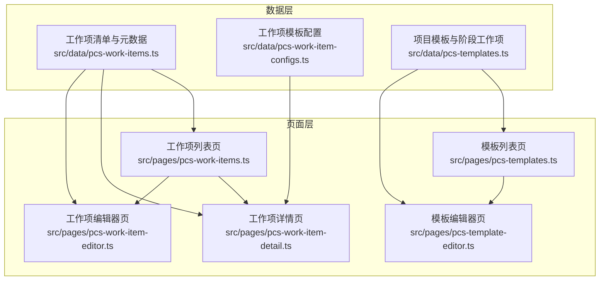
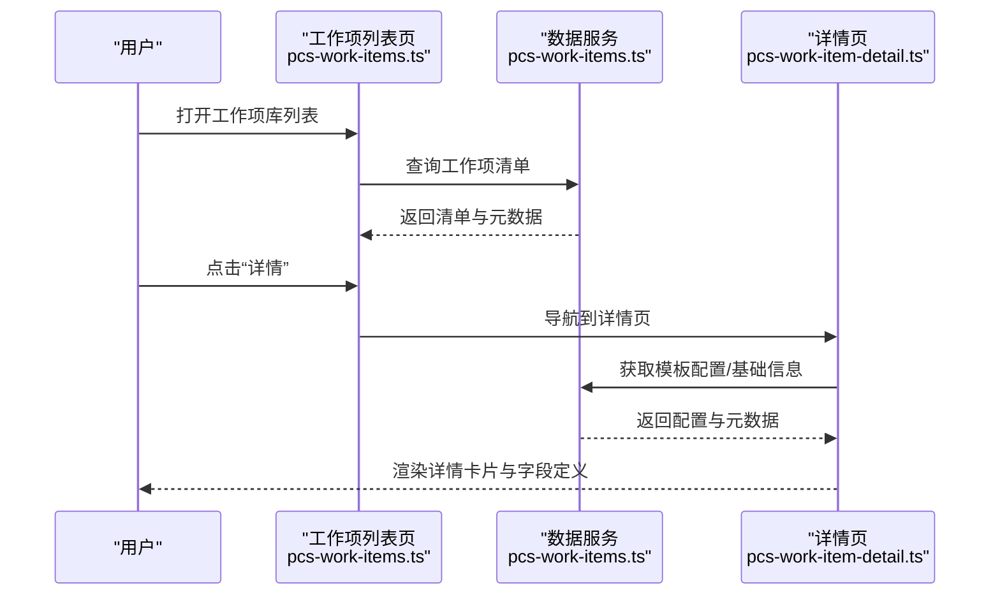
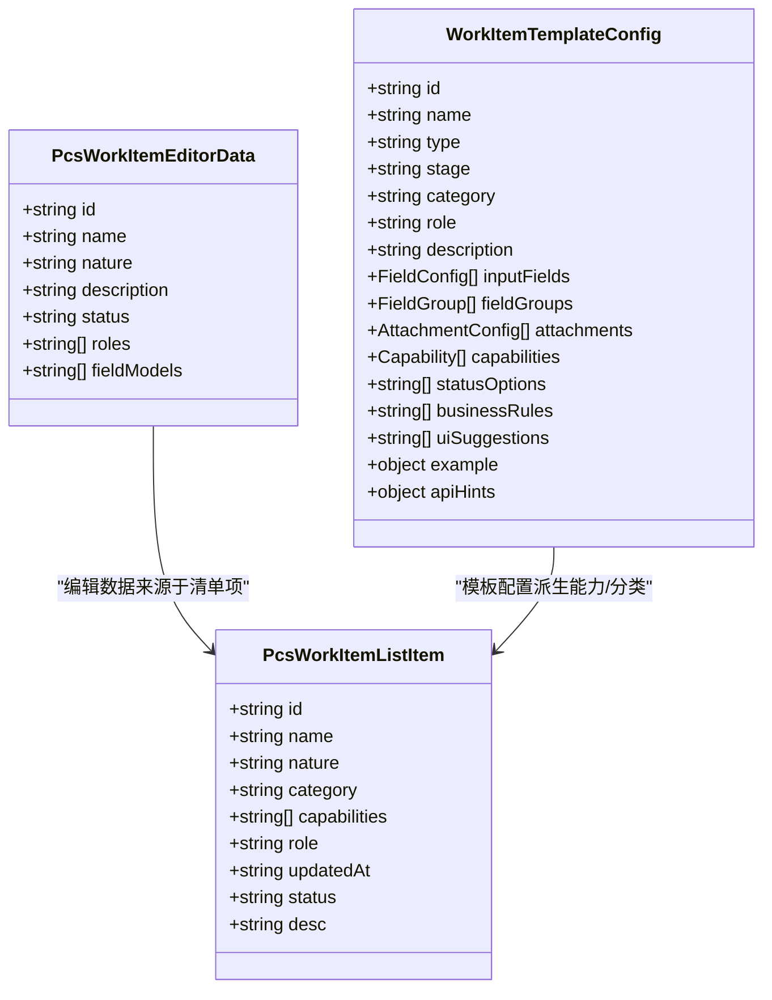
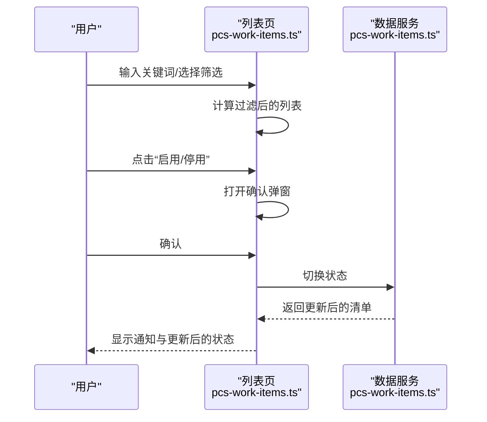
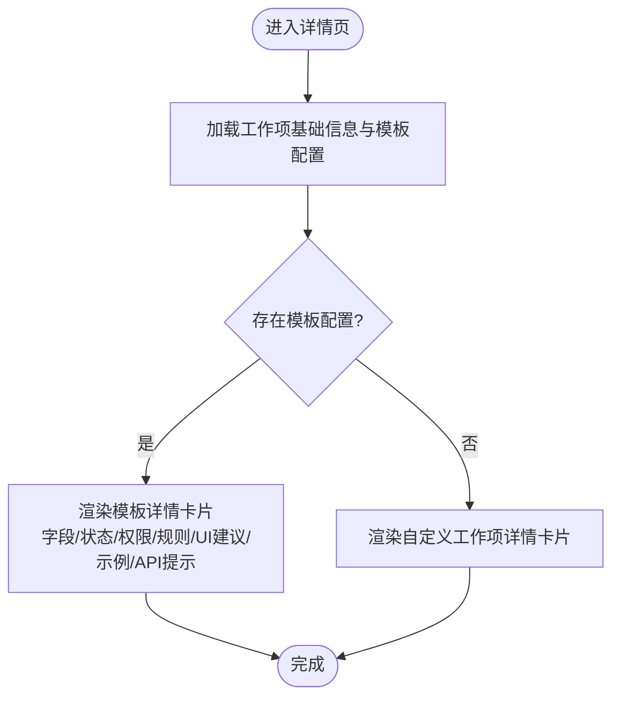
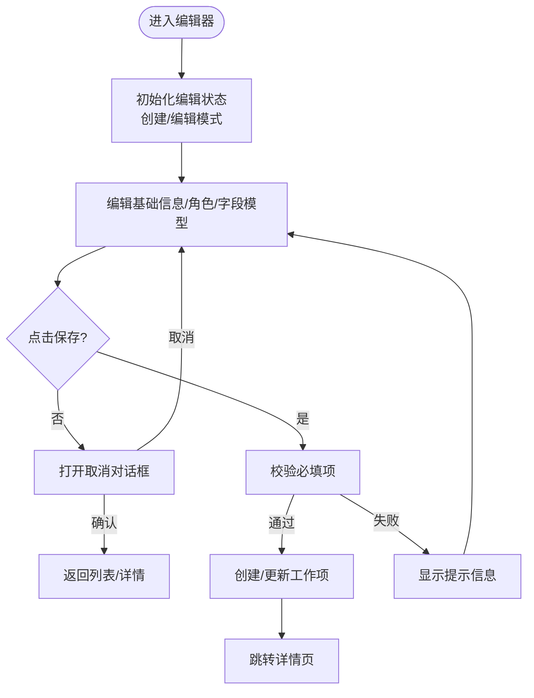
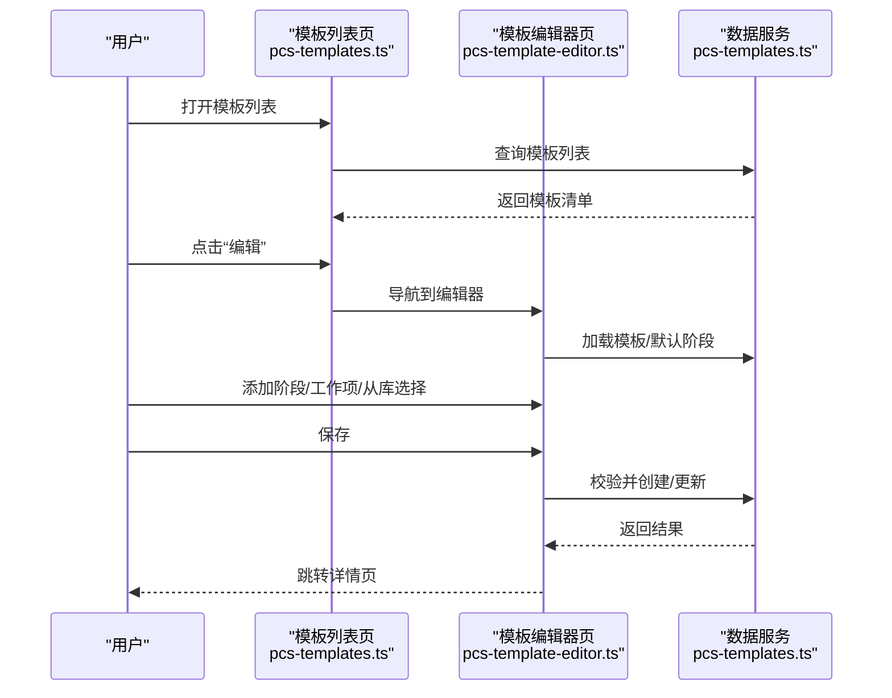
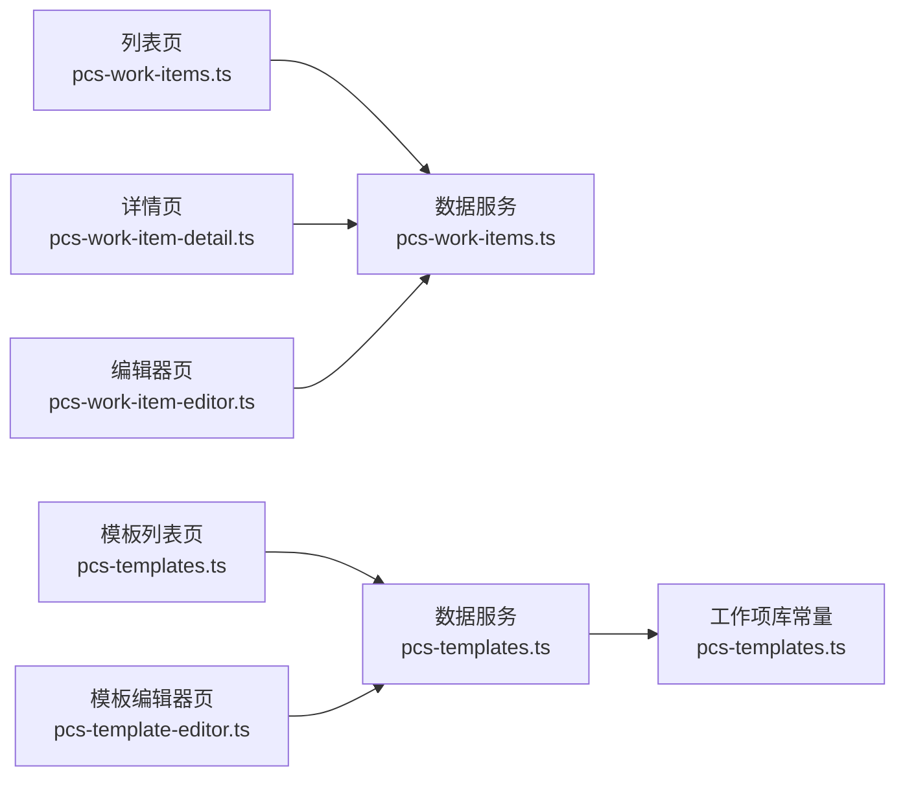

# 工作项库管理

<cite>
**本文引用的文件**
- [src/data/pcs-work-items.ts](file://src/data/pcs-work-items.ts)
- [src/data/pcs-work-item-configs.ts](file://src/data/pcs-work-item-configs.ts)
- [src/pages/pcs-work-items.ts](file://src/pages/pcs-work-items.ts)
- [src/pages/pcs-work-item-detail.ts](file://src/pages/pcs-work-item-detail.ts)
- [src/pages/pcs-work-item-editor.ts](file://src/pages/pcs-work-item-editor.ts)
- [src/data/pcs-templates.ts](file://src/data/pcs-templates.ts)
- [src/pages/pcs-templates.ts](file://src/pages/pcs-templates.ts)
- [src/pages/pcs-template-editor.ts](file://src/pages/pcs-template-editor.ts)
</cite>

## 目录
1. [简介](#简介)
2. [项目结构](#项目结构)
3. [核心组件](#核心组件)
4. [架构总览](#架构总览)
5. [详细组件分析](#详细组件分析)
6. [依赖分析](#依赖分析)
7. [性能考虑](#性能考虑)
8. [故障排查指南](#故障排查指南)
9. [结论](#结论)
10. [附录](#附录)

## 简介
本技术文档围绕工作项库管理模块，系统阐述工作项的创建、编辑、分类与管理能力，覆盖工作项模板设计、字段配置、流程定义与状态机、数据模型与持久化策略。文档还解释工作项与项目管理、测款管理、直播管理的关联关系，并给出工作项模板复用、批量导入导出与版本管理的实现思路。

## 项目结构
工作项库管理模块由三层组成：
- 数据层：工作项清单与元数据、工作项模板配置、模板与阶段工作项定义
- 页面层：工作项列表、详情、编辑器页面，以及模板与模板编辑器页面
- 状态与路由：通过应用状态管理器进行导航与交互

图表来源
- [src/data/pcs-work-items.ts:1-267](file://src/data/pcs-work-items.ts#L1-L267)
- [src/data/pcs-work-item-configs.ts:1-160](file://src/data/pcs-work-item-configs.ts#L1-L160)
- [src/pages/pcs-work-items.ts:1-471](file://src/pages/pcs-work-items.ts#L1-L471)
- [src/pages/pcs-work-item-detail.ts:1-541](file://src/pages/pcs-work-item-detail.ts#L1-L541)
- [src/pages/pcs-work-item-editor.ts:1-396](file://src/pages/pcs-work-item-editor.ts#L1-L396)
- [src/data/pcs-templates.ts:1-120](file://src/data/pcs-templates.ts#L1-L120)
- [src/pages/pcs-templates.ts:1-456](file://src/pages/pcs-templates.ts#L1-L456)
- [src/pages/pcs-template-editor.ts:1-200](file://src/pages/pcs-template-editor.ts#L1-L200)

章节来源
- [src/data/pcs-work-items.ts:1-267](file://src/data/pcs-work-items.ts#L1-L267)
- [src/data/pcs-work-item-configs.ts:1-160](file://src/data/pcs-work-item-configs.ts#L1-L160)
- [src/pages/pcs-work-items.ts:1-471](file://src/pages/pcs-work-items.ts#L1-L471)
- [src/pages/pcs-work-item-detail.ts:1-541](file://src/pages/pcs-work-item-detail.ts#L1-L541)
- [src/pages/pcs-work-item-editor.ts:1-396](file://src/pages/pcs-work-item-editor.ts#L1-L396)
- [src/data/pcs-templates.ts:1-120](file://src/data/pcs-templates.ts#L1-L120)
- [src/pages/pcs-templates.ts:1-456](file://src/pages/pcs-templates.ts#L1-L456)
- [src/pages/pcs-template-editor.ts:1-200](file://src/pages/pcs-template-editor.ts#L1-L200)

## 核心组件
- 工作项数据模型与服务
  - 清单与元数据：工作项基础信息、默认角色、默认字段模型、状态切换、复制、创建与更新
  - 模板配置：字段类型、字段组、附件、能力、状态定义、业务规则、UI建议等
- 页面组件
  - 列表页：筛选、分页、状态切换弹窗、复制、跳转详情/编辑
  - 详情页：基础信息、能力、字段定义、状态定义、权限、示例与API提示
  - 编辑器页：基础信息、默认角色、默认字段模型、保存与取消对话框
- 模板与模板编辑器
  - 模板列表：筛选、分页、启停状态切换、复制、跳转详情/编辑
  - 模板编辑器：阶段与工作项配置、从工作项库选择、保存与取消对话框

章节来源
- [src/data/pcs-work-items.ts:10-170](file://src/data/pcs-work-items.ts#L10-L170)
- [src/data/pcs-work-item-configs.ts:4-158](file://src/data/pcs-work-item-configs.ts#L4-L158)
- [src/pages/pcs-work-items.ts:21-471](file://src/pages/pcs-work-items.ts#L21-L471)
- [src/pages/pcs-work-item-detail.ts:10-541](file://src/pages/pcs-work-item-detail.ts#L10-L541)
- [src/pages/pcs-work-item-editor.ts:15-396](file://src/pages/pcs-work-item-editor.ts#L15-L396)
- [src/data/pcs-templates.ts:24-120](file://src/data/pcs-templates.ts#L24-L120)
- [src/pages/pcs-templates.ts:23-456](file://src/pages/pcs-templates.ts#L23-L456)
- [src/pages/pcs-template-editor.ts:21-200](file://src/pages/pcs-template-editor.ts#L21-L200)

## 架构总览
工作项库管理采用“数据层-页面层-交互层”的分层架构：
- 数据层提供纯函数式的数据访问与变更接口，内部维护内存存储与派生能力
- 页面层以函数式渲染与事件处理为核心，通过状态管理器进行导航
- 模板层与工作项库解耦，但通过“工作项库”概念在模板编辑器中复用工作项定义

图表来源
- [src/pages/pcs-work-items.ts:309-320](file://src/pages/pcs-work-items.ts#L309-L320)
- [src/data/pcs-work-items.ts:135-170](file://src/data/pcs-work-items.ts#L135-L170)
- [src/pages/pcs-work-item-detail.ts:465-518](file://src/pages/pcs-work-item-detail.ts#L465-L518)

## 详细组件分析

### 工作项数据模型与服务
- 数据模型
  - 清单项：包含工作项ID、名称、性质、分类、能力、默认角色、更新时间、状态、描述
  - 编辑数据：名称、性质、描述、状态、默认角色、默认字段模型
  - 模板配置：字段类型、字段组、附件、能力、状态选项、业务规则、UI建议、示例、API提示等
- 服务方法
  - 列表查询、按ID查询、模板配置查询、编辑数据组装、创建、更新、复制、状态切换、元数据查询
- 能力派生与字段模型推断
  - 能力：根据模板配置推断“可复用/可多实例/可回退/可并行”
  - 字段模型：根据模板关键词匹配推断默认字段模型集合

图表来源
- [src/data/pcs-work-items.ts:10-35](file://src/data/pcs-work-items.ts#L10-L35)
- [src/data/pcs-work-items.ts:22-35](file://src/data/pcs-work-items.ts#L22-L35)
- [src/data/pcs-work-item-configs.ts:95-158](file://src/data/pcs-work-item-configs.ts#L95-L158)

章节来源
- [src/data/pcs-work-items.ts:10-170](file://src/data/pcs-work-items.ts#L10-L170)
- [src/data/pcs-work-item-configs.ts:4-158](file://src/data/pcs-work-item-configs.ts#L4-L158)

### 工作项列表页面
- 功能要点
  - 关键词、性质、默认角色、状态筛选
  - 分页与每页条数
  - 操作：详情、编辑、复制、启用/停用（带确认弹窗）
  - 统计卡片：总数、启用中、决策类、执行类
- 交互流程
  - 输入变更触发查询重置到第1页
  - 点击“启用/停用”打开确认弹窗，确认后调用状态切换并刷新通知

图表来源
- [src/pages/pcs-work-items.ts:354-465](file://src/pages/pcs-work-items.ts#L354-L465)
- [src/data/pcs-work-items.ts:245-260](file://src/data/pcs-work-items.ts#L245-L260)

章节来源
- [src/pages/pcs-work-items.ts:21-471](file://src/pages/pcs-work-items.ts#L21-L471)
- [src/data/pcs-work-items.ts:135-267](file://src/data/pcs-work-items.ts#L135-L267)

### 工作项详情页面
- 功能要点
  - 基础信息卡片：编码、分类、默认角色、状态
  - 能力定义卡片：可复用、可多实例、可回退、可并行
  - 字段定义表格：字段标签、类型、必填、说明/校验/单位
  - 状态定义：状态选项、状态流转、回退规则
  - 权限与可编辑性、系统约束、业务规则、交互说明、页面限制、UI建议
  - 示例数据与API提示
- 渲染逻辑
  - 若存在模板配置则渲染模板详情，否则渲染自定义工作项详情

图表来源
- [src/pages/pcs-work-item-detail.ts:465-518](file://src/pages/pcs-work-item-detail.ts#L465-L518)
- [src/pages/pcs-work-item-detail.ts:385-404](file://src/pages/pcs-work-item-detail.ts#L385-L404)

章节来源
- [src/pages/pcs-work-item-detail.ts:10-541](file://src/pages/pcs-work-item-detail.ts#L10-L541)

### 工作项编辑器页面
- 功能要点
  - 基础信息：名称、状态、性质（执行类/决策类）、说明
  - 默认角色：多选（设计/版师/商品/采购/打样/测款）
  - 默认字段模型：多选（商品基础信息/外采样品/测款数据/BOM/纸样/标准工艺/花型/质检结果）
  - 保存与取消（带确认对话框）
- 保存流程
  - 校验名称与至少一个角色
  - 创建或更新工作项，成功后跳转详情页

图表来源
- [src/pages/pcs-work-item-editor.ts:43-80](file://src/pages/pcs-work-item-editor.ts#L43-L80)
- [src/pages/pcs-work-item-editor.ts:202-242](file://src/pages/pcs-work-item-editor.ts#L202-L242)

章节来源
- [src/pages/pcs-work-item-editor.ts:15-396](file://src/pages/pcs-work-item-editor.ts#L15-L396)
- [src/data/pcs-work-items.ts:172-243](file://src/data/pcs-work-items.ts#L172-L243)

### 模板与模板编辑器
- 模板数据模型
  - 模板：名称、款式类型、状态、描述、阶段数组
  - 阶段：名称、描述、是否必经、工作项数组
  - 工作项：名称、类型（执行/决策/里程碑/事实）、必做/可选、角色、字段模板、备注
- 模板列表页
  - 筛选：关键词、款式类型、状态
  - 分页与操作：详情、编辑、复制、启停状态切换（确认弹窗）
- 模板编辑器
  - 阶段与工作项表格：名称、类型、必做、角色、字段模板、备注
  - 从“工作项库”选择：勾选后批量添加到目标阶段
  - 保存：校验名称、款式类型、至少一个阶段，规范化并创建/更新

图表来源
- [src/pages/pcs-templates.ts:336-346](file://src/pages/pcs-templates.ts#L336-L346)
- [src/pages/pcs-template-editor.ts:463-506](file://src/pages/pcs-template-editor.ts#L463-L506)
- [src/data/pcs-templates.ts:636-729](file://src/data/pcs-templates.ts#L636-L729)

章节来源
- [src/data/pcs-templates.ts:24-120](file://src/data/pcs-templates.ts#L24-L120)
- [src/pages/pcs-templates.ts:23-456](file://src/pages/pcs-templates.ts#L23-L456)
- [src/pages/pcs-template-editor.ts:21-200](file://src/pages/pcs-template-editor.ts#L21-L200)

## 依赖分析
- 组件耦合
  - 页面层依赖数据层的纯函数接口，保持低耦合
  - 列表页与详情页共享数据服务，编辑器页与数据服务直接交互
  - 模板编辑器依赖“工作项库”常量进行批量添加
- 外部依赖
  - 应用状态管理器用于页面间导航
  - HTML事件委托与数据属性驱动交互

图表来源
- [src/pages/pcs-work-items.ts:1-10](file://src/pages/pcs-work-items.ts#L1-L10)
- [src/pages/pcs-work-item-detail.ts:1-8](file://src/pages/pcs-work-item-detail.ts#L1-L8)
- [src/pages/pcs-work-item-editor.ts:1-11](file://src/pages/pcs-work-item-editor.ts#L1-L11)
- [src/pages/pcs-templates.ts:1-12](file://src/pages/pcs-templates.ts#L1-L12)
- [src/pages/pcs-template-editor.ts:1-17](file://src/pages/pcs-template-editor.ts#L1-L17)
- [src/data/pcs-templates.ts:573-609](file://src/data/pcs-templates.ts#L573-L609)

章节来源
- [src/pages/pcs-work-items.ts:1-10](file://src/pages/pcs-work-items.ts#L1-L10)
- [src/pages/pcs-work-item-detail.ts:1-8](file://src/pages/pcs-work-item-detail.ts#L1-L8)
- [src/pages/pcs-work-item-editor.ts:1-11](file://src/pages/pcs-work-item-editor.ts#L1-L11)
- [src/pages/pcs-templates.ts:1-12](file://src/pages/pcs-templates.ts#L1-L12)
- [src/pages/pcs-template-editor.ts:1-17](file://src/pages/pcs-template-editor.ts#L1-L17)
- [src/data/pcs-templates.ts:573-609](file://src/data/pcs-templates.ts#L573-L609)

## 性能考虑
- 渲染优化
  - 列表页采用分页与轻量HTML拼接，避免大型DOM重复渲染
  - 详情页按需渲染卡片与表格，减少不必要的计算
- 数据访问
  - 使用内存存储与派生能力，避免频繁IO
  - 对角色与字段模型进行去重与排序，提升渲染效率
- 交互体验
  - 筛选与分页状态集中管理，减少重绘
  - 取消与确认对话框采用条件渲染，降低DOM复杂度

## 故障排查指南
- 列表页
  - 现象：筛选无效或分页异常
  - 排查：检查筛选字段与分页状态重置逻辑
  - 参考路径：[src/pages/pcs-work-items.ts:354-465](file://src/pages/pcs-work-items.ts#L354-L465)
- 详情页
  - 现象：模板配置缺失导致空白
  - 排查：确认模板ID是否存在，回退到自定义工作项详情
  - 参考路径：[src/pages/pcs-work-item-detail.ts:465-518](file://src/pages/pcs-work-item-detail.ts#L465-L518)
- 编辑器页
  - 现象：保存失败或未跳转
  - 排查：检查必填校验、保存流程与导航逻辑
  - 参考路径：[src/pages/pcs-work-item-editor.ts:202-242](file://src/pages/pcs-work-item-editor.ts#L202-L242)
- 模板编辑器
  - 现象：从库选择未生效或保存报错
  - 排查：检查阶段ID、工作项ID、校验逻辑与规范化流程
  - 参考路径：[src/pages/pcs-template-editor.ts:508-757](file://src/pages/pcs-template-editor.ts#L508-L757)

章节来源
- [src/pages/pcs-work-items.ts:354-465](file://src/pages/pcs-work-items.ts#L354-L465)
- [src/pages/pcs-work-item-detail.ts:465-518](file://src/pages/pcs-work-item-detail.ts#L465-L518)
- [src/pages/pcs-work-item-editor.ts:202-242](file://src/pages/pcs-work-item-editor.ts#L202-L242)
- [src/pages/pcs-template-editor.ts:508-757](file://src/pages/pcs-template-editor.ts#L508-L757)

## 结论
工作项库管理模块通过清晰的数据模型与页面职责划分，实现了工作项的全生命周期管理。模板与工作项库的结合提升了复用性与一致性，详情页与编辑器页提供了完善的配置与可视化能力。建议在后续版本中引入持久化存储、批量导入导出与版本控制机制，以满足更复杂的业务场景。

## 附录
- 工作项与项目/测款/直播的关联
  - 工作项可作为项目阶段的关键节点，支持“测款结论判定”、“直播测款”等事实类工作项
  - 详情页通过模板配置展示“操作对象/关联项目/工作项类型/是否需要项目”等字段，体现与项目管理的耦合关系
  - 参考路径：[src/pages/pcs-work-item-detail.ts:385-404](file://src/pages/pcs-work-item-detail.ts#L385-L404)
- 模板复用与批量导入导出
  - 模板编辑器支持从“工作项库”批量添加工作项，便于快速构建流程
  - 批量导入导出可通过模板配置的JSON结构进行序列化/反序列化实现
  - 参考路径：[src/pages/pcs-template-editor.ts:357-393](file://src/pages/pcs-template-editor.ts#L357-L393)
- 版本管理
  - 建议在模板与工作项配置中增加版本号字段与变更记录，支持回滚与审计
  - 参考路径：[src/data/pcs-work-item-configs.ts:138-150](file://src/data/pcs-work-item-configs.ts#L138-L150)