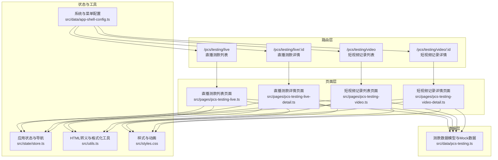
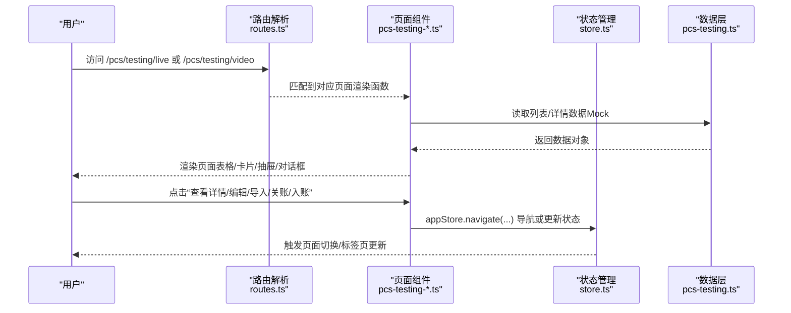
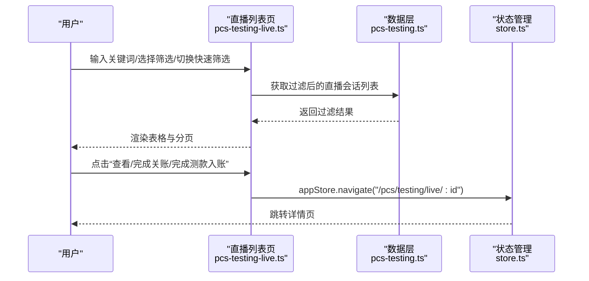
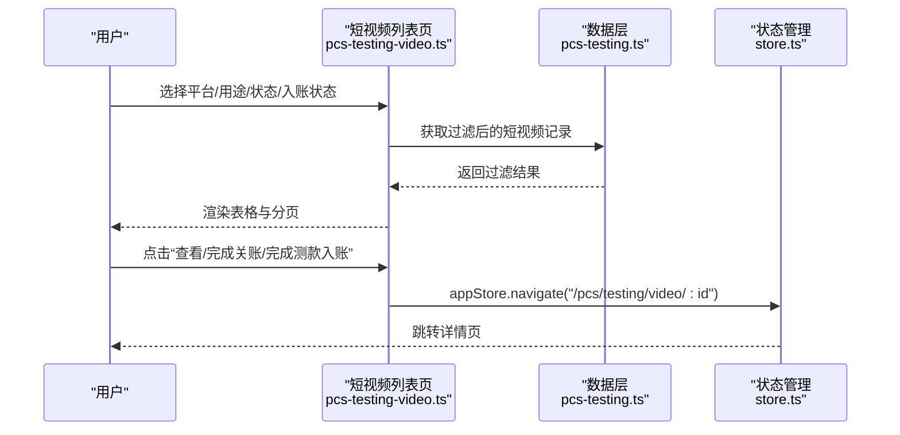
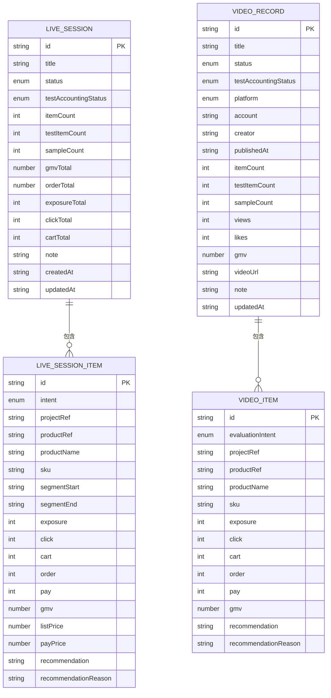
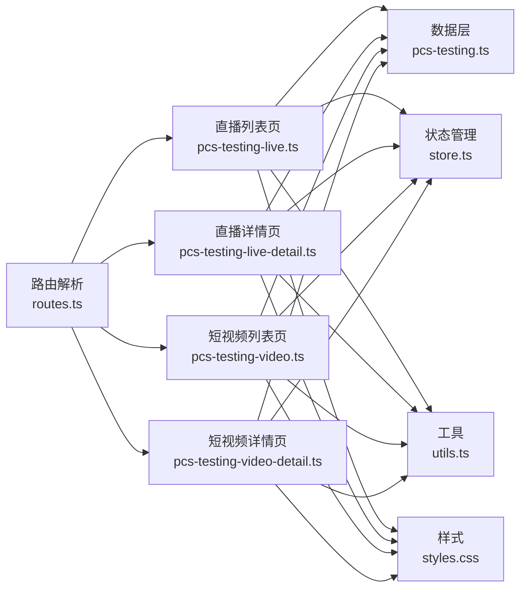

# 测款管理

<cite>
**本文引用的文件**
- [src/pages/pcs-testing-live.ts](file://src/pages/pcs-testing-live.ts)
- [src/pages/pcs-testing-live-detail.ts](file://src/pages/pcs-testing-live-detail.ts)
- [src/pages/pcs-testing-video.ts](file://src/pages/pcs-testing-video.ts)
- [src/pages/pcs-testing-video-detail.ts](file://src/pages/pcs-testing-video-detail.ts)
- [src/data/pcs-testing.ts](file://src/data/pcs-testing.ts)
- [src/router/routes.ts](file://src/router/routes.ts)
- [src/state/store.ts](file://src/state/store.ts)
- [src/utils.ts](file://src/utils.ts)
- [src/styles.css](file://src/styles.css)
- [src/data/app-shell-config.ts](file://src/data/app-shell-config.ts)
</cite>

## 目录
1. [简介](#简介)
2. [项目结构](#项目结构)
3. [核心组件](#核心组件)
4. [架构总览](#架构总览)
5. [详细组件分析](#详细组件分析)
6. [依赖分析](#依赖分析)
7. [性能考虑](#性能考虑)
8. [故障排查指南](#故障排查指南)
9. [结论](#结论)
10. [附录](#附录)

## 简介
本技术文档围绕测款管理模块展开，覆盖直播测款与短视频测款两大模式，从数据模型设计、页面实现到业务流程闭环（策划、执行、监控、管理）进行系统化梳理。文档同时给出直播测款列表/详情、短视频列表/详情页面的实现要点与交互流程，解释测款数据与销售、库存数据的关联关系，并提供测款效果评估、ROI 分析与优化建议的实现思路。

## 项目结构
测款管理模块位于商品中心系统（PCS）下，通过路由精确匹配直播与短视频两类测款页面，并以数据层提供 Mock 数据与读取接口，前端页面负责渲染与交互，状态管理负责页面跳转与标签页联动。

图表来源
- [src/router/routes.ts:129-130](file://src/router/routes.ts#L129-L130)
- [src/router/routes.ts:355-361](file://src/router/routes.ts#L355-L361)
- [src/pages/pcs-testing-live.ts:623-636](file://src/pages/pcs-testing-live.ts#L623-L636)
- [src/pages/pcs-testing-live-detail.ts:487-504](file://src/pages/pcs-testing-live-detail.ts#L487-L504)
- [src/pages/pcs-testing-video.ts:562-574](file://src/pages/pcs-testing-video.ts#L562-L574)
- [src/pages/pcs-testing-video-detail.ts:457-474](file://src/pages/pcs-testing-video-detail.ts#L457-L474)
- [src/data/pcs-testing.ts:658-702](file://src/data/pcs-testing.ts#L658-L702)
- [src/state/store.ts:172-178](file://src/state/store.ts#L172-L178)
- [src/utils.ts:1-18](file://src/utils.ts#L1-L18)
- [src/styles.css:1-103](file://src/styles.css#L1-L103)
- [src/data/app-shell-config.ts:21-104](file://src/data/app-shell-config.ts#L21-L104)

章节来源
- [src/router/routes.ts:129-130](file://src/router/routes.ts#L129-L130)
- [src/router/routes.ts:355-361](file://src/router/routes.ts#L355-L361)
- [src/data/app-shell-config.ts:21-104](file://src/data/app-shell-config.ts#L21-L104)

## 核心组件
- 路由与导航
  - 精确路由：直播测款列表、短视频记录列表
  - 动态路由：直播测款详情、短视频记录详情
  - 应用状态：统一导航与标签页联动
- 页面组件
  - 直播测款：列表页（筛选、分页、快速KPI）、详情页（概览、明细、核对、证据、入账、样衣、日志）
  - 短视频测款：列表页（筛选、分页、快速KPI）、详情页（概览、内容条目、核对、证据、入账、样衣、日志）
- 数据模型
  - 直播会话 LiveSession、直播明细 LiveSessionItem、直播样衣 LiveSample、直播日志 LiveLog
  - 短视频记录 VideoRecord、短视频条目 VideoItem、证据资产 EvidenceAsset、短视频日志 VideoLog
  - 状态与用途元数据（状态、入账状态、用途、平台）
- 工具与样式
  - HTML 转义、日期格式化
  - 对话框动画、标签页可见性控制

章节来源
- [src/router/routes.ts:129-130](file://src/router/routes.ts#L129-L130)
- [src/router/routes.ts:355-361](file://src/router/routes.ts#L355-L361)
- [src/pages/pcs-testing-live.ts:59-89](file://src/pages/pcs-testing-live.ts#L59-L89)
- [src/pages/pcs-testing-video.ts:60-90](file://src/pages/pcs-testing-video.ts#L60-L90)
- [src/data/pcs-testing.ts:1-177](file://src/data/pcs-testing.ts#L1-L177)
- [src/state/store.ts:172-178](file://src/state/store.ts#L172-L178)
- [src/utils.ts:1-18](file://src/utils.ts#L1-L18)
- [src/styles.css:67-102](file://src/styles.css#L67-L102)

## 架构总览
测款管理采用“路由驱动页面 + 数据层提供Mock + 状态管理统一导航”的轻量前端架构。页面通过事件委托处理用户交互，调用状态管理进行页面跳转，使用数据层接口读取/计算测款数据，最终渲染为表格、卡片、抽屉与对话框等 UI 组件。

图表来源
- [src/router/routes.ts:430-455](file://src/router/routes.ts#L430-L455)
- [src/pages/pcs-testing-live.ts:708-720](file://src/pages/pcs-testing-live.ts#L708-L720)
- [src/pages/pcs-testing-video.ts:648-660](file://src/pages/pcs-testing-video.ts#L648-L660)
- [src/state/store.ts:172-178](file://src/state/store.ts#L172-L178)
- [src/data/pcs-testing.ts:658-702](file://src/data/pcs-testing.ts#L658-L702)

## 详细组件分析

### 直播测款模块
- 列表页（直播场次）
  - 快速KPI：核对中、可关账、待入账、已入账、异常场次
  - 筛选：关键词、状态、用途、入账状态、快速筛选
  - 分页：页码、每页条数
  - 行操作：查看、导入数据、完成关账、完成测款入账
  - 创建抽屉：标题、负责人、站点、直播账号、主播、开播/下播时间、操作人、记录人、复核人、用途、是否启用测款入账、备注
  - 关账弹窗：关账备注
  - 入账弹窗：入账说明、确认勾选
- 详情页（直播场次）
  - 标签页：概览、场次明细、数据核对、证据素材、测款入账、样衣关联、日志审计
  - 概览：场次信息、效果概览（曝光/点击/加购/订单/GMV/样衣）、测款摘要（测款条目/待决策/入账状态/备注）
  - 明细：按意图（TEST/SELL/REVIEW）展示商品、时段、曝光/点击/支付单/GMV、建议
  - 核对：开播/下播时间、明细条目、核对结论
  - 证据：截图/视频片段/链接
  - 入账：测款入账进度与明细
  - 样衣：样衣编号/名称/站点/状态/位置/持有人
  - 日志：操作时间/动作/用户/详情
  - 编辑明细抽屉：编辑曝光/点击/支付/GMV/建议与原因
  - 关账/入账弹窗：备注/说明+确认

图表来源
- [src/pages/pcs-testing-live.ts:110-135](file://src/pages/pcs-testing-live.ts#L110-L135)
- [src/pages/pcs-testing-live.ts:321-361](file://src/pages/pcs-testing-live.ts#L321-L361)
- [src/pages/pcs-testing-live.ts:708-720](file://src/pages/pcs-testing-live.ts#L708-L720)
- [src/data/pcs-testing.ts:658-677](file://src/data/pcs-testing.ts#L658-L677)
- [src/state/store.ts:172-178](file://src/state/store.ts#L172-L178)

章节来源
- [src/pages/pcs-testing-live.ts:59-89](file://src/pages/pcs-testing-live.ts#L59-L89)
- [src/pages/pcs-testing-live.ts:110-135](file://src/pages/pcs-testing-live.ts#L110-L135)
- [src/pages/pcs-testing-live.ts:321-361](file://src/pages/pcs-testing-live.ts#L321-L361)
- [src/pages/pcs-testing-live.ts:587-621](file://src/pages/pcs-testing-live.ts#L587-L621)
- [src/pages/pcs-testing-live-detail.ts:17-49](file://src/pages/pcs-testing-live-detail.ts#L17-L49)
- [src/pages/pcs-testing-live-detail.ts:126-161](file://src/pages/pcs-testing-live-detail.ts#L126-L161)
- [src/pages/pcs-testing-live-detail.ts:164-215](file://src/pages/pcs-testing-live-detail.ts#L164-L215)
- [src/pages/pcs-testing-live-detail.ts:218-237](file://src/pages/pcs-testing-live-detail.ts#L218-L237)
- [src/pages/pcs-testing-live-detail.ts:240-257](file://src/pages/pcs-testing-live-detail.ts#L240-L257)
- [src/pages/pcs-testing-live-detail.ts:260-303](file://src/pages/pcs-testing-live-detail.ts#L260-L303)
- [src/pages/pcs-testing-live-detail.ts:306-346](file://src/pages/pcs-testing-live-detail.ts#L306-L346)
- [src/pages/pcs-testing-live-detail.ts:349-371](file://src/pages/pcs-testing-live-detail.ts#L349-L371)
- [src/pages/pcs-testing-live-detail.ts:374-409](file://src/pages/pcs-testing-live-detail.ts#L374-L409)
- [src/pages/pcs-testing-live-detail.ts:411-431](file://src/pages/pcs-testing-live-detail.ts#L411-L431)
- [src/pages/pcs-testing-live-detail.ts:434-461](file://src/pages/pcs-testing-live-detail.ts#L434-L461)

### 短视频测款模块
- 列表页（短视频记录）
  - 快速KPI：核对中、可关账、待入账、已入账
  - 筛选：关键词、记录状态、用途、平台、入账状态、快速筛选
  - 行操作：查看、导入数据、完成关账、完成测款入账
  - 创建抽屉：标题、负责人、记录人、平台、账号、创作者、发布时间、视频链接、用途、是否启用测款入账、备注
  - 关账弹窗：未发布原因（可选）、关账备注
  - 入账弹窗：入账说明、确认勾选
- 详情页（短视频记录）
  - 标签页：概览、内容条目、数据核对、证据素材、测款入账、样衣关联、日志审计
  - 概览：记录信息（平台/账号/创作者/视频链接）、效果概览（播放/点赞/条目/测款条目/GMV/样衣）、测款摘要
  - 内容条目：按评估意图（TEST/SELL/REVIEW）展示商品、曝光/点击/支付单/GMV、建议
  - 核对：发布时间、核对维度、当前结论
  - 证据：证据类型/名称/链接/时间
  - 入账：测款入账进度与明细
  - 样衣：样衣编号/名称/站点/状态/位置/持有人
  - 日志：操作时间/动作/用户/详情
  - 编辑条目抽屉：编辑曝光/点击/支付/GMV/建议与原因
  - 关账/入账弹窗：未发布原因/关账备注/入账说明+确认

图表来源
- [src/pages/pcs-testing-video.ts:106-131](file://src/pages/pcs-testing-video.ts#L106-L131)
- [src/pages/pcs-testing-video.ts:310-350](file://src/pages/pcs-testing-video.ts#L310-L350)
- [src/pages/pcs-testing-video.ts:710-722](file://src/pages/pcs-testing-video.ts#L710-L722)
- [src/data/pcs-testing.ts:679-702](file://src/data/pcs-testing.ts#L679-L702)
- [src/state/store.ts:172-178](file://src/state/store.ts#L172-L178)

章节来源
- [src/pages/pcs-testing-video.ts:60-90](file://src/pages/pcs-testing-video.ts#L60-L90)
- [src/pages/pcs-testing-video.ts:106-131](file://src/pages/pcs-testing-video.ts#L106-L131)
- [src/pages/pcs-testing-video.ts:310-350](file://src/pages/pcs-testing-video.ts#L310-L350)
- [src/pages/pcs-testing-video.ts:556-560](file://src/pages/pcs-testing-video.ts#L556-L560)
- [src/pages/pcs-testing-video-detail.ts:55-66](file://src/pages/pcs-testing-video-detail.ts#L55-L66)
- [src/pages/pcs-testing-video-detail.ts:124-159](file://src/pages/pcs-testing-video-detail.ts#L124-L159)
- [src/pages/pcs-testing-video-detail.ts:162-213](file://src/pages/pcs-testing-video-detail.ts#L162-L213)
- [src/pages/pcs-testing-video-detail.ts:215-234](file://src/pages/pcs-testing-video-detail.ts#L215-L234)
- [src/pages/pcs-testing-video-detail.ts:237-261](file://src/pages/pcs-testing-video-detail.ts#L237-L261)
- [src/pages/pcs-testing-video-detail.ts:263-274](file://src/pages/pcs-testing-video-detail.ts#L263-L274)
- [src/pages/pcs-testing-video-detail.ts:277-317](file://src/pages/pcs-testing-video-detail.ts#L277-L317)
- [src/pages/pcs-testing-video-detail.ts:319-342](file://src/pages/pcs-testing-video-detail.ts#L319-L342)
- [src/pages/pcs-testing-video-detail.ts:344-373](file://src/pages/pcs-testing-video-detail.ts#L344-L373)
- [src/pages/pcs-testing-video-detail.ts:375-401](file://src/pages/pcs-testing-video-detail.ts#L375-L401)
- [src/pages/pcs-testing-video-detail.ts:404-431](file://src/pages/pcs-testing-video-detail.ts#L404-L431)

### 数据模型与关系
- 直播测款数据模型
  - LiveSession：场次基本信息、状态、用途、账号/主播、时间、人员、条目计数、入账状态、GMV/订单、曝光/点击/购物车、样衣数量、备注、创建/更新时间
  - LiveSessionItem：明细项（意图/项目/商品/SKU/时段/曝光/点击/支付单/GMV/建议/证据）
  - LiveSample：样衣信息（编号/名称/站点/状态/位置/持有人）
  - LiveLog：审计日志（时间/动作/用户/详情）
- 短视频测款数据模型
  - VideoRecord：记录基本信息、状态、用途、平台/账号/创作者、发布时间、人员、条目计数、入账状态、播放/点赞/GMV、样衣数量、视频链接、备注、更新时间
  - VideoItem：内容条目（评估意图/项目/商品/SKU/曝光/点击/支付单/GMV/建议）
  - EvidenceAsset：证据资产（类型/名称/链接/时间）
  - VideoLog：审计日志（时间/动作/用户/详情）
- 状态与用途元数据
  - SessionStatus、AccountingStatus、LivePurpose、VideoPurpose、VideoPlatform
  - 提供标签颜色与文案映射

图表来源
- [src/data/pcs-testing.ts:17-106](file://src/data/pcs-testing.ts#L17-L106)
- [src/data/pcs-testing.ts:140-177](file://src/data/pcs-testing.ts#L140-L177)

章节来源
- [src/data/pcs-testing.ts:1-177](file://src/data/pcs-testing.ts#L1-L177)
- [src/data/pcs-testing.ts:180-463](file://src/data/pcs-testing.ts#L180-L463)
- [src/data/pcs-testing.ts:465-652](file://src/data/pcs-testing.ts#L465-L652)

### 实时数据更新与播放器集成
- 实时数据更新
  - 列表页通过本地内存数组维护会话/记录集合，筛选与分页在前端完成，适合 Mock 场景下的演示态交互
  - 详情页通过数据层接口读取当前会话/记录及其明细、证据、日志、样衣，保证数据一致性
- 播放器集成
  - 短视频详情页提供视频链接字段，可在详情页内嵌播放器组件（例如 iframe/视频标签），用于预览与证据展示
  - 播放器应支持静音、循环、清晰度切换与全屏，结合证据素材与日志审计形成闭环

章节来源
- [src/pages/pcs-testing-video-detail.ts:135-136](file://src/pages/pcs-testing-video-detail.ts#L135-L136)
- [src/pages/pcs-testing-video.ts:540-547](file://src/pages/pcs-testing-video.ts#L540-L547)

### 测款数据与销售、库存数据的关联
- 销售数据关联
  - 直播/短视频明细中的 GMV、支付单、订单、点击、曝光等指标可作为测款效果的直接衡量
  - 可通过“测款条目”与“销售条目”的对比，评估测款对实际转化的影响
- 库存数据关联
  - 样衣关联（LiveSample）用于追踪测款样衣的使用与归还，避免重复占用
  - 样衣台账可与库存系统联动，确保测款样衣在不同站点/状态下的可追溯性

章节来源
- [src/pages/pcs-testing-live-detail.ts:306-346](file://src/pages/pcs-testing-live-detail.ts#L306-L346)
- [src/pages/pcs-testing-video-detail.ts:277-317](file://src/pages/pcs-testing-video-detail.ts#L277-L317)
- [src/data/pcs-testing.ts:68-75](file://src/data/pcs-testing.ts#L68-L75)
- [src/data/pcs-testing.ts:125-131](file://src/data/pcs-testing.ts#L125-L131)

### 效果评估、ROI 分析与优化建议
- 效果评估
  - 指标体系：曝光/点击/加购/支付单/GMV/转化率/点击率/支付率/获客成本（CPC）
  - 分类评估：按用途（TEST/SELL/RESTOCK/CLEARANCE/SOFT_LAUNCH/CONTENT）与平台（TIKTOK/DOUYIN/KUAISHOU/OTHER）分组对比
- ROI 分析
  - ROI = （GMV - 成本）/ 成本；成本可包含直播/短视频制作成本、样衣成本、推广成本等
  - 建议按“测款条目”维度计算 ROI，识别高价值商品与高回报时段
- 优化建议
  - 基于“建议/建议原因”字段沉淀优化策略，持续迭代商品组合与内容形式
  - 结合证据素材（截图/视频片段）与日志审计，定位问题环节（如转化低、互动差）

章节来源
- [src/pages/pcs-testing-live-detail.ts:126-159](file://src/pages/pcs-testing-live-detail.ts#L126-L159)
- [src/pages/pcs-testing-video-detail.ts:124-159](file://src/pages/pcs-testing-video-detail.ts#L124-L159)
- [src/pages/pcs-testing-live.ts:91-108](file://src/pages/pcs-testing-live.ts#L91-L108)
- [src/pages/pcs-testing-video.ts:97-104](file://src/pages/pcs-testing-video.ts#L97-L104)

## 依赖分析
- 组件耦合
  - 页面层依赖数据层接口与状态管理，保持低耦合
  - 事件处理集中在页面内部，通过状态管理进行导航，职责清晰
- 外部依赖
  - 路由解析与动态路由匹配
  - TailwindCSS 样式与动画
  - HTML 转义工具防止 XSS

图表来源
- [src/router/routes.ts:430-455](file://src/router/routes.ts#L430-L455)
- [src/pages/pcs-testing-live.ts:623-636](file://src/pages/pcs-testing-live.ts#L623-L636)
- [src/pages/pcs-testing-live-detail.ts:487-504](file://src/pages/pcs-testing-live-detail.ts#L487-L504)
- [src/pages/pcs-testing-video.ts:562-574](file://src/pages/pcs-testing-video.ts#L562-L574)
- [src/pages/pcs-testing-video-detail.ts:457-474](file://src/pages/pcs-testing-video-detail.ts#L457-L474)
- [src/data/pcs-testing.ts:658-702](file://src/data/pcs-testing.ts#L658-L702)
- [src/state/store.ts:172-178](file://src/state/store.ts#L172-L178)
- [src/utils.ts:1-18](file://src/utils.ts#L1-L18)
- [src/styles.css:1-103](file://src/styles.css#L1-L103)

章节来源
- [src/router/routes.ts:430-455](file://src/router/routes.ts#L430-L455)
- [src/state/store.ts:172-178](file://src/state/store.ts#L172-L178)
- [src/utils.ts:1-18](file://src/utils.ts#L1-L18)
- [src/styles.css:1-103](file://src/styles.css#L1-L103)

## 性能考虑
- 前端筛选与分页
  - 使用本地数组进行过滤与分页，适合 Mock 数据场景；若数据量增大，建议服务端分页与条件索引
- 渲染优化
  - 表格按需渲染（分页切片），减少 DOM 节点数量
  - 抽屉/对话框采用条件渲染，避免常驻内存
- 交互体验
  - 使用过渡动画提升弹窗/抽屉打开关闭的流畅度
  - 标签页激活态与关闭按钮可见性控制，提升可发现性

章节来源
- [src/pages/pcs-testing-live.ts:137-152](file://src/pages/pcs-testing-live.ts#L137-L152)
- [src/pages/pcs-testing-video.ts:133-148](file://src/pages/pcs-testing-video.ts#L133-L148)
- [src/styles.css:76-102](file://src/styles.css#L76-L102)

## 故障排查指南
- 页面无法跳转
  - 检查路由是否正确注册（精确/动态路由）
  - 检查状态管理导航方法是否被调用
- 数据不显示或为空
  - 检查数据层接口是否返回数据
  - 检查筛选条件是否过于严格导致无结果
- 弹窗/抽屉无法关闭
  - 检查事件委托绑定与状态重置逻辑
  - 检查 HTML 转义是否影响元素选择器
- 安全问题
  - 确保所有用户输入通过 HTML 转义工具处理，避免 XSS

章节来源
- [src/router/routes.ts:430-455](file://src/router/routes.ts#L430-L455)
- [src/state/store.ts:172-178](file://src/state/store.ts#L172-L178)
- [src/pages/pcs-testing-live.ts:794-800](file://src/pages/pcs-testing-live.ts#L794-L800)
- [src/pages/pcs-testing-video.ts:758-775](file://src/pages/pcs-testing-video.ts#L758-L775)
- [src/utils.ts:1-8](file://src/utils.ts#L1-L8)

## 结论
测款管理模块通过清晰的数据模型与页面组件，实现了直播与短视频两条测款路径的完整闭环。前端采用事件驱动与状态管理，配合 Mock 数据与工具函数，满足演示态下的交互与可视化需求。后续可扩展服务端接口、引入真实播放器与数据分析组件，进一步完善测款效果评估与优化建议体系。

## 附录
- 代码示例路径（不展示具体代码）
  - 直播测款列表页面渲染与事件处理：[src/pages/pcs-testing-live.ts:623-636](file://src/pages/pcs-testing-live.ts#L623-L636), [src/pages/pcs-testing-live.ts:638-800](file://src/pages/pcs-testing-live.ts#L638-L800)
  - 直播测款详情页面渲染与事件处理：[src/pages/pcs-testing-live-detail.ts:487-504](file://src/pages/pcs-testing-live-detail.ts#L487-L504), [src/pages/pcs-testing-live-detail.ts:513-640](file://src/pages/pcs-testing-live-detail.ts#L513-L640)
  - 短视频列表页面渲染与事件处理：[src/pages/pcs-testing-video.ts:562-574](file://src/pages/pcs-testing-video.ts#L562-L574), [src/pages/pcs-testing-video.ts:577-775](file://src/pages/pcs-testing-video.ts#L577-L775)
  - 短视频详情页面渲染与事件处理：[src/pages/pcs-testing-video-detail.ts:457-474](file://src/pages/pcs-testing-video-detail.ts#L457-L474), [src/pages/pcs-testing-video-detail.ts:483-612](file://src/pages/pcs-testing-video-detail.ts#L483-L612)
  - 数据模型与 Mock 数据：[src/data/pcs-testing.ts:1-177](file://src/data/pcs-testing.ts#L1-L177), [src/data/pcs-testing.ts:179-702](file://src/data/pcs-testing.ts#L179-L702)
  - 路由与导航：[src/router/routes.ts:129-130](file://src/router/routes.ts#L129-L130), [src/router/routes.ts:355-361](file://src/router/routes.ts#L355-L361), [src/state/store.ts:172-178](file://src/state/store.ts#L172-L178)
  - 工具与样式：[src/utils.ts:1-18](file://src/utils.ts#L1-L18), [src/styles.css:1-103](file://src/styles.css#L1-L103)
  - 系统与菜单配置：[src/data/app-shell-config.ts:21-104](file://src/data/app-shell-config.ts#L21-L104)