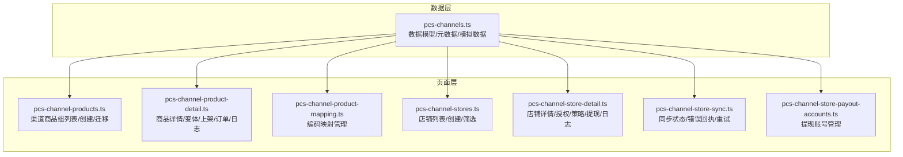
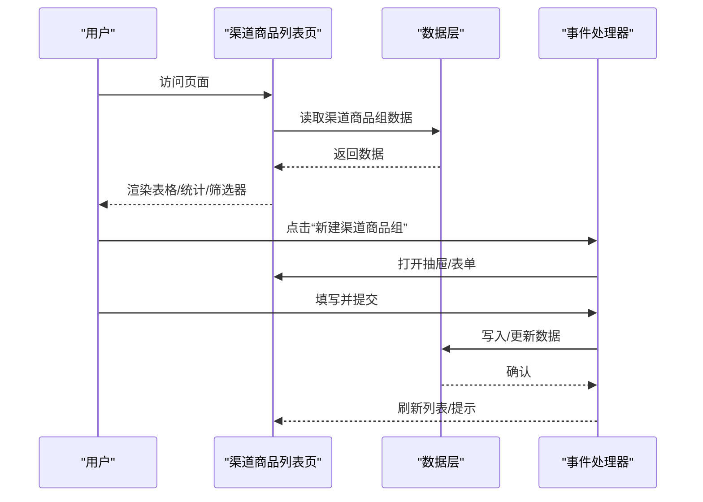
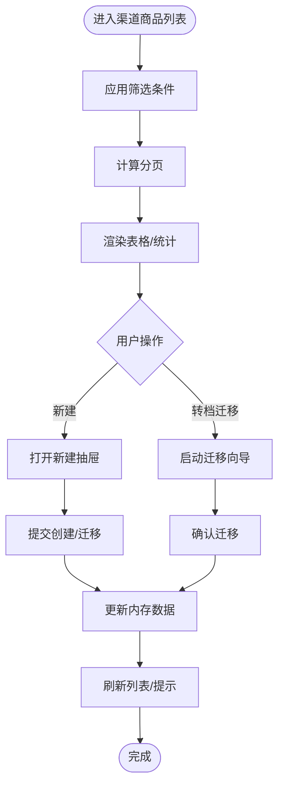
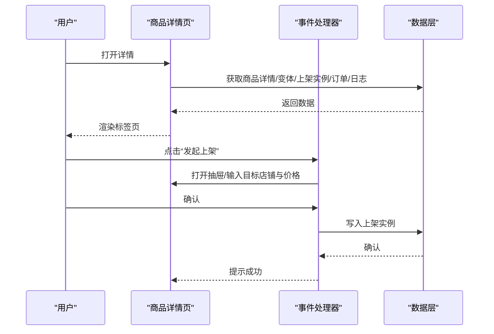
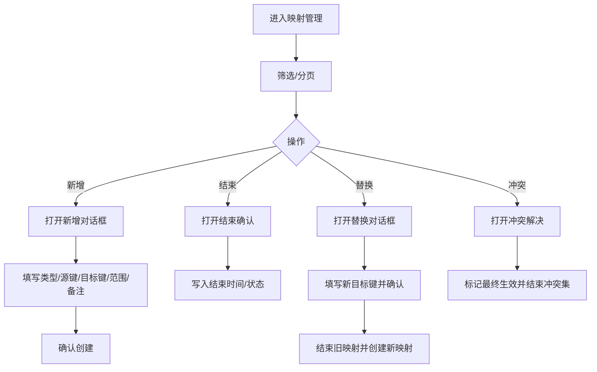
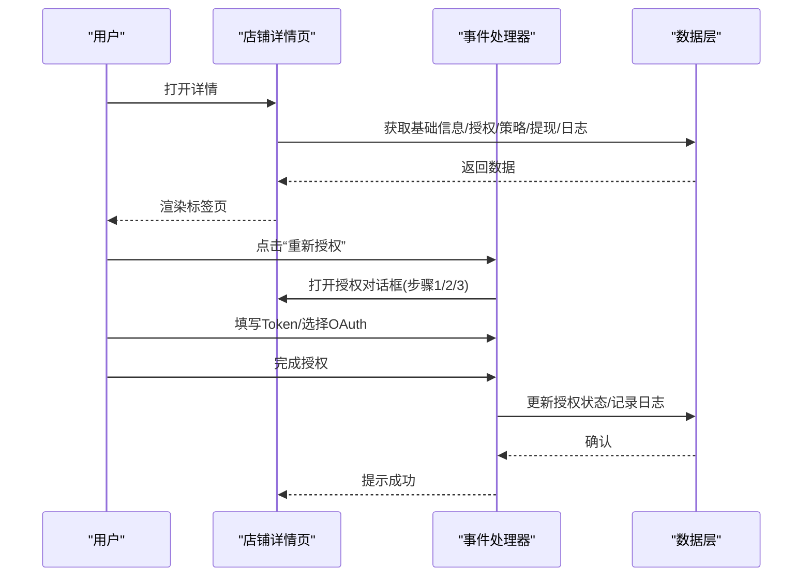
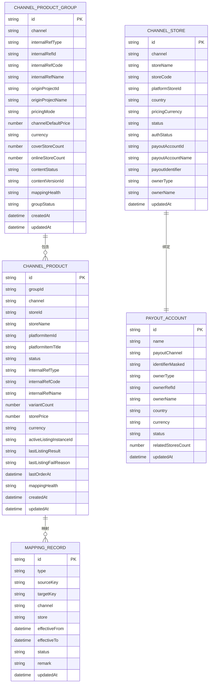
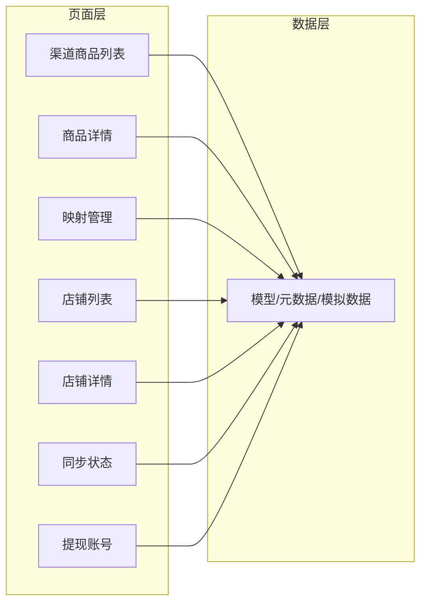

# 渠道管理

<cite>
**本文引用的文件**
- [src/data/pcs-channels.ts](file://src/data/pcs-channels.ts)
- [src/pages/pcs-channel-products.ts](file://src/pages/pcs-channel-products.ts)
- [src/pages/pcs-channel-product-detail.ts](file://src/pages/pcs-channel-product-detail.ts)
- [src/pages/pcs-channel-product-mapping.ts](file://src/pages/pcs-channel-product-mapping.ts)
- [src/pages/pcs-channel-stores.ts](file://src/pages/pcs-channel-stores.ts)
- [src/pages/pcs-channel-store-detail.ts](file://src/pages/pcs-channel-store-detail.ts)
- [src/pages/pcs-channel-store-sync.ts](file://src/pages/pcs-channel-store-sync.ts)
- [src/pages/pcs-channel-store-payout-accounts.ts](file://src/pages/pcs-channel-store-payout-accounts.ts)
</cite>

## 目录
1. [简介](#简介)
2. [项目结构](#项目结构)
3. [核心组件](#核心组件)
4. [架构总览](#架构总览)
5. [详细组件分析](#详细组件分析)
6. [依赖分析](#依赖分析)
7. [性能考虑](#性能考虑)
8. [故障排查指南](#故障排查指南)
9. [结论](#结论)
10. [附录](#附录)

## 简介
本技术文档围绕渠道管理模块展开，系统性阐述渠道的创建、配置、产品管理与店铺管理功能，涵盖渠道对接、产品映射、库存同步、结算管理等关键环节。文档同时解析渠道数据模型设计（渠道类型、产品配置、价格策略、结算规则等），并提供具体页面实现路径与交互流程说明，帮助开发者快速理解与扩展。

## 项目结构
渠道管理模块由“数据层 + 页面层”构成：
- 数据层：集中定义渠道相关的数据模型、枚举元数据与模拟数据，便于页面直接消费。
- 页面层：提供渠道商品、店铺、映射、同步与提现账号等页面，采用事件驱动渲染与状态管理。

图表来源
- [src/data/pcs-channels.ts](file://src/data/pcs-channels.ts)
- [src/pages/pcs-channel-products.ts](file://src/pages/pcs-channel-products.ts)
- [src/pages/pcs-channel-product-detail.ts](file://src/pages/pcs-channel-product-detail.ts)
- [src/pages/pcs-channel-product-mapping.ts](file://src/pages/pcs-channel-product-mapping.ts)
- [src/pages/pcs-channel-stores.ts](file://src/pages/pcs-channel-stores.ts)
- [src/pages/pcs-channel-store-detail.ts](file://src/pages/pcs-channel-store-detail.ts)
- [src/pages/pcs-channel-store-sync.ts](file://src/pages/pcs-channel-store-sync.ts)
- [src/pages/pcs-channel-store-payout-accounts.ts](file://src/pages/pcs-channel-store-payout-accounts.ts)

章节来源
- [src/data/pcs-channels.ts](file://src/data/pcs-channels.ts)
- [src/pages/pcs-channel-products.ts](file://src/pages/pcs-channel-products.ts)
- [src/pages/pcs-channel-stores.ts](file://src/pages/pcs-channel-stores.ts)

## 核心组件
- 数据模型与元数据
  - 渠道类型、内部引用类型、定价模式、映射健康度、内容状态、商品状态、映射类型/状态、店铺状态/授权状态、归属类型等枚举与元数据映射。
  - 渠道商品组、渠道商品、变体、上架实例、订单追踪、日志、映射记录、渠道店铺、提现账号、绑定历史、同步错误等实体模型。
- 页面组件
  - 渠道商品组列表与创建、转档迁移向导；商品详情页（概览、变体映射、上架实例、订单追溯、日志审计）；编码映射管理（新增、结束、替换、冲突处理）。
  - 店铺列表与创建、详情页（基础信息、授权连接、上架策略、提现绑定、同步与数据、日志）；同步状态与错误回执（商品/订单）、批量重试。
  - 提现账号管理（列表筛选、关联店铺弹窗、新建与停用）。

章节来源
- [src/data/pcs-channels.ts](file://src/data/pcs-channels.ts)
- [src/pages/pcs-channel-products.ts](file://src/pages/pcs-channel-products.ts)
- [src/pages/pcs-channel-product-detail.ts](file://src/pages/pcs-channel-product-detail.ts)
- [src/pages/pcs-channel-product-mapping.ts](file://src/pages/pcs-channel-product-mapping.ts)
- [src/pages/pcs-channel-stores.ts](file://src/pages/pcs-channel-stores.ts)
- [src/pages/pcs-channel-store-detail.ts](file://src/pages/pcs-channel-store-detail.ts)
- [src/pages/pcs-channel-store-sync.ts](file://src/pages/pcs-channel-store-sync.ts)
- [src/pages/pcs-channel-store-payout-accounts.ts](file://src/pages/pcs-channel-store-payout-accounts.ts)

## 架构总览
渠道管理采用“纯前端页面 + 模拟数据”的架构，页面通过事件分发与状态机驱动UI渲染，所有业务逻辑集中在页面脚本中，便于快速迭代与演示。

图表来源
- [src/pages/pcs-channel-products.ts](file://src/pages/pcs-channel-products.ts)
- [src/data/pcs-channels.ts](file://src/data/pcs-channels.ts)

## 详细组件分析

### 渠道商品管理
- 功能要点
  - 列表页：关键词/渠道/内部绑定类型/映射健康/组状态筛选，分页与统计卡片。
  - 新建：支持“按项目生成”和“手动新建”，可继承内容版本与价格策略，设置定价模式与默认价。
  - 转档迁移：针对候选商品到SPU的迁移向导，三步走（选择目标SPU、映射与影响预览、执行确认）。
- 关键实现路径
  - 列表渲染与分页：[src/pages/pcs-channel-products.ts](file://src/pages/pcs-channel-products.ts)
  - 新建抽屉与校验：[src/pages/pcs-channel-products.ts](file://src/pages/pcs-channel-products.ts)
  - 迁移向导与状态机：[src/pages/pcs-channel-products.ts](file://src/pages/pcs-channel-products.ts)
  - 数据模型与模拟数据：[src/data/pcs-channels.ts](file://src/data/pcs-channels.ts)

图表来源
- [src/pages/pcs-channel-products.ts](file://src/pages/pcs-channel-products.ts)
- [src/data/pcs-channels.ts](file://src/data/pcs-channels.ts)

章节来源
- [src/pages/pcs-channel-products.ts](file://src/pages/pcs-channel-products.ts)
- [src/data/pcs-channels.ts](file://src/data/pcs-channels.ts)

### 渠道商品详情页
- 功能要点
  - 标签页：概览信息、变体与映射、上架实例、订单追溯、日志审计。
  - 上架：发起上架（填写目标店铺与价格），生成上架实例。
  - 绑定：切换绑定到SPU、为变体绑定内部SKU。
- 关键实现路径
  - 标签页与抽屉/对话框：[src/pages/pcs-channel-product-detail.ts](file://src/pages/pcs-channel-product-detail.ts)
  - 数据模型与模拟数据：[src/data/pcs-channels.ts](file://src/data/pcs-channels.ts)

图表来源
- [src/pages/pcs-channel-product-detail.ts](file://src/pages/pcs-channel-product-detail.ts)
- [src/data/pcs-channels.ts](file://src/data/pcs-channels.ts)

章节来源
- [src/pages/pcs-channel-product-detail.ts](file://src/pages/pcs-channel-product-detail.ts)
- [src/data/pcs-channels.ts](file://src/data/pcs-channels.ts)

### 编码映射管理
- 功能要点
  - 列表：按映射类型/渠道/状态筛选，分页与统计。
  - 新增：支持全局或渠道+店铺范围，填写源键/目标键与备注。
  - 生命周期：结束映射、替换目标、冲突解决（标记最终生效并结束冲突集）。
- 关键实现路径
  - 列表与筛选：[src/pages/pcs-channel-product-mapping.ts](file://src/pages/pcs-channel-product-mapping.ts)
  - 对话框与状态机：[src/pages/pcs-channel-product-mapping.ts](file://src/pages/pcs-channel-product-mapping.ts)
  - 数据模型与模拟数据：[src/data/pcs-channels.ts](file://src/data/pcs-channels.ts)

图表来源
- [src/pages/pcs-channel-product-mapping.ts](file://src/pages/pcs-channel-product-mapping.ts)
- [src/data/pcs-channels.ts](file://src/data/pcs-channels.ts)

章节来源
- [src/pages/pcs-channel-product-mapping.ts](file://src/pages/pcs-channel-product-mapping.ts)
- [src/data/pcs-channels.ts](file://src/data/pcs-channels.ts)

### 店铺管理
- 功能要点
  - 列表：关键词/渠道/国家/状态/授权状态/归属类型/法人主体筛选，分页与统计。
  - 新建：填写渠道、店铺名称、编码、平台ID、币种与时区等基础信息。
  - 详情：基础信息、授权与连接（OAuth/手动Token）、上架策略（库存同步模式、安全库存、默认类目、备货时效）、提现绑定（当前绑定、历史）、同步与数据、日志。
  - 同步状态：商品/订单同步错误列表，支持查看详情、重试、批量重试。
  - 提现账号：列表筛选、关联店铺弹窗、新建与停用。
- 关键实现路径
  - 店铺列表与创建：[src/pages/pcs-channel-stores.ts](file://src/pages/pcs-channel-stores.ts)
  - 店铺详情与授权流程：[src/pages/pcs-channel-store-detail.ts](file://src/pages/pcs-channel-store-detail.ts)
  - 同步状态与错误回执：[src/pages/pcs-channel-store-sync.ts](file://src/pages/pcs-channel-store-sync.ts)
  - 提现账号管理：[src/pages/pcs-channel-store-payout-accounts.ts](file://src/pages/pcs-channel-store-payout-accounts.ts)
  - 数据模型与模拟数据：[src/data/pcs-channels.ts](file://src/data/pcs-channels.ts)

图表来源
- [src/pages/pcs-channel-store-detail.ts](file://src/pages/pcs-channel-store-detail.ts)
- [src/data/pcs-channels.ts](file://src/data/pcs-channels.ts)

章节来源
- [src/pages/pcs-channel-stores.ts](file://src/pages/pcs-channel-stores.ts)
- [src/pages/pcs-channel-store-detail.ts](file://src/pages/pcs-channel-store-detail.ts)
- [src/pages/pcs-channel-store-sync.ts](file://src/pages/pcs-channel-store-sync.ts)
- [src/pages/pcs-channel-store-payout-accounts.ts](file://src/pages/pcs-channel-store-payout-accounts.ts)
- [src/data/pcs-channels.ts](file://src/data/pcs-channels.ts)

### 数据模型设计
- 渠道类型与选项
  - 渠道选项：TikTok Shop、Shopee、Lazada、独立站。
- 商品与映射
  - 渠道商品组：内部引用类型（SPU/候选）、定价模式（统一/店铺差异）、内容状态（草稿/已发布/归档）、映射健康度、组状态（活跃/部分在售/全部下架/有受限/待迁移）。
  - 渠道商品：状态（草稿/就绪/上架中/在售/已下架/受限/归档）、映射健康度、最后上架结果与失败原因。
  - 映射记录：类型（候选→SPU/商品→内部/SKU→内部）、状态（有效/已过期/冲突）、生效时间范围。
- 店铺与结算
  - 渠道店铺：状态（启用/停用）、授权状态（已连接/已过期/连接错误）、归属类型（个人/法人）、提现账号绑定。
  - 提现账号：状态（启用/停用）、归属类型、关联店铺数、国家/币种。
- 同步与错误
  - 商品/订单同步错误：错误域（商品/订单）、错误类型、错误信息、处理状态（待处理/已重试/已恢复）。

图表来源
- [src/data/pcs-channels.ts](file://src/data/pcs-channels.ts)

章节来源
- [src/data/pcs-channels.ts](file://src/data/pcs-channels.ts)

### 第三方 API 集成与数据同步
- 授权与连接
  - OAuth授权与手动Token两种方式，支持授权步骤化引导与有效期管理。
- 同步状态与错误回执
  - 商品与订单同步错误统一管理，支持查看详情、重试与批量重试。
- 结算与提现
  - 提现账号支持新建、停用与关联店铺查询；店铺可变更提现账号并记录历史。

章节来源
- [src/pages/pcs-channel-store-detail.ts](file://src/pages/pcs-channel-store-detail.ts)
- [src/pages/pcs-channel-store-sync.ts](file://src/pages/pcs-channel-store-sync.ts)
- [src/pages/pcs-channel-store-payout-accounts.ts](file://src/pages/pcs-channel-store-payout-accounts.ts)

### 渠道绩效分析、价格监控与自动调价
- 绩效分析
  - 基于商品组维度的在售/下架/受限/待迁移/映射异常统计，辅助运营决策。
- 价格监控
  - 商品详情页展示平台SKU与内部SKU映射状态，支持绑定SKU以确保价格与库存正确映射。
- 自动调价
  - 本模块未内置自动调价逻辑，建议通过外部策略引擎或定时任务对接平台API实现，结合商品映射与同步状态进行联动。

章节来源
- [src/pages/pcs-channel-products.ts](file://src/pages/pcs-channel-products.ts)
- [src/pages/pcs-channel-product-detail.ts](file://src/pages/pcs-channel-product-detail.ts)

## 依赖分析
- 组件耦合
  - 页面层对数据层存在单向依赖，数据层不依赖页面层，保证可测试性与可维护性。
- 外部依赖
  - 本模块为演示态，使用本地模拟数据；生产环境需替换为真实API调用。
- 循环依赖
  - 未发现循环依赖，各页面与数据层职责清晰。

图表来源
- [src/pages/pcs-channel-products.ts](file://src/pages/pcs-channel-products.ts)
- [src/pages/pcs-channel-product-detail.ts](file://src/pages/pcs-channel-product-detail.ts)
- [src/pages/pcs-channel-product-mapping.ts](file://src/pages/pcs-channel-product-mapping.ts)
- [src/pages/pcs-channel-stores.ts](file://src/pages/pcs-channel-stores.ts)
- [src/pages/pcs-channel-store-detail.ts](file://src/pages/pcs-channel-store-detail.ts)
- [src/pages/pcs-channel-store-sync.ts](file://src/pages/pcs-channel-store-sync.ts)
- [src/pages/pcs-channel-store-payout-accounts.ts](file://src/pages/pcs-channel-store-payout-accounts.ts)
- [src/data/pcs-channels.ts](file://src/data/pcs-channels.ts)

章节来源
- [src/pages/pcs-channel-products.ts](file://src/pages/pcs-channel-products.ts)
- [src/pages/pcs-channel-stores.ts](file://src/pages/pcs-channel-stores.ts)
- [src/data/pcs-channels.ts](file://src/data/pcs-channels.ts)

## 性能考虑
- 渲染优化
  - 使用分页与虚拟滚动（如表格宽度较大时）减少DOM节点数量。
- 数据访问
  - 通过浅拷贝返回数据，避免页面间共享引用导致的副作用。
- 事件处理
  - 将高频事件（输入/筛选）节流，降低重渲染频率。
- 缓存策略
  - 对静态枚举与元数据进行缓存，减少重复计算。

## 故障排查指南
- 同步错误处理
  - 查看“同步状态与错误回执”页面，区分商品/订单错误域，按状态进行重试或恢复。
- 授权问题
  - 在店铺详情页重新授权，选择OAuth或手动Token方式，检查有效期与刷新时间。
- 提现账号问题
  - 检查提现账号状态与关联店铺数，必要时停用或变更绑定。

章节来源
- [src/pages/pcs-channel-store-sync.ts](file://src/pages/pcs-channel-store-sync.ts)
- [src/pages/pcs-channel-store-detail.ts](file://src/pages/pcs-channel-store-detail.ts)
- [src/pages/pcs-channel-store-payout-accounts.ts](file://src/pages/pcs-channel-store-payout-accounts.ts)

## 结论
渠道管理模块以清晰的数据模型与页面组件实现了从渠道商品到店铺、再到结算的全链路管理能力。通过事件驱动与状态机，页面具备良好的可扩展性与可维护性。建议在生产环境中接入真实API与数据库，完善权限控制与审计日志，进一步提升系统的稳定性与安全性。

## 附录
- 代码示例路径（仅列出路径，不展示具体代码）
  - 渠道商品列表页面：[src/pages/pcs-channel-products.ts](file://src/pages/pcs-channel-products.ts)
  - 商品详情页面：[src/pages/pcs-channel-product-detail.ts](file://src/pages/pcs-channel-product-detail.ts)
  - 编码映射管理页面：[src/pages/pcs-channel-product-mapping.ts](file://src/pages/pcs-channel-product-mapping.ts)
  - 店铺列表页面：[src/pages/pcs-channel-stores.ts](file://src/pages/pcs-channel-stores.ts)
  - 店铺详情页面：[src/pages/pcs-channel-store-detail.ts](file://src/pages/pcs-channel-store-detail.ts)
  - 同步状态页面：[src/pages/pcs-channel-store-sync.ts](file://src/pages/pcs-channel-store-sync.ts)
  - 提现账号管理页面：[src/pages/pcs-channel-store-payout-accounts.ts](file://src/pages/pcs-channel-store-payout-accounts.ts)
  - 数据模型与元数据：[src/data/pcs-channels.ts](file://src/data/pcs-channels.ts)