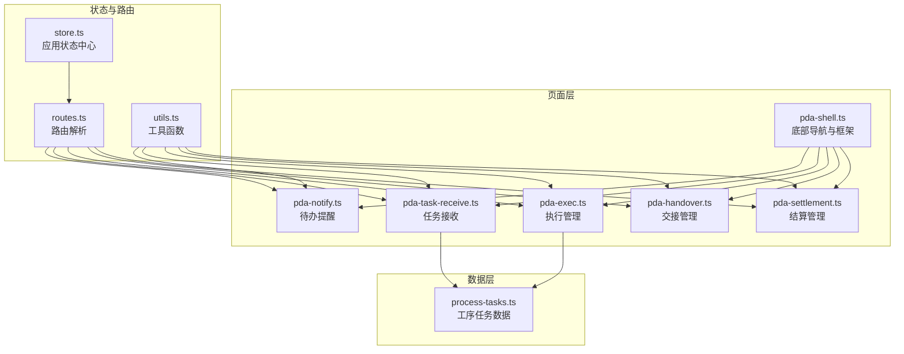
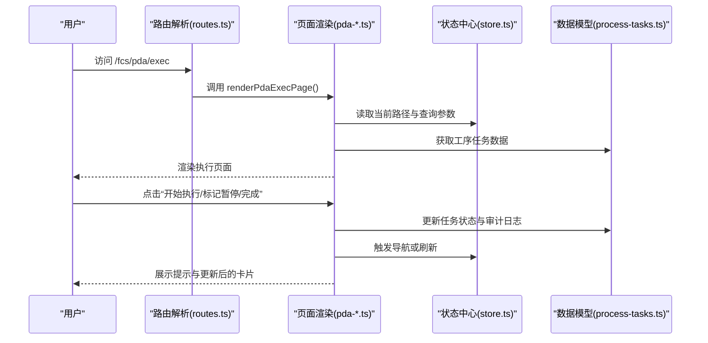
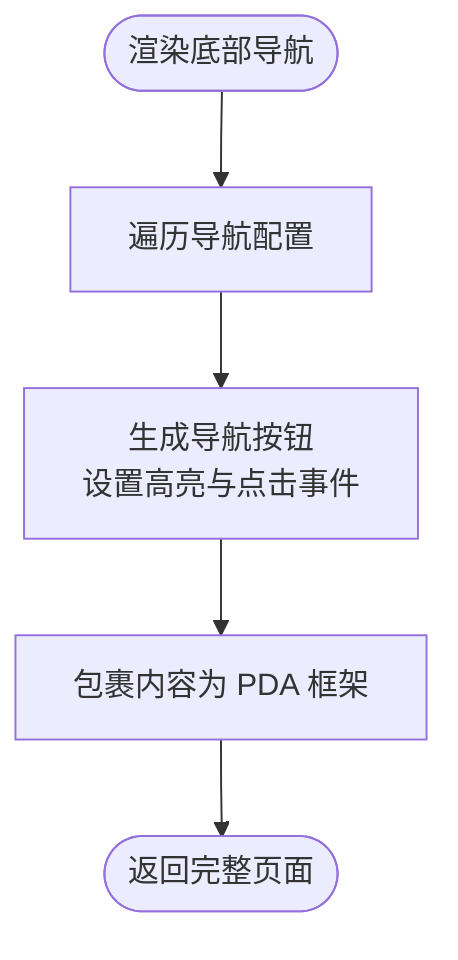
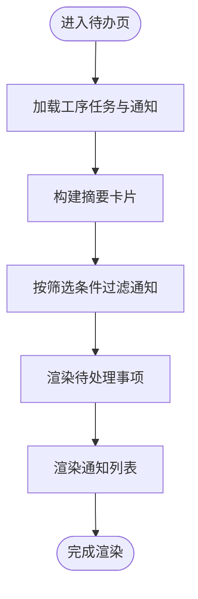
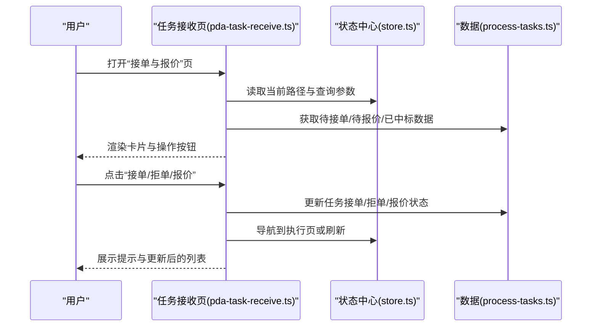
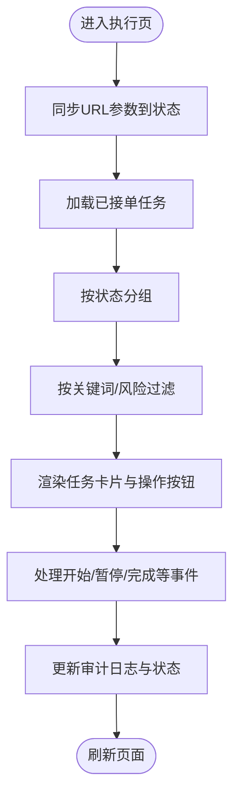
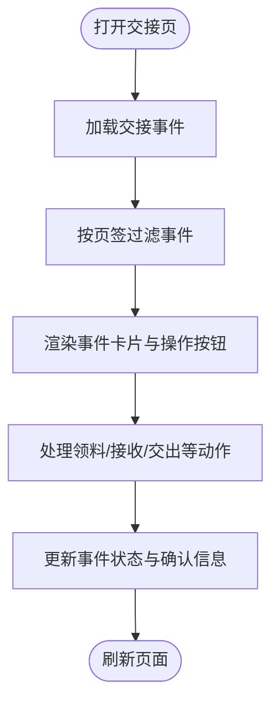
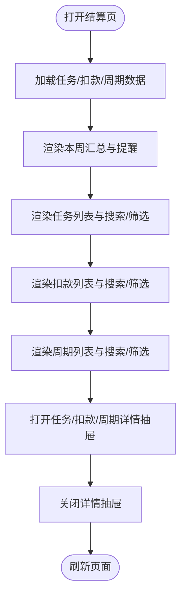
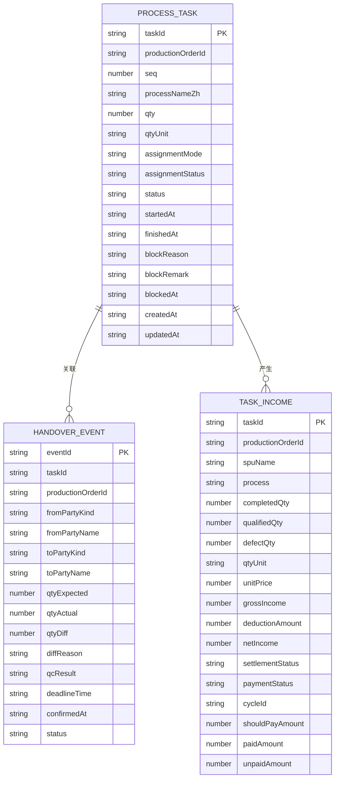
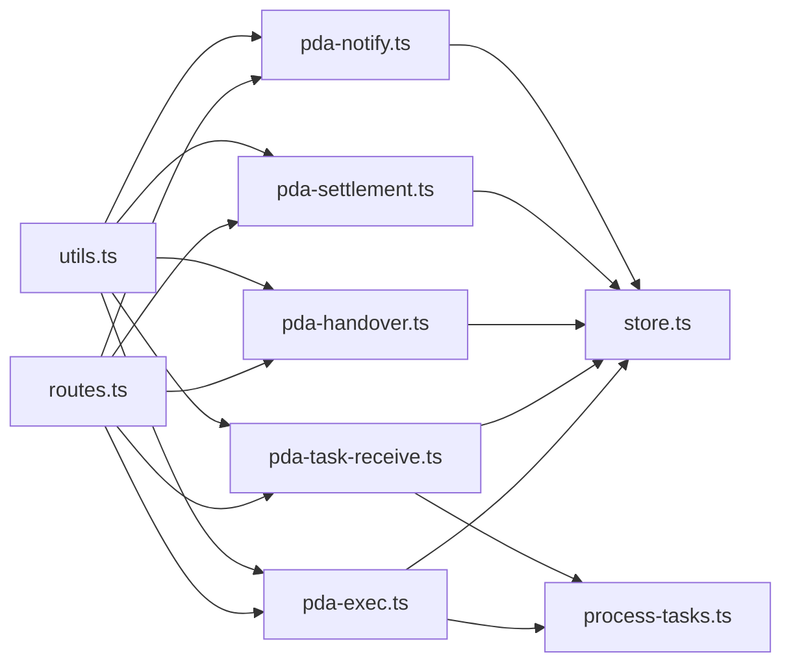

# PDA 移动端系统

<cite>
**本文档引用的文件**
- [pda-shell.ts](file://src/pages/pda-shell.ts)
- [pda-exec.ts](file://src/pages/pda-exec.ts)
- [pda-task-receive.ts](file://src/pages/pda-task-receive.ts)
- [pda-handover.ts](file://src/pages/pda-handover.ts)
- [pda-settlement.ts](file://src/pages/pda-settlement.ts)
- [pda-notify.ts](file://src/pages/pda-notify.ts)
- [process-tasks.ts](file://src/data/fcs/process-tasks.ts)
- [store.ts](file://src/state/store.ts)
- [routes.ts](file://src/router/routes.ts)
- [utils.ts](file://src/utils.ts)
</cite>

## 目录
1. [引言](#引言)
2. [项目结构](#项目结构)
3. [核心组件](#核心组件)
4. [架构总览](#架构总览)
5. [详细组件分析](#详细组件分析)
6. [依赖关系分析](#依赖关系分析)
7. [性能考虑](#性能考虑)
8. [故障排查指南](#故障排查指南)
9. [结论](#结论)
10. [附录](#附录)

## 引言
本文件面向 PDA 移动端系统，系统以移动端优先的设计理念构建，围绕“待办提醒、任务接收、执行管理、交接管理、结算管理”五大移动端工作流展开，提供完整的页面渲染、事件处理、状态管理与数据模型支撑。系统采用轻量级前端架构，通过统一的状态中心与路由分发，实现页面级逻辑与视图的清晰分离；同时内置移动端适配策略（底部导航、滚动区域、输入与按钮尺寸），确保在移动设备上的良好体验。

## 项目结构
系统采用按功能域划分的目录组织方式，核心目录与职责如下：
- src/pages：各业务页面的实现，包含 PDA 五大工作流页面与通用壳层
- src/data：业务数据与类型定义，包含工序任务、交接事件、结算数据等
- src/state：应用状态中心，提供路由状态、标签页、侧边栏等全局状态
- src/router：路由解析与页面渲染映射
- src/utils：通用工具函数（转义、类名拼接、日期格式化）

**图表来源**
- [pda-shell.ts:1-51](file://src/pages/pda-shell.ts#L1-L51)
- [pda-exec.ts:1-800](file://src/pages/pda-exec.ts#L1-L800)
- [pda-task-receive.ts:1-800](file://src/pages/pda-task-receive.ts#L1-L800)
- [pda-handover.ts:1-441](file://src/pages/pda-handover.ts#L1-L441)
- [pda-settlement.ts:1-800](file://src/pages/pda-settlement.ts#L1-L800)
- [pda-notify.ts:1-800](file://src/pages/pda-notify.ts#L1-L800)
- [process-tasks.ts:1-800](file://src/data/fcs/process-tasks.ts#L1-L800)
- [store.ts:1-329](file://src/state/store.ts#L1-L329)
- [routes.ts:1-456](file://src/router/routes.ts#L1-L456)
- [utils.ts:1-18](file://src/utils.ts#L1-L18)

**章节来源**
- [pda-shell.ts:1-51](file://src/pages/pda-shell.ts#L1-L51)
- [routes.ts:320-327](file://src/router/routes.ts#L320-L327)

## 核心组件
- 应用壳层与底部导航
  - 提供统一的 PDA 页面框架与底部导航，支持在不同工作流间快速切换
  - 导航项包含“待办”“接单”“执行”“交接”“结算”，对应系统五大移动端工作流
- 应用状态中心
  - 统一路由路径、标签页、侧边栏折叠状态等全局状态
  - 提供导航方法，驱动页面跳转与标签页同步
- 路由解析器
  - 将 URL 映射到具体页面渲染函数，支持静态路由与动态路由
- 通用工具函数
  - HTML 转义、类名拼接、日期格式化等，保障安全与一致性

**章节来源**
- [pda-shell.ts:3-39](file://src/pages/pda-shell.ts#L3-L39)
- [store.ts:89-304](file://src/state/store.ts#L89-L304)
- [routes.ts:430-456](file://src/router/routes.ts#L430-L456)
- [utils.ts:1-18](file://src/utils.ts#L1-L18)

## 架构总览
系统采用“路由 → 页面 → 数据/状态”的分层架构：
- 路由层负责 URL 到页面渲染函数的映射
- 页面层负责业务视图渲染与用户交互事件处理
- 数据层提供业务实体与类型定义
- 状态层提供全局状态与导航能力

**图表来源**
- [routes.ts:324-324](file://src/router/routes.ts#L324-L324)
- [pda-exec.ts:628-738](file://src/pages/pda-exec.ts#L628-L738)
- [store.ts:172-178](file://src/state/store.ts#L172-L178)
- [process-tasks.ts:26-84](file://src/data/fcs/process-tasks.ts#L26-L84)

## 详细组件分析

### PDA 壳层与底部导航
- 功能要点
  - 渲染固定在底部的导航栏，支持高亮当前页签
  - 将内容区域与导航栏组合为 PDA 页面框架
  - 使用图标与文字标签，适配移动端小屏显示
- 关键实现
  - 导航配置包含键值、标签、链接与图标
  - 通过模板字符串拼接渲染，支持根据活动页签切换样式
- 适用场景
  - 作为所有 PDA 页面的公共外壳，统一风格与交互

**图表来源**
- [pda-shell.ts:12-39](file://src/pages/pda-shell.ts#L12-L39)

**章节来源**
- [pda-shell.ts:20-50](file://src/pages/pda-shell.ts#L20-L50)

### 待办提醒（PDA 通知）
- 功能要点
  - 摘要卡片：待接单、待报价、已中标、待领料、待接收、待交出、暂不能继续、即将逾期
  - 待处理事项：按优先级排序，支持紧急标识
  - 通知提醒：按级别与未读状态展示
- 关键实现
  - 从工序任务与进度数据中聚合统计
  - 支持筛选“全部/未读/已读”，并提供标记已读能力
  - 通过导航动作跳转到对应工作流页签
- 适用场景
  - 快速概览当前工厂的待办与风险事项，引导下一步操作

**图表来源**
- [pda-notify.ts:248-550](file://src/pages/pda-notify.ts#L248-L550)

**章节来源**
- [pda-notify.ts:676-800](file://src/pages/pda-notify.ts#L676-L800)

### 任务接收（接单与报价）
- 功能要点
  - 待接单任务：直接派单且未接单的任务，支持搜索与过滤
  - 待报价招标单：参与竞价的招标单，支持报价对话框
  - 已报价/已中标：展示报价详情与中标结果
- 关键实现
  - 通过本地存储持久化当前工厂 ID
  - 支持按工序与截止状态筛选
  - 报价对话框包含金额、交期与备注字段，提交后更新状态
- 适用场景
  - 工厂在移动端快速查看与处理派单与竞价事项

**图表来源**
- [pda-task-receive.ts:702-790](file://src/pages/pda-task-receive.ts#L702-L790)
- [store.ts:172-178](file://src/state/store.ts#L172-L178)
- [process-tasks.ts:26-84](file://src/data/fcs/process-tasks.ts#L26-L84)

**章节来源**
- [pda-task-receive.ts:702-800](file://src/pages/pda-task-receive.ts#L702-L800)

### 执行管理（任务执行）
- 功能要点
  - 任务状态：待开工、进行中、暂不能继续、已完工
  - 任务筛选：按状态与“即将逾期”风险维度
  - 操作：开始执行、标记暂停、恢复执行、完成任务
- 关键实现
  - 通过本地存储持久化工厂 ID，支持跨会话记忆
  - 任务卡片展示关键信息与风险提示（逾期/即将逾期）
  - 审计日志记录关键操作（开始、完成、暂停/恢复）
- 适用场景
  - 移动端现场执行任务，快速完成状态变更与交接准备

**图表来源**
- [pda-exec.ts:57-70](file://src/pages/pda-exec.ts#L57-L70)
- [pda-exec.ts:628-738](file://src/pages/pda-exec.ts#L628-L738)

**章节来源**
- [pda-exec.ts:628-800](file://src/pages/pda-exec.ts#L628-L800)

### 交接管理（领料/接收/交出）
- 功能要点
  - 待领料：首道工序从仓库领料，完成后具备开工条件
  - 待接收：非首道工序接收上一步半成品，完成数量与质检确认
  - 待交出：本道工序完成后交出给下节点
  - 已处理：展示历史交接记录与争议状态
- 关键实现
  - 通过本地存储持久化工厂 ID
  - 依据事件截止时间计算“即将逾期/已逾期”徽章
  - 支持 QC 结果展示与差异说明
- 适用场景
  - 移动端现场交接，快速完成数量确认与质检流程

**图表来源**
- [pda-handover.ts:311-413](file://src/pages/pda-handover.ts#L311-L413)

**章节来源**
- [pda-handover.ts:311-441](file://src/pages/pda-handover.ts#L311-L441)

### 结算管理（收入与扣款）
- 功能要点
  - 本周能拿多少钱：汇总应结金额、已付、未付与付款进度
  - 任务明细：展示任务收入、数量与付款记录
  - 扣款明细：展示扣款原因、来源与是否计入本周结算
  - 结算周期：按周/月周期查看付款状态与覆盖任务
- 关键实现
  - 通过本地存储持久化当前工厂 ID
  - 支持抽屉式详情面板，便于移动端查看
  - 数字格式化与进度条展示，提升可读性
- 适用场景
  - 移动端查看与核对结算与付款情况，了解收入与扣款影响

**图表来源**
- [pda-settlement.ts:539-739](file://src/pages/pda-settlement.ts#L539-L739)
- [pda-settlement.ts:741-800](file://src/pages/pda-settlement.ts#L741-L800)

**章节来源**
- [pda-settlement.ts:1-800](file://src/pages/pda-settlement.ts#L1-L800)

### 数据模型与类型
- 工序任务（ProcessTask）
  - 包含任务 ID、生产单号、工序序列、数量与单位、派单模式与状态
  - 支持直接派单、竞价与中标流程
  - 审计日志记录关键操作与时间戳
- 交接事件（HandoverEvent）
  - 包含事件 ID、任务 ID、来源/去向方、数量与差异、QC 结果与截止时间
  - 支持 PICKUP/RECEIVE/HANDOUT 三种动作与状态管理
- 结算数据
  - 任务收入、扣款记录、支付记录与结算周期
  - 支持按周/月周期查看与付款进度

**图表来源**
- [process-tasks.ts:26-84](file://src/data/fcs/process-tasks.ts#L26-L84)

**章节来源**
- [process-tasks.ts:1-800](file://src/data/fcs/process-tasks.ts#L1-L800)

## 依赖关系分析
- 页面与状态中心
  - 各 PDA 页面通过 appStore.getState()/navigate() 读取与更新路径状态
- 页面与数据模型
  - 执行与任务接收页依赖工序任务数据模型，进行状态筛选与更新
- 路由与页面
  - 路由解析器将 URL 映射到具体页面渲染函数，支持静态与动态路由
- 工具函数
  - HTML 转义与类名拼接用于安全渲染与样式控制

**图表来源**
- [routes.ts:320-405](file://src/router/routes.ts#L320-L405)
- [store.ts:172-178](file://src/state/store.ts#L172-L178)
- [process-tasks.ts:26-84](file://src/data/fcs/process-tasks.ts#L26-L84)
- [utils.ts:1-18](file://src/utils.ts#L1-L18)

**章节来源**
- [routes.ts:430-456](file://src/router/routes.ts#L430-L456)
- [store.ts:89-304](file://src/state/store.ts#L89-L304)

## 性能考虑
- 渲染优化
  - 使用模板字符串拼接与局部更新，避免不必要的 DOM 重建
  - 通过状态签名与查询字符串同步，减少重复渲染
- 数据访问
  - 本地存储缓存工厂 ID 与会话信息，降低重复解析成本
- 事件处理
  - 使用事件委托与最小化监听范围，减少内存占用
- 移动端适配
  - 固定底部导航与滚动区域，避免频繁布局抖动
  - 控制字体与按钮尺寸，提升触摸可达性

## 故障排查指南
- 页面空白或导航无效
  - 检查路由映射是否正确，确认 URL 是否命中静态或动态路由
  - 核对 appStore.getState().pathname 与当前页签是否一致
- 任务状态未更新
  - 确认 mutate* 函数是否被调用（如开始/完成/暂停）
  - 检查审计日志是否追加，确认 updatedAt 是否更新
- 本地存储异常
  - 检查 localStorage 写入权限与容量限制
  - 在 try/catch 中忽略存储错误，避免阻塞页面渲染
- 通知未读状态异常
  - 确认 markNotificationRead/markAllNotificationsRead 的调用时机
  - 校验通知列表的筛选逻辑与排序

**章节来源**
- [pda-exec.ts:226-264](file://src/pages/pda-exec.ts#L226-L264)
- [pda-notify.ts:162-189](file://src/pages/pda-notify.ts#L162-L189)
- [store.ts:50-56](file://src/state/store.ts#L50-L56)

## 结论
PDA 移动端系统以清晰的分层架构与统一的壳层设计，实现了待办提醒、任务接收、执行管理、交接管理与结算管理的移动端工作流闭环。通过状态中心与路由解析的配合，页面逻辑与视图分离，便于维护与扩展。结合本地存储与移动端适配策略，系统在弱网与小屏环境下仍能提供稳定高效的使用体验。

## 附录
- 代码示例路径（仅提供路径，不展示具体代码）
  - [待办提醒页面渲染:676-800](file://src/pages/pda-notify.ts#L676-L800)
  - [任务接收页面渲染:702-800](file://src/pages/pda-task-receive.ts#L702-L800)
  - [执行管理页面渲染:628-800](file://src/pages/pda-exec.ts#L628-L800)
  - [交接管理页面渲染:311-441](file://src/pages/pda-handover.ts#L311-L441)
  - [结算管理页面渲染:539-800](file://src/pages/pda-settlement.ts#L539-L800)
  - [PDA 壳层与底部导航:20-50](file://src/pages/pda-shell.ts#L20-L50)
  - [应用状态中心:89-304](file://src/state/store.ts#L89-L304)
  - [路由解析:430-456](file://src/router/routes.ts#L430-L456)
  - [HTML 转义与类名拼接:1-12](file://src/utils.ts#L1-L12)