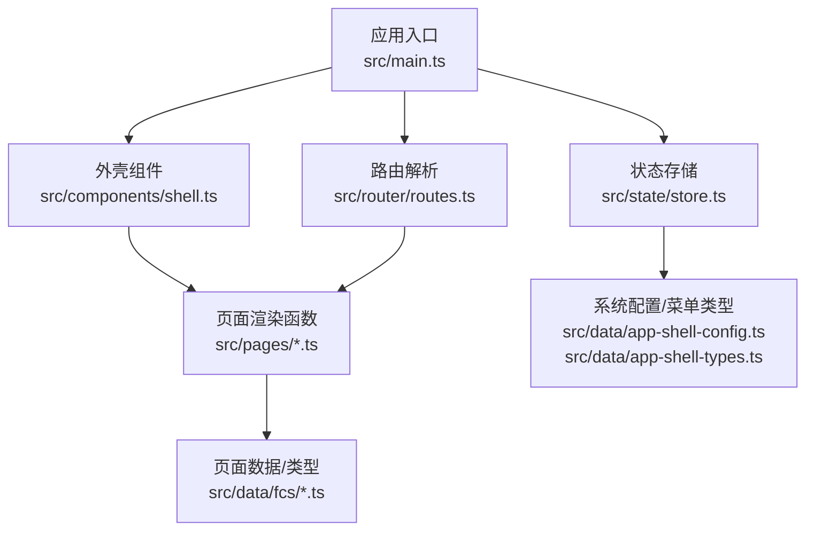
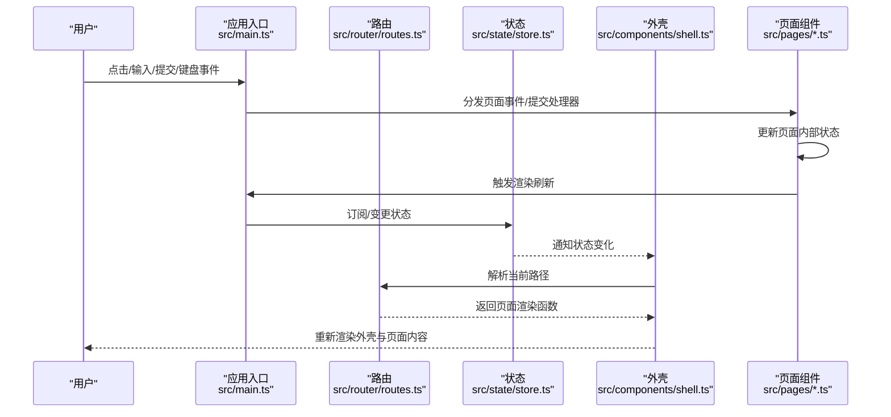
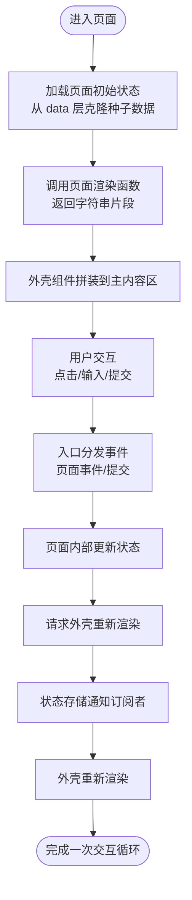
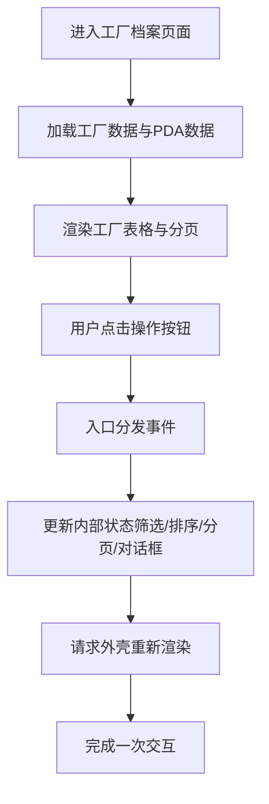
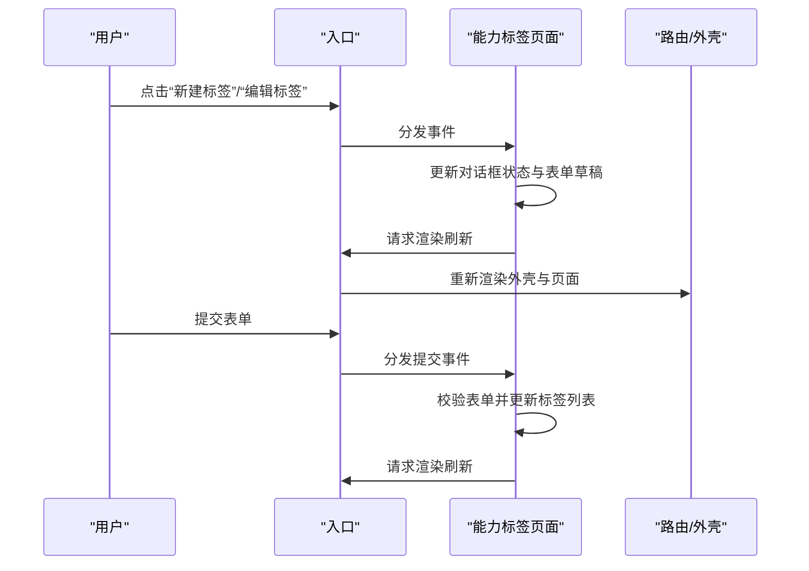
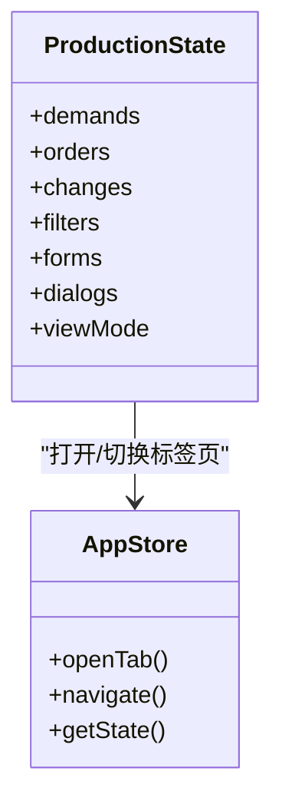
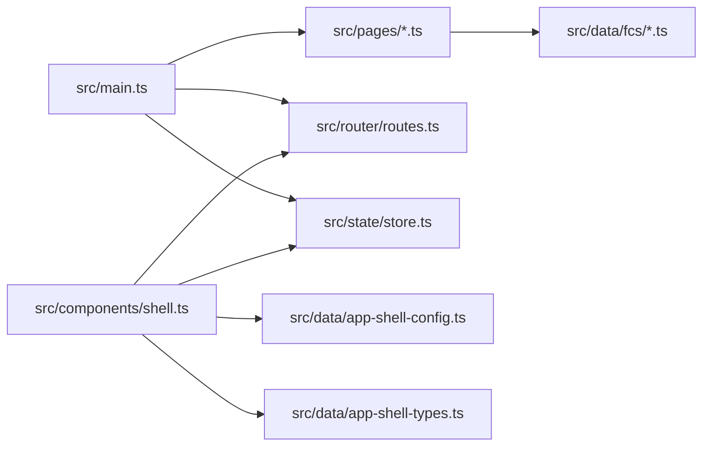

# 页面组件系统

<cite>
**本文引用的文件**
- [src/main.ts](file://src/main.ts)
- [src/router/routes.ts](file://src/router/routes.ts)
- [src/state/store.ts](file://src/state/store.ts)
- [src/components/shell.ts](file://src/components/shell.ts)
- [src/utils.ts](file://src/utils.ts)
- [src/pages/factory-profile.ts](file://src/pages/factory-profile.ts)
- [src/pages/capability.ts](file://src/pages/capability.ts)
- [src/pages/production.ts](file://src/pages/production.ts)
- [src/data/app-shell-config.ts](file://src/data/app-shell-config.ts)
- [src/data/app-shell-types.ts](file://src/data/app-shell-types.ts)
- [src/data/fcs/factory-types.ts](file://src/data/fcs/factory-types.ts)
- [src/data/fcs/capability-types.ts](file://src/data/fcs/capability-types.ts)
</cite>

## 目录
1. [简介](#简介)
2. [项目结构](#项目结构)
3. [核心组件](#核心组件)
4. [架构总览](#架构总览)
5. [详细组件分析](#详细组件分析)
6. [依赖关系分析](#依赖关系分析)
7. [性能考量](#性能考量)
8. [故障排查指南](#故障排查指南)
9. [结论](#结论)
10. [附录](#附录)

## 简介
本技术文档面向“页面组件系统”，系统性阐述页面组件的架构设计、组织方式与实现模式，覆盖数据获取、状态管理、用户交互与渲染逻辑；说明页面组件与状态管理、路由系统的集成方式；提供开发新页面组件的步骤与最佳实践；并给出常见页面类型的实现指南，帮助开发者高效复用与扩展。

## 项目结构
- 应用入口与事件分发：通过应用入口集中注册页面事件处理器与全局事件监听，驱动状态变更与重新渲染。
- 路由与页面渲染：路由层负责路径到页面渲染函数的映射，页面渲染函数返回字符串片段，交由外壳组件拼装。
- 外壳与状态：外壳组件负责顶部栏、侧边菜单、标签页与主内容区域的渲染；状态层负责系统切换、菜单展开、标签页、侧边栏状态等。
- 页面组件：每个页面模块封装自身状态、过滤器、分页、对话框与交互事件处理，提供统一的渲染函数与事件处理函数。
- 数据与类型：页面组件的数据来源与类型定义位于 data 层，页面组件通过导入类型与数据进行渲染与校验。

图表来源
- [src/main.ts:1-933](file://src/main.ts#L1-L933)
- [src/router/routes.ts:1-454](file://src/router/routes.ts#L1-L454)
- [src/state/store.ts:1-329](file://src/state/store.ts#L1-L329)
- [src/components/shell.ts:1-324](file://src/components/shell.ts#L1-L324)
- [src/data/app-shell-config.ts:1-355](file://src/data/app-shell-config.ts#L1-L355)
- [src/data/app-shell-types.ts:1-46](file://src/data/app-shell-types.ts#L1-L46)

章节来源
- [src/main.ts:1-933](file://src/main.ts#L1-L933)
- [src/router/routes.ts:1-454](file://src/router/routes.ts#L1-L454)
- [src/state/store.ts:1-329](file://src/state/store.ts#L1-L329)
- [src/components/shell.ts:1-324](file://src/components/shell.ts#L1-L324)
- [src/data/app-shell-config.ts:1-355](file://src/data/app-shell-config.ts#L1-L355)
- [src/data/app-shell-types.ts:1-46](file://src/data/app-shell-types.ts#L1-L46)

## 核心组件
- 应用入口与事件总线
  - 注册所有页面事件处理器与提交处理器，集中处理点击、输入、变更、提交等事件，触发页面内部状态更新与渲染刷新。
  - 提供键盘事件（如 Esc）的统一处理，用于关闭各类弹窗与对话框。
- 路由系统
  - 定义精确路由与动态路由，将路径映射到对应的页面渲染函数；找不到时返回占位页或 404。
- 状态存储
  - 维护当前路径、侧边栏状态、标签页集合与展开状态；提供订阅与变更接口，驱动外壳组件重绘。
- 外壳组件
  - 渲染顶部栏、系统切换、侧边菜单、标签页与主内容区域；主内容区域调用路由解析后的页面渲染函数。
- 页面组件
  - 每个页面模块维护自身状态（过滤、排序、分页、对话框、表单草稿等），提供渲染函数与事件处理函数；部分页面还提供“是否打开对话框”的查询函数。

章节来源
- [src/main.ts:1-933](file://src/main.ts#L1-L933)
- [src/router/routes.ts:1-454](file://src/router/routes.ts#L1-L454)
- [src/state/store.ts:1-329](file://src/state/store.ts#L1-L329)
- [src/components/shell.ts:1-324](file://src/components/shell.ts#L1-L324)
- [src/pages/factory-profile.ts:1-1880](file://src/pages/factory-profile.ts#L1-L1880)
- [src/pages/capability.ts:1-988](file://src/pages/capability.ts#L1-L988)
- [src/pages/production.ts:1-5456](file://src/pages/production.ts#L1-L5456)

## 架构总览
页面组件系统采用“事件驱动 + 状态驱动 + 路由驱动”的组合架构：
- 事件驱动：入口集中捕获 DOM 事件，按页面模块分发，页面内部更新状态并触发渲染。
- 状态驱动：状态存储负责全局 UI 状态（路径、菜单、标签页、侧边栏），外壳组件订阅状态变化并重绘。
- 路由驱动：路由层将 URL 与页面渲染函数解耦，页面渲染函数返回字符串片段，外壳组件拼装到主内容区。

图表来源
- [src/main.ts:1-933](file://src/main.ts#L1-L933)
- [src/router/routes.ts:1-454](file://src/router/routes.ts#L1-L454)
- [src/state/store.ts:1-329](file://src/state/store.ts#L1-L329)
- [src/components/shell.ts:1-324](file://src/components/shell.ts#L1-L324)

## 详细组件分析

### 页面组件通用模式
- 状态模型
  - 页面内部状态：包含数据列表、筛选器、排序、分页、对话框状态、表单草稿、错误信息等。
  - 状态更新：通过事件处理器更新内部状态，必要时调用状态存储以同步标签页与路径。
- 数据获取与过滤
  - 列表数据通常来自 data 层的模拟数据或种子数据；页面内部通过过滤器与排序函数生成可见数据集。
- 用户交互
  - 通过 data-* 属性标识交互行为（如 data-action、data-field、data-filter、data-*Action），入口统一捕获并分发给对应页面模块。
- 渲染逻辑
  - 页面提供渲染函数，返回字符串片段；外壳组件将其拼接到主内容区域；工具函数提供安全转义与样式拼接。
- 生命周期
  - 初始化：页面模块在首次渲染时构建初始状态（如从 data 层克隆种子数据）。
  - 更新：事件触发后更新内部状态并请求外壳重新渲染。
  - 销毁：页面组件不直接管理 DOM 销毁，由外壳与路由控制内容替换。

章节来源
- [src/pages/factory-profile.ts:1-1880](file://src/pages/factory-profile.ts#L1-L1880)
- [src/pages/capability.ts:1-988](file://src/pages/capability.ts#L1-L988)
- [src/pages/production.ts:1-5456](file://src/pages/production.ts#L1-L5456)
- [src/utils.ts:1-18](file://src/utils.ts#L1-L18)

### 页面组件与状态管理、路由系统的集成
- 与状态管理的集成
  - 页面可通过状态存储打开/切换标签页、导航到指定路径，实现跨页面的状态联动。
  - 外壳组件订阅状态变化，自动重绘菜单、标签页与主内容。
- 与路由系统的集成
  - 路由层将 URL 与页面渲染函数解耦；页面渲染函数返回字符串片段，外壳组件拼装到主内容区。
  - 动态路由支持参数化页面（如详情页、编辑页），精确路由覆盖固定页面。

图表来源
- [src/main.ts:1-933](file://src/main.ts#L1-L933)
- [src/state/store.ts:1-329](file://src/state/store.ts#L1-L329)
- [src/components/shell.ts:1-324](file://src/components/shell.ts#L1-L324)
- [src/router/routes.ts:1-454](file://src/router/routes.ts#L1-L454)

章节来源
- [src/main.ts:1-933](file://src/main.ts#L1-L933)
- [src/state/store.ts:1-329](file://src/state/store.ts#L1-L329)
- [src/components/shell.ts:1-324](file://src/components/shell.ts#L1-L324)
- [src/router/routes.ts:1-454](file://src/router/routes.ts#L1-L454)

### 页面组件间通信与数据共享
- 事件分发
  - 入口集中捕获事件并通过页面模块的事件处理函数进行分发，避免跨页面直接耦合。
- 共享状态
  - 外壳与状态层提供全局 UI 状态（路径、菜单、标签页、侧边栏），页面可通过状态存储进行跨页面联动。
- 数据来源
  - 页面组件通过导入 data 层的数据与类型，确保数据一致性与类型安全。

章节来源
- [src/main.ts:1-933](file://src/main.ts#L1-L933)
- [src/state/store.ts:1-329](file://src/state/store.ts#L1-L329)
- [src/data/fcs/factory-types.ts:1-155](file://src/data/fcs/factory-types.ts#L1-L155)
- [src/data/fcs/capability-types.ts:1-47](file://src/data/fcs/capability-types.ts#L1-L47)

### 典型页面组件：工厂档案（factory-profile）
- 职责与数据
  - 维护工厂列表、筛选器（关键词、状态、层级、类型、PDA 状态）、排序、分页与对话框状态。
  - 支持工厂创建、编辑、删除与 PDA 账号/角色权限管理。
- 实现要点
  - 内部状态包含工厂列表、表单草稿、PDA 用户与角色数据、错误信息等。
  - 通过事件处理器更新筛选器、排序、分页与对话框状态；渲染函数返回表格、分页与对话框。
- 交互与渲染
  - 使用 data-* 属性标识操作（如编辑、删除、翻页、切换 PDA 用户状态等）。
  - 渲染函数中对文本进行安全转义，避免 XSS。

图表来源
- [src/pages/factory-profile.ts:1-1880](file://src/pages/factory-profile.ts#L1-L1880)

章节来源
- [src/pages/factory-profile.ts:1-1880](file://src/pages/factory-profile.ts#L1-L1880)

### 典型页面组件：能力标签（capability）
- 职责与数据
  - 维护标签与分类的列表、筛选器（分类、状态、系统标签）、排序与分页。
  - 支持标签的创建/编辑、禁用确认、详情查看与分类管理。
- 实现要点
  - 内部状态包含标签与分类列表、表单错误、对话框状态与动作菜单。
  - 事件处理函数覆盖筛选、排序、对话框开关、表单提交与禁用确认。
- 交互与渲染
  - 渲染函数返回筛选区、表格、分页与多个对话框（表单、分类管理、禁用确认、详情）。

图表来源
- [src/pages/capability.ts:1-988](file://src/pages/capability.ts#L1-L988)

章节来源
- [src/pages/capability.ts:1-988](file://src/pages/capability.ts#L1-L988)

### 典型页面组件：生产单管理（production）
- 职责与数据
  - 维护生产需求与生产单列表、筛选器（状态、技术档、拆单、委派进度、委派模式、风险等级、层级）、分页与视图模式。
  - 支持计划、交付仓、变更、状态管理与详情页标签切换。
- 实现要点
  - 内部状态庞大，包含需求、订单、变更三类数据及其各自的筛选器、表单与对话框。
  - 提供多种视图模式（表格/看板），支持批量操作与单条生成。
- 交互与渲染
  - 通过状态存储打开/切换标签页，实现跨页面导航与联动。

图表来源
- [src/pages/production.ts:1-5456](file://src/pages/production.ts#L1-L5456)
- [src/state/store.ts:1-329](file://src/state/store.ts#L1-L329)

章节来源
- [src/pages/production.ts:1-5456](file://src/pages/production.ts#L1-L5456)
- [src/state/store.ts:1-329](file://src/state/store.ts#L1-L329)

### 页面组件开发步骤与最佳实践
- 步骤
  - 在 data 层定义数据与类型（如工厂类型、能力标签类型）。
  - 在 pages 目录创建新页面模块，定义内部状态、筛选器、分页与对话框。
  - 实现渲染函数与事件处理函数，使用 data-* 属性标识交互。
  - 在入口注册事件处理函数与提交处理函数，在外壳中注册页面渲染函数。
  - 在路由层注册精确路由或动态路由。
- 最佳实践
  - 使用工具函数进行安全转义与样式拼接，避免 XSS 与样式注入。
  - 将复杂交互拆分为小的事件处理器，保持单一职责。
  - 使用状态存储进行必要的全局联动（如标签页、路径、侧边栏）。
  - 对列表数据进行分页与懒渲染，提升大列表性能。
  - 对表单草稿进行深拷贝，避免意外污染原始数据。

章节来源
- [src/utils.ts:1-18](file://src/utils.ts#L1-L18)
- [src/pages/factory-profile.ts:1-1880](file://src/pages/factory-profile.ts#L1-L1880)
- [src/pages/capability.ts:1-988](file://src/pages/capability.ts#L1-L988)
- [src/pages/production.ts:1-5456](file://src/pages/production.ts#L1-L5456)
- [src/router/routes.ts:1-454](file://src/router/routes.ts#L1-L454)
- [src/main.ts:1-933](file://src/main.ts#L1-L933)

## 依赖关系分析
- 组件耦合
  - 入口与页面模块：通过事件分发弱耦合，页面模块不直接依赖入口。
  - 外壳与页面模块：通过路由解析与渲染函数弱耦合，外壳不直接依赖具体页面。
  - 页面模块与数据层：强类型依赖，确保数据结构一致。
- 外部依赖
  - 图标库（lucide）：外壳组件负责图标初始化与渲染。
  - 浏览器本地存储：状态存储持久化标签页与侧边栏折叠状态。

图表来源
- [src/main.ts:1-933](file://src/main.ts#L1-L933)
- [src/router/routes.ts:1-454](file://src/router/routes.ts#L1-L454)
- [src/state/store.ts:1-329](file://src/state/store.ts#L1-L329)
- [src/components/shell.ts:1-324](file://src/components/shell.ts#L1-L324)
- [src/data/app-shell-config.ts:1-355](file://src/data/app-shell-config.ts#L1-L355)
- [src/data/app-shell-types.ts:1-46](file://src/data/app-shell-types.ts#L1-L46)
- [src/data/fcs/factory-types.ts:1-155](file://src/data/fcs/factory-types.ts#L1-L155)
- [src/data/fcs/capability-types.ts:1-47](file://src/data/fcs/capability-types.ts#L1-L47)

章节来源
- [src/main.ts:1-933](file://src/main.ts#L1-L933)
- [src/router/routes.ts:1-454](file://src/router/routes.ts#L1-L454)
- [src/state/store.ts:1-329](file://src/state/store.ts#L1-L329)
- [src/components/shell.ts:1-324](file://src/components/shell.ts#L1-L324)
- [src/data/app-shell-config.ts:1-355](file://src/data/app-shell-config.ts#L1-L355)
- [src/data/app-shell-types.ts:1-46](file://src/data/app-shell-types.ts#L1-L46)
- [src/data/fcs/factory-types.ts:1-155](file://src/data/fcs/factory-types.ts#L1-L155)
- [src/data/fcs/capability-types.ts:1-47](file://src/data/fcs/capability-types.ts#L1-L47)

## 性能考量
- 列表渲染
  - 使用分页减少一次性渲染的数据量；对大列表采用虚拟滚动或懒加载策略。
- 事件处理
  - 避免在高频事件（如 input/change）中触发全量重渲染；尽量局部更新。
- 状态订阅
  - 仅订阅必要状态，减少不必要的重绘。
- 图标与资源
  - 图标库按需初始化，避免重复扫描文档节点。

## 故障排查指南
- 页面不更新
  - 检查事件是否正确分发至页面模块；确认页面内部状态更新后请求了外壳重新渲染。
- 路由不生效
  - 检查路由精确匹配与动态匹配规则；确认路径规范化与菜单项 href 一致。
- 标签页异常
  - 检查状态存储的标签页持久化与激活键；确认切换系统时默认页正确。
- XSS 风险
  - 确保所有用户输入与动态内容均经过安全转义；使用工具函数进行转义。

章节来源
- [src/main.ts:1-933](file://src/main.ts#L1-L933)
- [src/router/routes.ts:1-454](file://src/router/routes.ts#L1-L454)
- [src/state/store.ts:1-329](file://src/state/store.ts#L1-L329)
- [src/utils.ts:1-18](file://src/utils.ts#L1-L18)

## 结论
页面组件系统通过“事件驱动 + 状态驱动 + 路由驱动”的架构，实现了页面与外壳、页面与状态、页面与路由之间的低耦合与高内聚。页面组件遵循统一的模式：内部状态管理、事件分发、渲染函数与数据来源，配合状态存储与路由层，形成清晰的职责边界与可扩展的开发范式。开发者可据此快速开发新页面组件，并通过最佳实践保障可维护性与性能。

## 附录
- 常见页面类型实现指南
  - 列表页：定义筛选器、排序、分页与对话框状态；提供渲染函数与事件处理函数。
  - 表单页：维护表单草稿与错误信息；提供提交处理函数与状态存储联动。
  - 详情页：通过动态路由参数化；提供标签页切换与面包屑导航。
  - 设置页：维护多组配置与校验；提供保存与重置逻辑。