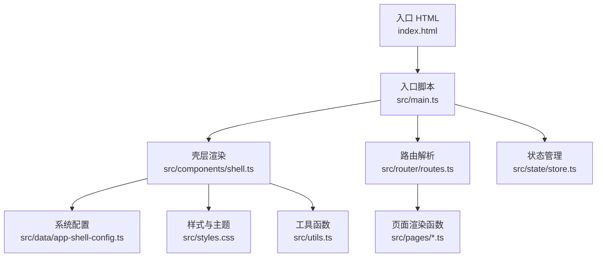
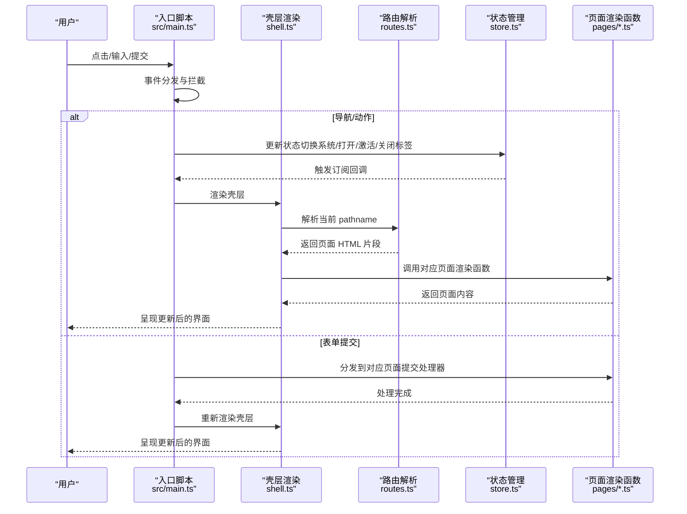
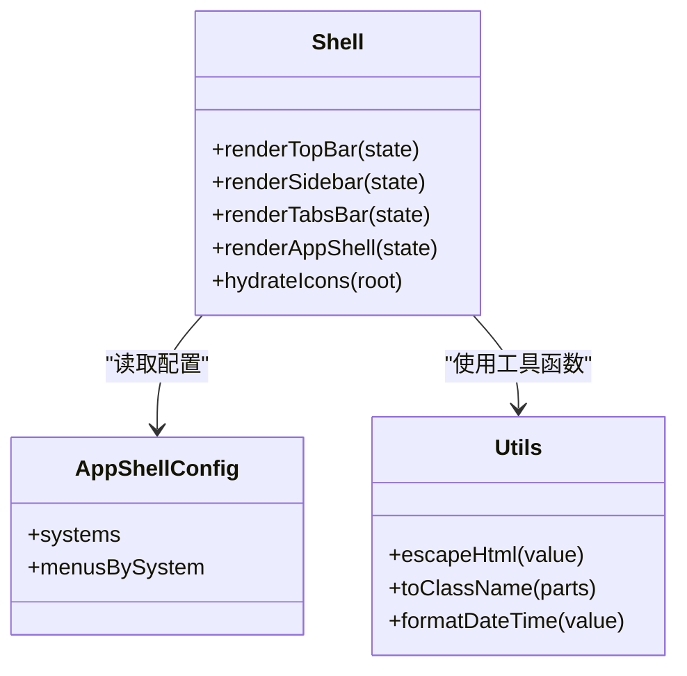
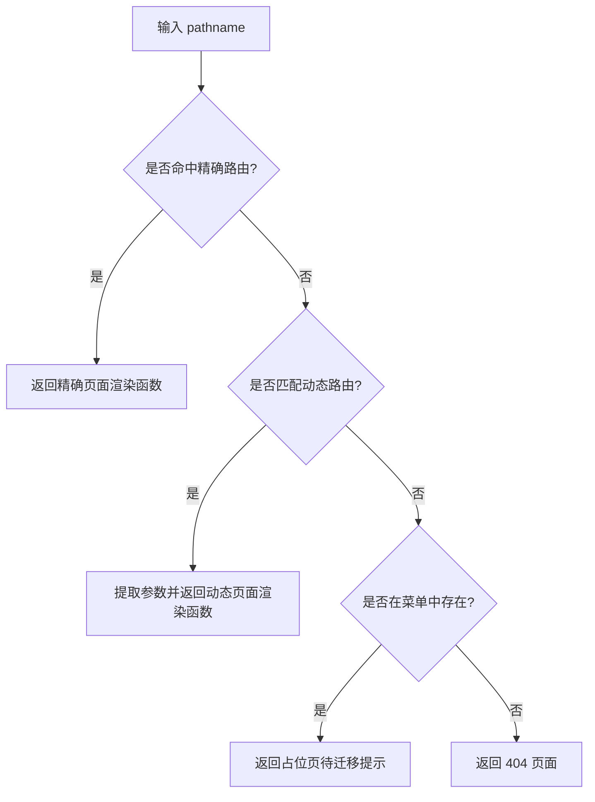
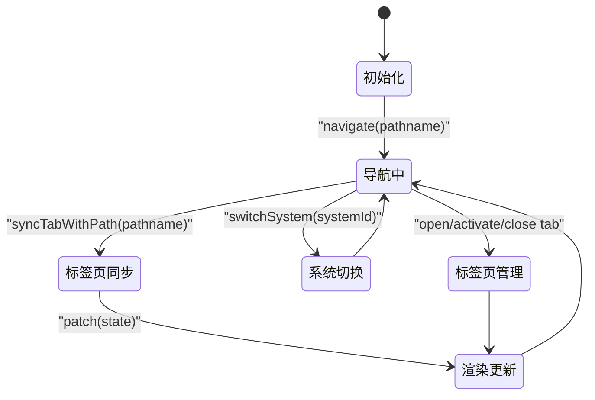
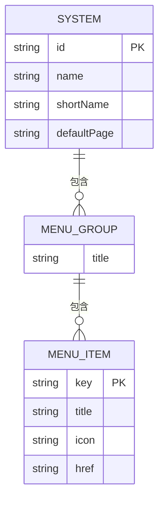
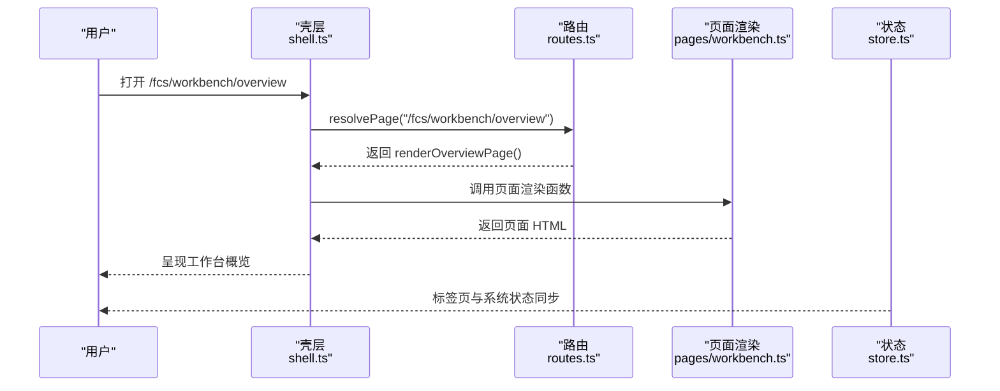
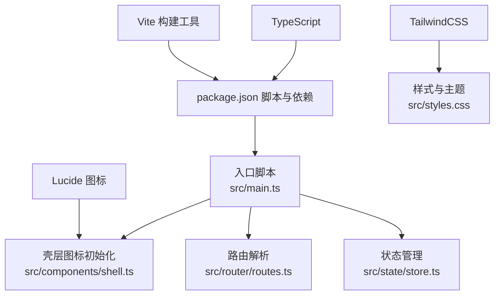

# 项目概述

<cite>
**本文档引用的文件**
- [README.md](file://README.md)
- [package.json](file://package.json)
- [vite.config.ts](file://vite.config.ts)
- [index.html](file://index.html)
- [src/main.ts](file://src/main.ts)
- [src/components/shell.ts](file://src/components/shell.ts)
- [src/state/store.ts](file://src/state/store.ts)
- [src/router/routes.ts](file://src/router/routes.ts)
- [src/data/app-shell-config.ts](file://src/data/app-shell-config.ts)
- [src/data/app-shell-types.ts](file://src/data/app-shell-types.ts)
- [src/styles.css](file://src/styles.css)
- [src/utils.ts](file://src/utils.ts)
- [src/pages/workbench.ts](file://src/pages/workbench.ts)
- [src/pages/factory-profile.ts](file://src/pages/factory-profile.ts)
- [src/pages/pcs-workspace-overview.ts](file://src/pages/pcs-workspace-overview.ts)
</cite>

## 目录
1. [引言](#引言)
2. [项目结构](#项目结构)
3. [核心组件](#核心组件)
4. [架构总览](#架构总览)
5. [详细组件分析](#详细组件分析)
6. [依赖关系分析](#依赖关系分析)
7. [性能考虑](#性能考虑)
8. [故障排查指南](#故障排查指南)
9. [结论](#结论)
10. [附录](#附录)

## 引言
higoods 是一个面向企业级多系统集成的前端管理平台，目标是通过统一的门户界面，支撑多业务系统（如 FCS 工厂生产协同系统、PCS 商品中心系统、PMS 采购管理系统、WLS 仓储物流系统、LOS 直播运营系统、OMS 订单管理系统、BFIS 业财一体化系统、DDS 数据决策系统等）的统一访问与操作。项目采用原生 JavaScript + DOM 操作的轻量架构，结合 Vite 构建工具与 TailwindCSS 样式体系，实现高性能、低耦合、易扩展的企业级前端应用。

本项目强调：
- 统一门户：以“系统切换 + 左侧菜单 + 标签页”的壳层结构，串联多系统功能。
- 原生前端：避免复杂框架带来的体积与学习成本，聚焦业务逻辑与交互体验。
- 可扩展性：通过配置驱动的菜单与路由，快速接入新系统与新页面。
- 开发体验：Vite 提供热更新与快速构建，TailwindCSS 提供一致的样式基线。

## 项目结构
项目采用“壳层 + 配置 + 页面 + 数据种子”的分层组织方式：
- 壳层与路由：shell.ts 负责顶部栏、左侧菜单、标签页渲染；routes.ts 负责精确路由与动态路由解析。
- 状态管理：store.ts 提供全局状态与标签页持久化。
- 配置层：app-shell-config.ts 定义系统与菜单配置；app-shell-types.ts 定义壳层类型。
- 页面层：pages/* 下按系统与功能域组织页面渲染函数。
- 数据层：data/* 下包含各系统业务数据与类型定义（如 FCS 工厂相关数据）。
- 样式与工具：styles.css 提供主题与动画；utils.ts 提供通用工具函数。

图表来源
- [index.html](file://index.html)
- [src/main.ts](file://src/main.ts)
- [src/components/shell.ts](file://src/components/shell.ts)
- [src/router/routes.ts](file://src/router/routes.ts)
- [src/state/store.ts](file://src/state/store.ts)
- [src/data/app-shell-config.ts](file://src/data/app-shell-config.ts)
- [src/styles.css](file://src/styles.css)
- [src/utils.ts](file://src/utils.ts)

章节来源
- [index.html](file://index.html)
- [src/main.ts](file://src/main.ts)
- [src/components/shell.ts](file://src/components/shell.ts)
- [src/router/routes.ts](file://src/router/routes.ts)
- [src/state/store.ts](file://src/state/store.ts)
- [src/data/app-shell-config.ts](file://src/data/app-shell-config.ts)
- [src/styles.css](file://src/styles.css)
- [src/utils.ts](file://src/utils.ts)

## 核心组件
- 应用壳层（AppShell）
  - 渲染顶部系统切换栏、左侧菜单树、标签页条，负责系统间切换与页面导航。
  - 使用图标库（lucide）与 TailwindCSS 实现一致的视觉与交互体验。
- 路由与页面解析
  - 精确路由表与动态路由表组合，支持固定路径与参数化路径。
  - 通过 resolvePage 将当前 pathname 解析到具体页面渲染函数。
- 全局状态与标签页
  - AppStore 统一管理 pathname、侧边栏状态、菜单展开状态、标签页集合与激活状态。
  - 标签页持久化至本地存储，支持跨会话恢复。
- 系统与菜单配置
  - 通过系统列表与菜单分组配置，实现多系统导航与权限边界控制。
- 工具与样式
  - escapeHtml 防护 XSS；toClassName 组合类名；formatDateTime 格式化时间。
  - TailwindCSS 主题变量与动画，保证一致性与流畅过渡。

章节来源
- [src/components/shell.ts](file://src/components/shell.ts)
- [src/router/routes.ts](file://src/router/routes.ts)
- [src/state/store.ts](file://src/state/store.ts)
- [src/data/app-shell-config.ts](file://src/data/app-shell-config.ts)
- [src/data/app-shell-types.ts](file://src/data/app-shell-types.ts)
- [src/utils.ts](file://src/utils.ts)
- [src/styles.css](file://src/styles.css)

## 架构总览
下图展示了从用户交互到页面渲染的端到端流程，以及壳层、路由、状态与页面之间的关系。

图表来源
- [src/main.ts](file://src/main.ts)
- [src/components/shell.ts](file://src/components/shell.ts)
- [src/router/routes.ts](file://src/router/routes.ts)
- [src/state/store.ts](file://src/state/store.ts)
- [src/pages/workbench.ts](file://src/pages/workbench.ts)
- [src/pages/factory-profile.ts](file://src/pages/factory-profile.ts)
- [src/pages/pcs-workspace-overview.ts](file://src/pages/pcs-workspace-overview.ts)

## 详细组件分析

### 壳层组件（AppShell）
壳层负责系统切换、菜单渲染、标签页管理与图标初始化。其职责包括：
- 顶部系统切换按钮，支持切换不同系统默认页。
- 左侧菜单树，支持分组折叠、子项展开与高亮。
- 标签页条，支持打开、激活、关闭标签页，自动同步 pathname。
- 图标初始化，使用 lucide 渲染统一图标集。

图表来源
- [src/components/shell.ts](file://src/components/shell.ts)
- [src/data/app-shell-config.ts](file://src/data/app-shell-config.ts)
- [src/utils.ts](file://src/utils.ts)

章节来源
- [src/components/shell.ts](file://src/components/shell.ts)
- [src/data/app-shell-config.ts](file://src/data/app-shell-config.ts)
- [src/utils.ts](file://src/utils.ts)

### 路由与页面解析
路由系统由精确路由与动态路由组成：
- 精确路由：覆盖常见固定路径，直接返回对应页面渲染函数。
- 动态路由：支持参数化路径，提取参数后调用相应页面渲染函数。
- 未匹配：若无法在菜单中找到对应项，则返回占位页或 404。

图表来源
- [src/router/routes.ts](file://src/router/routes.ts)

章节来源
- [src/router/routes.ts](file://src/router/routes.ts)

### 全局状态与标签页（AppStore）
AppStore 提供以下能力：
- 初始化：从本地存储恢复标签页与侧边栏状态，确保会话连续性。
- 导航：更新 pathname 并同步标签页集合与激活状态。
- 标签页管理：打开、激活、关闭标签页，并持久化到本地存储。
- 系统切换：切换系统后跳转到该系统的默认页。
- 菜单状态：维护分组与菜单项的展开/折叠状态。

图表来源
- [src/state/store.ts](file://src/state/store.ts)

章节来源
- [src/state/store.ts](file://src/state/store.ts)

### 系统与菜单配置
系统配置定义了多系统及其默认页，菜单配置定义了每个系统的菜单分组与菜单项，支持父子层级与高亮联动。

图表来源
- [src/data/app-shell-config.ts](file://src/data/app-shell-config.ts)
- [src/data/app-shell-types.ts](file://src/data/app-shell-types.ts)

章节来源
- [src/data/app-shell-config.ts](file://src/data/app-shell-config.ts)
- [src/data/app-shell-types.ts](file://src/data/app-shell-types.ts)

### 页面示例：工作台、工厂档案、商品中心概览
- 工作台（FCS）：聚合待办、风险与关键指标，展示业务看板。
- 工厂档案（FCS）：工厂列表、筛选、排序、表单编辑、PDA 用户与角色管理。
- 商品中心概览（PCS）：按角色维度的 KPI、异常、待办、项目漏斗等。

图表来源
- [src/router/routes.ts](file://src/router/routes.ts)
- [src/pages/workbench.ts](file://src/pages/workbench.ts)
- [src/components/shell.ts](file://src/components/shell.ts)
- [src/state/store.ts](file://src/state/store.ts)

章节来源
- [src/pages/workbench.ts](file://src/pages/workbench.ts)
- [src/pages/factory-profile.ts](file://src/pages/factory-profile.ts)
- [src/pages/pcs-workspace-overview.ts](file://src/pages/pcs-workspace-overview.ts)

## 依赖关系分析
- 构建与开发
  - Vite 提供开发服务器与打包能力，默认监听端口 5173。
  - TypeScript 提供类型安全与更好的开发体验。
- 样式与主题
  - TailwindCSS 作为原子化样式框架，配合主题变量与动画增强用户体验。
- 图标系统
  - lucide 图标库用于统一图标风格，通过 hydrateIcons 初始化渲染。
- 运行时
  - 原生 JavaScript + DOM 操作，无运行时框架依赖，减少体积与学习成本。

图表来源
- [package.json](file://package.json)
- [vite.config.ts](file://vite.config.ts)
- [src/styles.css](file://src/styles.css)
- [src/components/shell.ts](file://src/components/shell.ts)
- [src/main.ts](file://src/main.ts)
- [src/router/routes.ts](file://src/router/routes.ts)
- [src/state/store.ts](file://src/state/store.ts)

章节来源
- [package.json](file://package.json)
- [vite.config.ts](file://vite.config.ts)
- [src/styles.css](file://src/styles.css)
- [src/components/shell.ts](file://src/components/shell.ts)
- [src/main.ts](file://src/main.ts)
- [src/router/routes.ts](file://src/router/routes.ts)
- [src/state/store.ts](file://src/state/store.ts)

## 性能考虑
- 构建优化
  - 使用 Vite 的原生 ESM 与按需编译，提升开发与构建速度。
  - TailwindCSS 按需引入与原子化类名，减少无效样式体积。
- 运行时优化
  - 原生 DOM 操作避免虚拟 DOM 的额外开销，适合中大型页面的稳定渲染。
  - 事件委托与条件渲染（如仅在需要时渲染对话框/抽屉）降低重绘与回流。
  - 标签页持久化减少重复加载与状态丢失。
- 可维护性
  - 配置驱动的菜单与路由，便于扩展新系统与新页面。
  - 页面渲染函数与事件处理器分离，降低耦合度。

## 故障排查指南
- 页面空白或未渲染
  - 检查入口节点是否存在且为 div 元素。
  - 确认路由是否正确解析，必要时检查精确路由与动态路由匹配。
- 图标不显示
  - 确认 hydrateIcons 是否被调用，且图标名称符合 kebab-case 规范。
- 标签页不刷新
  - 检查事件分发逻辑是否拦截了必要的点击/输入/变更事件。
  - 确认 AppStore 的 navigate/openTab/activateTab/closeTab 是否被正确调用。
- 系统切换无效
  - 检查系统默认页配置与当前 pathname 是否匹配。
  - 确认 switchSystem 是否触发了正确的导航。

章节来源
- [src/main.ts](file://src/main.ts)
- [src/components/shell.ts](file://src/components/shell.ts)
- [src/state/store.ts](file://src/state/store.ts)
- [src/router/routes.ts](file://src/router/routes.ts)

## 结论
higoods 通过“壳层 + 配置 + 路由 + 状态 + 页面”的分层设计，实现了多系统统一门户的高效落地。原生 JavaScript + DOM 操作在保证性能的同时，降低了框架依赖与学习成本；Vite 与 TailwindCSS 提供了优秀的开发与样式体验。该架构既满足初学者的快速上手，也为有经验的开发者提供了清晰的扩展路径与良好的可维护性。

## 附录

### 快速开始
- 环境要求
  - Node.js 与包管理器（建议使用 pnpm）。
- 安装步骤
  - 安装依赖：执行包管理器安装命令。
  - 启动开发服务器：运行开发脚本。
  - 访问地址：默认端口为 5173。
- 基本使用
  - 通过顶部系统切换按钮在不同系统之间切换。
  - 在左侧菜单中选择功能模块，页面将以标签页形式打开。
  - 使用占位页与动态路由进行页面占位与参数化页面渲染。

章节来源
- [package.json](file://package.json)
- [vite.config.ts](file://vite.config.ts)
- [index.html](file://index.html)