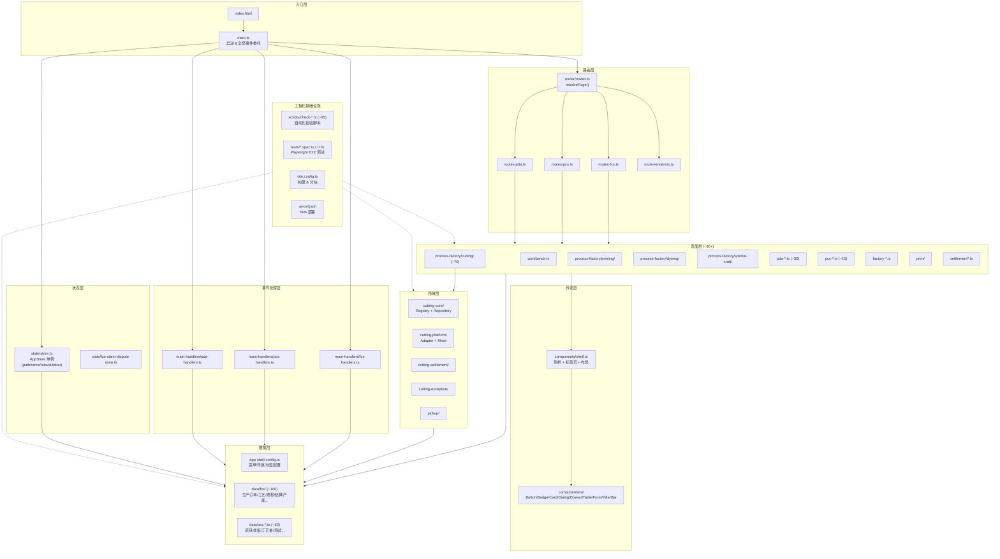

# HiGood 原型项目架构分析

## 一、项目概述

HiGood 是一个面向**服装制造供应链管理**的 Axure 风格快速原型平台。它不是生产级业务系统，而是用于快速产出 **UI 结构、交互演示和模拟数据** 的原型工具仓库。项目部署在 **Vercel** 上实现在线预览。

### 核心约束
- 不引入 Redux/Zustand 等状态管理框架
- 不使用 React Query/SWR 等数据请求库
- 无后端服务、无 API 层、无复杂表单引擎
- 优先采用 **静态页面 + 本地 Mock 数据 + 轻量交互**
- 所有页面内容为中文

### 技术栈
| 类别 | 技术 | 版本 |
|------|------|------|
| 构建工具 | Vite | ^6.2.0 |
| 语言 | TypeScript | ^5.8.3 |
| CSS 框架 | Tailwind CSS | ^4.1.7 |
| 图标库 | Lucide | ^0.468.0 |
| E2E 测试 | Playwright | ^1.53.2 |
| QR 码 | qrcode.react (唯一 React 依赖) | ^4.2.0 |

---

## 二、业务系统划分

项目覆盖五大业务子系统：

| 系统 | 路由前缀 | 业务领域 |
|------|----------|----------|
| **FCS** (Factory Collaboration System) | `/fcs/*` | 工厂生产管理：工单、裁剪、印花、染色、特种工艺 |
| **PCS** (Product Collaboration System) | `/pcs/*` | 产品开发协同：项目、样板库、工艺单、测试 |
| **PDA** (Personal Digital Assistant) | `/fcs/pda/*` | 移动手持终端：工人领任务、执行、交接、仓库 |
| **PFOS** (Process Factory Operations) | `/fcs/craft/*` 等 | 车间工序操作：裁床、印染、特种工艺 |
| **通用** | `/workbench` 等 | 工作台总览、全局配置 |

---

## 三、核心架构

### 3.1 自研 SPA 路由引擎

项目**不使用** React Router 或 Next.js，而是实现了一套**纯 TypeScript 的 SPA 路由引擎**：

1. **`main.ts`** — 启动入口，挂载到 `#app`，初始化 AppStore，建立全局事件委托（click/input/change/submit/keydown/popstate）
2. **`state/store.ts`** — AppStore 单例，管理 pathname、侧栏状态、多标签页，通过 `history.pushState` 实现导航
3. **`router/routes.ts`** — `resolvePage()` 将路径解析为 HTML 字符串，委托给三个懒加载路由注册表
4. **Server 风格渲染** — 页面模块输出 **HTML 字符串**，通过 `root.innerHTML` 挂载，再水合图标和 QR 码
5. **全局事件代理** — 所有交互事件冒泡到 `#app`，由 main.ts 按路径前缀分派到对应 Handler 系统

### 3.2 分层架构

```
main.ts                 ← 启动 & 全局事件调度
  │
  ├─ router/            ← 路由解析（路径 → HTML）
  ├─ state/             ← 应用状态（AppStore 单例）
  ├─ pages/             ← 页面渲染（renderXxxPage → HTML 字符串）
  ├─ domain/            ← 领域逻辑（类型、适配器、Mock）
  ├─ data/              ← 种子数据 & 仓储
  ├─ components/        ← 可复用 UI 组件（纯函数 → HTML）
  │   ├─ shell.ts       ← 外壳（侧栏 + 标签页 + 布局）
  │   └─ ui/            ← 基础组件（Button/Badge/Card/Dialog/Drawer/Table...）
  ├─ helpers/           ← 跨领域工具函数
  └─ main-handlers/     ← 按系统的交互事件处理器（FCS/PCS/PDA）
```

### 3.3 领域驱动设计（以裁床域为例）

裁床（Cutting）是架构最完整的领域模块：

```
domain/cutting-core/          ← 核心类型 & 仓储注册表（Registry 模式）
domain/cutting-platform/      ← 平台视图适配器 & Mock
domain/cutting-settlement/    ← 结算逻辑
domain/cutting-exception/     ← 异常处理
domain/cutting-warehouse-writeback/  ← 仓库回写桥接
domain/fcs-cutting-runtime/   ← 运行时数据 & 快照
domain/fcs-cutting-piece-truth/ ← 裁片真相数据
domain/pickup/                ← 领料适配器
```

关键设计模式：
- **Registry 模式**：以生产订单→裁单→唛架源→裁片任务→PDA 执行构建内存缓存，支持双向查找
- **Repository 模式**：`resolveXxxRef()` 解析器函数
- **懒加载 + 缓存**：Registry 惰性构建，`resetCuttingCoreRegistryCache()` 提供失效机制

---

## 四、数据流

```
用户操作
  │
  ▼
全局事件委托 (#app)
  │
  ▼
main.ts 事件分发
  │
  ├──▶ main-handlers/fcs-handlers.ts   (FCS 交互)
  ├──▶ main-handlers/pcs-handlers.ts   (PCS 交互)
  └──▶ main-handlers/pda-handlers.ts   (PDA 交互)
  │
  ▼
data/ 层 (读写 Mock 数据)
  │
  ▼
AppStore 更新 (pathname / tabs / state)
  │
  ▼
resolvePage() 重新解析路由
  │
  ▼
pages/ render 函数 → HTML 字符串
  │
  ▼
root.innerHTML 挂载 → 组件水合
```

---

## 五、工程化体系

### 校验脚本（~95 个）
覆盖裁床追溯链、质检扣款、PDA 交接、生产工艺流转、产能风控、菜单路由一致性等全链路自动化检查。

### E2E 测试（~70 个）
Playwright 测试按领域组织，覆盖裁床、PDA、PCS、工厂流程、生产工艺等核心链路。

### 构建与部署
- Vite 构建，手动分 chunk（vendor-lucide / app-shell / app-routes-*）
- Vercel SPA 部署，所有路径 rewrite 到 index.html

---

## 六、架构总图（Mermaid）



---

## 七、架构特点总结

| 维度 | 决策 | 原因 |
|------|------|------|
| 路由 | 自研 SPA 引擎（无 React Router） | 轻量、可控、不引入框架依赖 |
| 渲染 | HTML 字符串生成 + innerHTML | 避免 React 组件树复杂性，适合原型快速迭代 |
| 状态 | AppStore 单例 | 简单直接，原型阶段无需复杂状态管理 |
| 样式 | Tailwind CSS（原子化） | 快速出 UI，无需维护 CSS 文件 |
| 事件 | 全局委托代理 | 避免为每个元素绑定监听器，解耦 DOM 与逻辑 |
| 数据 | 纯 TypeScript 文件 Mock | 无后端依赖，前端独立运行 |
| 校验 | ~95 个 check 脚本 | 保证原型数据一致性，自动发现缺陷 |
| 测试 | ~70 个 Playwright E2E | 保证核心交互链路可用 |
| 部署 | Vercel + SPA rewrite | 零配置部署，实时预览 |
