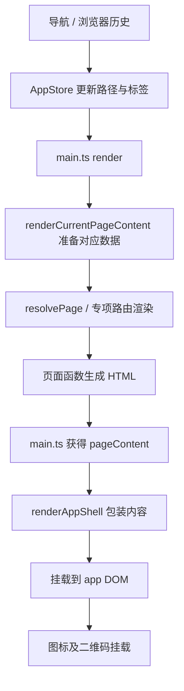
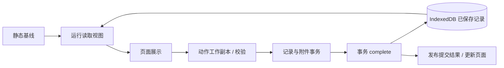

# HiGood 原型架构说明

本文描述当前代码组织，不制定项目规则。技术边界和改动要求见 [AGENTS.md](AGENTS.md)，启动方式见 [README.md](README.md)。

核对日期：2026-10-10。业务源码基准：`99e25a0b846188176516a882b8c8d30fb915f6ef`；下列链接指向各实现入口。之后的结构变化以目标版本源码为准。

## 技术与入口

应用由 [index.html](index.html) 加载 [src/main.ts](src/main.ts)，在浏览器中把 HTML 字符串写入 DOM。它不是服务端渲染；React 目前用于 [二维码挂载](src/components/real-qr.ts)等隔离功能，不承担页面组件树。

构建使用 Vite，业务与页面使用 TypeScript，样式同时来自 Tailwind 类和 [src/styles.css](src/styles.css)。图标由 Lucide 处理，浏览器测试使用 Playwright。依赖声明及解析版本分别在 [package.json](package.json) 和 [package-lock.json](package-lock.json)，本文不复制版本表。

## 系统入口与终端形态

[app-shell-config.ts](src/data/app-shell-config.ts) 的 `systems` 配置包含以下入口。菜单存在只说明导航已配置，不代表该系统所有业务能力均已完成。

| 系统 | 中文名称 | 默认入口 |
| --- | --- | --- |
| PCS | 商品中心系统 | `/pcs/products/styles` |
| PMS | 采购管理系统 | `/pms/workbench/overview` |
| FCS | 工厂生产协同系统 | `/fcs/workbench/overview` |
| PFOS | 工艺工厂运营系统 | `/fcs/craft/workbench/overview` |
| WLS | 仓储物流系统 | `/wls/fabric-demand-board` |
| LOS | 直播运营系统 | `/los/live-schedule` |
| OMS | 订单管理系统 | `/oms/order-list` |
| BFIS | 业财一体化系统 | `/bfis/financial-report` |
| DDS | 数据决策系统 | `/dds/dashboard` |

PDA 是终端形态，不是第十个业务系统。PDA 页面主要位于 `/fcs/pda/*`，也存在 WLS PDA 入口；打印同样有独立呈现形态。[renderAppShell](src/components/shell.ts) 根据路由选择桌面外壳、PDA 或独立打印容器。

## 代码职责

| 位置 | 当前职责 |
| --- | --- |
| [src/main.ts](src/main.ts) | 启动、按路由准备数据、组装页面与外壳、事件分派、局部或整体刷新 |
| [src/state/store.ts](src/state/store.ts) | `AppStore` 管理路径、系统标签页、菜单展开等外壳状态及浏览器历史 |
| [src/router/](src/router/) | 精确／动态路由匹配、按需加载路由注册表与专项页面、重定向和兜底页 |
| [src/pages/](src/pages/) | 页面渲染及部分页面内状态、事件处理 |
| [src/main-handlers/](src/main-handlers/) | 系统或业务交互分派；并非所有页面事件都经过同一个 Handler |
| [src/components/](src/components/) | 外壳、共用业务展示与 UI 渲染、图标及二维码挂载 |
| [src/data/](src/data/) | 演示数据、查询／业务动作、浏览器存储与运行数据适配 |
| [src/domain/](src/domain/) | 部分业务领域的类型、规则、对象关联和视图适配 |
| [src/helpers/](src/helpers/) | 已存在的共用辅助能力 |

目录名称不构成严格单向依赖保证。业务数据与操作状态也不都位于 `AppStore`；分析某项保存或数量规则时，需要沿该动作的实际读取、计算和提交入口定位。

路由入口 [routes.ts](src/router/routes.ts) 先处理部分专项和精确路径，再按路径选择 FCS、PCS、PDA、PMS、WLS、LOS、织带等注册表；未命中时还有菜单兜底。它不是只向三个注册表分派，也不是每个系统都恰好对应一份注册表。

## 三条不同的运行路径

### 导航与整体组装

`AppStore` 同步导航和标签页，`main.ts` 的 `render()` 获取当前页内容，再调用 `renderAppShell(state, pageContent)` 包装并挂载。页面模块返回内容；外壳由主入口组装，不是每个页面自行调用外壳。

下图箭头表示调用或数据传递，节点标明责任：

```mermaid
flowchart TD
    N[导航 / 浏览器历史] --> S[AppStore 更新路径与标签]
    S --> M[main.ts render]
    M --> P[renderCurrentPageContent 准备对应数据]
    P --> R[resolvePage / 专项路由渲染]
    R --> V[页面函数生成 HTML]
    V --> C[main.ts 获得 pageContent]
    C --> H[renderAppShell 包装内容]
    H --> D[挂载到 app DOM]
    D --> Q[图标及二维码挂载]
```

### 局部交互

主入口委托 click、input、change、submit 等事件，页面也可能有自己的局部处理。当前存在 `renderSidebarOnly()`、`renderPageContentOnly()` 及页面内部的局部更新；并非每次输入都经过完整的 `AppStore → resolvePage → root.innerHTML` 路径。

```mermaid
flowchart LR
    E[用户动作] --> H[对应页面 / 系统处理器]
    H --> B[校验与业务计算]
    B --> U[按实际处理分支更新区域]
    U --> S[侧栏 / 页面内容 / 对话框等 DOM]
```

具体动作是否局部更新、是否保留焦点和滚动，以其处理器与运行证据为准；这张结构图不证明全部页面已经完成局部刷新治理。

### 读取与保存

现状同时包含静态演示、页面内存、IndexedDB 和遗留存储入口，不能概括为纯 TypeScript Mock，也不能认定全站都已迁移到 IndexedDB。

| 数据形态 | 已核对的实现例子 |
| --- | --- |
| 随应用发布的演示基线 | [pcs-record-bootstrap.ts](src/data/pcs-record-bootstrap.ts) 读取静态 JSON 并准备内存基线 |
| 页面／运行内存 | 页面状态与 [pcs-record-runtime.ts](src/data/pcs-record-runtime.ts) 的工作副本、读取缓存和提交协调 |
| IndexedDB 记录与附件 | [pcs-record-db.ts](src/data/pcs-record-db.ts) 保存记录、Blob、操作标识及迁移信息，并等待事务完成 |
| 外壳偏好 | [state/store.ts](src/state/store.ts) 的标签页和菜单状态 |
| 遗留或适配入口 | [browser-storage.ts](src/data/browser-storage.ts) 仍提供 localStorage / sessionStorage 访问和业务工作副本适配；是否已被迁移路径接管取决于调用方 |

以下是 PCS 已接入记录存储的概念路径，不代表其他模块都具有相同实现：

```mermaid
flowchart LR
    A[静态基线] --> R[运行读取视图]
    I[(IndexedDB 已保存记录)] --> R
    R --> V[页面展示]
    V --> W[动作工作副本 / 校验]
    W --> T[记录与附件事务]
    T --> C[事务 complete]
    C --> I
    C --> U[发布提交结果 / 更新页面]
```

未保存输入与保存结果的边界、错误恢复和迁移目标由 `AGENTS.md` 的 STORE 规则约束；是否已满足仍需按具体模块核验。

## 裁床领域定位示例

[src/domain/cutting-core/](src/domain/cutting-core/) 中的类型、注册表和引用解析用于关联生产单、裁片任务等对象；`resolveXxxRef()` 这类函数负责解析关联，不等同于持久化仓库。其余裁床业务还分布在 [src/data/fcs/cutting/](src/data/fcs/cutting/) 与 [src/pages/process-factory/cutting/](src/pages/process-factory/cutting/)。这些路径用于定位，不是完整性或推荐架构评分。

## 构建、测试与部署入口

- [vite.config.ts](vite.config.ts) 包含分块、部分路由预加载、静态资源及预览压缩处理；构建行为以该配置为准。
- [package.json](package.json) 的 `build` 执行工程类型检查、单元测试和 Vite 构建；专项检查另有命名入口。
- [scripts/](scripts/) 保存专项与治理检查，[tests/](tests/) 保存单元、契约及浏览器测试；数量不等于覆盖率，每项结果只证明其断言范围。
- [playwright.config.ts](playwright.config.ts) 定义浏览器、服务和产物设置；裁片使用方式见 [专项手册](docs/cutting-e2e.md)。
- [vercel.json](vercel.json) 提供 SPA 路径重写。构建、Git 推送与 Vercel Production 成功是不同证据，发布口径见 `AGENTS.md` 的 RELEASE 规则。
