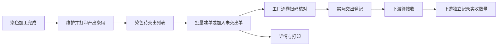

# 染色交出页面调整设计

## 1. 事实和范围

2026-09-11 只读核查线上 `/cut/print_dye_handover/dyeing_pending`、`dyeing_order`、`print.html?id=408`。线上提供工厂 Tab、接收人和关键字筛选、待建单据和可创建筛选、条码维护、批量建单、加入未交出单、单据明细、扫卷进度及 SURAT JALAN 打印。

当前原型已有加工完成数量、产出卷、条码维护、简化交出弹窗、下游待接收和纱线称重规则。复用这些事实，新增独立菜单和命名页面。移除旧批次任务的菜单、路由、页面、领域、投影、样例、专项测试及文档规范；保留单张加工单、水溶连续加工、生产单变更对已执行事实的保护。只做本地原型，不修改线上业务单据，不扩展其他加工厂。

## 2. 流程和规则

- 同一交出单可包含多个加工单及多个 SKU；保留原加工单、任务单、生产单和需求单关系。同工厂建单，按接收方分组展示。
- 草稿占用所选卷，作废释放；已交出禁止再次加入和重复交出。面料必须有卷码和有效长度且已打印；累计选择不能超过包装可交数量。允许按卷分次交出。修改已打印的卷长、重量、幅宽、克重、缸号或标签备注后须重打；未改字段保留打印状态。
- 详情显示逐卷扫描进度、操作人、时间；未发生的事实明确说明。只有实际交出后才产生下游待接收，接收数量由下游登记。面料实收按 Yard 登记，回传米制原单时换算，不能直接相加不同单位。
- Mock 覆盖可建单、未维护数量、未打印、待扫卷、已扫待交出、已交出、多单多 SKU；每个展示字段有具体值，0 代表实际为零。
- 纱线沿用一单一码与 pcs／毛重／净重规则，通过现有纱线交出页面操作，不能伪装为布卷。

## 3. 页面和打印

- `/fcs/craft/dyeing/pending-handover`：工厂 Tab，关键词、接收人、单据状态、可创建筛选；加工单/商品、需求/生产单、产出物料、使用/完成/可交数量、条码和建单状态、操作。查询行最后为更多筛选/收起更多。
- `/fcs/craft/dyeing/handover-documents`：工厂 Tab、关键词/接收人/状态筛选，交出单编号、关联单据、卷数、各单位数量、SKU 数量、扫码进度、建单/交出时间、状态及详情/打印/交出操作。
- 打印采用线上 SURAT JALAN 的抬头、单据条码、工厂/接收人/日期、运输信息、Yard/Meter/Roll、SPU、物料、原加工单和生产来源、合计、备注和三方签收栏。A4 分页，表头重复、条目不截断。
- 复用标准列表组件、分页、列设置、排序/冻结；真实图片可放大；局部更新；1366×768 和 1280×720 验收。

## 4. 验收

正常路径：维护打印 → 多单多卷建单 → 逐卷扫码 → 确认交出 → 数量回写、下游待接收 → 打印可读。边界：未打印/超量/重复卷/跨厂/已交出不可加入，草稿作废释放，混合单位不相加，纱线规则不退化。

两轮验收：第一轮专项契约与主要页面全流程；第二轮刷新/重新进入、边界、低分辨率和打印复核。最后实质修改后重跑受影响证据。
