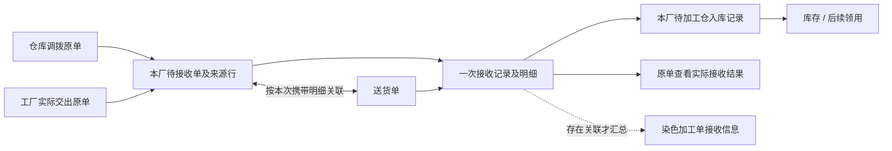
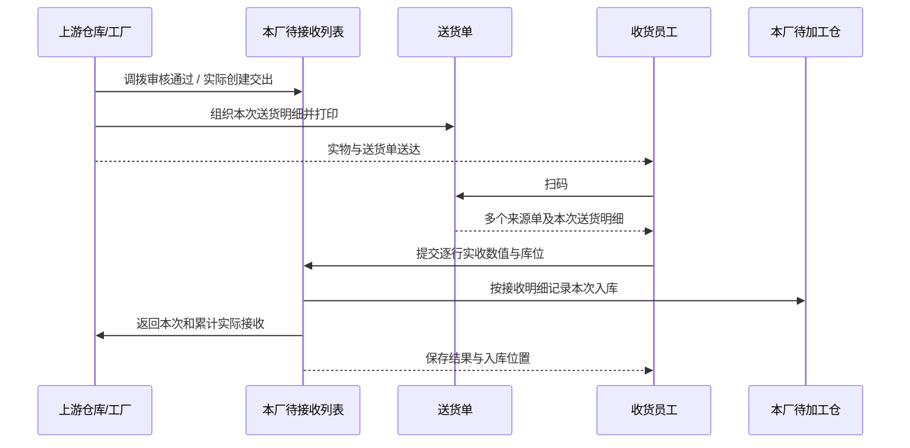
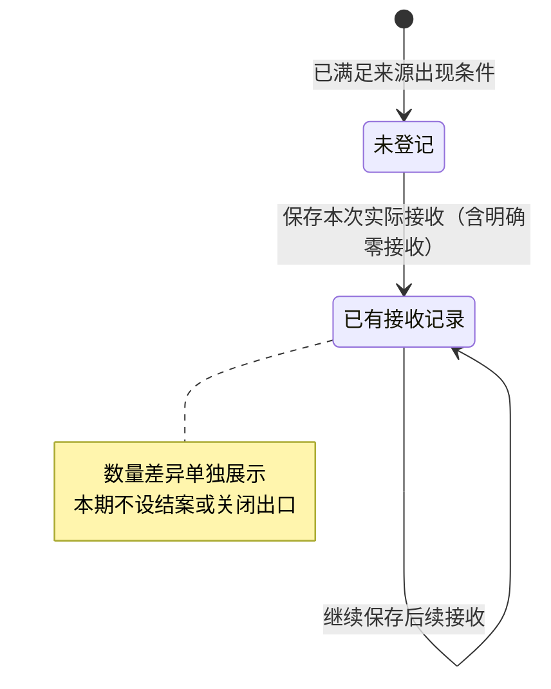
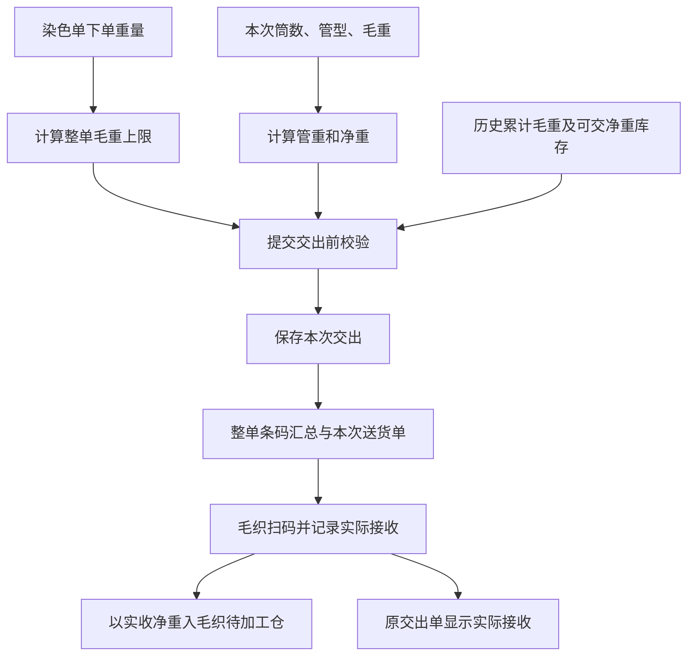

> 2026-09-11 范围更新：本文关于旧批次模块的历史条款已失效，相关实现和入口已删除；当前口径见同日染色交出调整设计。其余历史记录保留。

# 染厂待接收与纱线交出接收调整方案

版本：V2，2026-09-11。状态：WP01—WP08 本地实现及两轮技术验收完成；WP09 后续复制。

配套文档：[实施计划](2026-09-11-dyeing-receiving-implementation-plan.md)、[原子需求及验收矩阵](2026-09-11-dyeing-receiving-requirements-matrix.md)。本文中的“应、必须、采用”定义需求口径；实际实现和两轮证据以配套矩阵及审查记录为准。“已确认”不代替产品接受回执。

## 0. 范围、依据和当前版本

### 0.1 本次范围

先完成染厂从上游来货到接收入待加工仓的完整原型，并衔接“染厂纱线交出 → 毛织厂接收 → 净重库存”。随后将已验证的接收模式应用到印花厂、辅助工艺厂、特种工艺厂和辅料工厂。后续工厂本轮只定义复用边界，不宣称已改造。

保留当前染色加工单的列分类、先后顺序、工厂 Tab、数量四分组、备注、真实物料图片和生产流程卡总体结构。本次调整实际收发数据及相关入口，不再另做一轮视觉重排。

这是原型方案：继续使用 Vite、Vanilla TypeScript 字符串模板、现有 UI 组件和必要本地演示持久化，不建设真实后端、审批引擎、数据库、离线同步、消息队列、物流调度或完整差异结案系统。本期不新增少收结案、超收审批、整批未收关闭、财务结算及管子资产库存。

Web/PDA 共用业务计算和来源事实，验收在同一演示数据环境重开对应路由完成。现有浏览器本地存储不代表不同浏览器、不同设备已实现实时数据同步；本期不作这项生产能力声明。

### 0.2 方案提出时的核查基线（历史快照）

- 当前工作树：`/Users/laoer/Documents/higoods`，分支 `main`，HEAD `f6f3f945a46711265ad6f0eaf7086e9533134fcb`。
- 有此前列表、条码、Mock、打印等未提交修改；本次以“HEAD + 当前工作区”作为阅读依据，不将这些修改归入本次交付。
- 5188 服务进程 59149 的工作目录为本工作树。实际打开了 `http://192.168.0.17:5188/fcs/craft/dyeing/work-orders`；可见 16 条示例、工厂 Tab、当前列顺序、数量分组和备注入口，染厂菜单尚无独立待接收入口。
- CodeGraph 状态为索引最新。本次是方案文档核查，没有运行构建、业务测试或功能交付收据；没有据此认定新功能已通过验证。
- 此前按段阅读的染色接收、交出、仓库、打印代码作为基础，本轮重点复核来源出现时点、无加工单来货、数量阻断、库位、纱线条码、毛织接收和入库。没有把本轮描述为全仓库重新逐行阅读。

### 0.3 已确认规则与方案建议的区别

已确认：仓库审核通过产生待接收，工厂实际创建交出产生待接收；送货单可混合来源；支持分批送货与接收；实际少收、超收、零接收暂不结案；备料可无生产单或染色单；面料卷码、卷数、Yard 必需；普通辅料按重量；纱线 pcs、毛重、净重；下单重量不超过 10 kg 按 3 倍，超过 10 kg 按 2 倍，限制出货毛重；管重纸管 62 g、锥形管 80 g、宝塔管 121 g；毛织库存按实收净重。

下列为本方案提出的落实方式，尚不能表述为用户逐条确认：整单累计毛重限额；一个染色单一个稳定条码身份、分批保留单独交出明细；一张待接收单的分组粒度；扫码接收的具体步骤；库位默认规则；打印快照和历史兼容方案。它们已写成可审查的具体方案，不需要在出方案前再次询问所有实现选择。

## 1. 方案提出时的实现与目标差距（历史快照）

| 证据 | 当前代码确认的事实 | 对本次的影响 |
|---|---|---|
| E01 | `src/data/app-shell-config.ts:511`、`src/router/routes-fcs.ts:384`：有加工单、旧批次模块（已移除）、水溶、两个仓库等，无独立待接收菜单 | 新增工厂收货入口，保留原导航 |
| E02 | `src/data/fcs/preparation-material-receipt-sources.ts:131`：从加工单正式路线找来源，没有路线直接阻断 | 无关联加工单的备料不能继续走这个前置门禁 |
| E03 | 同文件 `:98`、`:115`、`:221`：按已交出/调拨剩余数量且同单位筛选 | 不能用剩余大于零决定待接收是否存在；不能挡住超收和异单位辅料实称 |
| E04 | `src/data/fcs/warehouse-material-execution.ts:25`、`:78`：仓库执行状态无独立审核通过事实，生产单和任务字段为必填 | 补最小审批来源信息；不能把“备料完成/已出库”冒充审核通过；备料来源需要独立于生产任务 |
| E05 | `src/data/fcs/dyeing-material-receipts.ts:15`：单一数量、必须正数、限制不得超过来源剩余；仅工厂来源调用上游接收函数 | 调整零接收、超收、多维数量及仓库上游实收结果 |
| E06 | `src/data/fcs/pda-handover-events.ts:4739`：按目标加工单接收，仅准备工艺来源、同单位、剩余量限制 | 保留原单追溯能力，不能直接把该函数作为所有工厂通用接收入口 |
| E07 | `src/data/fcs/dyeing-task-domain.ts:4300`、`:906`：接收会令关联任务开工；Web `work-order-detail.ts:246` 和 PDA `pda-exec-detail.ts:5188` 显示“任务已开工” | 接收、入库、领用、开工必须分开；同步修正文案和派生状态 |
| E08 | `src/data/fcs/factory-warehouse-linkage.ts:69`、`:259`：按记录散列挑库位，差异自动进异常区，入库键基于原交出记录 | 新收货路径采用已启用的本厂库位、实际选择；分次接收以接收明细为键；差异不自动扣留实物 |
| E09 | `src/data/fcs/factory-internal-warehouse-locations.ts:307`：已有启用库位解析；`factory-internal-warehouse.ts:2580`：已有仓库修改快照 | 复用现有库位目录和回滚基础，不新建一套仓库 |
| E10 | `src/pages/process-factory/dyeing/barcode-dialog.ts:23`、`:66`：按卷、卷长和一个重量字段维护及打印 | 面料保留；新增明确的纱线整单标签分支 |
| E11 | `src/data/fcs/dyeing-task-domain.ts:4646`：交出数量不得超过完工未交出数量；`DyeDispatchDocument` 保存卷列表 | 纱线增加 pcs/毛净重，按净重检查可用产出，另按毛重检查倍数 |
| E12 | `src/data/fcs/wool-domain/types.ts:72`、`commands.ts:448`：纱线接收单行只有 kg 数量，按此入库，绑定毛织单及必需纱线 | 明确三类实收数值及上游关联；新流程库存取净重，不能仅改显示文案 |
| E13 | `src/data/fcs/wool-domain/commands.ts:365`：纱线采用默认逻辑库位；`src/pages/print/task-delivery-card.ts:26`：现有交货卡定位单条交出记录 | 物理库位与既有毛织账本逻辑归类分开；现有任务交货卡不能冒充多来源送货单 |
| E14 | `src/data/fcs/dyeing-task-domain.ts:538`：修改封装覆盖染色、任务、交接及相关本地保存，未包含新增接收/送货和仓库各事实 | 一个接收提交必须覆盖必要结果的共同保存/失败恢复，避免半成功 |

源码行号以本次工作区为准，后续实施需绑定新的文件位置和验证版本。

## 2. 业务对象和关系

### 2.1 待接收单是工厂收货对象

待接收单的归属是“收货工厂”，其存在不依赖染色加工单、生产单或正式工艺路线。

建议一张待接收单对应“一个原始上游单据 + 一个收货工厂”，内部有多条来源行。同一原单分给多个收货工厂时按收货方拆开；同一工厂多次加载、上游重复通知不产生重复待接收单。唯一关联采用原单类型、原单 ID、收货工厂 ID；行关联保留原单行 ID。不能用单号字符串、SKU、工厂名称相似度猜测绑定。

工厂来源必须指向实际交出单/交出明细，同时展示其关联加工单；上游“加工单已创建/已完工”本身不等于已经创建交出。空交接头、草稿或已作废交出不能被当成实际交出来源。

仓库来源保留仓库真实名称、编号、仓库属性；不显示“所属工厂”。加工厂来源显示工厂名称、编号、工厂类型。既有仓库执行模型区分出库和内部调拨，适配时保留真实单据类型，不能统一篡改成同一种单名。

### 2.2 五个对象及其职责

| 对象 | 职责 | 关键关联和字段 |
|---|---|---|
| 上游原单 | 记录上游批准的调拨或实际创建的交出 | 类型、ID/行 ID、上游、收货工厂、审核/交出时间、计划数及实发数、物料 |
| 工厂待接收单 | 汇总本厂针对原单应关注的来货 | 原单关联、收货方、各物料行、接收记录摘要；加工单和生产单可为空 |
| 送货单 | 将一次实际送货涉及的多张原单组织起来 | 独立单号/条码、送货时间、逐行引用原单及本次携带数量；面料带卷清单 |
| 接收记录 | 保存某一次真实点数/称重的结果 | 接收人、工厂、时间、送货单可选、原单行、实收数值、卷码或标签、库位、备注 |
| 入库记录/库存 | 记录实际货物已进入哪里以及还剩多少 | 接收明细 ID、物料/SKU、批次/卷码、库区库位、数量口径、可选加工单归属 |

送货单与待接收单为多对多：一张送货单带多张原单；一张原单可以分几张送货单送。一张送货单也可以多次接收。不能用“送货单 ID”直接充当唯一库存增加凭证。

### 2.3 没有关联加工单的备料

来源原单、物料、收货工厂仍然必需；染色单和生产单显示“备料来货，未关联”。按正常扫码、点数、称重、入库执行，不虚构生产单、款式、任务或售卖类型。

需要使用时，选择现有备料库存关联到加工单，保留原来源与接收记录。关联只是指定归属或可用份额，不再次接收、增加库存或自动登记加工用料。同一接收明细分配给多个加工单时保留分配数量，总分配不得超过该份实收可分配量，不能每个订单都展示整笔实收。

## 3. 出现时点、送货和接收流程

### 3.1 出现时点

| 上游事件 | 待接收单 | 本厂库存 |
|---|---|---|
| 仓库调拨未审核通过 | 不生成可接收单 | 不增加 |
| 仓库调拨审核通过，即使未发货 | 生成，可见原单和计划来货 | 不增加 |
| 工厂只有加工单、空交接头或交出草稿 | 不生成实际交出来货 | 不增加 |
| 工厂实际保存了有效交出 | 生成，不等待车辆送达 | 不增加 |
| 创建/打印送货单或扫码打开 | 只更新送货关联或展示信息 | 不增加 |
| 实物到达并保存本次接收 | 追加实收记录 | 按实际正数明细入库；零接收不建零库存 |

审核通过和实际发货分开保存。接收不额外要求仓库先点击“已发货”，以免把已确认的出现时点改回“已发货才可操作”；若系统尚无实发记录而现场货已到，保留已审批来源和现场实收，原单实发数仍不伪造。

### 3.2 主流：一次送货、一次接收

1. 上游选取已满足来源条件的单据，形成送货单；默认按同来源类型、同上游组织组织选项，但允许调整为混合来源。
2. 打印送货单，上游送货；单上逐个原单、逐个物料清楚分组，不把不同原单同 SKU 合并成不可追溯的总量。
3. 收货人扫码送货单，系统显示本厂对应的多个待接收单及本次送货明细。
4. 核对实物，按物料类别录入实收值，确认默认库位或选择其他已启用库位。
5. 一次提交全部已填写的本次接收行；未填写行不自动当作零，也不自动按应收值确认。
6. 显示“已接收：…；已入库：…”，同时在上游原单和关联染色加工单看到本次及累计实际接收。

### 3.3 分批、混合及直接按单接收

- 混合调拨单和工厂交出单允许；不同上游仓库/工厂混合也允许。默认同类型、同上游只影响便利性，不是校验限制。
- 收货方操作范围以当前工厂为准。若扫描的送货信息含其他目的工厂，明确区分，仅本厂明细可提交；不得把“允许混合来源”理解为允许跨工厂代收。
- 分批送货保存本次所带数量和卷码，不把原单全量复制到每一张送货单。原单累计送货、累计实收都可追溯到具体批次。
- 分次接收追加记录。界面同时显示本次、历史累计、当前送货参考数量和差异，不能让员工填写一个会覆盖历史的“累计实收”框。
- 没有送货单也可从待接收单点击“接收”，按原单及物料核对。送货单不是收货资格的必要前提；但无有效上游单据的无单来货不在本次范围。
- 纱线整单码可直接查找相关待接收记录；存在多次交出时要求选定对应的本次交出/送货明细，不能猜测当前货物属于哪一批。

### 3.4 只展示接收事实，不引入结束态

本期“接收登记”只显示未登记、已有接收记录；“来货差异”分别显示少、相符、多。筛选可看全部、未登记、有接收记录、有差异。单据不会因为收足、超收或零收被自动关闭、作废或从全部记录中删除。

未发生的实发、实收显示“尚未发出/尚未登记”；用户明确填写 0 则显示“本次未收到”。差异必须在同一单位、同一物理口径下计算：实收减实发；无实发依据时显示“暂无可比实发数量”，不得自动拿计划量冒充实发。

## 4. 页面与菜单调整

### 4.1 染厂待接收列表（新增）

建议菜单名“待接收”，位于染厂管理中“染色加工单”之前，建议路由 `/fcs/craft/dyeing/pending-receipts`。这是新路由建议，当前尚不存在。覆盖本染厂的材料来货，包括包含水溶的染色任务以及无任务备料，不按工艺再拆多个收货菜单。

管理端保留工厂 Tab；执行身份只能处理自己的工厂。顶部主动作“扫码接收”，旁边支持输入送货单号查询。筛选：综合单号/物料查询、上游类型、上游组织、物料类型、接收登记情况、是否关联加工单、日期。展开更多条件后，查询、重置、导出等位于全部条件之后。

角色边界：上游人员维护自己原单的审批/交出和本次送货；收货工厂仓管/收货人员核对实物、登记实收并选库位；主管维护本厂默认收货位置并处理无法识别的来源；管理人员跨厂查询追溯。能跨厂查看不等于能跨厂接收，Web 收货也要记录实际操作身份和目标工厂，不能因为页面显示管理员就自动用任意工厂代收。本期复用已有演示身份和工厂范围，不建设真实鉴权系统。

摘要只做 48 px 单行：单据数、未登记数、面料卷数/Yard、普通辅料 kg、纱线 pcs/毛重/净重分开显示，空间不够时只展示关键数，不产生跨单位总数量。

建议表格列：

| 列 | 内容与顺序 |
|---|---|
| 待接收单/上游 | 收货工厂；待接收单号；上游名称和仓库属性/工厂类型；原单号与原单类型 |
| 来货物料 | 真实缩略图，右侧名称、SKU、颜色；下方物料类型、成分及适用规格；多 SKU 逐项展示 |
| 关联单据 | 送货单号；染色单、任务单、生产单；未关联明确显示备料 |
| 数量 | 计划、上游实发、历史实收和同口径差异；按物料单位展示 |
| 接收登记 | 未登记/已有记录；最近接收人、时间；记录条数 |
| 入库位置 | 本次/最近位置摘要，多库位展开；未入库时不伪造位置 |
| 操作 | 接收、详情、查看来源、查看接收记录；不会提供少收结案或整批关闭 |

采用已有标准列表组件、分页、列设置、冻结和表格内部横滚，操作列固定右侧，识别必需列不可隐藏。

### 4.2 接收详情（新增业务页面）

建议路由 `/fcs/craft/dyeing/pending-receipts/:id`。顶部展示收货工厂、原单、上游、原单状态和可选送货单。中部按来源单 → 物料 → 卷/标签组织，下部展示历史接收、入库记录和备注。

“本次实收”和“上游参考”并排显示且标识清楚；所有实收框默认待填，不默认全量接收。允许用户显式采用已核对的参考数，再确认保存。真实图片、名称与编码始终同一信息块，可查看大图。

接收记录保存后只读展示；本期不加入直接覆盖历史实收的编辑入口。错误记录的冲正/撤销不是本次已确认需求，不能沿用能绕过追溯的旧数量编辑把新记录改掉。后续需要更正时另定规则；本期用提交前复核和清晰反馈防止误填。

### 4.3 员工/PDA 扫码接收

建议沿用现有 PDA 工作台扫码入口，新增接收用途的结果页；具体路由建议 `/fcs/pda/factory-receipts`，工厂来自会话，不来自可任意修改的查询参数。四步：扫码识别 → 核对物料并填实收 → 确认库位 → 保存结果。单一原单无需多余分组，多原单才按来源分组。

摄像头不是必需：支持扫码枪输入和手输单号。扫错组织、找不到单据、已作废原单、重复提交都有具体提示和返回动作。保存失败保留输入，不显示成功；同一次操作重试不会重复入库。不实现真实离线自动重试。

### 4.4 原加工单和仓库入口

- 原染色加工单“接收原料”改为进入同一接收流程的快捷入口；过滤相关来源但不保留第二套收货写入逻辑。
- 加工单详情可查看本单分配到的接收记录和库存；无关联备料只出现在工厂收货/库存范围，不塞入虚构加工单。
- 待加工仓展示真实接收来源、批次/卷码、库位、物料数量；收货不自动等于领用，加工用料由已有真实领用/投入动作产生。
- 接收状态、加工状态、交出状态保持独立。物料接收不写“加工中”或开工时间；开始染色/水溶等实际动作才改变加工状态。已有真正开工记录不回退。

## 5. 按物料类别采集实际数量

| 类别 | 必需采集/识别 | 数量口径 | 不允许的替代 |
|---|---|---|---|
| 面料 | 原卷码、实收卷清单、各卷 Yard | 卷数由本次实收不同卷码计数，Yard 合计；原单米数另保留 | 没有卷碼只填总长度；用理论重量冒充实称 |
| 普通辅料 | 原单行、SKU、可用的标签；实收重量 | kg、g 联动展示，输入其一自动换算另一项 | 因标签无数量而阻止实收；把 kg 写进 Yard 字段 |
| 纱线 | 染色单/来源、SKU、筒数 pcs、各管型数量、毛重 | 管重自动算；净重自动算；出货/接收各自保存一组 | pcs 当成 kg；整单标签数当筒数；毛重计入纱线库存 |

### 5.1 面料卷码

必须沿用上游卷码，接收不会另造卷码替换原码。一个本次接收行引用原单行和卷码，扫码后显示该卷物料及原单长度，填实际 Yard。分次收货通常对应不同卷；本期不增加现场拆卷/换码生产功能。

重复校验针对“同一段物流移动中的同一卷”，不能把全系统同一卷码永久禁止再次出现。该卷后续合法交到另一工厂仍应沿用卷码。新扫描的额外卷应核对实际原单/物料归属后记录超收，不能默默挂到当前单，也不能只因实际比计划多就抹去实收。

原单单位是米时保留原始值；确定的长度换算用 1 Yard = 0.9144 m。接收页面始终满足卷数和 Yard 双展示，转换时保留足够内部精度，展示不决定账面值。

### 5.2 重量与差异

普通辅料标签只负责识别，实际重量由现场录入。数量允许明确为 0；未收到不产生库存行。重量不得负数；正数纱线收货还需有效的 pcs 和管型数量。计算净重为负值时提示核对毛重和管型。

kg 与 g 是同一重量的两种展示，不能重复计入合计。建议重量内部以克保存到现场所需精度，kg 展示到至少 0.001 kg；固定管重为整数克，不能沿用旧链路统一四舍五入到 0.01 kg 丢失克数。

当上游辅料只提供 Yard 而本厂实收 kg，保留两组量，“Yard 差异”显示不可直接比较；将实收 kg/g 返回原单的新实收重量信息。不得从幅宽、克重推算一个虚假的上游实收 Yard。后续若确需长度结算，另行采集长度，本期不暗中换算。

## 6. 上游结果、入库与库位

### 6.1 一次提交的结果

每个接收明细具有稳定确认号，保存原单行、送货行、实收数值、物理库位和操作人时间。一次提交应让以下结果一致：接收记录、上游实收摘要、库存入库、已关联加工单接收摘要。只计本次明细增量，不把累计值当新入库量。

仓库和加工厂两类上游都能从原单看到接收工厂、每次实收、累计实收及可比差异。上游实发量不因少收或超收被修改。接收不再次减少上游库存；上游库存减少属于原来的实际出库/交出动作。

新路径按“接收记录 ID + 接收明细 ID”生成入库凭证，多库位分开明细。仓库可按工厂、库位、SKU、批次汇总库存，但入库追溯不能汇总掉。同一提交重复点击、刷新重放或打印不增加新库存。

### 6.2 默认与手动库位

先锁定当前工厂的待加工仓，再解析已启用的库区、货架、库位。页面默认带入配置的收货默认位置，允许批量应用到本次所有明细，也允许逐行或逐卷调整。

当前只有仓库默认标记、没有通用的默认收货库位标记；拟在现有库位配置中增加最小默认收货位置关联，不按哈希随机挑选。不另外建设库位系统。默认位置失效时提示选择本厂其他有效位置；没有任何有效位置则保存前提示先维护库位，不能静默入到不存在的位置。

有少收/超收也按员工实际选择位置入库，不自动投进“异常区”，不新增差异冻结库存；差异记录与物理位置分离。可分别指定多处库位，分配量必须等于本次实收量。

### 6.3 毛织库存的单一计账归属

毛织已有独立纱线账本，新接收路径要把实收净重交给该账本，避免既向通用工厂仓库记一次、又向毛织账本记一次。通用收货界面展示毛织账本结果即可。

既有毛织纱线默认库位兼有逻辑归类含义，保留其归类可兼容旧查询；同时保存真实 factory/warehouse/area/location 归属供接收和库位展示。不能仅把新库位文字显示出来，底层仍全部记到一个物理位置。实际领用、退回和调拨按相同物理位置及净重口径衔接；不重写毛织加工、横机、裁片交出流程。

## 7. 纱线交出、整单标签和毛织接收

### 7.1 毛重上限

令 W 为染色单下单重量（kg），正数时：W ≤ 10，则 L = 3W；W > 10，则 L = 2W。等于 L 可提交，超过 L 阻断。10 kg 的上限是 30 kg；10.001 kg 的上限是 20.002 kg。这是确认后的分段规则，边界下降是规则本身，不能擅自平滑。

本方案采用整单累计校验：历史有效已交出毛重 + 本次毛重 ≤ L。不以实际接收净重或加工完成净重作为倍数基数；草稿尚未实际交出，不计历史实发，但并行草稿提交时都重新计算剩余额度。重复提交同一已交出记录返回原结果。

页面显示下单重量、倍数、毛重上限、累计已交出毛重、本次毛重、交出后累计值及可交余额。提示必须具体，例如“本单最多 30 kg；已交 28 kg；本次 3 kg，将超出 1 kg”。下单重量未维护、非正数或无可靠 kg 换算时阻止该纱线交出并提示补齐，不以 0 或虚构数值代替。

毛重限额和实际可交库存是两道不同检查：毛重对照 L；本次净重对照已完工且可交出的净重。管子的重量不能消耗纱线净重库存，也不能将倍数规则解释为允许无库存出货。普通面料及辅料不套用该纱线倍数规则。

### 7.2 固定扣重

纸管 62 g/个、锥形管 80 g/个、宝塔管 121 g/个。来自用户提供的 62.4、79.8、120.7 g 样品读数，按用户确认四舍五入到整数后作为固定标准。

总筒数 pcs = 各管型数量之和。总管重 g = 62×纸管数 + 80×锥形管数 + 121×宝塔管数。净重 kg = 毛重 kg − 总管重 g/1000。先取整单管标准，再计算总管重。混用管型逐项计算。正数 pcs 为整数，不能录成小数；不强制所有订单只用一种管型。

已提交交出/接收保存当时的管型、数量和标准快照，后续标准变化不重算历史。本期给定三个固定标准，不建设价格/耗材/管子资产管理模块。照片可作为管型选择参考图，不当作纱线 SKU 图片。

示例：20 pcs 宝塔管，毛重 12 kg，总管重 2.42 kg，净重 9.58 kg；毛织实收 19 pcs、毛重 11.4 kg，则按 19×121=2,299 g 扣管重，实收净重 9.101 kg。上游仍保留 20 pcs、12 kg、9.58 kg，下游库存增加 9.101 kg。

### 7.3 一个染色单一个整单码

一个纱线染色单分配一个稳定条码身份，不按筒生成标签。标签必显：染色单号、纱线名称/SKU/颜色、数量 pcs、完整已交出毛重、扣管后净重；管型汇总可作为辅助核对。打印副本不算新增业务条码，不创建交出或库存。

一次交出场景，整单汇总等于本次交出。分批时，同一整单码关联多条交出记录，标签注明当前累计汇总的打印时间/版本；送货单保留本次携带量。扫描整单码进入识别与批次核对，不能按标签累计量一键重复入库。旧打印快照可查看，重印不会覆盖原交出实发事实。

现有多单卷清单交出仍为面料服务。纱线交出单行直接携带 pcs/管型/毛重/净重，不构造“一条假卷”来套用面料模型。旧批次模块（已移除）也保留各染色单身份、各自毛重上限和各自标签，不能变成整个合染批次一个码或共享限额。

### 7.4 毛织厂接收

扫送货单或染色单码后，逐来源展示“染厂交出”和“本次实收”。员工录入实收筒数、管型数量和实收毛重，系统计算实收管重/净重；保存三类实收值及入库位置，并回传到染厂原交出明细。

库存以实际接收净重增加，后续纱线领用、退回以净重 kg 计量，pcs 作为实收辅助事实保留。本期不要求从部分用纱净重反推剩余筒数。少收、多收、零接收沿用本期只记录实际的规则，不套用染厂的出货毛重阻断。

## 8. 当前列表、打印和数据展示的联动

染色加工单保持“加工单/商品 → 加工投入/上游 → 加工要求 → 处理进度 → 加工产出/下游 → 时间 → 数量 → 操作”的现有结构。工厂继续位于首列第一行，不恢复独立工厂列。

数量列四段保留：①计划；②上游交出与本厂接收；③加工用料/完成；④本厂交出与下游接收。面料对应卷/Yard，普通辅料对应 g/kg，纱线收发段显示 pcs、毛重、净重，加工段主要用净重。不同物料/单位不相加；理论重量仍单独标明。

上游/下游仓库没有“所属工厂”；工厂显示工厂类型。来源单链接指向实际原单，送货单链接和接收记录链接可追溯。操作栏备注继续支持无备注新增、有备注查看和编辑，不与接收实际数量的编辑混为一谈。

染整生产流程卡保留当前内容分类、顺序和总体结构。面料打印不受纱线模板改造影响；本次不会把新增接收页所有字段堆入生产流程卡。纱线出货标签和送货单属于独立打印用途。打印数据来自提交事实，不能仅从列表 Mock 展示字段重新拼出一套数值。

所有新示例的业务必需字段完整；未发生、未关联和不适用分别显示明确说明。纱线幅宽不适用、备料无款式是合法情形，不能为“字段不缺值”制造假的幅宽或款式。物料实拍图必需，用户给的管子照片不替代纱线实物图。

## 9. 当前代码如何调整、旧入口如何收口

### 9.1 最小必要实现边界

拟在 `src/data/fcs/` 新增小范围的工厂接收数据与操作文件、送货单数据文件、纱线计量规则文件。具体拟名见实施计划；这些是本次实际多入口所需，不建设大而全的通用领域框架。

来源适配分别读取现有仓库原单和工厂原交出，补足“是否已批准/是否有效交出、收货工厂、逐物料关联”。不直接删除 `preparation-material-receipt-sources.ts`，因为其他工艺仍使用它；染厂新接收入口不再被其中的强加工单、正式路线、剩余数量和单一单位筛选阻挡。其他工厂待迁移时另行验证。

染厂接收、毛织接收、Web/PDA 从同一接收动作产生记录；上游原单、加工单列表和库存读取同一组实收事实。保留公共函数已有调用接口的必要适配，不让旧接口暗中保留一套独立实收写入。

### 9.2 必须同步处理的旧逻辑

1. 收货必须大于 0、超出剩余量一律阻断：新接收支持明确零收与真实超收，同时保留非负、来源、物料和归属校验。
2. 收足后来源从查询结果消失：待接收原单仍可追溯、继续登记；“有接收记录”不等于业务关闭。
3. 接收即开工：同时修改业务更新、含水溶的派生任务状态、Web/PDA 成功文案，避免刷新后又自动变为加工中。
4. 差异自动进异常区、随机库位：新路径使用实际选择位置，差异保留为数量事实。
5. 原交出记录 ID 作为唯一入库键：新接收使用接收明细键，多次接收不能覆盖或重复应用累计量。
6. 毛织旧接收和通用入库重复计账：毛织净重只落一套权威库存账本；相关查询与物理位置展示同步读取。
7. 纱线继续叫卷长、克重换算重量、每卷打印：按物料类型进入纱线专用编辑/打印路径，不破坏面料现有细码功能。
8. 单条交货卡被当成多来源送货单：保留旧用途；新增送货单必须有明确多原单行关联。
9. 染厂出货界面汇总单与底层实际交出记录：保存明确的原交出记录 ID 映射，下游实收必须回到对应记录，不能只更新界面汇总单。
10. 仅按名称拼接仓库/工厂：新记录绑定主数据 ID，显示名可以快照保存；无效目的仓不能创建假的 `工厂名-WIP` 库存。

### 9.3 历史记录与本地持久化

保留旧记录及其来源，不清空用户本地演示数据。已有只有 kg 的记录不能自动判断是毛重还是净重，更不能凭空反推筒数与管型。旧记录标“历史记录，未采集毛净重”，原库存账面数保持原口径；新的净重保证适用于新流程有效记录，历史规范化需有依据另行处理。

已具备完整新事实的记录映射到新视图。旧 `materialReceipts` 若作为兼容投影存在，必须带原接收标识，不再次入库；若同时有旧通用入库记录，按来源映射去重。不能把历史收货重放一遍来“补齐库存”。

同步更新本地保存和读取校验：新结构要能重新读出明确零接收、三类计量、实际库位和无关联订单记录。当前染色旧读取逻辑把接收量小于等于零视为不合法，不能只放开提交而让刷新后丢失或报错。工厂级新记录也不能只随“正式染色单”保存，导致备料接收或演示单刷新后消失。

一次提交使用现有本地修改/快照方式，补齐接收、来源实收摘要、库位入库和必要毛织结果的共同恢复范围。任一步保存失败不显示整单成功，保留表单并给出恢复动作；不创建真实后台事务或重试队列。只扩展必要文件，不重写无关工厂状态机。

## 10. Mock 场景与具体验收样例

所有单号、数量、配对关系为原型演示，工厂/仓库名称从现有主数据和用户给的名称中选，不代表发生过真实业务。不再出现“雅加达中心仓”。至少覆盖下列独立场景，不用同一空模板复制数量凑记录。

| 场景 | 示例与预期 |
|---|---|
| S01 正常仓库面料来货 | 面料中央仓(GKP)，2 张审核通过的调拨单同一送货单，合计 8 个唯一卷码、800 Yard；接收保存后对应 8 卷/800 Yard 入本厂指定库位，各原单各自收到结果 |
| S02 审核时点 | 一张 4 卷/400 Yard 调拨单，审核通过但尚未发货，待接收可见，库存仍为 0；未审批对照单不成为可接收来源 |
| S03 工厂来货 | 已有加工单但未创建交出时不生成；实际交出 3 卷/300 Yard 后出现，展示真实工厂名称和类型 |
| S04 混合来源 | 一送货单含仓库调拨 2 行和工厂交出 1 行，涉及两个上游；均可识别，实收按原行分别归属 |
| S05 分批送货/接收 | 原单 10 卷/1,000 Yard，先送 6 卷/600 Yard、后送 4 卷/400 Yard；第一批分 4 卷与 2 卷接收，最终只入 10 卷/1,000 Yard |
| S06 少收、多收、零收 | 三个来源行分别实收低于参考、高于参考、明确 0；均可保存实际，0 不增加库存，不出现结案动作 |
| S07 普通辅料无计量标签 | 辅料中央仓(GTP)来货，标签仅 SKU，实称 12,345 g，展示 12.345 kg；来源若用 Yard，不生成假的 Yard 实收 |
| S08 无关联备料 | 纱线中央仓或面料中央仓来货，无生产单和加工单；本厂接收/库存可查，后续关联不再入一次库 |
| S09 多库位 | 同次来货分别落两个有效库位，合计不变；停用/外厂库位不可选择，无有效位置有明确处理提示 |
| S10 纱线精度 | 20 宝塔管、12 kg 毛重，净重 9.58 kg；毛织实收 19 pcs、11.4 kg 毛重，入库 9.101 kg，保留原出货三组量 |
| S11 三管型混用 | 10 纸管、10 锥形管、10 宝塔管，总 30 pcs，总管重 2.63 kg；20 kg 毛重对应净重 17.37 kg |
| S12 倍数边界 | 下单 9.999、10、10.001 kg，上限分别 29.997、30、20.002 kg；上限相等通过，高出 0.001 kg 被拦截 |
| S13 累计限额 | 下单 10 kg，已交 28 kg，本次 2 kg可交、3 kg不可交；同时满足净重可用库存；重复提交不再次占额度 |
| S14 条码与重印 | 同染色单分批交出仍只有一个整单码；重印同身份、可查快照，重复扫码不增加库存，批次明确 |
| S15 收货不等于开工 | 接收后有库存，尚未领用/实际开始时加工状态仍未开始；原真实已开工订单不回退 |
| S16 刷新与失败恢复 | 保存后刷新/重新进入，实收、上游结果、仓位和净重一致；模拟保存失败无半笔库存，重试不重复 |
| S17 现有页面回归 | 工厂 Tab、列顺序、数量四段、备注、面料卷码批改/导入/打印、生产流程卡和水溶现有入口保持有效 |

补充主数据覆盖：上游同时有面料中央仓、辅料中央仓、纱线中央仓和加工厂；下游同时有中转仓（Sea Cutting/新裁床）、面料中央仓、辅料中央仓和加工厂。工厂名称/类型取当前有效主数据，不凭截图新编工厂 ID。纱线和辅料实物图需从可靠已有资源补足，未找到对应图时列为素材缺口，不用管子图或占位图冒充。

## 11. 验证与完成标准

本次只对方案做需求覆盖、公式样例、源代码位置和上下游一致性检查。实施后按矩阵逐项保存自动化、命名页面、PDA、打印和版本证据；这些尚未执行。

业务验收：上述 S01—S17 逐项可重放；两类来源的出现时点、实际入库与上游结果一致；无单备料、克级精度、分次去重及无自动开工全部成立。接收和出货不同的超量规则分别验证。

页面验收：管理端 1366×768、最低 1280×720；执行 Web 1024×768；PDA 使用实际窄屏基线，计划覆盖 390×844。检查分页、内部横滚、操作反馈、输入与展开局部更新、滚动位置、图片失败与大图关闭；员工端不复制宽表。

打印验收：面料卷标签、纱线整单标签、送货单和原生产流程卡分别检查内容、单位、分页和真实扫码。纱线标签本期采用独立 100×120 mm 打印预览、90 mm 内容宽度；软件条码解码通过。该尺寸属于原型选择，现场纸张与打印机仍需设备验收，不当成用户确认的硬件规格。

实施完成后再执行受影响专项、类型/构建及适用治理；CodeGraph 同步与任务收据绑定最终差异。已有无关工作区差异不纳入新任务收据。没有真正页面/打印证据不能把仅编译成功写成已验证。

## 12. 分期及仍需保留的产品判断

第一期：染厂待接收、两类上游和混合送货单、三类物料实收、真实库位与入库、原单回传、染色单关联及旧入口收口。

第二期：纱线毛重限额、管重净重、整单标签以及毛织实收/净重入库与库位衔接。它与第一期共同构成本次完整调整的验收范围，不能只做标签就宣称完成纱线需求。

第三期：确认上述完整闭环后应用到印花厂、辅助工艺厂、特种工艺厂、辅料工厂；复用接收与送货、计量和识别方式，逐厂绑定原交出与库存。不能直接复制染色工艺、状态或毛织库存约束。

本方案已给出累计上限、稳定整单码及分批快照的推荐规则；实施前随整份方案审查即可。实际打印纸张、历史无毛净重记录如何规范化仍须保留明确边界，不妨碍先完成新流程演示。纱线 pcs 当前按一筒纱对应一个管计算，若现场存在一个 pcs 含多个管或另含包装皮重，应作为新规则补充，不能混进已确认的管重标准。

## 13. 文档覆盖与变更控制

本方案各规范章节映射到矩阵的稳定原子需求编号；实施计划将编号分配到工作包并列出修改与验证。新业务口径先更新本方案，再同步计划和矩阵。每项只能在实现、专项、适用页面/打印、最终版本和确认信息完整后标为已验证。

V1 为只读方案阶段，E01—E14 保留为当时现状依据。V2 已按用户授权实施，本期矩阵回填实现位置及两轮证据；其他加工厂复制明确排除在本期完成声明之外。

## 2026-09-11 执行补充

用户已要求执行并完成两轮验收。第一轮覆盖来源、收货、库存与上下游数量契约；第二轮覆盖实际页面、扫码、打印、刷新及旧入口回归。任何实质修改后重验受影响证据。所有命名 Mock 的适用必需字段必须有具体值，未发生动作和无单备料据实展示，不伪造已发生事实。

## 14. V2 实施落点与验收边界

送货单和接收共用 `factory-receiving.ts`，不另建大型送货领域层；Web 来源详情、接收、送货打印和 PDA 共用 `pending-receipts.ts` 的分视图，避免两套数量逻辑。实际毛织适配在 `factory-receiving-wool.ts`，通用待加工仓适配在 `factory-receiving-warehouse.ts`。纱线交出/标签在 `yarn-shipments.ts`，打印使用隔离 iframe，保留原流程卡路由和用途。

本地接收记录为唯一实收事实源，向原仓库单和交出记录提供实际接收结果；实际纱线出货绑定底层交出记录 ID。两类上游审批/交出时点使用可操作的完整 Mock 来源演示，不连接真实线上审批服务。三张重量边界演示染色单各有明确的既往调拨、实收及完工记录，不拿计划值推导实收。

16 个来源场景和三个纱线重量边界场景的适用必需字段均具体化。无关联生产单、动作未发生、纱线无幅宽等据实标注；不为“填满”而伪造业务发生。现场接收输入初始空白，流程卡手工工序格保留空白。

完整执行证据见 [两轮技术验收记录](prototype-review-records/2026-09-11-dyeing-receiving-two-rounds.md)。两轮均含规则检查及独立浏览器场景；最后数量与上游展示修正后补验受影响场景。未提交到 GitHub，未开展实体 PDA/扫码枪/打印机或跨设备同步验收。
