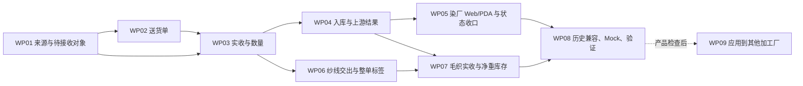

# 染厂待接收与纱线交出接收实施计划

版本：V2，2026-09-11。状态：WP01—WP08 已实现并完成两轮本地技术验收。依据：[总体方案](2026-09-11-dyeing-receiving-adjustment-design.md)；逐项范围：[需求矩阵](2026-09-11-dyeing-receiving-requirements-matrix.md)。本计划不是执行结果。

## 1. 目标与任务边界

交付可运行的染厂收货原型：仓库批准/工厂有效交出产生待接收，送货单关联多个来源，按卷/Yard、普通辅料重量、纱线 pcs/毛净重分别接收，实际入库并能回到上游。同步完成纱线染色单的毛重限额和毛织实收净重库存。

本次实施工作包为 WP01—WP08；WP09 是后续复制的条件与边界，不包含在染厂本期实现完成声明中。业务规则以总体方案为准，未引入真实后端或完整结束状态机。

开工时重新确认分支、HEAD、工作区差异和 5188 服务工作目录。目前工作区存在前期未提交修改，禁止覆盖、清空或将其当作本任务新增内容。实现时需选定包含这组当前原型改动的任务基线；是否在原工作区继续或隔离到含当前修改的工作树，应按当时工作区情况处理，不能用纯 HEAD 的另一份原型替代验收版本。

## 2. 依赖顺序

WP08 的迁移、防重复和场景数据要求从 WP01 开始执行，最终阶段做全链路重放，而不是最后才补数据模型。代码不要求并行代理，按依赖逐项实施。

## 3. 工作包

### WP01：工厂级来源与待接收对象

**业务目标**：收货资格取决于上游有效单据和收货工厂，支持无加工单备料，正确体现审核时点。

**文件/符号**：

- 拟新增 `src/data/fcs/factory-receiving.ts`：待接收头/行、两类来源映射、工厂查询、稳定标识；文件名和新符号为拟定。
- `src/data/fcs/warehouse-material-execution.ts`：仓库来源及必要审核事实。
- `src/data/fcs/preparation-material-receipt-sources.ts`：保留旧公开入口，定位哪些筛选不再用于新染厂接收。
- `src/data/fcs/pda-handover-events.ts`：读取有效交出原记录，保留 source/head/line/target 的准确关联。

**修改**：建立目标工厂必填、加工单/生产单可选的来货记录；新增明确审批事实而不是判断 READY/ISSUED；工厂来源必须有效实际交出；源重复加载幂等；保留仓库/工厂类型及逐物料归属。现有仓库单据历史字段不大面积改为可选，优先通过新收货来源记录承载独立备料 Mock 与可选关联。

**验证证据**：来源出现契约 S02/S03、无关联备料 S08、主数据归属 S04；证明未审核、空交接头、草稿及作废来源不误生成，批准未发货不产生库存。

**完成条件**：SRC 类需求均有来源映射与测试；不再依赖正式工艺路线才能查询本厂来货。没有原单对应关系的纯文字 Mock 不算完成。

### WP02：送货单与来源分组

**业务目标**：一次扫码找到多张待接收单，允许混合来源和分批送货。

**文件/符号**：

- 拟新增 `src/data/fcs/factory-delivery-notes.ts`：送货头、送货行、本次携带数量/卷码及条码解析。
- `src/pages/process-factory/dyeing/output-documents.ts`：从有效交出组织送货、原交出 ID 回链；不将现有草稿交出单直接称为送货单。
- `src/data/fcs/print-service.ts`、打印类型实际定义文件：增加明确送货单打印来源，实施定位后在矩阵补充具体符号。
- 拟新增 `src/pages/print/templates/factory-delivery-note-template.ts`，复用现有 Code128/QR 能力和统一预览；保留 `task-delivery-card.ts` 单记录用途。

**修改**：主流同类型同上游默认分组，跨来源类型/跨上游不限制；送货行逐条引用原单/原行与本次货物；默认同目的工厂，扫描混合目的信息时只允许本厂操作；允许原单分多次送货，不重复创建待接收原单；送货单不是接收必需项。打印和扫描只识别，不入库。

**验证证据**：S01/S04/S05/S14，打印预览及可读码截图；验证同 SKU 不丢原行归属，原单总量不被复制到各送货批次。

**完成条件**：DEL 类要求有清晰的多对多关联，扫码结果可反查原单；新送货单能通过演示操作创建/打印/重开，不只是预置不可操作的列表。

### WP03：实收记录与三类物料计量

**业务目标**：保存现场实际值，支持多行一次提交、分次、零收和超收；保持物料单位准确。

**文件/符号**：

- `factory-receiving.ts`（拟新增）：本次接收头/行、确认号、逐物料实收、接收历史。
- 拟新增 `src/data/fcs/yarn-weight.ts`：仅含三个管型标准、单位换算、管重/净重计算与必要校验。
- `src/data/fcs/dyeing-material-receipts.ts`：`receiveDyeMaterial` 成为新路径的必要兼容适配，保留现有调用契约或同步更新本范围内调用方。
- `src/data/fcs/pda-handover-events.ts`：补本厂接收结果映射；不能粗暴删除对其他旧流程有效的准备工艺约束。

**修改**：卷码沿用与物流段去重，卷/Yard 双量；普通辅料 kg/g 联动；纱线 pcs/毛重/管型数量/管重/净重；明确 0 可记、空值不自动 0、超收不截断；源单位不同保留双方量，不伪造换算；收货人/工厂/时间/原单行必需；收货不直接等于订单完结。

**验证证据**：S05/S06/S07/S10/S11；新增最小专项（拟名 `scripts/check-factory-material-receiving.ts` 和 `scripts/check-yarn-weight-rules.ts`），复用已有测试工具，不引入新测试框架。

**完成条件**：REC/MAT 类要求成立，所有成功结果是本次真实增量，重复确认返回原结果；先写相关数值/重复契约，再实现数量修改。

### WP04：上游实收、待加工仓及真实库位

**业务目标**：一次收货在原单和库存中一致可追溯，数量差异不自动变成异常仓，备料不需要假订单。

**文件/符号**：

- `src/data/fcs/factory-internal-warehouse-locations.ts`：`resolveEnabledFactoryWarehouseLocation` 及最小默认收货位置配置。
- `src/data/fcs/factory-internal-warehouse.ts`：`upsertFactoryWarehouseInboundRecord`、`upsertFactoryWaitProcessStockItem` 和既有修改快照。
- `src/data/fcs/factory-warehouse-linkage.ts`：为新接收明细增加真实位置与增量映射；不扩大重写所有历史链路。
- `src/data/fcs/warehouse-material-execution.ts`、`pda-handover-events.ts`：分别展示仓库和工厂的实际接收。

**修改**：以接收明细生成库存凭证，保存源行与库位；零接收只存事实；默认位置来自真实启用目录，允许行/卷调整；无订单备料保留厂/SKU/批次/卷码，关联任务不会再次入库；上游发出值不改，原有出库不重复扣；必要保存失败恢复覆盖新增记录与库存。

**验证证据**：S01/S05/S06/S08/S09/S16；校验单次及累计库存、来源回传、多库位合计、跨工厂/停用位置阻断、失败无半笔结果。

**完成条件**：STK 类需求可追到具体接收明细，字段显示和真实库存位置一致；不同来源/多次接收不会被同一个原单 ID 覆盖。

### WP05：染厂待接收 Web/PDA 及既有页面收口

**业务目标**：员工可通过菜单或扫码完成收货，管理能追溯；接收、加工、交出三种事实保持独立。

**文件/符号**：

- 拟新增 `src/pages/process-factory/dyeing/pending-receipts.ts`、`receipt-detail.ts`，按页内 `renderXxx` 拆分，不创建组件体系。
- 拟新增窄屏 `src/pages/pda-factory-receipts.ts`，或在已有 PDA 扫码结果中使用同一接收表单；实施时确定唯一入口，矩阵补最终位置。
- `src/data/app-shell-config.ts`、`src/router/routes-fcs.ts`、`src/main-handlers/fcs-handlers.ts`：最小菜单/路由/事件接入。
- `src/pages/process-factory/dyeing/work-order-detail.ts`、`src/pages/pda-exec-detail.ts`：旧接收入口转同一流程。
- `src/data/fcs/dyeing-task-domain.ts`：`completeDyeInputReceipt`、`syncWaterSolubleTaskState` 及接收摘要；只移除接收诱发的开工，不回退真实加工。
- `src/data/fcs/dye-work-order-online-view.ts`、`src/pages/process-factory/dyeing/work-orders.ts`：现有三轴、数量四组和关联入口。

**修改**：增加待接收菜单与扫码主动作、来源分组、图片大图、四步员工表单、库位选择、实收/历史区别；标准列表复用现有组件；保持原加工单布局/备注/流程卡；根据三种物料显示数量，不复用一个通用 qty 字段误导用户；所有弹层/输入局部更新。

**验证证据**：命名页面与设备 S01/S04/S05/S15/S17；检查菜单进出、送货码/原单号进入、旧深链、滚动/闪烁、首屏分页、图片失败/大图/Esc、保存反馈及重复点击。

**完成条件**：PAGE 类要求及收货不自动开工成立；页面内不得存在还能独立写旧实收的第二个按钮。新路由按方案建议，最终实际路由回填矩阵。

### WP06：纱线毛重限额与整单标签

**业务目标**：纱线按下单 kg 确定倍数，出货以累计毛重拦截；一染色单一条码，毛净重正确。

**文件/符号**：

- `yarn-weight.ts`（拟新增）与 `src/data/fcs/dyeing-task-domain.ts`：`submitDyeHandover`、`createDyeDispatchDocument`、`finishDyeDispatchDocument` 的纱线分支及快照。
- `src/pages/process-factory/dyeing/barcode-dialog.ts`、`output-documents.ts`：面料现有逻辑保留；纱线明细编辑和交出前额度提示。
- 纱线标签建议作为本条码模块单独 `renderYarnOrderLabel`，必要时拆 `src/pages/print/templates/dye-yarn-order-label-template.ts`；不先建通用打印框架。

**修改**：pcs、三管型数量、毛重、管重、净重、单据稳定条码；W≤10 用3倍/W>10用2倍；累计毛重与可用净重分别检查；下单缺重不得默认为0放行；同单分批明细与标签快照分开；保留整单可重印身份、标签时间/版本及送货本次数；合并染色保留分单限额和标签。

**验证证据**：S10—S14，0.001 kg 边界、三管型混合、净重非负、已交记录不能重复占额度；面料细码/导入/批量修改原回归；单码身份与打印内容契约。

**完成条件**：YRN/PRN 类需求成立；毛重超额在提交动作处拦截，不只是输入时弹提示；完整已交出事实与打印数值一致。

### WP07：毛织接收与净重库存

**业务目标**：毛织看到染厂原出货并录实收三组值，库存只增加实收净重，支持实际库位。

**文件/符号**：

- `src/data/fcs/wool-domain/types.ts`：`WoolYarnReceiptLine` 等增加新字段及来源；保存历史缺失状态而不乱补。
- `src/data/fcs/wool-domain/commands.ts`：`addWoolYarnReceipt` 及相关输入；按确认号复用接收结果，库存 qty 取净重。
- `src/data/fcs/wool-domain/warehouse-ledger.ts`、`queries.ts`：库位与净重库存查询/领用/退回兼容。
- `src/pages/process-factory/wool/work-order-detail.ts`、`warehouse.ts`、`src/pages/pda-wool-fact-execution.ts`、必要扫码解析：展示实发/实收与来源，已有入口转同事实。

**修改**：避免通用仓和毛织账重复计账；既有默认逻辑归类与实际物理库位并存且正确汇总；无已关联毛织单来货先作为本厂备料承接，后续准确关联，不创造假订单；旧直接覆盖实收的编辑不用于新接收记录；不改横机生产及毛织裁片/成衣交出业务。

**验证证据**：S08/S09/S10/S16，实发12 kg/实收11.4 kg示例入库9.101 kg；净重领用/退回、非重复计账和历史记录展示。

**完成条件**：WOL 类及适用 STK/REC 要求成立，毛织库存账数与实收净重明确一致；辅助 pcs 不被错误当成成衣/裁片件数。

### WP08：历史兼容、场景 Mock 与最终验收

**业务目标**：当前原型可稳定演示完整链路，旧入口没有互相冲突的写入和计量。

**文件/符号**：前述受影响文件；`src/data/fcs/dye-work-order-demo-details.ts`、现有图片 manifest、`wool-domain/mock-data.ts`；相关专项脚本；`docs/prototype-review-records/` 新记录（实施时创建）。

**修改**：按 S01—S17 补真实感场景，不使用不存在的仓库；对应纱线/辅料真实图片；新记录精确、旧记录只据实标注；存在旧源/仓入库时准确去重，不清空用户数据。保留本轮完整 diff 边界和需求编号。

保存端和读取端一并适配零接收、多维计量及无订单备料；不能只改表单成功分支。新增工厂级记录的持久化不受原先正式染色单保存名单限制。刷新重入必须包含明确零接收和未关联备料这两个样例。

**验证证据**：每条要求绑定一个充分证据集合，复用集成场景，不制造重复测试。自动化先做数量/来源/幂等专项，再做路由/交互/图片/打印，最后仅在实际实施交付阶段做项目级门禁。

**完成条件**：本期原子需求没有无说明的待实施/实施中/待验证；最终修改之后重跑受影响证据，确认人和版本可追溯。新纱线实物素材未齐则不得以占位图完成图片项。

### WP09：其他加工厂复制（后续阶段）

**业务目标**：染厂闭环确认后，为印花、辅助工艺、特种工艺、辅料工厂增加对应工厂待接收菜单。

**文件/符号**：各工厂现有路由/菜单、来源及交出模块、各自仓库；实施该阶段前再用 CodeGraph 定位实际符号，不在本方案假定各厂的数据形状相同。

**修改边界**：复用来源单、送货单、接收记录、工厂归属、图片、默认/选择库位和适用计量；按工厂差异绑定自己的原交出与库存。对于裁片/成衣/菲票等对象继续保留其件/片/袋等现场单位，不把面料卷码或纱线倍数强套到其他对象。

**验证证据**：每类工厂至少仓库来货、工厂来货、分次接收、入库/上游一致四条基础场景，再验证其对象差异。

**完成条件**：每厂单独完成门禁才标记该厂完成。染厂通过并不自动代表其他工厂完成。

## 4. 自动化、设备与打印计划

现有直接相关专项包括：

| 位置/命令 | 用途 |
|---|---|
| `scripts/check-dye-material-receipts.ts` | 原染厂接收入口及来源契约；冲突断言随已确认规则调整 |
| `scripts/check-preparation-real-receipt-chain.ts` | 原上游到接收链路，与其他准备工艺兼容 |
| `npm run check:dyeing-workflow` | 染色加工及状态更新回归 |
| `npm run check:dye-work-order-online-alignment` | 当前列表与原加工单展示映射 |
| `npm run check:combined-dyeing` | 合并染色保持独立订单/限额/标签 |
| `npm run check:wool-fact-workflow` | 毛织接收及相关事实回归 |
| `npm run check:wool-warehouse-unified-model` | 毛织仓库口径、库位及局部操作 |
| `npm run check:factory-handover-warehouse-linkage` | 实收与仓库联动影响面 |

以上是计划阶段的候选命令，实际执行清单以两轮审查记录为准，未列入实际清单的不宣称已执行。新增专项为 `check-factory-material-receiving.ts`、`check-yarn-weight-rules.ts`，覆盖本次新增数值与链路；不为每个视图复制一套相同公式测试。

实施后先跑直接相关专项，再按实际改动执行类型/构建、标准列表及原型治理。菜单/路由总入口受影响时需项目级验证；不得修改标准列表基线或检查脚本绕过门禁。最后执行 CodeGraph sync/status；在任务边界可隔离时生成 workflow:verify 收据，不能吸收无关工作区差异。

浏览器命名路径：原染色加工单、拟新增待接收列表/详情、PDA 接收、染色待加工仓、染色交出/条码、毛织单/待加工仓/接收、原生产流程卡、拟新增送货单及纱线标签。管理端1366×768/1280×720、执行Web1024×768、PDA390×844及实际设备。最终给同一局域网可访问的服务地址，并确认对应当前任务工作树。

## 5. 审查与变更记录

按总体方案→矩阵→实现/证据正向检查；再按实际代码/页面/数据→需求编号反向检查。重点审查：审批时点、混合来源、无单备料、收货与开工分离、超收/零收、单位差异、分次幂等、仓位、毛重限额与净重库存、单码分批、历史旧入口。

V1：只读方案阶段，仅输出设计/计划/矩阵。V2：用户授权执行，本期实现位置和两轮技术证据回填矩阵；产品接受待用户复核。

## 2026-09-11 执行补充

用户已要求执行并完成两轮验收。第一轮覆盖来源、收货、库存与上下游数量契约；第二轮覆盖实际页面、扫码、打印、刷新及旧入口回归。任何实质修改后重验受影响证据。所有命名 Mock 的适用必需字段必须有具体值，未发生动作和无单备料据实展示，不伪造已发生事实。

## 6. V2 实际执行收口

第 3 节保留原工作包意图。下表为已采用的文件落点，替代原拟定文件名；没有创建表中未列出的通用框架或新增后端。

| 工作包 | 实際落点 | 完成证据 |
|---|---|---|
| WP01 | factory-receiving-types.ts / factory-receiving.ts / factory-receiving-mock.ts；仓库及交出原记录适配 | 两轮来源资格与标识契约；16 个完整来源 |
| WP02 | factory-receiving.ts 的送货对象/扫码；pending-receipts.ts 的建单和隔离打印视图 | 两轮混合送货页面；分批 600+400 / 400+200+400 契约 |
| WP03 | factory-receiving.ts / factory-receiving-links.ts / yarn-weight.ts；同一实收表单 | 少收、超收、零收、空白防错、卷码、克级计量及重放 |
| WP04 | factory-receiving-warehouse.ts / factory-receiving-wool.ts；现有库位目录与 core defaults | 实收增量入库、备料分配守恒、实际位置和上游回传 |
| WP05 | pending-receipts.ts 共用管理/PDA视图；菜单、路由、主事件入口、旧接收转入 | 桌面三尺寸、PDA390、列表设置持久化、接收不开工 |
| WP06 | yarn-shipments.ts / yarn-weight.ts / dyeing-task-domain.ts；原条码入口按纱线分流 | 9.999/10/10.001、累计上限、可用净重、两版本同码解码 |
| WP07 | factory-receiving-wool.ts；wool-domain 和现有毛织页 | 19pcs/11.4kg→9.101kg；分配5kg、移库1kg、领用退回 |
| WP08 | 本矩阵、两轮审查记录、3个新专项及现有回归、任务文件哈希 | 两轮各8专项、类型/构建/菜单/列表/治理、当前CodeGraph |
| WP09 | 未实施 | 本期不适用，染厂产品复核后分厂执行 |

执行结果：[两轮技术验收记录](prototype-review-records/2026-09-11-dyeing-receiving-two-rounds.md)。未运行覆盖整个脏工作树的 workflow:verify，原因和限定任务证据按 AGENTS.md 第 8.1 节记录。没有提交、推送或产品接受声明。
