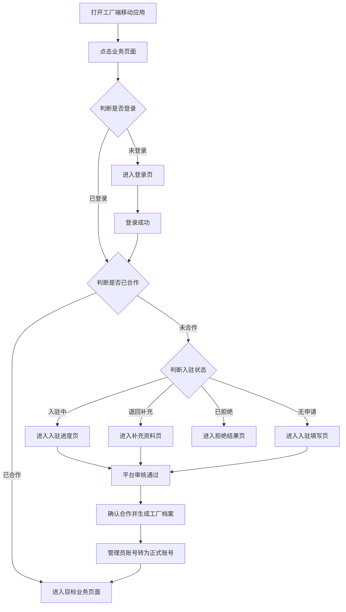
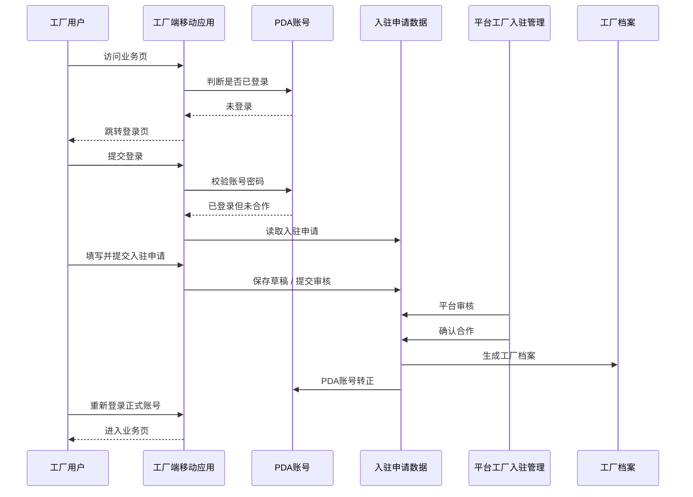
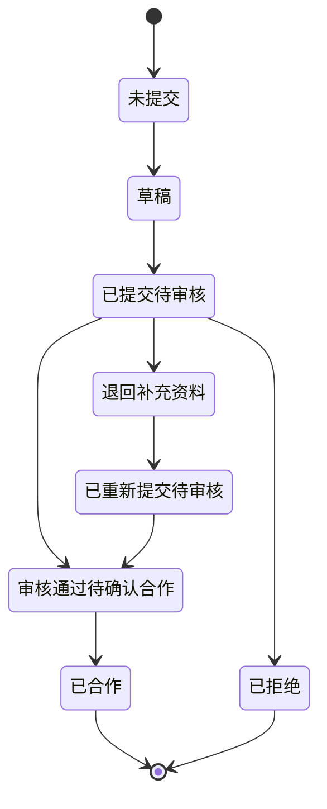

# FCS P0：工厂入驻与登录准入闭环

## 1. 业务边界

本轮只处理 `P0：工厂入驻与登录准入闭环`，目标是把工厂端移动应用的登录、入驻、平台审核、确认合作、生成工厂档案和管理员账号接成同一条前端 mock 闭环。

明确边界：
- 入驻申请不是工厂档案。
- 只有 `已合作` 工厂才进入工厂档案。
- 未登录、未合作、入驻中、已拒绝工厂都不能进入 PDA 业务页。
- 不新增后端、服务端、数据库。
- 不重做执行、交接、仓管、结算页面，只加准入守卫。

## 2. 为什么不保留 `/fcs/pda/login` 兼容跳转

本轮必须只保留一个登录真相入口：`/fcs/pda/auth/login`。

不保留 `/fcs/pda/login` 的原因：
- 避免出现两个登录入口，导致菜单、守卫、回跳口径不一致。
- 未登录回跳、登录后 returnTo、入驻分流都必须围绕同一入口工作。
- 如果保留旧入口，会让业务页守卫、菜单和测试同时维护两套路由，闭环会再次松动。

因此：
- `/fcs/pda/login` 不再是有效入口。
- 不存在 `/fcs/pda/login -> /fcs/pda/auth/login` 的兼容跳转。
- 所有未登录跳转统一进入 `/fcs/pda/auth/login`。

## 3. 工厂端移动应用菜单结构

一级菜单：
- `工厂入驻&登录`
  - `登录`：`/fcs/pda/auth/login`
  - `入驻`：`/fcs/pda/auth/onboarding`
- `工厂端移动应用`
  - `接单`
  - `执行`
  - `交接`
  - `仓管`
  - `结算`

## 4. 平台工厂入驻管理菜单结构

`工厂池管理` 下新增：
1. `工厂入驻管理`：`/fcs/factories/onboarding`
2. `工厂档案`
3. 其他既有工厂池管理菜单

## 5. 入驻申请数据模型

核心模型：`FactoryOnboardingApplication`

关键字段：
- `applicationId`
- `applicationNo`
- `factoryTempId`
- `factoryName`
- `bossName`
- `whatsapp`
- `address`
- `machineTotalCount`
- `effectiveWorkerCount`
- `availableStartDate`
- `selectedCapabilities`
- `machines`
- `adminAccount`
- `status`
- `currentNode`
- `submittedAt`
- `reviewedAt`
- `contractedAt`
- `createdFactoryId`
- `nodeLogs`
- `actionLogs`
- `reviewRecords`
- `transferRecords`

## 6. 管理员账号规则

- 入驻申请内的账号就是默认管理员账号。
- `roleId` 固定保存为 `FACTORY_ADMIN`。
- `roleName` 显示为 `工厂管理员`。
- 平台确认合作后：
  - 该账号会在 PDA 正式账号域生成等价值管理员账号 `ROLE_ADMIN`。
  - 入驻申请内账号状态更新为 `已转正式`。
- 平台详情页不展示明文密码。

## 7. 工序工艺能力选择规则

- 工序工艺全部来源于 `src/data/fcs/process-craft-dict.ts`。
- 先选工序，再勾选该工序下的具体工艺。
- 不允许只选工序、不选工艺。
- 至少选择一个工序工艺。
- 已选工艺以标签展示，并可移除。
- 页面只展示中文工序名和工艺名。

## 8. 机器关联工序工艺规则

- 每条机器明细都必须选择：
  - 关联工序
  - 关联工艺
- 机器关联的工序工艺必须已经存在于 `selectedCapabilities`。
- 若未选择，会提示：
  - `该机器关联的工序工艺未在接单能力中选择，请先选择对应工序工艺。`

## 9. 登录守卫规则

守卫入口：
- `ensurePdaAccessForRoute(targetRoute)`
- `getPdaFactoryAccessState()`
- `resolvePdaPostLoginRoute(session, returnTo)`

规则：
- 未登录访问业务页：跳转 `/fcs/pda/auth/login`。
- 已登录且已合作：允许进入业务页。
- 未合作且无申请：进入 `/fcs/pda/auth/onboarding`。
- 草稿 / 待审核 / 退回补充 / 待确认合作 / 已拒绝：全部进入 `/fcs/pda/auth/onboarding`。
- 已合作但仍是旧入驻会话：要求重新登录正式账号。

## 10. 入驻状态机

状态：
- 草稿
- 已提交待审核
- 退回补充资料
- 已重新提交待审核
- 审核通过待确认合作
- 已拒绝
- 已合作

节点：
- 填写入驻信息
- 提交平台审核
- 平台审核
- 补充资料
- 确认合作
- 生成工厂档案
- 完成

## 11. 平台审核规则

审核结果：
- `通过`
  - 状态：`审核通过待确认合作`
  - 节点：`确认合作`
- `不通过且允许再次提交`
  - 状态：`退回补充资料`
  - 节点：`补充资料`
- `不通过且不允许再次提交`
  - 状态：`已拒绝`
  - 节点：`完成`

## 12. 审核通过后生成工厂档案和管理员账号规则

点击 `确认合作` 后必须同时完成：
1. 生成正式工厂档案。
2. 将入驻申请状态改为 `已合作`。
3. 当前节点改为 `完成`。
4. 将 `createdFactoryId` 回写到入驻申请。
5. 生成或转正该工厂管理员账号。
6. 写入转档记录。

## 13. 工厂档案只包含已合作工厂

强约束：
- `草稿`
- `已提交待审核`
- `退回补充资料`
- `已重新提交待审核`
- `审核通过待确认合作`
- `已拒绝`

以上状态都不能进入工厂档案。

只有 `已合作` 会被写入工厂档案页面使用的主数据源。

## 14. 中文流程图

## 15. 中文时序图

## 16. 中文状态图

