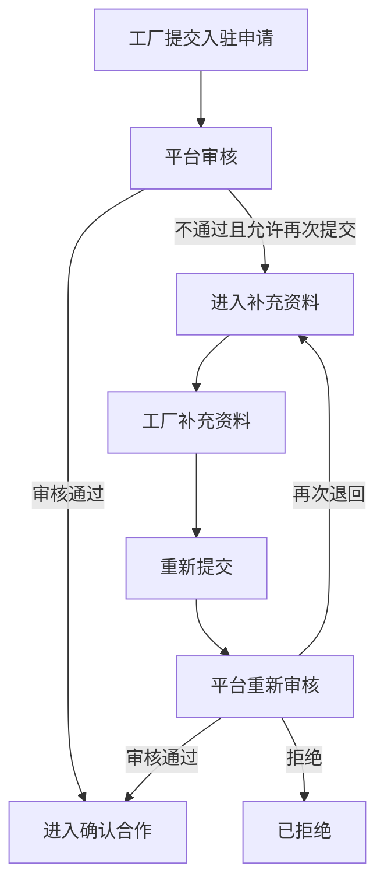
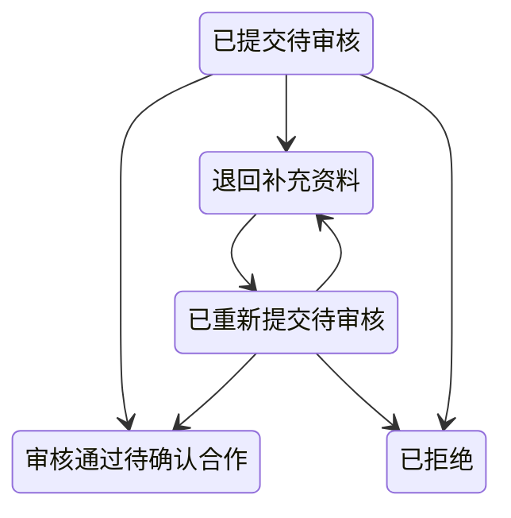
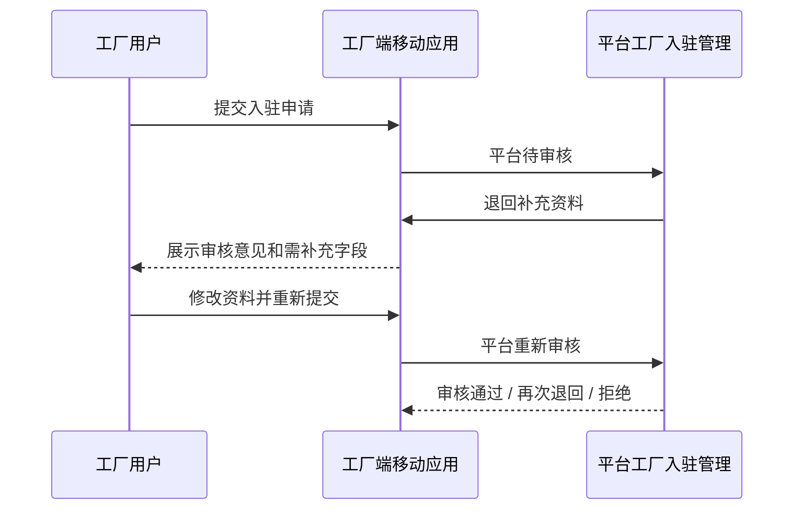

# FCS P1：工厂入驻流程跟踪、机器能力校验、审核记录与退回补充闭环

## 1. 本轮边界

P1 只处理以下范围：
- 节点耗时计算与展示
- 节点动作次数计算与展示
- 机器关联工序工艺的强校验
- 平台审核记录、流程记录、补充记录补齐
- 退回补充资料后的重新提交闭环

本轮不做：
- 不恢复 `/fcs/pda/login`
- 不新增旧登录兼容跳转
- 不重做 P0 菜单和路由
- 不重做工厂档案页面
- 不重做 PDA 执行、交接、仓管、结算页面

## 2. 节点耗时计算规则

核心函数位于 `src/data/fcs/factory-onboarding-flow.ts`：
- `calculateNodeElapsedMinutes(nodeLog, now)`
- `formatNodeElapsedText(minutes)`
- `getCurrentNodeLog(application)`
- `getCurrentNodeElapsedText(application)`

规则：
- 当前节点 `进行中`：耗时 = `当前时间 - enteredAt`
- 已完成节点：耗时 = `leftAt - enteredAt`
- 未开始节点：显示 `-`
- 已终止节点：显示 `已终止`
- 文案格式：
  - 小于 60 分钟：`xx分钟`
  - 60 分钟到 24 小时：`x小时xx分钟`
  - 超过 24 小时：`x天x小时`

## 3. 动作次数计算规则

核心函数：`getNodeActionCount(application, nodeName)`

规则：
- 按 `actionLogs` 中同一 `nodeName` 的动作条数统计
- 当前节点展示文案为：`第 x 次动作`
- 补充资料节点既统计平台退回，也统计工厂保存、工厂重新提交
- 多轮平台审核时，`平台审核` 节点动作次数会继续递增

## 4. 机器关联工序工艺规则

机器明细必须与接单能力强绑定。

规则：
- 机器 `关联工序` 只能从已选能力的工序中选择
- 机器 `关联工艺` 只能从该工序下已选能力的工艺中选择
- 删除某个已选工序工艺后：
  - 机器不会被自动删除
  - 机器行改为异常状态
  - `validationStatus = 工序工艺未在接单能力中选择`
  - 保存草稿允许，提交申请不允许

机器校验状态：
- `通过`
- `未关联工序`
- `未关联工艺`
- `工序工艺未在接单能力中选择`

对应错误提示：
- `请选择机器关联工序`
- `请选择机器关联工艺`
- `该机器关联的工序工艺未在接单能力中选择，请先选择对应工序工艺`

## 5. 审核记录字段说明

`reviewRecords` 必须包含：
- `reviewId`
- `reviewRoundNo`
- `reviewResult`
- `reviewOpinion`
- `allowResubmit`
- `reviewer`
- `reviewedAt`
- `fromStatus`
- `toStatus`
- `fromNode`
- `toNode`

审核结果只允许：
- `通过`
- `不通过且允许再次提交`
- `不通过且不允许再次提交`

## 6. 流程记录字段说明

`nodeLogs` 必须包含：
- `nodeLogId`
- `nodeName`
- `nodeStatus`
- `enteredAt`
- `leftAt`
- `elapsedMinutes`
- `elapsedText`
- `actionCount`
- `lastActionAt`
- `operator`
- `remark`

`actionLogs` 必须包含：
- `actionLogId`
- `actionName`
- `nodeName`
- `operator`
- `operatedAt`
- `actionSequenceInNode`
- `fromStatus`
- `toStatus`
- `fromNode`
- `toNode`
- `remark`

## 7. 补充记录字段说明

`supplementRecords` 必须包含：
- `supplementId`
- `supplementRoundNo`
- `supplementReason`
- `requiredFields`
- `submittedFields`
- `submittedAt`
- `submittedBy`
- `relatedReviewId`
- `status`

状态只允许：
- `待补充`
- `已补充`
- `已重新提交`

## 8. 退回补充资料流程

当平台审核结果为 `不通过且允许再次提交`：
- 入驻状态切到 `退回补充资料`
- 当前节点切到 `补充资料`
- 必须写入：
  - `reviewRecords`
  - `supplementRecords`
  - `actionLogs`
  - `nodeLogs`
- PDA 入驻页展示：
  - 最近审核意见
  - 需补充字段
  - 当前填写值
  - 修改入口提示
- 该状态下表单可编辑
- 提交按钮文案改为 `重新提交入驻申请`

## 9. 重新提交后的状态流转

当工厂补充资料并重新提交：
- 状态变为 `已重新提交待审核`
- 当前节点变为 `平台审核`
- 新增 `actionLog.actionName = 工厂重新提交`
- 更新最近一条 `supplementRecord.status = 已重新提交`
- 写入 `submittedFields / submittedAt / submittedBy`
- `补充资料` 节点关闭，`平台审核` 节点重新打开

## 10. 平台审核三种结果

1. 审核通过
- 状态：`审核通过待确认合作`
- 节点：`确认合作`
- 写入：`reviewRecords + actionLogs + nodeLogs`

2. 不通过且允许再次提交
- 状态：`退回补充资料`
- 节点：`补充资料`
- 写入：`reviewRecords + supplementRecords + actionLogs + nodeLogs`
- 必须选择至少一个 `需补充字段`

3. 不通过且不允许再次提交
- 状态：`已拒绝`
- 节点：`完成`
- 写入：`reviewRecords + actionLogs + nodeLogs`

## 11. 本次不恢复旧登录路由的说明

P1 继续沿用 P0 的单一登录真相入口：
- 登录：`/fcs/pda/auth/login`
- 入驻：`/fcs/pda/auth/onboarding`

本轮不会恢复：
- `/fcs/pda/login`
- `/fcs/pda/login -> /fcs/pda/auth/login` 兼容跳转

原因：
- 退回补充、重新提交、业务页守卫和 returnTo 回跳都依赖单一路由口径
- 重新引入旧入口会让守卫和审核闭环重新分叉

## 12. 中文流程图

## 13. 中文状态图

## 14. 中文时序图

