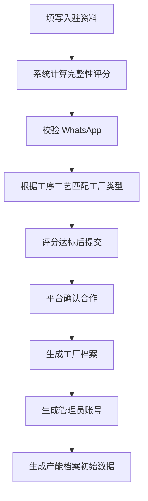
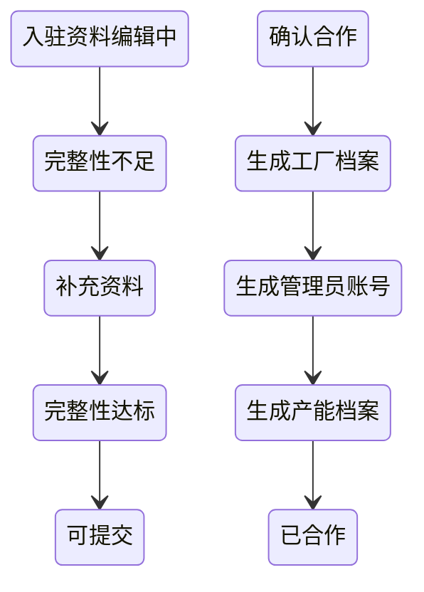

# FCS P2：工厂入驻增强能力

## 1. 本轮边界

P2 只处理以下范围：
- 入驻资料完整性评分
- 工厂能力自动匹配工厂类型
- 确认合作后自动生成产能档案初始数据
- WhatsApp 格式校验与归一化增强

本轮不做：
- 不恢复 `/fcs/pda/login`
- 不重做 P0 菜单、路由、登录守卫
- 不重做 P1 流程节点、审核记录、退回补充流程
- 不新增后端、服务端、数据库
- 不重做工厂档案页面整体结构
- 不重做产能日历

## 2. 入驻资料完整性评分规则

核心字段位于 `src/data/fcs/factory-onboarding-domain.ts`：
- `completenessScore`
- `completenessLevel`
- `completenessItems`
- `completenessUpdatedAt`

核心函数位于 `src/data/fcs/factory-onboarding-flow.ts`：
- `calculateOnboardingCompleteness(application)`
- `getCompletenessLevel(score)`
- `getCompletenessMissingItems(application)`

评分不是写死百分比，而是按评分项逐项累计。

### 2.1 评分项与权重

1. 账号信息：10
- 登录账户
- 登录密码
- 管理员姓名
- 管理员 WhatsApp

2. 工厂基础信息：20
- 工厂名称
- 老板名字
- WhatsApp
- 地址
- 可开始合作时间

3. 人员信息：10
- 有效工人数量 > 0

4. 机器信息：20
- 机器总数 > 0
- 至少一条机器明细
- 每条机器有机器名称、数量、状态

5. 工序工艺能力：20
- 至少选择一个工序工艺
- 不允许只选工序不选工艺

6. 机器与工序工艺关联：15
- 每台机器都关联已选工序工艺

7. WhatsApp 格式：5
- 工厂 WhatsApp 与管理员 WhatsApp 都通过格式校验

### 2.2 完整性等级

- `0-59`：不完整
- `60-79`：基本完整
- `80-94`：完整
- `95-100`：高完整

### 2.3 提交门槛

- 保存草稿允许低分
- 提交入驻申请时必须 `>= 80`
- 低于 80 时阻止提交，并提示：
  - `资料完整性不足 80 分，请先补充必填信息后再提交。`

## 3. 工厂类型自动匹配规则

核心字段：
- `inferredFactoryTypes`
- `primaryFactoryType`
- `factoryTypeMatchedAt`
- `factoryTypeMatchReason`

核心函数：
- `inferFactoryTypesFromCapabilities(selectedCapabilities)`
- `getPrimaryFactoryType(matchResults)`
- `buildFactoryTypeMatchReason(matchResults)`

### 3.1 工厂类型映射

- `CUTTING_FACTORY`：裁床厂
- `PRINTING_FACTORY`：印花厂
- `DYEING_FACTORY`：染厂
- `POST_FINISHING_FACTORY`：后道工厂
- `SPECIAL_CRAFT_FACTORY`：特殊工艺厂
- `SEWING_FACTORY`：车缝厂
- `MULTI_CAPABILITY_FACTORY`：全能力工厂

### 3.2 匹配规则

- 选择裁床相关工艺：匹配裁床厂
- 选择印花相关工艺：匹配印花厂
- 选择染色相关工艺：匹配染厂
- 选择后道 / 包装 / 质检相关工艺：匹配后道工厂
- 选择绣花 / 打条 / 打揽 / 烫画 / 直喷等：匹配特殊工艺厂
- 选择车缝：匹配车缝厂
- 同时命中 3 类及以上：主类型升级为全能力工厂

### 3.3 多能力匹配全能力工厂规则

- `inferredFactoryTypes` 保留所有命中的工厂类型
- `primaryFactoryType` 统一取 `MULTI_CAPABILITY_FACTORY`
- `factoryTypeMatchReason` 显示所有命中的能力依据

## 4. 产能档案初始数据生成规则

核心函数：
- `createInitialCapacityProfileFromOnboarding(application, createdFactory)`

生成时机：
- 平台确认合作
- 生成工厂档案
- 管理员账号转正
- 生成产能档案初始数据
- 写入转档记录

### 4.1 初始产能档案字段

- `capacityProfileId`
- `factoryId`
- `factoryName`
- `factoryType`
- `sourceApplicationId`
- `sourceApplicationNo`
- `effectiveWorkerCount`
- `machineTotalCount`
- `capabilityItems`
- `machineItems`
- `defaultDailyOutputValue`
- `calculationStatus`
- `calculationNotes`
- `createdAt`
- `updatedAt`

### 4.2 默认日可供给产值 规则

当前阶段不乱算 产值：
- 如果字典缺少足够计算字段，则：
  - `defaultDailyOutputValue = 0`
  - `calculationStatus = 待补充产能字段`
  - `calculationNotes = 入驻资料已生成产能档案初始数据，默认日可供给产值 待补充字段后计算。`

### 4.3 明确禁止

- 不人工乱填 产值
- 不按机器数量随意估算 产值
- 不生成产能“当前状态”
- 不生成白班 / 夜班
- 不生成按周默认供给能力

## 5. WhatsApp 格式校验与归一化规则

工具文件：`src/data/fcs/whatsapp-validator.ts`

核心函数：
- `normalizeWhatsApp(value)`
- `validateWhatsApp(value)`
- `formatWhatsAppForDisplay(value)`

### 5.1 允许输入

- `+62` 开头
- `62` 开头
- `0` 开头的印尼手机号
- 输入中允许空格、短横线、括号

### 5.2 统一归一化结果

所有有效号码保存后统一变为：
- `+62xxxxxxxxxx`

示例：
- `081234567890 -> +6281234567890`
- `6281234567890 -> +6281234567890`
- `+6281234567890 -> +6281234567890`

### 5.3 非法格式

以下情况一律视为无效：
- 空值
- 少于 9 位有效数字
- 多于 15 位有效数字
- 包含中文字符
- 包含明显非法字符

错误提示：
- `WhatsApp 格式不正确，请填写印尼手机号，例如 +6281234567890`

## 6. 本次不恢复旧登录路由说明

P2 继续沿用 P0/P1 的单一路由口径：
- 登录：`/fcs/pda/auth/login`
- 入驻：`/fcs/pda/auth/onboarding`

不会恢复：
- `/fcs/pda/login`
- `/fcs/pda/login -> /fcs/pda/auth/login` 兼容跳转

原因：
- 完整性评分、退回补充、工厂类型匹配、确认合作后的转档链路都依赖单一登录入口
- 恢复旧入口会让登录守卫、returnTo、申请会话再次分叉

## 7. 中文流程图

## 8. 中文状态图

