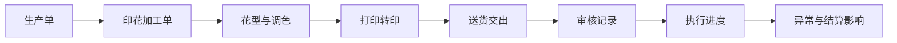
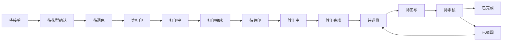
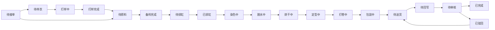

# FCS 工艺详情视图与后道工厂口径

## 流程图一：印花详情视图收口

```mermaid
flowchart LR
  A[生产单] --> B[印花加工单]
  B --> C[花型与调色]
  C --> D[打印转印]
  D --> E[送货交出]
  E --> F[审核记录]
  F --> G[执行进度]
  G --> H[异常与结算影响]
```

## 流程图二：染色详情视图收口

```mermaid
flowchart LR
  A[生产单] --> B[染色加工单]
  B --> C[打样备料]
  C --> D[染缸执行]
  D --> E[染色配方]
  E --> F[送货交出]
  F --> G[审核记录]
  G --> H[染色统计]
  H --> I[异常与结算影响]
```

## 流程图三：专门后道工厂

```mermaid
flowchart LR
  A[生产单] --> B[后道单]
  B --> C[接收领料]
  C --> D[质检]
  D --> E[后道]
  E --> F[复检]
  F --> G[后道交出仓]
  G --> H[交出记录]
  H --> I[接收方回写]
  I --> J[完成]
```

## 流程图四：车缝厂已做后道

```mermaid
flowchart LR
  A[车缝任务] --> B[车缝完成]
  B --> C[车缝厂完成后道]
  C --> D[交给后道工厂]
  D --> E[后道工厂接收领料]
  E --> F[后道工厂质检]
  F --> G[后道工厂复检]
  G --> H[后道交出仓]
  H --> I[交出记录]
  I --> J[接收方回写]
  J --> K[完成]
```

## 状态机一：印花加工单

```mermaid
flowchart LR
  A[待接单] --> B[待花型确认]
  B --> C[待调色]
  C --> D[等打印]
  D --> E[打印中]
  E --> F[打印完成]
  F --> G[待转印]
  G --> H[转印中]
  H --> I[转印完成]
  I --> J[待送货]
  J --> K[待回写]
  K --> L[待审核]
  L --> M[已完成]
  L --> N[已驳回]
  N --> J
```

## 状态机二：染色加工单

```mermaid
flowchart LR
  A[待接单] --> B[待样衣]
  B --> C[打样中]
  C --> D[打样完成]
  D --> E[待原料]
  E --> F[备料完成]
  F --> G[待排缸]
  G --> H[已排缸]
  H --> I[染色中]
  I --> J[脱水中]
  J --> K[烘干中]
  K --> L[定型中]
  L --> M[打卷中]
  M --> N[包装中]
  N --> O[待送货]
  O --> P[待回写]
  P --> Q[待审核]
  Q --> R[已完成]
  A --> E
  Q --> S[已驳回]
  S --> O
```

## 状态机三：专门后道工厂

```mermaid
flowchart LR
  A[待接收领料] --> B[接收中]
  B --> C[已接收]
  C --> D[待质检]
  D --> E[质检中]
  E --> F[质检完成]
  F --> G[待后道]
  G --> H[后道中]
  H --> I[后道完成]
  I --> J[待复检]
  J --> K[复检中]
  K --> L[复检完成]
  L --> M[待交出]
  M --> N[已交出]
  N --> O[已回写]
  O --> P[已完成]
```

## 状态机四：车缝厂已做后道

```mermaid
flowchart LR
  A[待接收领料] --> B[接收中]
  B --> C[已接收]
  C --> D[待质检]
  D --> E[质检中]
  E --> F[质检完成]
  F --> G[待复检]
  G --> H[复检中]
  H --> I[复检完成]
  I --> J[待交出]
  J --> K[已交出]
  K --> L[已回写]
  L --> M[已完成]
```
