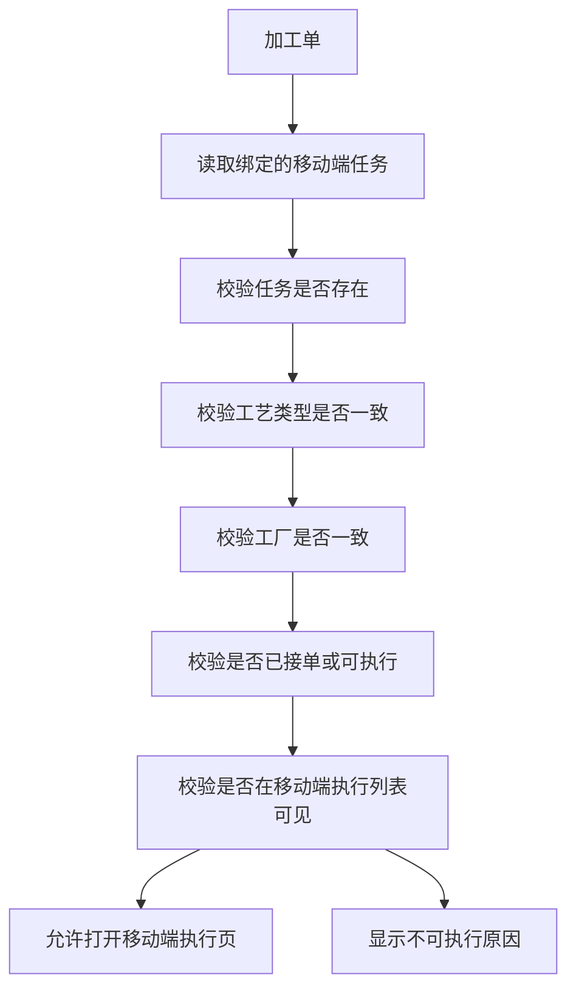
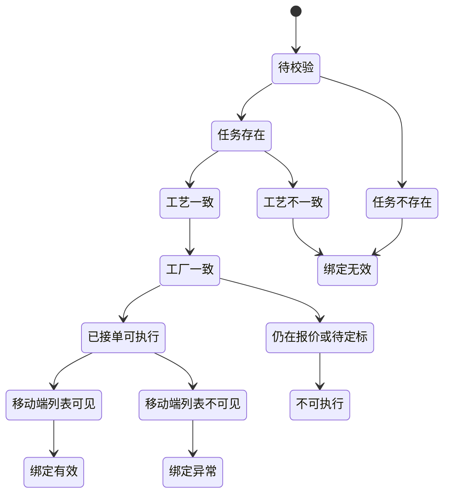

# FCS 加工单与移动端任务绑定校验

本轮只处理“加工单与移动端执行任务的绑定校验”和演示数据修正，不重做完整状态机，不改仓记录、交出、统计、打印链路。

## 目标

- Web 端加工单详情只允许打开有效的移动端执行任务。
- PDA 执行列表和绑定校验复用同一套任务源、同一套可见性规则。
- 报价、待定标、待接单、拒单、已关闭、非 F090、工艺不匹配任务，不再作为可执行绑定结果。
- Web 能打开的移动端任务，必须能在 PDA 执行列表中搜索到。

## 绑定校验流程图

## 绑定状态机

## 规则摘要

- 有效移动端任务必须存在。
- 有效移动端任务必须与当前加工单工艺类型一致。
- 演示阶段统一要求工厂为 `F090 / 全能力测试工厂`。
- 有效移动端任务必须已接单。
- 报价、待定标、未接单、拒单、关闭、作废任务不得进入执行绑定结果。
- `isTaskVisibleInMobileExecutionList` 必须与 `src/pages/pda-exec.ts` 的执行列表过滤一致。

## 模块与页面

- 绑定模块：`src/data/fcs/process-mobile-task-binding.ts`
- 印花详情：`src/pages/process-factory/printing/work-order-detail.ts`
- 染色详情：`src/pages/process-factory/dyeing/work-order-detail.ts`
- 裁片详情：`src/pages/process-factory/cutting/original-orders.ts`
- 特殊工艺工艺单详情：`src/pages/process-factory/special-craft/work-order-detail.ts`
- PDA 执行列表：`src/pages/pda-exec.ts`
- PDA 执行详情：`src/pages/pda-exec-detail.ts`
- 平台侧适配：`src/data/fcs/page-adapters/process-prep-pages-adapter.ts`

## 核心示例

- `PH-20260328-001` 从报价任务解绑，改为绑定可执行印花任务。
- PDA 特殊工艺执行列表使用真实特殊工艺绑定任务号，例如 `TASK-SC-OP-008-0101`。
- Web 详情页显示 `移动端执行任务号 / 绑定状态 / 校验结果 / 不可执行原因`。
