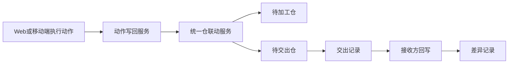
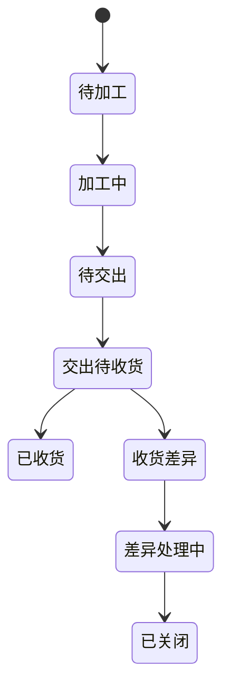

# FCS 待加工仓 / 待交出仓 / 交出 / 回写联动说明

## 流程图

```mermaid
flowchart LR
  A["Web或移动端执行动作"] --> B["动作写回服务"]
  B --> C["统一仓联动服务"]
  C --> D["待加工仓"]
  C --> E["待交出仓"]
  E --> F["交出记录"]
  F --> G["接收方回写"]
  G --> H["差异记录"]
```

## 状态机

```mermaid
stateDiagram-v2
  [*] --> 待加工
  待加工 --> 加工中
  加工中 --> 待交出
  待交出 --> 交出待收货
  交出待收货 --> 已收货
  交出待收货 --> 收货差异
  收货差异 --> 差异处理中
  差异处理中 --> 已关闭
```

本原型只表达页面链路和统一事实口径：Web 与移动端动作都通过写回服务进入统一仓联动服务，再形成待加工仓、待交出仓、交出记录、接收回写和差异记录。
