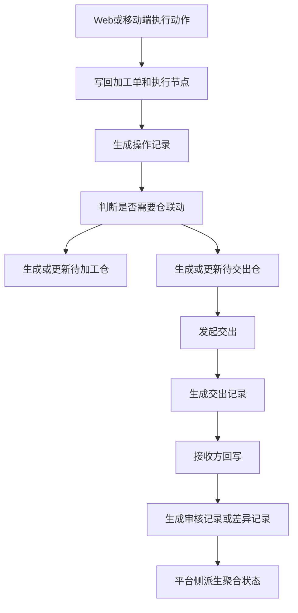
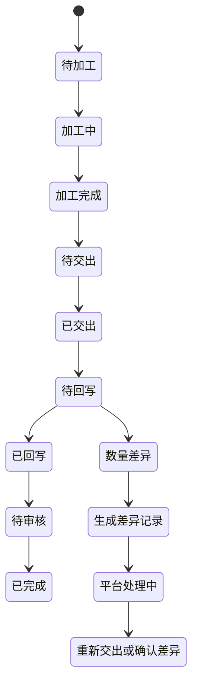

# FCS 第 8 步：待加工仓、待交出仓、交出、回写联动

## 目标

本轮把印花、染色、裁片、特殊工艺的 Web 端状态操作和工厂端移动应用操作，统一联动到待加工仓、待交出仓、交出记录、接收方回写、审核记录和差异记录。

所有联动都从 `executeProcessAction` 进入，写回加工单和执行节点后，由 `applyWarehouseLinkageAfterAction` 根据动作结果生成或更新统一事实源。页面只读取事实源，不在组件内拼接孤立交出记录。

## 中文流程图

## 中文状态机

## 联动入口

- Web 端和移动端操作都通过统一写回触发仓联动。
- `executeProcessAction` 成功后调用 `applyWarehouseLinkageAfterAction`。
- `applyPrintWarehouseLinkageAfterAction` 处理印花待交出仓和交出记录。
- `applyDyeWarehouseLinkageAfterAction` 处理染色待交出仓和交出记录。
- `applyCuttingWarehouseLinkageAfterAction` 处理裁片待加工仓、待交出仓、交出记录和菲票追溯。
- `applySpecialCraftWarehouseLinkageAfterAction` 处理特殊工艺待加工仓、待交出仓、交出记录、差异记录和菲票数量变化。

## 统一事实源

待加工仓、待交出仓、交出记录、审核记录、差异记录使用同一事实源：

- `ProcessWarehouseRecord`
- `ProcessHandoverRecord`
- `ProcessWarehouseReviewRecord`
- `ProcessHandoverDifferenceRecord`

页面可以保留旧 adapter 名称，但底层必须读取这些统一对象。

## 工艺规则

印花：
- 完成转印后进入印花待交出仓。
- 标记待送货会确保印花待交出仓记录存在。
- 发起交出生成 `ProcessHandoverRecord`。
- 回写数量一致时只生成审核记录，不生成差异记录。
- 回写数量不一致时生成差异记录。

染色：
- 完成包装后进入染色待交出仓。
- 发起交出生成交出记录。
- 数量字段使用面料米数和卷数。
- 回写差异进入统一差异记录。

裁片：
- 确认领料可进入裁片待加工仓。
- 确认入裁片仓后进入裁片待交出仓。
- 发起交出必须关联原始裁片单和菲票。
- 菲票归属原始裁片单，合并裁剪批次只作为执行上下文。

特殊工艺：
- 确认接收裁片后进入特殊工艺待加工仓。
- 完成加工后进入特殊工艺待交出仓。
- 发起交出生成交出记录。
- 差异记录必须关联交出记录。
- 特殊工艺差异必须关联菲票，并记录或影响当前裁片数量、累计报废裁片数量、累计货损裁片数量。

## 限制

- 不新增后端、服务端、数据库。
- 不改完整状态机。
- 不改 Web 与移动端动作入口形态。
- 不改打印服务架构。
- 不让页面组件直接拼交出记录。
- 不把合并裁剪批次作为菲票归属主体。
- 不新增开扣眼、装扣子、熨烫、包装作为特殊工艺动作。
- 数量字段必须带对象和单位。
