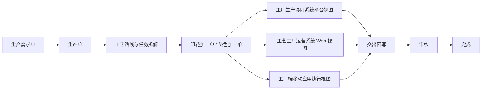

# FCS 工艺加工单统一说明

## 统一口径

印花加工单、染色加工单统一收口到 `ProcessWorkOrder`。工厂生产协同系统展示平台视角，工艺工厂运营系统展示工厂 Web 视角，工厂端移动应用只作为一线执行入口；三者读取同一个加工单 ID、加工单号、状态、任务引用和交出记录。

染色配方 / 染料配方是染色加工单下的子信息，染色报表是染色加工单执行过程的统计视图，不再作为与染色加工单并列的主对象。印花审核、印花执行进度也收口为印花加工单下的审核记录视图和执行进度视图。

## 中文流程图

生产需求单 -> 生产单 -> 工艺路线与任务拆解 -> 印花加工单 / 染色加工单 -> 工厂生产协同系统平台视图 / 工艺工厂运营系统 Web 视图 / 工厂端移动应用执行视图 -> 交出回写 -> 审核 -> 完成

## 入口边界

- 平台侧 `/fcs/process/print-orders` 和 `/fcs/process/dye-orders` 读取统一加工单，只展示平台关心字段。
- 工厂 Web 侧 `/fcs/craft/printing/work-orders` 和 `/fcs/craft/dyeing/work-orders` 读取同一批加工单，可展示专厂执行字段。
- Web 列表主按钮进入 Web 加工单详情页。
- 详情页内保留明确标识的“打开移动端执行页”和“打开移动端交出页”按钮，用于进入一线执行页面。
