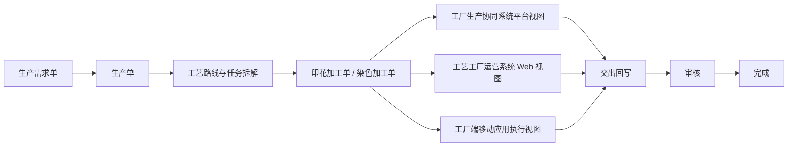

# FCS 工艺加工单统一说明

## 统一口径

印花加工单、染色加工单统一收口到 `ProcessWorkOrder`。工厂生产协同系统展示平台视角，工艺工厂运营系统展示工厂 Web 视角，工厂端移动应用只作为一线执行入口；三者读取同一个加工单 ID、加工单号、状态、任务引用和交出记录。

染色配方 / 染料配方是染色加工单下的子信息，染色报表是染色加工单执行过程的统计视图，不再作为与染色加工单并列的主对象。印花审核、印花执行进度也收口为印花加工单下的审核记录视图和执行进度视图。

## 中文流程图

生产需求单 -> 生产单 -> 工艺路线与任务拆解 -> 印花加工单 / 染色加工单 -> 工厂生产协同系统平台视图 / 工艺工厂运营系统 Web 视图 / 工厂端移动应用执行视图 -> 交出回写 -> 审核 -> 完成

## 入口边界

- 平台侧 `/fcs/process/print-orders` 和 `/fcs/process/dye-orders` 读取统一加工单，只展示平台关心字段。
- 工厂 Web 侧 `/fcs/craft/printing/work-orders` 和 `/fcs/craft/dyeing/work-orders` 读取同一批加工单，可展示专厂执行字段。
- Web 列表主按钮进入 Web 加工单详情页。
- 详情页内保留明确标识的“打开移动端执行页”和“打开移动端交出页”按钮，用于进入一线执行页面。
- 正式生产单生成后，系统按工艺自动生成对应的染色或印花加工单；未分配工厂时保留加工单并显示“待分配工厂”。按备货创建是另一条独立入口，不借用生产单或需求单身份。
- 不再保留独立染色需求单、印花需求单及“按需求单创建加工单”入口；内部工艺拆解明细只用于追踪，不成为新的业务单据。
- 平台加工单号是平台端、工厂 Web 和工厂移动端唯一加工单号。工厂端不得生成、录入或展示另一套“工厂加工单号”。

## 合并染色边界

- 合并染色是多张染色加工单的一次共同执行任务，不合并、拆分或改号原加工单；只允许生产单来源加工单参加。
- 染厂主管手工选择，同一任务只校验同一染厂、同一面料、同一目标颜色、同一工艺，不增加“可投缸”等额外限制。
- 创建时不填数量，成员立即锁定且不能增删；染色完成后一次填写实际投入总量和实际产出总量。
- 系统按生产单下单时间、生产单号依次分配产出。短产直接记为未满足并终止，不生成继续染、补染或多次投缸任务。
- 更正只允许修改实际投入、实际产出并填写原因，系统按原顺序重新分配，永久保留更正前后版本。
- 任务始终允许软删除。删除后释放当前任务占用，但执行、分配、更正和删除记录继续保留；原染色加工单身份和历史有效分配不变。
