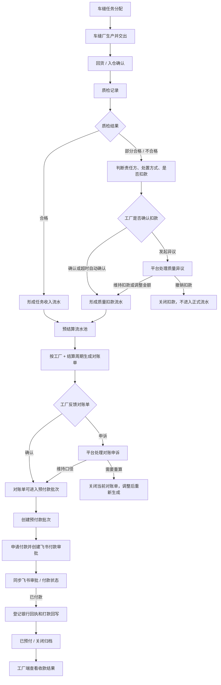

# 生产协同管理系统：车缝任务对账结算付款业务说明

## 1. 文档目的

本文说明当前生产协同管理系统里，车缝任务从完工回货到质检、扣款、正式流水、对账单、预付款批次、付款审批和打款回写的业务链路。

这份文档面向业务同事，重点说明“谁在什么时候看什么、确认什么、影响什么”，不展开系统代码字段。

## 2. 相关菜单入口

| 菜单 | 页面 | 业务用途 |
| --- | --- | --- |
| 质量与扣款 | 质检记录 | 记录回货后的质检结果，判断合格、不合格、责任方、处置方式和是否扣款。 |
| 质量与扣款 | 扣款分析 | 按工厂、工序、仓库、质检结果、异议状态、结算影响等维度查看扣款影响。 |
| 对账与结算 | 预结算流水 | 查看已经正式成立的任务收入流水和质量扣款流水。 |
| 对账与结算 | 对账单 | 以工厂和结算周期为单位生成正式对账对象，承接工厂确认或申诉。 |
| 对账与结算 | 预付款批次 | 将可付款的对账单组批，发起付款申请、同步飞书审批、登记打款回写。 |
| 对账与结算 | 车缝领料对账 | 记录车缝领料、退料和实耗相关的材料对账对象。当前阶段不进入本期应付结算生成。 |
| 工厂端移动应用 | 结算 | 工厂查看结算周期、质检扣款、正式流水、对账单、预付款和收款结果。 |

补充说明：当前“付款同步”和“历史”属于“预付款批次”的生命周期视图，不是独立主流程。

## 3. 总体业务流程图



## 4. 主链路说明

### 4.1 车缝完工与回货

车缝任务被分配后，车缝厂执行生产并交出。货品到达接收方后，需要有回货或入仓确认。

回货确认的作用是明确本次回来了多少、属于哪个生产单、哪个车缝任务、哪个工厂、哪个款式 SKU、颜色和尺码。这个结果是后续形成任务收入流水的来源。

### 4.2 质检记录

质检记录用于判断回货是否合格。

质检结果通常会分成三类：

- 合格：正常进入后续结算。
- 部分合格：合格部分可以继续流转，不合格部分需要记录原因、数量和责任。
- 不合格：需要记录问题、数量、责任方、处置方式，并判断是否扣款。

对于车缝回货入仓质检，若质检不合格，业务上必须明确：

- 责任方是谁。
- 不合格品如何处理。
- 是否扣款。
- 如果扣款，扣多少。
- 如果不扣款，为什么不扣。

### 4.3 扣款处理

扣款不是质检一提交就直接进入付款扣减。当前系统把它分成几个阶段：

1. 质检发现问题，形成待确认的质量扣款记录。
2. 工厂确认扣款，或超过确认时限后系统自动确认。
3. 如果工厂有异议，进入平台处理。
4. 平台处理结果可能是维持扣款、调整扣款金额，或撤销扣款。
5. 只有确认或裁决完成后的扣款，才会变成正式质量扣款流水。

这意味着：有异议、未确认、未裁决的扣款，不应该提前进入对账单。

### 4.4 预结算流水

预结算流水是正式流水池，当前承接两类结果：

- 任务收入流水：来自车缝任务回货确认和对应价格口径。
- 质量扣款流水：来自已经成立的质量扣款结果。

预结算流水不是给工厂确认的主单据，它主要用于追溯和汇总，说明每笔金额从哪里来、属于哪个工厂、哪个结算周期、当前有没有进入对账单或预付款批次。

### 4.5 对账单

对账单是业务同事最应该关注的正式对账主单据。

一张对账单对应一个工厂在一个结算周期内的正式对账口径。生成对账单时，系统会把该范围内可入单的正式流水汇总到同一张单中。

对账单里会区分：

- 任务收入流水合计。
- 质量扣款流水合计。
- 本期应付净额。
- 结算资料快照。
- 工厂确认或申诉状态。
- 后续预付款批次状态。

当前主口径：

```text
本期应付净额 = 任务收入流水合计 - 质量扣款流水合计
```

对账单下发后，工厂可以确认，也可以申诉。平台处理申诉后：

- 如果维持当前口径，对账单继续进入预付款批次。
- 如果需要重算，对账单关闭，调整后重新生成。

### 4.6 预付款批次

预付款批次用于执行付款，不再讨论本期金额是怎么计算出来的。

只有已经达到可入批条件的对账单，才能进入预付款批次。进入批次后，财务继续完成：

1. 创建预付款批次。
2. 申请付款。
3. 创建或同步飞书付款审批。
4. 飞书审批通过并付款后，登记银行回执和银行流水。
5. 完成打款回写。
6. 关闭归档，供历史查看。

预付款批次的重点是“付款执行状态”，不是“对账口径是否正确”。对账口径问题应该在对账单阶段解决。

### 4.7 工厂端结算查看

工厂端移动应用的结算页是工厂视角的消费端。

工厂可以查看：

- 当前结算周期。
- 质检扣款记录。
- 正式流水。
- 对账单状态。
- 预付款批次状态。
- 打款结果。
- 收款资料版本。

工厂端不能直接创建预付款批次、发起付款、登记打款回写，这些动作属于平台和财务侧。

## 5. 状态关系

### 5.1 质检扣款状态

```mermaid
stateDiagram-v2
  [*] --> "质检完成"
  "质检完成" --> "无扣款影响": "合格或不扣款"
  "质检完成" --> "待工厂确认扣款": "不合格且建议扣款"
  "待工厂确认扣款" --> "正式质量扣款流水": "工厂确认"
  "待工厂确认扣款" --> "正式质量扣款流水": "超时自动确认"
  "待工厂确认扣款" --> "质量异议处理中": "工厂发起异议"
  "质量异议处理中" --> "正式质量扣款流水": "平台维持或调整"
  "质量异议处理中" --> "关闭扣款": "平台撤销"
  "正式质量扣款流水" --> [*]
  "关闭扣款" --> [*]
  "无扣款影响" --> [*]
```

### 5.2 对账付款状态

```mermaid
stateDiagram-v2
  [*] --> "待入对账单"
  "待入对账单" --> "对账单草稿": "平台生成对账单"
  "对账单草稿" --> "待工厂反馈": "下发工厂"
  "待工厂反馈" --> "待入预付款": "工厂确认"
  "待工厂反馈" --> "对账申诉处理中": "工厂申诉"
  "对账申诉处理中" --> "待入预付款": "平台维持口径"
  "对账申诉处理中" --> "已关闭": "需要调整重算"
  "待入预付款" --> "已入预付款批次": "财务组批"
  "已入预付款批次" --> "飞书审批中": "申请付款"
  "飞书审批中" --> "已付款待回写": "飞书已付款"
  "已付款待回写" --> "已预付": "登记打款回写"
  "已预付" --> "已关闭": "关闭归档"
  "已关闭" --> [*]
```

## 6. 关键业务规则

1. 对账单是业务主单据，预结算流水是来源池和追溯池。
2. 一张对账单只对应一个工厂、一个结算周期。
3. 同一工厂同一结算周期存在未关闭对账单时，不能重复生成新对账单。
4. 待确认扣款、异议中扣款、未最终裁决扣款，不进入正式流水，也不进入对账单。
5. 预付款批次只消费已经达到可入批条件的对账单。
6. 工厂申诉中、平台处理中、已关闭或需要重算的对账单，不得进入预付款批次。
7. 预付款批次负责申请付款、飞书审批、付款同步、打款回写和历史归档。
8. 飞书显示已付款后，还需要登记银行回执和银行流水，才算完成系统内打款回写。
9. 对账单和预付款批次会沿用生成时的结算资料快照；后续修改工厂收款资料或结算规则，只影响未来新单据。
10. 车缝领料对账当前只作为材料对账对象管理，暂不进入本期应付结算生成。

## 7. 业务角色分工

| 角色 | 主要动作 | 关注点 |
| --- | --- | --- |
| 车缝厂 | 完成生产、交出货品、查看质检和对账结果 | 回货数量、质检结果、扣款原因、应收金额、付款状态。 |
| 质检人员 | 完成回货质检，记录合格数量、不合格数量和原因 | 质检结果要能支撑责任判定和扣款依据。 |
| 平台运营 / 跟单 | 跟进任务回货、质检异常、对账单下发和申诉处理 | 不让未确认或有争议的扣款提前进入对账。 |
| 财务 | 创建预付款批次、申请付款、同步飞书状态、登记打款回写 | 入批对象是否合规、付款金额和银行流水是否完整。 |
| 工厂端用户 | 查看结算周期、确认或申诉对账单、查看收款结果 | 对账口径是否认可、扣款是否认可、付款是否到账。 |

## 8. 异常场景说明

| 场景 | 系统应如何处理 |
| --- | --- |
| 质检合格 | 不产生质量扣款流水，回货对应的任务收入可进入正式流水。 |
| 质检不合格但不扣款 | 记录不扣款说明，不形成质量扣款流水。 |
| 工厂对扣款有异议 | 进入质量异议处理，异议未结束前不进入正式流水。 |
| 平台撤销扣款 | 扣款关闭，不进入预结算流水和对账单。 |
| 对账单被工厂申诉 | 对账单暂停进入预付款批次，等待平台处理。 |
| 对账申诉后需要重算 | 关闭当前对账单，调整来源后重新生成。 |
| 飞书审批被驳回或取消 | 预付款批次不能继续打款回写，需要重新处理付款申请。 |
| 飞书已付款但未回写 | 停留在已付款待回写，需要财务登记银行回执和流水。 |
| 工厂收款资料后续变更 | 已生成对账单和批次不自动改口径，只影响后续新单据。 |

## 9. 当前业务口径总结

当前系统围绕车缝任务的结算付款主链路可以概括为：

```text
车缝回货确认
-> 质检
-> 质量扣款确认 / 异议处理
-> 任务收入流水 + 质量扣款流水
-> 对账单
-> 工厂确认 / 申诉
-> 预付款批次
-> 飞书付款审批
-> 打款回写
-> 工厂端查看收款结果
```

业务同事判断这套功能是否完整时，可以按三个问题检查：

1. 金额从哪里来：任务收入来自车缝回货，扣款来自已成立的质量扣款。
2. 金额在哪里确认：对账单是工厂确认或申诉的主单据。
3. 钱在哪里执行：预付款批次负责申请付款、飞书审批、付款同步和打款回写。
