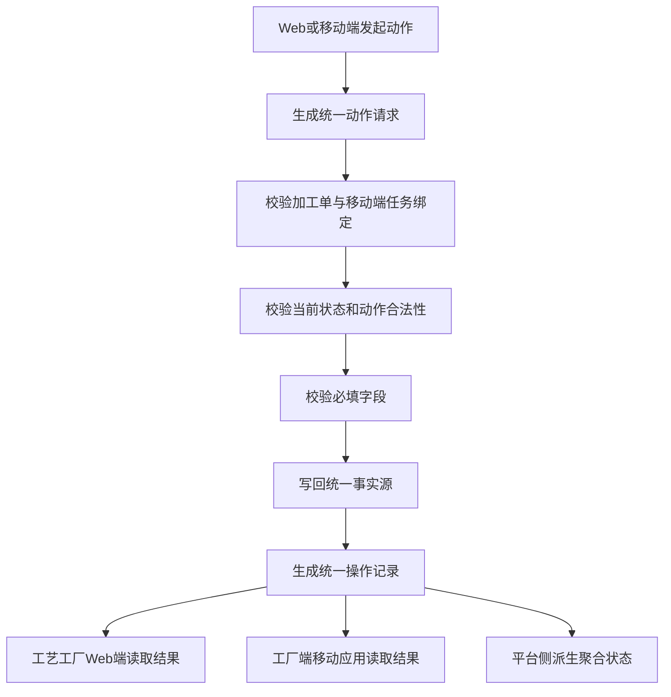
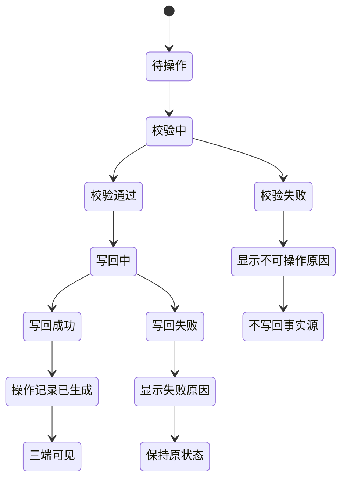

# FCS 移动端与 Web 端共用写回函数

## 本轮接入范围

本轮将工艺工厂运营系统 Web 端和工厂端移动应用的状态操作收口到统一写回服务：

- 统一写回服务：`src/data/fcs/process-action-writeback-service.ts`
- Web 端薄封装：`src/data/fcs/process-web-status-actions.ts`
- 移动端薄封装：`executeMobileProcessAction`
- 统一操作记录：`ProcessActionOperationRecord`

覆盖工艺：

- 印花：开始打印、完成打印、开始转印、完成转印、发起交出等。
- 染色：排染缸、开始染色、完成染色、完成包装、发起交出等。
- 裁片：开始铺布、完成铺布、开始裁剪、完成裁剪、生成菲票、发起交出等。
- 特殊工艺：开始加工、完成加工、上报差异、发起交出等。

## 中文流程图

## 中文状态机

## 共用规则

1. Web 端和移动端共用 actionCode，例如 `PRINT_START_PRINTING`、`DYE_START_DYEING`、`CUTTING_START_SPREADING`、`SPECIAL_CRAFT_START_PROCESS`。
2. Web 端和移动端共用 `executeProcessAction`。
3. Web 端使用 `executeProcessWebAction` 作为薄封装，只补充 `sourceChannel = Web 端`。
4. 移动端使用 `executeMobileProcessAction` 作为薄封装，只补充 `sourceChannel = 移动端`。
5. Web 端和移动端写回同一事实源。
6. Web 端和移动端操作记录共用同一模型，并用 `sourceChannel` 区分来源。
7. 平台侧通过统一状态映射派生聚合状态，不读取页面局部状态。

## 操作记录字段

统一操作记录包含：

- `operationRecordId`
- `sourceChannel`
- `sourceType`
- `sourceId`
- `taskId`
- `actionCode`
- `actionLabel`
- `previousStatus`
- `nextStatus`
- `operatorName`
- `operatedAt`
- `objectType`
- `objectQty`
- `qtyUnit`
- `remark`
- `evidenceUrls`
- `relatedWarehouseRecordId`
- `relatedHandoverRecordId`
- `relatedReviewRecordId`
- `relatedDifferenceRecordId`

## 禁止口径

- 不提供自由状态下拉框。
- 不允许跳过加工单与移动端任务绑定校验。
- 不允许跳过动作合法性校验。
- 不允许校验失败后写回事实源。
- 不允许校验失败后生成操作记录。
- 不允许 Web 端只改 Web 数据。
- 不允许移动端只改 PDA 数据。
- 不允许把合并裁剪批次作为菲票归属主体。
- 不允许新增开扣眼、装扣子、熨烫、包装作为特殊工艺动作。
