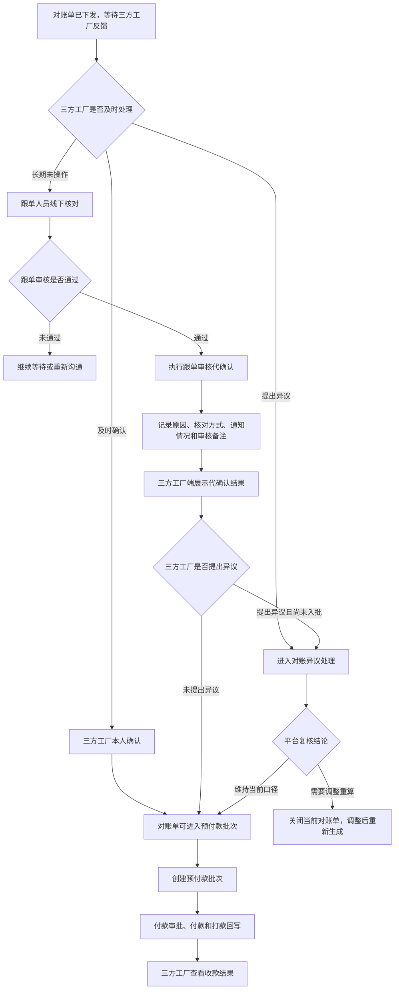
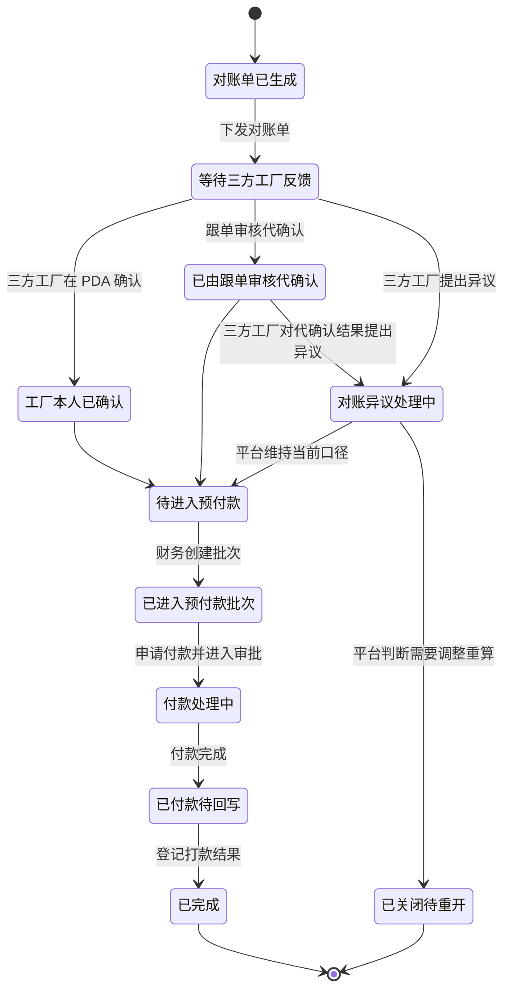
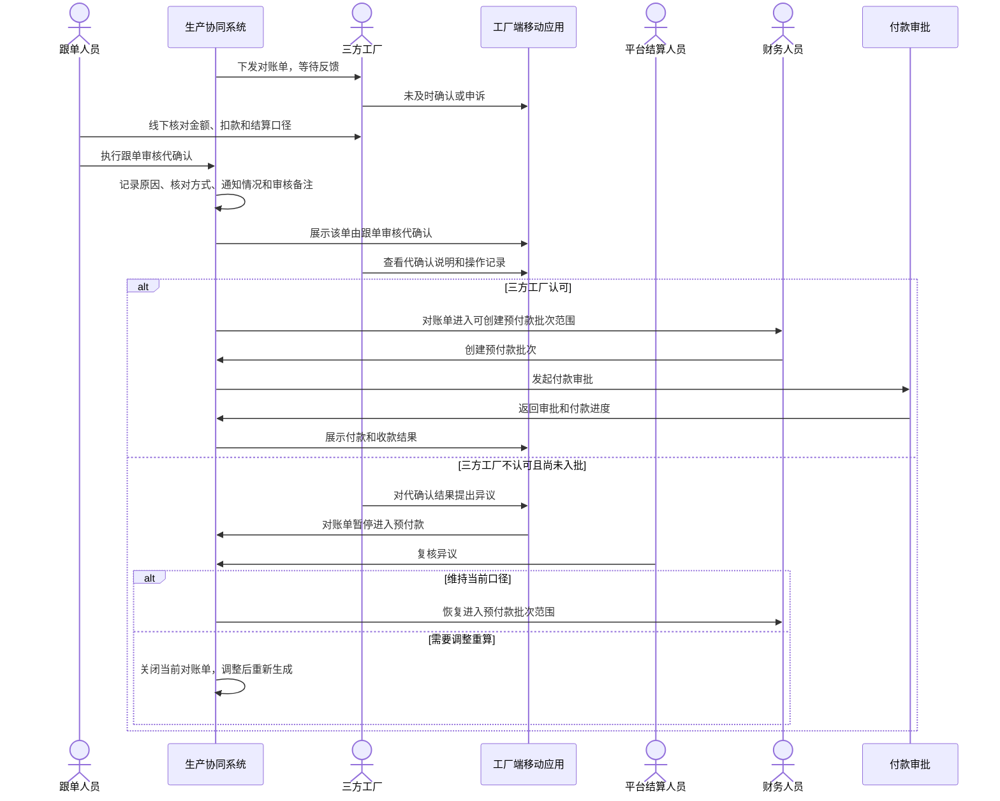

# 跟单审核代确认业务调整说明

## 1. 文档目的

本文说明生产协同系统和工厂端移动应用在对账、结算、预付款链路中新增“跟单审核代确认”后的业务变化。

本次调整的核心不是把三方工厂确认伪装成已确认，而是在三方工厂长期不操作工厂端移动应用时，允许跟单人员在完成线下核对和内部审核后，代表流程推进对账单，同时让三方工厂清楚看到该单是“跟单审核代确认”，并保留查看记录和提出异议的入口。

## 2. 业务结论

1. “跟单审核代确认”是一个独立业务动作，不等同于“三方工厂本人确认”。
2. 只有已经下发并等待三方工厂反馈的对账单，才允许跟单人员执行该动作。
3. 跟单人员执行代确认时，必须说明代确认原因、线下核对方式、通知三方工厂情况和审核备注。
4. 系统必须留下操作记录，生产协同系统和工厂端移动应用都要能看到。
5. 代确认完成后，对账单可以继续进入预付款批次。
6. 三方工厂在对账单尚未进入预付款批次前，仍可以对代确认结果提出异议。
7. 三方工厂提出异议后，对账单暂停进入预付款，等待平台复核。

## 3. 适用范围

| 范围 | 调整内容 |
| --- | --- |
| 生产协同系统 Web 端 | 跟单人员可在待反馈对账单上执行“跟单审核代确认”，并查看代确认结果、通知情况和操作记录。 |
| 工厂端移动应用 PDA 端 | 三方工厂可看到对账单由跟单审核代确认，并查看原因、通知情况和操作记录。 |
| 对账单 | 新增“由跟单审核代确认后继续流转”的业务路径。 |
| 预付款批次 | 可接收已由跟单审核代确认的对账单，并在候选和明细中保留确认来源。 |
| 质检扣款与正式流水 | 不改变金额来源和扣款依据，只承接既有正式对账口径。 |
| 付款审批与打款回写 | 不改变付款执行流程，仍按预付款批次继续申请付款、审批、付款和回写。 |

## 4. 角色分工

| 角色 | 负责事项 | 必须看到或留下的内容 |
| --- | --- | --- |
| 跟单人员 | 线下核对对账单，完成审核后执行“跟单审核代确认”。 | 代确认原因、线下核对方式、通知情况、审核备注。 |
| 三方工厂 | 在 PDA 端查看对账结果、代确认说明、操作记录，并在有异议时反馈。 | 明确看到“不是工厂本人确认”，可查看跟单人员、时间、原因和通知情况。 |
| 平台结算人员 | 处理三方工厂对代确认结果提出的异议。 | 异议原因、复核结论、是否恢复流转或重开对账。 |
| 财务人员 | 按可入批对账单创建预付款批次并继续付款。 | 对账单是否已达到可入批条件，以及确认来源是否清楚。 |

## 5. Web 端调整

### 5.1 对账单列表和详情

生产协同系统 Web 端需要在对账单列表、详情和生命周期动作区展示以下业务信息：

- 对账单当前是否由三方工厂本人确认。
- 对账单是否由跟单审核代确认。
- 代确认的跟单人员、时间、原因、线下核对方式、通知三方工厂情况。
- 当前是否存在三方工厂异议。
- 当前是否已经可以进入预付款批次。

### 5.2 跟单审核代确认动作

跟单人员点击“跟单审核代确认”时，需要完成以下确认内容：

- 已经线下核对过对账单金额和扣款口径。
- 说明为什么需要代确认，例如三方工厂长期未操作 PDA。
- 说明通过什么方式与三方工厂沟通过，例如电话、飞书、微信、现场沟通或其他线下方式。
- 记录是否已经通知三方工厂。
- 填写审核备注，便于后续追溯。

完成后，系统将对账单推进到可进入预付款的阶段，并留下操作记录。

### 5.3 操作记录

Web 端需要展示完整操作记录，至少覆盖：

- 谁执行了跟单审核代确认。
- 在什么时间执行。
- 为什么执行。
- 通过什么方式完成线下核对。
- 是否通知三方工厂。
- 对账单从哪个阶段进入哪个阶段。
- 三方工厂后续是否提出异议。
- 平台是否完成复核。

## 6. PDA 端调整

### 6.1 结算周期总览

工厂端移动应用需要在结算周期总览中提示：该周期内是否存在由跟单审核代确认的对账单。三方工厂不进入详情，也能先知道当前周期存在被代确认的对账结果。

### 6.2 对账单列表和详情

PDA 端对账单列表和详情必须清楚展示：

- 该对账单已由跟单审核代确认。
- 这不是三方工厂本人在 PDA 上确认。
- 跟单人员、确认时间、代确认原因、通知情况。
- 三方工厂可见的操作记录。
- 在尚未进入预付款批次前，三方工厂可以对代确认结果提出异议。

### 6.3 三方工厂可见记录

PDA 端不能只显示结果，还要显示可追溯过程。三方工厂应能看到：

- 跟单审核代确认记录。
- 三方工厂提出异议记录。
- 平台复核记录。
- 对账单是否因此暂停进入预付款。

## 7. 业务流程图

## 8. 状态图

## 9. 时序图

## 10. 正向业务逻辑

### 10.1 前置条件

跟单审核代确认只能发生在以下场景：

1. 对账单已经生成并下发给三方工厂。
2. 对账单仍在等待三方工厂反馈。
3. 当前没有正在处理的对账异议。
4. 对账单尚未进入预付款批次。
5. 跟单人员已经完成线下核对，并能说明代确认原因。

### 10.2 成功后结果

跟单审核代确认完成后：

1. 对账单进入可创建预付款批次的范围。
2. Web 端展示该单由跟单审核代确认。
3. PDA 端展示该单不是三方工厂本人确认。
4. 操作记录同时面向平台和三方工厂可见。
5. 后续预付款批次中继续保留确认来源，财务可以识别。

## 11. 逆向流程和异常流程

| 场景 | 处理方式 | 业务结果 |
| --- | --- | --- |
| 跟单未填写代确认原因 | 不允许完成代确认。 | 对账单继续等待三方工厂反馈。 |
| 跟单未记录线下核对方式 | 不允许完成代确认。 | 避免后续无法追溯。 |
| 通知三方工厂失败 | 可以记录失败结果，但必须继续展示给三方工厂并由业务补通知。 | 对账单可以继续流转，但操作记录要保留通知失败事实。 |
| 对账单已有三方工厂异议 | 不允许再执行跟单审核代确认。 | 进入平台复核流程。 |
| 代确认后，三方工厂在入批前提出异议 | 对账单暂停进入预付款。 | 平台复核后决定恢复流转或重新生成。 |
| 平台复核后维持当前口径 | 对账单恢复进入预付款范围。 | 财务可继续创建预付款批次。 |
| 平台复核后需要调整重算 | 当前对账单关闭。 | 调整金额来源后重新生成对账单。 |
| 代确认后已进入预付款批次，三方工厂再反馈不认可 | 不自动回退已进入付款链路的单据。 | 由平台和财务评估暂停付款、关闭批次、补差、冲减或重开对账。 |
| 财务已付款后发现代确认争议 | 不直接修改已付款结果。 | 通过后续补差、冲减或重新对账处理。 |
| 重复执行跟单审核代确认 | 不允许重复推进。 | 保留第一次有效操作记录。 |

## 12. 上下游影响

### 12.1 上游：质检扣款和正式流水

跟单审核代确认不改变金额来源。对账单里的收入、扣款和净额仍来自已经成立的结算口径。未确认、异议中或尚未裁决的扣款不能因为代确认而提前进入对账。

### 12.2 当前环节：对账单

对账单是本次调整的核心对象。新增路径后，对账单有三种主要反馈结果：

1. 三方工厂本人确认。
2. 三方工厂提出异议。
3. 跟单审核代确认。

三种结果必须可区分，不能在页面上混成同一种“已确认”。

### 12.3 下游：预付款批次

预付款批次可以接收已由跟单审核代确认的对账单，但必须保留确认来源。财务在候选对账单和批次明细中应能识别该单是三方工厂本人确认，还是跟单审核代确认。

### 12.4 付款审批与打款回写

进入预付款批次后，付款审批、付款同步、银行回执和打款回写仍按原流程执行。跟单审核代确认只影响对账单是否可以进入预付款，不改变付款审批职责。

### 12.5 工厂端移动应用

PDA 端承担告知和反馈职责。三方工厂必须能看见代确认事实、原因和记录，也必须在尚未进入付款链路前保留异议入口。

## 13. 页面验收标准

### 13.1 Web 端

| 验收项 | 通过标准 |
| --- | --- |
| 待反馈对账单动作入口 | 只有符合条件的对账单出现“跟单审核代确认”。 |
| 代确认信息填写 | 必须填写代确认原因和线下核对方式，并记录通知情况。 |
| 代确认完成结果 | 对账单进入可创建预付款批次范围。 |
| 确认来源展示 | 页面明确展示“跟单审核代确认”，不与三方工厂本人确认混淆。 |
| 操作记录 | Web 端能看到跟单、时间、原因、核对方式、通知情况和阶段变化。 |
| 异议暂停提示 | 三方工厂对代确认结果提出异议后，Web 端提示该单暂停进入预付款。 |
| 预付款批次识别 | 财务在候选和批次明细中能看到确认来源。 |

### 13.2 PDA 端

| 验收项 | 通过标准 |
| --- | --- |
| 周期总览提醒 | 结算周期内存在代确认对账单时，PDA 端有明显提示。 |
| 对账单列表展示 | 列表中可识别该单已由跟单审核代确认。 |
| 对账单详情展示 | 详情中清楚说明不是三方工厂本人确认。 |
| 可见操作记录 | 三方工厂能看到代确认、异议和平台复核记录。 |
| 异议入口 | 尚未进入预付款批次前，三方工厂可以对代确认结果提出异议。 |
| 异议后提示 | 提出异议后，PDA 端提示平台处理前该单不会继续进入预付款。 |

### 13.3 业务链路

| 验收项 | 通过标准 |
| --- | --- |
| 上游金额口径 | 代确认不改变收入、扣款和净额来源。 |
| 对账主单据 | 对账单能区分工厂确认、工厂异议和跟单审核代确认。 |
| 预付款入批 | 跟单审核代确认后，对账单可进入预付款批次。 |
| 异议拦截 | 代确认后被三方工厂异议的对账单不能继续入批。 |
| 平台复核 | 维持当前口径后恢复流转，需要调整时关闭并重新生成。 |
| 工厂知情 | PDA 端能明确看到代确认事实和追溯记录。 |

## 14. 最终口径

本次调整后的业务口径可以概括为：

三方工厂不及时操作 PDA 时，跟单人员可以在完成线下核对和内部审核后执行“跟单审核代确认”，系统据此推进对账单进入预付款链路；但系统必须明确告知三方工厂该结果不是工厂本人确认，并保留原因、通知情况、操作记录和入批前异议入口。

因此，“跟单审核代确认”的目标是解决对账推进效率问题，不是消除三方工厂的知情权和异议权。
