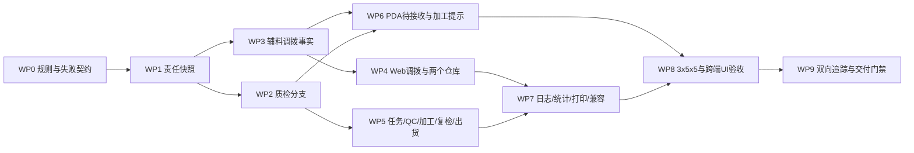

# 三方车缝责任与后道辅料调拨实施计划

> 对应总体方案：`docs/product-design/2026-09-03-三方车缝责任与后道辅料调拨完整调整方案.md`
> 对应追踪矩阵：`docs/requirement-traceability/2026-09-03-三方车缝责任与后道辅料调拨矩阵.md`
> 当前状态：待实施。本计划是执行依据，不是完成证明。

## 1. 实施目标与完成标准

在不重构现有后道工厂管理技术和页面骨架的前提下，完成以下闭环：

1. 三种上游任务类型冻结为生产单级后道责任，并传递到每次回货及其下游单据。
2. 质检默认项目、可编辑性和完成去向由责任模式驱动。
3. 仅车缝生产单关联一张后道辅料主调拨单；后道 Web 可查看进度，PDA 可整单一次性入库。
4. 待加工仓以独立页签管理辅料库存，待交出仓继续只管理成衣。
5. 辅料未到只提示不阻断；漏做补加工不进入系统补料流程。
6. 3 个生产单、每单 5 个 SKU、每单 5 次回货的 15 条链覆盖三种责任和全部关键边界。
7. 最后一次实质修改后，自动化、Web、PDA、图片、大图、打印和治理证据全部重新生成。

只有追踪矩阵中没有无说明的“待实施、实施中、已实现待验证、已阻塞”，并且适用证据绑定当前 Git 版本，才可声明 `verified`。本地原型验证不等于生产部署、真实设备或打印机验收。

## 2. 实施范围与禁止扩展

### 2.1 本次改动范围

- 后道共享事实、责任投影、质检分支、辅料调拨单和辅料库存 Mock。
- 后道生产任务、质检单/工作台、后道加工单、复检单、两个仓库、出货单、日志、统计的增量展示。
- 后道工厂 PDA 的待接收辅料入库、后道加工提示、复检来源和已交出同源展示。
- 后道专项契约、浏览器验收、3×5×5 全流程数据和交付文档。

### 2.2 明确不改

- PPIC 分配任务的操作页面。
- 辅料仓创建、审核、拣货和待调拨操作页面。
- 车缝配料清单页面。
- 成衣仓扫描后道出货单收货页面。
- 真实后端、数据库、接口、权限系统和离线机制。
- 现有前端技术栈、全局外壳及主要路由。

## 3. 实施依赖顺序

WP1 是所有页面的事实基础；WP2 与 WP3 可以在不同文件中实施，但合入前必须由同一责任快照驱动。不得先在页面里散落判断，再回头补共享事实。

## 4. 工作包

### WP0：冻结业务规则并建立失败契约

**负责需求：** `SCOPE-*`、`RESP-*`、`QC-*`、`MAT-RULE-*`。

**业务目标**

把已经确认的三类责任、默认项目、可编辑性、物料识别、一次性入库和“只提示不阻断”变成可直接失败的专项契约，防止旧代码和旧测试继续把所有质检都推向后道加工。

**文件/符号**

- `scripts/` 中现有后道全流程与管理页专项检查。
- `tests/` 中后道 Web/PDA/角色边界与跨端 Playwright。
- 新增最小的责任和调拨业务契约文件时，沿用当前脚本命名和断言方式。

**修改**

1. 先增加三种任务类型到责任模式的断言。
2. 增加仅车缝固定三项、其余两类默认空集合的断言。
3. 增加“空项目直达复检、有项目生成加工单”的失败断言。
4. 增加标题关键词、`FLBF` 前缀和纸样关联的物料识别断言。
5. 增加主调拨单唯一、禁止部分入库、无授权字段、重复确认幂等的断言。
6. 增加“未入库仍允许开始加工”的断言。
7. 将旧的“质检总会创建加工单”断言标记为待更新对象，不为让旧测试继续通过而保留错误逻辑。

**验证证据**

首次运行应明确暴露当前缺口；保留失败条目与最终转绿结果。测试必须验证业务结果，不只搜索文案。

**完成条件**

所有新增契约分别对应矩阵原子需求，且旧冲突断言已经定位，不存在同一规则两种相反预期。

### WP1：建立生产单级责任快照

**负责需求：** `RESP-001` 至 `RESP-008`、`CHAIN-001`。

**业务目标**

让后道全过程只读取一个生产单级责任事实，并在历史链中冻结，不允许页面自行推断或修改。

**文件/符号**

- `src/data/fcs/task-fulfillment-policy.ts`
- `src/data/fcs/merged-production-task.ts`
- `src/data/fcs/post-finishing-full-flow.ts`
- `src/data/fcs/post-finishing-domain.ts`

**修改**

1. 复用现有任务分类，增加最小 `PostFinishingResponsibilitySnapshot`。
2. 快照保存上游类型、后道责任、默认项目、是否可编辑、来源和冻结时间。
3. 创建后道生产任务时生成快照；回货、质检和下游单据只引用或复制该冻结值。
4. 同一生产单出现多种上游任务类型时返回明确数据错误，不提供后道修改入口。
5. 历史数据按已有任务类型补投影；无法判断的显示“历史责任未标记”，不自动当作仅车缝。
6. 对仍读取旧领域模型的页面只增加适配字段，禁止借机重写 `post-finishing-domain.ts`。

**验证证据**

- 三类上游类型映射契约。
- 同生产单多次回货责任一致契约。
- 历史已完成链不因新默认规则被改写的兼容契约。

**完成条件**

Web/PDA 不再各自判断任务类型；修改一处责任来源即可让所有下游读取相同结果。

### WP2：修正质检默认项目与完成分支

**负责需求：** `QC-001` 至 `QC-012`、`CHAIN-002` 至 `CHAIN-005`。

**业务目标**

在保留现有两栏质检工作台和逐 SKU 表单的基础上，让任务责任准确决定质检后是否创建后道加工单。

**文件/符号**

- `src/data/fcs/post-finishing-full-flow.ts`
  - `getOrCreateQcTaskForConfirmedDelivery`
  - `completePostFinishingQcTask`
  - `createRecheckOrder`
- `src/data/fcs/post-finishing-domain.ts`
  - `normalizePostProjectJudgements`
  - `buildPostProjectLinesFromQc`
  - `buildDirectRecheckFromQc`
  - `completePostFinishingQcOrder`
- `src/pages/process-factory/post-finishing/qc-orders.ts`
- `src/pages/process-factory/post-finishing/qc-workbench.ts`
- 对应事件处理器和专项测试。

**修改**

1. 质检任务继承责任快照。
2. 仅车缝：初始化三个项目且锁定；提交时即使前端载荷缺项，也按冻结规则校验，不能取消。
3. 两类包含烫包任务：初始化空集合，允许质检员选一项或多项漏做项目。
4. 提交空集合时直接创建复检单，不创建占位加工单。
5. 提交非空集合时只按所选项目创建一张加工单。
6. 完成按钮随当前分支显示明确结果文案。
7. 已完成质检展示冻结结果，不按当前上游任务重新计算。
8. 保留瑕疵原因汇总、返工工厂条件显示、单质检员领取和退领，不夹带表单重构。

**验证证据**

- 责任默认值和锁定/可编辑契约。
- 空集合直达复检、非空集合建加工单、加工项目精确集合契约。
- Web 两栏工作台浏览器证据。
- 领取、退领、瑕疵汇总、返工条件相邻回归。

**完成条件**

三种责任共至少六条质检记录分别证明默认值、可编辑性和完成去向；旧“总建加工单”断言全部消除。

### WP3：建立后道辅料主调拨单与库存投影

**负责需求：** `MAT-RULE-*`、`MAT-ORDER-*`、`MAT-STOCK-*`。

**业务目标**

仅为“仅车缝”生产单形成一张可追踪的后道辅料主调拨单，并把整单入库结果投影为后道待加工仓的独立辅料库存。

**文件/符号**

- `src/data/fcs/post-finishing-full-flow.ts` 或同目录一个小型 `post-finishing-material-transfer.ts`。
- 当前生产单技术包/BOM/纸样数据定义。
- `src/data/fcs/post-finishing-document-numbering.ts`
- `src/data/fcs/post-finishing-operation-log.ts`

**修改**

1. 建立纯函数识别纸样关联，兼容 BOM 正向和纸样文件反向关系。
2. 建立纯函数识别仅车缝任务中的后道专用辅料：标题关键词或物料 SPU 前缀。
3. 创建主调拨单头、明细、状态时间线和一次性入库事实。
4. 一个生产单只能有一张主调拨单；重复同步时更新同一单据状态，不新建补充单。
5. 调出方实际配料数量成为后道应收和入库数量。
6. 只有待入库可确认；确认时全部明细同一批次写入；不接收行级数量载荷。
7. 重复确认不重复入账，返回原入库事实。
8. 生成辅料库存和流水，数量与物料单位分开保存，不混用“件”。
9. 不引入授权码、差异方向、部分入库和补料状态。

**验证证据**

- 物料识别表驱动测试。
- 纸样关联双向测试。
- 主调拨唯一、状态顺序、整单入库、重复提交幂等、库存守恒测试。
- 证明调拨数据不进入成衣回货 ±5% 授权函数。

**完成条件**

一个仅车缝生产单可从待入库一次性生成逐物料库存；其他两类生产单不存在后道主调拨单。

### WP4：新增 Web 调拨页并增量调整两个仓库

**负责需求：** `WEB-TRANSFER-*`、`WH-PROCESS-*`、`WH-HANDOVER-*`、`IMG-*`。

**业务目标**

让管理人员查看调出方进度和辅料库存，同时保持当前线上式待加工仓、待交出仓不被重做。

**文件/符号**

- `src/app-shell-config.ts`
- `src/router/routes-fcs.ts`
- `src/router/route-renderers-fcs.ts`
- 新增 `src/pages/process-factory/post-finishing/material-transfers.ts`
- `src/pages/process-factory/post-finishing/warehouse.ts`
- `src/components/ui/` 中已有标准列表、弹窗、表格、分页和图片大图能力。

**修改**

1. 在后道生产任务之后新增“后道辅料调拨单”菜单和路由。
2. 用标准列表组件实现摘要、筛选、分页、详情和状态时间线；不复制一整套页面框架。
3. 待加工仓保留标题、默认库存、四卡、现有四个页签、筛选、成衣表格和分页。
4. 在现有页签末尾增加“辅料库存”，激活后才切换辅料摘要、筛选和物料表格。
5. 成衣与辅料分开统计、分开单位、分开流水；共享仓库归属，不混排行。
6. 待交出仓不加辅料页签，只在成衣库存详情增加“质检直达/后道后复检”来源。
7. 每个款式/物料实图与对象同块展示，支持大图、遮罩、关闭、Esc 和失败态。
8. 在 1366×768 保持默认页面与当前线上式布局一致，禁止为新功能移动已有主区块。

**验证证据**

- 菜单、路由、标准列表治理契约。
- 待加工仓默认态前后视觉对比；辅料页签独立统计和列表证据。
- 待交出仓无辅料行/调拨动作的负向证据。
- 图片逐对象、大图和失败态证据。

**完成条件**

不打开新页签时两个仓库保持原有视觉与业务；辅料能力只有在明确入口中出现。

### WP5：增量调整任务、加工、复检、出货、质检相关 Web 页面

**负责需求：** `WEB-TASK-*`、`WEB-QC-*`、`WEB-WORK-*`、`WEB-DOWNSTREAM-*`。

**业务目标**

让管理端在现有单据页面看懂责任、去向、辅料状态和链路来源，不增加重复操作入口。

**文件/符号**

- `src/pages/process-factory/post-finishing/tasks.ts`
- `qc-orders.ts`
- `qc-workbench.ts`
- `work-orders.ts`
- `work-order-detail.ts`
- `recheck-orders.ts`
- `outbound-orders.ts`

**修改**

1. 任务列表/关联弹窗增加任务范围、后道责任和调拨状态。
2. 质检单列表增加项目规则和完成去向。
3. 加工单增加辅料状态提醒；提醒不禁用开始按钮。
4. 漏做补加工标记为“质检补加工”，不显示系统补料动作。
5. 复检显示“质检直达”或“后道加工后”；无加工单时显示“不适用”。
6. 出货单保持一张复检单一张出货单和完整链路。
7. 不在非质检页面重新出现“打印质检单/打印质检单详情”按钮。

**验证证据**

- 标准列表与详情契约。
- 开始后道弹窗“关闭/核对无误”相邻回归。
- 无后道加工单的直达链详情证据。
- 一复检一出货唯一性契约。

**完成条件**

每个相关页面只增加本页面需要理解的责任信息，未出现新的重复入口或整页改版。

### WP6：后道 PDA 辅料入库与执行提示

**负责需求：** `PDA-BOUNDARY-*`、`PDA-TRANSFER-*`、`PDA-WORK-*`、`PDA-RECHECK-*`。

**业务目标**

在现有后道 PDA 的“交接”和“执行”中增加最短现场路径，不增加新的底部模块。

**文件/符号**

- `src/pages/pda-handover.ts`
- `src/pages/pda-handover-detail.ts`
- `src/pages/pda-post-finishing-flow.ts`
- `src/pages/pda-exec.ts`
- 必要的现有 PDA 事件处理器。

**修改**

1. “待接收”内将成衣回货和后道辅料分组；保持“已交出”和车缝自助回货。
2. 辅料只列待入库主调拨单；完整扫描/输入后展示全部物料实图和实际配料数量。
3. 只提供整单确认入库，二次确认后一次写入；不提供行级编辑、部分接收、差异授权和补料。
4. 加工页显示任务范围、冻结项目和辅料状态；未到料时黄色提示但按钮可用。
5. 漏做补加工不显示物料流程。
6. 复检显示来源，继续执行数量差异授权、条码阻断和重新贴码。
7. 两个操作页继续保留返回执行工作台按钮。
8. “仓管”不增加后道出货单收货；“执行”不出现其他工艺任务。

**验证证据**

- 390×844、480×800 两视口命名页面证据。
- 待接收两类卡片、调拨精确扫描、逐物料明细、一次性确认、重复扫描证据。
- 未到料仍可开始后道的交互证据。
- 角色边界和旧车缝自助回货相邻回归。

**完成条件**

现场员工无需理解调拨状态机即可完成“看见已备妥 → 扫单 → 核对全部物料 → 整单入库”，且原成衣交接不退化。

### WP7：日志、统计、打印与兼容收口

**负责需求：** `LOG-*`、`STAT-*`、`PRINT-*`、`COMPAT-*`。

**业务目标**

让新增分支可追溯，旧链可读，打印和日志不出现缺失单据或错误按钮。

**文件/符号**

- `src/data/fcs/post-finishing-operation-log.ts`
- `src/pages/process-factory/post-finishing/audit-records.ts`
- `statistics.ts`
- 现有后道打印模板、打印注册与卡片映射。
- 路由兼容和 Mock 迁移函数。

**修改**

1. 增加责任冻结、质检分支、调拨状态和整单入库日志。
2. 调拨日志明确不含授权结果和差异方向。
3. 日志详情只渲染详情/时间线，不嵌套全局搜索列表。
4. 增加按任务范围、直达复检、补加工和待入库调拨统计。
5. 打印中后道加工单可“不适用”，责任和来源可追溯；不恢复被删除的错误打印按钮。
6. 历史完成链不反向改写，旧 URL 和既有 localStorage 数据尽量可读。
7. 底层遗留“后道出货单仓库收货”能力不在后道 PDA 暴露。

**验证证据**

- 日志事件和统计投影契约。
- 日志详情浏览器证据。
- 质检、加工、复检、出货适用打印预览和不适用字段证据。
- 旧 URL、旧存储和已完成链兼容检查。

**完成条件**

从任意 15 条回货链均可追溯责任、分支和相关单据；历史数据没有被新默认规则改写。

### WP8：3×5×5 全流程与跨端 UI 验收

**负责需求：** `MOCK-*`、`TEST-*`、所有页面/设备验证字段。

**业务目标**

用可复现数据证明三种责任、15 次回货、Web/PDA 和两个仓库全部走通，而不是只看静态页面。

**文件/符号**

- `post-finishing-full-flow.ts` 演示数据初始化与重置。
- 现有后道全流程、默认演示、页面表面、可追踪、管理页对齐、Web/PDA 回退脚本。
- 后道跨端 Playwright 测试与输出证据目录。

**修改/执行**

1. 三张生产单分别设置三种责任，每单 5 个 SKU、5 次回货。
2. 按总体方案 12.4 节分配正常、边界、授权、瑕疵、返工、补加工、直达复检、调拨、未到料、条码和出货场景。
3. 每条链记录生产单、回货单、质检单、加工单（可不适用）、复检单、出货单、调拨单（可不适用）。
4. Web 验收任务、QC、加工、调拨、待加工仓、复检、待交出仓、出货、日志和动态授权码。
5. PDA 验收待接收、整单辅料入库、执行、复检、已交出和角色边界。
6. 验收每个款式/物料实图、大图、失败态；打印预览单独保存。
7. 记录视口、路由、测试数据 ID、操作结果和当前 Git SHA。

**验证证据**

- 自动化 JSON/HTML/截图证据。
- 3×5×5 链路映射表。
- 1366×768、1280×720、390×844、480×800 页面证据。
- 打印预览证据。

**完成条件**

15 条链逐条有结果，不能用总数相同替代单据关联验证；Web/PDA 读取同一单号和数量。

### WP9：双向追踪、治理和交付门禁

**负责需求：** `GOV-*` 及全部矩阵状态。

**业务目标**

确认没有漏做、越界、遗留冲突入口或把原型验证误报成生产验收。

**执行**

1. 正向追踪：总体方案每一条规范性要求 → 矩阵 → 文件/符号 → 自动化 → Web/PDA/打印证据。
2. 反向追踪：最终 diff、路由、菜单、Mock、测试、旧文案 → 对应需求编号，排除无需求变更。
3. 主代理审查共享事实、质检分支、库存守恒、Web/PDA 同源和完整 diff。
4. 最后一次修改后运行受影响专项、构建、列表治理、原型治理、CodeGraph 同步/状态和任务收据。
5. 在原型审查记录中写明图片来源、双视口、两个仓库保持项和例外。
6. 提交/推送属于后续明确授权动作；未收到要求时不自动合并或推送。

**完成条件**

矩阵没有无说明的非终态条目，证据绑定最终 SHA，且结论明确区分 `implemented`、`verified`、`delivered`、`accepted`。

## 5. 关键修改顺序与回滚点

| 阶段 | 先决条件 | 可独立验证的回滚点 |
|---|---|---|
| 责任快照 | WP0 失败契约 | 仅增加投影，不改变页面时即可验证映射 |
| 质检分支 | 责任快照稳定 | 可单独回滚质检完成动作，不影响回货和仓库 |
| 调拨事实 | 责任快照稳定 | 调拨单与辅料库存独立于成衣库存，可整体关闭入口 |
| Web 页面 | 数据契约稳定 | 新菜单/新页签可独立回滚，原仓库默认态不受影响 |
| PDA 页面 | 调拨入库动作稳定 | 辅料分组可独立隐藏，原成衣待接收/已交出继续工作 |
| 全链与交付 | 所有专项通过 | 不在验证阶段引入业务代码改动 |

## 6. 风险控制

1. **双模型漂移：** 只建立一份责任与调拨事实，旧页面通过投影读取；禁止在两个模型各写一套规则。
2. **误改两个仓库：** 保存调整前默认态截图，验收默认标题、统计、页签、筛选、表格、分页和滚动位置。
3. **物料与成衣混账：** 辅料独立页签、独立单位和流水类型，不加入成衣 SKU 总数。
4. **旧测试误导：** 先识别与新规则冲突的断言，更新业务契约，而不是保留错误兼容分支。
5. **责任后改影响历史：** 每条回货/质检继承冻结快照，已完成链不回算。
6. **误用动态授权：** 调拨入库数据结构和界面均不出现授权码、差异方向或二次点数。
7. **提示变阻断：** 自动化必须实际点击未到料加工单的开始/提交动作，不能只断言按钮存在。
8. **漏做补加工扩域：** 页面只显示“质检补加工”，不增加补料字段、状态、菜单或日志类型。
9. **图片失真：** 缺少对应实图的物料不得用占位图冒充，需在审查记录中列为素材阻塞。
10. **原型被误报为生产：** 最终报告分别列自动化、浏览器、本地 PDA 视口、真实设备、打印机和部署证据。

## 7. 建议专项命令范围

实施时先核对 `package.json` 的当前脚本名，再运行现有后道专项，不在计划阶段假定历史命令永远有效。最低验证集合应覆盖：

- 后道全流程业务契约。
- 后道默认演示数据契约。
- 后道管理列表与线上样式对齐。
- 后道 Web/PDA 回退与角色边界。
- 后道全流程表面和追踪契约。
- 后道跨端 Playwright。
- 标准列表、原型设计治理、构建和任务收据。

如果存在用户无关的工作区改动，任务收据和提交必须使用可限定的任务边界或隔离工作树，不能吸收现有未提交文件。

## 8. 交付物清单

1. 更新后的总体设计、实施计划、原子需求追踪矩阵。
2. 后道共享事实和迁移适配代码。
3. Web 后道辅料调拨页及相关页面增量改动。
4. 待加工仓辅料页签、待交出仓来源追溯。
5. PDA 待接收辅料入库和加工提示。
6. 3×5×5 Mock 数据与链路映射。
7. 专项自动化、Web/PDA 页面、图片、大图和打印证据。
8. 原型审查记录、任务收据、最终 Git 版本信息。

以上交付物必须按需求编号互相链接；缺少实现、证据或产品确认时，不得仅凭文档完整度宣称需求已完成。
