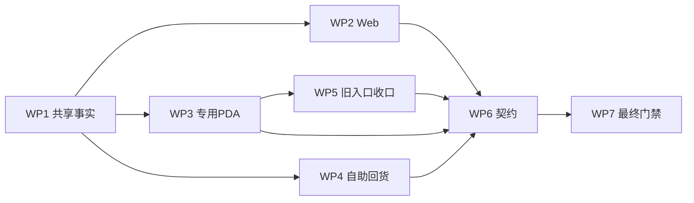

# 后道回货逐 SKU 确认与废弃实施计划

> 对应方案：`docs/product-design/2026-09-03-后道回货逐SKU确认与废弃调整方案.md`  
> 对应矩阵：`docs/requirement-traceability/2026-09-03-后道回货逐SKU确认与废弃矩阵.md`  
> 原则：在当前页面、路由、共享事实和事件入口上增量补齐，不重构后道工厂管理模块。

## 1. 完成标准

- 两种回货来源共用逐 SKU 明细和同一确认动作。
- Web、专用 PDA、旧 PDA 兼容入口的文案与动作一致。
- 超过 5%才进入复点/授权，最终确认幂等生成一张质检单。
- 废弃状态贯穿回货、待加工仓投影和操作日志，且不会污染库存或质检。
- 专项契约、构建、治理、CodeGraph、任务收据和命名页面验收均有当前版本证据；浏览器未验证时不得标记总体已验证。

## 2. 工作包

### WP1：共享回货事实与废弃状态

- 业务目标：建立唯一的废弃规则，避免 Web/PDA 各自改状态。
- 文件/符号：`src/data/fcs/post-finishing-full-flow.ts`；`PostFinishingDeliveryStatus`、`PostFinishingWaitProcessStatus`、`canDiscardPostFinishingFactoryReturn()`、`discardPostFinishingFactoryReturn()`。
- 修改：增加“已废弃”及废弃人、时间、原因；废弃后待加工仓数量归零、确认被阻断、质检不生成，日志保留动作。
- 验证：领域专项覆盖允许废弃、禁止继续确认、无质检和库存负向投影。
- 完成条件：Web/PDA 只调用共享动作，不直接改本地状态。

### WP2：Web 回货列表与详情

- 业务目标：无论状态都能查看逐 SKU 明细，并在最终确认前废弃。
- 文件/符号：`src/pages/process-factory/post-finishing/warehouse.ts`；回货列表、`renderConfirmationDetail()`、`renderConfirmedReturnSkuDetails()`、事件处理器。
- 修改：保留标准列表结构；增加废弃入口、回货方式、确认后/废弃后只读 SKU 表；排除废弃库存。
- 验证：页面源码契约、Web E2E、1366×768 路由目检。
- 完成条件：同一详情不再因已确认而丢失颜色、尺码和逐 SKU 数量。

### WP3：专用 PDA 回货确认

- 业务目标：现场只做逐 SKU 点数，自动判断差异，不再人工选择“差异/驳回”。
- 文件/符号：`src/pages/pda-post-finishing-flow.ts`；回货确认渲染、实时摘要和动作处理。
- 修改：逐 SKU 5%提示、整单提示、成功后质检单号、废弃入口。
- 验证：页面源码契约、PDA E2E、400×786 交互目检。
- 完成条件：页面无“数量有差异/驳回”业务分支，超过 5%才显示复点/授权。

### WP4：车缝自助回货记录

- 业务目标：登记后仍可查看登记时的全部 SKU，并能进入确认或废弃。
- 文件/符号：`src/pages/pda-sewing-self-return.ts`；最近登记卡片和事件处理器。
- 修改：增加折叠明细、查看并确认、废弃动作和废弃原因展示。
- 验证：自助回货专项、页面源码契约、PDA E2E。
- 完成条件：最近登记不再只显示整单合计。

### WP5：旧 PDA 通用交接入口收口

- 业务目标：消除同一后道回货存在两套确认规则的风险。
- 文件/符号：`src/pages/pda-handover-detail.ts`；后道记录渲染与旧动作防御。
- 修改：后道记录改为只读明细和专用确认入口；隐藏通用确认、差异、驳回、完成按钮；处理器阻断旧动作。
- 验证：PDA 交接源码契约和命名路由回归。
- 完成条件：非后道交接行为不变，后道回货只能进入专用页确认。

### WP6：状态样式与契约

- 业务目标：所有页面能识别“已废弃”，且新规则有自动化防回退。
- 文件/符号：`src/pages/process-factory/post-finishing/shared.ts`、`scripts/check-post-finishing-full-flow.ts`、`scripts/check-post-finishing-full-flow-surface.ts`、`tests/post-finishing-full-flow.spec.ts`。
- 修改：状态徽标；领域、静态页面与浏览器契约。
- 验证：专项检查与 Playwright。
- 完成条件：废弃、逐 SKU、5%、自动质检和旧按钮负向约束均有直接断言。

### WP7：最终追踪和交付门禁

- 业务目标：防止只完成页面或只完成领域规则。
- 文件/符号：本方案、本计划、追踪矩阵、原型审查记录。
- 修改：补齐实际实现位置、当前证据、未验证项和证据边界。
- 验证：`git diff --check`、专项检查、构建、原型治理、CodeGraph 同步与状态、任务收据。
- 完成条件：正向、反向追踪没有漏项；浏览器门禁若未通过，总体状态保持“已实现待验证”。

## 3. 依赖顺序

## 4. 风险与控制

| 风险 | 控制 |
| --- | --- |
| 已确认记录被废弃后造成库存、质检历史倒退 | 共享 `canDiscard` 只允许最终确认前状态，处理器再次校验 |
| 整单合计相同掩盖 SKU 间一多一少 | 授权规则逐 SKU 计算，合计明确只供核对 |
| Web/PDA 产生两套废弃状态 | 所有入口调用同一个共享领域动作 |
| 旧 PDA 链仍可绕过专用 5%规则 | UI 隐藏并在旧事件处理器中防御性阻断 |
| 历史本地存储没有废弃字段 | 字段可选，读取旧数据不需要迁移即可兼容 |
| 页面大改破坏既有习惯 | 保持页面骨架，仅在原卡片、表格和操作区增量增加内容 |

## 5. 最终验证清单

- 领域：登记、逐 SKU 5%边界、二次点数、授权、自动质检、废弃负向投影。
- Web：回货列表、待确认详情、确认后详情、废弃详情、库存统计。
- PDA：自助登记、最近登记明细、专用确认、废弃、旧交接入口。
- 图片：每条 SKU 图片与对象同块，大图、关闭、Esc、失败态。
- 视口：Web 1366×768；PDA 400×786。
- 治理：原型审查记录、CodeGraph、构建、任务收据。
- 边界：本地浏览器模拟不等于物理 PDA、真实扫码枪或生产环境验收。

