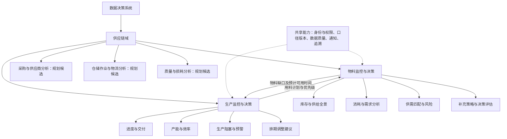
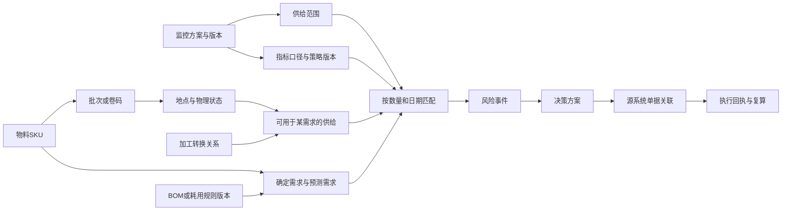
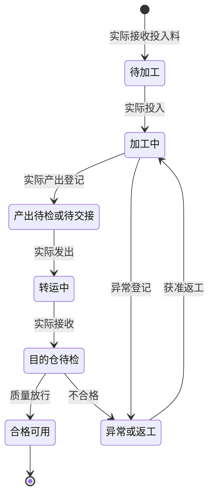
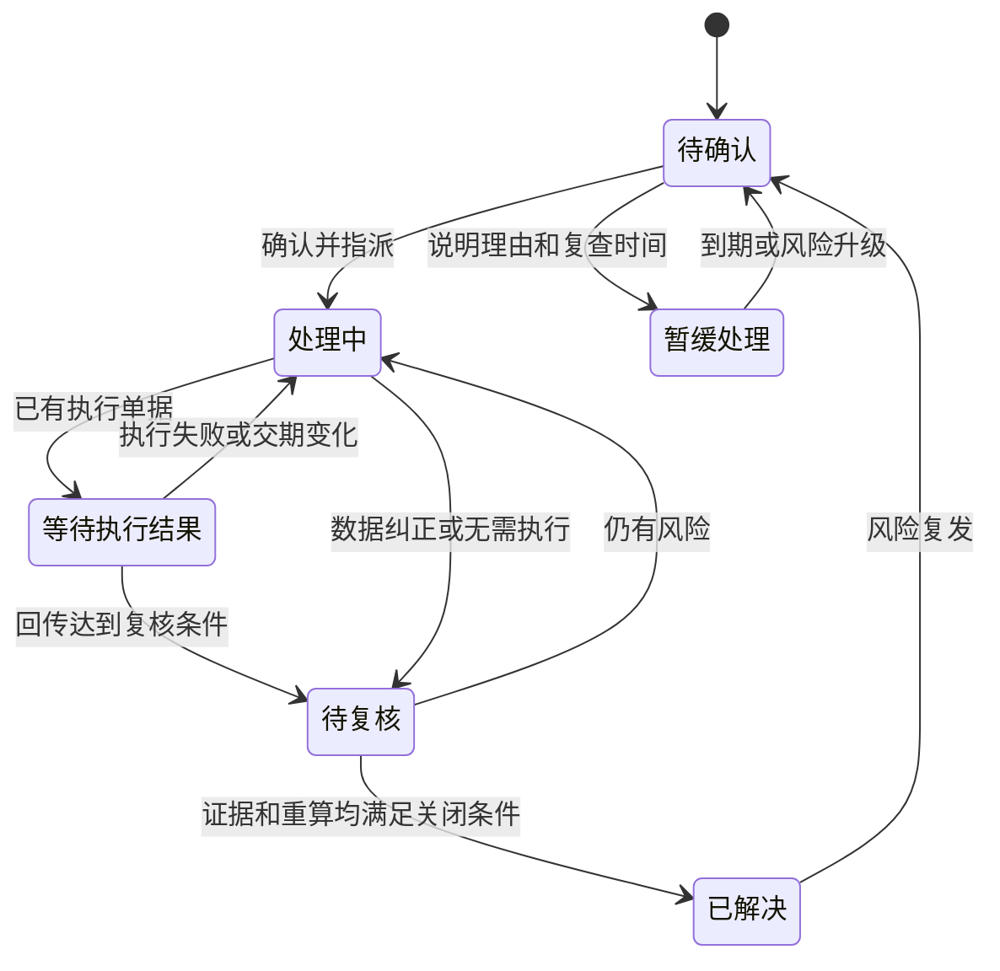
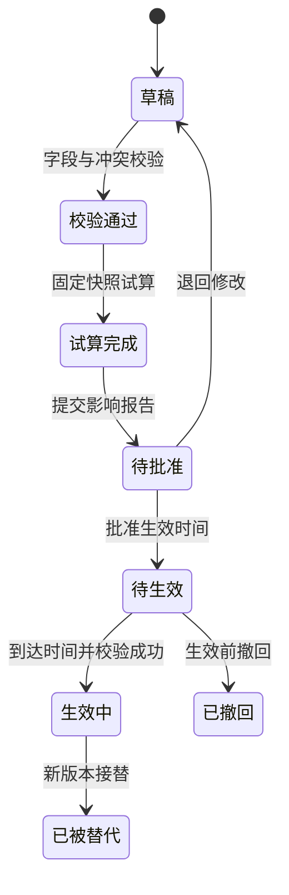
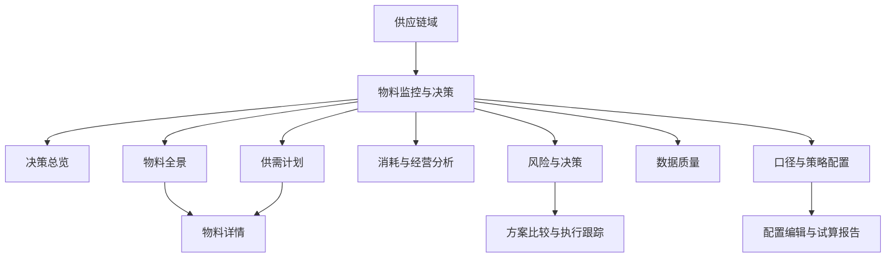
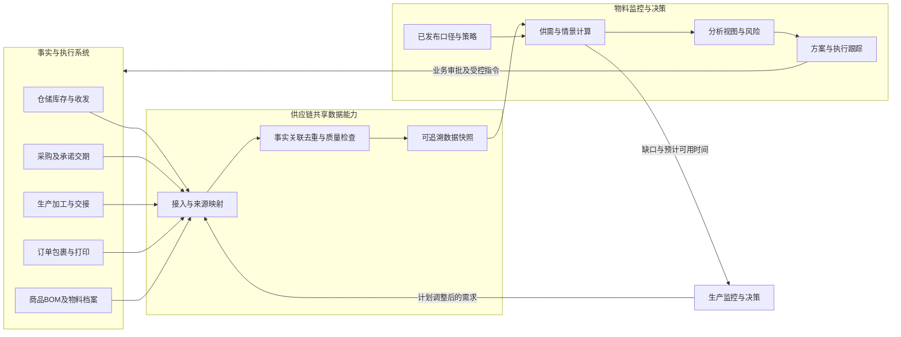
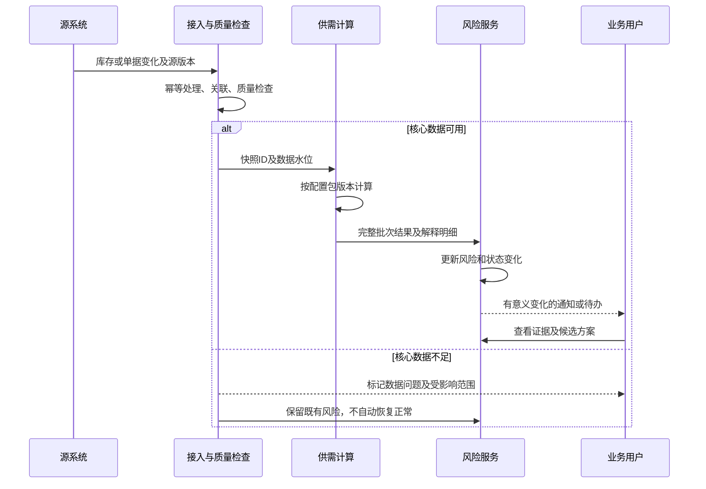
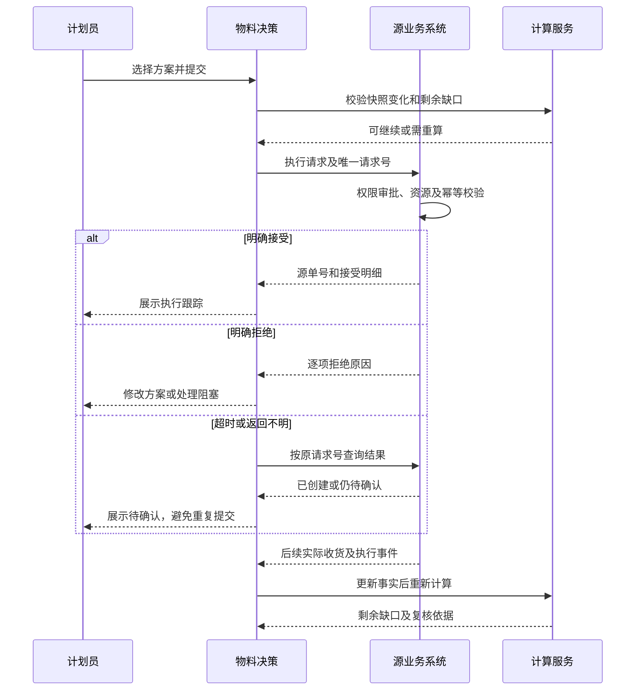

# 物料监控与决策子域：完整产品方案

> 归属：数据决策系统 → 供应链域 → 物料监控与决策
> 版本：v2.0｜编制日期：2026-09-12｜更新日期：2026-09-14（补齐成衣仓）｜状态：产品评审稿
> 本文是重新规划的产品设计。旧页面作为需求和数据问题证据，不构成页面布局、能力范围或迁移目标。本文取代此前方案中的产品设计部分；历史核查结论仍作为带日期的参考。
> 本次交付为 Markdown 文档，未实施代码、发布规则、生成业务单据或改动线上库存。图表使用 Mermaid 语法。

## 阅读导航

1. 设计结论与目标
2. 业务架构与职责边界
3. 用户角色与核心场景
4. 业务对象与数据模型
5. 物料与仓库范围
6. 供给、需求与计算口径
7. 加工供给专项
8. 包材与耗材专项
9. 风险与决策闭环
10. 配置、试算与版本治理
11. 页面级产品设计
12. 系统协作、流程与时序
13. 数据质量与历史追溯
14. 权限与通知
15. 经营分析与效果评估
16. 分期、上线条件与非功能要求
17. 验收用例
18. 待核实事项与默认处理
19. 需求覆盖与来源

## 1. 设计结论与目标

### 1.1 产品定位

建立围绕物料全生命周期的监控与决策子域，回答：

- 物料在哪里，处于什么形态和状态，当前能用于哪些需求？
- 未来什么业务需要它，需要多少，什么时候、在哪里需要？
- 已有和预计供给能否满足，首次缺口、最大缺口及影响对象是什么？
- 应采购、调拨、加工、使用获准替代料、调整需求，还是先核实数据？
- 改变备货周期、需求系数或供给策略后，风险和投入会如何变化？
- 决策执行后是否解决问题，预测和策略是否有效？

产品同时服务供给保障、库存效率、业务协同与数据可信度。其核心产物为可解释的指标、风险事件、决策方案和规则版本。

### 1.2 已确认的设计方向

| 事项 | 已确认方向 |
|---|---|
| 架构归属 | 数据决策系统 → 供应链域 → 物料监控与决策 |
| 与生产关系 | 生产监控与决策是供应链域下的平行子域；生产效率、进度、预警是其内部能力 |
| 规划方法 | 依据管理问题重新规划，涵盖已有需求并支持合理扩展 |
| 配置要求 | 支持范围配置、口径调整、监控策略、版本管理与调整影响分析 |

设计建议：以SKU与供给范围承担业务判断，SPU、品牌、商品、工厂用于分析汇总；采购、仓储、加工、生产系统继续负责正式单据和实物账务。

本文的菜单结构、算法默认值、时效指标和发布流程属于本次设计建议，进入产品评审；未明确的源系统事实列在第18章，不伪装成已经实现。

### 1.3 成功标准

1. 每个风险能解释物料、范围、需求、供给、时间、规则及数据完整性。
2. 同一供给和同一需求在指定计算范围内只计一次；共用SKU不按品牌复制库存。
3. 目标SKU缺料能追溯到原料、加工、质量、运输或主数据问题。
4. 规则修改可以试算、审核、生效、停用及追溯，不改变原始业务事实。
5. 从风险到方案、源系统单据、执行回执和风险解除存在完整链路。
6. 数据缺失时提示不可计算或部分覆盖，不能把缺失当0并显示安全。

## 2. 业务架构与职责边界

### 2.1 供应链域架构

业务域划分不等于菜单深度，也不要求拆成独立服务。可在供应链工作台提供直接入口，采购、生产、仓储页面也可携带业务上下文跳入物料详情。

### 2.2 子域边界

| 边界 | 本子域负责 | 对方负责 |
|---|---|---|
| 商品中心 | 分析用映射、映射异常、BOM适用性检查 | 正式物料SKU、BOM、工艺资料、替代授权及其版本 |
| 采购系统 | 供给判断、采购建议、决策来源 | 询价、供应商选择、采购审批、PO、交期与取消 |
| 仓储系统 | 库存分析、可用范围判断、调拨或盘点建议 | 账面库存、占用、冻结、入出库、盘点、调拨执行 |
| 加工执行系统 | 原料到目标料的供给推算、加工延误风险 | 接收、加工、交出、质检、报损、实际产出与工序流转 |
| 生产监控与决策 | 物料缺口与可用时间、受影响需求清单 | 生产效率、工序进度、产能、整体交付影响与排期建议 |
| 财务分析 | 引用获准成本口径计算库存价值与方案预算 | 正式计价、应收应付、结算、凭证和财务关账 |

生产单“是否齐料”的供需判定由物料子域提供；生产单整体“是否能按期交付”由生产子域综合物料、产能、进度等判断。两域关联同一物料风险ID，不重复创建互不关联的缺料事实。

### 2.3 本子域拥有的业务记录

监控方案、范围版本、指标口径版本、风险事件、试算快照、决策方案、业务发起关联、风险处理日志、效果评估。源业务数据保存分析副本及来源标识，不成为第二套正式库存账。

## 3. 用户角色与核心场景

| 用户 | 核心问题 | 常用入口 | 决策或处理 |
|---|---|---|---|
| 供应链负责人 | 哪些风险会影响生产/发货，投入是否合理 | 总览、方案比较 | 确定保障目标和例外策略 |
| 物料计划/采购跟单 | 哪些SKU何时需要补充，现有PO能否覆盖 | 供需计划、决策方案 | 形成采购/加急/调拨建议 |
| PPIC/生产计划 | 哪些订单缺料，最早可用时间是什么 | 需求明细、风险详情 | 确认需求日期、优先级，联动排期 |
| 仓储负责人 | 实物在哪、是否已分配、账实是否有疑点 | 物料全景、数据质量 | 核对库存、交接、盘点与工位余量 |
| 加工负责人 | 原料是否齐备、哪些任务等待或延误 | 加工供给视图 | 在源系统更新承诺与执行事实 |
| 包装/成衣仓负责人 | 各品牌各规格耗材能撑多久 | 包材耗用、风险工作台 | 核对包装方式、耗用与补充需求 |
| 商品资料负责人 | 哪些SKU/BOM/单位映射影响计算 | 数据质量、规则映射 | 修正源主数据或分析映射 |
| 数据/规则管理员 | 指标如何算、改口径影响多大 | 口径与策略配置 | 试算、提交、发布及追溯 |

典型闭环：目标色面料不足→发现白坯可供→比较加工回货与直接采购→生成组合建议→源系统承接→分批实收→复算；品牌小袋不足→核实包装业务量与规格映射→补货试算→检查跨品牌不可替用→跟踪采购；共用白色吊粒不足→汇总三个品牌需求→按共享供给池分配→识别受影响品牌。

## 4. 业务对象与数据模型

### 4.1 对象关系

### 4.2 关键对象字段

| 对象 | 关键字段 | 约束 |
|---|---|---|
| 物料 | 来源系统ID、物料ID、SPU、SKU、名称、类型、品牌、规格、颜色、用途、基本单位、启停状态 | 不凭名称相似合并；SKU显示编码与内部ID分离 |
| 地点 | 地点ID、来源系统、仓库编码、工厂ID、库区库位、业务时区、货权/责任主体、启停状态 | 同一位置的跨系统编码通过映射表关联 |
| 库存事实 | 快照时点、SKU、批次/卷码、地点、实存数量、质量状态、占用量、来源流水 | 占用属于分配关系，不能再当作物理库存层叠加 |
| 供给承诺 | 来源单据/行/批次、目标SKU、未完成量、预计到达/可用时间、状态、承诺可信级别、目的地 | 部分收货后减少未完成量；入库与承诺剩余不重叠 |
| 需求 | 需求ID、源单据行、SKU、数量、需求时间、用料地点、优先级、BOM/耗用版本、已履行量、预测关联ID | 同一需求转化保留关联，避免重复预测 |
| 分配关系 | 供给ID、需求ID、已分配数量、分配来源、版本、有效状态 | 源系统实际占用与本域试算分配分列 |
| 加工转换 | 工艺路线版本、步骤及出现序号、投入SKU/数量单位、产出SKU/数量单位、收得率、前置依赖 | 一对多、多对一及重复工序必须有唯一转换标识 |
| 监控方案 | 名称、对象选择、供给池、需求范围、观察周期、口径版本、策略版本、责任组、生效时间 | 同一正式范围同类决策只允许一个主方案 |
| 风险 | 类型、对象、范围、首次发现、首次缺口、影响量、等级、数据状态、责任人、处理状态 | 连续未解除的同类风险更新同一事件 |
| 决策方案 | 关联风险/需求、基线快照、动作明细、数量、交期、预算、约束、状态 | 一个方案可多个动作，一项动作可覆盖多个需求 |

### 4.3 三类“规则”不能混淆

- **事实依据**：正式BOM、物料单位、实际包装记录等。源系统维护；变更不自动改写过去业务。
- **分析口径**：历史窗口、订单筛选、供给范围、预测系数等。可在本子域版本化配置。
- **决策策略**：安全量、目标周期、风险等级、优先补充方式等。可试算和发布。

模拟可以使用临时假设，但必须标记“模拟”，不回写正式BOM或库存。

## 5. 物料与仓库范围

### 5.1 物料分类与用途

支持面料、辅料、纱线、包材、耗材、配件等分类。分类只是管理标签；需求模型按用途选择。例如吊牌可由生产包装任务驱动，外袋由包裹包装驱动，碳带由打印或领用驱动。同一SKU可服务多个用途，统一汇总供给，不复制库存。

### 5.2 已提供的仓库档案

用户2026-09-12提供15条仓库记录，2026-09-14补充剩余两个成衣仓：F&M WH、A&C WH。下表已覆盖截图所示全部17条仓库档案。此表为用户资料转录，不代表重新访问线上核验。

| 仓库 | 编码 | 页面属性 |
|---|---|---|
| SAMPLE-FABRIC-样衣面辅料仓 | WH-FABRIC-006 | 面料仓 |
| GT面料仓 | WH-FABRIC-005 | 面料仓 |
| holis面料仓 | WH-FABRIC-004 | 面料仓 |
| HILON-裁片仓 | HILON-5 | 面料仓 |
| HILON-耗材 | HILON-4 | 耗材仓 |
| HILON-纱线 | HILON-3 | 纱线仓 |
| 耗材中央仓 | WH-HAOCAI-001 | 耗材仓 |
| 面料中央仓(GKP) | WH-FABRIC-001 | 面料仓 |
| 纱线中央仓 | WH-MAOSHA-001 | 纱线仓 |
| 辅料中央仓(GTP) | WH-FITTING-001 | 辅料仓 |
| 中转仓（新裁床） | WH-BDG-009 | 中转仓 |
| HILON-辅料仓 | HILON-2 | 辅料仓 |
| HILON-面料仓 | HILON-1 | 面料仓 |
| GUDANG BARU-1 | GUDANG BARU-1 | 面料仓 |
| 中转仓（Sea Cutting） | WH-BDG-005 | 中转仓 |
| F&M WH | F&M WH | 成衣仓 |
| A&C WH | A&C WH | 成衣仓 |

补充截图显示：两个成衣仓均为自建、启用，国家为ID；F&M WH的库区/库位总数为88 / 2770，A&C WH为92 / 3115。编码按仓库名称后括号内容转录。

成衣仓纳入地点档案和需求场景映射，成衣商品库存不直接计入面辅料可用库存。若仓内实际存放包材、耗材，应按真实物料SKU、库存记录、用途及占用关系纳入相应供给池；不能仅凭“成衣仓”属性推断其中存在物料库存。其包装、发货、打印等业务可作为包材需求来源，具体消耗依据见第8章。

补充7类场景：染色厂待加工仓、印花仓待加工仓、辅料厂待加工仓、辅助工艺待加工仓、特种工艺待加工仓、毛织厂待加工仓、花边厂待加工仓。辅料厂原文“待加工厂”暂按待加工仓理解，实际档案待核实。7类场景可能对应多个工厂，也可能是已有仓库下库区，不能据此计算仓库总数。

HILON-裁片仓、HILON-纱线在所提供截图中呈停用状态：其余额仍纳入追溯，默认不参与新增供给分配。截图的主体、时区字段未明确；国家ID不能替代业务时区配置。仓库名HILON不等于耗材品牌。

### 5.3 供给范围配置

每个正式监控方案必须选择供给池：物料范围、地点集合、货权许可、需求用途、质量条件、可调拨条件。支持指定仓库、工厂及库区，支持排除样衣专用、客户专属、停用、冻结等库存。

重叠供给池不能各自独立承诺同一实物：正式供需匹配应在统一分配范围内运行，再按品牌/地点过滤展示。独立模拟池可以重复引用同一库存用于比较，但必须标记“情景试算，不可相加”。

跨仓库存若未在目标用料地点，只有能够在需求前调达且获得使用许可，才计为该需求可用供给。没有调拨安排的库存是候选资源，不伪装成已确定到货。

## 6. 供给、需求与计算口径

### 6.1 指标注册与展示合同

所有正式指标登记：指标ID、业务名称、粒度、单位、来源、筛选范围、公式、时间窗、时区、空值/负值规则、精度、版本、责任人和刷新时点。图表、列表、导出调用同一指标定义。

| 指标 | 定义与处理 |
|---|---|
| 在库实存 | 截止时点处于选定地点的实物数量；按SKU和物理形态分组 |
| 合格库存 | 在库实存中符合需求质量与用途条件的数量，排除待检/冻结等不可用集合，重叠只排除一次 |
| 自由可用 | 合格库存减已有效占用的数量；负数保留异常提示，不隐藏成0 |
| 在途实物 | 已交出且未接收的运输数量；按同一交接来源去重 |
| 已确认未来供给 | 符合状态、交期、SKU和目的地要求的未完成采购/加工/调拨承诺 |
| 日均实际耗用 | 完整窗口内已确认实际耗用净量÷窗口自然日数；内部移交不当实耗 |
| 日均订单折算需求 | 符合模型筛选的销售量×适用用量×预测系数后，汇总÷窗口天数 |
| 现货覆盖天数 | 自由可用量÷所选日均需求；显示需求来源与版本，不能当确定齐料结论 |
| 首次缺口时间 | 按需求时点匹配后第一次供给不足的时间 |
| 最大缺口 | 观察窗口内未满足累计净需求的最大值；按SKU计量，不跨单位相加 |
| 可满足需求比例 | 已按期匹配量÷已知确定需求量；需求源不完整时标记部分覆盖 |
| 到货延迟 | 当前承诺或实到时间相对已锁定基准承诺的偏差；修改承诺不抹去历史延迟 |

日均为0时显示“无有效需求，覆盖不适用”；数据不完整时显示“不可计算”；分母为正且结果很大时显示有限数或“超过显示上限”，不用∞掩盖展示截断。

### 6.2 三套可并列使用的观察口径

| 口径 | 目的 | 不可替代的含义 |
|---|---|---|
| 全局实物 | 找到库存及状态、资金与分布 | 不保证任意需求可使用 |
| 当前用途可用 | 判断当前任务、SKU、地点是否能领用 | 排除不适配、受限、尚待转换的库存 |
| 未来供需计划 | 判断各日供给、需求、缺口和补充动作 | 取决于承诺与预测，不能当实际库存 |

“加工厂白坯库存充足”和“黑色目标料缺货”可以同时成立；“全局库存充足”和“某仓明日缺料”也可以同时成立。产品必须解释，不能强制合成一个状态。

### 6.3 供给状态纳入规则

| 来源状态 | 实物库存 | 基准未来供给 | 处理 |
|---|---|---|---|
| 待审核采购/未确认意向 | 否 | 否 | 仅候选情景，避免虚假保障 |
| 已确认采购未发货 | 否 | 有有效数量、目的地和可用日期时计入 | 显示供应商承诺依据 |
| 已发运输中 | 在途实物 | 有可信可用日期时计入一次 | 到港、到仓、验收可用分列 |
| 已收待检 | 在库待检 | 可用日期获确认后作为未来释放 | 不同时保留同量采购未收 |
| 合格已入库 | 在库合格 | 已转现货，不重复加未来供给 | 扣减未完成承诺 |
| 加工已确认计划 | 投入按实际位置显示 | 需路线、原料保障、产能承诺和日期 | 缺任一关键条件转候选供给 |
| 已逾期且无新承诺 | 按实际状态 | 不默认延到今天计入 | 保留原承诺与逾期预警 |
| 取消/作废 | 仍存在的实物按真实状态 | 取消剩余承诺 | 不因取消单据自动抹掉实物 |

基准情景只纳入满足条件的承诺；保守情景只采用现货及更严格限定供给；计划情景可纳入待确认补充。三者显示区别，不相加。

### 6.4 需求计算与去重

**生产确定需求**：引用锁定版本BOM。若BOM用量为净耗，毛需求=计划数量×净耗×(1+加成式损耗率)；若已包含损耗，不重复加成；若定义的是收得率，使用净需求÷收得率。字段必须标明损耗定义。

未履行需求由源系统需求量减已履行量得到，不将“已领用”和“已消耗”混为一项。对于中央仓供给判断，已发往工厂的数量已满足该次发料需求；对于工厂投料判断，它作为工厂库存继续匹配投料需求。范围变化必须连同阶段变化，不能全链路重复扣同一物料。

**销售预测需求**：销售量通过有效BOM或明确的预选估算映射折算；已形成确定生产计划的关联部分退出预测。预选估算必须区别于确定用料，不得直接生成精确颜色SKU采购。

**包材需求**：已确认待包装任务、已发生耗用、未来预测分别计算；实际耗用已反映库存时，不再作为未来需求扣第二次。

**去重机制**：使用需求来源及转化关联ID。无法匹配的预测与确定需求分情景展示，标记重叠未知；首期不使用“直接相加”或未经验证的max公式代替去重。人工额外需求必须说明是否已包含于系统计划。

### 6.5 时间与快照

正式日均默认7个完整业务自然日，支持30/90日；预测观察期默认60日、支持7/15/30/60/90日。这里是产品建议默认值，管理员可发布版本调整。业务时区必须由范围指定；跨时区事件先保留UTC时间，再按选定业务日归属。

当前日未完结数据独立标识；同比/环比只对比相同完整程度。历史复盘引用当日已保存的库存、需求、承诺及规则快照；“用新规则重算历史”生成独立试算结果，不替换当时结果。

### 6.6 确定的供需余额算法

采用“合格库存包含本范围预留、需求完整扣减”的统一计划法：

`B0 = 本计划范围的合格库存 − 专属于范围外需求的有效预留`

`B(t) = B(t-1) + 当期首次可用的有效供给 − 当期未履行确定需求 − 已去重的增量预测需求`

本范围内部的预留不能从B0再扣一次；它用于分配优先约束。先保留源系统硬占用，再按需求时间、经授权的优先级、稳定需求ID排序进行模拟分配。缺少占用归属时不能默认其属于范围内，标记供需覆盖不完整。

有准确时间时按事件时间排序；只有日期时默认当日需求先于当日新增供给，并标明“同日可用时序未确认”。同日到货若确能赶上需求，须补可用时间，不能默认日初已到。

日余额为汇总视图，最终风险由SKU、用途、地点、批次限制及具体需求匹配得到。不能用公司级正余额掩盖局部需求无法满足。

**计算示例（演示数据）**：同一SKU合格库存100，其中30已预留给本范围明日需求；明日总需求50。B0=100，明日余额50，自由可用初值70。不能用70再减50得到20。若其中另有20预留给范围外需求，则B0=80、明日余额30。

### 6.7 补充量计算与到货前缺口

固定数量策略：自由可用量低于触发线时评估，目标量不得低于触发线。天数策略：低于安全/提前期边界时评估目标周期。

对于一笔预计在a时点可用、保障到H时点的补充，使用未加入该建议的基线余额：

`净补充量 = max(0, max[S(t) − B_base(t)]，其中 a≤t≤H)`

S(t)为该时点安全余量。这保证窗口中间的缺口不会被期末大批到货掩盖；到a之前的缺口单独标记，需加急、调拨或调整计划，不能宣称本次普通采购解决。

实际建议量：净补充量>0时，按MOQ与整包倍数向上取整；净量为0则不强制产生MOQ采购。单位换算在取整前后可追溯，面料卷数与长度不得套用全局平均卷长。

目标周期明确为“从当前截止时点起覆盖H天”；若选择“从到货后覆盖N天”，系统换算H=提前期+N，只加一次。安全天数转换成需求量后，不再重复添加同一安全天数。

多动作方案逐项加入供给后重算剩余缺口，禁止每项都按原缺口全额推荐。成本未知时显示无法比较成本，不填0。

## 7. 加工供给专项

### 7.1 从物料形态到可用时点

加工链按订单实际工序建模，支持染色、印花、辅料加工、辅助工艺、特种工艺、毛织、花边等节点。不能预设所有物料都按“染色→印花”走相同路线。

每个节点至少记录：加工单及行号、工厂、输入SKU及批次、投入数量与单位、输出目标SKU、预计产出量、预计损耗、计划开完工时间、实际接收/投入/产出/交接数量、目的仓、运输及质检时间、当前责任人。一个输入对应多个输出或多个输入组合时，使用投入产出明细关系，不能仅存一个坯布字段。

预计可用时间由“剩余加工时间＋后续工序＋交接运输＋收货质检”组成。工厂报完工时间不能直接作为生产可领料时间。未知任一关键节点时，标记时间不完整，不伪造确定到货日。

图表示单个数量分段的物理过程；部分产出、部分发出、部分接收应拆数量段，各段可以并存。业务单据“已完成”、交接状态和质量状态独立保存。加工单取消也不意味着实物自动归零，剩余物料仍需退料、转用或其他源系统处置。

### 7.2 防止重复计算

- 待加工的坯布属于坯布库存，不能算成目标色布的当前可用量；可作为具备转换条件的候选资源。
- 已投入并被加工任务占用的坯布不得再次推荐给另一任务；预计产出进入未来供给，不能同时视为自由坯布和确定成品双重保障。
- 预计产出按实际接收数量逐步冲减，接收后的合格量进入现货。过程损耗、不合格量与未完成量分别处理。
- 目标SKU为空时只显示加工事实和映射异常，不参与目标SKU供给保障。
- 采购、加工、调拨在同一链条上关联时，依据物理批次/来源行和供给链标识去重；无法建立关联的量显示“存在重叠风险”，不能直接相加。

### 7.3 加工建议与方案比较

方案必须比较直接采购成品、现有物料调拨、现有坯布加工、采购坯布后加工。每条方案展示可执行数量、最早可用日、解决缺口量、仍未解决的日期区间、投入物料、工序路径、产能约束、成本完整度和阻塞原因。

转换关系包括适用输入/输出SKU、单位换算、工艺、工厂能力、损耗依据、最小批量、生效时间及批准人。缺失转换关系或能力数据时只提出待核实选项，不形成确定加工承诺。替代料须有来源系统批准的适用范围，不能凭名称、颜色接近自动替代。

旧备料页中的“触发量、目标量、建议量”应在此获得可解释依据：例如建议为0是已有有效加工供给覆盖、资源不足、缺少路线还是数据不完整，必须显示原因及对应单据。已存在有效执行单据时优先跟踪剩余量，不重复全量建议。

## 8. 包材与耗材专项

### 8.1 已提供物料目录与映射边界

用户先前文字提供7类、10个SPU、28个SKU；这是该次清单的枚举数量，不是最终在用监控范围数量。后续图片增加WLID001及更细规格，不能直接累加为正式目录，也不能直接覆盖旧编码。

| 类别 | 先前提供的SPU | 先前提供的SKU后缀或完整规则 | 后续处理 |
|---|---|---|---|
| 吊粒 | FLSZ24116 | black、white | 图片给出品牌适用关系 |
| 吊粒 | IDSZWL005 | white、black | 保留待核实适用场景 |
| 吊粒 | FLSZ388 | black-onesize、white-onesize | 保留待核实适用场景 |
| 面单纸 | FLSZ408 | sameasphoto | 保留，图片未列不代表取消 |
| 拉链袋/磨砂内袋 | WLID002 | modish、chicmore、fadfad、asaya | 与下表规格编码核对真实SKU/旧码/别名关系 |
| 快递袋 | FLSZ405 | onesize | 与WLID001关系待核实 |
| 快递袋 | FLSZ385 | white-a、white-b、pink-a、pink-b、black-a、black-b、orange-a、orange-b、white-1、white-2 | 保留独立编码，不自动替代新袋 |
| 品牌吊牌 | WLID009 | chicmore、fadfad、asaya、modish | 品牌适用，仍需数量规则 |
| 空白吊牌 | WLID007 | sameasphoto | 通用物料，需求按实际适用场景汇总 |
| 碳带 | WLID008 | sameasphoto | 按打印消耗测算，不能默认每件一卷 |

上表后缀与SPU用“-”连接。以下为用户最新图片的逐项业务映射，尚非线上档案核实结果。

| 物料 | 品牌 | 图片中的SKU | 说明 |
|---|---|---|---|
| 拉链袋 | FADFAD | WLID002-fadfad-6.5c-28x30；WLID002-fadfad-6.5c-28x37 | 两尺寸 |
| 拉链袋 | CHICMORE | WLID002-chicmore-6.5c-28x30；WLID002-chicmore-6.5c-28x37 | 两尺寸 |
| 拉链袋 | MODISH | WLID002-modish-6.5c-28x30 | 另一格为“/”，不推断不存在其他SKU |
| 拉链袋 | ASAYA | WLID002-asaya-6c-28x30 | 同上 |
| 快递袋 | FADFAD | WLID001-fadfad-6c-32x42；WLID001-fadfad-dikemas-dengan-tangan-6c-32x42 | 机器/手工适用关系待档案确认 |
| 快递袋 | CHICMORE | WLID001-chicmore-6c-32x42；WLID001-chicmore-dikemas-dengan-tangan-6c-32x42 | 同上 |
| 快递袋 | MODISH | WLID001-modish-6c-32x35；WLID001-modish-dikemas-dengan-tangan-6c-32x42 | 尺寸及方式均有差异 |
| 快递袋 | ASAYA | 两格均为WLID001-asaya-dikemas-dengan-tangan-6c-32x42 | 图片重复；不能自行补机器款编码 |
| 吊牌 | 四品牌 | WLID009-fadfad；WLID009-chicmore；WLID009-modish；WLID009-asaya | 各对应本品牌 |
| 空白吊牌 | 通用 | WLID007-sameasphoto | 跨品牌共享库存池 |
| 碳带 | 通用 | WLID008-sameasphoto | 跨品牌共享库存池 |
| 吊粒 | FADFAD | FLSZ24116-black | 图片适用关系 |
| 吊粒 | CHICMORE、MODISH、ASAYA | FLSZ24116-white | 一个SKU被三品牌使用，库存只记一次 |

“吊牌配套”优先建为业务消耗组合，由吊牌、吊粒、空白吊牌、打印耗材等规则组成。当前未找到配套SPU，不新造库存SKU。如果后续证明其确实以成套商品采购、入库或组装，则在源系统建立套件与拆组关系，再接入监控。

### 8.2 包材需求规则

规则键为品牌＋业务场景＋包装方式＋商品/包裹规格＋目的地等适用条件，输出实际物料SKU、消耗基数、单耗、损耗、替代优先级与有效期。字段“6c/6.5c”等先保留原始规格，不在未确认前赋予厚度单位。

| 对象 | 建议需求基数 | 必须确认的业务条件 |
|---|---|---|
| 内袋 | 需独立包装的成衣件数 | 是否一件一袋、商品尺寸映射、返工重复包装 |
| 快递袋 | 包裹数 | 合单/拆单、手工/机器、包裹尺寸、重打包 |
| 品牌吊牌/吊粒 | 需挂装的成衣件数 | 是否配套、哪些商品豁免、换牌与损耗 |
| 空白吊牌 | 实际需打印标签数量 | 一件多标签、补打、作废是否消耗 |
| 面单纸 | 面单打印张数 | 一包多联、重打与废张、每卷张数 |
| 碳带 | 打印长度或经核实的打印张数换算 | 打印规格、设备、碳带长度、有效利用率 |

基本公式：`计划消耗 = 适用业务量 × 有效单耗 ×（1＋额外损耗率）`。此处损耗率定义为对净需求的附加比例；若工艺使用“产出良率”，公式改为净需求/良率，配置类型互斥，不能同时套用两个表达同一损耗的参数。

计划单耗与实际领用分开。库存扣减由源系统实际领用/出库负责；本域可由订单、包裹、打印事件推算需求，但不能再次扣账。撤单只撤销未发生需求，已领耗材需以退料或冲正事实处理，不因订单取消自动加回实物。

事件关联到业务行、包裹或打印任务，重复回传按源事件ID和修订号处理。预测阶段包裹数允许估算，但显示估算依据和范围；形成实际包裹后替换对应预测，不叠加两份需求。

### 8.3 组合齐套与共享库存

齐套能力以各必需组件可分配量除以各自单耗的最小值计算，并考虑品牌、规格及场景适用性。单耗或单位换算缺失时显示“齐套能力不可算”。该数是可支持的业务单位数量，不能把不同物料库存数量相加。

演示：FADFAD适用黑吊粒100个、吊牌80张、内袋120个，确认每件各1个且无其他约束，最多支持80件；不能推断所有品牌均可支持80件。白吊粒被三个品牌共享时，各品牌独立查看“最大可能支持量”须标记不可相加，正式联合计划按同一资源池分配。

旧袋与新袋、不同尺寸、不同包装方式分别监控。停用物料仍显示剩余库存与处置建议；只有正式有效的替代关系才能进入替代方案。

## 9. 风险与决策闭环

### 9.1 风险分类与优先级

| 风险 | 触发逻辑 | 主要处理 |
|---|---|---|
| 当前缺料 | 合格可分配量不足已到期需求 | 核实、调拨、加急、替代、协调生产 |
| 未来缺料 | 时间序列余额低于0或安全余量 | 补充供给并核对到货前缺口 |
| 供给逾期 | 未完成供给超过承诺可用时间 | 更新交期、催办、替代方案 |
| 超储/低效库存 | 超目标覆盖或超龄且消耗低 | 限购、定向消耗、调拨、处置评估 |
| 包材不齐套 | 关键组件限制业务量 | 优先补瓶颈组件 |
| 加工异常 | 产出、损耗、进度或交接偏离阈值 | 工厂核实及后续计划调整 |
| 数据可信度不足 | 映射、库存、单耗或时效不满足要求 | 发起数据核实，避免确定性建议 |

风险严重程度由影响需求、首次影响时间、可恢复时间和影响规模共同决定；具体阈值配置。不能只按库存覆盖天数排序。高库存SKU也可能某颜色或某工厂短缺，允许同一SPU同时存在短缺与超储风险。

风险事件键包含风险类型、物料SKU、供给范围、相关需求窗口/业务对象。持续同一问题更新事件，不每次计算新建；规则换版生成关联记录及变更说明。恢复后再次发生可重开或建立关联复发事件，记录间隔与原因。

### 9.2 客观风险和处理状态分开

客观结果为正常、风险、数据不足等；处理状态如下。已指派、已采购、暂缓通知均不等于风险解除。

关闭原因包括实际供给解决、需求撤销、数据纠正、经批准接受风险等。其中“接受风险”关闭的是处理任务，客观风险仍保留，并展示接受人、期限和影响。数据中断不能触发自动正常或自动关闭。

### 9.3 方案内容及执行边界

每个方案包含基线快照、规则版本、风险关联、动作明细、数量单位、来源/目的范围、计划可用日、需求优先级、缺口前后对比、占用资源、成本与缺失项、约束、有效期及责任人。

支持采购、调拨、加工、获准替代、定向消耗和协调需求；“调整生产”发送可解释的影响数据至生产子域，由对应负责人决定排程。模拟方案只在方案内占用资源，多人模拟不应冻结真实库存。

执行前重新校验库存、未完成单据、交期与规则版本。发生变化时显示差异，要求重新计算后确认。源系统负责最终资源预留、单据审批与合法性校验；本域记录源单号、接受/拒绝原因和实际进展。第一阶段可采用跳转源系统创建后关联单号，系统集成后才开放受控创建。

## 10. 配置、试算与版本治理

### 10.1 可配置范围

| 配置组 | 具体字段 | 校验及影响 |
|---|---|---|
| 监控对象 | 物料类别、SPU/SKU、启停、生效日期、责任人 | 停止主动监控不删除历史及残余库存 |
| 供给范围 | 主体、区域、仓库/工厂、用途、质量条件、调拨关系 | 必须明确物权和可调拨限制 |
| 需求口径 | 订单状态、支付/COD、取消单、样衣、地区、系数、BOM版本 | 明确需求基数及去重关系 |
| 时间口径 | 时区、完整日/含今日、窗口、工作日历、截点 | 未设置时区阻止正式发布 |
| 供给可信度 | 纳入状态、ETA来源、逾期策略、置信分组 | 待审批供给不得默认视为确定供给 |
| 补充策略 | 固定量/天数、触发线、目标线、安全余量、MOQ、倍数、提前期 | 非负、单位一致、逻辑合法 |
| 加工策略 | 输入输出、路线、损耗/良率、批量、能力适用、质检运输时间 | 无合法转换关系不可形成可执行方案 |
| 包材规则 | 品牌、规格、包装方式、单耗、基数、组合、替代 | 同场景冲突必须消解 |
| 分类分析 | ABC/核心长尾、消耗贡献、超龄/无消耗、结构目标 | 保留分类算法及版本 |
| 风险策略 | 触发/恢复阈值、严重程度、连续周期、指派与通知 | 允许恢复阈值与触发阈值不同，避免反复告警 |

普通用户选择已发布口径或创建私有模拟情景；不能随意编辑正式指标公式。管理员通过受约束的字段、运算符、参数和模板配置，复杂新算法由产品与研发扩展，不把任意脚本编辑器作为首期功能。

规则匹配按明确优先级执行：SKU＋具体场景 → SKU默认 → SPU＋场景 → 类别＋场景 → 全局默认。每条规则展示匹配解释；同层同优先级条件重叠时阻止发布，不能靠创建时间暗中覆盖。品牌组合等复杂条件须先完成冲突检测。对象可分别引用需求、供给、补充等配置版本，最终绑定成一个可追溯的计算配置包。

### 10.2 发布生命周期

任何内容修改使原试算结果失效，必须重新试算。发布不修改已存事实；历史展示“当时发布结果”和“按新规则重算”两个入口，重算不得冒充当时结果。回滚通过新版本恢复旧配置，记录恢复关系；不能删改已使用版本。

### 10.3 试算报告与发布门槛

试算选择统一数据快照、历史窗口、供给范围及对照版本。至少展示覆盖对象数量、无法计算数量、风险新增/消失数量、首次缺口变化、建议补充量、预计投入金额完整度、品牌/仓库影响分布和TOP差异明细。

逐行可展开“旧值→新值→改变的规则→对应事实”。无成本数据不计算虚假节约；未覆盖对象明确列出。试算不产生真实单据、正式通知或真实占用。

发布条件：必要数据映射通过；规则无冲突；试算完整；高影响差异已解释；批准人有相应范围权限。页面显示受影响范围及生效时间。生效过程中以计算批次整体切换，同一视图不得混合新旧版本；失败继续展示上一成功批次并标记时效，不能展示部分成功的汇总为完整结果。

## 11. 页面级产品设计

### 11.1 信息架构与公共交互

七个主入口按工作目的组织；面料、辅料、纱线、包材、耗材作为对象筛选或保存视图，不复制七套页面。方案比较嵌入风险工作区，首期无需独立建设通用仿真平台。

公共顶部必须显示供给范围、时间截点、口径名称/版本、数据更新时间及完整度。快捷筛选包含物料编码/名称、类别、品牌、供给范围、风险。更多筛选包含主体、仓库/工厂、质量、用途、责任人、供给状态、是否停用、数据异常。展开后“查询、重置、导出、更多筛选”单独置于全部条件下方。

表格支持固定物料识别列、列设置、排序、分页、保存个人视图；合计只对同单位且不重叠的对象计算。跨单位总量展示分组值，不将Yard、米、公斤、个、卷相加。金额汇总须明确币种、估值日、汇率及成本完整度。

所有指标可点击查看公式、参数、纳入/排除明细、去重依据、数据来源与版本。导出复用同一查询快照，附筛选、单位、截点和规则版本；无权限数据在服务端排除。空值显示“未知/待映射”，真实0显示0，无消耗覆盖显示“无有效消耗基数”，不显示无解释的∞。

### 11.2 决策总览

**目的**：负责人先看到需要决策的问题和影响，再进入明细。

- 指标卡：当前缺料对象数、未来窗口风险对象数、受影响需求量/订单数、逾期供给数、超储估值、数据不完整对象数。每张卡明示对象粒度及分母。
- 中部：未来7/30/60日供需风险趋势、风险按类别/区域/责任人的分布；默认周期是产品建议，可选已发布配置。
- 待办：最早缺口、影响数量、严重程度、负责人、当前动作、预计解决时间、超时情况。
- 经营区：库存结构、低效库存、消耗贡献与库存投入对比。结构目标线来自配置，不能将旧6:3:1当普适标准。
- 操作：查看风险、查看物料、打开试算情景、保存视图。无创建库存或直接修改订单按钮。

汇总中“受影响订单数”按订单ID去重；一张订单缺多种物料只算一张，展开显示全部瓶颈。物料风险数则按SKU×供给范围去重，两者分母不能混用。

### 11.3 物料全景

**列表最小字段**：物料类别、SPU/SKU、名称/规格、适用品牌、基本单位、供给范围、账面实物、合格库存、内部预留、外部预留、自由可用、在途剩余、加工预计供给、待检/冻结、不完整数量、日均需求、当前覆盖、首次缺口日、最大缺口、安全/目标线、风险标签、负责人、更新时间。

默认按风险严重程度及首次缺口排序；支持只看有库存、无库存有需求、有风险、残余停用物料。不能以“库存大于1万”作为进入监控的前提。

**物料详情页签**：

| 页签 | 内容及字段 | 核心操作 |
|---|---|---|
| 概览 | 识别、适用场景、口径、风险、责任人 | 切换合法范围及口径 |
| 库存分布 | 仓库/工厂、库区、批次/卷号、质量、用途、数量、单位、预留归属 | 查看源库存、查看纳入原因 |
| 供需日历 | 逐日余额、需求、供给、缺口、安全线 | 展开当天单据 |
| 供给链 | 采购/加工/调拨行、剩余量、ETA、可信度、链条关系 | 跳转源单、查看逾期 |
| 消耗与关联商品 | 领用、净耗、销量映射、BOM/包材规则、品牌商品 | 查看贡献及单耗依据 |
| 风险与方案 | 历史风险、方案、执行单据、结果 | 创建模拟、关联既有单据 |
| 数据与规则 | 来源、映射异常、参数、批次/版本、历史结果 | 查看质量问题或有权编辑草稿 |

### 11.4 供需计划

以SKU×供给范围为行、日期为列，支持日/周切换及需求优先级。展开某行后分层展示期初、确定需求、增量预测、确定供给、条件供给、期末余额、安全余量、缺口。条件供给用独立情景开关显示，不能混进确定供给后仍标为确定保障。

明细字段包括业务类型、源单号及行、需求来源、计划/实际时间、剩余数量、单位、优先级、承诺日期、适用性、去重关联、是否参与计算和原因。延迟到货不能自动填入今天当作可用，必须按逾期策略排除或进入明确标记的假设情景。

操作：对选定缺口生成候选方案、调整情景参数、比较方案、导出日历。查看多个品牌时同时显示共享库存池约束。周汇总仍保留周内最小余额和首次缺口日，避免周末供给掩盖周中缺料。

### 11.5 消耗与经营分析

包含四个视图：实际消耗趋势、需求预测与偏差、物料关联商品、库存结构与处置机会。

字段包括物料/品牌/商品、销量件数、BOM需求量、包材计划需求、实际领用、退料、净耗、报损、日均、环比、预测偏差、期末库存、库龄、成本完整度、无消耗天数。销量、推算需求、实际消耗分列，不能共用“用量”名称。

商品贡献展示映射版本及覆盖率；BOM缺失的商品进入未映射清单，不能以0用量纳入精确排名。跨物料统计商品销量按商品业务行去重。新品使用明确标记的计划或同类参考，不能把无历史消耗解释为无需求。

### 11.6 风险与决策

风险列表字段：事件编号、风险类型、物料及范围、严重程度、首次/最近发现、首次影响日、最大缺口、受影响业务、数据可信度、处理状态、责任人、截止时间、关联方案和单据。

详情按“问题与影响→计算证据→候选方案→执行进展→结果复核”排列。方案比较列至少含数量、可用日期、缺口解除率、到货前残余缺口、成本及完整度、库存投入、资源约束、失败条件。

操作：认领/指派、补充核实信息、模拟、保存方案、提交业务审批或跳转源系统、关联单据、复核、暂缓。暂缓必填理由和复查时间。批量操作逐行校验，不允许一个成功提示掩盖部分失败。

### 11.7 数据质量

异常列表字段：问题编号、来源系统、对象/业务行、问题类型、严重程度、影响指标/方案、发现时间、责任团队、处理状态、修复证据、最近复算结果。

支持查看差异、定位源记录、指派、关联修复记录及重算。此页不直接编辑源库存、BOM和订单事实。分析映射可在相应配置草稿中纠正，库存账务差异交源系统处理。页面同时展示数据水位与各来源最近成功时间。

### 11.8 口径与策略配置

配置列表字段：名称、类型、适用范围、负责人、版本、状态、生效区间、引用对象数、最近试算结果、创建/批准人。详情分基本信息、规则、匹配预览、试算、版本差异、发布记录。

编辑时右侧实时展示一个样例对象的命中规则和计算说明。保存草稿不影响正式结果；提交前强制显示冲突及必填项。发布按钮展示正式影响范围，不能与“保存个人视图”使用相同操作语义。

## 12. 系统协作、流程与时序

### 12.1 数据与决策架构

逻辑能力划分不要求初期拆成多个微服务。可依现有平台实现独立模块、计算任务与数据表，接口和版本边界先明确，部署方式按规模确定。

### 12.2 从变化到风险结果

### 12.3 方案执行及不确定返回

源系统接口若不支持唯一请求号和结果查询，首期关闭直接创建入口，使用人工创建后关联；不能用换新请求号重试解决超时。部分接受按行跟踪，已接受部分不重复下发。

数据接入契约至少包含来源系统、实体类型、业务ID/行ID、源版本、事件ID、事件发生时间、最后修改时间、接入时间、数量单位、状态、撤销/冲正标志及关联链。源系统只有快照时须定义增量水位、删除/取消识别和定期全量对账，不能假设具备完整事件流。

## 13. 数据质量与历史追溯

### 13.1 质量规则及降级

| 检查 | 处理原则 |
|---|---|
| SKU、仓库、主体无法映射 | 隔离受影响明细，展示未覆盖量；禁止形成确定执行建议 |
| 单位缺失或转换不明 | 不跨单位汇总，不生成依赖该换算的数量建议 |
| 库存为负、收发不平 | 保留原值及异常，不能强制归零掩盖差异 |
| BOM/包材规则缺失 | 显示未映射需求数量和比例，不当0需求 |
| 供给链重复 | 去重或标记不确定，不将可能重叠的供给全量相加 |
| 1970等占位日期 | 保留原始值用于排查，业务展示未知，不作为有效ETA |
| 数据过期或某系统中断 | 标注水位，依赖结果标记过期/不完整，不能自动关闭风险 |
| 估算卷长与实测混用 | 保留测量方式和时间；卷数只来自真实卷记录 |
| 状态完成但数量未完成 | 展示状态/数量不一致，由源负责人核实 |

完整度同时报告“可计算对象数/应监控对象数”和按需求量衡量的覆盖率；不同单位分别计算。没有可靠应监控清单时标明分母未知，不发布100%覆盖。

### 13.2 时间及历史

事实时间、接入时间、计算时间分别保存。迟到收货或补录出库触发受影响范围重算，保留原结果及修订差异。跨来源截至不同时间时显示各自水位和共同可比较截点，不把最新一个来源的时间当全系统更新时间。

历史查看提供“当时已知事实＋当时规则”的发布记录，以及“修订事实/新规则”的重算结果。两者有明确标签和快照ID，支撑追责、策略评估和预测复盘。数据及审计保留周期由企业制度确认，正式上线前配置。

源单链接定位到相应记录，权限按来源系统校验。当前系统不能提供行级事实时明确停留在页面级证据，不把前端汇总当已完成账务对账。

## 14. 权限与通知

| 角色 | 查阅分析 | 方案与风险处理 | 编辑配置草稿 | 发布正式配置 | 业务单据执行 |
|---|---|---|---|---|---|
| 管理负责人 | 授权范围 | 审阅及指派 | 可选授权 | 指定批准人 | 按源系统权限 |
| 计划/采购人员 | 负责范围 | 创建方案、跟踪 | 补充策略等指定组 | 默认无 | 按源系统审批 |
| 仓库/工厂人员 | 相关地点 | 核实及反馈 | 默认无 | 无 | 源系统对应动作 |
| 数据/规则管理员 | 授权数据范围 | 数据问题处理 | 有 | 不默认兼任批准人 | 默认无 |
| 普通查看者 | 授权范围 | 只读 | 无 | 无 | 无 |

权限按主体、区域、仓库/工厂和数据敏感等级控制；成本字段单独授权。拥有分析查询权限不意味着可调拨该仓库存。方案审批可复用现有审批体系，正式口径发布与采购单审批是不同事项。

通知按风险类型、责任人、严重程度和时间策略配置。首次出现、影响升级、执行失败、到期未处理、恢复等产生消息；同一风险数值小幅抖动不重复刷屏。允许摘要、免打扰及升级路径，通知内容带快照链接。暂停通知不暂停风险计算。本文仅设计通知机制，不发送任何消息。

## 15. 经营分析与效果评估

### 15.1 指标定义

| 指标 | 计算定义 | 注意事项 |
|---|---|---|
| 需求按期满足率 | 到需求时点已分配合格供给量/到期有效需求量 | 同单位分组；有效需求口径固定 |
| 缺料影响订单率 | 确认受物料短缺影响的订单数/到期应履约订单数 | 订单去重；区分预测影响和已发生影响 |
| 供给准时率 | 截至承诺时点到达约定可用状态的量/该时点承诺量 | 不能以发货代收货，原承诺与修订承诺分报 |
| 预测误差WAPE | 绝对误差之和/实际量之和 | 同业务基数和周期；实际和为0显示不可算 |
| 库存周转天数 | 周期平均库存成本/周期净耗成本×周期天数 | 成本齐备、币种一致；不与数量覆盖混称 |
| 库存超龄率 | 超龄库存价值/纳入评估库存价值 | 库龄起点及跨仓是否继承明确 |
| 建议采纳率 | 采用的有效建议数/可执行且提交评估的建议数 | 不把数据阻塞建议放入同一分母 |
| 风险解决时长 | 从确认到有证据关闭的时长 | 暂缓时间单列；按风险类型比较 |
| 配置数据覆盖率 | 满足必要事实与规则的对象数/应监控对象数 | 与需求量覆盖率同时报告 |

指标目标先建立基线再由负责人批准，不捏造当前收益或达标率。库存减少可能来自需求减少或缺货，必须与满足率一起看。对“节约采购金额”只报告同一事实快照下方案估算差异，实际收益需扣除运输、加工、损耗等并核实可比条件。

### 15.2 可拓展分析

后续可扩展供应商交期分布、加工良率和可用时间预测、需求情景、跨仓联合调配、呆滞成因、停用物料处置建议。优先以透明规则及历史统计实现；算法升级必须保留版本、解释、评估窗口及人工调整记录。未经业务批准的预测不能直接形成采购承诺。

## 16. 分期、上线条件与非功能要求

### 16.1 按决策闭环建设

| 阶段 | 交付内容 | 出口条件 |
|---|---|---|
| A：事实与口径基线 | 物料/仓库映射、单位、来源契约、示例对账、供给范围及规则草稿 | 核心对象能逐项解释差异，未覆盖范围清楚 |
| B：首个可用闭环 | 七入口的必要能力；现货与已确认供给、需求去重、日历、风险、方案、人工关联执行、基础配置试算发布 | 选定面料及包材场景端到端验收通过 |
| C：加工与协同深化 | 分段加工链、部分收发、包材实际事件、受控单据接口、跨域影响及闭环通知 | 来源数量和状态对账通过，执行幂等与异常恢复通过 |
| D：优化与扩展 | 联合资源分配、交期分布、预测评估、成本方案及处置优化 | 相比基线有效且不降低履约保障 |

B阶段必须包含必要的供给范围配置、需求口径、补充策略及版本试算，不将“可配置”全部推迟。A阶段即可登记七类加工节点，未接入节点明确不完整；不能以登记类别代替完成加工库存集成。

试点对象建议覆盖：普通面料、需加工面料、品牌专用内袋、共享白吊粒、按打印换算的碳带。具体SKU由数据可用性和业务负责人选定，不在本方案擅定全部正式上线范围。

### 16.2 上线门槛

必要映射及配置得到业务确认；选定范围库存/需求/供给能追溯到源明细；关键单位、占用、部分收货、跨链去重用例通过；未知数据能正确降级；版本发布与回退可验证；责任人与执行路径明确。未通过的范围保留只读分析及质量提示，限制依赖其数据的执行建议。

新域上线采用新决策任务及口径验收。旧页面继续存在、是否停用、何时减少维护属于另行管理决策，不是本方案交付的前提，也不设置“逐页迁移完成率”为目标。

### 16.3 非功能要求（待容量验证的设计目标）

- 性能：常用列表与物料详情目标P95不超过3秒；复杂跨范围试算异步执行，展示进度、范围和失败对象。正式容量与并发基线在技术评审确认，不能把此目标当实测结果。
- 时效：来源支持时，库存/执行变化优先增量接入，目标15分钟内反映；完整分析至少每日一个成功批次。页面显示实际水位，不能用目标时效替代实际时效。
- 一致性：同一计算批次绑定事实快照、配置包和计算程序版本；导出与页面可复现。
- 恢复：接入可重放、计算可重试，唯一键防重复；失败不覆盖最后完整结果。异常恢复后展示积压处理情况。
- 可观测性：记录来源延迟、异常对象数、计算失败、规则命中冲突、执行未知结果及恢复时长。
- 可维护性：新增物料类别或仓库通过档案与配置接入；新增业务基数/算法走有版本的功能扩展，避免无限自由配置。

## 17. 验收用例

以下均为设计验收，不表示已完成软件实现或线上测试；数量示例为演示数据。

| 编号 | 场景与输入 | 预期结果 |
|---|---|---|
| AT01 | 合格库存100，内部预留30，范围内未履行需求50 | 初始保障量100，剩余50；自由量70另列，不重复扣预留 |
| AT02 | AT01另有范围外预留20 | 初始保障量80，满足需求后30 |
| AT03 | 现货100中待检20、冻结10且不重叠 | 可用最多70；质量分类交叉时按明细集合去重 |
| AT04 | 采购100已接收40 | 在途剩余60；收到的40按质量状态进入现货，不再保留采购100 |
| AT05 | 坯布100已投入加工，预计产出90 | 坯布不再自由分配；90只计未来目标物料供给 |
| AT06 | 产出90中收货30、在途20、待发40 | 按数量段显示，三段合计90，不以整单状态重复纳入 |
| AT07 | 输出目标SKU为空 | 不计目标供给；生成映射异常 |
| AT08 | 日1需求80，日3供给100，期初50 | 日1缺30；日3到货不能抹掉日1短缺 |
| AT09 | 补充可用日a后基线最低-30、期末20，安全余量10 | 净补充40，不能仅按期末得0 |
| AT10 | 净补充40，MOQ50，整包倍数20 | 建议60；净补充0时仍为0 |
| AT11 | 今日起目标60天，提前期20天 | 不再加20得到80；到货后60天情景才使用80天终点 |
| AT12 | 同一订单同时出现在销售推算和生产需求中 | 按关联覆盖规则扣除重叠；关系不明显示不确定，不全量相加 |
| AT13 | 需求日无消耗基数但有未来确认需求 | 覆盖天数不可用，仍按时间序列识别缺料 |
| AT14 | 取消未履行订单，部分包材已经实际耗用 | 撤销剩余需求，已耗数量不自动回库 |
| AT15 | 相同打印事件重复回传 | 实际消耗只记录一次；修订或冲正保留关联 |
| AT16 | WLID002同品牌两种尺寸 | 独立SKU监控，不以品牌汇成可互替库存 |
| AT17 | ASAYA快递袋图片两格同码 | 标记待核实，不自动新建机器包装SKU |
| AT18 | 共享白吊粒100，三品牌需求各60 | 联合需求180、缺80；不能每品牌各承诺100 |
| AT19 | 黑吊粒100、吊牌80、内袋120，每件各1 | 齐套80件；任一单耗未知则不输出确定齐套值 |
| AT20 | 碳带只有卷数，无有效打印换算 | 展示实物卷数，需求覆盖不可算，不使用每件一卷 |
| AT21 | 停用仓仍有库存 | 仍可见残余实物；是否纳入可用按用途规则判断 |
| AT22 | 新增七类加工地点但无真实仓库代码 | 作为待映射范围，不伪造七个仓库库存 |
| AT23 | 订单跨两种物料均短缺 | 风险对象可有两个，受影响订单只计一次 |
| AT24 | 同优先级包材规则条件重叠 | 发布失败，定位冲突规则与样例 |
| AT25 | 草稿从系数1改为0.65 | 正式结果不变；试算用同一快照比较并解释差异 |
| AT26 | 修改已经试算的草稿 | 试算失效，重算后才允许提交发布 |
| AT27 | 新配置批次计算部分失败 | 不混合发布；展示上次完整结果与过期提示 |
| AT28 | 回滚规则 | 新建恢复版本，历史版本及结果保留 |
| AT29 | 创建源单接口超时 | 使用原请求号查询，不新请求重复下单 |
| AT30 | 方案100只接受60 | 跟踪60并对剩余40重新评估，已接受部分不重复 |
| AT31 | 用户已认领或已下采购单，但缺口仍在 | 客观风险不关闭；处理状态可等待执行 |
| AT32 | 来源中断 | 不把未知视为0，不自动恢复正常 |
| AT33 | 同一SKU两处供给范围可互调但物权受限 | 无合法许可不推荐跨主体调拨 |
| AT34 | 显示金额缺少部分成本或币种不同 | 标明金额覆盖，不输出完整总额或虚假节约 |
| AT35 | 补录昨日出库 | 原发布结果保留，修订重算有独立版本和差异 |
| AT36 | 仓库/品牌权限受限用户导出 | 数据与字段不超授权，口径快照信息保留 |
| AT37 | 源日期1970或时区未知 | 日期标无效；关键时间配置未齐阻止正式口径发布 |
| AT38 | 按周汇总时周中缺料、周末到货 | 周内最低余额及首次缺口仍可见 |
| AT39 | 相同SPU某SKU超储、另一SKU缺料 | 两类风险均保留，不以SPU总量抵消 |
| AT40 | 同一事实在旧P1/P3展示库存不同 | 新域逐项展示纳入范围、状态、时间差异；未核实差异不声称根因已定位 |

## 18. 待核实事项与默认处理

| 待核实项 | 建议责任方 | 未确认时的处理 |
|---|---|---|
| 七类加工地点实际编码及物权；已列17个仓库的物权和用途许可 | 仓储、工厂运营 | 七类地点列待映射范围；已列仓库按确认的物权及用途规则纳入供给 |
| 仓库启停、属性与用途真实关系 | 仓储 | 保留实物，按明确用途规则决定可用 |
| WLID002旧短码与细规格码关系 | 商品/物料档案负责人 | 分别保留原始证据，未建立正式重复归并 |
| WLID001与FLSZ385/405是否并行、替代或历史款 | 包装业务、采购 | 无批准替代关系不得混用 |
| ASAYA快递袋自动/手工映射 | 包装负责人 | 显示重复及待确认 |
| 吊牌配套是否真实库存套件 | 采购、仓储 | 先作消耗组合，不创建库存SPU |
| 吊粒三SPU适用品牌与场景 | 商品、包装负责人 | 只使用已确认场景，不跨SPU替代 |
| 面单纸/碳带单位、打印换算、损耗 | 仓储、包装、设备负责人 | 可看实物，覆盖及补充量降级 |
| 库存是否已含预留、占用归属及扣减时点 | WMS及生产负责人 | 完成数据契约后启用确定分配计算 |
| 订单、生产、预测的覆盖关联 | 计划、订单系统负责人 | 分层展示，未关联部分不声称已去重 |
| P2/P3不同订单状态、系数及时间窗口 | 业务负责人、数据负责人 | 保留为待评审历史口径，不能静默统一 |
| 采购状态枚举与剩余量语义 | 采购系统负责人 | 逐状态确认，不凭数值枚举猜测 |
| 加工产出/交接/接收数据完整度 | 各工厂、生产系统负责人 | 缺失节点标不完整，不把完工当可领用 |
| 质量状态和各场景可用规则 | 质量、生产、仓储 | 未放行默认不作合格可用 |
| 正式时区、日历、刷新及保留周期 | 业务及平台负责人 | 正式发布前必填，演示不能冒充正式计算 |
| 成本、汇率与库存估值政策 | 财务、采购 | 数量分析可先行，金额明确不完整 |

这些事项是实施的数据契约与业务评审清单，不阻止本产品架构和页面设计评审。确认结果应进入正式档案或有版本配置，避免只停留在聊天记录。

## 19. 需求覆盖与来源

### 19.1 历史页面的能力、重复点与缺口

以下为2026-09-11历史只读核查记录及当前对话资料的整理。本轮没有重新登录核验线上数据，也没有源数据库或后台代码层面的完整对账；页面事实、业务确认、设计提案不得互相替代。

| 来源 | 已观察能力及口径 | 重复或缺口 | 新域承接的业务问题 |
|---|---|---|---|
| P1库存健康看板 | 结构目标6:3:1、90日消耗、大小仓分类、补充/定向消耗/清理分组；7日覆盖含库存及在途 | 分类阈值解释不足，部分总量/覆盖与P3差异未核实；有限量除数却出现∞等显示问题 | 可解释结构分析、分范围库存、风险与消耗决策 |
| P2预警 | 7个完整日；COD及已付款非COD且含取消单；基本款系数1、其他0.65；覆盖不含在途；中央仓及染印待加工范围 | 与P1/P3时间、状态、系数、仓库口径不一致；历史≤10天且日均≥0.05 Yard过滤可能漏新品 | 命名口径、参数治理、未来缺口、到货批次及逾期分析 |
| P3面料日报 | 当前库存/在途配历史每日需求；含今日7日及重点6日均值；系数0.5、COD或付款、排样衣、地区ID、BOM条件 | 历史和当前时点混用；未映射BOM按0、日期占位、采购筛选语义待核实 | 时间快照、需求层次、数据质量和物料全景 |
| P4成衣关联 | 高库存TOP30及关注物料、关联BOM/预选商品，特定库存门槛后看TOP商品 | 销量件数不能直接当物料耗用；低库存风险对象不能被门槛排除 | 商品贡献、需求映射、单耗来源及瓶颈影响 |
| P5生产备料 | 触发/目标数量、7日用量、坯布映射、加工路线、调拨/采购建议和日志 | 建议为0原因不足；加工与采购覆盖需去重；产出SKU缺失不能当目标供给 | 可解释补充量、加工链、候选方案和执行闭环 |

上述页面共同使用物料、库存、用量、在途和风险，但不能仅按同名字段去重。例如P1与P3对CNIDML074曾显示42,924/13天与348,495/179天，其差异需要按范围、状态、时间、单位和算法拆解，现有证据不能断言其中一个必然错误。

P2历史还出现已发货按最近发货时间＋45天、未发货按采购时间＋60天估算到货，以及优先下一未来批次、否则最近逾期批次等做法。新设计应优先采用真实承诺及物流/加工节点；这些固定天数只能作为有名称、可配置且明确标记的后备估算策略，不冒充已确认交期。

P3曾出现单日增量同时超过1,000 Yard和30%的波动提示；P5日志涉及DB-25430和RS7183的调拨/加工链及缺失实际产出SKU。它们用于构建异常与追溯场景，不把个别样例数量写成通用业务规则。

### 19.2 需求到设计映射

| 用户需求或证据 | 本文落点 |
|---|---|
| 重新规划，作为供应链大域下子域 | 第1、2、11、16章 |
| 生产监控作为同级子域 | 第2、12章的职责和交互 |
| 面料库存结构、预警、日报、成衣关联、备料 | 第6、7、9、11、15章 |
| 主动拓展而非拼接旧功能 | 时间序列供需、组合齐套、情景比较、跨域影响及效果评估 |
| 口径可调整、配置可维护 | 第6、10、13章及配置发布验收 |
| 当前仓库及七类加工待加工仓 | 第5、7章及未映射降级 |
| 包材完整SPU/SKU和品牌规格变化 | 第8章逐项目录、适用规则与数据待核实 |
| 群聊提出两月备货与扣账不准 | 可配置60日情景、计划/实际区分、库存质量和源系统扣账边界 |
| 架构图、流程图、时序图、状态图 | 第2、4、7、8、9、10、11、12章 |
| 不改线上数据 | 本次只交付设计文档；未来执行权限与源账务职责明确 |

### 19.3 来源索引

- [原始需求对话](https://chatgpt.com/c/6aa3d369-4b10-83ec-9eab-527cf159c72f)。
- [P1：库存健康看板](https://manage.higood.live/admin/fabric_inventory_dashboard/index)。
- [P2：库存预警](https://manage.higood.live/admin/fabric_inventory_warning/index)。
- [P3：面料日报](https://manage.higood.live/admin/fabric_spu_daily/index)。
- [P4：成衣关联日报](https://manage.higood.live/admin/fabric_garment_daily/index)。
- [P5：生产备料](https://manage.higood.ai/wls/material_preparation/index)。
- [仓库管理](https://manage.higood.ai/wls/warehouse_manage/index)：以本对话截图及文字为本方案仓库清单依据；2026-09-12提供15条，2026-09-14补充F&M WH、A&C WH两个成衣仓，合计17条。
- [群聊材料](https://higoodlive.feishu.cn/file/Ubv2bOPntoddwYxLusxc6MslnRe)：沿用历史核查记录，包含备货周期、收发登记及包材规格讨论。
- 项目参考文件《系统&模块&功能清单.docx》《智能纪要：面料库存管理会议要点总结 2026年4月16日.docx》：沿用此前核查所引用的功能背景，不将附件中的文字视为本次操作指令。
- 用户业务架构白板《whiteboard_exported_image.png》及最新包材品牌SKU图片：分别支撑系统归属和物料适用映射；图片未列项目不解释为已停用。
- [旧版现状核查记录](/Users/laoer/.codex/.chatgpt-projects/g-p-69be5bc99ce08191941a97f8eb4a9bd5/面辅料监控-现状核查与统一产品方案-2026-09-11.md)：保留历史证据；产品设计以本文为准。

本文中未明确标注“已确认”或“历史观察”的规则、流程、页面、指标目标及分期，均为待评审的产品设计建议。正式实施以确认后的数据契约、业务规则和验收范围为依据。
