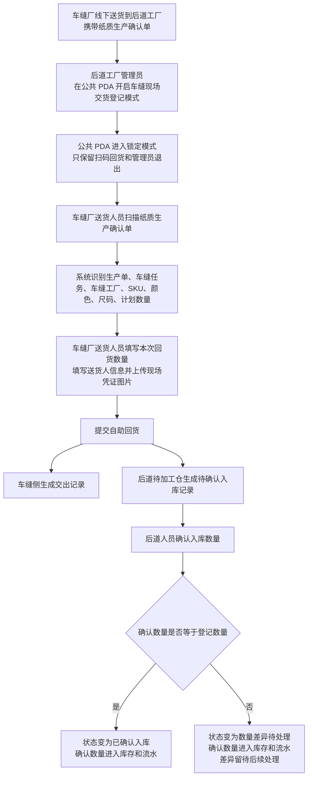
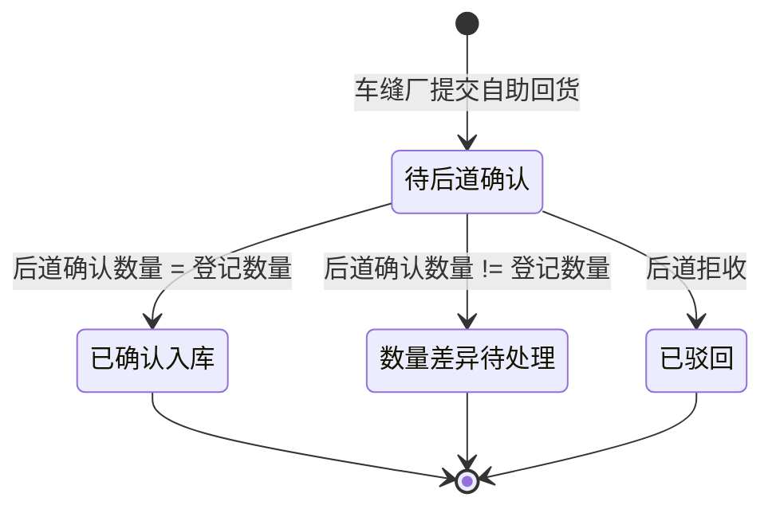
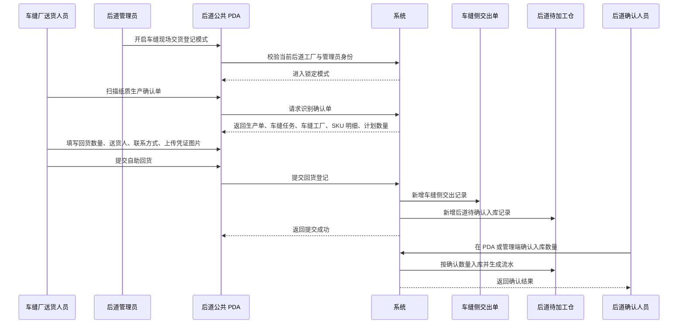

# 后道工厂新增“车缝厂自助回货”功能研发说明

## 1. 背景与目标

在实际生产中，存在车缝厂没有在自己的 PDA 上操作交出，而是线下把货直接送到后道工厂的情况。车缝厂送货时会携带纸质生产确认单。

本次新增“车缝厂自助回货”能力，目标是：

- 车缝厂送货人员到后道工厂后，可以使用后道工厂公共 PDA 扫纸质生产确认单，自助登记回货信息。
- 系统根据生产确认单识别生产单、车缝任务、车缝工厂、款式 SKU、颜色、尺码、计划数量等信息。
- 车缝厂提交后，系统同时生成两类业务结果：
  - 车缝侧：在该车缝任务对应的交出单下新增一条交出记录。
  - 后道侧：在后道待加工仓生成待确认的入库记录。
- 后道确认前，不进入后道可用库存，也不进入正式库存流水。
- 后道确认时允许修改实际入库数量，只有确认后的数量进入库存和流水。

## 2. 涉及菜单与页面

| 系统 | 菜单 / 页面 | 本次变化 | 主要使用人 |
|---|---|---|---|
| 工厂端移动应用 PDA | 交接 > 待领料 | 新增“车缝现场交货登记模式”入口与自助回货概览；待领料列表中展示“车缝自助回货”类记录，并与正常领料区分 | 后道工厂管理员、后道交接人员 |
| 工厂端移动应用 PDA | 车缝现场交货登记模式 | 新增锁定式自助登记页面，支持扫码、填写回货数量、上传现场凭证图片、提交自助回货、管理员验证退出 | 车缝厂送货人员、后道工厂管理员 |
| 工厂端移动应用 PDA | 交接 > 领料详情 | 支持车缝自助回货类领料记录确认；页面文案改为“来源车缝厂 -> 后道工厂”；明细按 SKU、尺码、颜色、数量展示 | 后道交接人员 |
| 工厂端移动应用 PDA | 仓管 > 后道待加工仓 | 支持查看车缝自助回货待确认记录，并可在移动端直接确认入库数量 | 后道仓管人员 |
| 工艺工厂运营系统 | 后道工厂管理 > 后道待加工仓 | 新增“待确认的车缝自助回货”页签；支持在管理端直接确认入库 | 后道管理人员、仓管主管 |
| 工艺工厂运营系统 | 后道工厂管理 > 后道待加工仓 > 库存 | 待确认的车缝自助回货不进入库存；确认后按确认数量进入库存 | 后道管理人员 |
| 工艺工厂运营系统 | 后道工厂管理 > 后道待加工仓 > 流水记录 | 待确认的车缝自助回货不进入正式流水；确认后生成“后道确认入库”流水 | 后道管理人员 |
| 工艺工厂运营系统 | 后道工厂管理 > 后道待加工仓 > 库区库位 | 展示固定暂存库位：后道待加工仓 / 车缝自助交货暂存区 / 默认库位 | 后道管理人员 |

## 3. 角色与权限

### 3.1 后道工厂管理员

- 只有后道工厂管理员可以在 PDA 的“交接 > 待领料”中看到“车缝现场交货登记模式”入口。
- 只有后道工厂管理员可以开启该模式。
- 退出该模式时，必须输入当前后道工厂管理员账号和密码，验证通过后才能退出。

### 3.2 车缝厂送货人员

- 不需要登录自己的 PDA。
- 使用后道工厂已经开启自助回货模式的公共 PDA。
- 扫描纸质生产确认单，登记本次送货的颜色、尺码、数量，并上传现场凭证图片。

### 3.3 后道交接 / 仓管人员

- 可以在 PDA 的“交接 > 待领料”中看到车缝自助回货类记录。
- 可以进入领料详情进行确认。
- 可以在 PDA 的“仓管 > 后道待加工仓”中确认入库。
- 可以在管理端“后道待加工仓 > 待确认的车缝自助回货”中确认入库。

## 4. 核心业务流程



## 5. 页面逻辑说明

### 5.1 PDA：交接 > 待领料

新增“车缝现场交货登记模式”模块：

- 仅后道工厂管理员可见。
- 展示自助回货记录数、待确认数量、固定暂存库位。
- 点击“开启”后进入锁定式自助回货页面。

待领料列表新增车缝自助回货类记录：

- 与正常领料记录区分展示。
- 来源显示为“来源车缝厂”，接收方显示为“后道工厂”。
- 记录中展示生产单、车缝任务、SKU 数量、待确认数量等关键信息。
- 可以进入领料详情查看和确认。

### 5.2 PDA：车缝现场交货登记模式

页面进入后，公共 PDA 被锁定为自助回货用途：

- 页面只保留车缝厂扫码回货、提交回货、最近自助回货、管理员退出。
- 不展示普通 PDA 菜单，避免车缝厂送货人员误操作后道工厂其他功能。
- 退出时弹出管理员验证窗口，必须通过当前后道工厂管理员账号和密码验证。

扫码识别规则：

- 只允许识别纸质生产确认单二维码。
- 识别成功后展示生产确认单、生产单、车缝任务、车缝工厂、默认入库位置。
- SKU 明细按颜色、尺码展示。
- 计划数量由车缝任务读取，不允许人工一键覆盖为计划数。

提交内容：

- 每个 SKU 的本次回货数量。
- 送货人姓名。
- 联系方式。
- 现场凭证图片，例如纸质确认单照片、包装箱照片、现场签名照片。

提交后结果：

- 生成车缝侧交出记录。
- 生成后道待加工仓待确认入库记录。
- 生成后道 PDA 待领料记录，供后道人员确认。
- 最近自助回货列表展示新提交记录。

### 5.3 PDA：交接 > 领料详情

针对车缝自助回货类记录，领料详情做了简化和业务化处理：

- 顶部不再展示“一个任务一个领料单”提示。
- 来源关系展示为“车缝厂 -> 后道工厂”。
- 领料方式展示为“车缝厂送达到厂”。
- 记录区标题展示为“车缝厂送达的领料记录”。
- 明细只保留一块，按 SKU、尺码、颜色、数量展示，避免重复信息干扰操作人员。

可执行动作：

- 确认本次领料：按当前记录数量确认入库。
- 数量有差异：登记差异数量和原因。
- 驳回：拒绝本次回货入库。

确认后：

- 后道待加工仓对应记录从待确认转为已确认或差异状态。
- 只有确认后的数量进入后道待加工仓可用库存。
- 生成正式入库流水。

### 5.4 PDA：仓管 > 后道待加工仓

后道待加工仓移动端支持查看车缝自助回货记录：

- 页面明确提示：车缝自助回货先待后道确认，确认后才计入可用数量。
- 列表展示来源类型、自助回货记录、登记数量、确认数量、可用数量、库区库位。
- 对待确认记录提供“确认入库”按钮。
- 确认时可修改后道确认数量，并填写备注。

### 5.5 管理端：后道工厂管理 > 后道待加工仓

新增页签：“待确认的车缝自助回货”。

该页签展示：

- 自助回货单。
- 来源与接收信息。
- SKU、颜色、尺码。
- 登记数量。
- 默认暂存库位。
- 当前状态。
- 确认入库操作。

确认入库弹窗展示：

- 来源车缝厂。
- 接收后道工厂。
- 送货人。
- 默认暂存库位。
- SKU 明细。
- 计划数。
- 登记数量。
- 后道确认数量。
- 确认备注。

库存页签规则：

- 待确认的车缝自助回货不展示为可用库存。
- 已确认入库、数量差异待处理的记录进入库存。
- 库存数量按后道确认数量计算。

流水记录页签规则：

- 待确认记录不进入正式流水。
- 确认后生成“后道确认入库”流水。
- 流水数量按后道确认数量记录。

## 6. 默认库位规则

车缝厂自助回货固定进入：

```text
后道待加工仓 / 车缝自助交货暂存区 / 默认库位
```

说明：

- 该库区库位由业务确认后固定，不提供配置入口。
- 业务含义是：车缝厂送来的货先落到后道待加工仓的自助交货暂存位置，后道人员后续再进行分拣、质检、调整库位或继续加工。
- 待确认阶段只是暂存记录，不计入可用库存。

## 7. 状态设计



### 状态含义

| 状态 | 含义 | 是否进入库存 | 是否生成正式流水 |
|---|---|---:|---:|
| 待后道确认 | 车缝厂已提交，后道尚未确认数量 | 否 | 否 |
| 已确认入库 | 后道确认数量与登记数量一致 | 是 | 是 |
| 数量差异待处理 | 后道确认数量与登记数量不一致 | 是，按确认数量 | 是，按确认数量 |
| 已驳回 | 后道拒收该次自助回货 | 否 | 否 |

## 8. 时序说明



## 9. 与原有业务的关系

### 9.1 与正常领料的关系

正常领料是“仓库 / 上游环节 -> 后道工厂”的交付确认。

车缝自助回货是“车缝厂 -> 后道工厂”的现场送货确认。

因此在 PDA 待领料列表和领料详情中必须区分：

- 正常领料：来源仓库或上游交付。
- 车缝自助回货：来源车缝厂，送达到后道工厂。

### 9.2 与车缝侧交出的关系

车缝厂虽然没有在自己的 PDA 操作交出，但提交自助回货后，系统要补齐车缝侧交出记录。

这样后续追溯时，车缝任务下仍然能看到该次交出记录，不会出现只有后道收货、没有车缝交出的断链。

### 9.3 与后道待加工仓的关系

车缝自助回货提交后先进入后道待加工仓的待确认区。

确认前：

- 不进入库存。
- 不进入正式流水。
- 只在“待确认的车缝自助回货”中展示。

确认后：

- 按后道确认数量进入库存。
- 生成正式入库流水。
- 如果确认数量与登记数量不同，状态标记为数量差异待处理。

## 10. 研发实现注意点

- 不要把“扫码提交”理解为车缝厂登录后道账号；实际是车缝厂送货人员使用后道工厂公共 PDA。
- 公共 PDA 进入自助回货模式后，需要锁定普通 PDA 功能，退出必须验证后道管理员。
- 生产确认单扫码后，计划数量只能从车缝任务读取，不提供“填入计划数”按钮。
- 现场凭证必须支持真实图片上传和预览，不是文本说明。
- 后道待加工仓的库存与流水必须以“确认数量”为准，不以车缝厂登记数量为准。
- 管理端和 PDA 都可以确认入库，确认逻辑口径必须一致。
- 待确认记录不能混入库存页签，避免后道人员误以为已经可用。
- PDA 面向印尼本土操作人员，领料详情需要尽量减少重复信息，关键明细按 SKU、尺码、颜色、数量分行展示。

## 11. 验收标准

### 11.1 权限与入口

- 后道工厂管理员可以在 PDA“交接 > 待领料”看到“车缝现场交货登记模式”入口。
- 非管理员看不到或不能开启该模式。
- 非后道工厂公共 PDA 不能进入该模式。
- 锁定模式退出必须验证当前后道工厂管理员账号和密码。

### 11.2 自助回货提交

- 扫描纸质生产确认单后，可以识别生产单、车缝任务、车缝工厂、SKU、颜色、尺码、计划数量。
- 只能扫描生产确认单，其他单据应拦截。
- 可以按 SKU 填写本次回货数量。
- 可以上传现场凭证图片，并在页面展示图片。
- 提交成功后，车缝侧生成交出记录。
- 提交成功后，后道待加工仓生成待确认入库记录。
- 新记录默认进入“后道待加工仓 / 车缝自助交货暂存区 / 默认库位”。

### 11.3 待确认与库存流水

- 待确认记录只出现在“待确认的车缝自助回货”页签，不进入库存页签。
- 待确认记录不进入正式流水记录。
- 确认入库后，按后道确认数量进入库存。
- 确认入库后，按后道确认数量生成正式流水。
- 确认数量与登记数量不一致时，状态为“数量差异待处理”。

### 11.4 PDA 待领料与领料详情

- PDA“交接 > 待领料”可以看到车缝自助回货记录。
- 车缝自助回货记录与正常领料记录有明显区分。
- 来源展示为车缝厂，接收方展示为后道工厂。
- 领料详情不展示“一个任务一个领料单”提示。
- 领料详情中物料明细只保留一块，并按 SKU、尺码、颜色、数量展示。
- 领料详情可以确认本次回货，也可以处理数量差异或驳回。

### 11.5 管理端后道待加工仓

- “后道待加工仓”新增“待确认的车缝自助回货”页签。
- 页签内可以直接确认入库，不跳转到 PDA。
- 确认弹窗支持修改后道确认数量。
- 确认弹窗支持填写备注。
- 确认后库存和流水立即按确认数量体现。
