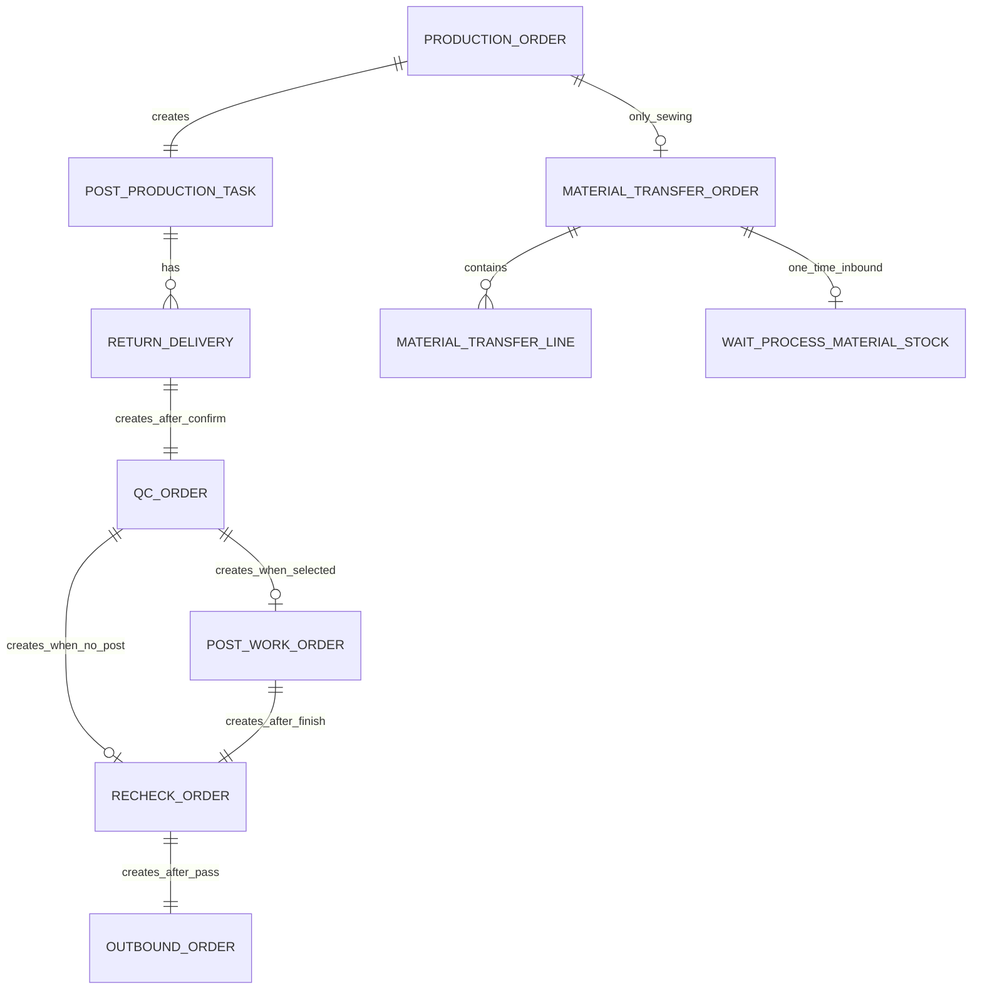
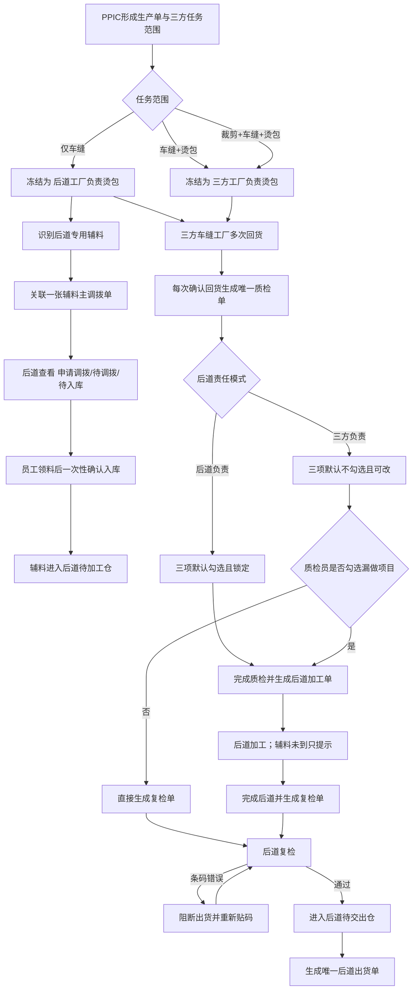
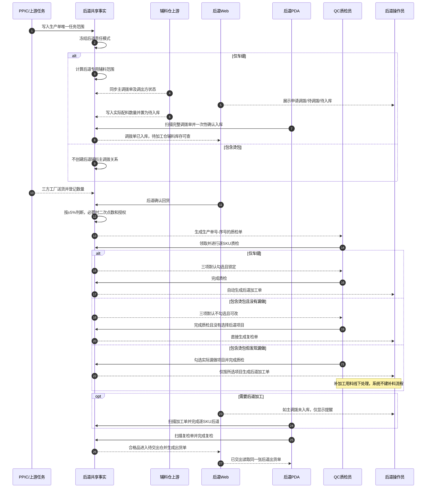
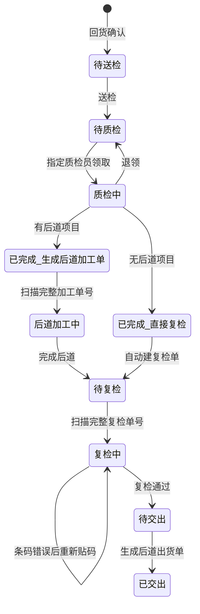
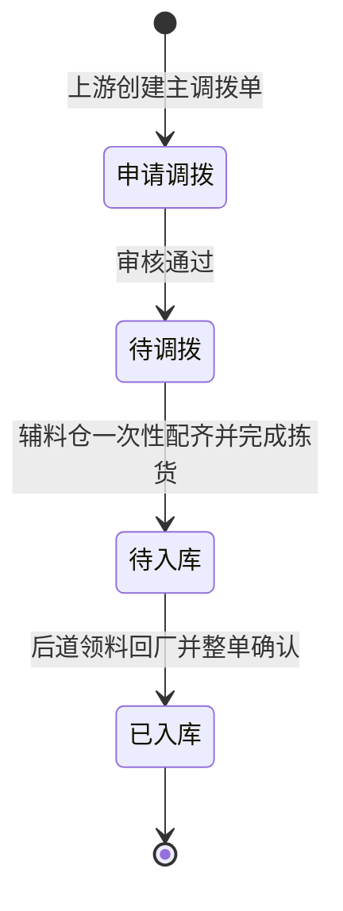

# 三方车缝责任、后道项目与辅料调拨完整调整方案

> 文档性质：业务与原型调整方案，不代表代码已经实施或验收通过。
> 方案版本：V1.0（2026-09-03）
> 核查分支：`codex/post-finishing-web-pda-fallback-20260902`
> 核查基线：`7fc29312954804675e3c24f32e6278002baf1107`
> 适用范围：后道工厂管理 Web、后道工厂 PDA，以及二者共同读取的后道全流程 Mock 事实。
> 设计原则：在现有页面、路由、菜单和操作方式上做增量迭代，不重构技术体系，不推翻已经形成的后道全流程。

## 1. 文档依据与事实优先级

本方案综合核查了以下事实源：

1. 用户本轮对三方车缝责任、质检默认后道项目、调拨入库和异常边界的明确确认。
2. 当前分支中的后道生产任务、回货、质检、后道加工、复检、待加工仓、待交出仓、后道出货单、日志、动态授权码、PDA 执行与交接代码。
3. 当前生产任务责任分类、生产单技术包/BOM/纸样关联、车缝配料交接和后道全流程 Mock 数据。
4. 《QC后道全流程系统功能需求》原始文档。
5. 既有后道方案、实施计划、追踪矩阵与测试契约。

发生冲突时，按“本轮用户确认 → 当前现场页面与运行事实 → 当前代码事实 → 原始需求文档 → 历史方案与旧测试”的顺序处理。原始文档中已经被用户明确调整的内容，不再作为本次最终规则。例如：辅料调拨差异不使用成衣数量差异授权；后道出货单不在后道工厂 PDA 上做成衣仓收货；三方工厂漏做烫包后的补料由线下处理。

### 1.1 本轮逐项核查的代码范围

本轮不是只检查两个仓库页面，而是沿着“上游任务责任 → 后道共享事实 → Web 页面 → PDA 页面 → 打印/测试”完整阅读相关代码。核查范围如下：

| 代码域 | 已核查文件 |
|---|---|
| 后道 Web 全部页面 | `audit-records.ts`、`authorization-code.ts`、`events.ts`、`full-flow-print.ts`、`outbound-orders.ts`、`qc-orders.ts`、`qc-workbench.ts`、`recheck-orders.ts`、`shared.ts`、`statistics.ts`、`tasks.ts`、`warehouse.ts`、`work-order-detail.ts`、`work-orders.ts` |
| 后道专用数据 | `post-finishing-authorization.ts`、`post-finishing-document-numbering.ts`、`post-finishing-domain.ts`、`post-finishing-full-flow.ts`、`post-finishing-operation-log.ts`、`post-finishing-outbound-orders.ts`、`post-finishing-qc-reference.ts`、`post-finishing-spu-technical-parameters.ts` |
| 上游任务/BOM 关联 | `task-fulfillment-policy.ts`、`merged-production-task.ts`、`sewing-material-handover.ts`，以及生产单技术包快照、BOM 和纸样关联定义 |
| Web 菜单/路由/事件 | `app-shell-config.ts`、`routes-fcs.ts`、`route-renderers-fcs.ts`、后道页面事件处理器 |
| 后道 PDA | `pda-exec.ts`、`pda-exec-detail.ts`、`pda-exec-progressive-list.ts`、`pda-handover.ts`、`pda-handover-detail.ts`、`pda-post-finishing-flow.ts`、`pda-warehouse.ts`、`pda-warehouse-wait-process.ts`、`pda-warehouse-wait-handover.ts` 及相关仓管子页 |
| 打印与单据映射 | `post-finishing-qc-print-template.ts`、`post-finishing-route-card-template.ts`、`post-finishing-outbound-template.ts`、`task-print-cards.ts`、`print-template-registry.ts` |
| 专项验证 | `scripts/check-post-finishing-*.ts`、`scripts/check-process-factory-tabs-and-post-finishing.ts`、`tests/post-finishing-*.spec.ts`、`tests/process-factory-tabs-and-post-finishing.spec.ts`，以及 PDA 交接相邻回归 |

核查结论只用于制定本方案；本轮没有修改上述源代码，也没有把当前工作区中其他未提交改动计入本方案交付。

## 2. 当前代码与页面核查结论

### 2.1 已有基础，可以直接增量复用

| 现有能力 | 当前实现情况 | 本次处理原则 |
|---|---|---|
| 生产任务责任分类 | 已存在“仅车缝”“车缝＋烫包”“裁剪＋车缝＋烫包”三类责任分类，并有统一分类函数 | 直接作为上游权威来源，不在后道另造一个可编辑责任类型 |
| 一单到底主链 | 已形成“生产单 → 多次回货 → 每次一个质检单 → 后道加工/直接复检 → 复检 → 出货”的单号链和事件记录 | 保留现有编号和链式传递，只补责任快照、辅料调拨单关系和分支原因 |
| 回货与 5% 授权 | 已按工厂登记数量为分母逐 SKU 判断 ±5%，超出后要求二次点数和动态授权 | 不修改；该规则只用于工厂成衣回货，不扩散到辅料调拨 |
| 质检任务领取 | 一个质检任务对应一个质检员，支持占用提示和退领 | 不修改领取模型 |
| 质检数量模型 | 合格、瑕疵原因数量、返工数量已能按 SKU 记录，瑕疵总数由原因汇总，返工工厂按数量显示 | 继续沿用，不为本次责任分支重做质检表单 |
| 质检完成分支 | 旧领域模型已具备“勾选后道项目则建后道加工单，不勾选则直达复检”的分支能力 | 把责任模式默认值和可编辑性接到这一现有分支，不再另建流程 |
| 后道加工与复检 PDA | 已有精确输入/扫描单号、逐 SKU 执行、数量差异授权、条码阻断及重新贴码逻辑 | 只增加责任和辅料提示，不改操作主路径 |
| 待加工仓/待交出仓 | 已按线上样式形成统计卡、页签、筛选、标准库存表、库存明细和流水入口 | 必须保持默认页面外观和操作习惯；新增能力放在新页签或关联入口，不混排 |
| 动态授权码 | 已有指定人员、30 秒刷新、一次使用的动态授权码模型 | 仅继续服务成衣差异授权，不用于辅料调拨入库 |
| SPU 技术参数 | 已有颜色对照图、尺码尺寸图、维护状态和质检右栏展示 | 不在本次重复建设 |
| PDA 交接 | 后道工厂已保留“待接收/已交出”，车缝自助回货入口也被保留 | 辅料调拨待入库复用“待接收”的现场入口，但与成衣回货分组展示 |

### 2.2 当前缺口与冲突

1. 后道全流程主事实中，回货记录带有上游任务类型，但质检单和后续单据没有冻结“本生产单由谁负责烫包”的责任快照。后续页面无法稳定判断默认项目、是否可改和是否需要辅料。
2. 当前全流程完成质检的核心动作实际上总是创建后道加工单，并默认写入固定项目；它没有真正执行“无后道项目则直接复检”的分支。
3. 另一套现有质检页面模型虽然已支持“有项目建加工单、无项目直达复检”，但其默认值尚未由三方车缝责任类型驱动。
4. 当前演示数据把已推进的质检场景都按“需要后道加工”处理，不能证明三种责任模式均走通。
5. 当前车缝配料交接只对一类任务初始化，且直接纳入全部面料/辅料；没有按照“纸样关联”“物料标题关键词”“物料 SPU 前缀”分流。
6. 当前没有后道辅料主调拨单对象、状态页、一次性入库动作，也没有把该调拨单关联到后道生产任务和待加工仓。
7. 待加工仓目前只表达成衣待加工库存；如果直接把辅料行塞入现有成衣表，会破坏线上页面的数量口径、列定义和用户认知。
8. 现有专项测试中存在“每次质检都生成后道加工单”的旧断言，必须按本轮确认规则更新，不能用旧测试反向约束新业务。
9. 现有代码内仍保留后道出货单“仓库收货”的底层兼容动作，但后道工厂 PDA 已不再承担成衣仓收货。本次不得重新暴露该入口。

### 2.3 本次明确不做的重构

- 不把 Vanilla TypeScript 页面迁移为 React，不引入新状态框架、领域层或后端接口体系。
- 不合并或推翻现有两组后道数据模型；使用最小责任快照和投影适配，让仍在使用旧模型的页面继续工作。
- 不更改现有 Web 主路由、页面标题、顶部系统导航、后道模块菜单分组和 PDA 底部导航。
- 不重做待加工仓和待交出仓；保留线上式统计卡、页签、筛选、分页、库存明细和流水结构。
- 不修改 PPIC 分配页面、辅料仓创建/审核/拣货页面、车缝配料原型和成衣仓收货原型。
- 不建设真实后端、消息中心、离线队列或真实库存数据库；本仓库仍为高保真原型，使用同源 Mock 事实演示。

## 3. 目标与非目标

### 3.1 目标

1. 生产单的三方工厂责任一经形成，就贯穿回货、质检、后道加工、复检、出货和辅料调拨展示。
2. 质检单根据责任模式自动给出正确的后道项目默认值、可编辑性和完成去向。
3. “仅车缝”的生产单能够在后道工厂查看后道辅料调拨状态，并在辅料仓备妥后一次性入库到后道待加工仓。
4. 辅料未入库时只提醒、不阻断后道加工；三方工厂漏做的补加工用料由线下处理，系统不扩展补料流程。
5. Web 与 PDA 读取同一责任、单据、状态和数量事实；管理端可追溯，现场端保持少选、少填、精确扫码。
6. 保持现有后道待加工仓和后道待交出仓的线上风格与主要信息结构。

### 3.2 非目标

- 不实现辅料仓如何创建申请调拨单、谁审核、如何拣货分拣。
- 不实现 PPIC 如何在分配页面选择“仅车缝”或“包含烫包”。
- 不实现上游车缝配料清单页面的重新编排；本方案只明确后道所需的输入契约。
- 不处理三方工厂漏做烫包后的系统补料、补充调拨、扣款或责任追偿。
- 不允许分批入库，不设计补料单，也不设计调拨数量差异授权。
- 不改变成衣回货、质检、加工、复检和出货现有数量授权规则。

## 4. 业务术语与统一口径

### 4.1 三种上游任务类型

| 上游任务类型 | 后道责任模式 | 质检默认项目 | 质检是否可改 | 默认质检去向 | 是否需要后道辅料主调拨单 |
|---|---|---|---|---|---|
| 仅车缝 | 后道工厂负责烫包 | 开扣眼、装扣子、熨烫和包装，全部勾选 | 不可改 | 自动生成后道加工单 | 是 |
| 车缝＋烫包 | 三方工厂负责烫包 | 默认全部不勾选 | 可勾选漏做项目 | 未勾选则直接生成复检单；有勾选才生成后道加工单 | 否 |
| 裁剪＋车缝＋烫包 | 三方工厂负责烫包 | 默认全部不勾选 | 可勾选漏做项目 | 未勾选则直接生成复检单；有勾选才生成后道加工单 | 否 |

说明：

- 页面把现有内部“烫包”项目统一展示为“熨烫和包装”，仍视为一个组合后道项目，不在本次拆成两套独立工序。
- 一个生产单只能冻结一种责任模式。即使分配给多个三方车缝工厂，也不能出现 A 工厂仅车缝、B 工厂同时承接烫包的混合情况。
- 后道工厂只读取责任模式，不允许在后道页面修改。若上游传入同一生产单责任不一致，系统应提示“生产单任务范围不一致，请联系 PPIC 核对”，不得让操作员自行选一种继续，也不为这种理论上不可能的情况建立纠错流程。

### 4.2 后道项目

本次后道项目保留三项：

1. 开扣眼。
2. 装扣子。
3. 熨烫和包装。

“仅车缝”时三项全部为系统锁定值；“包含烫包”时三项是用于记录三方工厂漏做的补加工项目。已完成质检后，项目集合冻结，不允许在后道加工单再增删。

### 4.3 辅料调拨数量

- 调拨申请数量用于说明最初需求，不作为后道入库时要求重新点数和授权的分母。
- 调出方完成实际配料后形成“实际配料数量”，它是后道工厂本次应收和入库的权威数量。
- 后道只允许整张主调拨单一次性确认入库；不允许按行、按包或按日期分批入库。
- 入库页面不提供“少收”“多收”“部分接收”“补料”或动态授权入口。
- 如果现场实物与调拨单无法对应，操作员不提交入库，联系辅料仓线下核对；系统不创建一张部分入库记录。

## 5. 业务对象与一单到底关系

业务基数必须固定为：

- 一个生产单对应一个后道生产任务。
- 一个后道生产任务可以有多次回货。
- 一次确认回货只生成一个质检单，质检单号严格为“生产单号-本生产单回货序号”。
- 一个质检单最多生成一张后道加工单；没有后道项目时不生成。
- 无论是否经过后道加工，一个质检单最终只进入一张复检单。
- 一张复检单只对应一张后道出货单。
- “仅车缝”的一个生产单最多对应一张后道辅料主调拨单；不存在分批和补充调拨单。

## 6. 总体业务流程

## 7. 跨角色时序

## 8. 状态设计

### 8.1 质检与下游状态图

### 8.2 辅料主调拨单状态图

状态约束：

- 后道 Web 对“申请调拨、待调拨”只读；“待入库”表示调出方已经准备好，可以安排人员领料。
- PDA 只允许对“待入库”的完整调拨单执行一次确认；重复扫描显示“该调拨单已于 XX 入库”，不得再次增加库存。
- 不存在“部分入库”“差异待授权”“补料中”等状态。
- “已入库”写入操作人、时间、来源辅料仓、目标后道待加工仓和逐物料实际配料数量。

## 9. 数据与规则设计

### 9.1 生产单责任快照

在现有后道全流程事实上增加最小快照，不建立新的可编辑主数据：

| 字段 | 说明 |
|---|---|
| 上游任务类型 | 仅车缝、车缝＋烫包、裁剪＋车缝＋烫包 |
| 后道责任模式 | 后道负责烫包 / 三方负责烫包 |
| 默认后道项目 | 三个固定项目或空集合 |
| 项目是否可编辑 | 仅车缝为否；包含烫包为是 |
| 快照来源 | PPIC 生产任务分类结果 |
| 冻结时间 | 后道生产任务首次建立时 |

该快照从生产单传到每次回货、质检单，并在后道加工单、复检单、出货单详情中只读展示来源。历史链不能因为上游后来调整标签而改变。

### 9.2 后道专用辅料识别

仅当生产单为“仅车缝”时，按下列任一条件识别后道专用辅料：

1. 物料标题包含“吊牌”。
2. 物料标题包含“吊粒”。
3. 物料标题包含“扣”或“扣子”。
4. 物料 SPU 编码以前缀 `FLBF` 开始。

命中多个条件时只保留一条物料明细。标题匹配使用去除首尾空格后的实际标题，SPU 前缀匹配忽略大小写，但页面展示原始编码和标题。

这些物料在上游业务上不应进入车缝配料，而应进入“辅料仓 → 后道待加工仓”的一张主调拨单。本次后道模块只接收调拨单及明细，不实现上游清单生成页面。

### 9.3 纸样关联判断

“需要裁剪”不得通过物料名称猜测，必须以生产单技术包快照中的真实纸样关联为准。兼容当前数据结构时同时识别：

- BOM 物料自身保存的纸样关联；
- 纸样文件反向关联的 BOM 明细或物料。

只要任一方向存在有效关联，该物料就属于需要裁剪的物料。

对于“车缝＋烫包”与“裁剪＋车缝＋烫包”，上游车缝配料的规则应为：除需要裁剪的物料外，其余 BOM 物料全部归三方工厂。该规则作为后道责任来源的契约记录在本方案中，但车缝配料页面不属于本次实施范围。

### 9.4 辅料主调拨单

| 信息组 | 必须保存/展示的内容 |
|---|---|
| 关联信息 | 调拨单号、生产单号、后道生产任务号、任务范围、来源辅料仓、目标后道待加工仓 |
| 状态信息 | 当前状态、状态更新时间、审核/拣货/入库时间和对应操作人 |
| 明细信息 | 物料实图、物料名称、物料编码、物料 SPU、颜色/规格、单位、申请数量、实际配料数量 |
| 入库事实 | 一次性入库批次、入库总数量、逐物料入库数量、确认人、确认时间 |
| 追溯信息 | 状态变化日志、扫码/输入的完整调拨单号、重复提交结果 |

调拨单入库后，待加工仓中形成的是“辅料库存”，不能伪装成成衣 SKU 库存。成衣库存和辅料库存必须分开统计、分开列表、共享仓库归属但不共用列定义。

### 9.5 辅料到位提示

只有以下条件同时满足时，后道加工单显示辅料到位状态：

- 生产单任务类型为“仅车缝”；
- 该生产单存在后道辅料主调拨单；
- 当前后道加工单来自正常责任项目，而非“三方工厂漏做”的补加工项目。

显示规则：

| 调拨状态 | Web/PDA 提示 | 是否允许开始后道 |
|---|---|---|
| 申请调拨 / 待调拨 | 后道辅料尚未备妥，请关注调拨进度 | 允许 |
| 待入库 | 后道辅料已由辅料仓备妥，请领料并完成入库 | 允许 |
| 已入库 | 后道辅料已入待加工仓 | 允许 |
| 不适用 | 不显示辅料提示 | 允许 |

提醒不得覆盖、禁用或替代“开始后道”主动作。系统记录操作员在未到料状态下开始加工的事实，但不新增审批和阻断。

## 10. Web 端调整方案

### 10.1 后道生产任务

保留现有标准列表、筛选、分页和“回货记录/质检单”弹窗，在此基础上增加：

- 列表增加“任务范围”列，显示“仅车缝”“车缝＋烫包”或“裁剪＋车缝＋烫包”。
- 增加“后道责任”简短标识：后道负责 / 三方负责。
- 仅车缝任务显示“辅料调拨”状态；其他两类显示“不适用”。
- 行操作增加“查看辅料调拨”，只对仅车缝任务显示；点击打开该生产单唯一主调拨单详情。
- 现有“回货记录”和“质检单”弹窗同步展示任务范围，但不改变原有编号、日期、数量和状态信息。
- 不在任务页提供修改任务范围或手工创建调拨单的按钮。

### 10.2 质检单列表

保留当前页面右上角“新增 SPU 技术参数”、打印按钮的既定边界、标准列表和领取动作，增加：

- “任务范围”或“后道责任”列。
- “后道项目规则”列：固定三项 / 质检判断。
- 详情中说明完成后的目标：“将生成后道加工单”或“未选择项目时直接复检”。
- 已完成记录展示当时冻结的后道项目，不按上游新值回算。

### 10.3 Web 质检工作台

继续沿用现有两栏布局：左侧逐 SKU 质检，右侧 SPU 技术参数。只调整“后道项目”区：

#### 仅车缝

- 默认勾选“开扣眼、装扣子、熨烫和包装”。
- 三项复选框置为只读锁定态，并显示“本生产单由后道工厂完成以上项目，不能取消”。
- 完成按钮文案明确为“完成质检并生成后道加工单”。

#### 车缝＋烫包、裁剪＋车缝＋烫包

- 三项默认均不勾选，质检员可按实际漏做情况选择一项或多项。
- 提示“第三方工厂已承接烫包；只有发现漏做时才勾选”。
- 未勾选时完成按钮显示“完成质检并进入复检”。
- 有勾选时完成按钮显示“完成质检并生成后道加工单”。
- 后道加工单只包含被勾选的项目。

不新增“补料来源”“补料调拨”或“异常补料待到位”字段。

### 10.4 后道加工单及详情

保留当前列表、筛选、开始后道弹窗、逐 SKU 明细和完整单号输入方式：

- 增加“任务范围”“后道责任”“辅料状态”三个只读信息。
- 仅车缝且辅料未入库时，以黄色提示条显示进度；“开始后道”按钮保持可用。
- 待入库时提供“查看调拨单”链接，不在加工单内完成入库。
- 三方工厂漏做形成的加工单标记“质检补加工”，不显示主调拨未到提示。
- 加工项目严格读取质检完成时冻结的集合，不允许后道操作员自行增加或删除。

### 10.5 新增“后道辅料调拨单”菜单

在“后道生产任务”之后、“质检单”之前增加一个同级菜单，建议路由：

`/fcs/craft/post-finishing/material-transfers`

该页面使用现有标准管理列表样式，不单独设计一套视觉：

- 顶部单行摘要：申请调拨、待调拨、待入库、已入库。
- 筛选：调拨单号/生产单号、来源辅料仓、当前状态、状态更新时间。
- 列表：调拨单号、生产单号及款式实图、任务范围、来源/目标、物料种数、实际配料总数、状态、更新时间、操作。
- 操作只有“查看详情”；Web 页面不提供创建、审核、拣货、部分入库或补料。
- 详情采用弹窗或抽屉，只展示单据头、逐物料实图与明细、状态时间线和一次性入库结果。
- 状态为待入库时突出“辅料已备妥，请前往辅料仓领料”，但不伪造消息推送能力。

### 10.6 后道待加工仓——重点增量调整

这是现在线上已经成熟的仓库页，必须保留当前默认结构：

1. 页面标题仍为“后道待加工仓”。
2. 默认仍进入“库存”页签。
3. 顶部四张统计卡仍表达成衣待加工在仓、成衣 SKU 种数、库区/库位、成衣流转记录。
4. 现有“库存、流水记录、库区库位、车缝登记回货”页签、筛选条、分页、成衣表格列和行操作不改名、不换位。
5. 现有扫码/输入收货及送检路径不因辅料调拨而改变。

在现有页签末尾增量增加“辅料库存”页签：

- 未点击时不改变默认成衣统计和表格。
- 点击后在相同内容区域展示辅料专用摘要：在仓物料种数、在仓总数量、关联生产单数、入库记录数。
- 筛选：物料编码/名称/物料 SPU、生产单号、调拨单号、库区库位。
- 列表：物料实图＋名称/编码、物料 SPU/规格、关联生产单/调拨单、实际入库数量、当前库存、库区库位、入库时间、操作。
- 操作：库存明细、查看库存流水、查看关联调拨单。
- 辅料入库流水使用“辅料调拨入库”，不得写成“工厂回货”或“质检入库”。
- 辅料实图必须与物料对应，可打开大图并有加载失败提示；缺图时记录素材阻塞，不使用色块或通用占位图冒充。

这样既让辅料进入同一个“后道待加工仓”，又不会把物料数量混入成衣 SKU 的 5965 条式统计，避免改得面目全非。

### 10.7 后道待交出仓——重点保持与补充

待交出仓只承载已经完成复检、等待生成/确认出货的成衣，不承载辅料。因此：

- 页面标题、四张统计卡、默认“库存”页签、流水记录、库区库位、筛选、分页和成衣表格保持现状。
- 不增加辅料页签，不显示调拨单状态，不混入物料行。
- 无后道项目而“质检直达复检”的合格品，与经过后道加工再复检的合格品，均按同一规则进入待交出仓。
- 库存明细增加只读链路来源：“质检直达复检”或“后道加工后复检”，并可继续追溯到生产单、回货单、质检单和复检单。
- 现有“可出库”筛选和后道出货单关系保持不变。

### 10.8 复检单、后道出货单

- 复检单增加“来源类型”：质检直达 / 后道加工后。
- 质检直达时，后道加工单位置明确显示“不适用”，不能显示“未生成”造成误解。
- 条码错误继续阻断出货并要求重新贴码；修正后才可继续。
- 一张复检单只生成一张后道出货单，现有唯一性规则不变。
- 后道出货单详情保留完整生产单—回货—质检—加工（可不适用）—复检链路。
- 后道工厂端不提供“扫描后道出货单收货”；成衣仓确认属于外部下游。

### 10.9 差异与操作日志、统计、动态授权码

- 日志新增“责任模式冻结”“质检分支”“辅料调拨状态”“辅料整单入库”事件。
- 辅料调拨事件记录状态、实际配料数量、操作人和时间，但没有授权人、授权码和差异方向。
- 日志详情仍只显示当前链的详情和时间线，不在详情下方重复铺设整页搜索和日志列表。
- 统计增加“按任务范围的生产单数”“质检直达复检数”“质检补加工数”“主调拨待入库数”，但不改变原有成衣数量统计口径。
- 动态授权码页面不新增辅料调拨用途说明，避免现场误认为辅料入库需要授权。

## 11. PDA 端调整方案

### 11.1 端与角色边界

- QC 质检继续只在 Web 进行，不在 PDA 增加质检表单。
- 后道工厂“执行”继续只有后道加工和后道复检，不恢复其他印花/染色任务。
- “交接”继续保留“待接收/已交出”和“开启车缝自助回货”。
- “仓管”不恢复“扫描后道出货单收货”。

### 11.2 交接—待接收

在当前“待接收”页签内按业务对象分成两个清晰区块，不增加新的底部导航：

1. 成衣回货待接收：保留当前扫描送货单点数确认、逐 SKU 明细、±5% 二次点数和授权。
2. 后道辅料待入库：只显示状态为“待入库”的主调拨单。

辅料卡片展示调拨单号、生产单号、来源辅料仓、目标后道待加工仓、物料种数、实际配料总数和备妥时间。操作流程：

1. 点击“扫描调拨单入库”。
2. 扫描或输入完整调拨单号，不提供模糊候选。
3. 展示调拨单头和全部物料明细；每条显示实图、名称、编码、物料 SPU、规格、单位和实际配料数量。
4. 操作员核对后点击“整单确认入库”。
5. 二次确认文案明确“本调拨单将一次性全部入库，不支持部分入库”。
6. 成功后显示入库人、时间和目标仓，卡片从待入库移除，Web 状态同步为已入库。

页面不提供数量编辑、差异按钮、授权码、按行勾选和补料按钮。

### 11.3 执行—后道加工

- 扫描加工单后展示任务范围和实际加工项目。
- 仅车缝的加工单若辅料未入库，在单据摘要下显示黄色提醒，但查询、开始和提交按钮保持可用。
- 提醒提供“查看调拨状态”入口，返回后保持当前加工上下文。
- 由三方漏做形成的加工单显示“质检补加工”，不询问补料来源。
- 保留现有返回按钮、逐 SKU 图片、完成数量、差异授权和重复提交防错。

### 11.4 执行—后道复检与交接—已交出

- 复检页展示来源“质检直达”或“后道加工后”，不要求操作员理解缺失的后道加工单号。
- 复检数量差异、条码错误和重新贴码沿用现有规则。
- “已交出”继续读取 Web 后道出货单同一事实，不新增发起交出或成衣仓收货动作。
- 无论从哪条分支进入复检，出货后的 SKU 明细、数量和单号必须一致。

## 12. Mock 数据与完整场景

继续使用“3 个生产单 × 每单 5 个 SKU × 每单 5 次回货”的验收体量，但三张生产单必须分别代表三种责任模式：

### 12.1 生产单 A：仅车缝

- 5 个 SKU，BOM 同时含吊牌、吊粒、纽扣、`FLBF` 物料和普通车缝物料。
- 一张后道辅料主调拨单，演示申请调拨、待调拨、待入库、已入库的时间线。
- 5 次回货全部生成质检单；质检三项锁定，全部生成后道加工单。
- 至少一张加工单在辅料待入库时开始，页面只提示且仍可提交。

### 12.2 生产单 B：车缝＋烫包

- 5 个 SKU，不建立后道辅料主调拨单。
- 其中多数质检不勾选后道项目，直接生成复检单。
- 至少一次质检发现漏做“装扣子”，只生成包含“装扣子”的补加工单。
- 漏做所需物料不进入系统补料流程。

### 12.3 生产单 C：裁剪＋车缝＋烫包

- 5 个 SKU，BOM 同时具有有纸样关联和无纸样关联的物料，用于证明责任来源识别正确。
- 不建立后道辅料主调拨单。
- 至少一次质检勾选“熨烫和包装”，其余质检直达复检。

### 12.4 15 次回货应覆盖的业务场景

- 回货无差异、恰好 +5%、恰好 -5%、超过 +5%、超过 -5%。
- 超限后第二次点数一致、动态授权成功、授权码过期、授权码重复使用。
- 一个质检员领取、其他质检员扫码提示占用、错误领取后退领。
- 合格、多个瑕疵原因汇总、返工且选择返工工厂、质检直达复检、质检补加工。
- 辅料调拨四个状态、待入库一次性确认、重复扫描已入库单。
- 辅料未到仍开始后道。
- 后道数量存在差异需授权、复检数量存在差异需授权。
- 条码错误阻断、重新贴码后通过。
- 复检单和后道出货单一一对应，PDA 已交出与 Web 出货单一致。

Mock 只作为原型验收数据，不能在文档或页面中表述为真实工厂已经发生的业务记录。

## 13. 兼容与迁移方案

### 13.1 最小增量策略

1. 在现有上游任务分类函数基础上产生统一责任快照，不复制判断条件到每个页面。
2. 在现有后道全流程状态中增加责任快照、调拨单和辅料库存；保留现有单号、事件、localStorage 键和历史记录结构。
3. 对仍读取旧后道页面模型的页面增加轻量投影适配，不进行一次性大迁移。
4. 质检完成动作改为真正执行“有项目生成加工单、无项目生成复检单”；复用已有分支构造函数。
5. 待加工仓新增页签，不替换原成衣仓库页面；待交出仓只补来源展示。
6. PDA 复用现有交接和执行外壳，不创建第二套后道 PDA 应用。

### 13.2 历史数据

- 历史记录若已有上游任务类型，则按统一分类函数补出责任快照。
- 历史记录无法判断时显示“历史责任未标记”，只读，不自动改写为仅车缝。
- 已完成的质检单以其已经生成的下游单据为准，不反向删除后道加工单或改成直达复检。
- 已存在的成衣待加工/待交出库存、流水和出货单不重新计算。
- 演示数据版本升级时只补新字段和新场景，不清空用户在本地已演示的无关模块数据。

## 14. 文件与实现落点

| 业务能力 | 现有落点 | 增量调整 |
|---|---|---|
| 责任分类 | `src/data/fcs/task-fulfillment-policy.ts`、`merged-production-task.ts` | 保留为上游权威，增加后道责任投影/快照函数 |
| 后道全流程 | `src/data/fcs/post-finishing-full-flow.ts` | 增加责任快照、调拨单、辅料库存；修正质检完成分支和演示推进 |
| 旧页面模型适配 | `src/data/fcs/post-finishing-domain.ts` | 仅增加读取新责任和项目集合的兼容投影，不重写整文件 |
| BOM/纸样识别 | 当前生产单技术包快照和纸样关联数据 | 增加小型纯函数，双向识别纸样关联；只供责任/调拨投影调用 |
| 单号 | `src/data/fcs/post-finishing-document-numbering.ts` | 保留质检单格式；补调拨单演示编号规则，不改变已有编号 |
| 操作日志 | `src/data/fcs/post-finishing-operation-log.ts` | 增加调拨和责任/分支事件，明确无授权字段 |
| Web 菜单与路由 | `src/app-shell-config.ts`、`src/router/routes-fcs.ts`、`route-renderers-fcs.ts` | 增加“后道辅料调拨单”菜单、列表和详情路由 |
| 任务/QC/加工/复检/出货 | `src/pages/process-factory/post-finishing/` 对应页面 | 增量增加责任、分支、辅料状态，不推翻列表和弹窗结构 |
| 两个仓库 | `src/pages/process-factory/post-finishing/warehouse.ts` | 待加工仓增加辅料库存页签；待交出仓只增加来源追溯 |
| PDA 交接 | `src/pages/pda-handover.ts`、`pda-handover-detail.ts` | 待接收增加辅料分组和一次性入库详情，保留自助回货和已交出 |
| PDA 执行 | `src/pages/pda-post-finishing-flow.ts`、`pda-exec.ts` | 增加责任/辅料提示和直达复检来源，不改变精确扫码主流程 |
| 打印 | 现有后道质检/加工/复检/出货打印模板 | 只补责任和来源字段；不在非质检页面恢复错误的质检打印按钮 |
| 契约与 UI 测试 | `scripts/`、`tests/` 中后道专项 | 更新旧的“总建加工单”断言，补三类责任、调拨和 3×5×5 跨端场景 |

## 15. 验收标准

### 15.1 业务验收

1. 三种任务类型在后道生产任务、回货、质检和下游详情中显示同一责任模式。
2. 同一生产单不能出现混合任务范围；后道没有可编辑责任入口。
3. 仅车缝的质检单三项默认勾选且不可改，完成后一定生成后道加工单。
4. 其余两类默认不勾选且可改；无选择直达复检，有选择只生成所选项目的加工单。
5. 仅车缝的后道专用辅料识别符合标题和 `FLBF` 规则，且一张生产单只有一张主调拨单。
6. 主调拨单只按“申请调拨 → 待调拨 → 待入库 → 已入库”流转；不允许分批、补料和差异授权。
7. 实际配料数量是入库权威数量；整单入库后辅料进入待加工仓辅料库存和流水。
8. 辅料未入库时 Web/PDA 均提醒但不阻断开始和完成后道。
9. 三方工厂漏做后的补加工不触发系统补料或主调拨阻断。
10. 无论是否经过后道加工，最终均形成一张复检单和一张对应的后道出货单。

### 15.2 Web 页面验收

- 按 1366×768 验收所有相关标准列表、弹窗、仓库页签和详情；最低再看 1280×720。
- 后道待加工仓默认打开时，与现有线上式页面的标题、四卡、页签顺序、筛选、表格和分页一致；新增辅料页签不改变默认统计。
- 后道待交出仓保持原有库存页，不出现辅料行或调拨功能。
- 每个款式和物料均有真实对应图片、可看大图、可关闭、可按 Esc 关闭，并有加载失败反馈。
- 质检工作台两栏布局、逐 SKU 质检和 SPU 技术参数不因新增责任判断而退化。

### 15.3 PDA 页面验收

- 以项目实际 390×844 和 480×800 视口验收，不横向溢出，首屏主动作明确。
- 成衣回货和辅料入库分组清晰，不能把成衣 ±5% 授权套在辅料调拨上。
- 扫描完整调拨单号后能看到全部物料实图和数量，只能整单确认一次。
- 后道加工未到料提示出现时，主按钮仍可用。
- Web 后道出货单与 PDA“已交出”的单号、SKU、数量和状态同源。

### 15.4 自动化与交付门禁

- 责任分类、纸样关联、辅料识别、质检分支、一次性入库、库存投影和单据唯一性有直接契约。
- 更新并通过后道全流程、Web/PDA 回退、管理页对齐、跨端 UI、打印和角色边界专项检查。
- 使用 3 个生产单、每单 5 个 SKU、每单 5 次回货完成 15 条业务链，不能用一条 Mock 重复截图替代。
- 最后一次代码修改后重新执行浏览器 Web/PDA 命名页面验收、构建、治理检查、CodeGraph 同步和任务收据。
- 本地构建或 Mock 走通不等于生产部署、真实 PDA、真实扫码枪或打印机验收；交付报告必须分别标识证据边界。

## 16. 已确认规则清单

以下内容已经由用户确认，本次实施不再作为待确认项：

1. 仅车缝时，后道项目默认全选且不可改，并自动生成后道加工单。
2. 车缝＋烫包与裁剪＋车缝＋烫包按同一后道责任处理。
3. 包含烫包时默认无后道项目；质检发现漏做才手工勾选。
4. 三方工厂漏做时的用料线下解决，系统不管理。
5. 仅车缝时，指定关键词和 `FLBF` 前缀物料进入后道辅料调拨。
6. 后道可查看调出方状态；待入库代表辅料仓已经准备好。
7. 主调拨单不允许分批入库，调出方实际配料数量是权威数量，不考虑补料。
8. 辅料调拨不套用成衣回货/后续差异动态授权规则。
9. 辅料未入库只提示，不阻断后道加工。
10. 本轮只设计后道工厂管理 Web/PDA，不实现 PPIC、辅料仓和车缝配料页面。

## 17. 最终设计结论

本次不是重做后道系统，而是在现有“一单到底”链上增加两个缺失事实：

1. **生产单级的三方烫包责任快照**，用来驱动质检默认项目和下游分支。
2. **仅车缝生产单的一张后道辅料主调拨单**，用来让后道看见辅料准备进度并一次性入库。

其他已成熟能力——多次回货、5% 授权、一个质检员领取、逐 SKU 质检、后道加工、复检、条码阻断、两个仓库、出货、日志、动态授权码和 PDA 精确扫码——全部沿用现有基础做局部增强。尤其是后道待加工仓和待交出仓，分别采用“新增辅料页签”和“只补链路来源”的方式，保证现有线上式页面不会被改得面目全非。
