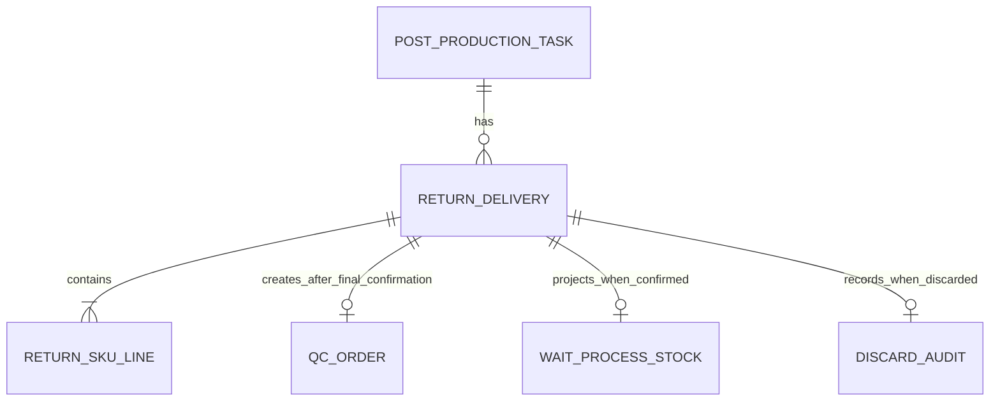
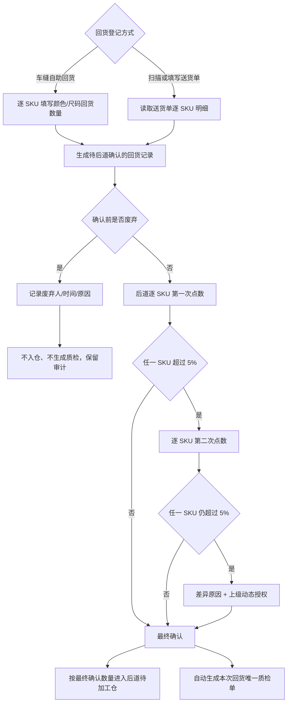
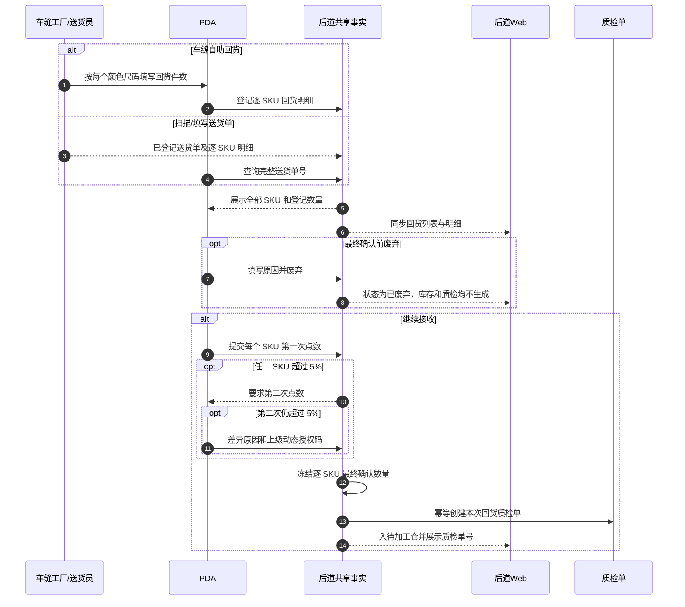
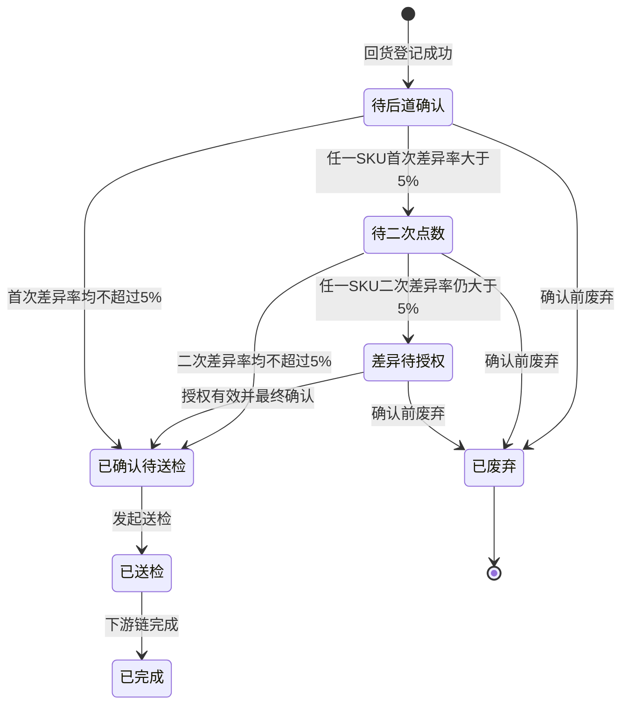

# 后道回货逐 SKU 确认与废弃调整方案

> 版本：V1.0（2026-09-03）  
> 适用范围：后道工厂管理 Web、后道工厂 PDA、二者共用的后道全流程 Mock 事实。  
> 迭代原则：保留当前菜单、路由、待加工仓列表、PDA 交接和车缝自助回货页面骨架，只补齐逐 SKU 明细、5% 授权口径、自动质检与废弃闭环。

## 1. 背景与目标

车缝回货有两种登记入口：

1. 车缝工厂通过公共 PDA 自助登记回货。
2. 后道工厂扫描或填写车缝工厂送货单号后确认回货。

两种入口表达的是同一个业务对象——“某个生产单的某一次回货”。因此不能一条只有整单数量、一条才有明细；两者都必须保留每个颜色、尺码对应 SKU 的登记数量，后道也必须逐 SKU 确认。

本次目标：

- 两种登记来源进入同一套回货事实，字段和下游处理一致。
- Web 与 PDA 均能查看完整 SKU、颜色、尺码和数量。
- 后道按 SKU 点数；是否复点和授权也按单个 SKU 判断，不按整单合计判断。
- 任一 SKU 最终差异率超过 5%才触发上级授权；5%以内可直接确认。
- 最终确认后只生成一条与本次回货对应的质检记录。
- Web 与 PDA 均可废弃尚未完成最终接收的回货记录；废弃记录保留审计，但不进入库存、不生成质检。
- 旧 PDA 通用交接详情不再并行提供“数量有差异”“驳回”或直接确认，统一引导到专用逐 SKU 回货确认页。

## 2. 范围与非范围

### 2.1 本次范围

- 车缝自助回货登记及其最近登记记录。
- 后道待加工仓中的“车缝登记回货”列表、回货确认与确认后详情。
- 后道 PDA 专用回货确认页。
- 旧 PDA 通用交接详情中后道回货的兼容入口。
- 回货状态、库存投影、质检生成和操作日志。
- 相应领域契约、页面契约和跨端验收。

### 2.2 非范围

- 不改变车缝任务分配、后道责任模式和辅料调拨规则。
- 不改变质检表单、后道加工、复检和出货的既有流程。
- 不新增真实后端、接口、数据库、消息推送或离线队列。
- 不给废弃后的记录提供恢复、重开或补录；需要重新回货时重新登记一条记录。
- 不删除一般交接业务的数量差异和驳回能力；只对“后道回货”这一业务类型收口。

## 3. 当前基础与调整边界

当前共用事实已经具备：一次回货包含多条 SKU 明细；回货确认逐 SKU 录入；工厂登记数量是差异率分母；超过 5%进入二次点数和授权；最终确认调用质检任务创建逻辑。

本次不重建这些能力，只做以下增量：

- 把已存在的逐 SKU 事实完整展示到两种回货入口、Web 确认后详情和旧 PDA 入口。
- 把 PDA 实时提示从“有差异就授权”改为“单个 SKU 超过 5%才复点/授权”。
- 增加受状态约束的“废弃回货记录”动作及库存、质检负向投影。
- 收口旧 PDA 通用交接页上与专用后道确认页冲突的按钮。

## 4. 业务对象与关系



业务基数：

- 一个后道生产任务允许多次回货。
- 一次回货至少有一条 SKU 明细；每条明细唯一对应一个颜色与尺码。
- 一次最终确认最多生成一个质检单；重复确认不能重复创建。
- 一条已废弃回货不生成质检单、不增加待加工仓库存，但保留原回货序号、来源、明细、废弃人、时间和原因。

## 5. 两种回货方式的统一规则

| 规则 | 车缝自助回货 | 扫/填送货单 |
| --- | --- | --- |
| 识别入口 | 公共 PDA 选择/输入生产单后登记 | 后道 PDA 或 Web 输入完整送货单号 |
| 登记事实 | 逐 SKU：图片、SPU、SKU、颜色、尺码、登记件数 | 读取同一张回货记录的逐 SKU 明细 |
| 整单数量 | 各 SKU 登记件数之和，系统计算 | 仅展示合计，不替代逐 SKU 核对 |
| 后道确认 | 进入专用逐 SKU 回货确认 | 进入同一确认逻辑 |
| 5%规则 | 以各 SKU 登记数为分母 | 相同 |
| 最终结果 | 入待加工仓并自动建质检，或在确认前废弃 | 相同 |

任何入口都不得只保存整单数量后再把数量随意分摊到 SKU；登记时就必须形成每个 SKU 的明确数量。

## 6. 逐 SKU 数量与授权规则

对每一条 SKU 明细：

```text
差异数量 = 后道点数 - 工厂登记数量
差异率 = |差异数量| ÷ 工厂登记数量
```

- 第一次点数差异率不超过 5%：允许直接最终确认，不要求二次点数和授权。
- 第一次点数差异率超过 5%：进入第二次点数。
- 第二次点数差异率不超过 5%：允许最终确认，不要求授权。
- 第二次点数仍超过 5%：必须填写差异原因并扫描上级动态授权码。
- 是否触发后续动作按每个 SKU 判断；整单合计只用于核对，不能抵消不同 SKU 的多收和少收。
- 边界值 5%属于“未超过”，不触发二次点数或授权。

## 7. 流程图



## 8. 跨端时序



## 9. 状态图



“已确认待送检”及之后状态不能废弃，因为库存与质检事实已经形成；需要修正时继续使用现有订正/审计机制，不以废弃回滚历史。

## 10. 页面调整

### 10.1 Web：后道待加工仓 / 车缝登记回货

- 保留当前统计卡、页签、筛选、标准列表和详情层级。
- 列表操作统一为“查看回货明细”；允许废弃时并列显示红色文字动作“废弃”。
- 待确认详情继续使用原逐 SKU 点数表。
- 最终确认或废弃后，详情展示只读“回货 SKU 明细”，包含图片、SPU/SKU、颜色/尺码、工厂登记数、后道确认数和差异。
- 详情展示回货方式；废弃记录展示废弃人、时间和原因。
- 已废弃记录不参与待加工仓当前库存、入库数量和批次统计。

### 10.2 PDA：车缝自助回货

- 保留现有生产单识别、逐 SKU 卡片和登记按钮。
- 最近登记记录增加“查看 SKU 明细”，默认折叠，展开后显示每个 SKU 图片、颜色、尺码和登记件数。
- 增加“查看并确认”，进入专用回货确认页。
- 尚未最终确认时提供“废弃本次回货”；需填写原因并二次确认。

### 10.3 PDA：后道回货确认

- 继续逐 SKU 展示图片、编码、颜色、尺码、登记数和点数输入。
- 删除“数量有差异”和“驳回”两条并行分支；差异由点数自动计算。
- 逐 SKU 实时提示“一致”“不超过 5%，可直接确认”或“超过 5%，需按规则复点/授权”。
- 整单合计明确标注仅供核对。
- 最终确认成功明确展示自动生成的质检单号。
- 尚未最终确认时提供“废弃本次回货”。

### 10.4 PDA：旧通用交接详情

- 仅对后道回货记录改为只读摘要和完整 SKU 明细。
- 不显示旧“确认本次接收”“数量有差异”“驳回”和“完成接收单”。
- 提供唯一主动作“扫描送货单逐 SKU 确认”，进入专用确认页。
- 非后道交接继续保留既有通用按钮，不受本次影响。

## 11. 废弃规则

- 允许状态：待后道确认、待二次点数、差异待授权。
- 禁止状态：已确认待送检、已送检、已完成、已废弃。
- 必填：废弃原因；操作人和时间由系统记录。
- 权限：本次回货登记人、对应工厂操作员、后道回货确认员或主管；PPIC 不在现场回货废弃角色内。
- 后果：回货状态置为“已废弃”，待加工仓投影数量清零，不生成质检单，不允许继续确认。
- 追溯：不删除单号、不回收回货序号、不删除 SKU 明细；列表和详情仍可查询。

## 12. 正常与边界场景

### 12.1 正常场景

自助回货登记 5 个 SKU；后道逐 SKU 点数，其中一个 SKU 少 2 件但差异率为 4%。系统允许直接最终确认，按 5 个 SKU 的最终数量入仓，并生成一张本次回货质检单。

### 12.2 超限场景

一个 SKU 登记 20 件、第一次点数 18 件，差异率 10%。系统要求二次点数；二次仍为 18 件时显示授权区，只有有效上级动态授权码和差异原因齐全才可最终确认。

### 12.3 废弃场景

送货员选错生产单并完成登记。后道在最终确认前填写原因“登记生产单错误”并废弃。该单仍可查看原 5 个 SKU，但待加工仓数量不增加、质检列表不出现新记录，且不能再次确认该回货单。

### 12.4 边界值

登记 20 件、确认 19 件，差异率正好 5%，不触发二次点数和授权；登记数量为 0 的 SKU 在登记入口直接阻断，不能通过 0 作分母绕过规则。

## 13. 验收标准

1. 两种回货来源都能看到与登记一致的全部 SKU、颜色、尺码和数量。
2. Web 与 PDA 对同一回货单展示相同明细和状态。
3. 确认输入按 SKU 存储；整单合计不可替代 SKU 明细。
4. 5%以内直接确认，超过 5%按“二次点数 → 仍超限才授权”执行，边界值 5%不触发。
5. 最终确认后质检单只创建一次，并显示质检单号。
6. Web 与 PDA 均能废弃未最终确认记录；原因、操作人、时间和明细可追溯。
7. 已废弃记录不计库存、不建质检、不能再次确认；已最终确认记录不能废弃。
8. 后道通用 PDA 详情不再出现“数量有差异”和“驳回”，并能进入专用逐 SKU 确认页。
9. 现有 Web 页面骨架、PDA 底部导航、后道加工/复检/出货链路不被重做或破坏。
10. 款式图片仍与 SKU 同块展示，可打开大图并保留失败态；PDA 400×786 和 Web 1366×768 无横向页面溢出。

