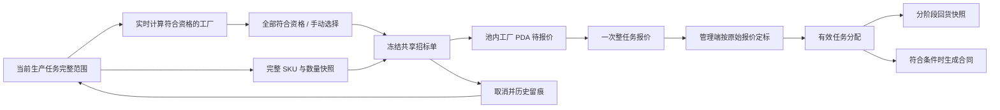
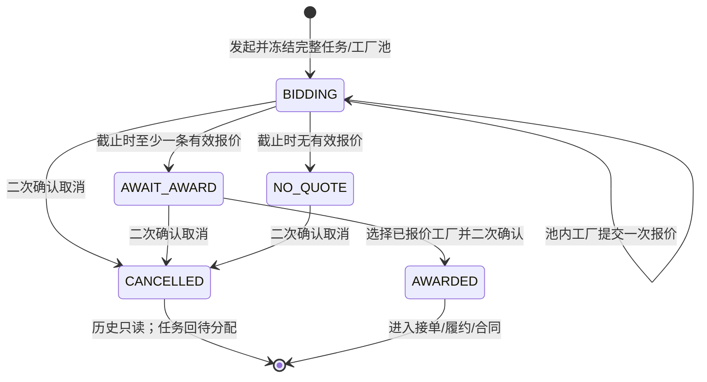
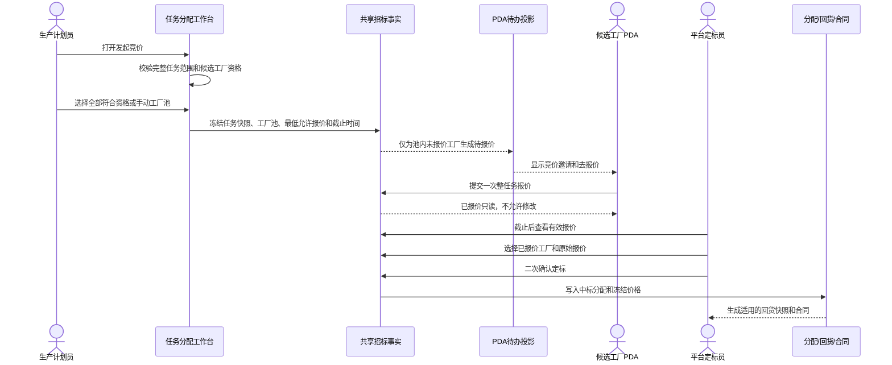

# FCS 整任务竞价、工厂池与 PDA 报价闭环：实施计划与需求追踪矩阵

> 版本：2026-08-11 实施版（含构建与 Mock 数据清洁补充）
> 当前分支：`codex/fcs-whole-task-tender-pool`
> 命名页面：`/fcs/dispatch/workbench`、`/fcs/pda/notify`、`/fcs/pda/task-receive`、`/fcs/dispatch/tenders`
> 本文是本次“业务任务发起竞价”调整的总体设计、实施计划和原子需求交付控制面；既有直接派单、菲票装袋、生产合同和回货规则文档继续有效。
> 2026-08-11 补充确认：竞价仅设置“最低允许报价”，不设置最高限价；工序标准价只供平台内部参考。竞价管理联动与生产单回货列表增量以《FCS 本次竞价工厂池与生产单回货列表联动调整实施及追踪矩阵》为准。

## 1. 背景、目标与完成标准

### 1.1 背景

原任务分配弹窗把“发起竞价”沿用了直接派单的 SKU 勾选结构，管理端可看到招标信息，但缺少明确、冻结的候选工厂池；PDA 端虽已有报价页面，却没有与管理端新发起竞价使用同一条共享事实。结果会造成三个业务歧义：竞价到底覆盖部分 SKU 还是整个任务、哪些工厂有权参与、PDA 报价和管理端定标是否对应同一招标单。

### 1.2 目标

1. 业务任务发起竞价时固定覆盖整个当前任务，不选择、不拆分 SKU。
2. 发起人必须确定竞价工厂池：全部符合资格的工厂，或经过搜索和筛选后手动选择的部分工厂。
3. 工厂池在发起时冻结；池内工厂在 PDA 收到待报价消息并可提交一次整任务报价，池外工厂不可见、不可报价。
4. 招标管理只负责查看、取消和定标，不再另建一套本地招标事实或从该页面新建招标单。
5. 定标只能选择已经报价的池内工厂，中标价必须与该工厂原始报价完全一致，并经过二次确认后冻结。
6. 竞价取消后旧招标单留痕，任务返回待分配，可创建新的工厂池并重新发起竞价。

### 1.3 完成标准

- 本文所有原子需求均能回到已确认业务原文，并绑定当前版本实际实现位置。
- 任务分配、PDA 待办、PDA 报价、招标管理、定标、合同/回货和取消重发读取同一竞价事实。
- 专项数据契约、命名 Web/PDA 浏览器场景、相邻直接派单回归、治理、构建和 CodeGraph 完成当前版本验证；任务收据须为当前版本，或在存在无法隔离的无关工作区变化时明确记录不适用理由。
- 第二轮正向追踪无漏项，反向追踪无越界功能、旧局部招标入口、准备阶段任务或可编辑 SKU 报价残留。

## 2. 范围、非范围与已确认业务事实

### 2.1 本次范围

- 独立车缝任务。
- 非车缝独立生产任务。
- `车缝+烫包` 合并任务。
- `裁剪+车缝+烫包` 合并任务。
- 管理端发起竞价、候选工厂池、共享招标事实、PDA 邀请/报价、管理端定标、取消与重新发起。
- 定标后沿用既有有效分配、分阶段回货规则和生产合同生成逻辑。
- 清理烫包待接单截止演示、固定车缝中标演示和本地构建依赖安装状态，确保 Mock 业务身份准确且构建无已知工具链警告。

### 2.2 非范围

- 生产准备阶段的染色、印花、水溶、缩水、洗水等加工单不进入任务分配竞价；其 PDA 执行继续由加工单投影负责。
- 整单生产任务是特殊合并任务，不在本次竞价调整范围。
- 直接派单继续按完整 SKU 分配；含车缝直接派单继续保留菲票装袋推荐和自由分配两种方式。
- 竞价阶段不生成生产合同；只有定标形成工厂分配后才按既有合同判断生成。
- 不新增真实消息推送、后端接口、数据库、离线队列或自动重试基础设施；原型以内存共享事实模拟跨页面一致性。
- 不修改生产合同主模板的固定文字、字母、印尼文条款和版式。

### 2.3 关键业务边界

| 事项 | 直接派单 | 发起竞价 |
| --- | --- | --- |
| 分配范围 | 可选一个或多个完整 SKU，同一 SKU 不拆数量 | 当前任务全部 SKU 和全部数量 |
| 含车缝装袋方式 | 按菲票装袋推荐或自由分配 | 不适用，不提供装袋/自由竞价选择 |
| 工厂确定 | 发起时直接选定一家工厂 | 发起时只冻结候选池，定标后才确定一家工厂 |
| 价格 | 派单时录入并二次确认冻结 | 工厂在 PDA 一次报价，定标时二次确认并冻结原始报价 |
| 合同 | 工厂分配成功后按合同规则生成 | 发起竞价不生成；定标成功后按合同规则生成 |
| 准备事实 | 含车缝任务提示裁片、辅料和装袋事实 | 含车缝任务只读提示准备和装袋事实，不改变整任务竞价范围 |

## 3. 角色、对象和共享事实

### 3.1 角色

| 角色 | 主要动作 | 权限边界 |
| --- | --- | --- |
| 生产计划员 | 从任务分配工作台发起整任务竞价、选择工厂池 | 不能在竞价中勾选或拆分 SKU；不能把不符合资格的工厂放入池中 |
| 候选工厂 PDA 管理员/负责人 | 接收待报价消息、查看整个任务与最低允许报价、提交一次报价 | 仅能操作本工厂所在工厂池的招标单；提交后不可修改 |
| 平台定标员 | 查看报价、核查工厂政策、定标或取消竞价 | 只能选择已报价工厂和原始报价；取消、定标均需明确防错确认 |
| 跟单/合同管理人员 | 定标后查看回货规则、合同与签订扫描件 | 竞价未定标前没有有效合同 |

### 3.2 业务对象

| 对象 | 唯一标识 | 核心内容 | 生命周期关系 |
| --- | --- | --- | --- |
| 生产任务 | 任务 ID/任务单号 | 工序、类型、完整 SKU 范围、数量、标准价 | 一次只能有一个当前有效竞价 |
| 招标单 | 招标单号 | 任务快照、业务分配日期、截止时间、平台内部标准价、最低允许报价、工厂池模式 | 取消后的招标单保留历史；新招标单使用新编号 |
| 工厂池快照 | 招标单号内的工厂列表 | 工厂 ID/名称/编码/类型/地址/匹配能力 | 发起后冻结，不因工厂主数据后续变化而改写历史 |
| 工厂报价 | 招标单号+工厂 ID | 报价、报价时间、交期、备注 | 每个池内工厂最多一条，不允许修改 |
| 定标结果 | 招标单号 | 中标工厂、原始报价、定标时间 | 二次确认后冻结并成为分配价格来源 |

### 3.3 单一事实流

## 4. 资格、范围、报价、定标和恢复规则

### 4.1 整任务范围

1. 发起竞价读取当前任务的全部 SKU 明细；页面只读展示 SKU、颜色、尺码和数量。
2. SKU 明细数量之和必须等于任务总数量；不守恒时阻断发起并要求刷新。
3. 竞价页面不渲染 SKU 复选框，不允许改变 SKU 范围或数量。
4. 合并任务按当前合并任务整体报价；其隐含责任仍由既有合并任务定义决定，不新增辅助工艺或特种工艺加工单。

### 4.2 候选工厂资格

工厂只有同时满足以下条件才进入“符合竞价条件”集合：

1. 工厂状态有效，允许派单。
2. 工厂任务接单配置允许承接当前独立工序或当前合并任务类型。
3. 对应工序能力已启用且允许接收任务。
4. 工厂允许参与竞价。
5. 工厂已启用 PDA。
6. 当前任务的工厂评级/风险/主管指定等定标政策没有形成阻断。

“全部符合资格”必须使用完整集合，不允许因页面展示数量或分页截断实际工厂池。

### 4.3 工厂池模式

- `全部符合竞价条件的工厂`：默认选择，发起时把全部符合资格的工厂写入冻结快照。
- `手动选择部分工厂`：使用穿梭选择器组池。左侧为尚未入池的合格候选工厂并支持名称、编码、地址、能力关键字及工厂类型筛选；中央提供加入、全部加入当前筛选结果、移除、全部移除；右侧为正式的“本次竞价工厂池”，是提交、二次确认和冻结的唯一来源。左侧勾选只表示待穿梭，不直接入池。
- 手动模式至少选择一家工厂；被选择工厂仍须属于当前符合资格集合。
- 发起成功后，工厂池不随搜索条件、主数据或任务列表重新计算而改变。

### 4.4 PDA 邀请与报价

1. 共享招标单处于招标中且本工厂在冻结工厂池时，PDA 生成“待报价”待办并可深链到报价页面。
2. 池外工厂、已报价工厂、已截止、已定标或已取消招标单不出现在待报价列表。
3. 报价页面明确显示“覆盖整个任务”，展示 SKU 数、任务总数量、币种、计价单位和最低允许报价；不向工厂展示工序标准价、其他工厂报价或当前最低价。
4. 报价必须为正数且不得低于最低允许报价，不设最高限价；同一工厂只能提交一次，提交后只读展示。
5. 工厂身份来自当前 PDA 会话；不得由页面参数冒充其他工厂。

### 4.5 状态与截止

- 截止时间必须晚于当前操作时间。
- 截止前为 `BIDDING`；截止后有报价为 `AWAIT_AWARD`，无报价为 `NO_QUOTE`。
- 已定标、已取消均不可继续报价。

### 4.6 定标与合同

1. 只有 `AWAIT_AWARD` 可以定标。
2. 中标工厂必须是冻结工厂池内已提交报价的工厂。
3. 中标价必须与该工厂原始报价完全一致；不得在管理端另录或修改。
4. 评级和风险政策继续生效；阻断必须阻止定标，需要确认的政策必须完成相应确认。
5. 第一次点击进入价格二次确认，显示“谨慎确认价格，一经提交确认不得修改”；第二次确认才提交。
6. 定标后建立有效分配；含车缝任务进入既有工厂接单逻辑，符合合同条件的任务生成合同和回货规则快照。

### 4.7 取消与重新发起

1. 招标中、待定标、无人报价可取消；已定标不可取消。
2. 取消原因必填，第一次点击展示不可逆影响，第二次确认才生效。
3. 取消后停止报价和定标，旧招标单、工厂池和已报价内容只读留痕。
4. 任务清除当前竞价关联并回到待分配；生产计划员可重新选择工厂池并生成新招标单号。
5. 新招标单不得覆盖旧招标单，即使操作时钟相同也必须生成唯一编号。

## 5. 跨端时序

## 6. 实施顺序与工作包

| 工作包 | 业务目标 | 文件/符号 | 修改 | 验证证据 | 完成条件 |
| --- | --- | --- | --- | --- | --- |
| WP-01 | 建立唯一共享招标事实 | `runtime-task-tenders.ts` | 完整任务快照、池模式、冻结工厂池、一次报价、状态、定标、取消、历史存储 | `check:fcs-whole-task-tender-pool` | 数量守恒、权限、状态和价格不可变可独立断言 |
| WP-02 | 发起整任务竞价 | `unified-dispatch-workbench.ts`、`runtime-process-tasks.ts` | 去除竞价 SKU 选择；资格计算；全部/手动工厂池；唯一招标号；原子创建和取消回退 | 专项契约、Playwright | 页面与共享事实完全一致，失败可回滚 |
| WP-03 | 贯通 PDA 邀请与报价 | `factory-mobile-todos.ts`、`factory-mobile-todo-routes.ts`、`pda-mobile-mock.ts`、`pda-receive-scope.ts`、`pda-notify*.ts`、`pda-task-receive.ts` | 池内待办、深链、整任务报价、会话工厂权限、一次提交、共享写回 | 专项契约、PDA 浏览器场景 | 池内/池外/已报价/已截止结果正确 |
| WP-04 | 收口招标管理与定标 | `dispatch-tenders.ts`、任务状态投影 | 移除本地新建；投影共享事实；准确报价定标；二次确认；取消重发；合同/回货衔接 | 专项契约、管理端浏览器场景 | 无第二套招标事实，价格和分配原子一致 |
| WP-05 | 清理旧 Mock 和状态口径 | `process-tasks.ts`、`pda-task-mock-factory.ts`、`runtime-process-tasks.ts`、进度投影、旧示例 | 补充待定标；移除 PDA 静态报价待办；准备阶段示例不进入任务竞价；烫包时效使用真实业务键；车缝中标演示按生产单、整任务和独立车缝语义选源 | Mock 专项、构建、反向检索 | 无冲突旧入口、错误工序键、错误演示身份或准备任务竞价数据 |
| WP-06 | 治理与交付 | 依赖锁文件、专项脚本、Playwright、本文、审查记录 | 按锁文件恢复本地依赖；将 Playwright 升级到兼容 Node 26 的当前稳定版本；原子矩阵、正反向追踪、当前版本证据和任务收据/明确例外 | 依赖树、无目标警告构建、最终命令组 | 生产构建和 Playwright 执行均无 `caniuse-lite` 过期或 `module.register()` 提示，且无无说明待实施或待验证条目 |

## 7. 原子需求追踪与交付矩阵

| 编号 | 来源 | 原子需求 | 工作包 | 实现位置 | 自动化验证 | Web/PDA/打印验证 | 状态 | 证据位置 | 产品确认人/版本 |
| --- | --- | --- | --- | --- | --- | --- | --- | --- | --- |
| TENDER-001 | 需求 1 | 竞价覆盖当前整个任务，不提供 SKU 勾选或数量拆分 | WP-01/02 | 完整任务快照、`renderWholeTaskTenderScope` | 整任务数量守恒断言 | 竞价弹窗无 SKU 输入 | 已验证 | 专项脚本；Playwright 场景 2 | 待用户验收/本分支 |
| TENDER-002 | 需求 1 | 快照逐项保存全部 SKU、颜色、尺码和数量 | WP-01/02 | `taskSnapshot.skuLines` | 4 SKU/2,500 件断言 | 可展开完整 SKU 明细 | 已验证 | 专项脚本；Playwright 场景 2 | 待用户验收/本分支 |
| TENDER-003 | 边界 | SKU 数量不守恒时阻断发起 | WP-01/02 | 共享事实写入校验 | 破损范围抛错断言 | 不适用（数据门禁） | 已验证 | `check:fcs-whole-task-tender-pool` | 待用户验收/本分支 |
| POOL-001 | 需求 2 | 默认使用全部符合竞价条件的工厂 | WP-02 | 工厂池模式 `ALL_ELIGIBLE` | 模式与数量断言 | 竞价工厂池默认选项 | 已验证 | 专项脚本；工厂池截图 | 待用户验收/本分支 |
| POOL-002 | 需求 2 | 全部模式使用完整资格集合，不按页面数量截断 | WP-02 | `listEligibleTenderFactoriesForTask` | 禁止 `.slice(0,20)` 契约 | 页面明确“不截断实际工厂池” | 已验证 | 专项脚本；Playwright | 待用户验收/本分支 |
| POOL-003 | 需求 2 | 手动模式可搜索工厂名称、编码、地址和能力 | WP-02 | 工厂关键字筛选 | 页面源码契约 | 手动模式搜索框 | 已验证 | Playwright 场景 2 | 待用户验收/本分支 |
| POOL-004 | 需求 2 | 手动模式可按工厂类型筛选 | WP-02 | 工厂类型筛选 | 页面源码契约 | 工厂类型下拉 | 已验证 | Playwright 场景 2 | 待用户验收/本分支 |
| POOL-005 | 需求 2 | 手动模式使用左候选、中央加入/移除、右侧正式工厂池的穿梭选择器；筛选不影响右侧，右侧是提交唯一来源 | WP-02 | 工厂池穿梭事件 | 页面源码契约；Playwright 穿梭交互 | 勾选不入池、加入、全部加入、移除、全部移除、筛选不影响右池及二次确认逐厂一致 | 已验证 | Playwright 场景 2；1366×768 截图 | 待用户验收/本分支 |
| POOL-006 | 需求 2 | 手动模式至少选择一家符合资格的工厂 | WP-02 | 发起前校验 | 专项数据校验 | 空池时页面阻断 | 已验证 | 共享事实契约；页面处理器 | 待用户验收/本分支 |
| POOL-007 | 需求 2 | 资格同时校验有效、派单、任务能力、接单配置、允许竞价、PDA 和定标政策 | WP-02 | `factoryCanAcceptTask`、`listEligibleTenderFactoriesForTask` | 候选池数据契约 | 每行展示匹配能力和 PDA 已启用 | 已验证 | 专项脚本；工厂池截图 | 待用户验收/本分支 |
| POOL-008 | 需求 2 | 发起后冻结工厂池及必要工厂快照 | WP-01/02 | `factoryPool` 深拷贝 | 捕获/恢复及池成员断言 | 招标详情固定池数 | 已验证 | 专项脚本 | 待用户验收/本分支 |
| PDA-001 | 需求 3 | 池内未报价工厂收到“待报价”消息 | WP-03 | `getFactoryMobileTodos` | 待办类型/工厂断言 | PDA 待办卡片 | 已验证 | 专项脚本；PDA 待办截图 | 待用户验收/本分支 |
| PDA-002 | 需求 3 | 待报价消息深链到对应招标单报价页 | WP-03 | `getFactoryMobileTodoActionRoute` | 路由参数断言 | 点击“去报价”打开对应弹窗 | 已验证 | 专项脚本；Playwright 场景 2 | 待用户验收/本分支 |
| PDA-003 | 需求 3 | 池外工厂看不到招标邀请且不能报价 | WP-01/03 | PDA 投影、报价成员校验 | 池外列表/抛错断言 | 不适用（权限负向场景） | 已验证 | `check:fcs-whole-task-tender-pool` | 待用户验收/本分支 |
| PDA-004 | 需求 1/3 | PDA 报价明确覆盖整个任务并显示 SKU 数和总件数 | WP-03 | `pda-task-receive.ts` | 共享快照投影断言 | 报价弹窗 4 SKU/2,500 件 | 已验证 | PDA 报价截图；Playwright 场景 2 | 待用户验收/本分支 |
| PDA-005 | 需求 3 | PDA 只展示最低允许报价、币种和计价单位，不展示标准价、其他工厂报价或当前最低价 | WP-03 | 报价弹窗 | 页面禁止旧价格信息断言 | PDA 报价弹窗 | 已验证 | 专项脚本；PDA 报价截图 | 待用户验收/本分支 |
| PDA-006 | 需求 3 | 报价必须为正数且不低于最低允许报价，不设置最高限价 | WP-01/03 | `recordRuntimeTaskTenderQuote` | 低于最低价抛错、高于标准价可报价断言 | 输入字段约束 | 已验证 | 专项脚本 | 待用户验收/本分支 |
| PDA-007 | 需求 3 | 同一工厂只允许报价一次，提交后不可修改 | WP-01/03 | 报价唯一校验、已报价投影 | 重复报价抛错断言 | 已报价页显示冻结金额 | 已验证 | 专项脚本；Playwright 场景 2 | 待用户验收/本分支 |
| PDA-008 | 权限 | 报价身份取自当前 PDA 会话工厂 | WP-03 | PDA 报价提交处理器 | 当前工厂池成员校验 | 登录工厂 PDA 场景 | 已验证 | Playwright 场景 2 | 待用户验收/本分支 |
| PDA-009 | 状态 | 已报价、已截止、已定标、已取消不再生成待报价 | WP-01/03 | 状态解析和待办投影 | 各状态列表断言 | 已报价页/取消回归 | 已验证 | 专项脚本；Playwright 场景 2/3 | 待用户验收/本分支 |
| STATE-001 | 状态 | 截止前为招标中 | WP-01/04 | 状态解析 | `BIDDING` 断言 | 招标列表 | 已验证 | 专项脚本；Playwright 场景 3 | 待用户验收/本分支 |
| STATE-002 | 状态 | 截止后有报价为待定标 | WP-01/04 | 状态解析 | `AWAIT_AWARD` 断言 | 管理端定标抽屉 | 已验证 | 专项脚本；Playwright 场景 2 | 待用户验收/本分支 |
| STATE-003 | 状态 | 截止后无报价为无人报价待处理 | WP-01/04 | 状态解析 | `NO_QUOTE` 断言 | 管理端说明 | 已验证 | 专项脚本 | 待用户验收/本分支 |
| AWARD-001 | 定标 | 招标管理只查看、取消和定标，不本地新建招标单 | WP-04/05 | `dispatch-tenders.ts` | 禁止“新建招标单”契约 | 顶部跳转任务分配工作台 | 已验证 | 专项脚本；管理页面 | 待用户验收/本分支 |
| AWARD-002 | 定标 | 只有截止且存在报价时允许定标 | WP-01/04 | 状态与定标准备校验 | 状态抛错断言 | 待定标才显示处理 | 已验证 | 专项脚本；Playwright 场景 2 | 待用户验收/本分支 |
| AWARD-003 | 定标 | 只能选择已报价的池内工厂 | WP-01/04 | 定标共享事实校验 | 未报价工厂抛错断言 | 报价工厂单选列表 | 已验证 | 专项脚本；Playwright 场景 2 | 待用户验收/本分支 |
| AWARD-004 | 定标 | 中标价必须等于工厂原始报价 | WP-01/04 | 精确价格校验 | 修改价格抛错断言 | 管理端无中标价输入 | 已验证 | 专项脚本；Playwright 场景 2 | 待用户验收/本分支 |
| AWARD-005 | 定标 | 定标执行现有评级/风险政策 | WP-02/04 | 定标政策评估 | 既有政策专项 | 定标确认控件 | 已验证 | 车缝准备专项；Playwright 场景 2 | 待用户验收/本分支 |
| AWARD-006 | 定标 | 价格提交必须显示固定谨慎文案并二次确认 | WP-04 | 定标抽屉 | 页面源码契约 | 二次确认页面 | 已验证 | 定标截图；Playwright 场景 2 | 待用户验收/本分支 |
| AWARD-007 | 定标 | 定标后共享招标、任务分配和冻结价格原子一致 | WP-01/04 | `awardRuntimeTenderTasks` 回滚快照 | 共享定标断言 | 中标结果/合同提示 | 已验证 | 专项脚本；Playwright 场景 2 | 待用户验收/本分支 |
| CONTRACT-001 | 既有边界 | 发起竞价不生成合同，定标后按既有判断生成 | WP-04 | 定标后的有效分配/合同入口 | 车缝回货专项 | 定标后合同提示 | 已验证 | Playwright 场景 2 | 待用户验收/本分支 |
| CONTRACT-002 | 既有边界 | 定标沿用发起时业务日期和整个任务数量生成回货快照 | WP-04 | 业务日期解析、回货快照 | 30/70/100 快照断言 | 定标二次确认预览 | 已验证 | Playwright 场景 2 | 待用户验收/本分支 |
| CONTRACT-003 | 强约束 | 不修改生产合同主模板固定条款和样式 | WP-06 | 主模板无差异 | 合同模板保真检查 | 既有打印验收 | 已验证 | `check:production-contract-template-fidelity`；既有打印证据 | 待用户验收/本分支 |
| CANCEL-001 | 恢复 | 招标中、待定标、无人报价可取消，已定标不可取消 | WP-01/02/04 | 共享/任务取消校验 | 取消状态断言 | 招标详情取消区 | 已验证 | 专项脚本；Playwright 场景 3 | 待用户验收/本分支 |
| CANCEL-002 | 防错 | 取消原因必填并必须二次确认 | WP-04 | 取消处理器和确认区 | 页面源码契约 | 二次确认取消截图 | 已验证 | Playwright 场景 3 | 待用户验收/本分支 |
| CANCEL-003 | 恢复 | 取消后旧招标、工厂池和报价历史留痕 | WP-01/04 | 以招标单号保存历史 | 旧记录仍为取消断言 | 招标列表显示已取消 | 已验证 | 专项脚本；Playwright 场景 3 | 待用户验收/本分支 |
| CANCEL-004 | 恢复 | 取消后任务回到待分配且清除当前竞价关联 | WP-02/04 | `cancelRuntimeTaskTender` | 任务状态断言 | 任务分配重新显示竞价入口 | 已验证 | Playwright 场景 3 | 待用户验收/本分支 |
| CANCEL-005 | 恢复 | 重新发起生成新唯一招标单且不覆盖旧记录 | WP-01/02 | 历史存储、唯一编号生成 | 两条记录/不同编号断言 | 同一固定时钟重发成功 | 已验证 | 专项脚本；Playwright 场景 3 | 待用户验收/本分支 |
| EXCLUDE-001 | 非范围 | 生产准备加工单不进入本任务竞价 | WP-02/05 | 生产执行任务资格、旧 Mock 清理 | 统一分配基础契约 | 任务工作台无准备加工单竞价 | 已验证 | `check:fcs-unified-assignment-foundation`；Playwright 工作台场景 | 待用户验收/本分支 |
| REG-001 | 回归 | 直接派单的 SKU、菲票装袋/自由分配和价格二次确认不变 | WP-06 | 直接派单分支未改竞价口径 | 车缝准备专项 | Playwright 场景 1 | 已验证 | 直接派单二次确认截图 | 待用户验收/本分支 |
| REG-002 | 回归 | 改派数量仍只读等于原分配减已确认实收 | WP-06 | 既有改派范围 | 车缝准备专项 | Playwright 场景 2 | 已验证 | 改派范围截图 | 待用户验收/本分支 |
| CLEAN-001 | 用户补充/Mock 清洁 | 烫包待接单演示必须按 `IRON_PACK` 生成即将逾期截止时间 | WP-05 | `buildDirectTaskSet` | `check:pda-receive-mock-deadline-status` | PDA 待接单可观察到烫包“即将逾期” | 已验证 | 专项输出含车缝“正常”和烫包“即将逾期” | 待用户验收/本分支 |
| CLEAN-002 | 用户补充/Mock 清洁 | 固定车缝已中标演示必须来自同生产单的独立车缝整任务，不得引用特殊工艺 | WP-05 | `applyFixedMergedTaskDemo`、`isRuntimeIndependentSewingTask` | `check:sewing-awarded-pda-seed` | PDA 已中标任务完成待接单、二次确认和待开工写回 | 已验证 | 车缝中标 PDA 专项 | 待用户验收/本分支 |
| TOOL-001 | 用户补充/构建清洁 | 使用当前浏览器数据和 Node 26 兼容工具链；生产构建和命名页面测试不得输出 Browserslist、`module.register()` 或浏览器存储实验性提示 | WP-06 | `package.json`、`package-lock.json`、浏览器存储适配器、本地依赖安装树 | `npm ls`、`npm run build`、带警告栈专项、Playwright 列表与执行 | 不适用（构建工具链） | 已验证 | Vite 6.4.3、Tailwind 4.3.3、tsx 4.23.6、caniuse-lite 1.0.30001806、Playwright 1.61.1；构建、专项和 Playwright 日志无目标警告 | 待用户验收/本分支 |
| QA-001 | 完成门禁 | 专项、命名页面、治理、构建和 CodeGraph 形成当前证据；任务收据已生成或明确记录无法隔离的无关变化 | WP-06 | 检查脚本、审查记录 | 最终命令组 | Web/PDA 5 个场景 | 已验证 | 本节最终验证结果；最新穿梭选择器增量收据例外见联动调整矩阵 | 待用户验收/本分支 |

## 8. 正常、异常与恢复场景

### 8.1 正常场景

生产计划员为独立车缝任务发起竞价。系统只读展示 4 个 SKU、2,500 件完整范围，并计算所有符合资格的工厂。计划员保留默认“全部符合竞价条件的工厂”后提交，系统冻结招标单和工厂池。池内工厂管理员在 PDA 的“待报价”看到任务，提交一次 1,500 IDR/件报价。截止后平台定标员选择该工厂，完成风险确认和价格二次确认；系统以 1,500 IDR/件写入有效分配，并按原业务分配日期和 2,500 件生成回货规则快照与合同。

### 8.2 权限边界

- 池外工厂：没有待报价卡片，直接构造报价也被拒绝。
- 池内已报价工厂：进入已报价列表，不能再次提交或修改。
- 截止后工厂：即使尚未报价也不能补报。
- 未报价工厂：不能被管理端选为中标方。

### 8.3 无人报价

截止时没有任何有效报价，招标单进入“无人报价待处理”，不能直接指定工厂定标。平台填写取消原因并二次确认后，任务回到待分配，再核查工厂池、价格或截止条件并重新发起。

### 8.4 取消后重发

平台在招标中取消竞价。旧招标单变为“已取消”，池内工厂不再看到待报价；任务清除当前竞价关联并回到待分配。重新发起时生成新招标单号，旧招标单仍可查询，不能被新工厂池覆盖。

## 9. 第二轮核查方法

1. 正向追踪：从第 2～5 节逐条映射到第 7 节需求编号、实现位置和证据。
2. 反向追踪：从全部源码、页面、Mock、脚本和测试差异回到需求编号，检查是否加入未确认能力。
3. 重点反向检索：竞价 SKU 复选框、工厂池截断、本地“新建招标单”、准备阶段竞价 Mock、PDA 静态报价待办、池外报价、可修改报价和非二次确认取消。
4. 最后一次实质修改后重新运行所有受影响专项、5 个 Playwright 场景、治理、构建和 CodeGraph；任务收据重新生成，或在无法隔离无关工作区变化时记录不适用理由；此前绿灯自动失效。

## 10. 变更记录

| 日期 | 变更 | 影响需求 |
| --- | --- | --- |
| 2026-08-11 | 建立整任务竞价、候选工厂池和 PDA 报价共享事实 | TENDER、POOL、PDA、STATE、AWARD |
| 2026-08-11 | 浏览器复核发现共享 PDA 数量被旧任务 `PIECE` 口径覆盖，改为始终读取冻结招标快照的件数和单位 | PDA-004、PDA-005 |
| 2026-08-11 | 第二轮恢复路径复核发现取消记录按任务覆盖会阻断重新发起，改为招标单维度历史存储并让任务回待分配 | CANCEL-001～005 |
| 2026-08-11 | 固定时钟复核发现 `Date.now()` 可能重复招标号，增加当前历史集合内唯一编号处理 | CANCEL-005 |
| 2026-08-11 | 烫包待接单时效判断由不存在的 `IRONING` 修正为真实业务键 `IRON_PACK` | CLEAN-001 |
| 2026-08-11 | 固定车缝中标演示由脆弱任务序号改为同生产单的独立车缝整任务语义选源 | CLEAN-002 |
| 2026-08-11 | 按仓库锁文件恢复本地依赖，并将 Playwright 由 1.58.2 升级到兼容 Node 26 的 1.61.1；生产构建和命名页面测试均清除浏览器数据过期及 `module.register()` 提示 | TOOL-001 |
| 2026-08-11 | 第二轮端到端复核发现独立车缝派单框默认价与生成任务标准价事实不一致，统一在任务生成价格源维护 1,200 IDR/件，并保留竞价有效标准价门禁 | TENDER-001、POOL-006、AWARD-004 |
| 2026-08-11 | 最终警告栈复核发现 Node 26 读取 `globalThis.localStorage` 会触发实验性提示，改为仅在真实浏览器 `window` 中安全读取 local/session storage | TOOL-001 |

## 11. 最终验证结果

### 11.1 专项与相邻回归

| 验证 | 结果 | 覆盖范围 |
| --- | --- | --- |
| `npm run check:fcs-whole-task-tender-pool` | 通过 | 整任务快照、完整工厂池、池外阻断、一次报价、状态、精确价格定标、取消和重发 |
| `npm run check:fcs-sewing-preparation-return-preview` | 通过 | 含车缝准备事实、30%/70%/100% 回货、定标/改派衔接 |
| `npm run check:fcs-unified-assignment-foundation` | 通过 | 统一任务分配、固定合并模式、生产准备加工单排除 |
| `npm run check:fcs-dispatch-bagging` | 通过 | 直接派单菲票装袋推荐与自由分配边界 |
| `npm run check:production-contract-template-fidelity` | 通过 | 合同模板指纹、两页打印底图、印尼文动态字段 |
| `npm run check:pda-task-receive-scope` | 通过 | PDA 待接单/待报价/已报价/已中标的工厂范围 |
| `npm run check:pda-receive-mock-deadline-status` | 通过 | 车缝正常、烫包即将逾期的待接单截止演示 |
| `npm run check:sewing-awarded-pda-seed` | 通过 | 独立车缝整任务中标、PDA 确认接单和待开工写回 |
| `npm run check:sewing-reassignment-cold-start` | 通过 | 车缝改派冷启动和既有改派范围 |
| `git diff --check` | 通过 | 当前全部任务差异无空白错误 |

### 11.2 命名 Web/PDA 场景

`PLAYWRIGHT_REUSE_EXISTING_SERVER=false CUTTING_E2E_PORT=43315 npx playwright test tests/pda-receive-mock-deadline-status.spec.ts tests/pda-task-receive-pending-accept.spec.ts tests/fcs-unified-dispatch-preparation-return-preview.spec.ts --workers=1 --reporter=line`：5/5 通过。

1. 直接派单准备事实、SKU、菲票装袋、价格二次确认和 30%/70%/100% 回货规则回归通过。
2. 整任务工厂池发起 → PDA 待报价 → 整任务一次报价 → 管理端原价二次确认定标 → 合同/回货 → 改派链路通过。
3. 取消原因 → 二次确认 → 旧招标留痕 → 任务回待分配 → 新招标号重发通过。
4. PDA 待接单同时展示正常车缝任务和“即将逾期”的烫包任务，烫包时效来源为 `IRON_PACK`。
5. PDA 待接单字段、生产准备加工单排除和既有接单路径回归通过。

页面证据位于 `/private/tmp/higoods-fcs-prep-return-evidence/`，包含工厂池、PDA 待办、PDA 报价、定标二次确认、取消二次确认、直接派单和改派范围截图。

### 11.3 治理、构建、CodeGraph 与收据

| 验证 | 结果 |
| --- | --- |
| `npm run check:prototype-design-governance -- --all` | 通过；14 个用户可见受管文件由 1 份完整审查记录覆盖 |
| `npm run check:list-page-governance` | 通过；扫描 355 个列表页，标准列表 Chromium 拖拽场景通过 |
| `npm run build` | 通过；2,338 个模块；无 `caniuse-lite` 数据过期和 Node 26 `module.register()` 提示 |
| `codegraph sync` + `codegraph status` | 通过；索引已是最新，1,485 个文件、45,544 个节点、163,847 条边，无待同步文件 |
| `workflow:verify` | 历史整任务竞价基线收据 `/private/tmp/higoods-fcs-whole-task-tender-receipt.json` 为 `verified`；本次穿梭选择器增量因工作区存在无法隔离的无关 PCS 文档未生成新收据，未吸收该文件 |

依赖核查确认仓库锁文件已包含 Vite 6.4.3、Tailwind 4.3.3、tsx 4.23.6、caniuse-lite 1.0.30001806 和 baseline-browser-mapping 2.11.12；本地安装目录此前未按锁文件恢复。执行 `npm install` 后生产构建不再出现两项目标警告。随后将仍会在 Node 26 测试进程中调用旧 ESM 注册方式的 Playwright 1.58.2 升级为 1.61.1，`package.json` 与 `package-lock.json` 仅形成该测试工具版本的预期差异；Playwright 列表和 5 个命名场景执行也不再出现 `module.register()` 提示。

### 11.4 第二轮正向与反向追踪结论

- 正向追踪：第 2～5 节所有规范性条款均已映射到第 7 节原子需求；矩阵不存在无说明的 `待实施`、`实施中`、`已实现待验证` 或 `已阻塞`。
- 反向追踪：全部任务差异均可回到 TENDER、POOL、PDA、STATE、AWARD、CONTRACT、CANCEL、EXCLUDE、REG 或 QA 编号；没有加入局部 SKU 竞价、池外报价、可修改报价、管理端自建招标单或生产准备加工单竞价。
- 当前交付状态：`verified`。尚未提交、推送，尚未获得产品接受回执，因此不声明 `delivered` 或 `accepted`。

### 11.5 数据清洁补充结论

- 烫包演示截止判断已使用真实业务键 `IRON_PACK`；专项同时观察到车缝“正常”和烫包“即将逾期”。
- 固定车缝已中标演示已改为按生产单、整任务和独立车缝业务语义选源，不再依赖会随任务排序漂移的固定序号，也不会再引用特殊工艺源任务。
- 两项清洁均复用现有业务模型和专项契约，没有增加新的任务类型、状态或兼容分支。
