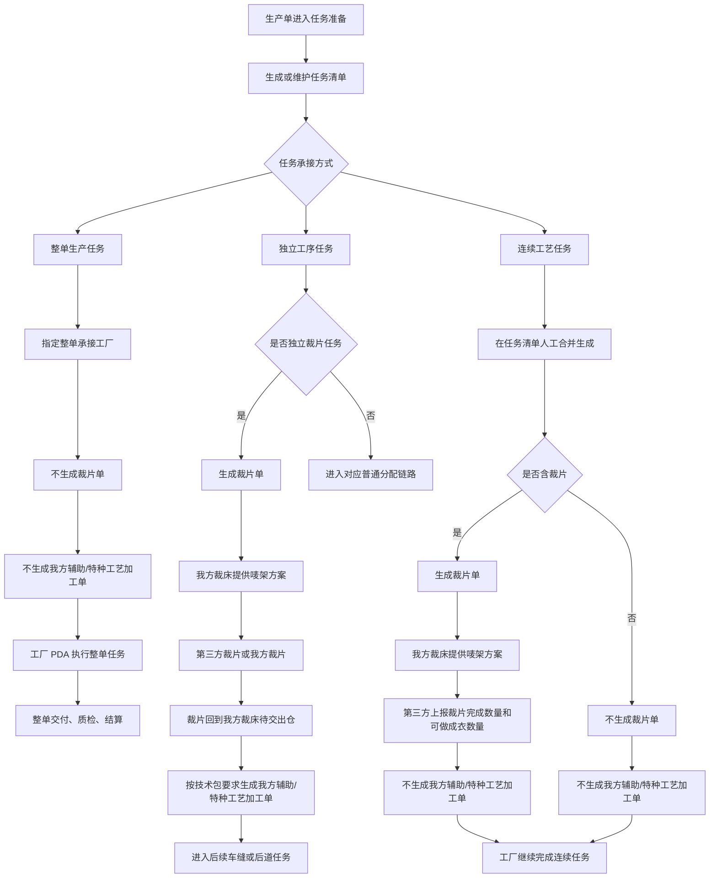
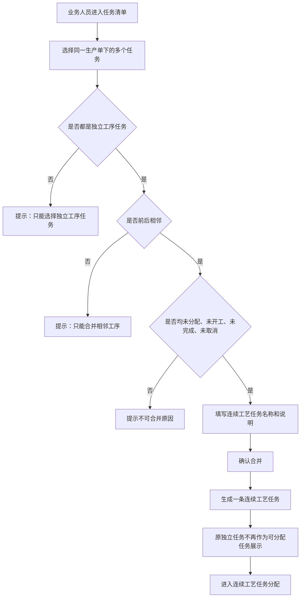
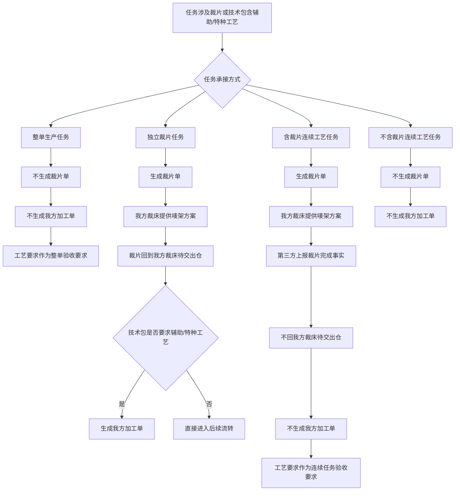
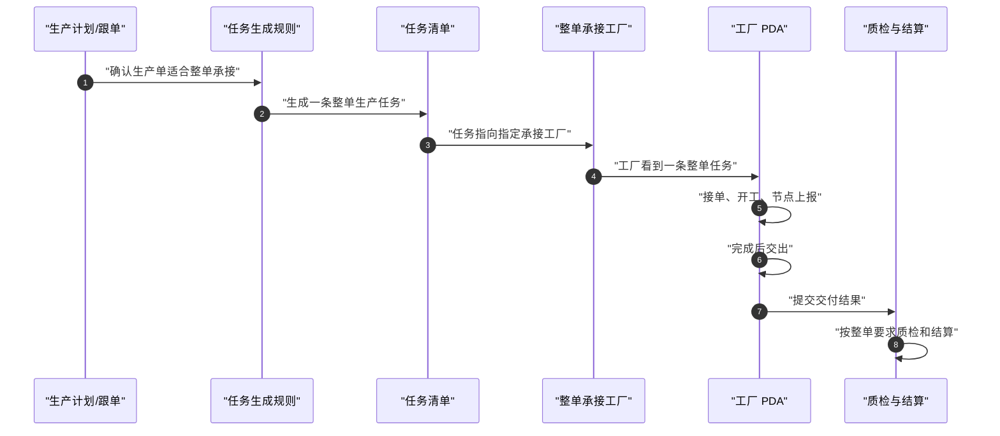
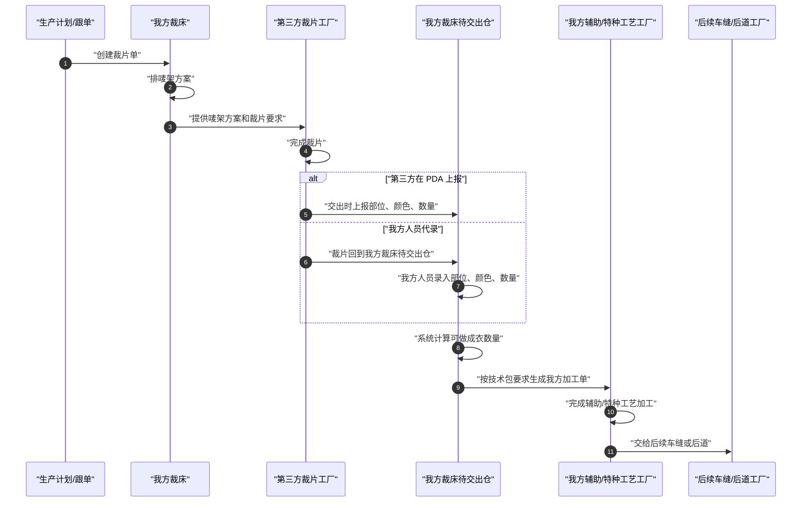
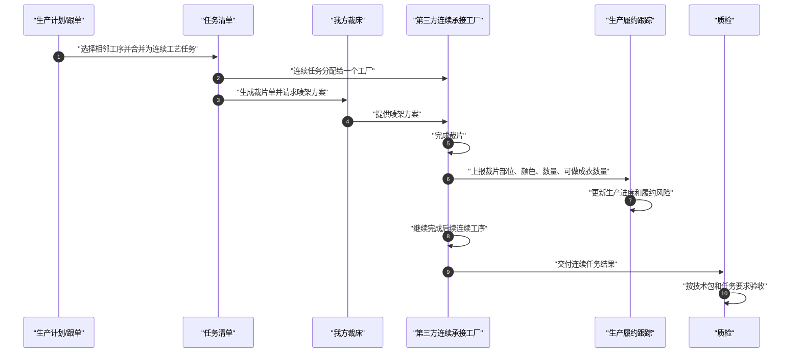
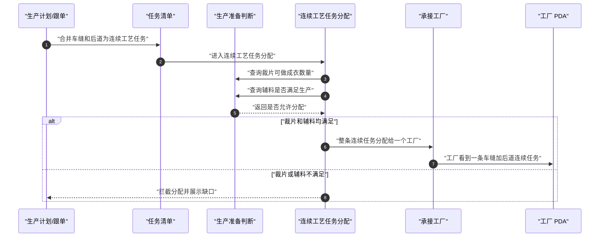

# 工厂生产协同系统整单生产任务与连续工艺任务产品说明文档

版本：V1.0  
日期：2026-07-07  
适用对象：产品、研发、测试、实施、工厂运营  
文档目的：明确整单生产任务、连续工艺任务、独立工序任务、裁片单、我方辅助/特种工艺加工单之间的业务边界、生成规则、页面落点、执行流程和验收标准。

## 1. 核心结论

本需求的核心不是新增一种单据，而是重新明确“任务承接方式”与“我方是否继续管理过程”的关系。

结论如下：

1. 整单生产任务由规则或人工指定给一个整单承接工厂执行，系统不拆分其内部裁片、车缝、后道等过程，也不生成裁片单和我方辅助/特种工艺加工单。
2. 连续工艺任务不再由生产单任务生成规则自动生成，而是在任务清单中由业务人员选择相邻工序任务合并生成。
3. 连续工艺任务一旦形成，必须作为一条完整任务分配给一个承接工厂，不允许按明细再拆分，不允许在分配阶段拆成多个独立工序。
4. 独立工序任务仍然进入现有的车缝分配、非车缝分配等普通任务分配链路。
5. 仅包含车缝和后道的连续工艺任务，分配前必须使用与车缝分配工作台一致的生产准备判断：裁片是否可做成衣、辅料是否满足生产、可分配数量是否充足。
6. 是否生成裁片单，取决于任务是否需要我方裁床提供唛架方案或需要我方感知裁片完成结果；不是简单取决于裁片是否由我方裁床执行。
7. 是否生成我方辅助/特种工艺加工单，取决于裁片是否回到我方内部流转链路；三方工厂连续承接内部工艺时，不生成我方辅助/特种工艺加工单。
8. 裁片单是裁片依据和裁片结果的承载对象，不等同于“我方裁床必须执行裁片”。
9. 整单生产任务不提供我方唛架方案，不生成裁片单；整单工厂如何组织裁片、车缝、后道，是其内部生产组织事项。

## 2. 背景与业务问题

原有任务拆解以独立工序为主，生产单生成后形成若干可分配任务，再进入车缝分配、非车缝分配、PDA 执行等链路。

在实际业务中出现了三类新的承接方式：

1. KOL 样衣或小单由一个工厂整单承接。
2. 某些相邻工序适合由同一个工厂连续承接，例如车缝加后道。
3. 第三方工厂可能只做裁片，也可能承接裁片加车缝、裁片加车缝加后道等连续多个环节。

如果继续把所有内容都按独立工序拆开，会产生以下问题：

1. 同一工厂内部连续完成的工作被系统拆成多个任务，分配和执行重复。
2. 连续任务被错误送入普通车缝或非车缝分配，导致业务上已经确定的承接关系被再次打散。
3. 三方工厂连续承接时，系统误以为仍要把裁片送回我方辅助/特种工艺工厂加工。
4. 整单生产任务被误认为仍需我方裁床提供唛架方案或裁片单。
5. 裁片单、辅助/特种工艺加工单、任务清单之间职责不清，影响研发实现和测试验收。

本说明文档用于统一这些边界。

## 3. 术语说明

| 术语 | 业务含义 |
| --- | --- |
| 生产单 | 平台对一批货品生产履约的主对象，承载需求、技术包、数量、交期和工厂协同信息 |
| 任务清单 | 生产单拆解后用于分配和执行的任务列表，是工厂协同中的任务入口 |
| 独立工序任务 | 单个工序独立作为一条任务分配和执行，例如裁片、车缝、印花、后道等 |
| 整单生产任务 | 一个工厂承接除平台明确独立管理部分之外的整单生产工作，系统不拆内部过程 |
| 连续工艺任务 | 多个前后相邻工序合并成一条任务，由一个工厂连续承接 |
| 车缝加后道连续任务 | 只包含车缝和后道的连续工艺任务，分配判断接近车缝任务 |
| 裁片单 | 承载裁片依据、唛架方案、裁片部位、颜色、数量、可做成衣数量的业务单据 |
| 唛架方案 | 我方裁床基于纸样、面料幅宽、颜色尺码等信息形成的裁片排版方案 |
| 我方辅助/特种工艺加工单 | 我方内部辅助工艺工厂或特种工艺工厂执行的加工单 |
| 裁片可做成衣 | 按裁片部位、颜色、尺码和数量折算后，判断可进入车缝的成衣数量 |
| 交出 | 工厂完成当前任务后，将结果提交给下一承接对象或平台确认 |

## 4. 适用范围

本期必须覆盖以下范围：

1. 整单生产任务的生成、展示、分配边界、PDA 执行和日志。
2. 连续工艺任务在任务清单中的合并生成、分配、PDA 执行和日志。
3. 车缝加后道连续任务的生产准备判断。
4. 独立工序任务、整单生产任务、连续工艺任务在普通分配页面中的分流规则。
5. 裁片单在独立裁片任务、含裁片连续工艺任务、整单生产任务下的生成边界。
6. 我方辅助/特种工艺加工单在不同任务类型下的生成边界。
7. 工厂 PDA 对整单生产任务、连续工艺任务、裁片完成上报的展示和操作边界。
8. 相关操作日志、异常拦截、状态流转和验收标准。

本期不覆盖以下范围：

1. 工厂推荐算法。
2. 自动报价、竞价、询价闭环。
3. 成本拆分和复杂结算分摊。
4. 三方工厂内部每一道工序的明细过程管理。
5. 整单工厂内部裁片、车缝、后道的过程追踪。
6. 真实后端接口字段设计。
7. 权限体系重构。

## 5. 业务对象边界

### 5.1 独立工序任务

独立工序任务是当前系统原有任务协同方式。

业务特征：

1. 一条任务只代表一个主要工序。
2. 可以按现有规则进入车缝分配或非车缝分配。
3. 可以按业务需要进行明细级分配。
4. 如果是独立裁片任务，裁片完成后可能回到我方裁床待交出仓。
5. 如果裁片回到我方内部链路，后续辅助/特种工艺仍由我方对应工厂处理。

### 5.2 整单生产任务

整单生产任务用于一个工厂承担整单生产责任的场景。

业务特征：

1. 系统只管理整单任务的接单、开工、节点上报、交出、完成、异常和质检结算结果。
2. 系统不拆分整单工厂内部的裁片、车缝、后道等过程。
3. 不进入普通车缝分配和非车缝分配。
4. 不生成裁片单。
5. 不提供我方唛架方案。
6. 不生成我方辅助/特种工艺加工单。
7. 技术包中的工艺要求作为整单承接和验收要求存在，不拆成我方内部加工单。

适用示例：

1. KOL 样衣整单承接。
2. KOL 样品小单整单承接。
3. 其他明确由一个工厂负责完整交付的业务场景。

### 5.3 连续工艺任务

连续工艺任务用于多个相邻工序由同一个工厂连续承接的场景。

业务特征：

1. 由任务清单人工合并生成。
2. 必须来自同一生产单。
3. 必须选择前后相邻的独立工序任务。
4. 原任务必须未分配、未开工、未完成、未取消。
5. 合并后只形成一条任务。
6. 合并后由一个工厂整体承接。
7. 不允许按明细拆分分配。
8. 不允许在分配页面拆回多个独立任务。
9. PDA 只展示一条连续工艺任务。

连续工艺任务分为两类：

1. 仅包含车缝和后道的连续工艺任务。
2. 其他连续工艺任务，包括含裁片、含辅助工艺、含特种工艺、含多个非车缝环节等。

### 5.4 裁片单

裁片单不是任务分配对象，也不是“必须由我方裁床执行裁片”的标志。

裁片单的业务职责：

1. 承载生产单对应的裁片依据。
2. 承载纸样、面料、幅宽、颜色、尺码、部位等裁片信息。
3. 承载我方裁床提供的唛架方案。
4. 承载第三方工厂或我方人员录入的裁片完成结果。
5. 支撑系统计算可做成衣数量。
6. 为后续车缝分配、连续任务进度、履约风险判断提供依据。

一个生产单可以生成多个裁片单，拆分口径包括但不限于：

1. 面料不同。
2. 纸样不同。
3. 面料幅宽不同。
4. 颜色或尺码范围不同。
5. 部位裁片要求不同。

### 5.5 我方辅助/特种工艺加工单

我方辅助/特种工艺加工单只代表我方内部辅助工艺工厂或特种工艺工厂需要处理的加工任务。

它不等同于技术包里的工艺标记。

技术包中标记了辅助工艺或特种工艺时：

1. 如果裁片回到我方内部流转链路，则生成我方加工单。
2. 如果第三方工厂连续承接后续过程，则不生成我方加工单。
3. 如果整单工厂承接整单生产，则不生成我方加工单。
4. 如果是我方内部独立辅助或特种工艺任务，则按现有加工单链路执行。

## 6. 任务类型与单据生成矩阵

| 任务承接方式 | 是否生成裁片单 | 是否生成我方辅助/特种工艺加工单 | 是否进入普通分配 | 是否允许按明细拆分 | 业务说明 |
| --- | --- | --- | --- | --- | --- |
| 整单生产任务 | 否 | 否 | 否 | 否 | 整单工厂自行组织内部生产，平台只管理整单结果 |
| 独立裁片任务 | 是 | 是 | 是 | 可按现有规则 | 三方只做裁片，裁片回到我方裁床待交出仓，后续仍是我方链路 |
| 独立非裁片任务 | 否 | 按该工序自身规则 | 是 | 可按现有规则 | 不因为非裁片任务额外生成裁片单 |
| 含裁片连续工艺任务 | 是 | 否 | 否 | 否 | 我方提供唛架方案并感知裁片结果，但三方内部继续完成后续工序 |
| 不含裁片连续工艺任务 | 否 | 否 | 否 | 否 | 三方连续承接，不涉及我方裁片单和我方加工单 |
| 车缝加后道连续工艺任务 | 通常否 | 否 | 否 | 否 | 分配前需要判断裁片可做成衣和辅料是否满足生产 |

## 7. 端到端业务流程图

### 7.1 总体判断流程



### 7.2 任务清单合并连续工艺任务流程



### 7.3 裁片单与我方加工单判断流程



## 8. 时序图

### 8.1 整单生产任务时序



### 8.2 独立裁片任务时序



### 8.3 含裁片连续工艺任务时序



### 8.4 车缝加后道连续工艺任务分配时序



## 9. 状态图

### 9.1 任务状态图

```mermaid
stateDiagram-v2
  [*] --> "待形成任务"
  "待形成任务" --> "待分配": "形成独立工序任务或连续工艺任务"
  "待形成任务" --> "已指定工厂": "形成整单生产任务"

  "待分配" --> "已分配": "分配承接工厂"
  "已指定工厂" --> "待接单": "工厂可接单"
  "已分配" --> "待接单": "工厂可接单"
  "待接单" --> "已接单": "工厂接单"
  "已接单" --> "生产中": "开工"
  "生产中" --> "节点已上报": "上报关键节点"
  "节点已上报" --> "待交出": "继续生产完成"
  "生产中" --> "待交出": "无关键节点要求时直接完成"
  "待交出" --> "待确认": "提交交出"
  "待确认" --> "已完成": "平台或接收方确认"

  "待分配" --> "已取消": "取消任务"
  "已分配" --> "已取消": "取消任务"
  "待接单" --> "已取消": "取消任务"
  "已接单" --> "异常处理中": "工厂异常"
  "生产中" --> "异常处理中": "生产异常"
  "异常处理中" --> "生产中": "异常关闭后继续"
  "异常处理中" --> "已取消": "异常导致取消"

  "已完成" --> [*]
  "已取消" --> [*]
```

### 9.2 裁片单状态图

```mermaid
stateDiagram-v2
  [*] --> "待判断"
  "待判断" --> "不生成裁片单": "整单生产任务或不含裁片任务"
  "待判断" --> "待排唛架": "独立裁片任务或含裁片连续任务"
  "待排唛架" --> "唛架已提供": "我方裁床发布唛架方案"

  "唛架已提供" --> "待裁片": "第三方或我方开始裁片"
  "待裁片" --> "裁片完成待录入": "裁片完成"
  "裁片完成待录入" --> "已记录裁片结果": "录入部位、颜色、数量、可做成衣数量"

  "已记录裁片结果" --> "回我方待交出仓": "独立裁片任务"
  "回我方待交出仓" --> "进入我方后续流转": "仓内确认完成"

  "已记录裁片结果" --> "随连续任务推进": "含裁片连续工艺任务"
  "随连续任务推进" --> "随连续任务关闭": "连续任务完成"

  "不生成裁片单" --> [*]
  "进入我方后续流转" --> [*]
  "随连续任务关闭" --> [*]
```

### 9.3 我方辅助/特种工艺加工单状态图

```mermaid
stateDiagram-v2
  [*] --> "待判断"
  "待判断" --> "不生成我方加工单": "整单生产任务、连续工艺任务或不回我方链路"
  "待判断" --> "待生成加工单": "裁片回我方链路且技术包有工艺要求"
  "待生成加工单" --> "待接收": "加工单生成"
  "待接收" --> "待加工": "我方工艺工厂接收"
  "待加工" --> "加工中": "开始加工"
  "加工中" --> "待交出": "加工完成"
  "待交出" --> "已交出": "交回后续链路"
  "已交出" --> "已关闭": "数量和结果确认"

  "待接收" --> "差异处理中": "接收差异"
  "加工中" --> "差异处理中": "加工异常"
  "待交出" --> "差异处理中": "交出差异"
  "差异处理中" --> "加工中": "继续加工"
  "差异处理中" --> "已关闭": "差异关闭"

  "不生成我方加工单" --> [*]
  "已关闭" --> [*]
```

## 10. 页面与功能要求

### 10.1 生产单任务生成规则

页面定位：

用于维护生产单生成任务时的规则。整单生产任务可以由规则生成；连续工艺任务不在这里自动生成。

必须支持：

1. 配置哪些售卖类型适合整单承接。
2. 配置整单承接工厂范围。
3. 配置哪些工序仍需独立管理。
4. 配置整单任务的任务名称和 PDA 步骤。
5. 查看规则启用、停用、复制、编辑、日志。

业务限制：

1. KOL 样衣和 KOL 样品小单默认按整单生产任务处理。
2. 整单生产任务不进入普通任务分配。
3. 整单生产任务不生成裁片单。
4. 整单生产任务不生成我方辅助/特种工艺加工单。
5. 连续工艺任务不得在规则中自动生成。

### 10.2 任务清单

页面定位：

任务清单是生产单任务的主视图，也是连续工艺任务的创建入口。

列表必须展示：

1. 任务号。
2. 生产单号。
3. 售卖类型。
4. 任务名称。
5. 任务承接方式。
6. 覆盖工序。
7. 承接工厂。
8. 计划数量。
9. 分配状态。
10. 执行状态。
11. 当前步骤。
12. 交出对象。
13. 规则或人工来源。
14. 操作入口。

列表展示原则：

1. 一行代表一条当前可识别的任务。
2. 整单生产任务只展示一行。
3. 连续工艺任务只展示一行。
4. 被连续工艺任务覆盖的原独立任务，不再作为可分配任务展示。
5. 冗长的任务明细、维度、开工要求、关键节点、拆分关系，放到详情页或详情弹窗，不堆在列表列中。
6. 操作栏固定在右侧，避免横向滚动后找不到操作。
7. 列表必须有分页。

连续工艺任务创建要求：

1. 只能选择同一生产单的任务。
2. 只能选择独立工序任务。
3. 只能选择前后相邻的任务。
4. 已分配任务不可合并。
5. 已开工任务不可合并。
6. 已完成任务不可合并。
7. 已取消任务不可合并。
8. 已被整单或其他连续任务覆盖的任务不可合并。
9. 至少选择两个任务。
10. 合并时必须展示合并后的覆盖工序、计划数量、后续分配页面和限制说明。

合并成功后：

1. 生成一条连续工艺任务。
2. 原任务保留追溯关系，但不再独立分配。
3. 记录操作日志。
4. 连续工艺任务进入连续工艺任务分配页面。

### 10.3 任务详情页

页面定位：

展示一条任务的完整业务信息，不作为编辑表单。

必须展示：

1. 基础信息：生产单、需求来源、售卖类型、计划数量、交期。
2. 任务信息：任务名称、任务承接方式、覆盖工序、承接工厂。
3. 生产要求：技术包关键要求、工艺要求、质检要求、开工要求。
4. 数量信息：计划数量、已分配数量、可做成衣数量、交出数量、差异数量。
5. 裁片相关：是否需要裁片单、唛架状态、裁片完成状态、可做成衣数量。
6. 工艺相关：是否需要我方辅助/特种工艺加工单、是否仅作为承接验收要求。
7. 执行进度：接单、开工、节点上报、交出、确认。
8. 操作日志入口。

详情页展示原则：

1. 详情页不能做成大量禁用输入框和下拉框。
2. 应使用只读信息块、状态条、时间线、明细表、标签和说明文本。
3. 只有明确编辑动作进入编辑页或弹窗时，才展示输入控件。

### 10.4 连续工艺任务分配

页面定位：

只处理连续工艺任务，不处理独立工序任务和整单生产任务。

页面必须分为两个视图：

1. 车缝加后道连续任务。
2. 其他连续工艺任务。

车缝加后道连续任务必须展示：

1. 生产单号。
2. 售卖类型。
3. 任务名称。
4. 覆盖工序。
5. 裁片可做成衣数量。
6. 辅料是否满足生产。
7. 可分配数量。
8. 缺口说明。
9. 推荐或可选承接工厂。
10. 工厂能力和当前产能提示。
11. 分配操作。

车缝加后道连续任务允许分配的条件：

1. 裁片可做成衣。
2. 辅料满足生产。
3. 可分配数量大于零。
4. 任务未分配。
5. 任务未开工。
6. 任务未取消。

其他连续工艺任务必须展示：

1. 覆盖工序。
2. 是否含裁片。
3. 是否需要我方唛架方案。
4. 裁片完成上报状态。
5. 技术包工艺要求。
6. 可选承接工厂。
7. 工厂能力和产能提示。
8. 分配操作。

业务限制：

1. 不允许按明细分配连续工艺任务。
2. 不允许在分配页拆回独立任务。
3. 不允许进入普通车缝分配或非车缝分配。
4. 如确需拆回，必须取消连续工艺任务并回到任务清单重新生成任务。

### 10.5 车缝分配工作台

页面定位：

只处理车缝独立工序任务。

必须排除：

1. 整单生产任务。
2. 连续工艺任务。
3. 已被连续工艺任务覆盖的原任务。

保留现有判断：

1. 裁片是否可做成衣。
2. 辅料是否满足生产。
3. 可分配数量。
4. 工厂能力和产能。

与连续工艺任务的关系：

1. 车缝独立任务在车缝分配工作台分配。
2. 车缝加后道连续任务在连续工艺任务分配页面分配。
3. 两者使用同一套裁片和辅料准备判断口径。

### 10.6 非车缝任务分配

页面定位：

只处理非车缝独立工序任务。

必须排除：

1. 整单生产任务。
2. 连续工艺任务。
3. 已被连续工艺任务覆盖的原任务。

业务说明：

1. 非车缝任务分配不负责把多个工序合并成连续工艺任务。
2. 连续工艺任务必须先在任务清单形成，再进入连续工艺任务分配。
3. 普通自动分配不得覆盖整单任务和连续工艺任务的承接关系。

### 10.7 裁片单页面

页面定位：

裁片单页面展示裁片依据、唛架方案、裁片完成结果和可做成衣数量。

裁片单必须区分两类业务来源：

1. 独立裁片任务来源。
2. 含裁片连续工艺任务来源。

列表必须展示：

1. 生产单号。
2. 售卖类型。
3. 裁片单名称。
4. 面料。
5. 纸样。
6. 颜色尺码范围。
7. 裁片部位。
8. 唛架状态。
9. 裁片完成状态。
10. 可做成衣数量。
11. 是否回我方裁床待交出仓。
12. 后续处理方式。

独立裁片任务来源：

1. 裁片完成后回到我方裁床待交出仓。
2. 需要录入或确认部位、颜色、数量。
3. 系统计算可做成衣数量。
4. 如技术包要求辅助/特种工艺，则生成我方加工单。
5. 后续交给车缝或后道。

含裁片连续工艺任务来源：

1. 裁片单用于我方裁床提供唛架方案。
2. 第三方工厂在裁片完成后上报部位、颜色、数量和可做成衣数量。
3. 裁片不回我方裁床待交出仓。
4. 不生成我方辅助/特种工艺加工单。
5. 裁片结果用于履约风险、生产进度和质检参考。

整单生产任务：

1. 不生成裁片单。
2. 不展示唛架方案。
3. 不要求裁片完成上报。

### 10.8 我方辅助/特种工艺加工单页面

页面定位：

只展示我方内部辅助工艺工厂和特种工艺工厂需要执行的加工任务。

必须纳入：

1. 独立裁片任务回到我方裁床待交出仓后，按技术包要求生成的加工单。
2. 我方内部本来就需要独立执行的辅助或特种工艺任务。

必须排除：

1. 整单生产任务中的工厂内部工艺。
2. 连续工艺任务中由第三方工厂内部连续承接的工艺。
3. 不回到我方内部链路的裁片后续工艺。

页面必须展示：

1. 生产单号。
2. 加工工艺。
3. 来源裁片单。
4. 部位、颜色、数量。
5. 承接工厂。
6. 接收状态。
7. 加工状态。
8. 交出状态。
9. 差异说明。

### 10.9 工厂 PDA

PDA 是现场执行工具，必须少字段、少解释、动作优先。

整单生产任务 PDA：

1. 只展示一条整单任务。
2. 展示生产单、任务名称、计划数量、关键要求、当前步骤。
3. 支持接单、开工、节点上报、交出、完成。
4. 不展示裁片单、唛架方案、我方辅助/特种工艺加工单。

连续工艺任务 PDA：

1. 只展示一条连续工艺任务。
2. 展示覆盖工序、计划数量、当前步骤。
3. 不拆成多个 PDA 任务入口。
4. 不允许按明细分配或拆分。

含裁片连续工艺任务 PDA：

1. 在裁片完成后提供裁片完成上报入口。
2. 上报内容包括部位、颜色、数量、可做成衣数量。
3. 不展示我方裁床铺布、菲票、入仓暂存、待交出仓、交出给车缝厂等我方内部仓储动作。
4. 裁片完成上报是生产结果上报，不是我方仓内流转。

独立裁片任务 PDA：

1. 第三方工厂可以在交出时上报部位、颜色、数量。
2. 如第三方不使用 PDA，则由我方裁床待交出仓人员代录。
3. 该场景裁片最终回到我方裁床待交出仓。

## 11. 关键业务规则

### 11.1 整单生产任务规则

1. 适用于明确整单承接的售卖类型或业务场景。
2. 必须有整单承接工厂。
3. 不进入普通分配。
4. 不生成裁片单。
5. 不提供我方唛架方案。
6. 不生成我方辅助/特种工艺加工单。
7. 不拆分内部工序。
8. 工厂 PDA 只展示一条任务。
9. 技术包要求作为整单验收要求。

### 11.2 连续工艺任务规则

1. 必须由任务清单人工合并生成。
2. 必须来自同一生产单。
3. 必须为相邻工序。
4. 合并前必须都是未分配、未开工、未完成、未取消的独立工序任务。
5. 合并后只允许一个承接工厂。
6. 合并后不允许按明细拆分。
7. 合并后不进入普通车缝分配或非车缝分配。
8. 如需拆回，必须取消连续工艺任务并回到任务清单重新处理。

### 11.3 裁片单规则

1. 独立裁片任务必须生成裁片单。
2. 含裁片连续工艺任务必须生成裁片单。
3. 整单生产任务不生成裁片单。
4. 不含裁片连续工艺任务不生成裁片单。
5. 裁片单可以按面料、纸样、幅宽、颜色、尺码、部位等维度拆分。
6. 裁片完成后必须记录部位、颜色、数量和可做成衣数量。
7. 可做成衣数量必须能支撑车缝分配、连续任务风险判断和履约预警。

### 11.4 我方辅助/特种工艺加工单规则

1. 独立裁片任务回到我方裁床待交出仓后，如技术包要求辅助/特种工艺，必须生成我方加工单。
2. 含裁片连续工艺任务不生成我方辅助/特种工艺加工单。
3. 整单生产任务不生成我方辅助/特种工艺加工单。
4. 不回到我方内部流转链路的裁片，不生成我方加工单。
5. 技术包中的工艺要求仍需保留为任务验收要求和质检依据。

### 11.5 可做成衣数量规则

系统必须根据裁片上报结果计算可做成衣数量。

计算口径：

1. 按颜色分别计算。
2. 按尺码分别计算。
3. 按部位成套要求计算。
4. 一个成衣所需多个部位时，以最短缺部位数量为准。
5. 允许展示裁片总片数，但分配判断必须使用可做成衣数量。
6. 数量不足时必须展示缺口部位和缺口数量。

### 11.6 日志规则

以下动作必须记录日志：

1. 整单生产任务生成。
2. 连续工艺任务合并。
3. 连续工艺任务取消。
4. 任务分配。
5. 分配拦截。
6. 工厂接单。
7. 工厂开工。
8. 关键节点上报。
9. 裁片完成上报。
10. 我方人员代录裁片结果。
11. 交出。
12. 确认完成。
13. 异常创建和异常关闭。

日志必须展示：

1. 操作时间。
2. 操作人。
3. 操作角色。
4. 操作内容。
5. 变更前后关键业务信息。
6. 异常原因或备注。

## 12. 异常处理

### 12.1 任务合并异常

| 异常场景 | 系统处理 |
| --- | --- |
| 选择了不同生产单的任务 | 拦截，提示只能合并同一生产单任务 |
| 选择了非独立工序任务 | 拦截，提示整单任务和连续任务不可再次合并 |
| 任务不相邻 | 拦截，提示只能合并前后相邻工序 |
| 任务已分配 | 拦截，提示已分配任务不可合并 |
| 任务已开工 | 拦截，提示已开工任务不可合并 |
| 任务已完成 | 拦截，提示已完成任务不可合并 |
| 任务已取消 | 拦截，提示已取消任务不可合并 |
| 任务已被其他任务覆盖 | 拦截，提示任务已被覆盖 |
| 只选择一条任务 | 拦截，提示至少选择两条任务 |

### 12.2 分配异常

| 异常场景 | 系统处理 |
| --- | --- |
| 连续工艺任务进入普通分配页面 | 不展示或提示应进入连续工艺任务分配 |
| 整单生产任务进入普通分配页面 | 不展示或提示已指定整单承接工厂 |
| 车缝加后道连续任务裁片不可做成衣 | 拦截分配，展示裁片缺口 |
| 车缝加后道连续任务辅料不满足生产 | 拦截分配，展示辅料缺口 |
| 工厂不具备对应能力 | 拦截或强提醒，要求重新选择 |
| 连续工艺任务尝试按明细分配 | 拦截，提示连续任务只能整体分配 |

### 12.3 裁片异常

| 异常场景 | 系统处理 |
| --- | --- |
| 含裁片连续工艺任务缺少唛架方案 | 提示待我方裁床提供唛架，不允许进入裁片完成确认 |
| 第三方无法使用 PDA 上报 | 允许我方人员代录，并记录代录人 |
| 裁片部位数量不完整 | 不允许计算为可做成衣，展示缺口部位 |
| 裁片数量与计划差异 | 要求填写差异原因 |
| 独立裁片任务未回我方待交出仓 | 不允许生成我方后续加工单 |

### 12.4 我方加工单异常

| 异常场景 | 系统处理 |
| --- | --- |
| 连续工艺任务试图生成我方加工单 | 拦截，提示第三方连续承接不生成我方加工单 |
| 整单生产任务试图生成我方加工单 | 拦截，提示整单任务不拆内部工艺 |
| 独立裁片任务缺少裁片结果 | 暂不生成我方加工单，提示先确认裁片结果 |
| 技术包工艺要求不明确 | 标记待确认，不自动生成加工单 |

## 13. 研发实现顺序建议

### 阶段一：业务口径和任务清单

目标：

1. 任务清单能准确区分独立工序任务、整单生产任务、连续工艺任务。
2. 列表一行只展示一条当前任务。
3. 长文本信息进入详情页。
4. 操作栏固定在右侧。
5. 列表支持分页。

验收：

1. 整单生产任务只出现一行。
2. 连续工艺任务只出现一行。
3. 被覆盖的原独立任务不再进入普通分配。
4. 任务详情页展示完整信息，但不做成禁用表单。

### 阶段二：连续工艺任务合并

目标：

1. 任务清单支持选择相邻独立工序任务并合并。
2. 系统执行合并校验。
3. 合并后形成一条连续工艺任务。
4. 记录合并日志。

验收：

1. 跨生产单不可合并。
2. 非相邻工序不可合并。
3. 已分配、已开工、已完成、已取消任务不可合并。
4. 合并后不可按明细拆分。

### 阶段三：连续工艺任务分配

目标：

1. 新增连续工艺任务分配入口。
2. 分为车缝加后道连续任务和其他连续工艺任务。
3. 车缝加后道连续任务复用车缝准备判断口径。
4. 其他连续工艺任务展示覆盖工序、工厂能力、是否含裁片和裁片状态。

验收：

1. 连续工艺任务不出现在普通车缝分配和非车缝分配。
2. 车缝加后道连续任务在裁片或辅料不足时不能分配。
3. 连续工艺任务只能整体分配给一个工厂。

### 阶段四：整单生产任务闭环

目标：

1. 整单生产任务由规则或人工指定生成。
2. 整单任务不进入普通分配。
3. 整单任务不生成裁片单。
4. 整单任务不生成我方辅助/特种工艺加工单。
5. PDA 展示一条整单任务。

验收：

1. KOL 样衣、KOL 样品小单可形成整单生产任务。
2. 整单任务不展示我方唛架方案。
3. 整单任务不拆内部工序。

### 阶段五：裁片单与我方加工单边界

目标：

1. 独立裁片任务生成裁片单。
2. 含裁片连续工艺任务生成裁片单。
3. 整单生产任务不生成裁片单。
4. 独立裁片任务回我方链路后，按技术包要求生成我方加工单。
5. 连续工艺任务和整单生产任务不生成我方加工单。

验收：

1. 含裁片连续工艺任务能看到唛架方案状态和裁片完成上报状态。
2. 含裁片连续工艺任务不出现我方辅助/特种工艺加工单。
3. 独立裁片任务回我方待交出仓后，可生成我方辅助/特种工艺加工单。

### 阶段六：PDA 执行

目标：

1. 整单生产任务 PDA 只展示一条任务。
2. 连续工艺任务 PDA 只展示一条任务。
3. 含裁片连续工艺任务支持裁片完成上报。
4. 独立裁片任务支持第三方上报或我方代录。

验收：

1. 连续工艺任务 PDA 不拆成多个工序任务。
2. 含裁片连续工艺任务 PDA 不出现我方裁床仓储动作。
3. 裁片完成上报能记录部位、颜色、数量和可做成衣数量。

## 14. 验收清单

### 14.1 任务清单验收

| 序号 | 验收项 | 验收标准 |
| --- | --- | --- |
| 1 | 任务类型展示 | 独立工序、整单生产、连续工艺三类任务可清晰区分 |
| 2 | 列表行粒度 | 一行只代表一条当前任务，不把长明细堆在任务名称列 |
| 3 | 详情承接 | 任务明细、维度、开工要求、关键节点、拆分关系进入详情页 |
| 4 | 操作栏 | 操作栏固定在右侧 |
| 5 | 分页 | 任务列表必须有分页 |
| 6 | 连续任务合并 | 只能合并同一生产单下相邻独立工序任务 |
| 7 | 合并拦截 | 已分配、已开工、已完成、已取消、已覆盖任务不可合并 |
| 8 | 合并后展示 | 合并后只出现一条连续工艺任务 |
| 9 | 原任务处理 | 被覆盖原任务不进入普通分配 |

### 14.2 整单生产任务验收

| 序号 | 验收项 | 验收标准 |
| --- | --- | --- |
| 1 | 生成规则 | KOL 样衣、KOL 样品小单可形成整单生产任务 |
| 2 | 承接工厂 | 整单任务必须有明确承接工厂 |
| 3 | 普通分配排除 | 整单任务不出现在车缝分配和非车缝分配 |
| 4 | 裁片单 | 整单任务不生成裁片单 |
| 5 | 唛架方案 | 整单任务不展示我方唛架方案 |
| 6 | 我方加工单 | 整单任务不生成我方辅助/特种工艺加工单 |
| 7 | PDA | PDA 只展示一条整单任务 |

### 14.3 连续工艺任务验收

| 序号 | 验收项 | 验收标准 |
| --- | --- | --- |
| 1 | 创建入口 | 连续工艺任务只能在任务清单合并生成 |
| 2 | 自动生成限制 | 生产单任务生成规则不自动生成连续工艺任务 |
| 3 | 分配入口 | 连续工艺任务只进入连续工艺任务分配页面 |
| 4 | 普通分配排除 | 连续工艺任务不进入车缝分配和非车缝分配 |
| 5 | 整体分配 | 连续工艺任务只能整体分配给一个工厂 |
| 6 | 禁止明细拆分 | 连续工艺任务不允许按明细分配 |
| 7 | 车缝加后道判断 | 车缝加后道连续任务必须判断裁片可做成衣和辅料齐套 |
| 8 | PDA | PDA 只展示一条连续工艺任务 |

### 14.4 裁片单验收

| 序号 | 验收项 | 验收标准 |
| --- | --- | --- |
| 1 | 独立裁片任务 | 必须生成裁片单 |
| 2 | 含裁片连续任务 | 必须生成裁片单 |
| 3 | 整单任务 | 不生成裁片单 |
| 4 | 不含裁片连续任务 | 不生成裁片单 |
| 5 | 唛架方案 | 独立裁片任务和含裁片连续任务可关联我方唛架方案 |
| 6 | 裁片结果 | 必须记录部位、颜色、数量和可做成衣数量 |
| 7 | 独立裁片回仓 | 独立裁片任务裁片回到我方裁床待交出仓 |
| 8 | 连续任务不回仓 | 含裁片连续任务不进入我方裁床待交出仓 |

### 14.5 我方辅助/特种工艺加工单验收

| 序号 | 验收项 | 验收标准 |
| --- | --- | --- |
| 1 | 独立裁片回我方链路 | 技术包要求辅助/特种工艺时生成我方加工单 |
| 2 | 含裁片连续任务 | 不生成我方辅助/特种工艺加工单 |
| 3 | 整单生产任务 | 不生成我方辅助/特种工艺加工单 |
| 4 | 技术包工艺要求 | 不生成加工单的场景仍保留为任务验收要求 |
| 5 | 页面展示 | 加工单页面只展示我方内部执行对象 |

### 14.6 PDA 验收

| 序号 | 验收项 | 验收标准 |
| --- | --- | --- |
| 1 | 整单任务 PDA | 只展示一条整单任务，不拆内部工序 |
| 2 | 连续任务 PDA | 只展示一条连续工艺任务，不拆多个入口 |
| 3 | 含裁片连续任务 | 支持裁片完成上报 |
| 4 | 上报内容 | 上报部位、颜色、数量、可做成衣数量 |
| 5 | 我方仓储动作排除 | 含裁片连续任务 PDA 不展示我方裁床仓储动作 |
| 6 | 独立裁片任务 | 支持第三方上报或我方代录 |

### 14.7 日志验收

| 序号 | 验收项 | 验收标准 |
| --- | --- | --- |
| 1 | 规则日志 | 整单任务生成规则有查看日志入口 |
| 2 | 任务日志 | 每条整单任务和连续工艺任务有日志 |
| 3 | 合并日志 | 连续工艺任务合并记录操作人、时间、原任务和新任务 |
| 4 | 分配日志 | 记录承接工厂、操作人、时间和分配结果 |
| 5 | 裁片上报日志 | 记录上报人、部位、颜色、数量、可做成衣数量 |
| 6 | 代录日志 | 我方人员代录必须记录代录人和原因 |
| 7 | 异常日志 | 拦截、异常、取消、关闭均有日志 |

## 15. 研发注意事项

1. 页面展示必须使用业务语言，不展示技术编码、枚举值或内部字段名。
2. 状态展示必须使用中文业务状态。
3. 列表和日志必须分页。
4. 高频操作不得整页闪烁或丢失滚动位置。
5. 普通分配页面必须过滤整单生产任务和连续工艺任务。
6. 连续工艺任务不能按明细分配，这是业务硬约束。
7. 整单生产任务不应因为技术包含裁片或工艺要求而自动生成裁片单或我方加工单。
8. 含裁片连续工艺任务虽然生成裁片单，但裁片单的作用是唛架方案和裁片结果感知，不代表裁片要回我方仓。
9. 我方辅助/特种工艺加工单只代表我方内部执行，不代表第三方工厂内部流程。
10. 裁片结果必须服务于可做成衣数量判断，不能只记录总片数。

## 16. 一句话判断规则

如果研发或测试遇到边界不清的场景，按以下顺序判断：

1. 先看任务承接方式：独立工序、连续工艺、整单生产。
2. 再看是否含裁片。
3. 再看裁片是否回我方内部流转。
4. 再看技术包是否要求我方内部辅助/特种工艺。
5. 最后决定是否生成裁片单、是否生成我方加工单、进入哪个分配页面、PDA 展示什么。

最终口径：

1. 整单生产任务：不拆内部过程，不生成裁片单，不生成我方加工单。
2. 连续工艺任务：任务清单合并生成，整体分配，不允许明细拆分。
3. 含裁片连续工艺任务：生成裁片单用于唛架和结果感知，不生成我方加工单。
4. 独立裁片任务：生成裁片单，裁片回我方链路后，按技术包要求生成我方加工单。
