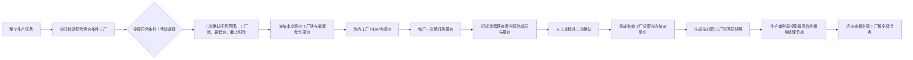
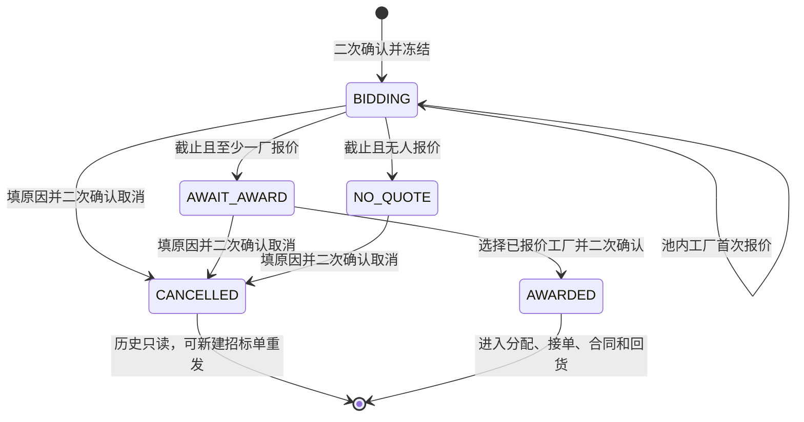
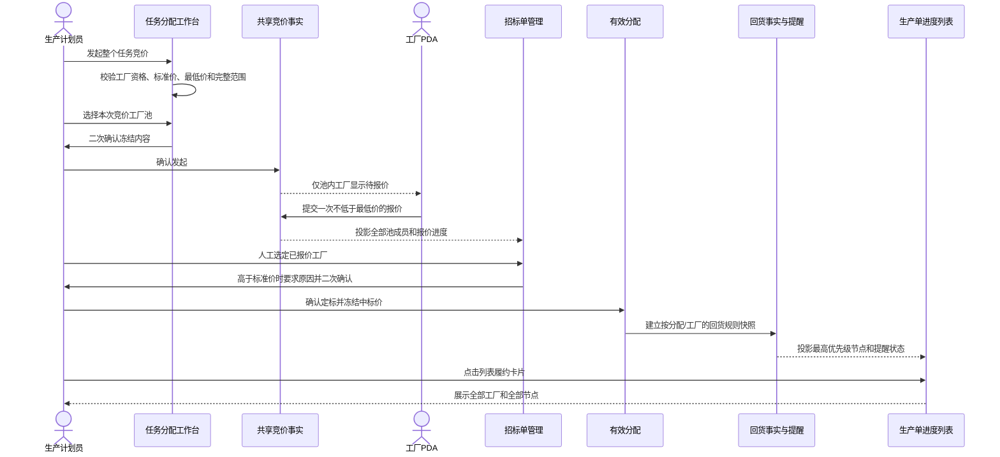

# FCS 本次竞价工厂池与生产单回货列表联动调整：实施计划与需求追踪矩阵

> 版本：2026-08-11 最终验收版
> 实现分支：`codex/fcs-tender-return-list`；合并目标：`main`
> 命名页面：`/fcs/dispatch/workbench`、`/fcs/dispatch/tenders`、`/fcs/pda/task-receive`、`/fcs/production_order_track/index`
> 本文只补充两项已确认调整：本次竞价工厂池/最低允许报价的跨端闭环，以及生产单进度列表直接展示分阶段回货履约。既有任务类型、合同模板、直接派单、合并任务和生产准备加工单边界不变。

## 1. 目标、范围与完成标准

### 1.1 目标

1. 生产计划员发起业务任务竞价时，以整个任务为不可拆范围，明确选择并冻结“本次竞价工厂池”。
2. 所有池内工厂在 PDA 收到同一招标单消息并可报价；池外工厂不可见、不可报价。
3. 竞价只设置最低允许报价，不设置最高限价；工序标准价只用于平台内部校验和定标参考。
4. 任务分配工作台与招标单管理共同展示同一工厂池、报价进度和定标结果。
5. 生产单进度列表无需进入详情，即可看出当前最需要处理的加工厂回货节点、截止日期、应回、已确认、缺口和提醒状态。
6. 列表、详情和提醒读取同一回货事实；不同分配、不同工厂不互相抵扣，页面渲染不生成提醒记录。

### 1.2 范围

- 独立生产任务和既有两类合并任务的竞价发起、PDA 报价、招标管理、定标与取消重发。
- 任务分配工作台竞价行、招标单管理列表/详情/筛选、PDA 待报价/已报价。
- 生产单进度跟踪列表、回货履约筛选、详情/展开中的按加工厂回货履约。
- 共享竞价事实、共享回货快照、到货确认事实、提醒日志和原型 Mock 投影。

### 1.3 非范围

- 不把生产准备加工单纳入任务清单、任务分配或本次竞价。
- 不调整整单生产任务，也不新增第三种合并任务。
- 不修改合同模板固定印尼文、字母、条款和版式。
- 不在竞价阶段生成合同或正式回货快照；定标形成有效分配后才开始计算。
- 不实现真实后端推送、数据库、离线队列或自动重试基础设施。

### 1.4 完成标准

- 第 8 节每条原子需求都有实现位置、专项证据和适用的命名页面证据。
- 最后一次实质修改后，专项检查、治理、构建、CodeGraph 和命名页面全部重新生成；任务收据仅在工作区不存在无法隔离的无关变化时生成，本次例外必须写入最终证据。
- 正向追踪不存在遗漏；反向追踪不存在最高限价、旧价格区间、列表“最近节点”、跨工厂汇总或渲染写提醒等冲突残留。

## 2. 核心业务对象与关系

| 对象 | 核心事实 | 不可变边界 |
| --- | --- | --- |
| 竞价任务快照 | 当前任务全部 SKU、颜色、尺码、数量、币种、计价单位 | 不勾选 SKU，不拆数量 |
| 本次竞价工厂池 | 符合条件的全部工厂，或手动选择的部分工厂 | 发起后冻结；手动已选失效时阻断，不静默剔除 |
| 竞价价格快照 | 平台内部工序标准价、最低允许报价 | 最低价必须为正且不高于标准价；不设最高价；发起后冻结 |
| 工厂报价 | 工厂身份、报价、时间、交期、备注 | 池内工厂一次报价；不低于最低价；提交后不可改 |
| 定标结果 | 中标工厂、原始报价、价格差异说明、时间 | 不自动选择最低价；中标价等于原报价；高于标准价须说明 |
| 回货规则快照 | 分配、工厂、任务、分配数量、业务分配日期、30/70/100 节点 | 归属具体分配和工厂；改派后旧快照留痕 |
| 到货确认事实 | 分配、工厂、确认数量、确认日期 | 只计入匹配的原分配；不与其他工厂互抵 |
| 回货提醒日志 | 节点、提醒类型、生成日期、目标、确认和缺口 | D-1、D0、D+1 各一次；页面只读 |

## 3. 目标业务流程

## 4. 本次竞价工厂池与价格规则

### 4.1 整任务范围

- 发起竞价不显示 SKU 复选框，只读显示完整 SKU 明细、SKU 数和任务总件数。
- SKU 明细之和必须等于任务总数量，不守恒时阻断。
- 合并任务按既有合并任务整体竞价，不新建辅助工艺或特种工艺加工单。

### 4.2 工厂池

- 默认“全部符合竞价条件的工厂”。
- 手动模式使用穿梭选择器：左侧只展示尚未入池的合格候选工厂，右侧明确展示“本次竞价工厂池”，中央提供加入、全部加入当前筛选结果、移除和全部移除。左侧可按名称、编码、地址、能力搜索并按工厂类型筛选；勾选仅表示待穿梭，不能直接改变工厂池。
- 右侧工厂池是提交校验、二次确认和最终冻结的唯一事实来源；左侧筛选变化不得影响右侧已入池工厂。默认“全部符合条件”模式应完整只读展示自动纳入的全部工厂；切换手动模式后由用户明确组池。
- 候选资格同时满足：工厂有效、允许派单、具备当前任务能力、允许竞价、PDA 已启用，并通过现有定标政策基础校验。
- 手动模式至少保留一家；最终提交前再次校验。已选工厂失效时列出具体名称并阻断，不能静默删除后继续提交。
- 提交成功后冻结任务范围、工厂池、最低允许报价、币种、计价单位和截止时间。

### 4.3 价格

- 工序标准价必须已维护、为正数，仅平台内部可见。
- 生产计划员必须手动填写本次最低允许报价；最低价为正数、币种/单位与标准价一致，且不得高于标准价。
- 不设置最高限价。工厂报价达到最低允许报价即可提交，即使高于工序标准价也可形成有效报价。
- PDA 只展示最低允许报价、币种和计价单位，不展示工序标准价、其他工厂报价或当前最低报价。
- 中标价高于标准价时，定标人必须填写价格差异说明并二次确认；低于或等于标准价时说明可选。

### 4.4 状态与页面联动

- 任务分配工作台对招标中、待定标和无人报价状态持续展示：招标单号、工厂池数量、已报价/池总数、当前最低报价、截止时间和剩余时间，并提供“查看竞价”。
- “查看竞价”深链到招标单管理并自动打开相应招标单。
- 招标单管理列表展示工厂池、已报价、未报价、报价进度、当前最高/最低报价统计、最低允许报价、内部标准价、截止和状态；“当前最高报价”只是已收到报价统计，不是最高限价。
- 招标详情列出工厂池全部成员，包括未报价工厂，并展示 PDA 消息发送状态、报价状态、报价时间、金额、交期和备注。
- 支持按状态、工序、池内工厂、报价情况、创建日期和截止日期筛选。
- 取消保留旧工厂池和报价历史；重新发起生成新招标单，不覆盖旧记录。

## 5. 生产单列表回货履约规则

### 5.1 单一事实与列表投影

- 列表和详情都从回货规则快照、到货确认事实和提醒日志投影，不另造一套列表状态。
- 同一生产单存在多个分配/加工厂时，先分别计算，再选择最需要处理的一条作为列表主信息。
- 优先级固定为：履约数据不完整 > 已逾期 > 今日到期 > 明日到期 > 即将到期 > 已达成 > 无分阶段回货规则。
- 不把不同加工厂数量汇总成一个节点；列表显示主加工厂，并显示“另有 N 家工厂、M 个未达成节点”。

### 5.2 列表字段和筛选

- 原“车缝加工厂”列调整为“加工厂 / 回货履约”。
- 列内显示状态、加工厂、节点自然日与比例、截止日期、累计应回、按期确认、缺口、提醒状态和其他工厂/节点数量。
- 点击列内履约卡片打开该生产单详情，查看所有加工厂和全部 30%/70%/100% 节点。
- 通用“状态”列不再重复回货风险；“时间”列不再展示“最近节点”。
- 回货履约筛选：履约数据不完整、已逾期、今日到期、明日到期、即将到期、已达成、无分阶段回货规则、竞价中。

### 5.3 竞价、改派、合同和提醒边界

- 尚在竞价且未定标：显示“竞价中，定标后开始计算回货履约”，不生成有效回货快照。
- 改派：旧工厂回货继续归旧分配；新工厂按新分配计算，二者不互相抵扣。
- 合同与回货规则独立判断；列表回货状态不推导合同状态，合同状态也不改变履约计算。
- 每个节点固定三类提醒：截止前 1 天、截止当天、逾期后第 1 天；同节点同类型只生成一次。
- 逾期状态持续存在直至累计确认达到目标；页面渲染只读取提醒日志，不创建或重复写提醒。

## 6. 跨端时序

## 7. 实施顺序与工作包

| 工作包 | 业务目标 | 实现位置 | 修改内容 | 验证证据 | 完成条件 |
| --- | --- | --- | --- | --- | --- |
| WP-01 | 固化竞价事实与价格门禁 | `runtime-task-tenders.ts`、`runtime-process-tasks.ts` | 去除最高价；校验标准价/最低价；冻结范围和工厂池；高于标准价定标原因 | 整任务竞价专项 | 价格、身份、状态和不可变规则可独立断言 |
| WP-02 | 补齐任务分配工作台 | `unified-dispatch-workbench.ts` | 本次工厂池、二次确认、竞价行进度、深链 | 专项契约、命名页面 | 发起和进行中均能查看完整竞价事实 |
| WP-03 | 补齐招标管理与 PDA | `dispatch-tenders.ts`、PDA 任务页和 Mock 投影 | 工厂池成员/通知/报价、筛选、最低价边界、定标原因 | 专项契约、Web/PDA 页面 | 池内/池外、报价、定标、取消一致 |
| WP-04 | 建立生产单回货列表投影 | `production-return-fulfillment.ts`、进度页、回货 Mock | 统一状态、优先级、列表字段、筛选、竞价/无规则/不完整 | 生产单进度专项 | 列表和详情读取同一事实且不跨厂汇总 |
| WP-05 | 清理冲突口径和补齐治理 | 专项脚本、设计文档、审查记录 | 删除最高价/旧价格区间、旧列名/最近节点契约 | 反向检索、治理、构建 | 无冲突源码、Mock、测试或文档 |
| WP-06 | 最终验证与二次核查 | 命名页面、CodeGraph、任务收据 | 正向/反向追踪，最后修改后重跑证据；无法隔离的无关工作区变化按治理规则记录收据例外 | 最终命令组 | 全部原子需求达到已验证，收据已生成或有明确不适用理由 |

## 8. 原子需求追踪矩阵

| 编号 | 原子需求 | 工作包 | 实现位置 | 自动化验证 | 页面/PDA验证 | 当前状态 |
| --- | --- | --- | --- | --- | --- | --- |
| TND-001 | 竞价固定覆盖整个任务，SKU 只读且数量守恒 | WP-01/02 | 竞价任务快照、整个任务展示 | `check:fcs-whole-task-tender-pool` | 任务分配竞价弹窗 | 已验证 |
| TND-002 | 支持全部符合条件与手动选择两种本次工厂池模式 | WP-02 | 工厂池模式和选择区 | 同上 | 任务分配竞价弹窗 | 已验证 |
| TND-003 | 手动模式以左候选、中央加入/移除、右侧正式工厂池的穿梭选择器组池；筛选不影响右侧，右侧是提交和二次确认唯一来源 | WP-02 | 工厂池筛选、穿梭事件和二次确认 | 源码契约；Playwright 穿梭交互 | 勾选不入池、加入/全部加入、移除/全部移除、筛选不影响右池、二次确认逐厂一致 | 已验证 |
| TND-004 | 候选工厂必须同时满足有效、能力、竞价和 PDA 条件 | WP-01/02 | 候选资格投影 | 整任务竞价专项 | 工厂池成员能力说明 | 已验证 |
| TND-005 | 最终提交再次校验手动已选工厂，失效时列名阻断 | WP-02 | 发起提交门禁 | 页面处理器契约 | 异常阻断场景 | 已验证 |
| TND-006 | 发起后任务范围、工厂池和最低价冻结，至少一家工厂 | WP-01/02 | 共享竞价记录写入校验 | 冻结/空池断言 | 二次确认摘要 | 已验证 |
| TND-007 | 标准价仅平台内部可见且必须有效；最低价手填、为正且不高于标准价 | WP-01/02 | 价格快照与发起门禁 | 最低价专项断言 | 发起竞价价格区 | 已验证 |
| TND-008 | 不设置最高限价，报价不低于最低价即可提交 | WP-01/03 | 报价门禁 | 低价阻断、高于标准价可报价 | PDA 报价弹窗 | 已验证 |
| TND-009 | PDA 只显示最低价、币种、单位，不显示标准价/他厂报价/当前最低 | WP-03 | PDA 待报价与详情 | 禁止旧字段契约 | PDA 待报价页 | 已验证 |
| TND-010 | 池外不可见/不可报价；池内一厂一次；截止后不可报价 | WP-01/03 | PDA 投影与共享报价校验 | 身份、唯一、截止断言 | PDA 待报价/已报价 | 已验证 |
| TND-011 | 不自动选择最低价；只能定标已报价工厂且中标价等于原始报价 | WP-01/03 | 定标共享事实 | 未报价/篡价断言 | 招标详情定标区 | 已验证 |
| TND-012 | 高于标准价定标必须填写差异原因并二次确认 | WP-01/03 | 定标原因与二次确认 | 高价定标正负断言 | 招标详情二次确认 | 已验证 |
| TND-013 | 发起竞价必须二次确认并展示冻结内容 | WP-02 | 发起竞价二次确认区 | 页面源码契约 | 任务分配竞价弹窗 | 已验证 |
| TND-014 | 工作台竞价中/待定标/无人报价行显示池、报价进度、最低价和截止 | WP-02 | 分配信息、价格列 | 页面源码契约 | 任务分配列表 | 已验证 |
| TND-015 | 工作台可深链招标单管理并自动打开对应招标单 | WP-02/03 | 查看竞价链接、查询参数初始化 | 页面源码契约 | 两页面联动 | 已验证 |
| TND-016 | 招标详情列出全部池成员、通知状态、报价/未报价和报价内容 | WP-03 | 招标详情工厂报价明细 | 页面源码契约 | 招标单详情 | 已验证 |
| TND-017 | 招标列表支持状态、工序、池内工厂、报价情况和创建/截止日期筛选 | WP-03 | 招标筛选状态 | 页面渲染契约 | 招标单管理列表 | 已验证 |
| TND-018 | 取消留痕，重发新建招标单且不覆盖旧工厂池/报价 | WP-01/03 | 取消与历史记录 | 取消/重发断言 | 招标单管理详情 | 已验证 |
| RET-001 | 列表和详情使用同一回货快照、到货事实和提醒日志 | WP-04 | 共享回货事实和页面投影 | 生产单进度专项 | 列表/详情一致 | 已验证 |
| RET-002 | 列表列名为“加工厂 / 回货履约”，通用状态和时间列不重复旧风险/最近节点 | WP-04 | 生产单列表列配置 | 旧文案负向断言 | 生产单进度列表 | 已验证 |
| RET-003 | 按分配/工厂分别计算，不跨厂汇总；列表选择最高优先级一条 | WP-04 | 生产单回货摘要投影 | 多工厂 Mock 契约 | 列表主加工厂卡片 | 已验证 |
| RET-004 | 优先级为不完整、逾期、今日、明日、即将、达成、无规则 | WP-04 | 回货状态排序 | 状态契约 | 回货筛选与状态色 | 已验证 |
| RET-005 | 列表显示节点、截止、应回、按期确认、缺口和提醒状态 | WP-04 | 履约列表卡片 | 页面专项 | 生产单进度列表 | 已验证 |
| RET-006 | 多工厂/多节点显示额外数量，点击查看全部工厂和节点 | WP-04 | 列表卡片与详情动作 | 页面专项 | 列表至详情 | 已验证 |
| RET-007 | 竞价未定标显示“定标后开始计算”，不生成回货快照 | WP-04 | 竞价回货摘要 | 页面专项 | 竞价中生产单行 | 已验证 |
| RET-008 | D-1/D0/D+1 各一次；逾期持续；渲染不写提醒 | WP-04 | 提醒日志与列表投影 | 渲染前后日志数量断言 | 列表/详情提醒文案 | 已验证 |
| RET-009 | 改派前后分配分别履约，原工厂回货不计入新工厂 | WP-04 | 快照归属与详情说明 | 既有回货专项 | 生产单详情 | 已验证 |
| RET-010 | 合同状态与回货规则独立，不互相推导 | WP-04 | 进度筛选与详情说明 | 页面专项 | 生产单列表/详情 | 已验证 |
| RET-011 | Mock 只种共享事实，列表和详情由共享事实投影 | WP-04/05 | 回货演示事实种子 | 渲染只读断言 | 命名页面演示 | 已验证 |
| CLEAN-001 | 源码、Mock、专项和设计文档不残留最高限价或旧报价区间规则 | WP-05 | 竞价域与文档 | 反向检索 | 不适用 | 已验证 |
| CLEAN-002 | 生产单专项不再期待“车缝加工厂”“违反回货规则”“最近节点” | WP-05 | 进度专项契约 | 旧文案负向断言 | 生产单列表 | 已验证 |
| CLEAN-003 | Node 专项不得因读取浏览器存储触发 `localStorage` 实验性警告；浏览器存储不可用或被拒绝时安全返回空存储 | WP-05/06 | 浏览器存储适配器；实际加载的 FCS 裁床排唛来源/投影/模型、裁单关闭记录、毛织事实仓库；上游 PCS 配置、款式档案、技术包版本仓库 | 四组带 `--trace-warnings` 的专项；Web/PDA 回归 | 浏览器页面继续读写真实 `window` 存储 | 已验证 |
| QA-001 | 最后修改后完成专项、治理、构建、CodeGraph 和命名页面；任务收据须生成或明确记录无法隔离的无关变化 | WP-06 | 最终证据链 | 最终命令组 | 四个命名页面；收据例外见第 11 节 | 已验证 |
| QA-002 | 生产单款式/物料缩略图可打开高清大图，关闭按钮和 Esc 均可关闭 | WP-04/06 | 生产单进度页、大图 Esc 路由处理 | 生产单进度专项 | 生产单列表大图 | 已验证 |

## 9. 正常、边界与恢复场景

### 9.1 正常竞价

计划员为完整车缝任务选择“全部符合条件工厂”，填写最低允许报价和截止时间，二次确认后发起。池内工厂 PDA 看到同一任务并各自报价；截止后定标员在招标详情查看全部池成员，选择一家已报价工厂，按原始报价二次确认。若中标价高于标准价，必须先填写差异原因。定标后生成有效分配，适用任务才开始计算合同和回货规则。

### 9.2 手动池失效

计划员手动选择两家工厂，但提交前其中一家被停用或关闭 PDA。系统列出失效工厂并阻断，不静默删除后继续发起；计划员返回修改工厂池后重新二次确认。

### 9.3 竞价无人报价

截止时无人报价，任务工作台和招标管理都显示“无人报价”。平台不能直接指定未报价工厂；只能填写原因并二次确认取消，旧工厂池留痕，再生成新招标单重发。

### 9.4 多工厂回货

同一生产单由甲、乙两家工厂分别承接。甲厂节点逾期，乙厂今日到期，列表显示甲厂逾期节点，并提示另有一家工厂；点击后分别展示甲、乙各自数量和节点，任何一方回货都不抵扣另一方。

### 9.5 回货数据不完整

任务已适用分阶段回货规则但缺少有效分配快照时，列表显示“履约数据不完整”，优先级高于逾期提醒，提示先修复分配/快照事实，不能用零数量或无规则掩盖。

## 10. 最终核查方法

1. 正向追踪：从第 1～6 节逐条走到第 8 节、实现位置和证据。
2. 反向追踪：从本次全部源码、Mock、脚本、文档和页面差异回到需求编号。
3. 重点负向检索：最高限价、最低/最高区间、竞价 SKU 复选框、工厂池静默剔除、PDA 标准价/他厂报价、自动最低价中标、跨厂数量汇总、列表最近节点、渲染生成提醒。
4. 只有最后一次修改后的证据才有效；最终验证结果写回第 8 节状态和原型审查记录。

## 11. 最终验证证据

- 自动化：竞价工厂池、PDA 报价、回货预览、生产单进度、统一分配、合同母版、菲票装袋、PDA 接单及改派专项全部通过。
- 命名页面：任务分配工作台完成整任务、两种工厂池、最低价与二次确认；PDA 完成低于最低价阻断与有效报价；招标管理完成同一招标单深链、全部池成员和报价进度；生产单列表完成逾期/竞价中筛选及多工厂详情。
- 浏览器控制台：四个命名页面回放期间错误为 0。
- 截图：`.playwright-cli/element-2026-08-11T11-05-00-978Z.png`（1366×768 穿梭选择器及右侧正式工厂池）、`.playwright-cli/page-2026-08-11T08-16-08-534Z.png`（工厂池与报价详情）、`/private/tmp/fcs-production-return-detail-2026-08-11.png`（生产单多工厂回货详情）。
- 治理与构建：`check:prototype-design-governance -- --all`、`check:list-page-governance`、生产构建均通过。
- CodeGraph：同步后 1,486 个文件、45,581 个节点、162,758 条边，无待同步文件。
- 任务收据：本工作区不适用。`workflow:verify --paths` 会强制覆盖全部实际变化，并因未跟踪的无关文件 `docs/product-design/PCS生产工程管理完整调整方案.md` 不在本轮 FCS 边界而拒绝生成；未搬移、暂存或吸收该用户文件。该例外不代表 FCS 专项、命名页面、治理、构建或 CodeGraph 失败。
- 双向核查：第 1～6 节全部规范映射到 TND/RET/CLEAN/QA；全部受管源码、Mock、专项和文档差异均已回到对应编号，未发现越界实现。
