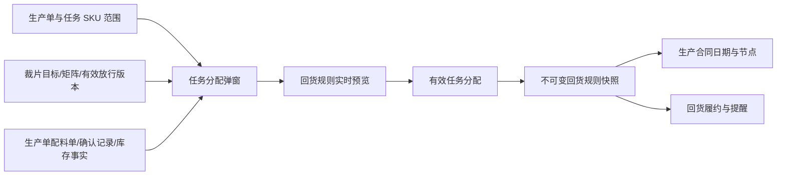

# FCS 车缝准备事实与回货预览调整：实施计划与需求追踪矩阵

> 版本：2026-08-10 实施版
> 当前分支：`codex/fcs-sewing-preparation-return-preview`
> 命名页面：`/fcs/dispatch/workbench`
> 本文用于把已确认需求、实施顺序、实现位置和验收证据逐项闭环；不替代既有统一任务分配与生产合同总体 PRD。
>
> 2026-08-11 起，`FLOW-005` 的整任务竞价范围、候选工厂池、PDA 报价、定标和取消重发详细口径，以《FCS整任务竞价工厂池与PDA报价闭环实施及追踪矩阵》为权威补充；本文继续约束业务日期、回货预览和合同衔接。

## 1. 目标与完成标准

### 1.1 目标

1. 独立车缝任务、车缝+烫包合并任务在分配时，按 SKU（颜色+尺码）展示裁片目标、齐套、已确认放行及风险放行事实。
2. 同一弹窗展示该生产单车缝所需辅料的库存与已确认配料事实，不再用任务数量临时估算，也不再展示固定辅料 Mock。
3. 在“业务分配日期/时间”下方实时展示 30%、70%、100% 三个累计回货节点；日期、数量与最终有效回货快照使用同一计算口径。
4. 直接派单、竞价定标、改派三条路径保持一致；准备信息只提示风险，不阻断生产分配。

### 1.2 完成标准

- 本文所有原子需求均有实现位置和当前版本证据。
- 业务契约、命名页面浏览器验收、合同模板保真、原型治理、构建、CodeGraph 和任务收据全部通过。
- 第二轮正向追踪不存在漏做条目，反向追踪不存在越界逻辑、旧估算或固定辅料 Mock。
- 不修改生产合同主模板的固定条款、字符和样式；合同仍只打印日期，不打印具体时间。

## 2. 范围、非范围与业务事实

### 2.1 本次范围

- 独立车缝任务。
- 车缝+烫包合并任务。
- 裁剪+车缝+烫包合并任务的分阶段回货和合同口径。
- 直接派单、发起竞价/定标、改派中的业务日期、有效数量与回货快照一致性。
- 任务分配弹窗、相关 Mock 事实、专项契约与原型审查记录。

### 2.2 非范围

- 不新增真实后端、接口或数据库。
- 不改变菲票装袋、合同固定条款、回货提醒生成、生产单进度查询的既有总体规则。
- 不让普通非车缝独立任务展示车缝准备信息。
- 不在裁剪+车缝+烫包合并任务中展示车缝前置准备面板，因为裁剪已包含在该第三方工厂责任范围内。
- 不把准备不足、库存不足或裁片不足变为派单阻断条件。

### 2.3 规则快照

| 任务类型 | 分配准备面板 | 30% | 70% | 100% | 合同 |
| --- | --- | --- | --- | --- | --- |
| 独立车缝 | 展示 | 第 4 自然日 | 第 8 自然日 | 第 9 自然日 | 有 |
| 车缝+烫包 | 展示 | 第 5 自然日 | 第 9 自然日 | 第 10 自然日 | 有 |
| 裁剪+车缝+烫包 | 不展示 | 第 6 自然日 | 第 9 自然日 | 第 12 自然日 | 有 |
| 其他无分阶段回货规则任务 | 不展示 | 不适用 | 不适用 | 不适用 | 按既有合同判断 |

分配日期为第 1 个自然日；30% 与 70% 的累计数量向上取整，100% 等于有效分配数量。

## 3. 数据来源与上下游

- 裁片事实：读取裁片矩阵、已确认目标和当前有效放行版本，匹配 `SKU`；仅在 SKU 编码无法唯一匹配时，回退到颜色+尺码唯一匹配。
- 辅料事实：读取生产单配料范围、已确认配料记录和当前库存，不按本次选择的任务数量二次推算。
- 回货事实：预览与提交均调用同一规则构造；提交后形成不可变快照，后续合同、履约和提醒读取快照。

## 4. 实施顺序与工作包

| 工作包 | 业务目标 | 文件/符号 | 修改内容 | 验证证据 | 完成条件 |
| --- | --- | --- | --- | --- | --- |
| WP-01 | 建立可追溯准备事实 | `cut-piece-release.ts`、`production-material-prep.ts`、生产单 Mock | 补齐 PO-202603-0002 的 4 个 SKU 裁片目标/齐套/放行事实及 4 项车缝辅料库存/配料事实；提供只读投影 | 专项业务契约 | 数量、单位、来源、更新时间可逐项断言 |
| WP-02 | 建立单一回货预览口径 | `production-return-fulfillment.ts` | 从策略、业务日期和有效数量生成 30/70/100 预览；有效快照复用同一构造 | 专项业务契约、旧统一分配契约 | 三套规则、日期、取整和快照一致 |
| WP-03 | 贯通三种分配路径 | `runtime-process-tasks.ts`、`runtime-task-tenders.ts`、`dispatch-tenders.ts` | 改派数量=原有效分配-已确认实收；竞价保存共享招标事实和业务日期，过滤不可竞价工厂，并在定标时继承 | 专项业务契约、浏览器场景 | 直接、竞价、改派不各自发明数量/日期；发起竞价与招标管理读取同一招标事实 |
| WP-04 | 调整任务分配弹窗 | `unified-dispatch-workbench.ts` | SKU 裁片表、生产单辅料表、真实物料图与大图、业务日期下方回货预览、二次确认复核 | Playwright 命名页面证据 | 页面字段完整、选择变化实时重算、提示不阻断 |
| WP-05 | 清理、治理与交付核查 | 专项脚本、Playwright、审查记录、本文 | 删除旧估算/固定物料 Mock，补充正反向追踪和最终证据 | 治理、构建、CodeGraph、任务收据 | 所有门禁通过且无无说明遗留项 |

## 5. 原子需求追踪与交付矩阵

> 2026-08-10 第二轮核查结果：可独立验证的业务、页面、图片、打印与数据清洁条目均已取得当前分支证据并标记“已验证”；项目级总门禁 `QA-002` 因本次未改动的 WLS 历史列表页未通过全局列表治理而标记“已阻塞”。产品确认列不把本地自检冒充产品接受。

| 编号 | 来源 | 原子需求 | 工作包 | 实现位置 | 自动化验证 | 页面/图片/打印验证 | 状态 | 证据位置 | 产品确认人/版本 |
| --- | --- | --- | --- | --- | --- | --- | --- | --- | --- |
| PREP-001 | 需求 1 | 独立车缝和车缝+烫包分配时展示车缝准备事实 | WP-01/04 | `task-fulfillment-policy.ts`、`renderDispatchDialog` | `check:fcs-sewing-preparation-return-preview` | 命名页面直接派单弹窗 | 已验证 | 专项脚本、Playwright 第 1 场景 | 待用户验收/本分支 |
| PREP-002 | 需求 1 | 裁剪+车缝+烫包不展示该准备面板 | WP-01/04 | `requiresSewingReadinessContext` | 三种策略断言 | 不适用（策略边界） | 已验证 | 专项脚本 | 待用户验收/本分支 |
| CUT-001 | 需求 1 | 裁片准备按 SKU（颜色+尺码）逐行展示 | WP-01/04 | `getCutPieceDispatchReadinessForTask`、`renderSewingPreparationOverview` | 4 SKU 与单 SKU 投影断言 | 4 行、选 S 后 1 行 | 已验证 | Playwright 第 1 场景 | 待用户验收/本分支 |
| CUT-002 | 需求 1 | 每行展示本次任务、裁床目标、当前齐套、已确认放行、风险放行 | WP-01/04 | 同上 | S/M/L/XL 数量逐项断言 | M 码显示 20 件风险放行 | 已验证 | 专项脚本、页面截图 | 待用户验收/本分支 |
| CUT-003 | 需求 1 | 展示裁片记录号和包含放行确认的最近更新时间 | WP-01/04 | `latestUpdatedAt` 投影 | `2026-08-10 09:15:00` 断言 | 弹窗记录摘要 | 已验证 | 专项脚本、Playwright | 待用户验收/本分支 |
| CUT-004 | 边界口径 | 无裁片记录或无法唯一匹配时显示待同步/风险，不阻断分配 | WP-01/04 | 裁片只读投影缺失分支 | 缺失生产单断言 | 页面蓝色非阻断说明 | 已验证 | 专项脚本、Playwright | 待用户验收/本分支 |
| MAT-001 | 需求 1 | 展示生产单车缝所需全部辅料，不按当前选择数量估算 | WP-01/04 | `getMaterialPrepDispatchReadinessForTask` | 选择单 SKU 后辅料仍为 4 行 | 直接派单弹窗 | 已验证 | 专项脚本、Playwright | 待用户验收/本分支 |
| MAT-002 | 需求 1 | 每项展示生产单所需、已确认配料、未配数量、当前库存和上游状态 | WP-01/04 | 配料投影与辅料表格 | 4 项数量/单位逐项断言 | 辅料表格字段验收 | 已验证 | 专项脚本、Playwright | 待用户验收/本分支 |
| MAT-003 | 图片门禁 | 每种辅料有对应真实物料缩略图、失败态和高清大图 | WP-01/04 | 配料 Mock 图片、`preview-image` | 4 个图片文件存在 | 4 图加载、大图、Esc 关闭 | 已验证 | Playwright 第 1 场景 | 待用户验收/本分支 |
| MAT-004 | 边界口径 | 配料或库存不足仅提示风险，不阻断派单/竞价 | WP-01/04 | 准备摘要与非阻断文案 | 页面源码契约 | 能进入价格二次确认 | 已验证 | 统一分配契约、Playwright | 待用户验收/本分支 |
| RET-001 | 需求 2 | 回货规则紧邻业务分配日期/时间下方展示 | WP-02/04 | `renderReturnRulePreview` | 页面源码契约 | 页面字段顺序验收 | 已验证 | 统一分配契约、Playwright | 待用户验收/本分支 |
| RET-002 | 需求 2 | 分配日期为第 1 个自然日，合同只打印日期 | WP-02/04 | `calculateNaturalDayDeadline`、页面说明 | 固定日期断言 | 页面说明；打印模板未改 | 已验证 | 专项脚本、合同保真检查 | 待用户验收/本分支 |
| RET-003 | 规则确认 | 独立车缝采用第 4/8/9 自然日 | WP-02 | 策略+预览构造 | 4/8/9 日期断言 | 直接派单预览 | 已验证 | 专项脚本、Playwright | 待用户验收/本分支 |
| RET-004 | 规则确认 | 车缝+烫包采用第 5/9/10 自然日 | WP-02 | 策略+预览构造 | 5/9/10 日期断言 | 不适用（同一渲染器） | 已验证 | 专项脚本 | 待用户验收/本分支 |
| RET-005 | 规则确认 | 裁剪+车缝+烫包采用第 6/9/12 自然日 | WP-02 | 策略+预览构造 | 6/9/12 日期断言 | 不适用（同一渲染器） | 已验证 | 专项脚本 | 待用户验收/本分支 |
| RET-006 | 数量口径 | 30%/70% 向上取整，100% 等于有效分配数量 | WP-02 | `buildProductionReturnRulePreview` | 101 件得 31/71/101 | 500 件得 150/350/500 | 已验证 | 专项脚本、Playwright | 待用户验收/本分支 |
| RET-007 | 数据一致性 | 预览与提交后的回货规则快照完全一致 | WP-02/03 | 预览构造、快照构造 | 深度相等断言 | 不适用（数据契约） | 已验证 | 专项脚本 | 待用户验收/本分支 |
| FLOW-001 | 分配流程 | 直接派单使用选中完整 SKU 数量，二次确认再次展示回货规则 | WP-03/04 | 直接派单提交与二次确认 | 统一分配契约 | S 码 500 件二次确认 | 已验证 | Playwright 第 1 场景 | 待用户验收/本分支 |
| FLOW-002 | 分配流程 | 竞价保存业务分配日期，定标时优先使用任务/竞价业务日期而非当前时间 | WP-03/04 | `resolveTenderBusinessAssignedAt`、定标提交 | 三种优先级断言 | 竞价回货预览 | 已验证 | 专项脚本、Playwright 第 2 场景 | 待用户验收/本分支 |
| FLOW-003 | 分配流程 | 改派数量固定为原有效分配减去已确认实收，页面不可另选 SKU 或改数量 | WP-03/04 | `getRuntimeSewingTaskReassignmentScopePreview` | 数量公式断言 | 改派只读范围、无 SKU 输入 | 已验证 | 专项脚本、Playwright 第 2 场景 | 待用户验收/本分支 |
| FLOW-004 | 规则边界 | 无分阶段回货规则任务不展示预览、不生成快照 | WP-02 | 预览构造空分支 | 裁片任务返回 `null` | 不适用 | 已验证 | 专项脚本 | 待用户验收/本分支 |
| FLOW-005 | 分配流程 | 发起竞价与招标管理读取同一招标事实；候选池排除不可竞价工厂；同一工厂只可报价一次 | WP-03/04 | `runtime-task-tenders.ts`、`listEligibleTenderFactoriesForTask`、`projectRuntimeTenderRows` | 共享招标、候选池、报价不可修改断言 | 从任务分配发起竞价后进入招标管理完成定标 | 已验证 | 专项脚本、Playwright 第 2 场景 | 待用户验收/本分支 |
| CONTRACT-001 | 合同强约束 | 不修改合同主模板固定条款、字符和样式 | WP-02/05 | 未触碰主模板；仅向既有快照供数 | 合同模板保真检查 | 既有合同打印专项 | 已验证 | 合同保真命令 | 待用户验收/本分支 |
| CLEAN-001 | 数据清洁 | 清除任务分配中的固定百分比裁片估算和固定辅料图片 Mock | WP-01/05 | 统一分配页、生产单/配料 Mock | 禁止字面量断言 | 真实事实页面 | 已验证 | 专项脚本、反向追踪 | 待用户验收/本分支 |
| QA-001 | 完成门禁 | 1366×768 可操作且整页无横向溢出，弹窗内部宽表可滚动 | WP-04/05 | 弹窗布局 | Playwright | 1366×768 实机浏览器场景 | 已验证 | Playwright 第 1 场景 | 待用户验收/本分支 |
| QA-002 | 完成门禁 | 完成治理、构建、CodeGraph、任务收据及正反向追踪 | WP-05 | 检查脚本与审查记录 | 最终命令组 | 不适用 | 已阻塞 | `/private/tmp/higoods-fcs-prep-return-receipt.json`；全局列表治理被未改动的 WLS 页面阻断 | 待用户验收/本分支 |

## 6. 正常与边界场景

### 6.1 正常场景

生产计划员为 PO-202603-0002 的独立车缝任务直接派单。系统展示 Grey 的 S/M/L/XL 四个 SKU 的裁片事实、四项生产单辅料事实；选择全部 2,500 件并指定 2026-08-11 为业务日期时，节点为 2026-08-14/18/19，累计数量为 750/1,750/2,500 件。切换自由分配并仅选择 S 码后，裁片表收敛为一行，辅料仍是生产单四项，节点数量变为 150/350/500 件。

### 6.2 边界场景

- 某 SKU 裁片未齐套或有风险放行：显示差额和原因，但仍可进入价格二次确认。
- 某生产单尚无裁片/配料同步事实：显示待同步或缺失提示，不使用假数据补齐，也不阻断。
- 101 件任务：30% 和 70% 分别为 31、71 件，避免累计数量小于规则比例。
- 改派任务已有实收：只改派剩余量；不得把原任务总量再次交给新工厂。
- 竞价跨日定标：继续使用发起竞价时保存的业务分配日期，不用定标操作时间替换。

## 7. 第二轮核查方法

1. 正向追踪：从第 2～3 节每条规范逐条走到矩阵、实现位置和证据。
2. 反向追踪：从本次全部 diff 回到矩阵编号，检查无未声明业务能力；检索旧固定估算、固定辅料 Mock 和合同模板差异。
3. 最后一次实质修改后重跑专项契约、Playwright、治理、构建、CodeGraph 和任务收据；旧结果不作为最终证据。

## 8. 变更记录

| 日期 | 变更 | 影响需求 |
| --- | --- | --- |
| 2026-08-10 | 首次建立实施与追踪矩阵 | 全部 |
| 2026-08-10 | 第一轮契约发现最近更新时间未包含放行确认，已修正为裁片/放行最新时间 | CUT-003 |
| 2026-08-10 | 浏览器验收补充大图 Esc 仅关闭大图，不丢失派单上下文 | MAT-003 |
| 2026-08-10 | 完整 diff 审查发现定标预览读取不存在的比例标签字段，改为由比例值生成 30%/70%/100% | FLOW-002、RET-003～005 |
| 2026-08-10 | 第二轮链路验收发现招标管理仍读取已删除的旧看板状态，新增共享招标事实并统一发起竞价与定标入口 | FLOW-002、FLOW-005 |
| 2026-08-10 | 定标实测发现直接承接能力与竞价资格混用，候选池改为排除主管指定等不可竞价工厂 | FLOW-005 |
| 2026-08-11 | 将 FLOW-005 拆入整任务竞价专项矩阵，补齐完整任务、冻结工厂池、PDA 报价、定标和取消重发闭环 | FLOW-005 |

## 9. 最终验证结果

- 业务专项：`check:fcs-sewing-preparation-return-preview`、统一分配基础、合同模板保真、菲票装袋、车缝改派冷启动、标准列表模板均通过。
- 命名页面：Playwright 两个场景 2/2 通过，覆盖直接派单、SKU 收敛、辅料图片与大图、回货预览、发起竞价、报价、定标、合同快照和改派只读范围。
- 原型治理：本次 9 个受管文件和本审查记录通过完整治理检查。
- 构建：通过，共处理 2,323 个模块；无包体超阈值警告。存在仓库工具链层的 Browserslist 数据过期和 Node 26 `module.register()` 弃用提示，本次未升级依赖。
- CodeGraph：最终同步成功，1,463 个文件、44,942 个节点、173,407 条边，待同步文件为 0。
- 正向追踪：第 1～3 节所有规范均映射到 26 条原子需求；25 条已有充分证据并标记“已验证”。
- 反向追踪：本次全部源码、Mock、页面、脚本与测试均能回到需求编号；合同主模板无差异，未发现旧固定裁片估算、固定辅料 Mock 或已删除看板状态引用。
- 项目任务收据：已生成，但状态为 `implemented`。唯一阻塞为全局 `check:list-page-governance` 扫描到本次未改动的 `src/pages/wls-fabric-demand-board.ts`；根据任务边界未修改 WLS 页面、未改历史基线，也未将该无关问题伪装成通过。
