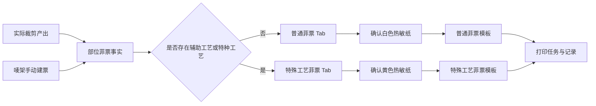
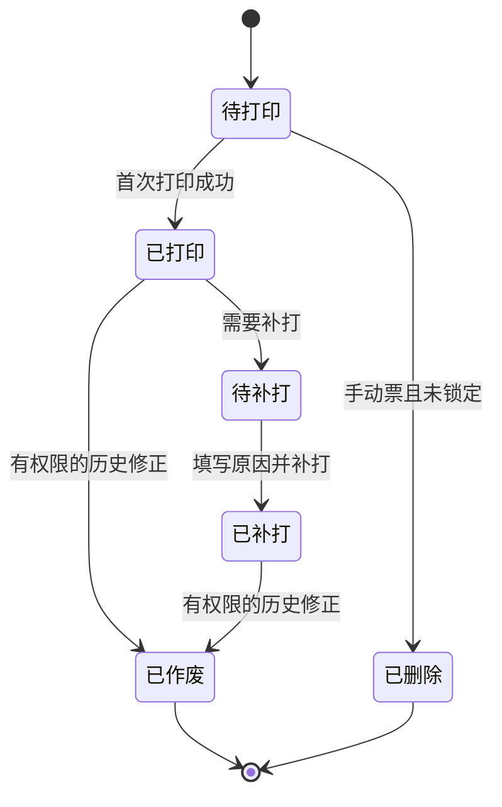

# FCS 部位菲票手动建票与分纸打印总体设计

## 1. 目标

在裁床菲票打印工作台补齐无铺布单时按唛架手动建票、部位菲票维护、辅助工艺与特种工艺识别，以及白色／黄色热敏纸分流打印。页面、打印预览、正式模板和打印记录必须读取同一份菲票事实。

## 2. 范围

- 列表页手动增加菲票：按唛架及唛架成员生成一个待打印菲票批次。
- 详情页维护：普通／特殊工艺 Tab、新增、修改数量、删除、筛选、分页、勾选、批量打印、全部打印、补打和单条详情。
- 特殊工艺口径：页面统称“特殊工艺”，业务范围同时包含辅助工艺和特种工艺；捆条菲票维持独立链路。
- 打印分流：普通菲票使用白色热敏纸，特殊工艺菲票使用黄色热敏纸，单次打印不得混纸。
- 模板：普通菲票删除特殊工艺字段；特殊工艺菲票在标题区显著展示工艺和承接工厂，并明确展示生产单号（PO）和 SPU。
- 追溯：打印与补打记录保存纸张颜色、标签尺寸、模板版本和操作事实。

## 3. 非范围

- 不实现真实后端、数据库、打印机驱动或打印机纸张自动识别。
- 不修改 PDA 任务逻辑。
- 不改变捆条菲票的独立路由和模板。
- 不将手动建票伪装成已经完成铺布或裁剪。

## 4. 业务对象

### 4.1 自动菲票来源

来源为实际裁剪产出，保留铺布单、裁片单、唛架、部位、尺码、实际裁片数量和编号范围。

### 4.2 手动菲票来源

来源为唛架方案和唛架成员，不要求存在铺布单。记录手动批次、唛架、成员、生产单、裁片单、SPU、颜色、SKU、尺码、部位、层数、每层件数、单件片数、总片数、创建人和创建时间。

### 4.3 纸张属性

纸张颜色与物理尺寸分开保存：

- 普通菲票：白色热敏纸。
- 特殊工艺菲票：黄色热敏纸。
- 物理尺寸继续使用现有 10cm×10cm 或 15cm×10cm 标签尺寸。

## 5. 核心规则

1. 手动建票必须选择现有且可用的唛架和一个唛架成员。
2. 手动建票数量按“层数 × 每层该尺码件数 × 单件该部位片数”计算，件和片均为整数。
3. 手动建票无铺布单时明确显示“无铺布单”，不得生成虚构编号。
4. 是否特殊工艺按每张部位菲票判断，不能按整组判断。
5. 特殊工艺事实来自部位工艺要求和有效承接工厂；不得按菲票序号轮换生成。
6. 特殊工艺存在但承接工厂缺失时，正式打印阻断。
7. Tab 切换后清空跨 Tab 勾选；批量打印和全部打印只作用于当前 Tab。
8. 普通与特殊工艺菲票不能进入同一个打印任务。
9. 未打印且未进入下游的手动菲票可以修改数量或删除；修改数量必须填写原因，并同步更新二维码数量与部位裁片编号范围；已打印或已锁定记录不得覆盖历史。
10. 补打继承原菲票的纸张颜色，必须填写补打原因，并保存操作人、模板、纸色、标签尺寸和来源范围。
11. 列表、详情、打印模板和二维码必须引用同一生产单、裁片单、唛架、SPU、SKU、部位、尺码、数量和工艺事实；黄色特殊工艺菲票必须将生产单号（PO）和 SPU 作为独立可见字段展示，不能仅依赖通用标题推断。

## 6. 页面与打印流程

## 7. 状态

## 8. 完成口径

总体交付仅在需求追踪矩阵全部条目有实现位置、自动化证据和适用的页面／打印证据，且不存在无说明的待实施、实施中、待验证或已阻塞条目时完成。

## 9. 验收场景

1. **手动建票正常场景**：列表点击“手动增加打印菲票”，选择现有唛架及成员，系统自动带出生产单、裁片单、SPU、颜色、SKU 和尺码；输入层数后生成一个手动批次，刷新后仍存在。
2. **手动建票数量场景**：生成后的每张部位菲票数量等于层数 × 对应尺码每层件数 × 单件部位片数，单位明确为片；无铺布单时始终显示“无铺布单”。
3. **手动建票阻断场景**：层数小于 1、所有尺码件数为 0、唛架或成员缺失时不生成记录，并说明修正动作。
4. **详情白纸场景**：普通 Tab 只展示无辅助／特种工艺菲票，提示白色热敏纸，表格与模板均不出现“特殊工艺／承接工厂”。
5. **详情黄纸场景**：特殊工艺 Tab 只展示含辅助工艺或特种工艺菲票，提示黄色热敏纸，并显示实际工艺与承接工厂。
6. **新增与改量场景**：详情可新增未打印菲票；修改数量必须填写原因，修改后数量、编号范围和二维码载荷同步变化，日志保留修改前后事实。
7. **历史保护场景**：已打印、已补打或已进入下游的菲票不显示改量和删除动作；未打印且未锁定的手动票才可删除。
8. **筛选与分页场景**：按手动标识、票号、部位、尺码、SKU、生产单筛选；重置恢复默认；分页不丢失当前筛选口径。
9. **选择边界场景**：全选只覆盖当前筛选与当前 Tab；切换白／黄纸 Tab 后清空旧选择；批量打印和全部打印只处理当前 Tab。
10. **纸张确认场景**：白纸与黄纸打印均需二次确认已装入对应热敏纸；系统不声称能够自动识别打印机中的纸张。
11. **混纸与缺工厂阻断场景**：任何混合白／黄纸的打印请求均阻断；特殊工艺存在但承接工厂缺失时阻断，并明确缺失对象。
12. **普通模板场景**：标题和其余原有菲票信息保持，整行删除“特殊工艺／承接工厂”，二维码可扫描识别当前菲票。
13. **特殊模板场景**：标题显著标识“特殊工艺菲票（黄色热敏纸）”，正文独立展示非空的生产单号（PO）、SPU、辅助／特种工艺与承接工厂；长文本允许换行，二维码可扫描识别当前菲票。
14. **补打追溯场景**：补打必须填写原因，继承原纸色和模板；完成打印动作后记录打印／补打、原因、操作人、纸色、模板、标签尺寸和来源范围。
15. **相邻回归场景**：捆条菲票独立链路、原部位菲票来源追溯、菲票二维码、编号和中转袋关联不因本次调整改变。
