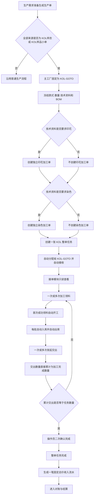
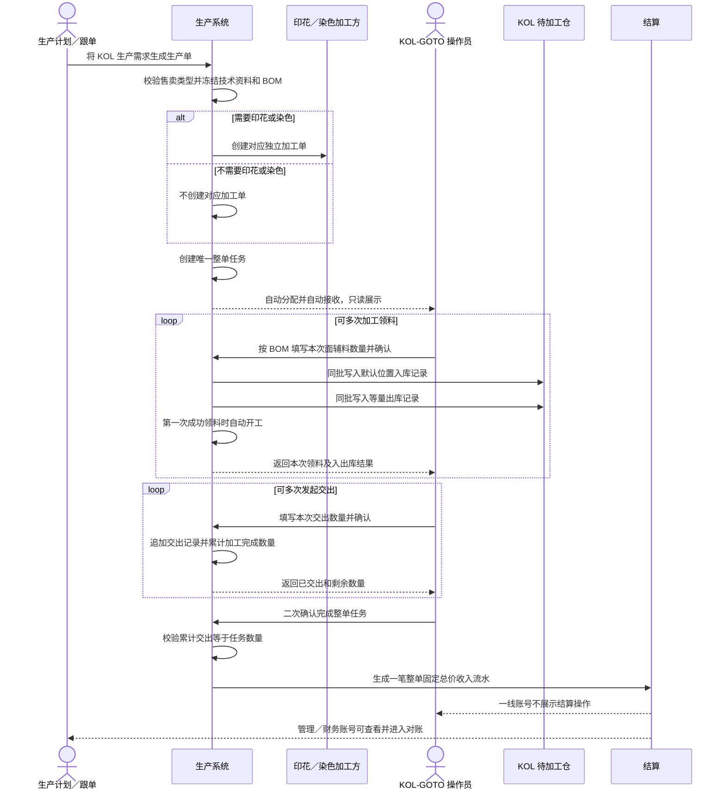
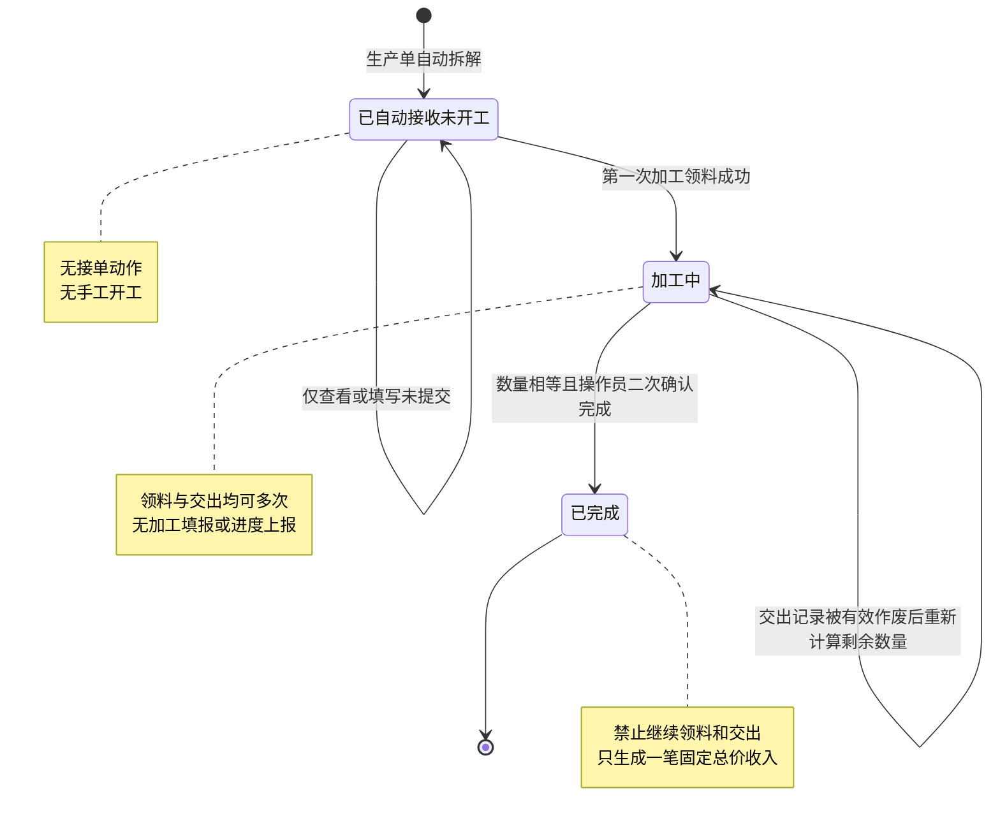

# KOL-GOTO 特殊生产与 PDA 执行产品需求文档

## 文档信息

| 项目 | 内容 |
| --- | --- |
| 文档用途 | 交付产品、研发、测试共同实施与验收 |
| 版本 | V1.0 |
| 日期 | 2026-08-19 |
| 特殊工厂 | 工厂编号 `KOL-GOTO` |
| 适用售卖类型 | `KOL样衣`、`KOL样品小单` |
| 核心原则 | 仅 KOL-GOTO 使用特殊流程；其他工厂和其他售卖类型保持现有流程 |

## 1. 背景与目标

KOL 样衣生产具有数量小、时效紧、承接工厂固定、现场操作短的特点。现有通用流程中的任务生成规则、竞价、接单确认、多节点填报、普通领料和双仓操作，会增加现场理解与操作成本，也容易让 KOL 整单被错误分配到其他工厂。

本需求建立一条只属于 KOL-GOTO 的固定业务链：生产需求生成生产单时自动拆解；需要印花或染色时自动创建相应加工单；其余生产责任合并为一张 KOL 整单任务并自动交给 KOL-GOTO；现场只进行加工领料、发起交出和完成；任务完成后按整单固定总价进入结算。

同时，完整取消“生产单任务生成规则”这一产品能力。KOL 特殊流程不是一条可配置规则，也不允许其他工厂通过配置获得同类能力。

## 2. 范围与边界

### 2.1 必须同时满足的特殊流程条件

只有同时满足以下条件，才进入本需求定义的特殊流程：

1. 生产单的全部来源生产需求，售卖类型均为 `KOL样衣` 或 `KOL样品小单`。
2. 生产单的主工厂为 KOL-GOTO。
3. 当前任务是该生产单唯一的整单生产任务。
4. 当前操作账号属于 KOL-GOTO，并具备对应角色权限。

任一条件不满足，都不得套用 KOL 特殊流程，也不得自动降级到另一个工厂的数据或权限范围。

### 2.2 必须保持不变的范围

- 其他工厂的派单、竞价、接单、执行、交接、仓储和结算保持现有流程。
- 非 `KOL样衣`、非 `KOL样品小单`的生产需求保持现有流程。
- 印花、染色加工单由对应加工工厂按现有流程承接、执行、交接和结算。
- KOL 生产需求不得与非 KOL 售卖类型混合生成同一张生产单。
- 本需求不新增可配置的特殊工厂、流程模板、规则中心或审批流程。

## 3. 产品目标与非目标

### 3.1 产品目标

- 生产需求转生产单、印染加工单生成和整单任务生成一次完成。
- KOL 整单任务从创建到完成始终由 KOL-GOTO 承接。
- KOL 接单模块只用于查看，不提供任何竞价或接单动作。
- KOL 一线执行只保留“去加工领料”“发起交出”“完成”。
- 加工领料和发起交出均支持多次，第一次成功加工领料自动开工。
- 每次加工领料按 BOM 自动形成数量一致的入库和出库记录。
- 每次发起交出直接累计加工完成数量，不存在加工填报。
- 任务完成后按固定总价形成一笔可追溯的收入流水。
- 所有特殊行为均被严格限制在 KOL-GOTO，不影响其他工厂。

### 3.2 非目标

- 不为 KOL-GOTO建设竞价、报价、抢单、拒单或改派能力。
- 不建设加工填报、进度上报、关键节点上报、暂停上报。
- 不建设“待领料”状态或普通领料单。
- 不建设 KOL 待交出仓、人工入出库、盘点或库存调整。
- 不以每次领料、每次交出或实际件数重新计算整单价格。
- 不把印花、染色加工责任并入 KOL 整单任务。

## 4. 业务角色与权限

| 角色 | 可以做 | 不可以做 |
| --- | --- | --- |
| 生产计划／跟单 | 将 KOL 生产需求生成生产单；查看自动拆解结果、印染加工单和整单任务 | 手工选择 KOL 整单承接工厂；发起竞价；将 KOL 整单改派给其他工厂 |
| KOL-GOTO 一线操作员 | 查看已自动接收任务；加工领料；发起交出；完成任务；查看本人相关记录 | 接单、拒单、报价、竞价、手工开工、加工填报、进度上报、暂停、结算操作 |
| KOL-GOTO 管理员／财务 | 查看任务和结算；确认对账单；发起结算异议；申请修改结算资料 | 改变整单固定总价口径；把 KOL 数据切换为其他工厂数据 |
| 印花／染色加工工厂 | 按各自现有流程处理独立印花或染色加工单 | 操作 KOL-GOTO 整单任务 |
| 平台财务／运营 | 按完成任务核对固定总价流水并形成对账单 | 按多次交出重复计价；把不同任务合并成一条不可追溯收入 |

## 5. 业务对象及关系

| 对象 | 业务定义 | 唯一性与关系 |
| --- | --- | --- |
| KOL 生产需求 | 售卖类型为 KOL样衣或 KOL样品小单的生产需求 | 是生产单的来源；不得与非 KOL 需求混合 |
| 生产单 | 承载已冻结款式、数量、技术资料和 BOM 的生产对象 | 生成时立即完成 KOL 自动拆解 |
| 印花加工单 | 技术资料明确要求印花时创建的独立加工单 | 每张生产单按现有印花业务口径生成；不属于整单任务责任范围 |
| 染色加工单 | 技术资料明确要求染色时创建的独立加工单 | 每张生产单按现有染色业务口径生成；不属于整单任务责任范围 |
| KOL 整单任务 | KOL-GOTO 承担的整单生产责任 | 每张 KOL 生产单有且仅有一张；自动分配、自动接收 |
| 加工领料批次 | 一次实际接收并领用面辅料的事实 | 一个任务可有多批；每批包含一条或多条 BOM 物料明细 |
| 交出单与交出记录 | KOL-GOTO 向下游交出成品的事实 | 第一次交出建立一张交出单；后续交出追加记录，不重复建单 |
| 固定总价收入流水 | 整单任务完成后形成的待结算收入 | 每张已完成任务只形成一笔，且能追溯生产单和整单任务 |

## 6. 总体业务流程图

## 7. 跨角色业务时序图

## 8. KOL 整单任务状态图

## 9. 详细业务规则

### 9.1 生产需求生成生产单

1. 当来源需求全部属于两类 KOL 售卖类型时，生产单主工厂自动固定为 KOL-GOTO，用户无需选择工厂。
2. 生产单生成成功时必须同时完成自动拆解，不出现“待拆解”或人工拆解入口。
3. 自动拆解必须生成且只生成一张 KOL 整单任务。
4. KOL 需求与普通售卖类型混合时必须阻断，并明确提示拆分处理。
5. 技术资料未发布、工艺路线未确认、BOM 缺失或数量单位不完整时必须阻断生成，不能留下半张生产单或半张加工单。
6. 生产单、印染加工单、整单任务和来源需求状态必须作为一个完整结果：任一环节失败，全部保持生成前状态。
7. 同一批生成请求重复提交时，不得产生重复生产单、重复加工单或重复整单任务。

### 9.2 印花与染色加工单

1. 是否需要印花或染色，以生产单生成时冻结的已确认技术资料和 BOM 为准。
2. 仅需要印花时，只创建印花加工单；仅需要染色时，只创建染色加工单；两者都需要时，各创建相应加工单；两者都不需要时，不创建印染加工单。
3. 印花、染色加工单独立于 KOL 整单任务，其加工责任、承接工厂、交接和结算均沿用现有流程。
4. 印花、染色不重复计入 KOL 整单任务的工序范围、现场进度或固定总价收入。

### 9.3 整单任务的分配与接收

1. 整单任务承接工厂固定为 KOL-GOTO，从创建到完成均不可修改。
2. 任务创建后自动分配、自动接收，初始状态为“已自动接收、未开工”。
3. KOL-GOTO 不得出现在任何普通任务的候选工厂、竞价工厂或改派目标中。
4. KOL 整单任务不得进入直接派单、竞价、报价、定标、拒单或改派流程。
5. 直接访问任何被隐藏的普通分配或竞价动作，也必须被阻断。
6. 管理端任务清单必须能按生产单或任务号查到该整单任务，并明确显示自动拆解、固定分配、自动接收和 KOL-GOTO。
7. 管理端整单任务只允许查看详情，不提供“去分配”、竞价、接单、拒单或改派入口。

### 9.4 PDA 接单

1. 接单模块名称可以保留，用于保持操作员熟悉的导航位置。
2. 页面只展示已经自动接收的 KOL 整单任务及其详情。
3. 页面不展示待接单、待报价、已报价、已中标等分类。
4. 页面不展示接单、拒单、报价、撤回报价、抢单、竞价详情、接单倒计时或改派入口。
5. 不生成与竞价、报价、接单确认或接单超时有关的待办和提醒。

### 9.5 PDA 执行

执行详情只提供以下三个主入口：

1. `去加工领料`
2. `发起交出`
3. `完成`

状态与入口规则：

| 当前状态 | 去加工领料 | 发起交出 | 完成 |
| --- | --- | --- | --- |
| 已自动接收、未开工 | 可用 | 禁用，提示先加工领料 | 禁用 |
| 加工中且仍有剩余 | 可用 | 可用 | 禁用 |
| 累计交出等于任务数量 | 可用，完成前仍可补领 | 禁用，无剩余可交 | 可用 |
| 已完成 | 禁用 | 禁用 | 显示已完成 |

执行页面不得出现确认接收、手工开工、普通领料、加工填报、进度上报、关键节点上报、暂停上报、关联设备等无关能力。

### 9.6 加工领料

1. 加工领料的现场含义是 KOL-GOTO 接收并立即领用本次加工物料，不是“等待仓管发料”。
2. 页面根据生产单冻结 BOM 自动列出面料和辅料，两类物料分组展示。
3. 每条物料展示实物图、物料名称、物料编码、规格、应领数量、已领数量、剩余数量和单位。
4. 操作员分别填写每条物料的本次领料数量；允许一次只领部分物料或部分数量。
5. 本次数量必须大于零，且不得超过该物料剩余可领数量；所有行均为零时不得提交。
6. 每次成功提交形成一个加工领料批次，支持多次领料。
7. 第一次成功提交加工领料后，任务自动进入加工中；打开页面、填写未提交、提交失败或零数量均不能开工。
8. 同一次提交必须同时形成：加工领料事实、默认待加工仓入库记录、同数量出库记录和已领数量变化。
9. 任一记录写入失败时，本次领料全部失败，不得出现只入库、未出库或已经开工但没有领料记录的情况。
10. 重复点击或弱网重试不得重复增加领料数量或库存流水。

应领数量按冻结 BOM 的生产数量、单耗和损耗率计算，并保留各物料自身单位。面料、辅料或不同单位不得相互换算、合并或抵扣。

### 9.7 自动入库与自动出库

1. KOL-GOTO 只保留一个待加工仓，并配置一个固定默认库区、货架和库位。
2. 加工领料成功时，系统先在默认位置记录本次数量入库，再记录同数量出库并标记为已领用。
3. 同一领料行的入库数量与出库数量必须完全一致，且能够相互追溯。
4. 正常批次完成后，该批次在待加工仓的净可用数量为零，页面表达为“已领用”，不得表达为“待领料”。
5. 仓管模块只读展示待加工仓、默认位置、领料批次、物料、入库量、出库量、操作人、时间和当前净可用量。
6. 不展示待交出仓、待领料、人工入库、人工出库、选库位、盘点和库存调整。

### 9.8 发起交出与交接

1. 只有任务已经通过加工领料自动开工后，才能发起交出。
2. 发起交出支持多次，每次数量必须为正整数，且不得超过剩余任务数量。
3. 第一次发起交出时建立该任务唯一的交出单；后续交出追加到同一交出单。
4. 每次交出成功后，本次数量同时计入“已交出”和“已加工完成”。
5. 不生成显式或隐藏的加工填报记录，不要求操作员补填加工数量。
6. 交出页面持续展示任务数量、累计已交出、剩余数量及每次交出记录。
7. 交接模块只展示“待交出”和“已完成”，不展示待接收、接收确认、辅料待领或工艺样包待领。
8. 下游如需记录接收，可沿用其现有交接流程；下游确认不得阻断 KOL 整单任务完成。
9. 有效交出记录被作废时，应从累计交出和加工完成数量中扣除，并重新判断是否满足完成条件。

### 9.9 完成整单任务

1. 只有累计有效交出数量精确等于任务数量时，“完成”才可操作。
2. 少交或多交均不得完成；超量交出应在提交时直接阻断。
3. 完成前必须二次确认，并明确提示完成后不能继续领料或交出。
4. 完成不依赖仓管确认、下游接收、加工填报、关键节点、照片数量或 BOM 是否全部领完。
5. 完成成功后禁止新增加工领料和交出记录。
6. 完成和固定总价收入流水必须同时成功；收入流水生成失败时，任务仍保持完成前状态，可在问题处理后重新完成。
7. 对同一已完成任务重复执行完成动作，不得重复形成收入流水。

### 9.10 结算

1. KOL 结算保留，采用整单固定总价。
2. 当前固定价格为 `1,500,000 IDR／整单任务`，在任务生成时冻结。
3. 多次加工领料、多次发起交出、实际领料数量和交出批次数量均不改变整单价格。
4. 每张整单任务完成时形成一笔固定总价收入流水，数量口径为“一整单”。
5. 每笔收入必须展示并可追溯生产单、整单任务、任务完成时间、币种、固定总价和当前结算状态。
6. 未进入对账单的收入逐笔展示为“未结算收入流水”；多张任务的未结算总额等于这些独立流水之和。例如两张已完成任务各 `1,500,000 IDR`，未结算参考金额为 `3,000,000 IDR`，同时必须展示两笔来源，不能表现为一张任务重复计价。
7. 收入进入对账单后，从未结算收入流水中移除，并在对应对账单中保持来源追溯。
8. KOL-GOTO 管理员／财务可以查看结算、确认对账单、发起异议和申请修改结算资料；一线操作员不显示结算入口和结算动作。
9. 工厂身份解析失败时不得展示其他工厂的结算数据，必须停止并提示联系管理员。

### 9.11 待办与提醒

- 未开工任务只生成“去加工领料”类待办。
- 加工中且尚有剩余数量时，可提示继续加工领料或发起交出。
- 累计交出达到任务数量时，生成“完成任务”待办。
- 不生成待接单、待报价、待定标、普通待接收、普通待领料、上传进度、关键节点或仓管确认类待办。
- 提醒只指向 KOL 专用的查看或执行入口，不得跳入普通竞价、普通领料或普通五步执行页面。

## 10. “生产单任务生成规则”完整删除要求

“生产单任务生成规则”作为产品能力完整下线，不保留隐藏入口、兼容页面、空壳数据或改名后的同类配置能力。删除范围必须覆盖：

1. 菜单与导航入口。
2. 规则列表、新建、编辑、详情、模拟和预览页面。
3. 规则启停、优先级、适用工厂、适用售卖类型和执行模板等配置项。
4. 生产单详情中的规则命中、规则名称、规则来源和按规则预览文案。
5. 工厂档案中的整单承接规则开关或可编辑 KOL 特殊能力。
6. PDA 中由旧规则带出的五步执行模板和相关提示。
7. 与旧规则专属的演示数据、历史兼容入口、检查入口和操作日志。

删除后：

- KOL 特殊流程由本需求明确规定，不允许配置。
- 普通生产单继续按其现有业务结果生成任务，不得因规则能力删除而无法拆解。
- 中性的“整单任务”业务对象可以保留，但不能重新承载规则配置能力。
- 任何页面都不得再出现“生产单任务生成规则”或同义配置入口。

## 11. 数据完整性与防错要求

| 场景 | 必须结果 |
| --- | --- |
| 非 KOL 工厂尝试操作 KOL 整单任务 | 阻断，并提示任务仅限 KOL-GOTO |
| KOL-GOTO 尝试承接普通任务 | 不进入候选；直接操作同样阻断 |
| KOL 与非 KOL 需求混合转单 | 阻断，不生成任何生产对象 |
| 技术资料或 BOM 不完整 | 阻断，不留下部分生成结果 |
| 领料全部为零 | 阻断，不开工、不写库存 |
| 单项领料超过剩余数量 | 阻断，不写任何本批记录 |
| 加工领料中途失败 | 领料、入库、出库、任务状态全部恢复到提交前 |
| 未领料先交出 | 阻断，提示先加工领料 |
| 交出超过剩余数量 | 阻断，不追加交出记录 |
| 累计交出不足 | “完成”不可用 |
| 完成写入收入失败 | 任务不完成，不留下孤立收入或半完成状态 |
| 重复提交同一动作 | 返回同一业务结果，不重复计数 |
| 工厂身份未知 | 不回退、不跨厂展示，停止操作 |

所有关键动作必须记录操作人、操作时间、生产单、任务、数量、单位和结果。错误提示需要同时说明“哪里不满足”和“下一步怎么处理”。

## 12. 页面与信息要求

### 12.1 共通要求

- 款式与每种 BOM 物料展示真实对应图片、名称和编码；图片可查看大图，并有加载失败提示。
- 所有数量带单位，系统同时展示应领、已领、剩余、任务数量、已交出和剩余件数。
- PDA 首屏突出当前主动作，避免多页签、长表格和无关字段。
- 输入过程中不得整页闪烁、丢失焦点或滚动回顶部。
- 按钮点击后立即给出处理中、成功或失败反馈，避免重复提交。
- 已完成任务清晰展示完成状态，不再提供可写动作。

### 12.2 模块结果

| 模块 | KOL-GOTO 页面结果 |
| --- | --- |
| 管理端任务清单 | 可按生产单或任务号查看自动拆解的整单任务；只读，无分配和竞价入口 |
| 接单 | 已自动接收任务的只读列表和详情 |
| 执行 | 去加工领料、发起交出、完成；领料和交出历史 |
| 交接 | 待交出、已完成及多次交出记录 |
| 仓管 | 唯一待加工仓、默认位置、加工领料成对入出库流水，只读 |
| 结算 | 对账单、未结算逐任务收入流水、结算资料；按角色控制动作 |

## 13. 验收场景

### 13.1 自动生成

1. 选择一张 `KOL样衣`生产需求，技术资料同时要求印花和染色。
2. 生成生产单后，应同时看到一张印花加工单、一张染色加工单和一张 KOL 整单任务。
3. 整单任务已分配给 KOL-GOTO、已自动接收、未开工，且没有人工拆解、竞价或改派入口。
4. 管理端任务清单能够查询到该整单任务，只显示详情和“无需分配”，不得出现“去分配”或竞价入口。
5. 重复触发同一生成动作，不得增加第二张生产单、加工单或整单任务。

分别验证“无印染、仅印花、仅染色、印花与染色同时存在”四种组合，结果必须与技术资料一致。

### 13.2 接单与竞价隔离

1. KOL-GOTO 操作员进入接单模块，只能查看已自动接收任务。
2. 页面及任务详情均没有接单、拒单、报价、竞价和改派入口。
3. 普通工厂仍可按现有流程查看和操作自己的接单或竞价任务。
4. 普通任务的候选工厂中不存在 KOL-GOTO。

### 13.3 多次加工领料与自动开工

1. 打开未开工任务，BOM 面料和辅料应自动分组并展示应领、已领和剩余数量。
2. 第一次分别填写部分面料和辅料数量并提交，任务自动进入加工中。
3. 待加工仓出现同批、同物料、同数量的一条入库和一条出库记录，净可用量为零并显示已领用。
4. 第二次领料继续累计已领数量，不产生第二次开工。
5. 超量、零数量、重复点击和故障回滚均符合防错要求。

### 13.4 多次交出与完成

以任务数量 `1,800 件`为例：

1. 第一次交出 `700 件`，页面显示已交出／已加工 `700 件`、剩余 `1,100 件`，完成不可用。
2. 第二次交出 `1,100 件`，页面显示累计 `1,800 件`、剩余 `0 件`，完成可用。
3. 两次交出属于同一张交出单的两条记录，不存在加工填报。
4. 点击完成出现二次确认；确认后任务完成，领料和交出入口均不可再操作。
5. 仓管或下游未确认接收，不阻断本次完成。

### 13.5 固定总价结算

1. 完成一张任务，只新增一笔 `1,500,000 IDR` 的固定总价收入。
2. 重复完成、页面刷新或多次交出均不能重复增加该任务收入。
3. 完成两张不同任务时，未结算参考金额为 `3,000,000 IDR`，并逐笔展示两张任务各 `1,500,000 IDR` 的来源。
4. KOL-GOTO 管理员／财务可查看结算并执行授权动作；一线操作员无结算入口。
5. 普通工厂结算继续保持现有计价和对账方式。

### 13.6 删除与回归

1. 全部菜单、页面和可操作入口均无法找到“生产单任务生成规则”。
2. 工厂档案中不存在可把其他工厂配置为 KOL 特殊工厂的能力。
3. KOL 页面不存在旧五步执行、加工填报、普通领料和竞价文案。
4. 普通生产单仍能按现有方式拆解和执行；普通工厂 PDA、仓储和结算不因本需求改变。

## 14. 完成标准

本需求只有同时满足以下条件才能交付：

1. 所有 KOL 特殊规则只对工厂编号 KOL-GOTO 生效。
2. 四种印花／染色组合、自动整单任务和失败回滚全部通过。
3. PDA 接单、执行、交接、仓管、结算在当前版本完成真实账号人工验收。
4. 多次领料、多次交出、自动开工、自动入出库和精确完成数量全部通过。
5. 固定总价收入按任务逐笔可追溯，未结算汇总不存在无法解释的重复金额。
6. “生产单任务生成规则”及其入口、配置、文案和遗留能力完整删除。
7. 普通工厂的现有流程完成相邻回归，未出现 KOL 特殊逻辑外溢。
8. 研发、测试和产品按同一版本完成验收并记录版本号、账号、数据和结果。
