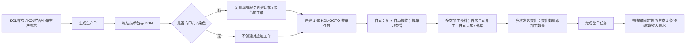

# KOL-GOTO 生产单自动拆解与 PDA 特殊流程完整调整方案

## 0. 文档信息

| 项目 | 内容 |
| --- | --- |
| 文档日期 | 2026-08-19 |
| 核查分支 | `codex/process-craft-techpack-sequence` |
| 核查 Git HEAD | `94f287136e4cbfc045230216fea27c7ba648e9fc` |
| 文档性质 | 总体设计与实施基线；代码已按本方案执行，实际实现和证据由配套追踪矩阵、双轮审查清单承接 |
| 当前状态 | 已实施；85 条原子需求的当前状态、实现位置和证据见配套《KOL-GOTO 特殊流程需求追踪与交付矩阵》 |
| 特殊工厂 | 工厂 code：`KOL-GOTO`；内部 factory id：`KOL-GOTO-001` |
| 特殊售卖类型 | `KOL样衣`、`KOL样品小单`，必须使用代码中的无空格标准值 |
| 事实边界 | 本文中的现状来自当前分支代码；Mock 仅用于原型验证，不代表真实生产、库存或结算已经发生 |

### 0.1 本轮逐行复核范围与方法

本轮不是沿用上版结论做局部增补，而是重新从生产需求转单入口向下逐行阅读活动代码，并反向从 PDA、仓储、结算入口追到任务事实。结构关系先用 CodeGraph 确认，再对以下文件逐行或按完整符号边界阅读；没有用旧文档、旧测试或文件名替代当前代码事实：

| 代码链 | 本轮实际阅读范围 | 复核重点 |
| --- | --- | --- |
| 转单与合并 | `demand-domain.ts`、`production-orders.ts` | 建单顺序、合并售卖类型、需求状态写回、失败回滚 |
| 印花/染色 | `production-process-snapshot-derivation.ts`、`production-process-work-order-service.ts`、`process-work-order-generation-service.ts`、`process-work-order-generation-registry.ts` | 冻结快照、批量预校验、提交/回滚能力 |
| 任务与规则 | `production-task-generation-rules.ts`、`process-tasks.ts`、`task-generation-boundaries.ts`、`merged-production-task.ts`、`task-fulfillment-policy.ts` | 规则依赖、真实任务产物、整单结构类型、运行时记录 |
| 工厂与派单 | `factory-mock-data.ts`、`factory-master-store.ts`、`factory-profile.ts`、`unified-dispatch-workbench.ts`、`task-breakdown.ts` | 普通任务候选资格、直接派单/竞价/改派的读写入口 |
| PDA | `pda-task-receive.ts`、`pda-receive-scope.ts`、`pda-exec.ts`、`pda-exec-detail.ts`、`factory-mobile-todos.ts`、`pda-handover-events.ts`、`pda-handover.ts` | 接单动作处理器、五步执行、待办、交接页签和硬编码样例 |
| 仓储 | `factory-internal-warehouse-locations.ts`、`factory-internal-warehouse.ts`、`factory-mobile-warehouse.ts`、`factory-warehouse-linkage.ts`、`pda-warehouse.ts`、`pda-shell.ts` | 车缝工厂排除、双仓初始化、移动端计数、入出库联动和导航 |
| 结算 | `settlement-mock-data.ts`、`settlement-linked-mock-factory.ts`、`pda-settlement.ts` | 按件计价、通用五任务样例、流水触发、工厂上下文回退 |
| 路由、菜单、检查 | `app-shell-config.ts`、`routes-fcs.ts`、`route-renderers*.ts`、`package.json` 及相关专项脚本 | 删除是否覆盖菜单、路由、处理器、Mock、断言和脚本别名 |

本轮复核纠正了上版方案的四个关键错误：不新增 KOL 任务类型；不删除中性的 `WHOLE_ORDER_TASK`；不删除真实拆解数量摘要；不把“加工领料”放进交接的接收页签。后文均已按当前代码事实改写。

## 1. 结论先行

本次不应继续维护“生产单任务生成规则”，也不应把 KOL-GOTO 做成一条可配置规则。正确收口方式是：

1. **完整删除生产单任务生成规则模块。** 删除规则数据、规则页面、菜单、路由、规则日志、规则预览、规则追溯字段、工厂整单承接配置、PDA 五步模板、Mock 文案和检查脚本别名，不保留兼容壳、隐藏入口或改名后的同类规则引擎。
2. **增加一个明确、不可配置的 KOL-GOTO 特殊分支。** 生产需求转生产单时，只要来源售卖类型属于 `KOL样衣` 或 `KOL样品小单`，系统直接把主工厂和任务承接工厂固定为 `KOL-GOTO-001`，自动拆解并创建一张 KOL 整单任务。
3. **印花、染色继续使用现有加工单领域。** 当前代码已经会从生产单冻结技术包快照识别 `PRINT`、`DYE` 并自动创建加工单。本次复用这条链路，不把印花、染色塞进 KOL 整单任务，也不为 KOL 复制第二套印花、染色生成器。
4. **KOL PDA 只保留最短现场闭环。** 接单只查看；执行只有“去加工领料”“发起交出”“完成”；首次成功加工领料自动开工；加工领料和发起交出可多次；没有开工按钮、加工填报、进度上报、关键节点上报、暂停上报和仓管确认完成门禁。
5. **KOL 仓管只有待加工仓。** 固定一个默认库区、货架和库位。加工领料按生产单冻结 BOM 自动列出面料、辅料，现场逐行填写本次数量；一次提交同时写入库、出库和已领用事实。
6. **KOL 继续结算，按整单固定总价结算。** 固定总价在整单任务创建时冻结；多次加工领料和多次交出不改变价格；任务完成后只生成一条收入流水，不再按每次交出数量乘单价生成多条收入。
7. **特殊性必须由订单来源、整单结构和承接工厂共同锁定。** 不新增 `KOL_GOTO_WHOLE_ORDER` 任务种类或工序编码。运行时必须同时确认任务是现有 `WHOLE_ORDER_TASK`、工厂为 KOL-GOTO、所属生产单存在且全部来源需求属于两类 KOL 售卖类型；不能凭名称、单个快照或登录工厂触发。
8. **KOL-GOTO 必须退出普通任务候选池。** 当前工厂能力仍允许它承接普通单工序/车缝烫包任务；仅屏蔽 KOL 任务的竞价不够。通用候选查询、自动分配、直接派单、竞价、改派和固定合并任务都必须排除 KOL-GOTO，只有自动生成的 KOL 整单任务可以指向它。

目标主链如下：



## 2. 已确认业务事实、边界和非目标

### 2.1 已确认事实

- 特殊工厂唯一身份为 `KOL-GOTO` / `KOL-GOTO-001`。
- `KOL样衣`、`KOL样品小单`生产单的整单生产任务只能分配给 KOL-GOTO，不能进入普通工厂分配、改派或竞价。
- 生产需求生成生产单时即完成拆解，不再等待生产单列表中的人工“拆解生产单”。
- 技术包需要印花或染色时，同步创建独立印花、染色加工单；这两类加工单不归 KOL-GOTO 整单任务执行。
- KOL 接单模块只查看已经自动接收的任务；报价、竞价、抢单、拒单、定标均不属于 KOL 流程。
- KOL 执行入口固定为“去加工领料”“发起交出”“完成”。
- 加工领料和发起交出支持多次；首次成功加工领料自动开工。
- 不保留加工填报；每次发起交出直接形成加工完成数量和交出数量事实，不再暗中补一条加工填报。
- KOL 仓管只有待加工仓和一个默认位置；加工领料按 BOM 展示面料、辅料并填写实际数量；提交后自动入库、自动出库。
- 不存在“待领料”业务状态。加工领料的现场含义是工厂接收本次加工物料。
- KOL 结算保留，整单任务价格固定。

### 2.2 严格作用范围

特殊逻辑只允许作用于同时满足以下全部条件的任务：

```text
task.taskUnitType === 'WHOLE_ORDER_TASK'
AND task.processCode === 'WHOLE_ORDER_TASK'
AND task.processBusinessCode === 'WHOLE_ORDER_TASK'
AND normalizeFactoryId(task.assignedFactoryId) === 'KOL-GOTO-001'
AND task.productionOrderId 能找到生产单
AND 该生产单 sourceDemandSnapshots 非空
AND sourceDemandSnapshots.every(saleType ∈ {'KOL样衣', 'KOL样品小单'})
```

生产单创建时的触发条件为：

```text
sourceDemandSnapshots 全部属于 KOL样衣 / KOL样品小单
```

任何一项不满足，都不得执行 KOL 特殊动作；对伪造的整单任务应失败关闭，而不是降级调用普通接单、派单或仓储写入。仅凭任务名称包含“KOL”、任务自身 `saleTypeSnapshot`、主工厂名称、`wholeOrderTaskCount` 或 PDA 当前登录工厂，都不能单独触发特殊动作。

### 2.3 明确不改的内容

- 非 KOL-GOTO 工厂的任务接单、拒单、竞价、定标、派单、改派、开工、关键节点、暂停、交接、仓储和结算保持现有逻辑。
- 印花、染色加工单继续使用现有创建、接单、执行、交出、接收和结算逻辑。
- 普通生产单仍可按当前人工拆解方式生成通用任务；只是去掉“规则匹配”，改为直接读取统一任务产物。
- 两类固定合并任务 `SEWING_IRON_PACK`、`CUTTING_SEWING_IRON_PACK` 及其现有分配、合同、回货逻辑不因本次删除而改变。
- 不引入通用策略注册表、规则 DSL、工厂可配置特殊流程、状态机框架、后台接口、数据库或新的全局 store。
- 历史设计文档和历史审查记录是过去版本的审计证据，不作为运行时代码。本次不篡改历史记录；“零残留”门禁针对 `src/`、`scripts/`、`tests/`、`package.json` 和当前菜单路由。

## 3. 当前代码核查结果

### 3.1 生产需求转生产单

`src/pages/production/demand-domain.ts` 中：

- `createProductionOrdersForDemands()` 和 `createMergedProductionOrderForDemands()` 当前统一创建 `READY_FOR_BREAKDOWN` 生产单。
- 主工厂写成 `PENDING_MAIN_FACTORY_ID`，分配进度是 `NOT_READY`，`taskBreakdownSummary.isBrokenDown` 为 `false`。
- 审计文案明确写着“待手动拆解任务”。这与 KOL 自动拆解要求冲突。
- `applyCreatedProductionOrderGroups()` 会先构建印花/染色快照，保存生产单并把需求改成 `CONVERTED`，随后调用 `ensureProcessWorkOrdersForFormalProductionOrder()`。
- 当前调用对每张加工单逐个 ensure；如果后续加工单提交失败，前面的生产单和需求状态已被修改，现有协调层没有整体恢复。

结论：**印花、染色加工单的自动创建能力已经存在；KOL 缺的是生产单创建当下的整单任务生成、固定分配和自动接收。**

### 3.2 印花、染色加工单生成

`src/data/fcs/production-process-snapshot-derivation.ts` 的 `deriveFormalProductionOrderProcessSnapshots()`：

- 只识别冻结技术包 `processEntries` 中的 `DYE`、`PRINT`。
- 强制工艺绑定有效 BOM，且物料必须有稳定编码和一致单位。
- 计划加工量按 `生产数量 × 单耗 × (1 + 损耗率)` 汇总。

`src/data/fcs/production-process-work-order-service.ts` 的：

- `buildFormalProductionOrderProcessSnapshots()` 负责构建和校验快照。
- `ensureProcessWorkOrdersForFormalProductionOrder()` 负责调用现有印花、染色领域生成加工单。

底层 `process-work-order-generation-service.ts` / `process-work-order-generation-registry.ts` 已有 `prepareProcessWorkOrderBatch()`、批量 commit 和 rollback。当前缺口不是生成器能力，而是生产需求转单协调层没有使用该批次并把生产单、需求、任务纳入同一回滚边界。

结论：本次只能复用，不能复制或改造成 KOL 专用印花/染色代码。

### 3.3 生产单任务生成规则模块

当前规则模块不是一个孤立页面，而是已经渗透到多个层面：

| 位置 | 当前内容 | 必须处理 |
| --- | --- | --- |
| `src/data/fcs/production-task-generation-rules.ts` | 445 行；规则类型、工厂匹配、规则日志、任务单元、批量预览、KOL 规则 | 整文件删除 |
| `src/pages/production/task-generation-rules.ts` | 616 行；列表、新建、详情、编辑、模拟 | 整文件删除 |
| `src/data/app-shell-config.ts` | “生产单任务生成规则”菜单 | 删除菜单项 |
| `src/router/routes-fcs.ts`、`route-renderers*.ts` | 列表、新建、详情、编辑路由与异步渲染器 | 全部删除 |
| `src/pages/production/context.ts` | 规则预览状态、打开/关闭/确认预览、规则字段写回 | 删除规则预览；普通生产单改为直接产物预览，KOL 不进入人工预览 |
| `src/pages/production/events.ts` | 拆解按钮打开规则预览 | KOL 隐藏/阻断；普通订单接直接产物拆解 |
| `src/pages/production/orders-domain.ts` | 显示规则名称、规则任务单元和“先按规则预览” | 删除规则文案和规则明细 |
| `src/data/fcs/process-tasks.ts` | 导入规则类型和函数、按规则合并、规则运行时记录、五步模板 | 删除规则依赖和运行时记录；保留通用产物任务与固定合并任务 |
| `src/data/fcs/production-orders.ts` | `generationRuleId/Name`、预览状态和多组规则统计字段 | 删除规则专属字段和种子数据 |
| 工厂主数据与档案 | `wholeOrderEnabled`、`wholeOrderRule`、可编辑整单承接表单 | 删除通用整单配置，不允许其他工厂配置成 KOL 模式 |
| PDA | `WHOLE_ORDER_FIVE_STEP` 分支和五步提示 | 全部删除，改为显式 KOL 任务守卫 |
| Mock/适配器 | KOL 规则 ID、规则名、五步模板、规则克隆样例 | 清理并重建 KOL 专用样例 |
| `package.json` | `check:fcs-task-generation-rules` 实际只是统一分配检查的别名 | 删除别名；保留真正的 `check:fcs-unified-assignment-foundation` |

其中 `resolveRuleFactoryIds()` 会把所有启用 `wholeOrderEnabled` 的工厂动态加入 KOL 规则候选，直接违背“只有 KOL-GOTO 是特殊逻辑”的要求。

另一个容易遗漏的事实是：当前人工拆解上下文先调用规则预览；仓库里唯一启用的规则又是 KOL 规则，因此普通订单在“无匹配规则”时可能被预览层阻断。删除规则模块时必须把普通人工拆解直接接回已存在的一产物一任务生成路径，而不是只删页面。

### 3.4 通用任务与生产单摘要

`src/data/fcs/process-tasks.ts` 当前还存在以下规则遗留：

- `FactoryAcceptanceMode`、`PdaStepTemplateCode`、`GeneratedTaskUnitPreview` 等类型来自规则文件。
- `generationRuleId`、`generationRuleName`、`acceptanceMode`、`pdaStepTemplateCode`、`isMergedTaskUnit` 被写入任务；其中 `isMergedTaskUnit` 没有形成独立读取价值。
- `WHOLE_ORDER_TASK` 是已有的中性任务单元结构类型，并被任务边界、特殊工艺排除和负向检查读取。它不是“生产单任务生成规则”本身，不能因为当前唯一启用规则用于 KOL 就把该字符串全局删除。
- `recordTaskGenerationPreview()` 和 `listTaskGenerationRuntimeRecords()` 保存第二套规则运行时事实。

目标不是把这些内容搬到新文件，而是：

- `CoveredProcessScope` 作为通用任务字段保留并迁入通用任务类型。
- `ProductionTaskUnitType` 和 `CoveredProcessScope` 从规则文件迁入通用任务模型，保留 `SINGLE_PROCESS_TASK`、`MERGED_PRODUCTION_TASK`、`WHOLE_ORDER_TASK` 三种真实结构。
- KOL 继续使用 `taskUnitType/processBusinessCode = WHOLE_ORDER_TASK`；特殊身份由订单来源和工厂守卫组合得出，不再发明第二个任务 kind 或伪工序编码。
- 删除 `acceptanceMode`、`generationRuleId/Name`、`pdaStepTemplateCode`、`isMergedTaskUnit` 和规则运行时记录。
- 普通生产任务直接从 `production-artifact-generation.ts` 的 TASK 产物生成；固定合并任务继续使用 `merged-production-task.ts` 和 `runtime-process-tasks.ts` 的既有逻辑。

### 3.5 工厂主数据与统一分配

`src/data/fcs/factory-mock-data.ts` 当前 KOL-GOTO：

- `allowBid: false`、`allowExecute: true`、`allowSettle: true`，方向正确。
- 同时配置了可编辑的 `wholeOrderEnabled`、适用售卖类型、排除工序、默认任务名和 `WHOLE_ORDER_FIVE_STEP`，方向错误。
- `taskAcceptance.singleProcessEnabled` 仍为 `true`，`canAcceptSewingIronPack` 仍为 `true`，工序能力中的 `canReceiveTask` 也可为真；`factoryCanAcceptTask()` 因而仍可能把 KOL-GOTO 列为普通任务候选。

`src/pages/factory-profile.ts` 和 `src/data/fcs/factory-master-store.ts` 把“整单承接”做成所有工厂可配置能力，会让 KOL 特殊逻辑再次泛化。

`src/pages/unified-dispatch-workbench.ts`、`src/pages/task-breakdown.ts` 当前仍可按通用任务类型展示分配、竞价和改派入口，整单任务行也统一显示“去分配”。需要同时封两条相反方向的口子：KOL 整单任务不能进入任何通用分配动作；KOL-GOTO 也不能成为任何普通任务的候选工厂。候选查询、按钮渲染和提交处理三层均要校验，不能只隐藏按钮。

### 3.6 PDA 接单与执行

`src/pages/pda-task-receive.ts` 当前有四个页签：待接单、待报价、已报价、已中标，并包含接单、拒单和报价弹窗。`acceptPdaTaskWithRuntimeFallback()`、拒单处理器、报价处理器及详情动作目前都没有 KOL 失败关闭守卫。`src/data/fcs/factory-mobile-todos.ts` 还会分别生成竞价、待接收、普通领料、执行、交出、差异和结算待办。

`src/pages/pda-exec.ts`、`src/pages/pda-exec-detail.ts` 对 `WHOLE_ORDER_FIVE_STEP` 提供“确认接收/开始做、上传进度、去交接交出”等流程，并把完成依赖到进度和仓库确认，均与新要求冲突。

`store-domain-pda.ts` 当前用同一个通用角色生成器给 KOL 建角色：管理员拥有全部权限；操作工虽然去掉接单、报价和结算，但仍有 `TASK_START`、`TASK_MILESTONE_REPORT`、暂停等权限。只改按钮仍会留下权限侧入口。

结论：通用 PDA 页面保留；在页面、待办生成和动作处理器增加 KOL 专用分支。KOL 分支不调用通用接单、拒单、报价、手工开工、普通领料、待接收、里程碑、暂停和五步完成逻辑；只有执行模块生成“去加工领料”动作。

### 3.7 交接与仓储

`src/data/fcs/pda-handover-events.ts` 已支持多条交出记录，但：

- `confirmPdaPickupRecordReceived()` 只更新接收记录，不会自动开工。
- 通用接收/交出单完成采用计划量 80%～120% 范围，不符合 KOL 整单精确完成口径。
- KOL 现有演示记录在该文件和 `pda-task-mock-factory.ts` 中重复维护。
- 当前还硬编码了 KOL 的一张待交出单、两张“辅料待领/工艺样包待领”接收单和两张已完成交出单，继续使用会把已取消的待接收重新带回页面。

`src/data/fcs/factory-internal-warehouse-locations.ts` 当前排除所有车缝工厂，KOL-GOTO 因 `THIRD_SEWING` 没有内部仓。其他非车缝工厂默认同时建立待加工仓、待交出仓和多个区域。

`src/data/fcs/factory-internal-warehouse.ts` 初始化和种子写入同样按“非车缝工厂”过滤 KOL；`FactoryInternalWarehouseMutationSnapshot` 只快照待加工库存和入库记录。`src/data/fcs/factory-mobile-warehouse.ts` 又把全部车缝工厂当轻量模式，把 KOL 的待加工仓数量归零。仅增加一个库位定义并不能让数据和移动端出现。

`src/pages/pda-shell.ts` 当前对所有三方车缝厂隐藏“仓管”页签，因此 KOL 也看不到仓管。

`src/data/fcs/factory-warehouse-linkage.ts` 的 `linkPickupConfirmToInboundRecord()` 只自动写入库和待加工库存，不会自动写出库；通用出库联动又强制来源于待交出仓，不能拿来伪装加工领料。默认位置还会按哈希散列到 A～F 区。

`FactoryInternalWarehouseMutationSnapshot` 当前只快照待加工库存和入库记录，无法保证“入库 + 出库 + 自动开工”失败时整体回滚。

### 3.8 结算

当前 KOL 结算并未被排除，但口径错误：

- `src/data/fcs/settlement-mock-data.ts` 把 KOL 配成 `BY_PIECE`。
- `createTaskEarningLedgers()` 按“派单/中标单价 × 每次回货数量”逐批生成收入流水。
- `PreSettlementLedgerPriceSourceType` 只有 `DISPATCH`、`BID`、兼容来源，没有整单固定总价。
- KOL 结算主数据中使用 code `KOL-GOTO`，PDA 当前上下文使用内部 id `KOL-GOTO-001`；虽然部分查询做了归一化，但主数据仍不统一。
- `settlement-linked-mock-factory.ts` 把 KOL 与其他工厂一起生成“每工厂两张生产单、每单五张车缝任务”，并交替模拟直接派单和竞价，再按每批回货量乘单价记收入。这会让 KOL 页面重新出现竞价和五任务假数据。
- `pda-settlement.ts` 的 `getCurrentFactoryContext()` 只在 `indonesiaFactories` 中查找；KOL 不在该集合时会静默回退到第一个工厂，存在跨工厂展示结算数据的风险。

目标应是 KOL 结算档案 `BY_ORDER`，以任务完成为唯一收入触发，一张 KOL 整单任务只生成一条固定总价收入流水；工厂上下文必须从统一主数据解析，解析失败时失败关闭，绝不能回退到其他工厂。

## 4. 目标领域模型和特殊守卫

### 4.1 最小专用模块

新增一个小型、不可配置的 `src/data/fcs/kol-goto-special-flow.ts`，只承担以下职责：

- 复用 `factory-mock-data.ts` 中已有的 `KOL_GOTO_FACTORY_ID/CODE/NAME`，不复制工厂常量。
- 定义 `KOL_GOTO_SALE_TYPES = ['KOL样衣', 'KOL样品小单'] as const`。
- 定义 `isKolGotoSaleType()`、`isKolGotoFactory()`、`isKolGotoProductionOrder()`、`isKolGotoWholeOrderTask()` 四个纯判断函数。
- `isKolGotoWholeOrderTask()` 必须联合读取任务、所属生产单和工厂身份，执行第 2.2 节全部校验；不能只接收一张脱离订单上下文的任务。
- 待产品给出金额及来源后，在该文件或现有唯一业务事实源中只保留一个 KOL 整单价读取入口，并在建任务时冻结结果。

该文件不得包含：规则数组、优先级、匹配日志、启停配置、工厂候选、策略注册、页面 CRUD 或通用扩展点。

中性类型不放进该文件：`ProductionTaskUnitType` 和 `CoveredProcessScope` 从被删除的规则文件移到 `process-tasks.ts`（或同层现有中性类型文件），防止删除规则时误删任务结构。

### 4.2 任务字段

KOL 整单任务建议写入以下最小事实：

| 字段 | 目标值/来源 |
| --- | --- |
| `taskUnitType` | 复用现有 `WHOLE_ORDER_TASK` |
| `processCode` / `processBusinessCode` | 两者均复用现有 `WHOLE_ORDER_TASK`；它是结构标识，不是可配置工序 |
| `processNameZh` | `KOL整单任务` |
| `productionOrderId/No` | 当前生产单 |
| `qty` | 生产单全部 SKU 数量合计 |
| `qtyUnit` | `PIECE`，显示单位“件” |
| `coveredProcesses` | 冻结技术包 TASK 产物中除 `PRINT`、`DYE` 外的责任范围 |
| `assignedFactoryId/Name` | `KOL-GOTO-001` / `kol goto` |
| `assignmentMode` | `DIRECT` |
| `assignmentStatus` | `ASSIGNED` |
| `acceptanceStatus` | `ACCEPTED` |
| `acceptedAt/By` | 任务创建时间 / `系统` |
| `status` | `NOT_STARTED` |
| `allowAutoDispatch` | `false` |
| `pricingMode` | `FIXED_TOTAL` |
| `fixedTotalPrice` | KOL 整单固定总价快照 |
| `fixedTotalPriceCurrency` | `IDR` |
| `saleTypeSnapshot` | 来源生产需求售卖类型，仅展示和追溯，不作为运行时唯一守卫 |

不新增 `KOL_GOTO_WHOLE_ORDER` task kind 或 process code，也不依靠现有可选 `taskKind: 'NORMAL'` 识别 KOL。任务不写入 `tenderId`、接单截止时间、报价、竞价、中标、规则 ID、规则名、PDA 模板码、关键节点、手工开工证明或加工填报字段。

### 4.3 生产单摘要

`TaskBreakdownSummary` 收口为真实拆解结果，不再保存规则结果：

- 保留真实结果字段：`isBrokenDown`、`generatedTaskUnitCount`、`singleProcessTaskCount`、`independentWorkOrderTaskCount`、`mergedProductionTaskCount`、`mergedTaskType`、`wholeOrderTaskCount`、`coveredProcessNames`、`taskTypesTop3`、`lastBreakdownAt`、`lastBreakdownBy`。这些数是实际生成结果，不是规则配置。
- 删除规则专属字段：`generationRuleId`、`generationRuleName`、`previewStatus`；`independentWorkOrderCount` 若只是 `independentWorkOrderTaskCount` 的重复字段，也一并删除并统一读后者。
- `wholeOrderTaskCount` 可以继续展示实际整单任务数量，但任何 KOL 特殊逻辑都不能以 `wholeOrderTaskCount > 0` 单独触发，必须重新执行完整 KOL 守卫。

### 4.4 仓储事实

新增一个专用但很小的 `kol-goto-processing-pickup.ts`，只保存多次加工领料事实并协调现有任务/仓储写入。最小数据为：

| 记录 | 必需字段 |
| --- | --- |
| 加工领料批次 | `pickupBatchId`、`clientSubmissionId`、`taskId`、`productionOrderId`、提交人、提交时间 |
| 加工领料行 | `pickupLineId`、`pickupBatchId`、`bomItemId`、面料/辅料类型、物料编码/名称、数量、单位 |

它不保存“待领料/待接收”状态，不复制 BOM 主数据，也不承担规则匹配；展示时回查生产单冻结 BOM，累计时只加有效领料行。

KOL 固定仓位建议使用稳定身份：

```text
warehouseId = FIW-KOL-GOTO-001-WAIT_PROCESS
areaId      = AREA-KOL-GOTO-WAIT_PROCESS-DEFAULT
shelfId     = SHELF-KOL-GOTO-WAIT-PROCESS-DEFAULT
locationId  = LOC-KOL-GOTO-WAIT-PROCESS-DEFAULT
```

页面只展示“默认库区 / 默认库位”。现有数据结构需要货架层，因此保留一个内部默认货架，但不要求现场选择。

出库记录增加明确的来源字段，不能把加工领料伪装成交出：

```text
sourceRecordType = KOL_PROCESSING_PICKUP
sourceRecordId   = 本次加工领料行 ID
sourceObjectKind = 面辅料仓
receiverKind     = 加工任务
receiverName     = KOL整单任务号
```

因此最小类型变更是 `FactoryWarehouseSourceRecordType += KOL_PROCESSING_PICKUP`、`FactoryWarehouseReceiverKind += 加工任务`；已有其他来源/接收方值保持不变，不为 KOL 另建仓储类型体系。

### 4.5 结算事实

扩展现有预结算类型：

```text
PreSettlementLedgerSourceType += TASK_COMPLETION
PreSettlementLedgerPriceSourceType += TASK_FIXED_TOTAL
```

KOL 收入流水固定为：

```text
sourceRefId       = taskId
factoryId         = KOL-GOTO-001
priceSourceType   = TASK_FIXED_TOTAL
qty               = 1
unitPrice         = fixedTotalPrice
originalAmount    = fixedTotalPrice
settlementAmount  = 按现有币种换算规则计算
occurredAt        = task.finishedAt
```

流水唯一键建议为 `PSL-KOL-${taskId}`，重复点击完成不得重复生成。

## 5. 目标流程和动作规则

### 5.1 生产需求生成生产单

#### KOL 特殊分支

1. 校验来源需求可转单、已选择已发布技术包版本。
2. 逐条检查 `sourceDemandSnapshots`；不能读取合并后 `demandSnapshot.saleType`，因为当前合并构建器会把不同售卖类型折叠为“预售备货”。
3. 如果同一合并生成组同时包含 KOL 和非 KOL 售卖类型，整组阻断，提示“KOL 样衣/样品小单不能与普通售卖类型合并生成生产单”。两种 KOL 售卖类型可以同组，因为它们都命中同一已确认特殊流程；若产品希望二者也不能合并，需要另行明确，不能从当前需求自行推断。
4. 构建生产单冻结需求、技术包和 BOM 快照。
5. 调用现有服务构建并校验全部印花、染色快照，再通过现有 `prepareProcessWorkOrderBatch()` 准备一个可提交/回滚的加工单批次；不得在循环中边校验边永久写入。
6. 构建一张 KOL 整单任务，并校验固定总价为大于 0 的有限数字。
7. 在转单协调层先保存生产单、需求、任务和加工单注册表的必要快照，再按单一受控顺序提交生产单、需求转单状态、KOL 任务与已准备的加工单批次；任一提交失败，调用现有批次回滚并恢复其余快照，不得留下半张生产单或只创建一部分对象。

这里不新增通用事务框架。现有 `process-work-order-generation-registry.ts` 已提供批次 `prepare/commit/rollback`，只需要给生产单快照增加一个薄适配器并补齐需求/生产单/任务集合回滚。

KOL 生产单初始状态：

| 字段 | 值 |
| --- | --- |
| `status` | `EXECUTING`，表示拆解和分配已完成、已进入执行阶段；整单任务自身仍是 `NOT_STARTED` |
| `mainFactoryId` | `KOL-GOTO-001` |
| `mainFactoryStatus` | `CONFIRMED` |
| `mainFactorySource` | `ORDER_CREATE` |
| `ownerPartyType/Id` | `FACTORY` / `KOL-GOTO-001` |
| `assignmentSummary` | 直接分配 1、竞价 0、任务 1、未分配 0 |
| `assignmentProgress` | `DONE`、直接分配完成 1、竞价发起/定标均 0 |
| `directDispatchSummary` | 已分配工厂 1、拒绝 0、超时 0 |
| `biddingSummary` | 活跃竞价 0、逾期 0 |
| `taskBreakdownSummary` | 已拆解、任务类型 `KOL整单任务`、系统拆解时间/人员 |

KOL 任务使用稳定 ID，例如 `TASK-KOL-${productionOrderId}`。同一生产单重复执行生成命令时必须返回已有任务，不能追加第二张整单任务。

#### 非 KOL 分支

- 保留当前 `READY_FOR_BREAKDOWN`、主工厂待确认和人工拆解流程。
- 人工拆解预览直接读取 `production-artifact-generation.ts` 的 TASK 产物，不再做规则匹配、规则命中或规则日志。
- 每个实际 TASK 产物直接生成一张通用任务；当前 `createGeneratedProcessTasksFromArtifacts()` 在没有 task unit 时本就支持一产物一任务，应收口复用这条路径，而不是再建一套“无规则策略”。
- 印花、染色加工单继续按当前生产单创建链路生成。

### 5.2 印花、染色责任边界

- 冻结技术包存在 `PRINT` 时创建印花加工单；存在 `DYE` 时创建染色加工单；两者都存在时各创建一张或按现有服务确定的加工单数量创建。
- KOL 整单任务的 `coveredProcesses` 明确排除 `PRINT` 和 `DYE`。
- 印花、染色加工单不出现在 KOL 的只读接单、KOL 执行、KOL 加工领料或 KOL 固定总价结算中。
- 这些加工单由各自分配工厂按现有 PDA 和结算逻辑处理。
- KOL 整单任务不生成中央辅助/特种工艺加工单；除印花、染色外的整单责任仍由 KOL 承接，沿用当前整单边界含义。

### 5.3 PDA 模块边界总表

| PDA 模块 | KOL-GOTO 目标行为 | 必须消失 | 非 KOL 行为 |
| --- | --- | --- | --- |
| 接单 | 只读查看系统已分配、已接收的整单任务 | 待接单、报价、已报价、中标、接单、拒单、竞价、改派 | 完全保持现状 |
| 执行 | 仅“去加工领料”“发起交出”“完成” | 确认接收、手工开工、普通领料、加工填报、进度/节点、暂停 | 完全保持现状 |
| 交接 | 只显示“待交出”和“已完成”；首次发起交出时创建/复用交出单头 | 待接收、接收确认、辅料待领、工艺样包待领 | 完全保持现状 |
| 仓管 | 只读查看唯一待加工仓及加工领料形成的成对入出库流水 | 待交出仓、待领料、人工入/出库、选库位、盘点 | 完全保持现状 |
| 结算 | 管理/财务角色保留整单固定价查询、对账和异议 | 按件、按批回货计价；一线员工结算入口 | 完全保持现状 |

“加工领料”属于执行模块，不属于交接模块，也不生成通用 `PdaPickupHead/Record` 的“待接收”事实。执行按钮可跳转到 `/fcs/pda/warehouse/wait-process` 的 KOL 任务领料表单分支，但仓管首页本身仍是只读账页。

### 5.4 KOL 接单：只读查看

KOL 登录 `/fcs/pda/task-receive` 时：

- 页面只展示已经 `ASSIGNED + ACCEPTED` 的 KOL 整单任务。
- 页面标题可使用“已接收任务”，顶部导航仍可保留“接单”以保持模块位置稳定。
- 任务卡和详情展示生产单、款式实图、款号/名称、计划数量、交期、固定承接工厂和接收时间。
- 不显示待接单、待报价、已报价、已中标四页签。
- 不显示接单、拒单、报价、撤回报价、抢单、竞价详情或接单截止时间。
- 详情页没有操作底栏，只提供“查看任务”和进入执行的导航。
- `factory-mobile-todos.ts` 不为 KOL 整单任务生成待接单、待报价、定标或接单超时待办。
- 即使有人直接调用通用接单、拒单、报价处理器，`isKolGotoWholeOrderTask()` 也必须阻断。

其他工厂进入同一路由时，四页签和既有动作保持不变。

### 5.5 KOL 执行

KOL 任务状态只使用：

```text
未开工（NOT_STARTED）
→ 首次成功加工领料
加工中（IN_PROGRESS）
→ 完成
已完成（DONE）
```

执行列表和详情只提供三个入口：

1. `去加工领料`
2. `发起交出`
3. `完成`

必须删除 KOL 分支中的：确认接收、手工开工、填写人数、上传开工证明、加工填报、上传进度、关键节点上报、暂停/恢复、里程碑超时和五步流程说明。

首次加工领料是唯一自动开工事件。打开领料页、填写但未提交、提交失败或全部数量为 0 都不能开工。

按钮必须按任务状态失败关闭：

| 任务状态 | 去加工领料 | 发起交出 | 完成 |
| --- | --- | --- | --- |
| `NOT_STARTED` | 可用 | 禁用，并提示先加工领料 | 禁用，并提示尚未开工 |
| `IN_PROGRESS` | 可用 | 可用 | 按第 5.9 节完成数量口径判断 |
| `DONE` | 禁用，只能看历史 | 禁用，只能看历史 | 禁用，显示已完成 |

`factory-mobile-todos.ts` 对 KOL 走专用构建分支：未开工任务可以生成指向执行模块的“去加工领料”待办；加工中任务按事实提示“待交出/待完成”；不得生成通用“待接收”“去领料”“待报价”“上传进度”或“仓库待确认”。

### 5.6 加工领料

#### 数据来源

- 唯一来源是生产单冻结 `techPackSnapshot.bomItems`，禁止读取正在编辑的实时 BOM。
- 只取 `type === '面料'` 或 `type === '辅料'`。
- 每行计划量为 `生产单件数 × unitConsumption × (1 + lossRate)`，沿用印花/染色快照的六位计算精度；展示时按物料单位格式化。
- 面料和辅料分区展示，不混成一个总数量。

#### 页面字段

每行至少展示：真实物料图、物料名称、物料编码、规格/颜色、单位、计划量、累计已领、本次领料输入、剩余量。缩略图必须可点开高清图，并有加载失败状态。

#### 数量和提交

- 本次数量必须是有限数字且 `>= 0`。
- 一次提交至少一行数量 `> 0`。
- 单行本次数量不得超过该 BOM 行剩余计划量；超量阻断并指出具体物料和剩余量。
- 不同单位逐行保存，禁止把面料 Yard/Meter 和辅料 Piece 合并求和。
- 每次提交生成一个加工领料批次和若干行；批次 ID、行 ID、任务 ID、生产单 ID、BOM item ID 构成稳定追溯关系。
- 任务完成后不允许继续加工领料。

#### 一次提交的原子副作用

同一次提交必须完成：

1. 创建/更新加工领料记录。
2. 在 KOL 默认待加工仓写一条同数量入库记录。
3. 从同一默认位置写一条同数量出库记录，接收方为当前 KOL 整单任务。
4. 把待加工库存行更新为 `已领用`，`receivedQty = issuedQty`，`availableQty = 0`。
5. 若任务是 `NOT_STARTED`，写入 `IN_PROGRESS` 和 `startedAt`；后续领料不重复开工。

任一步失败时，领料、入库、出库、库存和任务状态全部回滚。重复提交相同批次/行 ID 时执行幂等更新，不得重复入库或重复出库。

### 5.7 发起交出

- KOL 可多次发起交出，每次明确填写本次成衣数量和必要备注/凭证。
- 本次数量必须大于 0，且不得超过 `任务计划数量 - 累计有效交出数量`。
- 每条成功交出记录同时就是一次加工完成数量事实：

```text
累计已加工数量 = 累计有效交出数量
累计已交出数量 = 累计有效交出数量
```

- 不再创建隐藏加工填报，不再维护“加工填报累计”和“交出累计”两套数。
- 作废交出记录时，从累计数量中排除；不得直接改写历史记录。
- KOL 任务创建/自动接收/首次领料时都不执行通用 `handoverAutoCreatePolicy = CREATE_ON_START`。第一次点击“发起交出”时按任务 ID 幂等创建一张交出单头，后续每次交出在同一单头下追加有效记录。
- 同一任务只能有一张活动交出单头；多次点击或页面重放不得生成重复单头。无效、作废记录保留审计历史，但不计入累计。
- 交出成功后不要求 KOL 待加工仓建立待交出库存，也不要求 KOL 仓管确认收到交出物。
- 下游接收方如仍需记录接收，可使用通用交接事实，但其确认状态不能阻断 KOL 整单任务完成。

KOL 交接路由只提供“待交出”和“已完成”两个集合；这里没有“加工领料”页签，更没有“待接收”。

### 5.8 KOL 仓管

KOL 登录 `/fcs/pda/warehouse` 时直接进入 `/fcs/pda/warehouse/wait-process` 的 KOL 只读分支：

- 只显示“待加工仓”。
- 不显示待交出仓、入库办理、出库办理、回收入仓、位置调整、盘点和库位选择。
- 展示默认库区/库位、加工领料批次、物料、入库量、出库量、单位、操作人、时间和当前净可用量。
- 因为加工领料同事务立即入库和出库，所以每个正常批次净可用量为 0；页面表达为“已领用”，不表达“待领料”。
- KOL 作为 `THIRD_SEWING` 的仓管页可见性是唯一例外；其他三方车缝厂仍按当前逻辑隐藏仓管页。
- 导航判断必须先识别精确 KOL 工厂，再执行“所有三方车缝隐藏仓管”的通用分支；移动仓储统计也必须先走 KOL 例外，不能被车缝轻量模式归零。

### 5.9 完成

建议并按本方案默认采用以下完成门禁：

- 任务已开工。
- 至少有一条有效交出记录。
- 累计有效交出数量必须等于整单任务计划数量。
- 超量在交出时已经阻断；少量时“完成”按钮提示还差多少件。
- 不检查仓管接收、下游回写、加工填报、关键节点、照片数量或所有 BOM 是否全部领完。
- 完成只允许一次；成功后写 `DONE`、`finishedAt` 和审计日志，并禁止新增加工领料/交出记录。

当前通用接收/交出单使用 80%～120% 完成范围。KOL 不能复用该门禁，必须走精确数量判断。此精确门禁是当前方案中的产品建议，实施前仍需产品最终确认，见第 13 节。

### 5.10 结算

- KOL 结算档案改为 `BY_ORDER`，币种继续 `IDR`，结算周期继续沿用现有 KOL 档案，除非产品另行调整。
- 固定总价在任务创建时冻结，后续修改全局常量不影响已创建任务。
- 任务完成时生成一条 `TASK_COMPLETION + TASK_FIXED_TOTAL` 预结算收入流水。
- 多次交出不分别计价，不以交出数量乘单价，不读取竞价、中标价或派单价。
- KOL PDA 结算继续提供查看、确认对账单、发起异议和申请修改结算资料；一线执行动作与结算动作仍按角色权限隔离。
- 所有 KOL 结算主数据、流水、对账单查询统一保存内部 id `KOL-GOTO-001`；展示时使用 code `KOL-GOTO`。查询入口继续兼容传入 code，但持久事实不再混用。
- `getCurrentFactoryContext()` 改为从统一工厂主数据解析 KOL；未知或无权工厂直接显示不可访问/无数据，禁止回退到 `indonesiaFactories[0]`。
- 结算联动 Mock 对 KOL 单独建模：一张生产单只有一张已完成 `WHOLE_ORDER_TASK`，没有竞价任务、五张车缝任务或逐批回货收入；其他工厂继续使用现有 Mock。

## 6. 详细实施工作包

### WP-01：建立 KOL 专用身份守卫并清理通用类型

**业务目标**

形成一个不可配置、不会扩散到其他工厂的 KOL 特殊身份，同时移除规则模块遗留类型。

**文件/符号**

- 新增 `src/data/fcs/kol-goto-special-flow.ts`。
- 修改 `src/data/fcs/process-tasks.ts`、`factory-types.ts`、`task-generation-boundaries.ts`、`merged-production-task.ts`、`process-mobile-task-binding.ts`、`special-craft-pda-scope.ts`。
- 修改 `factory-mock-data.ts`、`factory-master-store.ts`、`factory-profile.ts`，删除可配置整单承接事实并锁定 KOL 普通承接能力。

**修改**

1. 增加售卖类型、工厂、生产单和“任务 + 生产单”组合守卫。
2. 不增加 `ProcessTask.taskKind` 或 KOL 专用工序编码；KOL 任务复用 `WHOLE_ORDER_TASK`。
3. `ProductionTaskUnitType` 与 `CoveredProcessScope` 迁入通用任务类型；前者保留 `SINGLE_PROCESS_TASK | MERGED_PRODUCTION_TASK | WHOLE_ORDER_TASK`。
4. 若 `INDEPENDENT_WORK_ORDER_TASK` 只属于已删除规则预览类型则删除；独立加工单真实结果数量字段仍保留。
5. 删除 `FactoryAcceptanceMode`、`PdaStepTemplateCode`、`acceptanceMode`、`pdaStepTemplateCode`、`isMergedTaskUnit`；合并任务直接由 `taskUnitType === 'MERGED_PRODUCTION_TASK'` 推导。
6. 只有原本把 `WHOLE_ORDER_TASK` 当成 KOL 五步/派单捷径的分支改为完整 KOL 守卫；任务边界、特殊工艺排除和水溶负向检查等中性结构判断继续保留。
7. `ProductionOrderTaskBoundaryKind.WHOLE_ORDER` 可继续表达整单边界，但返回该边界后仍需联合订单来源验证，不能仅凭计数或任务结构进入 KOL 流程。

**验证证据**

- 类型检查不存在规则文件导入。
- 非 KOL 任务不能通过 `isKolGotoWholeOrderTask()`。
- 整单结构但工厂不匹配、KOL 工厂但订单来源不匹配、任务找不到生产单、来源快照为空均失败关闭。

**完成条件**

代码中不存在可把任意工厂配置成 KOL 整单流程的通用类型或开关。

### WP-02：完整删除生产单任务生成规则

**业务目标**

删除规则功能本身及所有派生入口、字段和演示事实，而不是只隐藏菜单。

**删除/修改文件**

- 删除 `src/data/fcs/production-task-generation-rules.ts`。
- 删除 `src/pages/production/task-generation-rules.ts`。
- 修改 `src/data/app-shell-config.ts`、`src/router/routes-fcs.ts`、`src/router/route-renderers.ts`、`src/router/route-renderers-fcs.ts`。
- 修改 `src/pages/production/context.ts`、`events.ts`、`orders-domain.ts`。
- 修改 `src/data/fcs/production-orders.ts`、`process-tasks.ts`、`runtime-process-tasks.ts`、`page-adapters/task-execution-adapter.ts`。
- 修改 `package.json`。

**修改**

1. 删除规则 CRUD、模拟、日志、匹配、批量预览和运行时记录。
2. 删除所有规则字段、规则名称、规则提示和规则种子。
3. 普通生产单拆解改为“统一 TASK 产物直接预览/确认”，不保留匹配状态、规则名称或规则日志。
4. 删除 `check:fcs-task-generation-rules` 别名；保留真正验证其他业务的 `check:fcs-unified-assignment-foundation`。
5. 保留水溶、特殊工艺边界和 PDA 执行中用于证明中性整单结构不应误入其他流程的 `WHOLE_ORDER_TASK` 负向探针；只删除依赖规则 ID、规则预览、五步模板的断言。
6. `createGeneratedProcessTasksFromArtifacts()` 保留一产物一任务的通用生成能力；人工拆解上下文直接调用中性产物预览/确认函数，不能因唯一规则被删除而继续返回“无匹配规则”。

**验证证据**

- 第 7.7 节规则概念零残留扫描全部为 0；`WHOLE_ORDER_TASK` 不属于零残留目标。
- 原规则 URL 均无法再匹配动态路由，菜单中无入口。
- 普通生产单仍能按统一产物完成手工拆解。

**完成条件**

运行时代码、页面、路由、脚本、测试和 package scripts 中没有规则模块及其派生概念。

### WP-03：生产需求转单时自动生成 KOL 整单任务

**业务目标**

在生产单生成事务中完成 KOL 主工厂确认、自动拆解、印花/染色加工单创建和唯一整单任务创建。

**文件/符号**

- `src/pages/production/demand-domain.ts`：`createProductionOrdersForDemands()`、`createMergedProductionOrderForDemands()`、`applyCreatedProductionOrderGroups()`。
- `src/data/fcs/process-tasks.ts`：新增 KOL 整单任务构建/幂等写入函数。
- 复用 `production-process-snapshot-derivation.ts`、`production-process-work-order-service.ts`。
- `src/data/fcs/production-orders.ts`：生产单摘要和 KOL 演示订单。

**修改**

1. 对 KOL 来源组构建 `EXECUTING`、主工厂已确认、分配已完成的生产单。
2. 在提交前完成技术包、BOM、印花/染色快照和固定总价校验。
3. 为现有生产单印染快照增加薄批量适配，复用 `prepareProcessWorkOrderBatch()`；所有加工单先准备、再统一提交，失败走现有 rollback。
4. 按稳定 ID 创建一张自动分配、自动接收、未开工的 KOL 整单任务。
5. KOL 生产单不开放人工拆解入口；重复命令不重复创建。
6. 混合 KOL/非 KOL 合并组阻断；判断基于全部 `sourceDemandSnapshots`，不读可能已折叠为“预售备货”的聚合售卖类型。仅含两种 KOL 类型的组继续命中特殊分支。
7. `applyCreatedProductionOrderGroups()` 在提交前快照生产单、需求、任务及加工单注册表；任何一步异常恢复全部集合，补故障注入测试覆盖“加工单提交失败但订单/需求已变更”的现有风险。

**验证证据**

- 两种售卖类型各生成 1 单、1 张 KOL 任务。
- 无印花染色、仅印花、仅染色、印花+染色四种技术包组合。
- 重放转单动作后生产单、整单任务和加工单数量不增加。
- 普通售卖类型仍是 `READY_FOR_BREAKDOWN`。
- 加工单 commit 故障后生产单不存在、需求仍为转单前状态、任务/加工单均未残留。

**完成条件**

生产需求转单完成后，不需要任何人工拆解或分配动作即可在 KOL PDA 查看整单任务。

### WP-04：隔离统一分配、竞价、接单和待办

**业务目标**

KOL 整单任务在管理端和 PDA 都不出现竞价或可变更承接工厂的入口。

**文件/符号**

- `src/pages/unified-dispatch-workbench.ts`、`task-breakdown.ts`、必要的竞价/定标处理器。
- `src/pages/pda-task-receive.ts`、`pda-task-receive-detail.ts`。
- `src/data/fcs/factory-mobile-todos.ts`、`store-domain-pda.ts`、`factory-mock-data.ts`、`factory-master-store.ts`。

**修改**

1. 管理端候选、按钮和提交处理器三层排除 KOL 整单任务的直接派单、竞价、改派和自动分配；任务拆解行改为只读“查看任务”，不显示“去分配”。
2. 在 `factoryCanAcceptTask()` 及所有候选/自动派单入口对 KOL-GOTO 做精确排除，使它不能承接普通单工序、车缝烫包、固定合并或其他工厂任务；移除 KOL 的普通承接能力开关并锁定档案 UI，不能由后续编辑重新放开。
3. KOL 接单页改成只读已接收列表/详情。
4. 在 `acceptPdaTaskWithRuntimeFallback()`、拒单、报价、定标、直接派单和改派处理器增加领域级失败关闭；页面隐藏不作为权限证据。
5. KOL 不生成待接单、待报价、定标、接单超时、普通待接收或普通领料待办。
6. 为 KOL 单独生成两个既有角色：operator 仅保留 `PICKUP_CONFIRM`、`HANDOUT_CREATE`、`TASK_FINISH`；admin 在 operator 基础上增加 `SETTLEMENT_VIEW`、`SETTLEMENT_CONFIRM`、`SETTLEMENT_DISPUTE`、`SETTLEMENT_CHANGE_REQUEST`。不新建角色体系，也不授予接单、拒单、报价、手工开工、里程碑、暂停权限。
7. 通用权限字典和其他工厂角色保持现状；角色权限只是 UI 范围，不能替代任务/工厂领域守卫。

**验证证据**

- KOL 页面无竞价/接单动作，直接调用处理器也被阻断。
- 任一普通任务的候选工厂列表都不含 `KOL-GOTO-001`，伪造直接派单提交同样被阻断。
- 现有非 KOL 竞价样例仍可报价、定标和接单。

**完成条件**

KOL 整单任务的承接工厂从创建到完成始终是 `KOL-GOTO-001`，不存在任何可修改路径。

### WP-05：KOL 执行、加工领料和多次交出

**业务目标**

把 KOL 现场操作收口到三个主入口，并让领料、开工、加工数量和交出数量形成单一事实链。

**文件/符号**

- `src/pages/pda-exec.ts`、`pda-exec-detail.ts`、`pda-exec-link.ts`。
- `src/pages/pda-handover.ts`、`pda-handover-detail.ts`。
- `src/data/fcs/pda-handover-events.ts`、`pda-task-mock-factory.ts`、`factory-mobile-todos.ts`。
- 新增 `src/data/fcs/kol-goto-processing-pickup.ts`，只实现批次/行、校验、幂等及对仓储联动的协调。

**修改**

1. KOL 执行卡/详情只渲染三个指定入口。
2. “去加工领料”从执行详情进入 KOL 专用表单；交接页只保留“待交出/已完成”，彻底移除 KOL 的接收页签、“辅料待领”和“工艺样包待领”。
3. 从冻结 BOM 构建面料/辅料行和剩余量，支持多次批次提交；不创建通用 `PdaPickupHead/Record`。
4. 首次成功领料自动开工；按钮按 `NOT_STARTED/IN_PROGRESS/DONE` 状态表控制。
5. 每次交出直接计入加工/交出累计，不再调用加工填报或里程碑处理器。
6. 不在接单、自动接收、任务创建或首次开工时预建交出单；第一次发起交出时按任务幂等创建唯一活动单头，后续追加记录。
7. KOL 完成走第 13.2 节最终确认的交出数量门禁，不复用 80%～120% 通用完成范围。
8. KOL 移动待办走专用构建，删除待接收、普通领料、上传进度和仓库确认文案。
9. 删除两处重复 KOL 手工种子，统一由一套 KOL 场景构建器生成。

**验证证据**

- 0 数量、超剩余、重复提交、任务完成后继续操作均阻断。
- 两次加工领料只产生一次开工事件。
- 三次交出后的累计等于三条有效记录之和，没有加工填报记录。

**完成条件**

KOL 执行链中不存在第四个生产动作，也不存在第二套加工数量事实。

### WP-06：KOL 单仓位待加工仓与自动入出库

**业务目标**

为 KOL 建立唯一待加工仓，并让每次加工领料自动形成成对、可追溯、可回滚的入库和出库记录。

**文件/符号**

- `src/data/fcs/factory-internal-warehouse-locations.ts`、`factory-internal-warehouse.ts`、`factory-warehouse-linkage.ts`。
- `src/data/fcs/factory-mobile-warehouse.ts`。
- `src/pages/pda-shell.ts`、`pda-warehouse.ts`、`pda-warehouse-wait-process.ts`。
- `src/router/routes-pda.ts`。

**修改**

1. 在车缝工厂排除逻辑之外仅为 KOL 创建一个 `WAIT_PROCESS` 仓；不创建 `WAIT_HANDOVER`。
2. 同步修改仓位构建、内部仓种子初始化、运行时 upsert 和移动仓储统计四处“非车缝/车缝轻量”分支，且 KOL 判断必须排在通用车缝判断之前。
3. 固定一套默认区/货架/库位，不做哈希分配。
4. 新增 `KOL_PROCESSING_PICKUP` 来源类型、`加工任务` 接收方类型和 KOL 专用原子链接函数，一次生成入库、出库、已领用库存和首次开工；同步补齐来源/入库标签映射为“加工领料”，不得显示成通用“接收记录”，也不得调用需要 `WAIT_HANDOVER` 的通用出库联动。
5. 扩展仓储 mutation snapshot，至少覆盖待加工库存、入库、出库；任务状态和加工领料记录也有对应快照/回滚。
6. KOL 仓管页只读展示流水，隐藏所有其他仓库动作；`/warehouse` 直接落到唯一 `/wait-process` 分支。
7. `pda-shell.ts` 先放行精确 KOL，再隐藏其余三方车缝的仓管；其他工艺厂继续保留双仓和现有动作。

**验证证据**

- 每个领料行恰好一条入库和一条同数量出库。
- 默认位置完全相同，净可用量为 0，状态为已领用。
- 人为制造出库失败后，入库、库存和任务开工均回滚。

**完成条件**

KOL 仓储没有待交出仓、待领料、位置选择或人工入出库入口。

### WP-07：整单固定总价结算

**业务目标**

保留 KOL 结算闭环，并把收入来源从“每批数量 × 单价”改为“任务完成 × 固定总价”。

**文件/符号**

- `src/data/fcs/settlement-types.ts`、`settlement-mock-data.ts`。
- `src/data/fcs/store-domain-settlement-types.ts`、`pre-settlement-ledger-repository.ts`、`store-domain-settlement-seeds.ts`。
- `src/data/fcs/settlement-linked-mock-factory.ts`。
- `src/pages/pda-settlement.ts`。

**修改**

1. KOL 档案 `pricingMode` 改为 `BY_ORDER`，主数据 id 统一为 `KOL-GOTO-001`。
2. 为 KOL task 加固定总价快照，不复用 `standardPrice/dispatchPrice` 的件单价语义。
3. 新增任务完成固定总价预结算流水类型和幂等生成函数。
4. KOL 从逐回货批次收入构建器中排除，避免重复计价。
5. `settlement-linked-mock-factory.ts` 对 KOL 建一单一任务、无竞价、任务完成一条固定价收入的独立分支；其他工厂通用五任务样例不变。
6. `pda-settlement.ts` 从统一工厂主数据取当前 KOL 工厂；未知工厂失败关闭，删除回退到第一个 `indonesiaFactories` 的行为。
7. 对账单、预付款批次、PDA 查看/确认/异议继续读取统一预结算流水。

**验证证据**

- 任务交出 3 次、完成 1 次，只产生 1 条收入流水。
- 流水金额等于任务冻结固定总价，`qty=1`。
- code/id 两种查询都能定位同一工厂，但新事实只保存内部 id。
- KOL 登录不会读取或展示首个印尼工厂的任何结算数据，未知工厂返回空/无权限。
- 非 KOL 按件/按批收入测试保持不变。

**完成条件**

KOL 结算可完整查看和确认，且不存在任何按交出数量重复计价路径。

### WP-08：Mock、图片、页面文案和回归场景

**业务目标**

用一套真实感场景覆盖新流程，同时清除旧规则、五步和仓管确认完成文案。

**文件/范围**

- `src/data/fcs/production-orders.ts`、`pda-task-mock-factory.ts`、`pda-handover-events.ts`、`settlement-linked-mock-factory.ts`。
- KOL 相关页面和 `public/` 下现有或补充的款式/物料真实图片。

**修改**

至少提供：

1. 一张未开工、自动接收、无竞价的 KOL 整单任务。
2. 一张有两次加工领料、配对入出库、首次自动开工的任务。
3. 一张有多次交出、可完成的任务。
4. 一张已完成并进入固定总价结算的任务。
5. 印花、染色分别存在和同时存在的生产单样例。
6. 所有款式和 BOM 面辅料均有对应真实图片、缩略图、失败态和大图。
7. KOL 交接样例只有交出单；没有“辅料待领”“工艺样包待领”接收单。
8. KOL 结算样例只有一张整单任务和一条固定总价流水；没有通用五任务、竞价或逐批计价。

**验证证据**

- 页面看不到规则 ID、规则名、五步、待领料、上传进度、仓管确认后完成等旧文案。
- 图片逐对象对应，PDA 小屏不溢出。

**完成条件**

新 Mock 只表达新流程，不再保留同一 KOL 任务的两套矛盾事实。

### WP-09：专项检查、命名页面、治理和交付闭环

**业务目标**

用最小充分证据证明特殊逻辑只影响 KOL，并证明旧规则真正删除。

**修改**

- 新增 `scripts/check-kol-goto-special-flow.ts` 和 `check:kol-goto-special-flow`。
- 更新受影响的既有检查，不通过修改基线或降低断言绕过门禁。
- 实施完成后创建完整原型审查记录。

**验证证据和完成条件**见第 10～12 节。

## 7. 完整删除清单

### 7.1 物理删除

- `src/data/fcs/production-task-generation-rules.ts`
- `src/pages/production/task-generation-rules.ts`

### 7.2 删除菜单和路由

- `production-task-generation-rules` 菜单项。
- `/fcs/production/task-generation-rules`
- `/fcs/production/task-generation-rules/new`
- `/fcs/production/task-generation-rules/:id`
- `/fcs/production/task-generation-rules/:id/edit`
- 四个对应异步 renderer 和 import。

### 7.3 删除数据类型、字段和函数

- `ProductionTaskGenerationRule`
- `ProductionTaskGenerationRuleLog`
- `ProductionTaskGenerationPreview`
- `GeneratedTaskUnitPreview`
- `FactoryConditionMode`
- `RemainingProcessStrategy`
- `FactoryAcceptanceMode`
- `PdaStepTemplateCode`
- `matchProductionTaskGenerationRule()`
- `buildTaskGenerationUnits()`
- `buildTaskGenerationPreview()`
- `buildBatchTaskGenerationPreview()`
- `findDemoWholeOrderTaskGenerationPreview()`
- `recordTaskGenerationPreview()`
- `listTaskGenerationRuntimeRecords()`
- 现有规则态 `TaskGenerationPreviewState`、`state.taskGenerationPreview`、`open/close/confirmTaskGenerationPreview()` 和 `renderTaskGenerationPreviewDialog()` 名称及规则字段。
- `generationRuleId`
- `generationRuleName`
- `previewStatus`
- `acceptanceMode`
- `pdaStepTemplateCode`
- `isMergedTaskUnit`
- 无实际用途的 `INDEPENDENT_WORK_ORDER_TASK`

明确保留：`ProductionTaskUnitType`、`CoveredProcessScope`、`WHOLE_ORDER_TASK`、`TaskBreakdownSummary` 的真实生成数量字段。它们迁出规则文件或继续留在中性领域模型，不属于规则残留。

普通生产单仍需要人工确认拆解时，可以保留一个中性的 `TaskBreakdownPreviewState` / `renderTaskBreakdownPreviewDialog()`，但内容只能来自真实 TASK 产物和已存在的独立加工单，不能包含“命中规则、默认规则、规则状态、PDA 步骤或规则候选工厂”。这属于普通拆解 UI，不是换名保留规则引擎。

### 7.4 删除工厂配置

- `FactoryTaskAcceptanceConfig.wholeOrderEnabled`
- `FactoryTaskAcceptanceConfig.wholeOrderRule`
- 工厂 store 中的默认值、clone、normalize 和兼容补值。
- 工厂档案中的“整单承接”开关、适用售卖类型、排除工序、默认任务名、备注等表单和处理器。
- KOL-GOTO 档案里允许普通任务承接的 `singleProcessEnabled: true`、`canAcceptSewingIronPack: true` 等演示配置；其他工厂的同名正常能力不删除。

### 7.5 删除 PDA 和 Mock 遗留

- `WHOLE_ORDER_FIVE_STEP`
- `MERGED_TASK_START_HANDOVER`（当前只写入、不读取，合并任务继续由 `taskUnitType` 判断）
- `DEFAULT_PROCESS_TASK` 这类仅为模板码存在的字段和值。
- KOL 五步提示、上传进度、仓库确认完成说明。
- `TGR-KOL-001`
- `KOL样衣整单承接规则`
- “任务生成规则指定”“按规则预览”“默认按工序生成规则”等运行时文案。
- 复制通用任务生成 KOL 样例的 `cloneProcessTaskForTaskGenerationDemo()`。

### 7.6 删除检查别名和过时断言

- `package.json` 中 `check:fcs-task-generation-rules`。
- 所有以旧规则 URL、规则字段或五步模板为通过条件的脚本断言。
- 以 `WHOLE_ORDER_TASK` 验证中性任务边界、特殊工艺排除或“不应进入水溶/PDA 普通流程”的负向断言保留；不能为了零扫描删除有效回归证据。
- `check:fcs-unified-assignment-foundation` 本身保留，因为它还验证固定合并任务、合同、回货等独立业务。

### 7.7 零残留门禁

实施后以下扫描在活动代码范围必须无结果：

```bash
rg -n "production-task-generation-rules|task-generation-rules" src scripts tests package.json
rg -n "ProductionTaskGenerationRule|ProductionTaskGenerationPreview|GeneratedTaskUnitPreview" src scripts tests
rg -n "generationRuleId|generationRuleName|TGR-KOL-001" src scripts tests
rg -n "WHOLE_ORDER_FIVE_STEP|MERGED_TASK_START_HANDOVER|PdaStepTemplateCode|KOL样衣整单承接规则" src scripts tests
rg -n "生产单任务生成规则|任务生成规则指定|按规则预览|默认按工序生成规则" src scripts tests
rg -n "wholeOrderEnabled|wholeOrderRule" src scripts tests
```

以下扫描**不得**要求为 0：`WHOLE_ORDER_TASK`、`generatedTaskUnitCount`、`singleProcessTaskCount`、`independentWorkOrderTaskCount`、`mergedProductionTaskCount`、`wholeOrderTaskCount`。验收方式是逐处确认它们只表达真实任务结构/结果，且没有规则 ID、规则名或 KOL 五步语义。

历史 `docs/superpowers/plans/` 和过去的 `docs/prototype-review-records/` 可能仍描述旧版本事实，不纳入活动代码零残留结果，也不得被当前运行时读取。

## 8. 状态、数量、金额和原子性口径

### 8.1 状态表

| 对象 | 进入状态 | 事件 | 退出状态 | 备注 |
| --- | --- | --- | --- | --- |
| KOL 生产单 | 创建中 | 转单事务成功 | `EXECUTING` | 已自动拆解、分配、接收 |
| KOL 任务 | `NOT_STARTED` | 首次成功加工领料 | `IN_PROGRESS` | 没有手工开工 |
| KOL 任务 | `IN_PROGRESS` | 完成门禁通过 | `DONE` | 只允许一次 |
| 加工领料批次 | 新建 | 入库+出库+库存写入成功 | 已完成 | 不设置待领料/待接收状态 |
| KOL 交出单头 | 不存在 | 首次发起交出 | 活动 | 每任务唯一；不在开工时预建 |
| 交出记录 | 新建 | 提交成功 | 有效 | 可多次；作废后不计累计 |
| 待加工库存 | 入库生成 | 同事务出库 | `已领用` | 正常净可用量 0 |
| 预结算收入 | 不存在 | KOL 任务完成 | `OPEN` | 每任务唯一一条 |

### 8.2 数量公式

```text
生产任务计划件数 = Σ 生产单 SKU 数量

BOM 行计划领料量
= 生产任务计划件数 × BOM 单耗 × (1 + BOM 损耗率)

BOM 行累计已领
= Σ 该任务、该 BOM item 的有效加工领料行数量

BOM 行剩余
= BOM 行计划领料量 - BOM 行累计已领

累计已加工件数
= Σ 有效交出记录数量

累计已交出件数
= Σ 有效交出记录数量

待交出件数
= 生产任务计划件数 - 累计有效交出件数
```

不允许把不同 BOM 行、不同单位相加为一个“总领料数量”。

### 8.3 金额公式

```text
KOL 任务收入 = 任务创建时冻结的 fixedTotalPrice
```

不执行以下公式：

```text
固定总价 × 交出数量
交出数量 × 工序标准价
多次交出分别计价后求和
竞价中标价 × 数量
```

### 8.4 幂等键

| 事实 | 建议唯一键 |
| --- | --- |
| KOL 整单任务 | 稳定 ID `TASK-KOL-${productionOrderId}`，并校验 `productionOrderId + WHOLE_ORDER_TASK` 唯一 |
| 加工领料批次 | `taskId + clientSubmissionId` |
| 加工领料行 | `pickupBatchId + bomItemId` |
| 入库记录 | `INB-KOL-${pickupLineId}` |
| 出库记录 | `OUT-KOL-${pickupLineId}` |
| 已领用库存行 | `WPS-KOL-${pickupLineId}` |
| 交出记录 | `taskId + clientSubmissionId` |
| 活动交出单头 | `taskId + HANDOUT_HEAD` |
| 固定总价收入流水 | `taskId + TASK_FIXED_TOTAL` |

### 8.5 原子回滚范围

加工领料事务快照至少覆盖：

- 加工领料事件集合。
- `waitProcessStockItems`。
- `inboundRecords`。
- `outboundRecords`。
- KOL 任务 `status`、`startedAt`、`auditLogs`。

生产需求转单事务至少覆盖：

- 生产需求转单状态。
- 生产单集合。
- KOL 整单任务集合。
- 印花/染色加工单注册表已准备批次；失败调用现有 rollback，并恢复上述集合快照。

任务完成与结算流水也必须原子：如果固定总价流水创建失败，任务不能保留为 `DONE`；若重复提交已经存在同任务流水，则幂等返回成功而不是追加第二条。

## 9. 正常和边界验收场景

| 场景 | 输入 | 预期结果 |
| --- | --- | --- |
| KOL 无印花染色 | `KOL样衣`，技术包无 PRINT/DYE | 1 张生产单、0 张印染加工单、1 张 KOL 整单任务 |
| KOL 仅印花 | `KOL样衣`，有 PRINT | 1 张印花加工单 + 1 张 KOL 整单任务，印花不进入 KOL PDA |
| KOL 仅染色 | `KOL样品小单`，有 DYE | 1 张染色加工单 + 1 张 KOL 整单任务 |
| KOL 印花+染色 | 两种工艺均有 | 各自加工单 + 1 张 KOL 整单任务 |
| 普通售卖类型 | 备货/预售等 | 保持待人工拆解、通用分配和接单流程 |
| 混合合并 | KOL + 非 KOL 来源需求 | 阻断，不生成半张生产单 |
| 两类 KOL 合并 | `KOL样衣` + `KOL样品小单` | 允许生成一张 KOL 生产单；守卫逐条验证来源，不受聚合“预售备货”影响 |
| 重复转单 | 相同需求重复触发 | 不重复生产单、加工单或整单任务 |
| 印染提交故障 | 加工单批次 commit 抛错 | 需求、生产单、整单任务和印染加工单全部恢复到转单前 |
| 接单查看 | KOL 登录接单页 | 只读已接收任务，无报价/拒单/接单按钮 |
| 竞价绕过 | 直接调用 KOL 任务竞价/改派处理器 | 明确阻断，工厂不变 |
| 普通任务派给 KOL | 对普通单工序/合并任务伪造 `KOL-GOTO-001` 派单 | 候选列表无 KOL，提交处理器明确阻断 |
| 伪整单任务 | 只有 `WHOLE_ORDER_TASK`，但订单非 KOL/不存在/来源为空 | 不进入 KOL 特殊流程并失败关闭 |
| 未开工交出 | `NOT_STARTED` 直接调用发起交出 | 阻断并提示先加工领料 |
| 第一次领料 | 两行 BOM 各填部分数量 | 写批次、配对入出库，任务自动开工 |
| 第二次领料 | 补录剩余数量 | 再写一组配对流水，不新增开工日志 |
| 领料超量 | 任一行超过剩余量 | 整批不提交，无任何库存或状态副作用 |
| 领料重复提交 | 相同 submission id 重放 | 返回原结果，不重复入出库 |
| 多次交出 | 100 + 120 + 80 件 | 累计加工/交出 300 件，无加工填报 |
| 首次交出 | 加工中任务首次提交 | 幂等创建 1 张活动交出单头和第 1 条记录 |
| 再次交出 | 相同任务再次提交 | 复用原单头，只追加记录 |
| 交出超量 | 本次超过剩余件数 | 阻断，不创建记录 |
| 未交足完成 | 累计小于计划 | 阻断并显示还差数量 |
| 完成 | 累计等于计划 | 任务 DONE，生成 1 条固定总价流水 |
| 重复完成 | 再次点击完成 | 无第二条完成日志、无第二条收入流水 |
| 仓储失败 | 模拟出库写入失败 | 入库、库存、领料和首次开工全部回滚 |
| KOL 仓管导航 | KOL-GOTO 登录 | 唯一待加工仓计数和流水可见；无待交出仓和待接收 |
| 结算查询 | 用 code 或内部 id 打开 | 读取同一 KOL 对账事实 |
| 结算未知工厂 | 无效 factory id 打开结算 | 空态/无权限，不回退展示其他工厂数据 |
| 非 KOL 回归 | 普通三方工厂 | 竞价、接单、既有执行与仓储行为不变 |

## 10. 自动化与页面验证计划

### 10.1 新增专项检查

`scripts/check-kol-goto-special-flow.ts` 至少覆盖：

1. 两种售卖类型的唯一触发和其他售卖类型负例。
2. KOL factory id/code 归一化及“整单结构 + 工厂 + 所属订单全部来源”组合守卫。
3. 四种印花/染色组合。
4. 生产单、任务初始状态和固定工厂。
5. KOL 任务不生成竞价、报价、待接单、拒单或改派事实；KOL 工厂也不出现在任何普通任务候选中。
6. 冻结 BOM 面料/辅料筛选和计划量公式。
7. 多次领料、首次开工、成对入出库、默认位置、净库存 0。
8. 多次交出、唯一活动单头、无接收页签、无加工填报，以及最终确认后的完成门禁。
9. KOL 单仓初始化、种子写入、移动端计数和成对流水。
10. 固定总价单流水、结算上下文失败关闭和 KOL 独立 Mock。
11. 非 KOL 样例、人工产物拆解和真实摘要计数不变。
12. 转单批次故障回滚和完成/结算原子性。
13. 第 7.7 节规则概念零残留扫描；中性 `WHOLE_ORDER_TASK` 保留性审查。

### 10.2 相关既有检查

实施后按受影响范围运行：

```bash
npm run check:kol-goto-special-flow
npm run check:production-process-work-order-generation
npm run check:process-work-order-unification
npm run check:fcs-unified-assignment-foundation
npm run check:fcs-auto-dispatch
npm run check:pda-task-receive-scope
npm run check:pda-exec-task-detail
npm run check:pda-pickup-flow
npm run check:pda-handover-pages
npm run check:pda-handover-detail-source
npm run check:factory-internal-warehouse-model
npm run check:factory-handover-warehouse-linkage
npm run check:pre-settlement-ledger
npm run check:factory-settlement-pda
npm run check:pda-settlement-ledger
npm run check:menu-routes
npm run build
npm run check:prototype-design-governance
```

旧测试若要求规则 ID、五步模板或 KOL 必须等仓管确认才能完成，应按已确认业务事实删除/重写，不能为了保绿保留旧兼容字段。`WHOLE_ORDER_TASK` 的结构边界与负向隔离断言继续保留，并补充所属订单/工厂守卫。

### 10.3 命名页面验收

在同一分支、同一工作树、本地实际小屏 PDA 环境验收：

- `/fcs/production/demand-inbox`
- `/fcs/production/orders`
- `/fcs/production/orders/:productionOrderId`
- `/fcs/pda/task-receive`
- `/fcs/pda/task-receive/:taskId`
- `/fcs/pda/exec`
- `/fcs/pda/exec/:taskId`
- `/fcs/pda/handover`
- `/fcs/pda/handover/:eventId`
- `/fcs/pda/warehouse`
- `/fcs/pda/warehouse/wait-process`
- `/fcs/pda/settlement`

还要验证旧规则 URL 不再有路由和菜单入口。

页面证据至少包含：

- KOL 接单只读。
- 执行三按钮和三状态。
- `NOT_STARTED` 时只有“去加工领料”可用；`DONE` 时三个写动作均禁用。
- BOM 面料/辅料分区、逐行数量、单位和剩余量。
- 首次领料前后任务状态。
- 两次以上领料和两次以上交出。
- 交接仅有待交出/已完成，没有加工领料、待接收和两张旧接收样例。
- KOL 仓管只有待加工仓和默认位置。
- 固定总价结算明细。
- 款式/物料缩略图、加载失败状态、大图、Esc 关闭和小屏不溢出。
- 非 KOL 接单、报价和执行页面回归。

### 10.4 最终治理

最后一次实质修改后：

1. 重新运行受影响专项检查和命名页面验收。
2. 运行 CodeGraph sync/status，确认无待同步文件。
3. 创建完整原型审查记录，记录 KOL 特殊分支、图片、数量、角色、路由和非 KOL 回归。
4. 工作区可隔离时运行 `workflow:verify` 生成任务收据；若存在无法隔离的用户无关修改，应明确说明并避免把无关差异吸收进收据。

## 11. 原子需求追踪矩阵

85 条原子需求已完成实施与验证，详细实现位置、自动化证据、页面证据、确认版本和状态统一维护在：

- `docs/product-design/KOL-GOTO特殊流程需求追踪与交付矩阵.md`
- `docs/product-design/KOL-GOTO特殊流程双轮逐行审查与验收清单.md`

当前汇总：`已验证 85 / 85`，`待实施 0`，`实施中 0`，`已实现待验证 0`，`已阻塞 0`。固定总价 `1,500,000 IDR/整单` 为当前原型验收价格，不代表真实合同已签署。

## 12. 实施顺序与完成定义

### 12.1 依赖顺序

```text
WP-01 KOL 身份守卫与类型收口
→ WP-02 规则模块完整删除
→ WP-03 自动转单和唯一整单任务
→ WP-04 分配/竞价/接单隔离
→ WP-05 执行、领料和交出
→ WP-06 待加工仓与配对入出库
→ WP-07 固定总价结算
→ WP-08 Mock/图片/文案
→ WP-09 自动化、页面、治理和追踪
```

WP-03 与 WP-07 都依赖固定总价口径；没有金额时可以先完成其他开发，但不得把结算标记为已验证，也不得临时回退为按件计价。

### 12.2 完成定义

只有同时满足以下条件，才能声明本次调整 `verified`：

1. 第 11 节所有原子需求达到“已验证”或有产品确认的“不适用”。
2. 第 7.7 节列出的规则/五步/配置概念零残留扫描全部为 0；中性结构和结果字段按保留性审查通过。
3. KOL 四种印染组合、两种售卖类型、多次领料、多次交出和固定总价结算全部通过专项契约。
4. 非 KOL 分配、竞价、接单、执行、仓储和结算回归通过。
5. 最后一次实质修改后重新生成自动化和页面证据。
6. 当前分支命名页面、小屏 PDA、图片大图和失败态均完成真实验收。
7. CodeGraph 无待同步文件，构建和原型治理检查通过。
8. 完整原型审查记录绑定当前版本和证据。

## 13. 原型实现口径与产品数据替换点

### 13.1 整单固定总价的原型 Mock 金额

用户已确认结算保留且按整单固定总价，但没有提供真实合同金额。本次原型为了完成任务、结算和页面验收闭环，明确使用 `1,500,000 IDR/整单` 作为 KOL 专用 Mock 常量，并在任务创建时冻结。该数值只代表原型演示，不代表真实商业价格。

真实合同金额确定后，只替换 KOL 专用金额事实源并重新生成任务 Mock/验证证据；不得因此恢复任务生成规则、通用价格配置页或按交出批次计价。

### 13.2 完成数量口径

本次按照本方案执行为：累计有效交出数量必须等于任务计划件数才能完成；作废交出保留历史但不计累计；仓管/下游确认不参与完成门禁。少交时阻断，超交在发起交出时阻断。

未来若允许短交完成，必须作为新的明确需求补充短交原因、审批人和结算差异口径，不能在本次实现中隐式放宽为通用的 80%～120% 范围。

## 14. 正向与反向审查方法

### 14.1 正向追踪

从本文件第 2～5 节逐条走到第 11 节需求编号、工作包、实际文件、专项检查和命名页面，确认每一条已确认业务事实都有实现和当前证据。

### 14.2 反向追踪

从最终 diff 中逐项检查：

- 每个 KOL 条件分支是否都调用统一 KOL 守卫。
- 是否有任意非 KOL 工厂被赋予新特殊能力。
- 是否残留规则、五步、竞价、待领料或加工填报入口。
- 是否出现第二套 KOL 任务、领料累计、加工累计、仓储流水或结算金额事实。
- 是否误改印花、染色加工单和非 KOL 通用流程。
- 是否增加未在本矩阵登记的通用抽象、配置项或页面。

任何无法回到本文件需求编号的业务变更都应从本次 diff 移除。

## 15. 第二轮逐行复核纠错清单

下表专门记录本轮推翻或补齐的内容，实施审查时必须逐项回看，不能再回退到上一版口径：

| 编号 | 上一版问题/本轮发现 | 当前代码事实 | 本版纠正 |
| --- | --- | --- | --- |
| R2-01 | 误拟新增 `KOL_GOTO_WHOLE_ORDER` task kind/process code | `ProcessTask.taskKind` 目前只有 `NORMAL`；现有整单结构已由 `taskUnitType/processCode/processBusinessCode = WHOLE_ORDER_TASK` 表达 | 不新增任务种类或伪工序；用订单来源 + 工厂 + 整单结构组合守卫 |
| R2-02 | 误拟删除 `WHOLE_ORDER_TASK` | 任务边界、特殊工艺范围和负向专项检查仍合法读取它 | 将中性类型迁出规则文件并保留，只删除其中的规则/五步语义 |
| R2-03 | 误拟删除全部拆解数量 | `generatedTaskUnitCount` 等是实际生成结果，不是规则配置 | 只删规则 ID、规则名、预览状态及重复计数字段 |
| R2-04 | 误把加工领料放进交接接收页签 | 当前交接里硬编码两张 KOL 接收单，正是应删除的旧流程 | 加工领料只在执行；交接只有待交出/已完成，首次交出懒建唯一单头 |
| R2-05 | 只限制 KOL 任务不能改派，漏了 KOL 工厂可接普通任务 | KOL 仍开启单工序、车缝烫包和工序接收能力；通用候选函数可选中它 | 反向排除 KOL-GOTO 的所有普通任务候选、自动派单和伪造提交 |
| R2-06 | 只改接单页面，漏了领域动作处理器 | 接单、拒单、报价详情动作当前没有 KOL 守卫 | UI、查询和处理器三层失败关闭 |
| R2-07 | 漏了移动待办中的旧流程 | 当前待办会生成竞价、待接收、普通领料、上传进度和仓库确认 | KOL 使用最小待办构建，只保留去加工领料、待交出/待完成和角色允许的结算 |
| R2-08 | 只创建一个仓位，漏了多处车缝过滤 | 仓位构建、内部仓种子/upsert、移动仓统计都会排除或归零 KOL | 四层均在通用车缝判断前增加精确 KOL 例外 |
| R2-09 | 直接复用通用入/出库联动 | 通用领料只写入库；通用出库要求待交出仓 | 新增 KOL 加工领料来源和原子成对入出库，不创建待交出仓 |
| R2-10 | 只把结算改成按订单，漏了数据串厂风险 | KOL 不在 `indonesiaFactories` 时结算页会回退首个工厂 | 从统一工厂主数据解析；未知工厂失败关闭，不回退 |
| R2-11 | 漏了结算联动 Mock 的通用五任务/竞价/逐批收入 | 当前 KOL 与其他工厂一起生成五任务并按批次乘单价 | KOL Mock 独立为一单一整单任务一固定价流水 |
| R2-12 | 拟另建转单事务机制 | 底层已经有加工单批次 prepare/commit/rollback；协调层未使用 | 复用现有批次，仅补薄适配与订单/需求/任务快照回滚 |
| R2-13 | 可能用聚合售卖类型判断 KOL | 合并不同售卖类型后聚合值会变成“预售备货” | 始终逐条读取 `sourceDemandSnapshots`；KOL + 非 KOL 阻断 |
| R2-14 | 漏了通用角色给 KOL 过多权限 | KOL 管理员为全权限，操作工仍有手工开工、里程碑、暂停权限 | KOL 两个预置角色使用明确最小权限集合，领域守卫继续兜底 |
| R2-15 | 规则文件删除可能连带让普通拆解失效 | 当前人工拆解依赖规则预览，唯一规则不命中普通订单时会阻断 | 普通人工拆解直接接回现有 TASK 产物一对一生成能力 |
| R2-16 | KOL 整单任务排除普通派工运行时后，管理端任务清单也随之不可见 | 普通派工运行时不能包含 KOL，但管理端仍需查看自动拆解结果 | 任务清单从实际 KOL 整单任务补充只读展示；只允许详情，不恢复去分配或竞价 |

本轮没有把原型 Mock 金额伪装成真实合同价格；金额替换点集中在第 13.1 节。完成数量已按本方案的精确相等口径实现并验证；除此之外，不保留会改变实现方向的隐藏待确认项。

## 16. 实施与验收结果索引

- 85 条原子需求的正向追踪、实际文件/符号、自动化和页面证据：`KOL-GOTO特殊流程需求追踪与交付矩阵.md`。
- 两次逐行审查的文件级清单、反向追踪、发现问题和修复结果：`KOL-GOTO特殊流程双轮逐行审查与验收清单.md`。
- PDA 角色、页面、真实图片和小屏验收记录：`../prototype-review-records/2026-08-19-kol-goto-special-flow.md`。
