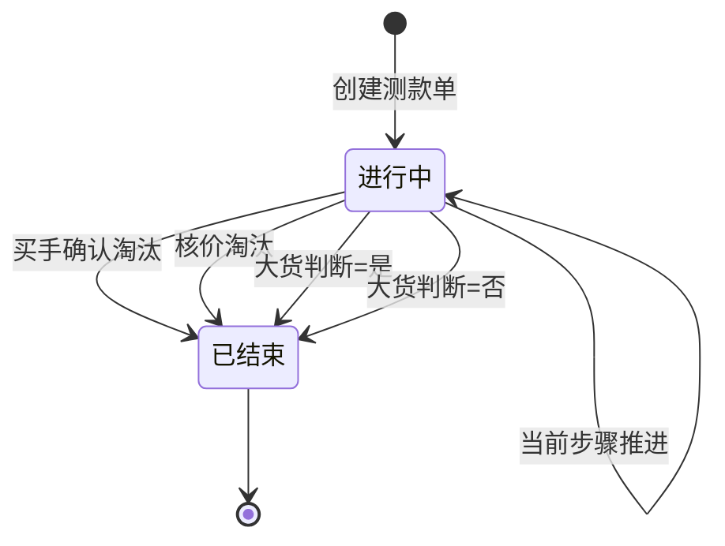

# PCS 商品中心重构总体设计文档

## 0. 文档信息

| 项目 | 内容 |
|---|---|
| 文档性质 | 当前商品中心四模块重构权威总体设计 |
| 适用范围 | 阶段①清理、商品档案、物料档案与变种、测款单、样衣统一模型 |
| 不适用范围 | 生产准备管理与技术资料（冻结，维持 V2.4） |
| 当前版本 | 2026-09-22 |
| 代码基线 | `codex/shangpinzhongxinyouhua001` @ `5fdc7a4c` |
| 业务确认 | 测款单命名、大货三态、一 SPU 一测款单、样衣任意互转、SKU 码、工艺字典来源、分期顺序等（见 §11） |
| 上游确认过程 | 与产品负责人多轮口径收敛（V1 需求理解 → V3 定稿 + 本轮 4 项关闭） |

本文件取代此前会话中以对话形式流转的临时口径。历史对话仅作追溯；与本文冲突的历史表述以本文为准。

---

## 1. 背景与目标

### 1.1 背景

- 原「商品测款」模块（直播测款、短视频测款及「测款通过」回写链）业务不愿使用且系统过重。
- 原「商品项目」模块不再作为独立模块存在；测款过程需要一个包裹整条行为链的新实体。
- 商品档案曾隐含「测款通过才建档」的准入逻辑，与真实业务（选品即建档）不符。
- 样衣缺乏营销/生产统一模型与规范化流转位置；打标口径需固定为一 SKU 一码。
- 物料缺乏 SPU–变种（加工链）模型；包材分类已废止。

### 1.2 目标

1. PCS 收敛为四大模块：**商品测款、生产准备、商品&物料档案、样衣管理**。
2. 阶段①完成代码与业务逻辑清洁：删除商品项目、旧测款、包材、空路由/占位及「测款通过」门禁残留。
3. 商品档案以 **SPU–SKU–渠道店铺–渠道店铺商品** 为核心关系；预计用料挂 SKU；无测款准入门禁。
4. 物料档案收敛为五类，落地 **SPU–变种** 模型与净色染色统一命名；工艺类型引用 FCS 工序工艺字典。
5. 新测款以 **测款单** 为唯一主对象，承载完整行为链；两次上架严格区分；大货判断三态（是/否/待定）。
6. 样衣以 **营销样品 / 生产样品** 统一模型管理，位置类型化，一 SKU 一码且必须贴码。
7. 生产准备保持 V2.4 冻结；可沿用并调整上游预计用料与初步 BOM；大货出口保持松耦合。

### 1.3 非目标

- 不修改生产准备管理、设计改款、技术包审核、生产准备时效的流程、状态机与交互。
- 不实现真实后端、鉴权、跨系统消息中间件；FCS 工序工艺字典以只读引用/本地镜像方式消费。
- 不建设样衣无码处理模块（后续单独立项）。
- 不强制样衣件级唯一码（非一物一码）。
- 不把测款单做成原商品项目的复刻；不保留旧测款/商品项目兼容路由。
- 不在本期替换生产准备「已满足做大货要求」人工确认门禁实现。

---

## 2. 模块边界

| 模块 | 子范围 | 本期动作 |
|---|---|---|
| 商品测款 | 测款单（行为链） | 独立模块，删除旧实现后重做 |
| 生产准备 | 生产准备管理 + 技术资料 | **冻结**（V2.4） |
| 商品&物料档案 | 商品档案（SPU/SKU/渠道店铺/渠道店铺商品）、物料档案（五类+变种） | 去门禁、收口关系、变种模型 |
| 样衣管理 | 样品管理、样品流转管理 | 统一模型 + 位置抽象 + SKU 码 |

---

## 3. 业务对象与关系

```mermaid
flowchart TB
  subgraph TEST [商品测款 - 测款单]
    O[测款单<br/>1 SPU 至多 1 张未结束单]
    O --> P1[① 系统建档]
    O --> P2[② 采购下单]
    O --> P3[③ 快递信息]
    O --> P4[④ 样衣入库]
    O --> P5[⑤ 打标]
    O --> P6[⑥ 买手确认]
    O --> P7[⑦ 核价]
    O --> P8[⑧ 寄样 + 渠道上架]
    O --> P9[⑨ 直播测款]
    O --> P10[⑩ 大货判断]
  end

  subgraph ARCH [商品档案]
    SPU[SPU]
    SKU[SKU<br/>预计用料 1..N]
    STORE[渠道店铺<br/>含 TikTok/Shopee]
    CP[渠道店铺商品]
    SPU --> SKU --> CP
    STORE --> CP
  end

  subgraph MAT [物料档案]
    MSPU[物料 SPU]
    V[变种 Variant<br/>process type=FCS 工序字典]
    MSPU --> V
  end

  subgraph SAMP [样衣管理]
    SM[样品<br/>营销样品 ⇄ 生产样品]
    LOC[流转位置<br/>直播间|家播|工厂|部门|仓库]
  end

  P1 -->|第一次上架=建档| SPU
  P1 --> SKU
  P8 -->|第二次上架=创建渠道商品并推送| CP
  P2 -.采购链接挂链不进 SKU.-> O
  SKU -.预计用料.-> V
  O -.回写（进入下一行为时）.-> ARCH
  P10 -->|大货=是| PP[生产准备管理 冻结]
  P4 --> SM
  SM --> LOC
```

### 3.1 核心对象定义

| 对象 | 定义 | 关键约束 |
|---|---|---|
| 测款单 | 包裹一次测款全过程的行为链实体 | 菜单/页面标题用名固定为「测款单」；当前一个 SPU 至多对应一张未结束测款单 |
| SPU/SKU | 商品档案可售主体与规格 | 无测款通过门禁即可创建 |
| 预计用料 | SKU 预计使用的物料清单 | 1 SKU → N 物料（物料 SKU）；挂 SKU 档案 |
| 采购链接 | 样衣电商采购地址（淘宝/京东等） | **只挂测款单**，不进 SKU 档案 |
| 渠道店铺/渠道店铺商品 | 店铺主数据与上架实例 | 归属商品档案；商品的创建/上架动作发生在测款单第⑧步并回写 |
| 物料变种 | 物料 SPU 上的加工态 | 血缘链 + processes[]；展示码系统生成；关系键用 variantId |
| 样品 | 营销样品或生产样品 | 类型可任意互转并留痕 |
| 流转位置 | 直播间/家播/工厂/部门/仓库等 | 家播=主播或达人；不存在摄影营销位 |
| SKU 码 | 打标码值 | 码值=SKU 编码本身；必须贴码 |

### 3.2 两次「上架」定义（禁止混用）

| | 第一次上架 | 第二次上架 |
|---|---|---|
| 含义 | **系统内建档**：创建 SPU、SKU（颜色/尺码/预计用料） | **创建渠道商品并推送**测款渠道（TikTok、Shopee） |
| 发生阶段 | 测款单第①步 | 测款单第⑧步（核价通过之后） |
| 产出归属 | 商品档案 | 动作在测款单；数据对象为渠道店铺商品（档案） |

---

## 4. 商品测款：测款单

### 4.1 阶段链（十步）

| 步 | 名称 | 完成/推进条件 | 关键数据归属 |
|---|---|---|---|
| ① | 系统建档 | SPU/SKU（含预计用料）创建成功 | 写档案 |
| ② | 采购下单 | 记录采购链接与下单事实 | 采购链接挂链 |
| ③ | 快递信息 | 记录物流单号/承运/节点 | 挂链 |
| ④ | 样衣入库 | 样品入库成功 | 样衣模块 |
| ⑤ | 打标 | 已贴码（码=SKU 编码） | 强制 |
| ⑥ | 买手确认 | 通过→⑦；淘汰→链结束 | 挂链；回写按 §6 |
| ⑦ | 核价 | 通过→⑧；淘汰→链结束 | 初步 BOM/用量/工艺成本/定价挂链；售价≈成本 2～3 倍为业务参考 |
| ⑧ | 寄样 + 渠道上架 | 寄样方式（人头/空运）记录；创建渠道商品并推送 TikTok/Shopee | 动作挂链；渠道商品写档案 |
| ⑨ | 直播测款 | 记录测款执行事实 | 挂链 |
| ⑩ | 大货判断 | **是 / 否 / 待定** | 见 §4.2 |

### 4.2 大货判断三态

| 结果 | 测款单状态 | 后续 |
|---|---|---|
| **是** | **结束** | 进入生产准备管理（松耦合；人工确认入口不变） |
| **否** | **结束** | 不进生产准备；档案、样衣、渠道商品保留 |
| **待定** | **不结束** | 业务人员进一步判断后，必须收敛为是或否，再结束测款单 |

- 「是」与「否」均表示测款单结束；「待定」是唯一使测款单保持进行中的判断结果。
- 淘汰（买手确认/核价）同样结束测款单，并保留淘汰事实。

### 4.3 状态机



### 4.4 唯一性

- 同一 SPU 同一时间至多存在 **1 张进行中的测款单**；已结束测款单保留历史，不自动开启新单。
- 本版不定义「同 SPU 再测」的续链策略；再测需业务另行确认后以新需求进入（默认倾向新开测款单，待产品确认后可增补需求编号）。

### 4.5 权限与角色（原型阶段按团队展示）

| 动作 | 团队 |
|---|---|
| 创建测款单、系统建档触发 | 买手 |
| 采购/物流事实录入 | 买手（或跟单，原型默认买手发起） |
| 打标确认 | 仓储/现场（原型记录操作人） |
| 买手确认、核价、大货判断 | 买手 |
| 渠道上架动作 | 买手（推送渠道） |
| 生产准备创建 | 跟单（既有权限，不变） |

### 4.6 删除边界（旧测款与商品项目）

当前版本应不存在：

- 商品项目模块的菜单、路由、页面、仓储、种子、事件与回写；
- 直播测款、短视频测款独立列表页/详情页及其菜单；
- 「测款通过」驱动档案生效、技术包启用、花型需求来源默认值等现行写链与文案；
- 旧路由重定向与兼容读取。

---

## 5. 商品档案与物料档案

### 5.1 商品档案

1. **删除**「仅测款通过决定做大货的款进入商品档案」准入逻辑及依赖场景文案。
2. 核心关系：**SPU → SKU → 渠道店铺商品**，渠道店铺商品从属渠道店铺。
3. **预计用料**：挂 SKU；1 SKU → N 物料（物料 SKU）。
4. **采购链接不进 SKU 档案**；SKU 详情不展示采购链接字段。
5. 渠道店铺含测款渠道 **TikTok、Shopee**（及既有渠道，可扩展）。
6. 渠道店铺/渠道店铺商品菜单与数据归商品档案；路由前缀不作硬性要求（允许 `/pcs/channels/*` 与 `/pcs/products/*` 并存或后续统一，不作为验收阻断项）。

### 5.2 物料分类

- **五类**：面料、辅料、纱线、耗材、配件。
- **删除包材**：类型、菜单、路由、筛选、种子、文案、测试全量移除。

### 5.3 变种模型

```
物料 SPU（成分/组织/克重等不变基础）
  └─ 变种 Variant {
        variantId          // 关系键（BOM、加工单、快照挂接）
        spuCode
        colorName?
        pantoneCode?
        processes[]        // 有序；type 引用 FCS 工序工艺字典
        predecessorVariantId?
        variantCode        // 系统生成展示/打印码，非主键
        status
     }
```

规则：

1. **加工层数不限**；同一变种链上 **同类型工艺至多一层**（type 以 FCS 工序工艺字典粒度校验唯一）。
2. **染色段命名（净色）**：`面料SPU-颜色-Pantone色号+PT`  
   例：`CNIDML130-apricot-17-4030PT`。
3. **后整理段**：`前驱变种码 + 工艺/花型码` 可多段追加；花型码来自花型库/工艺主数据。
4. 血缘用 `predecessorVariantId` 表达；展示码不承担关系键职责。
5. 无加工链的物料类别可无变种层（变种可选），不得强行套链。
6. **存量 BOM 行一次性映射为「基础态变种」**；映射后新 BOM 行只挂变种。
7. 工艺 type **只读引用 FCS 工序工艺字典**；本期不在 PCS 新建工艺主数据维护页。

### 5.4 预计用料 / 初步 BOM 与生产准备

- 测款核价产生的初步 BOM、预计用料：**生产准备默认可沿用，也可在生产准备内调整**。
- 沿用属于上游供给，不改生产准备流程本身；调整后以生产准备侧确认结果为准；是否反向回写档案不在本期默认范围。

---

## 6. 测款单 → 档案回写

### 6.1 原则

1. **回写集合由「档案包含哪些信息」决定**：只回写档案模型中存在的字段；档案没有的过程事实只留在测款单。
2. **回写时机**：行为已发生且测款单**进入下一行为**时同步写入（步骤完成即触发，而非仅在测款单结束时一次性写）。
3. 单一事实源：过程事实在测款单；档案保存的是同步后的状态/结果投影，不重复演化过程逻辑。

### 6.2 基线回写清单（实施时以档案字段清单最终核定）

| 链上事实 | 回写目标（预期） | 时机 |
|---|---|---|
| 第①步建档 | SPU/SKU（创建本身） | ①完成 |
| 第⑥/⑦步结论 | 档案侧测款/核价相关状态字段（若档案存在） | 进入下一步或结束时 |
| 第⑧步渠道商品 | 渠道店铺商品记录 | ⑧完成 |
| 第⑩步大货=是/否 | 档案侧大货结论字段（若存在） | 判断提交后（测款单同步结束） |
| 大货=待定 | 不写入「已决定」类档案结论 | 仅链内状态 |

具体字段名在阶段②档案信息清单中冻结，并绑定矩阵条目。

---

## 7. 样衣管理

### 7.1 统一模型

- 单一「样品」实体，类型 ∈ {**营销样品**, **生产样品**}。
- **营销样品**：服务测款与测款通过后的直播营销（测后继续使用）。
- **生产样品**：服务工厂/部门生产相关流转。
- **类型允许任意互转**；互转保留操作人、时间、原因/备注；流转历史可追溯。

### 7.2 流转位置

| 位置类型 | 说明 |
|---|---|
| 直播间 | 营销场景 |
| 家播 | **独立类型**，语义为某个主播/达人 |
| 工厂 | 生产场景 |
| 部门 | 生产/职能场景 |
| 仓库 | 入库与储存在途（含样衣仓） |

- **不存在**摄影等营销位类型。
- 流转记录引用位置主数据 ID；禁止以自由文本作为唯一位置事实。
- 主流转期望：营销样品→直播间/家播；生产样品→工厂/部门/仓库（允许例外，按记录留痕）。

### 7.3 打标与码

| 项 | 口径 |
|---|---|
| 粒度 | **一个 SKU 一个码** |
| 码值 | **SKU 编码本身** |
| 扫码含义 | 识别 SKU（业务上用于识别该样衣） |
| 义务 | **必须贴码**；测款第⑤步以已贴码为完成条件 |
| 无码 | **本期不做**；无码样衣作为后续独立处理模块 |

---

## 8. 生产准备衔接（冻结）

1. 大货=是 → 业务上进入生产准备管理；系统仍走既有跟单「已满足做大货要求」人工确认创建入口。
2. 测款单不硬绑生产准备创建门禁实现；本期不改生产准备代码路径。
3. 生产准备可沿用预计用料/初步 BOM（§5.4），仅作为可复制输入，不构成生产准备变更需求。

---

## 9. 端、页面与设备

| 范围 | 端类型 | 说明 |
|---|---|---|
| 四大模块全部 | 管理端 Web | 标准列表按 1366×768 验收，最低 1280×720 |
| PDA | 不适用 | 本期 PCS 无 PDA 页面 |
| 打印 | 不适用 | 本期无新增打印单据 |

页面原则：

- 标准列表遵守 `AGENTS.md` §5.2（查询卡片/统计卡片/列表卡片/分页/@page-pattern: list）。
- 款式、物料、样品出现处遵守真实图片硬门禁（§5.3）。
- 员工可见文案中文业务语言；不暴露内部英文状态码。

---

## 10. Mock 与演示数据最低覆盖

1. 测款单：正常走完十步并大货=是；买手确认淘汰；核价淘汰；大货=待定后续收敛为是/否；同 SPU 存在已结束历史单。
2. 档案：无任何测款历史即可查看/创建的 SPU/SKU；渠道店铺含 TikTok、Shopee；渠道商品来自第⑧步回写。
3. 物料：五类均有数据；面料存在染色变种（SPU-颜色-Pantone+PT）与至少一条多层、同类型不重复的后整理链；存量 BOM 映射样例。
4. 样衣：营销与生产样品并存；至少各一条直播间/家播与工厂/部门流转；一次类型互转记录；打标码=SKU 编码。
5. 生产准备：V2.4 既有 Mock 不动。

---

## 11. 已确认业务口径（权威勾选）

| # | 口径 |
|---|---|
| 1 | 测款模块独立；**商品项目整删** |
| 2 | 渠道店铺、渠道店铺商品属**商品档案**；渠道商品**创建/上架动作**在测款单第⑧步（核价之后） |
| 3 | 第一次上架=建档（SPU/SKU）；第二次上架=渠道商品推送 TikTok/Shopee |
| 4 | 采购链接挂**测款单**；预计用料挂 **SKU** |
| 5 | 回写：字段由档案信息清单决定；**进入下一行为时**同步写入 |
| 6 | 大货判断 **是/否/待定**；是与否结束测款单；待定保持进行中直至再判断 |
| 7 | 实体命名：**测款单** |
| 8 | **一个 SPU 至多一张未结束测款单** |
| 9 | 样衣类型 **任意互转** |
| 10 | 一 SKU 一码；码值=**SKU 编码**；**必须贴码**；无码后置 |
| 11 | 家播=独立位置类型（主播/达人）；无摄影营销位 |
| 12 | 物料**五类**（无包材）；变种**多层不限深、同类型仅一层** |
| 13 | 工艺 type 来源：**FCS 工序工艺字典** |
| 14 | 预计用料/初步 BOM：生产准备**可沿用可调整** |
| 15 | 存量 BOM → **基础态变种**一次性迁移 |
| 16 | 分期：**①清理 → ②商品&物料档案 → ③测款单 → ④样衣** |
| 17 | 路由前缀归属**不作验收条件** |
| 18 | 生产准备保持 V2.4 冻结；人工确认入口不变 |
| 19 | 测款样品改称**营销样品** |

---

## 12. 假设与待确认项

| # | 假设/待定 | 影响 | 确认状态 |
|---|---|---|---|
| A1 | 测款渠道首批固定 TikTok、Shopee，渠道主数据可扩展 | 阶段③ Mock | 已确认（用户 2026-09-23） |
| A2 | 测款单再测（同 SPU 新开链）策略本期不开放，需后续需求补充 | 矩阵可后续增补 TEST 条目 | 已确认（用户 2026-09-23） |
| A3 | 档案回写字段最终清单在阶段②随档案信息模型冻结 | 回写条目绑定 | 已确认（用户 2026-09-23） |
| A4 | 样衣类型互转无前置条件（任意时刻可转） | SAMP 状态规则 | 已确认（用户 2026-09-23） |
| A5 | 通配未知 `/pcs` 路径走应用级未匹配，不保留 PCS 占位页 | CLEAN 路由 | 已确认（用户 2026-09-23） |

**确认记录**：用户于 2026-09-23 明确确认 §12 A1–A5 全部假设口径，并确认当时矩阵 82 条原子需求的产品确认人；其后 GATE-001 覆盖行改回待确认，当前矩阵保留 **81 条**已确认 + **4 条**待用户确认（TEST-025～027 + GATE-001）。本节无遗留待确认假设。两轮审查后矩阵补录 TEST-025～027（②完成条件、④样衣入库、§4.5 团队展示），GATE-001 覆盖行亦为待确认，上述编号的产品确认人=待用户确认，不自动继承 2026-09-23 的确认。`delivered` / `accepted` 仍以远端提交与产品对版本的接受回执为准（AGENTS.md 交付状态）。

---

## 13. 验收总则

1. 四大模块边界与 §2 一致；商品项目、旧测款、包材、占位页无可见/可执行残留。
2. 无测款历史也能建档；采购链接不出现在 SKU 档案；渠道上架动作只在测款单⑧。
3. 测款单十步可演示；大货三态行为符合 §4.2；同 SPU 并行多张进行中单被阻断。
4. 物料五类 + 变种命名/同类型唯一/多层链可在页面与数据上观察；BOM 存量映射完成。
5. 样衣类型互转、位置分类、SKU 码打标可在页面验收。
6. 生产准备相关路由与 V2.4 行为回归无业务变化。
7. 原子需求矩阵全部条目达到约定状态且两轮正反向核验通过后，方可宣称本期重构完整完成。
