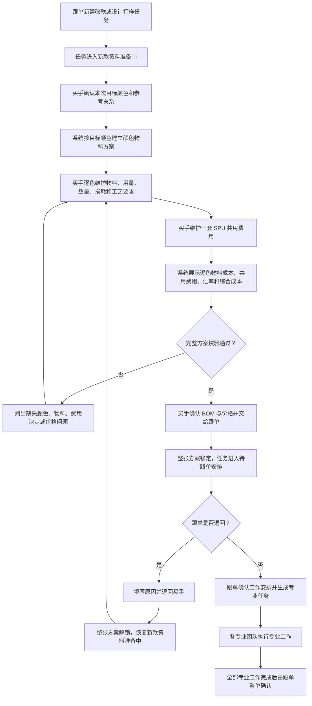
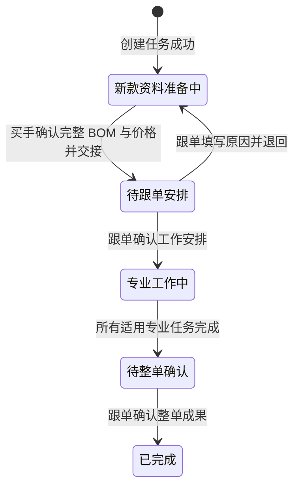
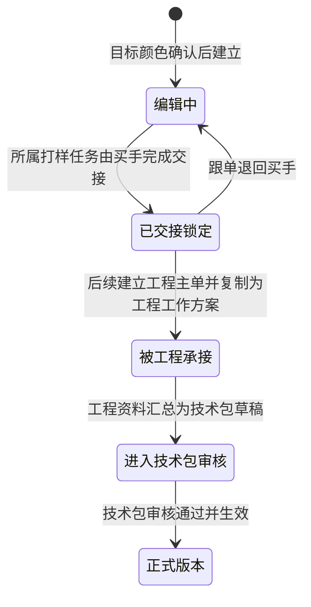
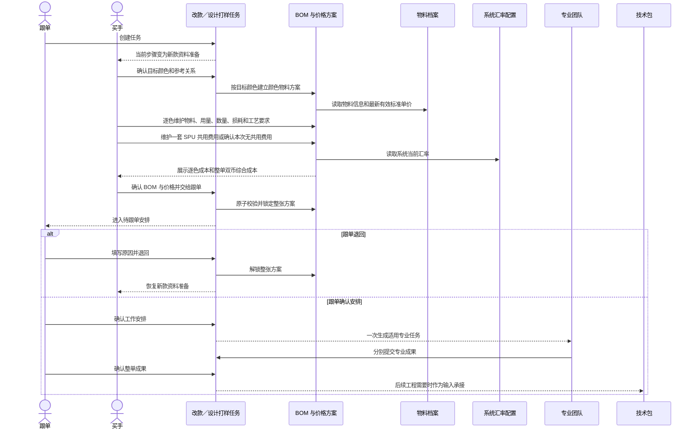

# PCS 改款与设计打样资料准备及 BOM 价格确认专项调整方案

> 本文只处理以下三个已发现的问题：
>
> 1. 新建改款打样或设计打样后，页面仍以“草稿”作为主要业务状态，不能表达当前已经轮到买手准备新款资料；
> 2. 买手点击“完成新款资料准备，交给跟单”时，可能因某个颜色的 BOM 已被提前确认而无法推进；
> 3. BOM 与价格把按颜色维护的物料和作用于整个 SPU 的自定义费用割裂，且允许只确认物料、未同时确认费用。
>
> 本文不扩展新的生产工程业务，不调整专业任务的既有执行、审核和返工规则，不新增技术包模板库，不处理历史老任务迁移，也不改变正式技术包的现行审核流程。

| 文档信息 | 内容 |
| --- | --- |
| 文档类型 | 专项调整方案 |
| 文档版本 | V1.0 |
| 文档日期 | 2026-08-13 |
| 适用系统 | 商品中心系统（PCS） |
| 直接适用业务 | 改款打样、设计打样、新款资料准备、BOM 与价格 |
| 影响核查范围 | 生产工程管理全部页面与技术资料全部页面 |
| 当前代码审查基线 | `main`，提交 `e9762c360b2255d26c74f753064e4d4de6141a76` |
| 文档状态 | 已实施并完成专项验证，待产品验收；逐项证据见《PCS改款与设计打样BOM价格专项实施验收报告》 |

---

## 1. 审查范围与结论

### 1.1 本次逐行核查的直接链路

本次以干净的 `main` 工作树为基线，逐行核查了以下直接链路，并沿路由继续核对工程主单、工程变更、技术包审核和正式生效的下游使用方式：

| 核查对象 | 核查内容 | 当前事实 |
| --- | --- | --- |
| 改款／设计打样页面 | 新建弹窗、列表状态、四步详情、颜色确认、BOM 入口、买手交接按钮、跟单退回、专业任务生成 | 两类任务共用同一页面和同一套四步流程；创建按钮及成功提示仍使用“草稿”口径 |
| 改款／设计打样业务规则 | 新建、目标颜色确认、参考色物料带入、买手完成、跟单安排、状态与当前团队推导 | 新建只生成打样业务单；颜色确认后按颜色生成 BOM；买手完成只接受仍为“草稿”的所有颜色 BOM |
| BOM 与价格页面 | 列表、颜色版本详情、物料、费用、成本汇总、保存、确认 | 每个颜色是一份版本；详情页可单独把某个颜色版本确认生效；“确认”按钮位于物料区之后、费用区之前 |
| BOM 与价格事实 | 物料行、自定义费用、汇率、成本计算、版本复制、锁定、确认、发布 | 物料与自定义费用目前都存放在每个颜色版本中；复制颜色版本时两者一起复制；技术包汇总时按颜色平铺费用，存在重复计算风险 |
| 工程主单 | 工程 BOM 汇总、条件任务建议、技术包生成门禁 | 工程主单按颜色读取 BOM；只有所有颜色版本都已确认且专业任务完成，才允许生成技术包草稿 |
| 工程变更 | 用料与成本修改、下一版技术包、专业任务、提交审核 | 用料与成本直接进入下一版技术包修改，不应生成假的通用任务；最后仍走技术包审核 |
| 技术包 | BOM 与价格汇总、买手审核、发布、生效、正式快照 | 买手审核范围同时包含“物料清单”和“核价”；正式技术包生效时才冻结价格并形成正式快照 |
| 生产工程专业任务 | 制版、花型、调色、辅料下单、技术包确认、销售展示样衣、产前版样衣 | 专业任务应在跟单完成工作安排后生成；本专项不改变其开始、提交、审核、返工和完成规则 |

### 1.2 总体结论

三个表面问题来自同一个根因：系统缺少一张“所属业务单据的完整 BOM 与价格方案”。当前只存在多个按颜色拆开的 BOM 版本，而自定义费用虽然业务上作用于整个 SPU，却仍附着在每个颜色版本上；同时，单个颜色详情页又拥有业务级“确认”能力。

因此当前会出现以下矛盾：

1. 打样任务还处在买手准备阶段，某个颜色 BOM 却可以先被标记为已确认；
2. 买手回到打样任务整单交接时，系统又要求全部颜色 BOM 必须还是草稿；
3. 同一笔车位费等 SPU 共用费用可能随多个颜色复制、汇总和计入多次；
4. 页面把“保存某个颜色的物料”误导成“已经确认整套 BOM 与价格”；
5. 任务主状态只显示“草稿”，没有表达当前轮到买手、跟单还是专业团队。

本专项的核心调整不是放宽现有报错，而是收回错误的单颜色确认入口，建立“按颜色维护物料、按 SPU 维护费用、在所属业务单据一次确认”的一致规则。

---

## 2. 当前问题的完整复现

### 2.1 问题一：创建成功后仍显示“草稿”

当前操作顺序：

1. 跟单在改款打样或设计打样列表点击新建；
2. 弹窗按钮显示“创建草稿”；
3. 创建成功提示为“任务草稿已创建”；
4. 详情头部状态显示“草稿”；
5. 但页面同时又显示“当前需处理的团队：买手”和“当前步骤：新款资料准备”。

业务上的真实含义是：任务已经创建并进入第一步，买手已经有需要处理的工作。继续突出“草稿”会让业务人员误以为任务尚未发出、尚未开始，或者仍由创建人继续编辑。

### 2.2 问题二：“完成新款资料准备”被阻断

当前可复现路径：

1. 买手确认目标颜色，系统为每个颜色建立一份 BOM 草稿；
2. 买手进入其中一个颜色的 BOM 与价格详情；
3. 买手添加物料后点击“确认当前物料方案”；
4. 该颜色版本立即从草稿变为已完成且已确认；
5. 买手返回改款／设计打样详情，点击“完成新款资料准备，交给跟单”；
6. 整单交接规则发现该颜色版本已经不是草稿，提示“已生效，不能作为当前资料准备草稿”，流程无法继续。

因此该按钮并非没有事件，而是被前一个错误入口制造出的冲突状态阻断。只修改报错文案或允许已确认版本通过，会继续保留流程双入口，不能解决根因。

### 2.3 问题三：物料与费用没有作为一个方案确认

当前页面顺序为：

1. 物料方案；
2. 保存草稿／确认当前物料方案；
3. 自定义费用；
4. 成本汇总。

这会造成三个误解：

- 用户在填写费用之前已经看到了“确认”按钮；
- 用户会认为“物料确认”和“费用确认”是两件互不相关的工作；
- 用户无法判断费用是否已经随整套方案一并交接。

更严重的是，当前每个颜色版本都保存一份自定义费用；若一个 SPU 有三个颜色，同一笔车位费可能被复制到三个版本，并在技术包汇总时被汇总三次，与“统一作用于整个 SPU”的既定业务规则冲突。

---

## 3. 调整目标与非目标

### 3.1 调整目标

1. 改款打样和设计打样创建成功后，立即进入“新款资料准备中”，当前需处理团队为买手。
2. 颜色 BOM 详情只负责保存当前颜色的物料，不再承担整套方案的业务确认。
3. 每个目标颜色维护自己的物料方案；整个目标 SPU 只维护一套共用费用。
4. 物料、费用、汇率和综合成本在同一个“BOM 与价格方案”中展示和确认。
5. 买手只在所属打样任务中执行一次“确认 BOM 与价格并交给跟单”。
6. 该动作一次校验、一次锁定、一次交接；任一颜色或费用决策不完整时整单不推进。
7. 工程主单、工程变更和技术包使用同一对象口径，但由各自所属业务单据完成确认，不允许单个颜色详情越权确认。
8. 正式技术包仍按现行买手、版师、跟单审核流程处理；正式生效时才形成不可变的价格快照。

### 3.2 明确不调整

1. 不调整改款打样“来源 SPU 与目标 SPU 必须已建档且不能相同”的创建门禁。
2. 不调整设计打样“目标 SPU 必须已建档”的创建门禁。
3. 不调整目标颜色可新增、可减少、可多于来源款以及可无参考色的既有规则。
4. 不调整专业任务种类、依赖、开始、提交、审核、返工和完成规则。
5. 不调整销售展示样衣和产前版样衣的颜色、尺码、要求数量及真实文件上传规则。
6. 不新增审批流、任务取消、个人预分配、历史老任务兼容页面或导入功能。
7. 不新增技术包模板库。
8. 不把打样阶段方案直接变成正式技术包；正式版本仍由技术包审核和生效产生。

---

## 4. 目标业务对象与事实归属

### 4.1 BOM 与价格方案

每一个业务来源只拥有一张“BOM 与价格方案”。业务来源可以是：

- 一张改款打样任务；
- 一张设计打样任务；
- 一张工程主单；
- 一个下一版技术包草稿；
- 一张工程变更所建立的下一版技术包。

一张方案由两类内容组成：

| 内容 | 粒度 | 说明 |
| --- | --- | --- |
| 颜色物料方案 | 每个目标颜色一份 | 物料、单位用量、打样数量、损耗、适用 SKU、印花／染色／采购要求等 |
| SPU 共用费用 | 整个目标 SPU 一份 | 车位费、特殊加工费等自定义费用，币种为印尼盾 |

颜色物料方案与 SPU 共用费用共同构成完整方案，缺少任一应填内容时，不得完成业务确认。

### 4.2 为什么费用不能继续挂在颜色下面

一笔车位费是本次整个 SPU 的费用，不因颜色数量增加而重复发生。正确关系为：

```text
一张打样任务／工程主单／下一版技术包
  └─ 一张 BOM 与价格方案
       ├─ 颜色 A 的物料方案
       ├─ 颜色 B 的物料方案
       ├─ 颜色 C 的物料方案
       └─ 一套 SPU 共用费用
```

颜色可以增减，但 SPU 共用费用始终只有一套。切换颜色页签时，费用显示的仍是同一套事实，不复制、不累加、不随颜色删除。

### 4.3 方案与正式技术包的关系

| 阶段 | 方案性质 | 是否可修改 | 是否正式快照 |
| --- | --- | --- | --- |
| 改款／设计打样新款资料准备 | 打样工作方案 | 买手可修改 | 否 |
| 买手交给跟单后 | 已交接工作方案 | 锁定；跟单退回后重新开放 | 否 |
| 工程主单准备阶段 | 工程工作方案 | 买手按工程规则维护、整单确认 | 否 |
| 技术包草稿／工程变更下一版 | 待审核技术资料 | 按技术包审核权限维护 | 否 |
| 技术包发布并生效 | 正式版本 | 只读 | 是 |

---

## 5. 与当前相比的改动清单

| 编号 | 当前行为 | 调整后行为 | 业务结果 |
| --- | --- | --- | --- |
| CHG-001 | 新建按钮和成功提示均使用“草稿” | 弹窗按钮改为“创建任务”；成功提示说明“任务已创建，待买手准备新款资料” | 创建即进入业务流程，不再误解为尚未发出 |
| CHG-002 | 详情头部主要状态显示“草稿” | 显示“新款资料准备中”；同步显示当前需处理团队“买手” | 状态、步骤和团队一致 |
| CHG-003 | 买手准备完成后，底层仍沿用同一个草稿状态 | 交接后显示“待跟单安排”；退回后恢复“新款资料准备中” | 能清楚区分轮到谁处理 |
| CHG-004 | 每个颜色 BOM 详情都可以“确认当前物料方案” | 单颜色详情只保留“保存当前颜色物料”；不提供业务级确认 | 消除多入口和提前生效 |
| CHG-005 | 物料区之后先出现确认按钮，费用区在其下方 | 物料、共用费用、成本汇总放入同一方案；统一操作区放在全部内容之后 | 用户先看完并维护完整方案，再确认 |
| CHG-006 | 自定义费用存放在每个颜色版本 | 自定义费用归属整张方案／整个 SPU，只保存一套 | 颜色数量变化不会重复费用 |
| CHG-007 | 技术包按颜色平铺费用 | 技术包只汇总一套 SPU 共用费用 | 避免正式成本重复 |
| CHG-008 | “完成新款资料准备”只检查颜色 BOM 草稿 | 一次检查目标颜色、各颜色物料、费用决定、有效单价、汇率和来源处理 | 完整资料一次交接 |
| CHG-009 | 某颜色提前确认后，整单交接报“已生效” | 独立打样阶段不存在单色提前确认入口；交接只可能由所属打样任务发起 | 根除按钮看似无作用的问题 |
| CHG-010 | 错误只显示一条仓储异常 | 页面列出未完成的颜色／费用项目，并定位到相应内容 | 买手知道缺什么、去哪里补 |
| CHG-011 | 工程主单也通过共用单色页确认颜色版本 | 单色页只保存；工程主单详情负责整张工程方案确认 | 工程条件任务读取一套已确认事实 |
| CHG-012 | 工程变更的用料和费用可能沿用单色确认 | 下一版技术包统一维护并在现行技术包审核中确认 | 不制造第二套确认流程 |
| CHG-013 | 技术资料 BOM 列表一行代表一个颜色版本 | 列表明确业务来源和整张方案状态，并可展开／进入各颜色物料 | 不把一个颜色误解成整张方案 |
| CHG-014 | 已有 Mock 可能包含每色重复费用或已提前确认的独立打样 BOM | 当前原型 Mock 按新事实重建，不提供面向用户的历史迁移文案 | 演示数据不再制造冲突状态 |

---

## 6. 目标业务流程



---

## 7. 状态设计

### 7.1 改款／设计打样任务的业务状态

页面不得再直接把底层版本状态“草稿”当作打样任务的主要业务状态。列表、详情、筛选和当前动作统一使用以下业务状态：



| 业务状态 | 当前需处理团队 | 当前动作 |
| --- | --- | --- |
| 新款资料准备中 | 买手 | 确认颜色、维护各颜色物料和 SPU 共用费用 |
| 待跟单安排 | 跟单 | 查看完整方案，确认或退回工作安排 |
| 专业工作中 | 当前尚未完成的专业团队 | 进入对应专业任务执行 |
| 待整单确认 | 跟单 | 核对所有专业成果并确认整单 |
| 已完成 | — | 只读查看 |

### 7.2 BOM 与价格方案状态



说明：

1. 独立打样的“已交接锁定”不等于正式生效；它只表示买手已把本次工作资料交给跟单。
2. 单个颜色没有独立的业务确认状态，只记录其物料是否完整、是否保存、是否被整张方案锁定。
3. 正式版本只能由技术包审核通过并生效产生。

---

## 8. 角色时序



---

## 9. 改款打样与设计打样详细调整

### 9.1 新建弹窗

两类新建弹窗保留现有款式选择和门禁，仅调整业务表达：

| 页面元素 | 改款打样 | 设计打样 |
| --- | --- | --- |
| 标题 | 新建改款打样任务 | 新建设计打样任务 |
| 主按钮 | 创建任务 | 创建任务 |
| 创建说明 | 创建后进入买手的新款资料准备，不提前生成专业任务 | 创建后进入买手的新款资料准备，不提前生成专业任务 |
| 成功提示 | 任务已创建，待买手准备新款资料 | 任务已创建，待买手准备新款资料 |
| 创建后页面状态 | 新款资料准备中 | 新款资料准备中 |
| 当前团队 | 买手 | 买手 |

“草稿”可以继续作为内部未进入后续阶段的技术状态，但不再在业务页面中作为主任务状态、主按钮或成功提示使用。

### 9.2 列表页

改款打样和设计打样列表统一调整：

1. 状态列使用第 7.1 节的业务状态；不显示内部“DRAFT”。
2. “当前需处理的团队”筛选继续保留，并与详情当前团队完全一致。
3. BOM 与价格列展示整张方案状态，而不是只链接第一个颜色：
   - 尚未确认目标颜色；
   - N 个颜色资料准备中；
   - N 个颜色、共用费用已交接；
   - 已退回修改。
4. 点击 BOM 与价格进入所属打样任务的“新款资料准备／BOM 与价格”步骤，而不是直接让用户落到任意一个颜色版本。
5. 列设置仍位于数据列表表头最右侧；本专项不再次调整列表骨架。

### 9.3 第一步：新款资料准备

保留两个子页签，但重新明确职责：

#### 子页签一：目标颜色与参考色

- 继续由买手维护本次目标颜色、适用尺码和来源色关系；
- 改款允许参考来源款颜色或选择无参考色；
- 设计打样没有来源款，直接建立目标颜色；
- 确认目标颜色后，建立或调整对应颜色物料方案；
- 目标颜色未确认时，BOM 与价格子页签只展示前置提示，不允许维护。

#### 子页签二：BOM 与价格

页面按以下顺序组织：

1. 颜色页签或颜色列表；
2. 当前颜色物料方案；
3. SPU 共用费用；
4. 逐色物料成本及整单综合成本；
5. 统一操作区。

统一操作区只保留：

- `保存当前修改`：保存尚未交接的颜色物料和共用费用，不推进流程；
- `确认 BOM 与价格并交给跟单`：在所属打样任务中一次校验、锁定并推进。

单个颜色内部不再出现“确认当前物料方案”。

### 9.4 买手交接门禁

点击“确认 BOM 与价格并交给跟单”时，系统一次检查：

1. 至少存在一个已确认目标颜色；
2. 每个目标颜色都有且只有一份当前颜色物料方案；
3. 每个颜色至少有一条有效物料；
4. 所有物料的单位用量、打样数量、损耗、用量单位和适用 SKU 完整；
5. 所有物料都有有效标准单价；
6. 需要印花、染色或采购的物料已经明确相应要求；
7. 改款中所有来源物料已经明确沿用、替换、删除或新增；
8. SPU 共用费用已经完成明确决策：存在费用，或买手主动确认“本次无自定义费用”；
9. 系统存在可用的当前汇率；
10. 页面展示的整单综合成本已经按最新事实重新计算；
11. 所有颜色物料方案和共用费用仍处于可编辑、未交接状态；
12. 当前任务确实处于新款资料准备阶段，且操作角色为买手。

任一项失败时：

- 整张方案不锁定；
- 任务不交给跟单；
- 页面顶部列出所有未通过项，不只显示第一条；
- 每条问题可定位到具体颜色、物料或共用费用；
- 已填写内容保留，用户修正后可再次提交。

全部通过时，颜色物料方案和 SPU 共用费用必须在同一次业务动作中锁定，任务同时进入“待跟单安排”。不得出现部分颜色已交接、部分颜色仍可编辑。

### 9.5 跟单退回

1. 跟单只能整张退回，不按颜色单独退回；
2. 必须填写退回原因；
3. 退回后所有颜色物料方案和 SPU 共用费用同时解锁；
4. 当前团队恢复为买手，状态恢复为“新款资料准备中”；
5. 既有内容保留，不重新按参考色覆盖买手已经修改的内容；
6. 只有买手明确点击“重新按参考色生成”时，才允许覆盖指定颜色，并二次确认影响范围；
7. 再次交接时重新执行全部门禁。

### 9.6 第二步以后

本专项不改变工作安排、专业工作和整单确认的规则，仅增加前置保证：

- 跟单只有在完整 BOM 与价格方案已交接锁定后才能确认工作安排；
- 花型、调色和辅料任务的系统建议读取锁定方案中的物料要求；
- 专业任务不得在新款资料准备阶段提前生成；
- 跟单退回买手时尚未生成专业任务；
- 专业任务生成后，不允许退回第一步改写其输入；后续修改按现有返工或工程变更规则处理。

---

## 10. BOM 与价格页面详细调整

### 10.1 列表层级

技术资料中的 BOM 与价格列表从“颜色版本清单”调整为“业务方案清单”。每行代表一张所属业务单据的完整方案，至少展示：

- 款式真实图片、SPU 和名称；
- 所属阶段与来源单号；
- 目标颜色数量；
- 物料行总数；
- SPU 共用费用项数；
- 综合成本人民币／印尼盾；
- 当前团队；
- 方案状态；
- 更新时间；
- 查看／维护入口。

进入方案后再查看各颜色物料。若为减少首期改动暂时保留每颜色一行，必须同时满足：

1. 列表明确标注“颜色物料方案”，不能把颜色行称为完整 BOM 与价格；
2. 共用费用项数和综合成本只在所属方案汇总位置展示一次；
3. 操作名称改为“维护该颜色物料”；
4. 整张方案确认入口只存在于所属业务单据。

### 10.2 详情结构

详情页统一为一张“BOM 与价格方案”工作区：

1. 顶部展示业务来源、款式、方案状态、当前团队和是否锁定；
2. 颜色导航用于切换每个颜色的物料，不切换 SPU 共用费用；
3. 当前颜色物料区支持新增、修改、删除和保存；
4. SPU 共用费用区在所有颜色下读取同一套数据；
5. 成本汇总同时展示当前颜色物料成本、全部颜色物料成本、共用费用、汇率和整单综合成本；
6. 页面底部统一放置保存或返回所属业务单据的动作；
7. 独立打样来源的详情页不显示“确认当前物料方案”；
8. 锁定后整页只读，并提供“返回所属打样任务／工程主单／技术包”的明确入口。

### 10.3 保存与确认的区别

| 动作 | 作用范围 | 是否推进流程 | 是否锁定 |
| --- | --- | --- | --- |
| 保存当前颜色物料 | 当前颜色 | 否 | 否 |
| 保存 SPU 共用费用 | 整张方案 | 否 | 否 |
| 保存当前修改 | 当前页面全部未保存内容 | 否 | 否 |
| 确认 BOM 与价格并交给跟单 | 改款／设计打样整张方案 | 是 | 是 |
| 确认工程 BOM 与价格 | 工程主单整张方案 | 是 | 是 |
| 提交技术包审核 | 技术包全部模块 | 是 | 按审核流程控制 |

不得再使用一个共用的“确认当前物料方案”把不同业务阶段的颜色版本直接变为已确认。

### 10.4 自定义费用规则

1. 自定义费用作用于整个 SPU，每个业务方案只保存一套；
2. 只有买手可以新增、修改和删除；
3. 币种固定为印尼盾；
4. 允许无自定义费用，但买手必须主动选择“本次无自定义费用”；
5. 新增费用后，“本次无自定义费用”自动取消；
6. 删除最后一条费用后，需重新明确是否无费用；
7. 切换颜色不得复制、删除或重新计算费用项；
8. 从来源方案复制颜色物料时，不按颜色复制共用费用；
9. 承接整张前期方案时，共用费用只复制一次，并保留来源；
10. 技术包汇总、审核和正式快照只读取一次共用费用。

### 10.5 成本计算

对每个目标颜色分别计算物料成本：

```text
颜色物料成本（CNY）
= 该颜色所有物料的 [单位用量 × 打样数量 ×（1 + 损耗率）× 单位换算系数 × 最新标准单价] 之和
```

整张方案汇总：

```text
全部颜色物料成本（CNY） = 所有颜色物料成本之和
SPU 共用费用（IDR） = 所有自定义费用之和，只计一次
综合成本（CNY） = 全部颜色物料成本 + SPU 共用费用 ÷ 当前汇率
综合成本（IDR） = 全部颜色物料成本 × 当前汇率 + SPU 共用费用
```

草稿阶段始终读取物料档案的最新有效标准单价和系统当前汇率；正式技术包生效时才冻结快照。本专项不增加汇率历史选择。

---

## 11. 生产工程管理全部页面影响

| 页面／功能 | 是否直接调整 | 调整或验证要求 |
| --- | --- | --- |
| 工程主单列表 | 间接 | BOM 与价格状态读取整张工程方案，不按某个颜色的确认状态推断 |
| 工程主单详情 | 直接 | 工程 BOM 汇总展示颜色物料和一套共用费用；由工程主单提供整张方案确认入口；条件任务只读取已确认工程方案 |
| 工程变更列表 | 间接 | “用料与成本”状态读取下一版技术包中的完整方案，不显示某一颜色已确认即完成 |
| 工程变更新建 | 间接 | 选择“用料与成本”仍是一项直接资料修改，不增加假的专业任务 |
| 工程变更详情 | 直接验证 | 进入下一版技术包统一修改物料与费用；“确认本项已修改”必须同时检查物料与费用确有变化且完整 |
| 改款打样列表 | 直接 | 状态改为业务状态；BOM 列展示整张方案；当前团队筛选保持一致 |
| 改款打样详情 | 直接 | 新建后进入新款资料准备；逐色物料 + SPU 共用费用；一次交接 |
| 设计打样列表 | 直接 | 与改款打样使用相同状态和方案口径 |
| 设计打样详情 | 直接 | 与改款打样使用相同四步骨架；无来源色时建立空白颜色物料方案；一次交接 |
| 制版任务列表／详情 | 无流程改动 | 验证在跟单确认工作安排前不生成；生成后仍按现行任务推进 |
| 花型任务列表／详情 | 无流程改动 | 建议来源读取锁定物料的印花要求；审核规则不变 |
| 调色任务列表／详情 | 无流程改动 | 建议来源读取锁定物料的染色要求；三阶段和买手终审规则不变 |
| 辅料下单任务列表／详情 | 无流程改动 | 建议来源读取锁定物料的采购要求；采购单绑定规则不变 |
| 技术包确认任务列表／详情 | 间接 | 工程 BOM 与价格整张确认后才满足技术包生成前置；任务本身流程不变 |
| 销售展示样衣任务列表／详情 | 无流程改动 | 仍由跟单下达颜色、尺码、要求数量；真实图片上传规则不变 |
| 产前版样衣任务列表／详情 | 无流程改动 | 仍由工程主单跟单下达颜色、尺码、要求数量；真实图片上传规则不变 |

### 11.1 工程主单的确认位置

工程主单不能沿用独立打样的“交给跟单”按钮。目标规则为：

1. 工程主单承接前期方案后，形成自己的整张工程 BOM 与价格方案；
2. 买手在工程主单的 BOM 与价格工作区维护各颜色物料和一套共用费用；
3. 由工程主单详情执行“确认工程 BOM 与价格”；
4. 确认后，花型、调色、辅料等条件任务建议和技术包生成门禁读取这张确认结果；
5. 单颜色页只保存，不确认。

### 11.2 工程变更的确认位置

工程变更中的用料与成本修改归属于下一版技术包：

1. 买手进入下一版技术包的 BOM 与价格工作区；
2. 修改受影响颜色物料以及需要变化的 SPU 共用费用；
3. 工程变更详情只判断“本次选中的用料与成本是否确实发生修改且资料完整”；
4. 最终由跟单汇总并提交现行技术包审核；
5. 买手在技术包审核节点同时审核物料清单和核价；
6. 不在工程变更里再造一套颜色确认或费用确认流程。

---

## 12. 技术资料全部页面影响

| 页面／功能 | 是否直接调整 | 调整或验证要求 |
| --- | --- | --- |
| 技术包列表 | 间接 | 版本状态和完整度仍按技术包整体计算；不因某个颜色物料已保存而显示 BOM 已确认 |
| 技术包详情 | 直接验证 | BOM 与价格模块同时展示全部颜色物料和一套 SPU 共用费用；买手审核范围继续同时包含物料清单和核价 |
| 技术包审核 | 直接验证 | 买手一次审核 BOM 与价格；逐条退回时可定位物料行或费用行；费用不得按颜色重复生成审核项 |
| 技术包发布／生效 | 直接验证 | 生效时冻结一次共用费用和各颜色物料标准单价；正式快照的综合成本只计一次共用费用 |
| BOM 与价格列表 | 直接 | 以所属业务方案为主，颜色为下级物料视图；状态展示整张方案状态 |
| BOM 与价格详情 | 直接 | 物料、共用费用、汇率、综合成本和统一操作放在同一工作区；单色页无业务确认 |
| 花型库 | 无改动 | 继续承接审核通过的花型成果；不读取或维护费用 |
| 部位模板库 | 无改动 | 继续提供纸样／部位模板结果；与本专项无数据关系 |

### 12.1 技术包汇总规则

技术包草稿汇总时：

1. 每个颜色物料行按颜色进入技术包 BOM；
2. SPU 共用费用只进入一次；
3. 不从每个颜色版本平铺复制费用；
4. 买手审核“物料清单”时可逐物料行通过或退回；
5. 买手审核“核价”时可逐费用行通过或退回；
6. 物料与费用均通过后，买手节点才算通过；
7. 正式生效前标准单价失效或物料档案失效时，继续按现行门禁阻断审核／生效。

---

## 13. 权限与操作规则

| 动作 | 买手 | 跟单 | 专业团队 | 技术包审核人 |
| --- | --- | --- | --- | --- |
| 维护目标颜色与参考关系 | 允许 | 查看 | 不可操作 | 不适用 |
| 维护颜色物料 | 允许 | 查看 | 查看任务所需部分 | 按审核范围查看 |
| 维护 SPU 共用费用 | 允许 | 查看 | 不可操作 | 买手审核人审核 |
| 保存未交接方案 | 允许 | 不可操作 | 不可操作 | 不适用 |
| 确认并交给跟单 | 允许 | 不可操作 | 不可操作 | 不适用 |
| 退回新款资料准备 | 不可操作 | 允许，必须填写原因 | 不可操作 | 不适用 |
| 确认工作安排 | 不可操作 | 允许 | 不可操作 | 不适用 |
| 确认工程 BOM 与价格 | 允许 | 查看 | 不可操作 | 不适用 |
| 提交技术包审核 | 查看 | 允许 | 查看 | 不适用 |
| 审核技术包 BOM 与价格 | 按指定买手审核人 | 按跟单范围 | 版师按纸样范围 | 按节点权限 |

不预先具体到个人；页面先显示当前需处理团队。实际保存、交接、退回、审核和生效后，在操作记录中保存真实操作人和时间。

---

## 14. 防错、反馈与恢复

### 14.1 不允许静默无响应

所有主动作必须在点击后立即出现可见反馈：

- 处理中；
- 成功并已进入哪一步；
- 失败及需要补什么；
- 数据已被其他动作锁定时，说明返回哪里查看或如何退回修改。

不得只在浏览器控制台抛出异常，也不得让按钮点击后页面保持原样且无提示。

### 14.2 重复提交

1. 买手交接动作必须幂等；成功后重复点击不得再次复制费用或建立颜色版本；
2. 处理中按钮禁用，防止双击；
3. 已交接后重新打开页面，直接进入“待跟单安排”，不得把已锁定方案重新生成成草稿；
4. 跟单退回后才允许再次编辑和再次交接。

### 14.3 颜色变化

1. 增加颜色：新增一份颜色物料方案；共用费用不复制；
2. 移除尚未交接颜色：移除对应颜色物料方案；共用费用不变；
3. 已交接后不能直接增删颜色，必须由跟单退回；
4. 移除颜色前提示将删除该颜色尚未交接的物料修改；
5. 改名时保持颜色与适用 SKU 唯一，不允许重复颜色。

### 14.4 当前原型数据处理

本专项不提供面向用户的老任务迁移功能，也不展示“历史兼容”文案。实施时只处理当前原型 Mock：

1. 独立打样颜色版本全部恢复为未交接工作方案，不预先标记为已确认；
2. 多颜色重复的相同共用费用合并为一套；
3. 若同一方案各颜色费用不一致，测试数据必须明确选择一套正确费用，禁止自动相加；
4. 调整后的 Mock 至少覆盖零费用、一笔费用、多笔费用、多颜色和跟单退回场景。

---

## 15. 原子需求追踪表

| 需求编号 | 原子需求 | 影响页面／功能 | 完成证据 |
| --- | --- | --- | --- |
| SAMPLE-STATUS-001 | 改款打样创建成功后显示“新款资料准备中” | 改款列表、详情 | 列表与详情浏览器场景 |
| SAMPLE-STATUS-002 | 设计打样创建成功后显示“新款资料准备中” | 设计列表、详情 | 列表与详情浏览器场景 |
| SAMPLE-STATUS-003 | 买手交接后显示“待跟单安排” | 两类详情、列表 | 状态契约与浏览器场景 |
| SAMPLE-STATUS-004 | 跟单退回后恢复“新款资料准备中” | 两类详情、列表 | 退回场景 |
| SAMPLE-CREATE-001 | 新建主按钮使用“创建任务”，不使用“创建草稿” | 两类新建弹窗 | 页面文案检查 |
| SAMPLE-CREATE-002 | 创建成功提示说明当前轮到买手 | 两类详情 | 浏览器场景 |
| BOM-GROUP-001 | 一个业务来源只有一张 BOM 与价格方案 | 全部 BOM 来源 | 领域契约 |
| BOM-GROUP-002 | 每个目标颜色只有一份颜色物料方案 | 两类打样、工程主单、技术包 | 领域契约 |
| BOM-GROUP-003 | 每个业务方案只有一套 SPU 共用费用 | BOM 仓储、详情、技术包 | 重复费用专项契约 |
| BOM-GROUP-004 | 单颜色详情不得提供业务级确认入口 | BOM 详情 | 页面契约与浏览器检查 |
| BOM-GROUP-005 | 颜色物料与共用费用在同一方案内展示 | BOM 详情、打样第一步 | 页面验收 |
| BOM-GROUP-006 | 统一操作区位于物料、费用和成本汇总之后 | BOM 详情、打样第一步 | 页面验收 |
| BOM-GROUP-007 | 保存动作不推进流程、不锁定方案 | BOM 详情 | 领域契约 |
| BOM-GROUP-008 | 买手交接同时校验全部颜色物料和共用费用 | 两类打样详情 | 正常与阻断场景 |
| BOM-GROUP-009 | 买手交接同时锁定全部颜色物料和共用费用 | 两类打样详情 | 原子性专项契约 |
| BOM-GROUP-010 | 任一校验失败时整张方案不推进 | 两类打样详情 | 原子回退场景 |
| BOM-GROUP-011 | 跟单退回同时解锁全部颜色物料和共用费用 | 两类打样详情 | 退回场景 |
| BOM-GROUP-012 | 已交接方案重新打开不得重建成草稿 | 两类详情、BOM 仓储 | 刷新回归场景 |
| COST-001 | 自定义费用只作用于整个 SPU | 全部 BOM 来源 | 领域契约 |
| COST-002 | 自定义费用只计入综合成本一次 | BOM 成本、技术包 | 三颜色成本场景 |
| COST-003 | 无费用时必须由买手明确确认 | 两类打样、工程主单 | 无费用场景 |
| COST-004 | 费用变更后综合成本使用当前汇率重新计算 | BOM 详情 | 成本计算契约 |
| COST-005 | 技术包只生成一组费用审核项 | 技术包审核 | 审核清单场景 |
| COST-006 | 正式生效只冻结一套 SPU 共用费用 | 技术包生效 | 正式快照契约 |
| PAGE-001 | 改款列表 BOM 列展示整张方案状态 | 改款列表 | 页面验收 |
| PAGE-002 | 设计列表 BOM 列展示整张方案状态 | 设计列表 | 页面验收 |
| PAGE-003 | BOM 列表以业务方案为主，颜色为下级 | BOM 列表 | 页面验收 |
| PAGE-004 | BOM 详情颜色切换不复制共用费用 | BOM 详情 | 浏览器场景 |
| PAGE-005 | 校验失败一次列出全部未完成项 | 两类打样详情 | 多错误场景 |
| PAGE-006 | 所有主动作在 200ms 内出现处理中或结果反馈 | 两类详情、BOM 详情 | 交互验收 |
| MASTER-001 | 工程主单由主单详情确认整张工程 BOM 与价格 | 工程主单详情 | 主单全流程场景 |
| MASTER-002 | 条件任务只读取已确认工程方案 | 主单任务建议 | 任务建议契约 |
| CHANGE-001 | 工程变更在下一版技术包统一修改物料和费用 | 工程变更详情、技术包 | 变更场景 |
| CHANGE-002 | 工程变更不建立 BOM 或费用假任务 | 工程变更新建、详情 | 页面与数据契约 |
| PACK-001 | 技术包汇总每色物料但只汇总一套费用 | 技术包草稿 | 汇总契约 |
| PACK-002 | 买手审核同时覆盖物料清单与核价 | 技术包审核 | 审核场景 |
| PACK-003 | 正式生效时才形成价格快照 | 技术包生效 | 生效契约 |
| REG-001 | 专业任务不得在跟单确认工作安排前生成 | 全部专业任务列表 | 前置阻断场景 |
| REG-002 | 制版、花型、调色、辅料、样衣任务既有规则保持不变 | 全部专业任务 | 相邻回归清单 |
| REG-003 | 花型库和部位模板库保持不变 | 技术资料 | 路由与页面回归 |

---

## 16. 实施工作包

### WP-01：统一 BOM 与价格方案事实

**业务目标：** 建立“业务方案—颜色物料—SPU 共用费用”的正确归属。

**主要实现位置：**

- BOM 与价格类型、仓储、复制、锁定、确认和发布；
- BOM 成本计算与技术包汇总；
- 独立打样、工程主单和技术包的所属关系。

**修改要求：**

1. 从颜色版本中移出 SPU 共用费用的唯一事实；
2. 颜色版本只保存颜色物料；
3. 所属方案保存一套共用费用和费用决策；
4. 复制颜色时不复制费用；复制整张方案时费用只复制一次；
5. 所有锁定、退回、审核和快照动作同时处理整张方案。

**完成条件：** 三个颜色使用一笔车位费时，任意页面和正式技术包都只计算一次。

### WP-02：收口确认入口

**业务目标：** 单颜色只保存，所属业务单据一次确认。

**修改要求：**

1. 移除单颜色详情的通用确认动作；
2. 独立打样在第一步统一交接；
3. 工程主单在主单详情统一确认；
4. 技术包和工程变更按现行技术包审核统一确认；
5. 各入口使用各自业务文案，不再共用模糊的“确认当前物料方案”。

**完成条件：** 不存在任何路径可以在所属业务单据确认前把一个独立打样颜色先标记为已生效。

### WP-03：改款／设计打样状态与交接

**业务目标：** 创建即进入买手工作，交接动作真实推进。

**修改要求：**

1. 调整两类新建弹窗、成功提示和可见状态；
2. 列表和详情使用同一业务状态推导；
3. 交接前完成整张方案门禁；
4. 成功后重新读取事实并进入第二步；
5. 失败时列出完整问题；
6. 跟单退回同时解锁整张方案。

**完成条件：** 两类任务均能从创建连续走到跟单工作安排，且不再出现“某颜色已生效，不能作为草稿”的冲突。

### WP-04：技术资料页面统一

**业务目标：** 用户在一张方案中理解并维护物料与费用。

**修改要求：**

1. BOM 列表表达方案与颜色层级；
2. BOM 详情统一物料、费用、汇率和整单成本；
3. 费用区明确“整个 SPU 共用”；
4. 统一操作区置于页面末尾；
5. 技术包详情和审核只展示一套费用。

**完成条件：** 买手不需要在不同颜色重复维护车位费，也不会在费用之前误点确认。

### WP-05：下游收口与相邻回归

**业务目标：** 修复打样问题时不破坏工程主单、工程变更和正式技术包。

**修改要求：**

1. 工程主单整张确认和条件任务建议读取新方案；
2. 工程变更下一版技术包读取新方案；
3. 技术包汇总、审核、发布和生效读取一套费用；
4. 花型、调色、辅料、制版、技术包确认和样衣任务做相邻回归；
5. 花型库、部位模板库做不受影响回归。

**完成条件：** 正式技术包包含全部颜色物料和一套费用，工程条件任务与专业任务流转保持正确。

### WP-06：Mock、测试与追踪证据

**业务目标：** 用真实业务组合证明三个问题均已解决。

**修改要求：**

1. 重建冲突 Mock；
2. 增加领域原子性、费用唯一性和状态推导专项契约；
3. 增加改款、设计、工程主单、工程变更和技术包端到端场景；
4. 每条原子需求回填实现位置和证据；
5. 当前分支最后一次实质修改后重新执行全部受影响验证。

**完成条件：** 第 15 节不存在无说明的待实施、实施中、已实现待验证或已阻塞条目。

---

## 17. 完整验收场景

### 17.1 改款打样

| 场景编号 | 前置条件 | 操作 | 预期结果 |
| --- | --- | --- | --- |
| REV-01 | A、B 款均已建档且不同 | 跟单创建改款打样 | 显示新款资料准备中；当前团队买手；无专业任务 |
| REV-02 | 新任务 | 买手建立 B 款两个颜色，一个参考 A 款、一个无参考 | 建立两份颜色物料方案和一套空的 SPU 共用费用事实 |
| REV-03 | 两个颜色已建立 | 买手分别维护两色物料并新增车位费 15,000 IDR | 两色物料独立；车位费只显示一次；整单成本正确 |
| REV-04 | 第一色完整、第二色无物料 | 点击确认并交给跟单 | 阻断并指出第二色缺少物料；任务仍在买手阶段 |
| REV-05 | 所有物料完整、费用区未做决定 | 点击确认并交给跟单 | 阻断并提示确认费用或选择本次无费用 |
| REV-06 | 全部完整 | 点击确认并交给跟单 | 所有颜色和共用费用同时锁定；进入待跟单安排 |
| REV-07 | 已交接 | 跟单填写原因退回 | 全部解锁；恢复新款资料准备中；内容保留 |
| REV-08 | 已重新交接 | 跟单确认工作安排 | 一次生成适用专业任务；进入专业工作中 |

### 17.2 设计打样

| 场景编号 | 前置条件 | 操作 | 预期结果 |
| --- | --- | --- | --- |
| DES-01 | 目标 SPU 已建档 | 跟单创建设计打样 | 显示新款资料准备中；当前团队买手 |
| DES-02 | 无来源款 | 买手建立三个目标颜色 | 建立三份空白颜色物料方案；费用仍只有一套 |
| DES-03 | 三色物料完整 | 新增两项共用费用并保存 | 三个颜色切换看到同一费用事实；不产生六项费用 |
| DES-04 | 全部完整 | 买手交给跟单 | 整张锁定并进入第二步，不出现已生效冲突 |
| DES-05 | 刷新／重新打开 | 查看任务 | 仍处于待跟单安排；不重新生成颜色或费用草稿 |

### 17.3 BOM 与价格

| 场景编号 | 操作 | 预期结果 |
| --- | --- | --- |
| BOM-01 | 从某颜色行进入详情 | 只可保存该颜色物料，不显示业务级确认按钮 |
| BOM-02 | 切换颜色 | 物料随颜色变化；SPU 共用费用保持同一套 |
| BOM-03 | 修改物料档案标准价后重新打开草稿 | 读取最新有效标准价并重新计算 |
| BOM-04 | 物料无有效标准价 | 不能加入或不能交接，并显示明确恢复动作 |
| BOM-05 | 删除最后一条费用 | 要求重新确认“本次无自定义费用” |
| BOM-06 | 三颜色、一笔 15,000 IDR 费用 | 综合成本只加一次 15,000 IDR |
| BOM-07 | 快速双击整单交接 | 只执行一次，不复制版本或费用 |

### 17.4 工程主单

| 场景编号 | 操作 | 预期结果 |
| --- | --- | --- |
| MASTER-01 | 承接已完成打样方案 | 生成工程主单自己的颜色物料和一套共用费用工作方案，不改前期方案 |
| MASTER-02 | 仅保存一个颜色物料 | 工程方案仍未确认；不能生成技术包 |
| MASTER-03 | 买手在主单确认完整工程方案 | 条件任务建议读取印花、染色和采购事实；技术包门禁可继续判断 |
| MASTER-04 | 某颜色物料或费用决定缺失 | 整单确认阻断并定位问题 |

### 17.5 工程变更与技术包

| 场景编号 | 操作 | 预期结果 |
| --- | --- | --- |
| CHANGE-01 | 选择修改某颜色物料和车位费 | 在下一版技术包统一修改，不创建假任务 |
| CHANGE-02 | 只改物料未处理费用决定 | “用料与成本”修改项不得标记完成 |
| PACK-01 | 从三颜色工程方案生成技术包草稿 | 技术包有三组颜色物料和一套共用费用 |
| PACK-02 | 买手审核 | 同一节点审核物料清单与核价；费用审核项不重复 |
| PACK-03 | 审核通过并生效 | 冻结最新标准单价、当前汇率和一套共用费用，形成正式快照 |
| PACK-04 | 正式版本回看 | 综合成本与生效时快照一致，不随之后汇率或标准价变化 |

### 17.6 不受影响回归

1. 制版任务仍能开始、真实上传 `.prj`、提交和进入后续；
2. 花型任务仍由买手整单审核，未通过项逐项标记；
3. 调色任务仍按跟单确认颜色要求、染厂调色、买手终审推进；
4. 辅料下单任务仍绑定采购单号并读取采购信息；
5. 销售展示样衣和产前版样衣仍按颜色、尺码、要求数量交付真实图片；
6. 技术包确认任务仍在全部前置完成后推进；
7. 花型库和部位模板库菜单、路由和页面无变化；
8. 技术资料中不存在技术包模板库。

---

## 18. 实施完成门禁

本专项只有同时满足以下条件才能宣称完成：

1. 第 15 节全部原子需求已绑定实际实现位置；
2. 改款和设计两个真实浏览器全流程均通过；
3. “单颜色提前确认”入口已不存在，且反向搜索无遗留处理器或旧文案；
4. 三颜色共用费用只计一次的领域契约和技术包回归通过；
5. 工程主单、工程变更、技术包审核和生效回归通过；
6. 专业任务和技术资料不受影响回归通过；
7. 当前分支最后一次修改后的专项检查、构建、页面验收和治理检查均重新执行；
8. 原子需求正向追踪无遗漏，代码／页面／Mock／测试反向追踪无越界；
9. 当前页面不再出现以下冲突文案或行为：
   - 创建后仍以“草稿”作为主要业务状态；
   - 单颜色“确认当前物料方案”；
   - “某 BOM 已生效，不能作为当前资料准备草稿”；
   - 多颜色重复显示或重复计算同一笔 SPU 共用费用；
10. 产品按本文档版本完成确认。

---

## 19. 当前代码实施定位附录

> 本节仅用于研发落地定位，不改变前文业务口径；不包含原型代码。

| 工作域 | 当前主要位置 | 需要收口的职责 |
| --- | --- | --- |
| 改款／设计打样页面 | `src/pages/pcs-independent-sampling.ts` | 新建文案、可见状态、第一步方案汇总、交接反馈、列表 BOM 状态 |
| 改款／设计打样规则 | `src/data/pcs-engineering-master-sampling.ts` | 买手交接门禁、整张锁定／退回、当前步骤与当前团队推导 |
| BOM 类型 | `src/data/pcs-engineering-bom-types.ts` | 业务方案、颜色物料、SPU 共用费用的归属 |
| BOM 仓储 | `src/data/pcs-engineering-bom-repository.ts` | 建立、复制、保存、锁定、确认、发布及费用去重 |
| 成本计算 | `src/data/pcs-engineering-bom-pricing.ts` | 逐色物料成本、整单共用费用和双币综合成本 |
| BOM 与价格页面 | `src/pages/pcs-technical-data.ts` | 方案列表、颜色物料详情、共用费用、统一操作区 |
| 工程主单页面 | `src/pages/pcs-engineering-master-detail.ts` | 工程整张方案汇总和确认入口 |
| 工程主单规则 | `src/data/pcs-engineering-master-repository.ts` | 工程方案确认、任务建议、技术包前置 |
| 工程变更 | `src/pages/pcs-engineering-change.ts`、`src/data/pcs-engineering-change-workspace.ts` | 下一版技术包中的用料与成本完整性 |
| 技术包汇总 | `src/data/pcs-engineering-tech-pack-workspace.ts` | 每色物料与一套共用费用汇总 |
| 技术包审核 | `src/data/pcs-tech-pack-review.ts` | 买手同时审核物料与核价，费用审核项唯一 |
| 技术包生效 | `src/data/pcs-tech-pack-version-activation.ts` | 正式价格快照和方案发布 |
| 技术包 BOM 与价格页 | `src/pages/tech-pack/cost-domain.ts` | 正式草稿阶段的物料、费用和双币成本统一展示 |
| 路由与处理器 | `src/router/routes-pcs.ts`、`src/main-handlers/pcs-handlers.ts` | 保持既有路由，验证列表／详情入口均进入正确所属方案 |
| 专项测试 | `tests/pcs-independent-sampling*.spec.ts` 及 BOM、技术包、工程变更相关契约 | 更新旧“创建草稿”和单色确认口径，补齐费用唯一性与整单交接场景 |

本文确认后，研发应先按第 15 节建立追踪矩阵，再按 WP-01 → WP-02 → WP-03／WP-04 → WP-05 → WP-06 的依赖顺序实施；不得先在页面放宽报错来绕过事实归属问题。
