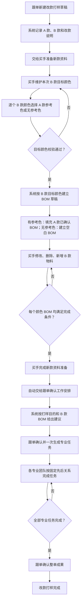
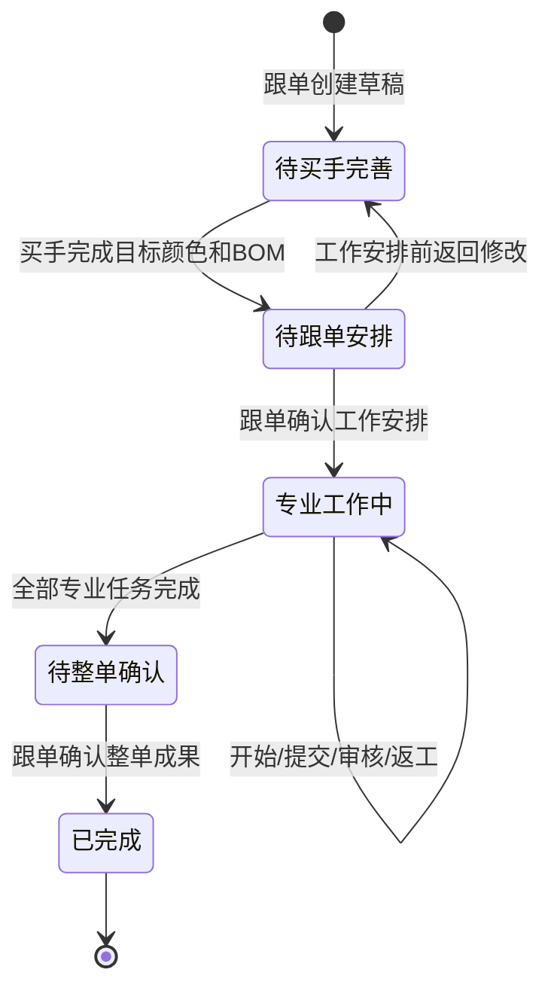
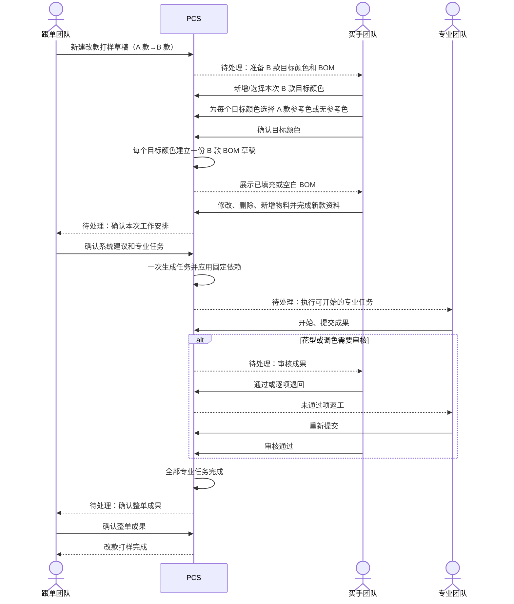

# PCS 改款打样目标颜色、BOM 与团队分步调整方案

> 本文是对《PCS 生产工程管理完整调整方案》在“改款打样”范围内的 V4.1 专项补充。本文重点解决：目标颜色不能自定义、BOM 建立时点错误、不同团队工作混在同一详情页、列表“列设置”位置不符合标准列表习惯等问题。

| 文档信息 | 内容 |
| --- | --- |
| 文档版本 | V4.1 |
| 文档日期 | 2026-08-12 |
| 文档状态 | 当前分支已按方案实现并验证；待提交、推送和产品确认 |
| 适用系统 | 商品中心系统（PCS） |
| 适用页面 | 改款打样任务列表与详情、设计打样任务列表与详情、BOM 与价格、对应专业任务 |
| 主要角色 | 跟单团队、买手团队、各专业制作团队 |
| 当前核查分支 | `codex/pcs-engineering-v4` |
| 当前核查提交 | `f6933c301822cd5b070b4b85f053caaf3e79291a` |
| 业务优先级 | 本文在目标颜色、改款 BOM 和详情分步方面优先于 V4.0 相关章节 |

---

## 1. 本次调整结论

本次不是简单把现有详情页切成几个 Tab，而是要纠正改款打样的业务顺序：

1. 跟单先建立“基于 A 款做成 B 款”的改款打样草稿。
2. 买手先定义这次真正要做的 B 款颜色；B 款颜色数量与 A 款无须相同。
3. 买手再为每个 B 款颜色选择是否参考 A 款某个颜色。
4. 系统根据已确认的 B 款颜色建立一一对应的 B 款 BOM 草稿。
5. 有参考颜色时，系统把该 A 款颜色的已确认 BOM 作为填充起点；无参考颜色时建立空白 BOM。
6. 买手可对 B 款 BOM 中的物料进行修改、删除和新增，最终结果只归属于 B 款。
7. 买手完成“新款资料准备”后，系统自动交给跟单确认本次工作安排。
8. 跟单确认后一次性生成专业任务，各专业团队分别在自己的任务中推进。
9. 所有专业任务完成后，再由跟单确认整张改款打样任务成果。
10. 页面以“当前应由哪个团队完成哪一步”为主线，不再把所有团队的操作平铺在一张长页面中。

顶部步骤建议统一为：

```text
新款资料准备（买手） → 工作安排（跟单） → 专业工作（各专业团队） → 整单确认（跟单）
```

“新款资料准备”内部包含两个紧密相连的子页签：

```text
目标颜色与参考色 → BOM 与价格
```

这样既能体现先后顺序，又不会为了同一买手团队的连续工作制造两个多余的团队交接节点。

---

## 2. 当前代码事实与问题定位

### 2.1 当前实际执行顺序

当前代码中的实际顺序是：

1. 新建改款打样草稿。
2. 创建草稿时立即读取 B 款当前有效 SKU 的颜色。
3. 按这些既有颜色立即建立 BOM 草稿版本。
4. 详情页再次读取 B 款当前有效 SKU 颜色，固定生成颜色对照行。
5. 买手只能给已有 B 款颜色选择 A 款参考颜色，不能新增、删除或重新定义本次 B 款颜色。
6. 颜色确认后，再从 A 款参考 BOM 生成物料处理行。
7. 物料确认后写入之前已经建立的 B 款 BOM 草稿。
8. 跟单确认工作安排并生成专业任务。

### 2.2 当前实现位置

| 当前能力 | 当前实现位置 | 当前行为 |
| --- | --- | --- |
| 改款草稿建立 | `src/data/pcs-engineering-master-sampling.ts` 的草稿建立逻辑 | 草稿建立时立即调用 BOM 建立能力 |
| B 款颜色来源 | `getEngineeringIndependentTargetColorGroups` | 直接按 B 款现有有效 SKU 颜色分组 |
| 颜色确认 | `confirmEngineeringIndependentColorMappings` | 要求提交行数与现有 B 款颜色组数量完全相等 |
| 物料转换 | `confirmEngineeringIndependentMaterialConversions` | 把 A 款参考物料转换后写入已存在的 B 款 BOM 草稿 |
| BOM 草稿建立 | `createEngineeringBomVersionsForOwner` | 按目标款现有颜色建立版本，并可能引用目标款自身同色历史 BOM |
| 详情页面 | `src/pages/pcs-independent-sampling.ts` | 颜色、物料、BOM、工作安排、专业任务、整单成果纵向平铺 |
| 列设置 | `renderStandardListPage` 的 `primaryActionsHtml` | 与“新建改款打样”一起放在页面顶部 |
| 列表组件能力 | `src/components/ui/list-page.ts` 的 `listActionsHtml` | 已支持把列表动作放到数据列表表头最右侧，但当前页面未使用 |

### 2.3 当前主要问题

#### 问题一：把“B 款现有颜色”误当成“本次改款要做的颜色”

B 款档案中已有几个颜色，不代表本次改款打样必须做这几个颜色。当前实现直接读取档案颜色，导致买手只能做颜色对应，不能定义这次真正要打样的颜色范围。

#### 问题二：BOM 建立得太早

BOM 应当在目标颜色明确后再按颜色建立。当前在任务草稿刚创建时就建立 BOM，容易出现：

- 后来增加的颜色没有对应 BOM；
- 后来减少的颜色仍残留无用 BOM；
- 页面显示的颜色与 BOM 版本数量不一致；
- 目标颜色尚未确认，系统已经制造出看似正式的业务数据。

#### 问题三：参考 A 款与复制 B 款历史事实混用

改款任务已经明确“基于 A 款做成 B 款”，因此物料参考必须来自买手明确选择的 A 款颜色。当前 BOM 建立能力还可能按 B 款自身同色历史版本自动填充，容易让业务人员误以为物料来自 A 款，实际却来自 B 款旧版本。

#### 问题四：页面没有体现团队接力

买手、跟单、专业团队和整单确认的内容全部在一页纵向展开。业务人员看到了所有区块，却无法一眼判断：

- 现在轮到哪个团队；
- 当前团队只需要完成什么；
- 什么条件下才能进入下一步；
- 已完成步骤是否还允许修改；
- 后续专业任务在哪里推进。

#### 问题五：列表动作位置不统一

“列设置”属于数据表格自身的操作，应放在数据列表表头最右侧。当前它与“新建改款打样”并列放在页面标题区，既占空间，也没有表达它只影响下方列表。

---

## 3. 调整范围与非范围

### 3.1 本次必须调整

1. 改款打样列表的“列设置”位置。
2. 改款打样草稿建立后的详情步骤结构。
3. B 款目标颜色的新增、编辑、移除和本次适用范围确认。
4. A 款参考颜色与 B 款目标颜色的对应规则。
5. 目标颜色确认后再建立 B 款 BOM 草稿。
6. 参考 A 款 BOM 自动填充 B 款 BOM 的规则。
7. B 款 BOM 的物料修改、删除、新增和来源追溯。
8. 买手完成后自动交给跟单，跟单完成后生成专业任务。
9. 详情页当前步骤、当前团队、完成条件、下一步去向。
10. 列表“当前需处理的团队”筛选与详情步骤保持一致。
11. Mock 数据和测试案例覆盖颜色比 A 款少、相同、更多以及无参考颜色。
12. 改款打样、设计打样的列表和详情继续与制版等专业任务页面使用同一页面骨架。
13. 本次新增或重组的所有图片、纸样和附件入口继续执行真实上传门禁。
14. 总体设计、实施计划、需求追踪矩阵和验收文档同步更新。

### 3.2 本次明确不调整

1. 不改变“必须先有 A 款和 B 款档案，且两者不能是同一 SPU”的创建门禁。
2. 不把设计打样强行增加 A 款参考关系；设计打样仍以目标 B 款为起点。
3. 不调整工程主单固定任务及固定依赖结构。
4. 不调整花型、调色等专业任务已有的审核与返工规则。
5. 不增加审批流、抢单、接单或预先指定个人负责人。
6. 不新增“待本团队处理”等团队专属业务状态，只保留一个“当前需处理的团队”筛选。
7. 不处理历史老任务迁移，也不展示任何老任务兼容文案。
8. 不把打样阶段 BOM 直接变成正式技术包版本；正式版本仍在技术包审核通过并生效时形成。

---

## 4. 与当前相比，具体改动在哪里

| 编号 | 当前 | 调整后 | 业务结果 |
| --- | --- | --- | --- |
| ADJ-028 | “列设置”与“新建改款打样”并列在页面标题区 | “新建改款打样”保留页面右上；“列设置”移到数据列表表头最右侧 | 操作归属清晰 |
| ADJ-029 | 草稿建立时按 B 款现有 SKU 颜色立即建立 BOM | 草稿建立时只建立改款打样业务单，不建立颜色 BOM | 避免无效空壳数据 |
| ADJ-030 | B 款颜色固定来自 B 款现有 SKU | 买手维护“本次改款目标颜色”，可新增、选用或移除本次不做的颜色 | 颜色数量可少、可多、可相同 |
| ADJ-031 | 每个 B 款现有颜色只能选择 A 款参考色 | 每个本次目标颜色可选 A 款参考色，也可选择“无参考颜色” | 支持一对多和全新颜色 |
| ADJ-032 | 颜色行数必须等于 B 款当前 SKU 颜色数 | 至少保留一个目标颜色；名称不重复；确认时形成明确的本次目标颜色清单 | 颜色范围由业务确认 |
| ADJ-033 | BOM 在目标颜色确认前已经存在 | 买手确认目标颜色后，系统按每个目标颜色建立一份 BOM 草稿 | 颜色与 BOM 严格一一对应 |
| ADJ-034 | BOM 可能引用 B 款自身同色历史版本 | 有 A 款参考色时，只从该 A 款颜色最近一份已完成且已确认 BOM 填充；无参考色时建立空白 BOM | 来源可理解、可追溯 |
| ADJ-035 | A 款物料通过转换表写入 B 款，新增物料入口割裂 | B 款 BOM 直接支持修改、删除、新增；从 A 款带入的行保留来源和处理说明 | 最终 BOM 真正由买手维护 |
| ADJ-036 | 详情所有区块纵向平铺 | 改成四个团队步骤；当前步骤只展示当前团队需要完成的内容 | 页面短、职责清楚 |
| ADJ-037 | DRAFT 状态不能区分当前轮到买手还是跟单 | 在不增加复杂业务状态的前提下，根据事实显示“待买手完善／待跟单安排” | 列表和详情可明确当前团队 |
| ADJ-038 | 已完成和未来工作仍与当前内容同时出现 | 已完成步骤可查看，未来步骤锁定；只有当前步骤可操作 | 避免跨步骤误操作 |
| ADJ-039 | Mock 只验证预设 B 款颜色映射 | 增加 A 两色→B 一色、A 两色→B 三色、一对多、无来源色等完整案例 | 能真实验收业务设计 |
| ADJ-040 | 改款／设计打样与制版等专业任务页面虽已部分统一，但本次详情重组可能再次形成另一套页面 | 列表标题、筛选、表头、表格、分页，以及详情头部、当前动作、内容卡片、操作记录均沿用专业任务统一骨架 | 页面体系保持一致 |
| ADJ-041 | 既有真实上传门禁可能在新步骤和新表单中被遗漏 | 新增或迁移的所有图片、纸样和附件入口必须复用真实上传能力，并重新验证保存、预览、下载和失败阻断 | 防止页面重组后能力倒退 |

以上调整均为新需求或受本次重组影响的重新验收需求，不得把原 V4.0 中 ADJ-005～ADJ-007、ADJ-026～ADJ-027 的“已验证”直接当作本次已经完成。实施前必须在追踪矩阵中把受影响条目标记为“实施中”或以 ADJ-028～ADJ-041 新条目追踪。

---

## 5. 调整后的业务对象与事实归属

### 5.1 核心对象

| 业务对象 | 说明 | 谁维护 | 归属于谁 |
| --- | --- | --- | --- |
| A 款 | 本次改款的参考款式 | 只读 | A 款商品档案 |
| B 款 | 本次最终做成的款式 | 商品档案按既有权限维护 | B 款商品档案 |
| 本次目标颜色 | 本次改款打样实际要做的 B 款颜色清单 | 买手团队 | 当前改款打样任务；确认后同步到 B 款颜色／SKU 范围 |
| 参考颜色 | 某个 B 款目标颜色参考的 A 款颜色，可为空 | 买手团队 | 当前改款打样任务 |
| B 款 BOM 草稿 | 每个目标颜色的一份打样用料与价格草稿 | 买手团队 | B 款、当前改款打样任务 |
| 工作安排 | 本次需要生成哪些专业任务 | 跟单团队 | 当前改款打样任务 |
| 专业任务 | 制版、销售展示样衣、花型、调色等实际工作 | 对应专业团队 | B 款、当前改款打样任务 |
| 整单成果 | 本次改款打样最终完成说明 | 跟单团队 | 当前改款打样任务 |

### 5.2 唯一事实源

1. A 款颜色与 A 款已确认 BOM 只作参考，不得被改写。
2. 买手未确认前，“本次目标颜色”是当前任务的工作草稿，不立即改写 B 款正式档案。
3. 买手确认后，系统把本次目标颜色与 B 款现有颜色／SKU 范围建立明确关联。
4. B 款已有颜色可以直接选入本次目标颜色。
5. 新增颜色使用 B 款现有尺码范围生成对应颜色的 SKU 范围；B 款尚无尺码范围时，阻止完成并提示先完善 B 款尺码／SKU。
6. 从本次任务移除某个颜色，只表示“本次不做”，不得删除 B 款档案中已经存在的历史颜色或 SKU。
7. B 款每个已确认目标颜色只能有一份当前任务 BOM 草稿。
8. 正式技术包生效后形成正式 BOM 快照；打样任务中的 BOM 始终是打样阶段工作版本。

---

## 6. 目标业务流程



---

## 7. 页面步骤与团队分工

### 7.1 顶部步骤

详情页顶部使用四步步骤条：

| 步骤 | 页面名称 | 当前处理团队 | 主要内容 | 完成后去向 |
| --- | --- | --- | --- | --- |
| 1 | 新款资料准备 | 买手团队 | 目标颜色、A 款参考色、B 款 BOM 与价格 | 自动交给跟单团队 |
| 2 | 工作安排 | 跟单团队 | 查看系统建议，确认本次专业任务 | 一次生成任务并交给各专业团队 |
| 3 | 专业工作 | 各专业团队 | 在独立专业任务中开始、提交、审核、返工 | 全部完成后交给跟单团队 |
| 4 | 整单确认 | 跟单团队 | 确认整张改款打样成果 | 改款打样完成 |

### 7.2 步骤展示规则

1. 当前步骤使用蓝色主状态，显示“当前需处理的团队”和当前主动作。
2. 已完成步骤显示完成标记，可点击查看，但默认只读。
3. 未到达步骤显示锁定，不允许提前填写或提交。
4. 页面首次进入时默认打开当前步骤，不停留在上一次随意点开的页签。
5. 步骤条不是四个互不相关的页面 Tab；它必须受业务完成条件控制。
6. 专业工作可能同时由多个团队并行处理，此时当前团队显示多个团队，列表团队筛选命中其中任一团队。
7. 不预先显示具体个人。真实动作发生后，在操作记录中显示操作人和时间。

### 7.3 “新款资料准备”内部结构

由于目标颜色和 BOM 都由买手连续完成，不再拆成两个顶层团队步骤，而是在第 1 步内部使用两个子页签：

1. `目标颜色与参考色`
2. `BOM 与价格`

目标颜色尚未确认时，“BOM 与价格”页签可见但锁定，并提示：

> 请先确认本次要做的 B 款颜色。

目标颜色确认后，系统建立 BOM 草稿并自动进入“BOM 与价格”。

---

## 8. 第一步：目标颜色与参考色

### 8.1 页面结构

页面顶部并排展示：

- A 款：真实图片、SPU、款式名称、可参考颜色；
- B 款：真实图片、SPU、款式名称、本次目标颜色数量。

颜色编辑表：

| 字段 | 是否必填 | 说明 |
| --- | --- | --- |
| B 款目标颜色 | 是 | 买手可输入新颜色名称，或从 B 款已有颜色中选择 |
| 颜色来源 | 是 | 选择“参考 A 款颜色”或“无参考颜色” |
| A 款参考颜色 | 条件必填 | 选择参考时必须选择 A 款具体颜色 |
| 适用尺码／SKU | 是 | 默认继承 B 款现有尺码范围，可调整本次适用范围 |
| 操作 | — | 新增一行、移除本次颜色 |

页面主动作：`确认目标颜色并建立 BOM`

### 8.2 颜色数量规则

1. B 款目标颜色数量不受 A 款颜色数量限制。
2. A 款两色可以只做 B 款一色。
3. A 款两色可以做 B 款三色或更多颜色。
4. 一个 A 款颜色可以被多个 B 款颜色参考。
5. 某个 A 款颜色可以本次完全不被使用。
6. 某个 B 款颜色可以选择“无参考颜色”，从空白 BOM 开始。
7. 至少保留一个 B 款目标颜色。
8. 同一任务中 B 款目标颜色名称去除首尾空格后不得重复；英文大小写视为同名。
9. 空颜色名、重复颜色名、未选择适用尺码／SKU 时不得确认。
10. 不能根据颜色名称相似度、排序或中英文翻译自动建立参考关系。

### 8.3 颜色确认后的处理

买手点击“确认目标颜色并建立 BOM”时，系统一次完成：

1. 校验目标颜色、参考关系和适用 SKU。
2. 保存本次目标颜色清单和确认人、确认时间。
3. 每个目标颜色建立一份 B 款 BOM 草稿。
4. 有 A 款参考色时，记录具体 A 款 SPU、颜色和参考 BOM 版本。
5. 无 A 款参考色时，建立空白 B 款 BOM 草稿。
6. 自动切换到“BOM 与价格”子页签。

上述操作必须整体成功或整体失败，不能出现颜色已确认但只建立了部分 BOM 的情况。

### 8.4 修改与锁定

1. 买手尚未点击“完成新款资料准备”前，可以自由修改目标颜色和 BOM 草稿。
2. 买手已经完成、但跟单尚未确认工作安排时，如发现需要调整，由跟单点击“退回买手修改”并填写简短原因；系统把当前团队重新交给买手。
3. 新增目标颜色时，为新增颜色建立新的 BOM 草稿。
4. 移除目标颜色时，只删除当前任务下仍为草稿且尚未进入专业工作的 BOM；不得删除 B 款历史档案和正式版本。
5. 修改参考颜色不会自动覆盖买手已经手工修改过的 B 款 BOM。
6. 如需重新按新参考色填充，买手必须明确点击“重新按参考色生成”，系统二次确认后才重建该颜色草稿。
7. 跟单确认工作安排并生成专业任务后，目标颜色范围锁定；页面不再允许新增、移除或改名。

---

## 9. 第一步：BOM 与价格

### 9.1 BOM 建立时点

调整后，不再在“创建改款打样草稿”时建立 BOM。只有买手确认本次目标颜色后，才按颜色建立 BOM。

一一对应规则：

```text
1 个已确认 B 款目标颜色 = 1 份当前改款任务的 B 款 BOM 草稿
```

### 9.2 初始物料填充

| 目标颜色情况 | 初始 BOM |
| --- | --- |
| 参考 A 款某颜色，且该颜色存在已完成且已确认 BOM | 复制该参考 BOM 的物料行作为 B 款待确认草稿 |
| 参考 A 款某颜色，但没有可用 BOM | 建立空白 BOM，并提示“参考颜色暂无可用 BOM，请手工添加 B 款物料” |
| 选择无参考颜色 | 建立空白 BOM |
| 多个 B 款颜色参考同一个 A 款颜色 | 分别建立独立 BOM 草稿，后续修改互不影响 |

系统不得：

1. 因 B 款颜色名称与 B 款历史颜色相同而自动复制 B 款旧 BOM。
2. 因 A、B 颜色名称相同而自动判定参考关系。
3. 修改或覆盖 A 款 BOM。
4. 把 A 款正式 BOM 直接改名后当作 B 款正式 BOM。

### 9.3 买手可执行的操作

对每个 B 款目标颜色，买手可以：

1. 修改从 A 款带入的物料行。
2. 删除 B 款本次不使用的物料行。
3. 从物料档案新增新的物料行。
4. 替换为另一个物料 SKU。
5. 调整单位用量、打样数量、损耗率、印花要求、染色要求、水溶要求和备注。
6. 查看该行是否来自 A 款参考 BOM；无来源的新行显示“B 款新增”。
7. 在不同 B 款颜色 BOM 之间切换，当前颜色必须显著高亮。

所有物料图片必须是真实对应图片；缩略图可点击查看大图。所有文件类成果必须使用真实上传，不得用文件名或地址冒充。

### 9.4 BOM 行来源记录

从 A 款参考 BOM 带入的每行至少保留：

- A 款 SPU；
- A 款颜色；
- A 款 BOM 版本；
- A 款物料编码；
- 本次处理方式；
- B 款目标物料；
- 买手确认人；
- 确认时间。

B 款新增物料不要求伪造 A 款来源，明确显示“B 款新增”。

### 9.5 完成条件

买手点击“完成新款资料准备”时，必须同时满足：

1. 至少一个已确认目标颜色。
2. 每个目标颜色恰好一份 BOM 草稿。
3. 每份 BOM 至少一条有效物料。
4. 所有物料来自物料档案。
5. 所有物料均有有效标准单价。
6. 单位用量、打样数量、损耗率和单位填写完整并通过数值校验。
7. 需要印花或染色的物料已明确对应要求。
8. 不存在未保存或处理中的真实上传。

完成后记录买手实际操作人和时间，并自动把当前需处理团队改为“跟单团队”。此时 BOM 仍是打样阶段草稿，不产生正式技术包版本。

---

## 10. 第二步：工作安排

### 10.1 跟单看到的内容

跟单进入本步骤时，页面只展示：

1. 本次改款目的和 A→B 款式摘要。
2. 买手已确认的 B 款目标颜色数量。
3. 每个颜色 BOM 的完成状态。
4. 系统建议的专业工作。
5. 每项专业工作的负责团队、需要先完成的工作和建议原因。

### 10.2 系统建议规则

1. 基码纸样、销售展示样衣根据改款目的和款式事实建议。
2. BOM 存在印花／花型要求时建议花型任务。
3. BOM 存在纱线染色要求时建议调色任务（纱线）。
4. BOM 存在面料染色要求时建议调色任务（面料）。
5. 销售展示样衣依赖基码纸样；选择后置工作时，系统自动补齐缺少的固定前置工作。
6. 依赖关系已由业务确认，跟单不能调整依赖连线或顺序。

### 10.3 跟单完成动作

跟单点击“确认工作安排并生成任务”时：

1. 再次校验买手步骤已经完成。
2. 至少选择一项专业任务。
3. 销售展示样衣任务必须存在。
4. 固定前置任务自动补齐。
5. 专业任务一次性生成，重复点击不得重复生成。
6. 当前步骤转为“专业工作”。
7. 当前需处理团队根据可开始的专业任务自动计算，可能同时包含多个团队。

---

## 11. 第三步：专业工作

### 11.1 详情页只做汇总和跳转

改款打样详情不在本步骤内重复实现制版、花型、调色等专业工作表单，只展示专业任务表格：

| 列 | 内容 |
| --- | --- |
| 专业工作 | 基码纸样、销售展示样衣、花型、调色等业务名称 |
| 当前团队 | 当前应该处理该任务的团队 |
| 当前动作 | 开始制作、提交成果、买手审核、返工等 |
| 需要先完成 | 固定前置工作名称；无前置显示“无” |
| 完成后去向 | 下一团队或下一业务步骤 |
| 计划／实际 | 计划完成时间和已发生的开始、提交、审核时间 |
| 状态 | 待前置、待开始、进行中、待审核、返工、已完成 |
| 操作 | 进入对应专业任务详情 |

### 11.2 团队与实际操作人

1. 任务建立时只确定团队，不要求先选择个人。
2. 团队成员点击开始、提交或审核后，系统记录该动作的真实操作人。
3. 花型和调色成果仍由买手审核，未通过项进入返工。
4. 多项专业任务可以并行；当前需处理团队可以同时有多个。
5. 所有专业任务完成后，系统自动进入“整单确认”，并把当前团队改为跟单团队。

---

## 12. 第四步：整单确认

跟单查看：

- 最终 B 款及目标颜色；
- 各颜色 BOM 状态；
- 全部专业任务及成果状态；
- 真实样衣图片、纸样和其他附件；
- 各团队实际操作记录。

跟单填写本次成果版本和简要成果说明，点击“确认整单成果”。系统必须在全部专业任务完成后才允许提交。完成后，改款打样状态变为“已完成”，所有步骤只读。

---

## 13. 业务状态与步骤状态

### 13.1 状态设计原则

不新增一大串团队专属业务状态。保留改款打样整单状态，并根据已发生的业务事实推导页面步骤和当前团队。

| 整单事实 | 页面显示状态 | 当前步骤 | 当前团队 |
| --- | --- | --- | --- |
| 草稿已建，买手资料未完成 | 待买手完善 | 新款资料准备 | 买手团队 |
| 买手资料已完成，工作安排未确认 | 待跟单安排 | 工作安排 | 跟单团队 |
| 专业任务已生成且未全部完成 | 进行中 | 专业工作 | 当前可处理任务对应团队 |
| 专业任务全部完成，整单未确认 | 待整单确认 | 整单确认 | 跟单团队 |
| 整单已确认 | 已完成 | 已完成 | 无 |

### 13.2 状态图



返回修改只允许发生在专业任务尚未生成前；不建立审批流，只记录跟单发起、原因、时间和买手重新完成时间。

---

## 14. 团队交接时序



---

## 15. 列表页调整

### 15.1 页面动作位置

页面标题区：

- 左侧：`改款打样任务`
- 右侧：`新建改款打样`

筛选区：

- 当前需处理的团队；
- 其他已确认的必要筛选。

数据列表表头：

- 左侧：`共 N 条`
- 右侧：`列设置`

### 15.2 列设置行为

1. 点击后仍使用现有列设置能力。
2. 列显示、顺序、冻结和每页条数继续按路由保存。
3. 操作列固定在最右侧。
4. 移动按钮不得改变现有列设置数据和持久化规则。
5. 设计打样列表同步使用相同位置，保证两类独立打样列表样式一致。

### 15.3 团队筛选

只保留一个筛选条件：`当前需处理的团队`。

筛选值来自当前记录实际可处理团队：

- 待买手完善：买手团队；
- 待跟单安排／待整单确认：跟单团队；
- 专业工作中：所有当前可处理专业任务对应团队；
- 已完成：无当前团队，可在“全部”中查看。

不新增团队专属状态、快捷 Tab 或“我负责的任务”模块。

---

## 16. 详情页目标结构

```text
┌─────────────────────────────────────────────────────────┐
│ 改款打样 · ES-R-xxx   状态   A 款 → B 款   返回列表     │
│ 当前需处理的团队：买手团队   当前动作：准备新款资料      │
├─────────────────────────────────────────────────────────┤
│ ① 新款资料准备  →  ② 工作安排  →  ③ 专业工作  →  ④ 整单确认 │
├─────────────────────────────────────────────────────────┤
│ 当前步骤内容                                             │
│   [目标颜色与参考色] [BOM 与价格]                        │
│                                                         │
│ 只展示当前团队需要完成的表单、门禁和主动作               │
├─────────────────────────────────────────────────────────┤
│ 操作记录                                                 │
└─────────────────────────────────────────────────────────┘
```

页面不再同时展开颜色对照、物料转换、BOM、工作安排、专业任务和整单确认六个大区块。

### 16.1 与制版等专业任务页面保持一致

改款打样和设计打样可以有自己的业务字段与步骤，但不得再造另一套页面视觉和基础交互。统一规则如下：

| 页面部位 | 统一要求 |
| --- | --- |
| 列表标题区 | 标题在左，页面级“新建”动作在右 |
| 筛选区 | 使用与制版任务一致的标准筛选容器；改款／设计只增加必要业务筛选 |
| 数据列表 | 使用相同的表头密度、图片与款式组合、状态标签、操作列和分页 |
| 列设置 | 位于数据列表表头最右侧 |
| 详情头部 | 任务名称、任务号、状态、款式摘要、返回列表位置一致 |
| 当前动作 | 在首屏明确显示当前团队、当前动作和唯一主按钮 |
| 内容卡片 | 使用同一圆角、间距、标题层级和空状态，不使用另一套特殊卡片视觉 |
| 操作记录 | 时间、操作团队／操作人、动作、结果使用同一表格／列表结构 |
| 图片与文件 | 使用同一真实图片、大图和真实上传能力 |

业务差异必须保留：

1. 改款打样展示 A 款→B 款、目标颜色与参考色、B 款 BOM。
2. 设计打样只展示目标 B 款，从空白或目标款既有资料开始，不伪造 A 款。
3. 制版任务仍围绕纸样成果；独立打样仍围绕整张打样任务和专业任务组合。

统一的是页面骨架和交互习惯，不是把三类任务的业务内容做成完全相同。

---

## 17. 实现调整方案

### WP0：同步权威文档和追踪关系

**业务目标**：先把本次新口径写入权威文档，避免按 V4.0 已验证条目误判完成。

**调整位置**：

- `docs/product-design/PCS生产工程管理总体设计文档.md`
- `docs/product-design/PCS生产工程管理实施计划.md`
- `docs/product-design/PCS生产工程管理需求追踪与交付矩阵.md`
- 本文

**修改**：

1. 总体设计补充“本次目标颜色”对象及确认后建立 BOM 的规则。
2. 实施计划补充 ADJ-028～ADJ-041 对应工作包。
3. 追踪矩阵将本次条目标记为“待实施”，不得继承旧证据。
4. 实施完成后回填真实文件、自动化证据和页面证据。

**完成条件**：所有新条目可以从设计正向追踪到工作包，也能从实现反向追踪到需求编号。

### WP1：调整数据对象和草稿建立时点

**业务目标**：让“本次目标颜色”成为任务内真实对象，并停止创建草稿时提前制造 BOM。

**调整位置**：

- `src/data/pcs-engineering-master-types.ts`
- `src/data/pcs-engineering-master-sampling.ts`

**修改**：

1. 增加本次目标颜色记录：颜色标识、名称、来源方式、A 款参考颜色、适用 SKU、确认人和确认时间。
2. 增加买手资料完成事实，不新增冗余的第二套整单状态机。
3. 草稿建立逻辑不再调用 `createEngineeringBomVersionsForOwner`。
4. `getEngineeringIndependentTargetColorGroups` 不再直接把 B 款现有 SKU 颜色当作本次目标颜色；改为读取当前任务已维护／已确认颜色。
5. 颜色确认不再要求行数等于 B 款现有颜色数，改为校验本次目标颜色规则。
6. 当前步骤和当前团队由颜色、BOM、工作安排和专业任务事实推导。

**完成条件**：创建草稿后 BOM 数量为 0；买手可以创建与 A、B 款既有颜色数量不同的本次目标颜色清单。

### WP2：建立目标颜色与 B 款档案的关联

**业务目标**：自定义颜色不能成为脱离 B 款商品档案的孤立文字。

**调整位置**：

- B 款款式／SKU 档案现有事实源
- `src/data/pcs-engineering-master-sampling.ts`

**修改**：

1. 已有 B 款颜色直接绑定其有效 SKU。
2. 新颜色使用 B 款现有尺码范围建立对应颜色 SKU。
3. B 款无尺码范围时阻断确认，并提供进入款式档案的业务入口。
4. 本次移除已有颜色只标记“不在本次范围”，不删除档案。
5. 保存动作防止重复颜色、重复 SKU 和部分成功。

**完成条件**：每个已确认目标颜色都有明确 B 款 SKU 范围，BOM 不使用空的或虚构的适用 SKU。

### WP3：按确认后的目标颜色建立和维护 BOM

**业务目标**：颜色与 BOM 一一对应，A 款只作明确参考，B 款 BOM 可由买手完整维护。

**调整位置**：

- `src/data/pcs-engineering-bom-repository.ts`
- `src/data/pcs-engineering-master-sampling.ts`

**修改**：

1. 增加按“任务已确认目标颜色”建立／对账 BOM 草稿的能力。
2. 明确传入 A 款参考 BOM 版本，不再隐式搜索 B 款自身同色历史 BOM。
3. 一个颜色失败时整批回滚，不留下部分 BOM。
4. 新增颜色建立新草稿；移除颜色只清理当前任务仍可编辑的草稿。
5. 从 A 款带入的行保留来源；买手新增的行标记为 B 款新增。
6. 已被买手修改的草稿不因参考色变化自动覆盖。
7. 买手可以直接在 B 款 BOM 中增加、修改、删除物料。
8. 延用标准单价、权限、公式和正式技术包快照门禁。

**完成条件**：确认 N 个目标颜色后恰好得到 N 个 B 款 BOM 草稿；每个版本颜色、SKU、来源和物料均正确。

### WP4：重组列表和详情页面

**业务目标**：列表动作归位；详情按团队步骤展示，不再纵向堆叠。

**调整位置**：

- `src/pages/pcs-independent-sampling.ts`
- `src/main-handlers/pcs-handlers.ts`
- 现有标准列表及步骤／页签 UI 能力

**修改**：

1. 列表页把列设置从 `primaryActionsHtml` 移入 `listActionsHtml`。
2. “新建改款打样”保留在页面标题区右侧。
3. 详情页增加四步步骤条和当前团队／当前动作。
4. 第一步增加目标颜色编辑器及 BOM 颜色页签。
5. 当前步骤局部更新，避免每次输入整页重绘。
6. 已完成步骤只读，未来步骤锁定。
7. 专业工作只显示任务表格和详情入口。
8. 设计打样列表同步调整列设置位置；详情继续沿用相同页面骨架，但不展示 A 款参考色。
9. 新步骤中的图片、纸样和附件入口全部复用真实上传、预览和下载能力。

**完成条件**：在 1366×768 下，首屏能看到任务摘要、四步步骤和当前步骤主内容；点击、输入和页签切换无整页闪烁。

### WP5：工作安排与团队自动接力

**业务目标**：买手完成后自动交给跟单，跟单确认后自动交给专业团队。

**调整位置**：

- `src/data/pcs-engineering-master-sampling.ts`
- 对应专业任务投影和处理器

**修改**：

1. 工作安排确认必须校验买手资料完成事实。
2. 系统建议只读取已确认 B 款 BOM 的印花／染色事实。
3. 专业任务仍一次生成并使用固定依赖。
4. 当前团队从真实可执行动作推导，支持多个并行团队。
5. 记录每次团队交接和实际操作人。
6. 所有专业任务完成后自动进入整单确认。

**完成条件**：无需手工改状态或选个人，正常完成当前团队动作后能自动出现下一团队待办。

### WP6：Mock、自动化和浏览器验收

**业务目标**：用真实案例证明设计成立，而不是只验证代码分支存在。

**调整位置**：

- 改款打样 Mock／种子数据
- `tests/pcs-independent-sampling.spec.ts`
- `tests/pages.spec.ts`
- `tests/pcs-engineering-v4-contract.spec.ts`
- 原型审查记录

**修改**：

1. 增加少于、等于、多于 A 款颜色数的 B 款案例。
2. 增加一对多和无参考色。
3. 验证草稿建立时 BOM 为 0，颜色确认后 BOM 数量一一对应。
4. 验证 A 款 BOM 不被修改。
5. 验证列设置位置和步骤门禁。
6. 验证不同团队自动接力、并行团队筛选和真实操作人记录。
7. 使用真实款式／物料图片验收缩略图、大图和失败状态。
8. 对照制版任务检查改款／设计列表与详情的标题、筛选、表格、分页、当前动作和操作记录骨架。
9. 对新步骤涉及的所有图片、纸样和附件入口重放真实上传成功与失败场景。

**完成条件**：专项自动化、指定浏览器场景、列表治理和原型治理全部通过，并回填当前版本证据。

---

## 18. 数据与 Mock 场景

至少准备以下改款案例：

| 案例 | A 款颜色 | B 款本次目标颜色 | 参考关系 | 当前步骤 |
| --- | --- | --- | --- | --- |
| R-01 少颜色 | 黑、白 | 藏青 | 藏青参考 A 黑 | 待买手完善 |
| R-02 多颜色 | 黑、白 | 红、蓝、米白 | 红／蓝参考 A 黑，米白无参考 | 待跟单安排 |
| R-03 等量但不按名称 | 黑、白 | 咖啡、卡其 | 买手分别选择参考，不自动匹配 | 专业工作中 |
| R-04 无来源色 | 黑 | 荧光绿 | 无参考，从空白 BOM 新增物料 | 专业工作中 |
| R-05 多团队并行 | 黑、白 | 红、蓝 | BOM 同时有花型和面料调色 | 专业工作中，花型团队＋染厂 |
| R-06 已完成 | 黑 | 红 | 全部专业工作完成 | 已完成，只读 |

每个案例必须具备真实款式图片、真实物料图片、可理解的物料组合、至少一个有效 BOM 版本和完整操作记录。不得用完全相同的两条 Mock 改个编号冒充不同业务场景。

---

## 19. 完整验收场景

### 19.1 列表布局

1. 打开改款打样列表。
2. 页面标题区右侧只显示“新建改款打样”等页面级动作。
3. 数据列表表头右侧显示“列设置”。
4. 列设置仍能显示、隐藏、排序、冻结列并保存。
5. 刷新后列设置和每页条数按既有规则保留。
6. 设计打样列表同样符合上述布局。

### 19.2 新建草稿

1. 选择不同的 A 款和 B 款并创建草稿。
2. 草稿建立成功后专业任务数为 0。
3. 草稿建立成功后 BOM 数量为 0。
4. 当前步骤为“新款资料准备”，当前团队为买手团队。
5. 工作安排、专业工作和整单确认处于锁定状态。

### 19.3 B 款颜色比 A 款少

1. A 款有黑、白两个颜色。
2. 买手只新增一个 B 款目标色“藏青”。
3. 选择参考 A 款黑色。
4. 确认后只建立一份藏青 BOM，不建立黑、白 BOM。
5. A 款黑、白颜色和 BOM 均不改变。

### 19.4 B 款颜色比 A 款多

1. A 款有黑、白两个颜色。
2. 买手建立 B 款红、蓝、米白三个目标色。
3. 红、蓝均参考 A 黑；米白选择无参考颜色。
4. 确认后得到三份独立 BOM。
5. 红、蓝初始物料相同但后续修改互不影响。
6. 米白为空白 BOM，买手能新增物料。

### 19.5 颜色输入门禁

1. 颜色全部删除时不能确认。
2. 空名称不能确认。
3. `Black` 与 ` black ` 视为重复，不能确认。
4. 选择参考方式但未选 A 款颜色时不能确认。
5. 新颜色没有适用尺码／SKU 时不能确认。
6. 错误提示说明哪里需要补充，不显示系统字段名或技术状态码。

### 19.6 BOM 自动填充与维护

1. 有可用 A 款已确认 BOM 时，B 款 BOM 自动填充对应物料。
2. 页面明确展示 A 款参考 SPU、颜色和 BOM 版本。
3. 买手能删除一条参考物料。
4. 买手能替换一条参考物料。
5. 买手能新增 A 款没有的物料。
6. 新增物料没有标准单价时被阻断。
7. 修改 B 款 BOM 不改变 A 款 BOM。
8. 切换 B 款颜色时，页面内容与选中的 BOM 版本一致。

### 19.7 买手到跟单交接

1. 任一颜色 BOM 为空时不能完成新款资料准备。
2. 所有 BOM 合格后，买手完成步骤。
3. 系统记录实际买手、完成时间和结果。
4. 当前步骤自动变为“工作安排”。
5. 当前团队自动变为跟单团队。
6. 列表使用“跟单团队”筛选可以找到该任务，使用“买手团队”筛选不再出现。

### 19.8 跟单到专业团队交接

1. 跟单看到系统根据 BOM 建议的花型／调色任务。
2. 跟单不能调整固定依赖。
3. 点击确认后只生成一套专业任务。
4. 重复点击不生成重复任务。
5. 当前步骤变为“专业工作”。
6. 当前团队变为当前可开始任务对应团队；并行任务时可显示多个团队。

### 19.9 专业团队到整单确认

1. 专业团队在各自任务详情推进，不在改款详情填通用成果说明。
2. 每次真实动作记录实际操作人。
3. 花型／调色未通过项返工，通过项保留。
4. 专业任务未全部完成时，整单确认锁定。
5. 全部完成后，当前团队自动变为跟单团队。
6. 跟单确认整单成果后，页面全部只读。

### 19.10 页面与交互

1. 1366×768 首屏可见任务摘要、完整步骤条和当前步骤主要内容。
2. 未来步骤不能点击进入编辑。
3. 已完成步骤可查看但不可直接修改。
4. 输入颜色、切换颜色 BOM、打开列设置时不整页闪烁。
5. 款式与物料图片都有真实缩略图，可点击查看不变形的大图。
6. 文件上传立即显示处理中、成功或失败，失败时不能推进状态。

### 19.11 改款、设计与制版页面一致性

1. 分别打开改款打样、设计打样和制版任务列表。
2. 三个列表的标题区、筛选容器、表格密度、状态标签、操作列、列设置和分页位置一致。
3. 分别打开三类任务详情。
4. 三个详情的任务头部、当前动作、内容卡片、操作记录和反馈方式一致。
5. 改款仍正确展示 A→B、目标颜色和 BOM；设计不展示 A 款；制版仍展示纸样成果。
6. 样式统一没有删除或混淆三类任务各自的业务字段。

### 19.12 真实上传回归

1. 对新步骤中出现的图片、纸样和附件入口逐一选择真实文件。
2. 正确文件显示上传中、成功状态，并可重新打开预览或下载原文件。
3. 错误类型、空文件和失败上传均显示可理解的原因，且不能推进当前步骤。
4. 页面刷新后仍能读取已保存文件事实，不能只保留一个本地文件名。
5. 款式和物料图片缺失时显示明确失败态，不用无关占位图冒充。

---

## 20. 原子需求追踪表

| 编号 | 原子需求 | 工作包 | 自动化证据 | 页面证据 | 当前状态 |
| --- | --- | --- | --- | --- | --- |
| ADJ-028 | 列设置位于数据列表表头最右侧 | WP4 | 列表页面契约 | 改款／设计列表 | 已验证 |
| ADJ-029 | 创建改款草稿时不建立 BOM | WP1 | 草稿建立专项 | 改款详情初始状态 | 已验证 |
| ADJ-030 | 买手可维护本次 B 款目标颜色，数量不依赖 A／B 已有颜色数 | WP1、WP2、WP4 | 颜色数量专项 | 目标颜色编辑页 | 已验证 |
| ADJ-031 | 每个目标颜色可选择 A 款参考色或无参考色，并支持一对多 | WP1、WP4 | 颜色映射专项 | 目标颜色编辑页 | 已验证 |
| ADJ-032 | 目标颜色校验完整且确认操作整体成功或失败 | WP1、WP2 | 输入门禁专项 | 错误提示与确认动作 | 已验证 |
| ADJ-033 | 确认 N 个目标颜色后建立 N 份 B 款 BOM 草稿 | WP3 | BOM 数量专项 | BOM 颜色页签 | 已验证 |
| ADJ-034 | 有参考色只填充明确的 A 款最近一份已确认 BOM，无参考色建立空白 BOM | WP3 | 来源选择专项 | BOM 来源摘要 | 已验证 |
| ADJ-035 | 买手可修改、删除、新增 B 款 BOM 物料且不改 A 款 | WP3、WP4 | BOM 隔离与权限专项 | BOM 编辑页 | 已验证 |
| ADJ-036 | 改款详情按四个团队步骤展示 | WP4 | 页面结构契约 | 改款详情 | 已验证 |
| ADJ-037 | 当前步骤与当前团队从业务事实推导并自动交接 | WP1、WP5 | 团队接力专项 | 列表筛选与详情头部 | 已验证 |
| ADJ-038 | 已完成步骤只读，未来步骤锁定，当前步骤可操作 | WP4、WP5 | 步骤门禁专项 | 改款详情 | 已验证 |
| ADJ-039 | Mock 与验收覆盖少色、多色、一对多、无来源和并行团队 | WP6 | Mock 场景专项 | 六个命名案例 | 已验证 |
| ADJ-040 | 改款／设计列表与详情沿用制版等专业任务统一页面骨架 | WP4、WP6 | 页面结构与列表治理 | 三类列表／详情对照 | 已验证 |
| ADJ-041 | 新步骤中的图片、纸样和附件均执行真实上传及失败阻断 | WP4、WP6 | 上传契约与持久化专项 | 上传、预览、下载和失败场景 | 已验证 |

---

## 21. 风险与防错门禁

| 风险 | 防错规则 |
| --- | --- |
| 目标颜色与 B 款 SKU 脱节 | 颜色确认时必须绑定或形成明确 B 款 SKU 范围 |
| 改参考色覆盖买手修改 | 不自动覆盖；必须明确执行“重新按参考色生成”并二次确认 |
| 删除本次颜色误删商品档案 | 只移出本次范围，不删除历史颜色／SKU |
| 部分 BOM 建立成功 | 颜色确认和 BOM 建立按整组提交，失败全部回退 |
| A 款资料被误改 | A 款和 A 款 BOM 全程只读；所有写入对象必须是 B 款 |
| 重复生成专业任务 | 工作安排确认具备一次性门禁，重复动作返回已有结果 |
| 当前团队与页面步骤不一致 | 两者由同一组业务完成事实推导，不分别手工维护 |
| 颜色修改导致已开始任务失真 | 专业任务生成后锁定本次目标颜色范围 |
| 标准单价缺失 | 禁止物料加入或禁止完成买手步骤，并给出维护动作 |
| 上传只有文件名没有文件 | 真实文件选择、保存、预览／下载和失败阻断共同验收 |

---

## 22. 正向与反向审查

### 22.1 正向追踪

实施结束时，从 ADJ-028～ADJ-041 逐条检查：

```text
业务规则 → 实施工作包 → 实现文件／事实源 → 自动化证据 → 命名页面证据
```

任一条没有当前版本证据，不得标记为“已验证”。

### 22.2 反向追踪

从改动后的代码、页面、Mock 和测试逐项反查：

1. 是否仍在创建草稿时提前建立 BOM。
2. 是否仍从 B 款现有 SKU 直接固定生成目标颜色行。
3. 是否仍按颜色名称或目标款历史 BOM 隐式复制。
4. 是否新增了未经确认的审批、个人指派或团队专属状态。
5. 是否在专业任务生成后仍允许随意改目标颜色。
6. 是否仍有旧的纵向平铺页面入口或旧文案。
7. 是否存在只有 Mock 文件名、图片地址而没有真实文件的上传。

发现任一项时，视为实施未收口。

---

## 23. 完成定义

本调整只有同时满足以下条件才能宣称完成：

1. ADJ-028～ADJ-041 全部进入需求追踪矩阵，并有当前版本实现和证据。
2. 创建改款草稿时 BOM 数量为 0。
3. B 款目标颜色可少于、等于或多于 A 款颜色。
4. 每个确认目标颜色恰好对应一份 B 款 BOM 草稿。
5. A 款参考 BOM 只读，B 款 BOM 可由买手改、删、增。
6. 买手、跟单、专业团队和整单确认按步骤自动衔接。
7. 列表只保留一个“当前需处理的团队”筛选。
8. “列设置”位于数据列表表头最右侧。
9. 改款详情不再纵向平铺全部团队工作。
10. 专业任务仍在各自统一列表和详情中推进。
11. 所有款式／物料图片与上传成果符合真实图片和真实文件门禁。
12. 少色、多色、一对多、无来源色、并行团队和完成只读场景均通过。
13. 最后一次实质修改后重新执行专项自动化、指定页面验收、列表治理、原型治理和任务收据。
14. 总体设计、实施计划、需求追踪矩阵、验收记录与最终实现完全一致，不保留冲突的旧口径。
15. 改款、设计与制版等专业任务页面骨架一致，且业务差异完整保留。
16. 新步骤中的所有图片、纸样和附件入口完成真实上传回归验证。

---

## 24. 最终业务口径

改款打样不是把 A 款的颜色和 BOM 整包复制给 B 款，也不是先按 B 款旧档案生成一堆空 BOM 再让业务人员补救。

正确顺序是：

> 跟单建立 A→B 改款草稿；买手定义本次 B 款真正要做的颜色，并决定每个颜色是否参考 A 款；系统再按这些目标颜色建立 B 款 BOM；买手完成用料后交给跟单安排工作；各专业团队完成实际任务；最后由跟单确认整单成果。

页面只需要回答三个问题：

1. 现在轮到哪个团队？
2. 当前团队要完成什么？
3. 完成后自动交给谁？

这三点必须在列表、详情、任务推进和操作记录中保持一致。
