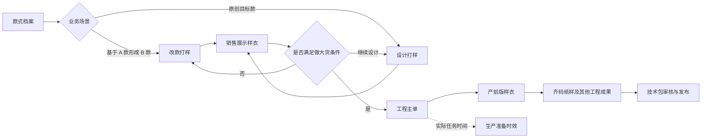
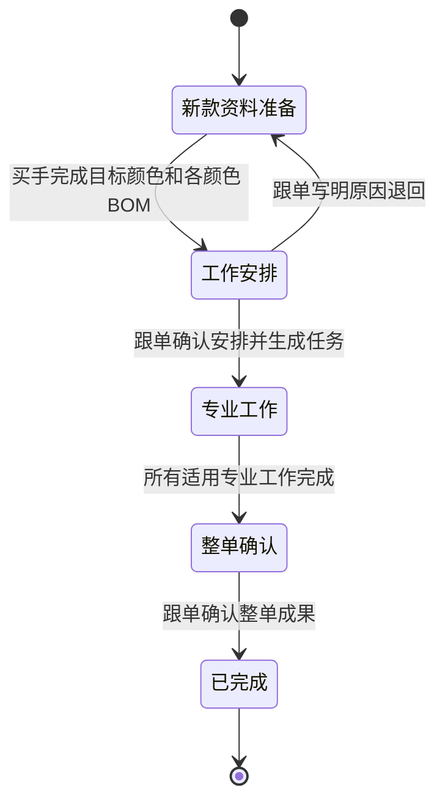
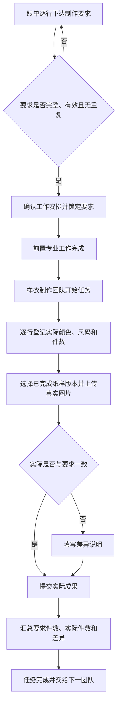
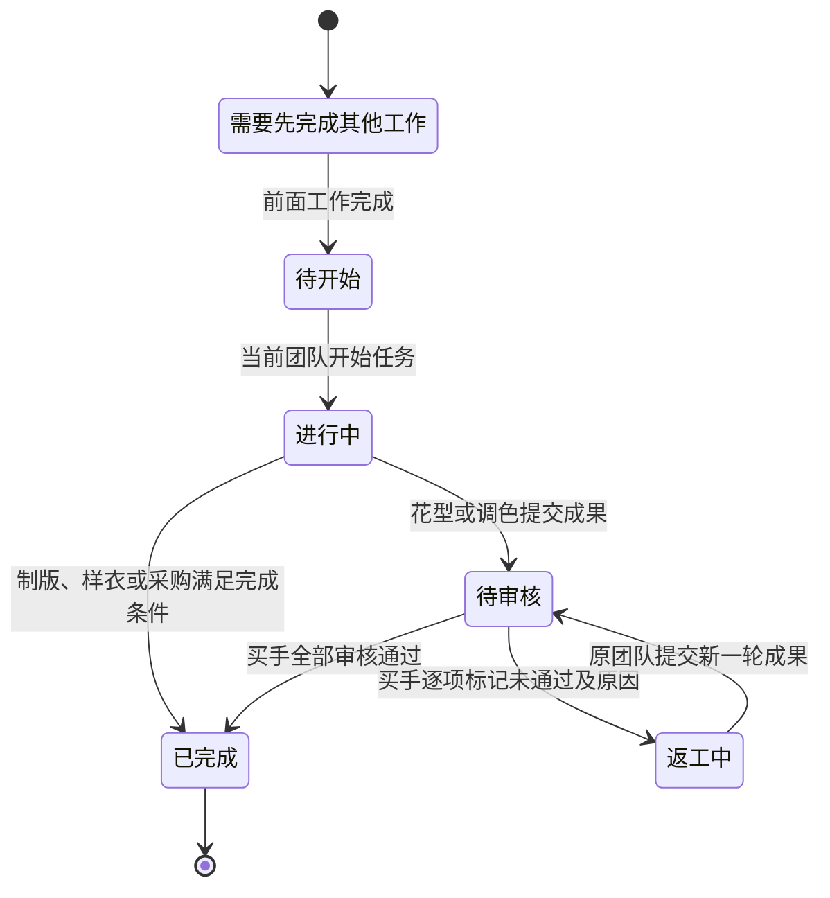
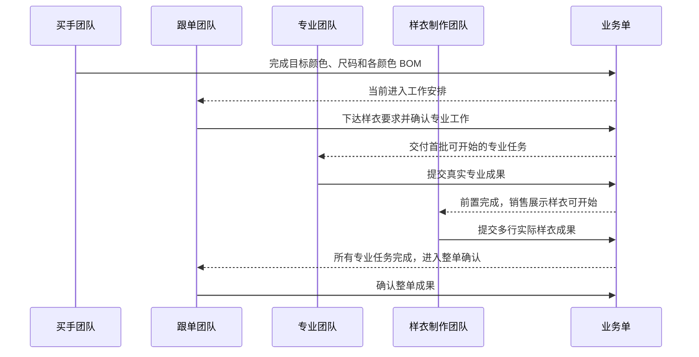
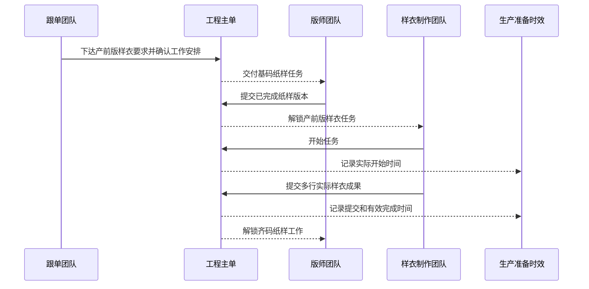
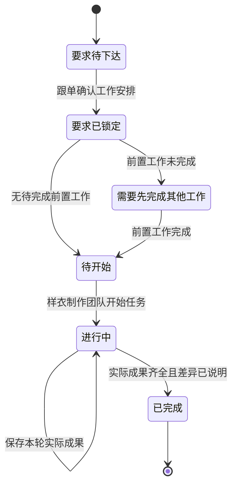

# PCS 样衣制作要求与专业任务流转产品需求说明文档

| 文档信息 | 内容 |
| --- | --- |
| 文档版本 | V1.0 |
| 文档日期 | 2026-08-13 |
| 文档状态 | 研发交付稿 |
| 适用系统 | 商品中心系统（PCS） |
| 适用范围 | 改款打样、设计打样、工程主单、销售展示样衣任务、产前版样衣任务及其关联专业任务 |
| 业务负责人 | 待项目负责人填写 |
| 产品确认人 | 待产品验收时填写 |

## 1. 文档目的

本文档用于指导研发、测试和业务验收本次样衣制作要求与专业任务流转调整。

本次调整解决的核心问题是：一件样衣不能只记录一个总数量、一个颜色和一个尺码。实际业务中，同一次打样可能要求多个颜色、多个尺码，每个颜色和尺码的数量也可能不同；跟单下达的制作要求与制作团队最终交付的实际结果也可能不一致。因此，系统必须把“事前要求”和“实际交付”分开记录、分别汇总、逐项对照，并明确不同团队按什么顺序接力。

本文档只描述业务对象、业务流程、页面行为、团队权限、数量规则、门禁和验收案例，不涉及研发内部实现方式。

## 2. 背景与现存业务问题

### 2.1 样衣数量表达不完整

原有样衣成果只提供“制作数量、颜色、尺码”等单值信息，无法表达以下真实情况：

- 黑色 M 码 2 件、黑色 L 码 1 件；
- 白色 S 码 1 件、白色 M 码 2 件；
- 同一颜色尺码分两次交付；
- 实际做出的颜色、尺码或件数与跟单要求不同。

### 2.2 缺少明确的事前制作要求

制作团队虽然可以提交成果，但系统没有完整表达以下事实：

- 谁在专业团队开始前下达要求；
- 本次到底要求做哪些颜色、哪些尺码、各多少件；
- 要求何时确认、何时锁定；
- 实际成果应当与哪一条要求对照。

### 2.3 不同团队的工作混在同一页面

改款与设计打样涉及买手、跟单和多个专业团队。若所有内容从上到下平铺，业务人员难以判断：

- 当前轮到哪个团队；
- 当前团队需要完成什么；
- 哪些内容已经完成，哪些还不能操作；
- 当前工作完成后会交给哪个团队。

### 2.4 销售展示样衣与产前版样衣容易混淆

销售展示样衣用于前期直播销售和测款，产前版样衣用于大货生产前确认。两者可能属于同一个款式，但用途、发生时点、制作要求和完成状态必须独立。销售展示样衣完成，不能自动表示产前版样衣完成。

### 2.5 父单与专业任务入口不一致

改款、设计或工程主单中展示专业工作时，“进入任务”必须进入该专业任务自己的详情，而不是进入另一套简化页面。否则同一任务会出现两套状态、两套成果和两套操作口径。

## 3. 本次目标

### 3.1 业务目标

1. 跟单在专业团队开始前，按“颜色＋尺码＋要求数量”逐行下达样衣制作要求。
2. 制作团队在任务开始后，按“实际颜色＋实际尺码＋实际数量”逐行提交真实成果。
3. 制作要求与实际成果分别保存、分别汇总、逐项对照，任何一方不得覆盖另一方。
4. 改款打样与设计打样统一采用“买手准备 → 跟单安排 → 专业团队执行 → 跟单整单确认”的四步接力。
5. 工程主单在确认工作安排前，由跟单单独下达产前版样衣制作要求。
6. 销售展示样衣与产前版样衣保持完全独立，不复用完成状态，不抵扣制作数量。
7. 父单中的“进入任务”与各专业任务列表进入同一份专业任务详情。
8. 所有纸样、图片和附件都必须是真实文件，缺失或保存失败时不得推进任务。
9. 页面用业务人员能够直接理解的语言说明当前团队、当前动作、需要先完成的工作和完成后去向。

### 3.2 非目标

本次明确不包含以下内容：

1. 不增加样衣差异审批流或异常处理模块。
2. 不提供已锁定制作要求的修改流程。
3. 不允许取消已经生成的专业任务；需要重做时在原任务中形成新一轮成果。
4. 不建立“我的工程任务”或个人待办模块。
5. 不建立“待本团队处理、团队处理中”等团队专属状态体系。
6. 不用销售展示样衣替代产前版样衣。
7. 不处理历史任务迁移和历史技术包导入。
8. 不设置技术包模板库。
9. 本次不涉及员工 PDA、打印单据和生产现场扫码流程。

## 4. 业务术语

| 术语 | 业务定义 |
| --- | --- |
| A 款 | 改款时用于参考的原款式 |
| B 款 | 改款后最终要形成的新款式，所有新颜色、BOM、样衣和专业成果均归属于 B 款 |
| 设计打样 | 没有 A 款参考，直接围绕一个已建档目标款式开展的前期打样 |
| 销售展示样衣 | 做大货前用于直播销售、测款或展示的样衣 |
| 产前版样衣 | 款式满足做大货条件后，用于正式生产前确认的样衣 |
| 制作要求 | 跟单在任务开始前下达的颜色、尺码、要求数量和说明 |
| 实际成果 | 制作团队实际做出的颜色、尺码、数量、样衣图片、所用纸样版本和说明 |
| 专业任务 | 制版、花型、调色、销售展示样衣、产前版样衣等由专业团队实际完成的工作 |
| 当前需处理的团队 | 当前真正需要执行下一步业务动作的团队 |
| 已完成纸样版本 | 已完成并可被样衣制作引用的基码纸样成果版本 |

## 5. 业务对象与关系

| 业务对象 | 来源 | 归属 | 主要结果 |
| --- | --- | --- | --- |
| 改款打样 | 已建档 A 款与已建档 B 款 | B 款 | B 款目标颜色、BOM 草稿、专业成果、销售展示样衣 |
| 设计打样 | 已建档目标款式 | 目标款式 | 目标颜色、BOM 草稿、专业成果、销售展示样衣 |
| 工程主单 | 已满足做大货条件的款式 | 目标款式 | 工程专业成果、产前版样衣、正式技术包 |
| 销售展示样衣制作要求 | 改款或设计打样的工作安排 | 对应销售展示样衣任务 | 多行颜色、尺码、要求件数 |
| 产前版样衣制作要求 | 工程主单的工作安排 | 对应产前版样衣任务 | 多行颜色、尺码、要求件数 |
| 样衣实际成果 | 对应样衣任务 | 对应制作要求和款式 | 多行实际颜色、尺码、件数及真实成果文件 |
| 专业任务 | 已确认的工作安排 | 来源业务单和目标款式 | 本专业真实成果及操作记录 |
| 生产准备时效 | 工程主单专业任务的实际动作 | 工程主单 | 开始、提交、审核、完成和耗时统计 |

## 6. 角色与团队责任

| 团队 | 本次主要责任 | 可以操作 | 不可以操作 |
| --- | --- | --- | --- |
| 买手团队 | 确认目标颜色、目标尺码、颜色参考关系及 B 款 BOM 与价格 | 新款资料准备、BOM 与价格、花型和调色成果审核 | 不代替跟单下达样衣数量要求；不修改物料档案标准单价 |
| 跟单团队 | 建立业务单、下达样衣制作要求、确认工作安排、整单确认 | 制作要求、专业任务选择、工作安排、整单确认 | 不维护 BOM；不代替专业团队提交成果 |
| 版师团队 | 制作并提交基码纸样、齐码纸样 | 纸样参数、真实纸样文件、纸样版本 | 不代替制作团队提交样衣成果 |
| 样衣制作团队 | 按已锁定要求制作并登记实际样衣 | 实际颜色、尺码、件数、纸样版本、真实图片、制作说明、差异说明 | 不修改跟单已下达的制作要求 |
| 花型团队 | 制作花型成果 | 花型成果、预览图、源文件、返工成果 | 最终通过由买手确认 |
| 染厂团队 | 按颜色要求完成调色 | 实际色样和调色成果 | 颜色要求由跟单确认；最终通过由买手确认 |

### 6.1 团队与个人的记录原则

1. 任务尚未开始时，只显示当前需处理的团队，不提前指定个人。
2. 团队成员实际点击开始、保存、提交、审核或返工后，才记录具体操作人。
3. 页面始终优先显示“现在轮到哪个团队”和“该团队现在要做什么”。
4. 个人操作记录只用于追溯，不改变团队责任。

## 7. 总体业务流程图与分场景流程

### 7.1 改款打样

1. 跟单选择已建档 A 款和已建档 B 款，建立改款打样草稿。
2. 买手定义 B 款本次目标颜色和尺码；目标颜色数量可以少于、等于或多于 A 款颜色数量。
3. 买手为每个 B 款颜色选择 A 款参考颜色或“无参考颜色”。
4. 系统为每个 B 款目标颜色建立一份 BOM 与价格草稿。
5. 买手完成 B 款 BOM 后，将任务交给跟单。
6. 跟单确认本次专业工作，并逐行下达销售展示样衣制作要求。
7. 系统一次生成专业任务；制作要求同时锁定。
8. 专业团队按固定先后关系完成工作。
9. 样衣制作团队逐行登记实际销售展示样衣成果。
10. 所有专业任务完成后，由跟单整单确认。

### 7.2 设计打样

设计打样与改款打样采用相同四步流程，但没有 A 款：

1. 跟单选择已建档目标款式，建立设计打样草稿。
2. 买手直接定义目标颜色、尺码，并维护各颜色 BOM 与价格。
3. 跟单下达销售展示样衣要求并确认工作安排。
4. 专业团队完成纸样、花型、调色和样衣等适用工作。
5. 跟单完成整单确认。

### 7.3 工程主单

1. 款式满足做大货条件后建立工程主单草稿。
2. 系统根据款式和 BOM 给出适用工作；固定的前置工作不可删除。
3. 跟单在确认工作安排前，逐行下达产前版样衣制作要求。
4. 跟单确认后一次生成工程专业任务并发布主单。
5. 专业团队按固定依赖完成基码纸样、产前版样衣、齐码纸样、花型、调色、采购和技术包确认等适用工作。
6. 产前版样衣必须单独制作；既有销售展示样衣只能作为参考。
7. 专业任务实际开始、提交、审核和完成时间同步到生产准备时效。

## 8. 改款与设计打样的四步团队接力

| 步骤 | 当前团队 | 主要工作 | 完成条件 | 完成后去向 |
| --- | --- | --- | --- | --- |
| 第一步：新款资料准备 | 买手团队 | 确认目标颜色、目标尺码、颜色参考关系和各颜色 BOM | 目标颜色与尺码有效，各颜色 BOM 准备完成 | 跟单团队 |
| 第二步：工作安排 | 跟单团队 | 确认专业工作并下达销售展示样衣要求 | 工作选择完整，制作要求有效 | 各专业团队 |
| 第三步：专业工作 | 版师、花型、染厂、样衣制作等团队 | 按固定关系完成各自专业工作 | 所有适用专业任务完成并通过适用审核 | 跟单团队 |
| 第四步：整单确认 | 跟单团队 | 确认本次成果版本和整单说明 | 整单确认完成 | 打样任务已完成 |

### 8.1 步骤展示规则

1. 页面默认打开当前步骤。
2. 已完成步骤可以回看，但不能修改。
3. 未来步骤锁定，不能提前操作。
4. 当前步骤完成后，系统自动进入下一步骤并更新当前需处理的团队。
5. 第三步存在多项并行专业工作时，可同时显示多个当前需处理团队。
6. 任一专业工作尚未完成，第四步保持锁定。

### 8.2 工作安排中的任务建议

1. 销售展示样衣是独立改款和设计打样的必做工作。
2. 销售展示样衣需要纸样时，基码纸样属于必须先完成的工作，不能删除。
3. B 款 BOM 存在印花需求时，系统建议花型任务。
4. B 款 BOM 存在线材或面料染色需求时，系统分别建议对应调色任务。
5. 跟单确认本次适用工作，但不能删除固定前置工作，也不能调整已经确认的先后关系。
6. 跟单确认后一次生成本次专业任务，不能分批生成相互矛盾的任务组合。

### 8.3 四步团队接力状态图

## 9. 新款颜色与 BOM 准备规则

### 9.1 改款颜色对应

1. B 款目标颜色由买手按本次业务实际定义，不强制等于 A 款颜色。
2. 每个 B 款颜色可以选择一个 A 款颜色作为参考，也可以选择“无参考颜色”。
3. 同一个 A 款颜色可以同时供多个 B 款颜色参考。
4. B 款目标颜色至少一个，颜色名称去除首尾空格后不得重复。
5. 每个目标颜色必须选择至少一个目标尺码。
6. B 款目标颜色确认成功后，目标颜色、目标 SKU 和对应 BOM 必须整体建立成功；任一项失败时不得留下部分结果。

### 9.2 BOM 带入与维护

1. 有 A 款参考色时，从 A 款最近一份已完成确认的物料方案带出参考物料。
2. 无参考色时，为 B 款建立空白物料方案。
3. 带出的 A 款物料只作参考，买手可在 B 款中修改、删除、替换或新增物料。
4. 对 A 款物料的处理必须明确为：沿用、替换、重新染色、重新印花或不使用。
5. 所有修改只影响 B 款，不能反向修改 A 款资料。
6. 标准单价只从物料档案读取；没有有效标准单价的物料不得加入。
7. 买手完成新款资料准备后，目标颜色与 BOM 对跟单只读。

## 10. 样衣制作要求

### 10.1 下达位置

| 样衣类型 | 下达团队 | 下达时点 | 下达位置 |
| --- | --- | --- | --- |
| 销售展示样衣 | 跟单团队 | 改款或设计打样确认工作安排前 | 第二步“工作安排” |
| 产前版样衣 | 跟单团队 | 工程主单确认工作安排前 | 工程主单任务方案确认区 |

### 10.2 制作要求明细

每条制作要求必须包含：

| 字段 | 规则 |
| --- | --- |
| 要求颜色 | 从目标款式本次已确认颜色中选择 |
| 要求尺码 | 从目标款式已建立的有效尺码中选择 |
| 要求数量 | 大于 0 的整数，单位为“件” |
| 制作要求说明 | 可选，用于说明面辅料、工艺、展示或制作注意事项 |

### 10.3 制作要求校验

1. 至少存在一条有效制作要求。
2. 同一任务中“颜色＋尺码”组合不得重复。
3. 颜色必须属于目标款式当前有效颜色。
4. 尺码必须属于目标款式当前有效尺码。
5. 数量必须为大于 0 的整数。
6. 任一行不符合要求时，不能确认工作安排，并明确指出需要修改的行和原因。

### 10.4 确认与锁定

1. 跟单确认工作安排成功后，制作要求与专业任务同时生成。
2. 制作要求生成后立即锁定，专业团队只能查看，不能修改。
3. 锁定后的制作要求永久保留，作为实际交付对照依据。
4. 实际制作与要求不一致时，记录真实结果和差异说明，不回改原要求。
5. 本期不提供锁定后的要求变更入口。

## 11. 样衣实际成果

### 11.1 提交团队与时点

销售展示样衣和产前版样衣均由样衣制作团队在任务开始后提交实际成果。制作要求只读展示在任务详情中。

### 11.2 实际成果明细

每条实际成果必须包含：

| 字段 | 规则 |
| --- | --- |
| 对应制作要求 | 必须选择本任务的一条已锁定制作要求 |
| 实际颜色 | 记录真实做出的颜色 |
| 实际尺码 | 记录真实做出的尺码 |
| 实际数量 | 大于 0 的整数，单位为“件” |
| 使用的纸样版本 | 只能选择本款已完成且可用的基码纸样版本 |
| 样衣图片 | 每条实际成果至少上传一张真实样衣图片 |
| 制作说明 | 记录本次制作情况和必要说明 |
| 差异说明 | 实际颜色、尺码或数量与要求不一致时必填 |

### 11.3 多行与拆分交付

1. 一个制作要求可以对应多条实际成果。
2. 例如“黑色 M 码 2 件”可以一次提交 2 件，也可以分两条各提交 1 件。
3. 多个颜色、多个尺码必须分别形成实际成果明细，不能只填写一个总数量。
4. 同一任务的所有实际数量之和才是该任务的实际制作件数。
5. 实际成果行数只是记录数量，不等于样衣件数。

### 11.4 差异计算

| 指标 | 计算规则 |
| --- | --- |
| 要求总件数 | 所有制作要求数量之和 |
| 实际总件数 | 所有实际成果数量之和 |
| 总数量差异 | 实际总件数减去要求总件数 |
| 单项实际件数 | 同一制作要求下所有实际成果数量之和 |
| 单项数量差异 | 单项实际件数减去该要求数量 |

差异展示使用业务语言：

- 差异为 0：显示“一致”；
- 实际少于要求：显示“少 N 件”；
- 实际多于要求：显示“多 N 件”。

### 11.5 差异处理

1. 系统不得为了与要求一致而修改实际颜色、尺码或数量。
2. 只要实际颜色、实际尺码或对应要求下的实际总数量与要求不同，差异说明必填。
3. 差异说明完整后允许提交并完成任务。
4. 本期不新增差异审批、异常单或要求变更流程。

### 11.6 完成门禁

样衣任务同时满足以下条件后方可完成：

1. 每条制作要求至少有一条实际成果。
2. 每条实际成果数量为大于 0 的整数。
3. 每条实际成果选择了有效的已完成纸样版本。
4. 每条实际成果已成功保存真实样衣图片。
5. 存在差异时已经填写差异说明。
6. 所有必填制作说明均已完成。

## 12. 销售展示样衣与产前版样衣边界

| 对比项 | 销售展示样衣 | 产前版样衣 |
| --- | --- | --- |
| 发生时点 | 做大货前的改款或设计打样阶段 | 满足做大货条件后的工程主单阶段 |
| 主要用途 | 直播销售、展示、测款 | 大货生产前确认 |
| 制作要求来源 | 改款或设计打样的跟单工作安排 | 工程主单的跟单工作安排 |
| 完成状态 | 只完成对应销售展示样衣任务 | 只完成对应产前版样衣任务 |
| 是否计入生产准备时效 | 否 | 是 |
| 是否可以互相替代 | 不可以 | 不可以 |

边界规则：

1. 销售展示样衣已完成，工程主单仍必须单独生成产前版样衣任务。
2. 产前版样衣必须重新下达制作要求并单独登记实际成果。
3. 销售展示样衣可以作为查看参考，但不能复制其完成状态、要求数量或实际数量来完成产前版样衣。
4. 两类样衣的图片、纸样版本、制作说明、差异说明和操作记录分别保存。

## 13. 专业任务流转

### 13.1 通用状态

| 状态 | 业务含义 | 可执行动作 |
| --- | --- | --- |
| 需要先完成其他工作 | 必须等待前面的专业工作完成 | 查看等待内容，不可开始 |
| 待开始 | 前面工作已完成，当前团队可以开始 | 开始任务 |
| 进行中 | 当前团队正在制作或维护成果 | 保存、提交成果 |
| 待审核 | 花型或调色成果已提交，等待买手审核 | 审核通过或逐项退回 |
| 返工中 | 存在未通过成果，原团队需要重做 | 只重做未通过项并再次提交 |
| 已完成 | 本任务完成条件已满足 | 只读查看成果和记录 |
| 不适用 | 本次业务不需要该任务 | 只读查看不适用原因 |

### 13.2 进入专业任务

父单中的每一项专业工作都提供“进入任务”。点击后必须进入该任务类型的正式业务详情：

- 基码纸样和齐码纸样进入制版任务详情；
- 花型工作进入花型任务详情；
- 调色工作进入调色任务详情；
- 销售展示样衣进入销售展示样衣任务详情；
- 产前版样衣进入产前版样衣任务详情。

父单和专业任务列表必须展示同一个任务的相同状态、当前团队、成果、操作记录和完成结果，不得另建一套简化任务。

### 13.3 固定依赖与自动接力

1. 专业任务的先后关系由已确认业务结构决定，业务人员不能调整。
2. 选中后缺少必要前置工作时，系统自动补齐，不能产生缺少前置的任务。
3. 前面工作完成后，下一项任务自动变为待开始，并更新当前需处理的团队。
4. 多项互不依赖的工作可以并行，并同时显示多个当前需处理团队。
5. 当前任务完成后，页面明确显示下一团队或被解锁的工作。

### 13.4 团队接力时序图

### 13.5 不同专业任务的完成口径

| 专业任务 | 完成口径 |
| --- | --- |
| 基码纸样、齐码纸样 | 版师提交完整真实纸样成果后完成；正式资料仍在技术包阶段统一审核 |
| 销售展示样衣、产前版样衣 | 样衣制作团队提交符合门禁的全部实际成果后完成 |
| 花型任务 | 花型团队提交成果后由买手整张审核；未全部通过时逐项标记通过或不通过，并填写不通过原因 |
| 调色任务 | 染厂提交色样后由买手整张审核；未全部通过时逐项标记通过或不通过，并填写不通过原因 |
| 辅料下单任务 | 采购团队绑定有效采购单号并成功读取必要采购信息后完成 |

花型或调色任务部分成果未通过时，只重做未通过项；已经通过的成果保持有效。新一轮成果与原轮次分别保留，不覆盖历史事实。

## 14. 工程主单中的产前版样衣

### 14.1 工作安排

1. 无论工程主单由系统建立还是人工建立，第一步均由跟单确认本次工作安排。
2. 产前版样衣属于首单固定工作。
3. 跟单必须在确认工作安排前逐行填写产前版样衣颜色、尺码、要求数量和说明。
4. 要求校验通过后，与产前版样衣任务一起生成并锁定。
5. 基码纸样完成前，产前版样衣显示“需要先完成：基码纸样”，不能开始。
6. 产前版样衣完成后，按固定关系解锁齐码纸样和技术包相关工作。

### 14.2 生产准备时效

1. 生产准备时效只读取工程主单专业任务的实际动作。
2. 产前版样衣开始、提交和有效完成时间同步进入生产准备时效。
3. 独立改款和设计打样中的销售展示样衣不进入生产准备时效。
4. 生产准备时效只用于查看和统计，不能在其中开始、完成或调整专业任务。

### 14.3 产前版样衣团队接力时序图

## 15. 页面需求

### 15.1 改款与设计打样列表

1. 改款打样、设计打样与制版等专业任务列表保持一致的标题、筛选、数据表格、分页和操作区结构。
2. 页面标题区保留“新建改款打样”或“新建设计打样”。
3. “列设置”只放在数据列表表头最右侧，页面标题区不得重复出现。
4. 团队维度只提供一个“当前需处理的团队”筛选，默认值为“全部团队”。
5. 不增加个人任务入口、团队状态页签或按登录人隐藏其他团队任务的规则。
6. 对于改款、设计和工程主单，只要单内任一未完成专业任务当前轮到所选团队处理，该业务单即应被筛选出来；一张业务单可以同时属于多个团队的当前待处理结果。
7. 列表至少展示任务号、目标款式或 A 款到 B 款、业务状态、专业任务进度、BOM 与价格、跟单、更新时间和操作。
8. 样衣进度和完成数量统一按实际件数展示，不能按实际成果行数展示。

### 15.2 改款与设计打样详情

1. 顶部展示业务单号、状态、款式、当前需处理团队和跟单。
2. 改款同时展示 A 款和 B 款；设计只展示目标款式。
3. 使用四步导航：新款资料准备、工作安排、专业工作、整单确认。
4. 当前步骤突出显示；已完成步骤只读；未来步骤锁定。
5. 专业工作采用表格，至少显示当前团队、当前动作、需要先完成、完成后去向、状态和操作。
6. 每一行“进入任务”进入对应专业任务详情。
7. 页面展示完整操作记录，包括团队、实际操作人、动作、时间和轮次。

### 15.3 销售展示样衣与产前版样衣详情

1. 顶部展示任务名称、款式真实图片、款号、任务来源、当前团队、当前动作、需要先完成和完成后去向。
2. 制作要求区只读展示跟单下达的颜色、尺码、要求件数和说明。
3. 实际成果区支持增加、修改和删除本轮尚未提交的实际成果行。
4. 页面展示要求总件数、实际总件数和差异。
5. 提交后，本轮实际成果只读；返工时建立新一轮，不覆盖旧轮次。
6. 样衣缩略图可以打开高清大图，并支持关闭按钮、点击遮罩和按 `Esc` 关闭。
7. 图片加载失败时明确显示失败状态，不得显示无关占位图。

### 15.4 工程主单详情

1. 工作安排确认前展示产前版样衣制作要求编辑区。
2. 工作安排确认后，制作要求只读。
3. 专业任务使用表格展示，不使用复杂关系图。
4. 每行至少显示任务、当前团队、当前动作、需要先完成、完成后去向、计划与实际、状态和操作。

## 16. 真实文件与图片要求

### 16.1 通用规则

1. 图片、纸样和附件必须通过真实文件选择产生。
2. 只填写文件名、网址或文字说明不算完成上传。
3. 文件读取、保存或校验期间立即显示处理中状态。
4. 保存成功后显示文件名、大小、上传团队、实际上传人和时间。
5. 保存失败时明确说明原因，并允许重新选择；不得因校验失败丢失其他已填写内容。

### 16.2 纸样文件

1. 制版任务必须提交真实且非空的纸样文件。
2. 文件为空、格式不符合要求或读取失败时不得提交。
3. 已成功保存的纸样文件可以下载，文件名和实际内容保持一致。
4. 样衣任务只能选择已完成纸样版本，不能手工填写不存在的版本。

### 16.3 样衣图片

1. 每条实际成果至少有一张与该颜色、尺码实际样衣相符的真实图片。
2. 图片必须与款式、颜色和尺码信息放在同一成果行或同一信息块。
3. 图片保存完成前不得提交任务。
4. 图片缩略图可查看高清大图；大图保持原比例，在低分辨率下不溢出。

## 17. 权限与可编辑范围

| 内容 | 买手 | 跟单 | 专业团队 | 已确认后的可编辑性 |
| --- | --- | --- | --- | --- |
| 目标颜色和尺码 | 可维护 | 只读 | 只读 | 买手完成后锁定；跟单退回前可重新开放 |
| BOM 与价格 | 可维护 | 只读 | 只读 | 买手完成后对其他团队只读 |
| 销售展示样衣要求 | 只读 | 可维护 | 只读 | 工作安排确认后锁定 |
| 产前版样衣要求 | 只读 | 可维护 | 只读 | 工程工作安排确认后锁定 |
| 样衣实际成果 | 只读 | 只读 | 样衣制作团队可维护 | 本轮提交后只读 |
| 纸样成果 | 只读 | 只读 | 版师团队可维护 | 提交后只读；返工新建轮次 |
| 花型与调色成果 | 审核 | 只读颜色要求或按职责确认 | 对应团队可维护 | 审核后只读；未通过项进入返工 |
| 整单确认 | 只读 | 可操作 | 只读 | 确认后整单只读 |

## 18. 门禁、提示与恢复

| 场景 | 系统处理 | 用户可执行的恢复动作 |
| --- | --- | --- |
| 制作要求为空 | 阻断确认工作安排 | 增加至少一条有效要求 |
| 颜色尺码组合重复 | 标记重复行并阻断确认 | 修改或删除重复行 |
| 要求数量不是正整数 | 标记数量错误并阻断确认 | 修改为大于 0 的整数 |
| 前置专业工作未完成 | 显示需要先完成的业务工作，阻断开始 | 等待前置团队完成 |
| 未选择已完成纸样版本 | 阻断样衣成果提交 | 选择有效纸样版本 |
| 实际数量不是正整数 | 标记错误并阻断提交 | 修改为大于 0 的整数 |
| 样衣图片缺失或未保存成功 | 阻断提交 | 重新选择并等待保存成功 |
| 实际与要求存在差异但未说明 | 展示差异并阻断提交 | 填写差异说明 |
| 真实文件为空或格式不符 | 明确提示原因并拒绝保存 | 重新选择有效文件 |
| 页面校验失败 | 保留已经填写的其他内容和已保存文件 | 修正错误后再次提交 |

## 19. 业务状态与完成条件

### 19.1 样衣任务状态图

### 19.2 父单完成条件

| 父单 | 完成条件 |
| --- | --- |
| 改款打样 | 新款资料准备完成、所有适用专业任务完成、跟单完成整单确认 |
| 设计打样 | 新款资料准备完成、所有适用专业任务完成、跟单完成整单确认 |
| 工程主单 | 所有适用工程专业任务完成、技术包通过当前审核流程并发布、系统校验通过后由跟单关闭 |

## 20. 典型业务案例

### 20.1 案例一：改款颜色比来源款多

前提：A 款只有黑色和白色，B 款本次要做黑色、米白色和酒红色。

1. 买手把 B 款黑色参考 A 款黑色。
2. 买手把 B 款米白色参考 A 款白色。
3. 买手把 B 款酒红色设置为无参考颜色。
4. 系统建立三份 B 款 BOM 草稿：前两份带入参考物料，酒红色为空白方案。
5. 跟单下达：黑色 M 码 2 件、米白色 S 码 1 件、酒红色 M 码 1 件。
6. 制作团队实际提交：黑色 M 码两次各 1 件、米白色 S 码 1 件、酒红色 L 码 1 件。
7. 酒红色实际尺码与要求不同，必须填写差异说明；总实际件数仍为 4 件。

### 20.2 案例二：设计打样没有来源款

前提：目标款式已建档，本次直接设计蓝色和绿色两个颜色。

1. 买手定义蓝色、绿色及各自目标尺码。
2. 系统建立两份空白 BOM 草稿，买手分别维护物料。
3. 跟单下达蓝色 M 码 1 件、绿色 M 码 1 件、绿色 L 码 1 件。
4. 各专业团队完成纸样、花型或调色等适用工作。
5. 样衣制作团队提交三行真实成果，跟单完成整单确认。

### 20.3 案例三：销售展示样衣完成后进入工程主单

前提：某款销售展示样衣已经完成并达到做大货条件。

1. 工程主单建立后仍生成独立的产前版样衣任务。
2. 跟单重新下达产前版样衣颜色、尺码和要求数量。
3. 销售展示样衣只供查看参考，不自动带入产前版样衣完成状态。
4. 产前版样衣使用工程阶段已完成纸样版本重新制作并提交实际成果。
5. 产前版样衣实际时间进入生产准备时效；销售展示样衣时间不进入。

## 21. 验收场景与测试案例

### 21.1 列表与团队筛选

| 编号 | 前提 | 操作 | 预期结果 |
| --- | --- | --- | --- |
| LIST-01 | 打开改款打样列表 | 查看页面标题和数据表头 | 标题区只有新建动作；列设置位于数据列表表头最右侧 |
| LIST-02 | 打开设计打样列表 | 对照制版任务列表 | 标题、筛选、数据密度、分页和操作列保持一致 |
| LIST-03 | 列表存在多团队任务 | 选择“当前需处理的团队”为样衣制作团队 | 只显示当前确实轮到该团队处理的任务 |
| LIST-04 | 任务已经全部完成 | 选择任一当前团队 | 已完成任务不归入任何团队待处理结果，只在全部结果中可查 |
| LIST-05 | 打开团队筛选 | 查看筛选项 | 不出现个人任务、“我的任务”或团队专属状态页签 |

### 21.2 改款打样

| 编号 | 前提 | 操作 | 预期结果 |
| --- | --- | --- | --- |
| REV-01 | A 款与 B 款均已建档且不同 | 新建改款打样 | 只建立草稿业务单，不提前生成 BOM 或专业任务 |
| REV-02 | A 款有两个颜色 | 买手定义三个 B 款颜色 | 允许目标颜色多于 A 款，并允许新增无参考颜色 |
| REV-03 | B 款三个颜色已确认 | 查看物料方案 | 每个颜色各有一份 B 款 BOM 草稿 |
| REV-04 | 一个 B 款颜色有 A 款参考色 | 查看带入物料 | 只读取 A 款最近一份已完成确认方案，A 款保持只读 |
| REV-05 | B 款颜色无参考色 | 查看物料方案 | 建立空白方案，不读取 B 款历史物料 |
| REV-06 | 买手完成准备 | 进入第二步 | 当前需处理团队自动变为跟单 |
| REV-07 | 跟单尚未填写销售样衣要求 | 确认工作安排 | 系统阻断并提示至少填写一条制作要求 |
| REV-08 | 制作要求存在重复颜色尺码 | 确认工作安排 | 标记重复行并阻断确认 |
| REV-09 | 制作要求有效 | 确认工作安排 | 一次生成专业任务并锁定制作要求 |

### 21.3 设计打样

| 编号 | 前提 | 操作 | 预期结果 |
| --- | --- | --- | --- |
| DES-01 | 目标款式已建档 | 新建设计打样 | 不要求选择 A 款，只建立草稿业务单 |
| DES-02 | 设计草稿处于第一步 | 买手定义两个目标颜色 | 建立两个目标颜色及两份空白 BOM 草稿 |
| DES-03 | 买手完成目标颜色和 BOM | 进入工作安排 | 跟单可以逐行下达销售展示样衣要求 |
| DES-04 | 跟单确认工作安排 | 查看第三步 | 进入与改款相同的专业工作表格和固定依赖流程 |
| DES-05 | 所有专业任务完成 | 查看详情 | 自动进入整单确认，前三步只读 |

### 21.4 销售展示样衣实际成果

| 编号 | 前提 | 操作 | 预期结果 |
| --- | --- | --- | --- |
| DISPLAY-01 | 基码纸样未完成 | 尝试开始销售展示样衣 | 显示需要先完成基码纸样，不能开始 |
| DISPLAY-02 | 基码纸样已完成 | 进入销售展示样衣任务 | 只读展示跟单下达的多行制作要求 |
| DISPLAY-03 | 要求为黑色 M 码 2 件 | 拆成两条实际成果，各填 1 件 | 实际汇总为 2 件，不按两条记录误算 |
| DISPLAY-04 | 实际颜色与要求不同 | 不填差异说明并提交 | 阻断提交并提示填写差异说明 |
| DISPLAY-05 | 实际数量少于要求且已说明 | 提交实际成果 | 保存真实差异并允许任务完成 |
| DISPLAY-06 | 实际成果缺少样衣图片 | 提交 | 阻断提交 |
| DISPLAY-07 | 实际成果已上传真实图片 | 点击缩略图 | 打开保持比例的高清大图，可通过三种方式关闭 |
| DISPLAY-08 | 纸样版本不存在或未完成 | 选择纸样版本 | 不提供该版本，不能自由填写替代 |

### 21.5 产前版样衣

| 编号 | 前提 | 操作 | 预期结果 |
| --- | --- | --- | --- |
| PRE-01 | 工程主单草稿 | 跟单查看工作安排 | 可以逐行填写产前版样衣颜色、尺码和要求件数 |
| PRE-02 | 产前版要求有效 | 确认工作安排 | 要求与任务一起生成并锁定 |
| PRE-03 | 同款销售展示样衣已完成 | 查看产前版样衣 | 仍为独立待办，不自动完成、不抵扣数量 |
| PRE-04 | 基码纸样未完成 | 尝试开始 | 显示需要先完成基码纸样并阻断开始 |
| PRE-05 | 多颜色多尺码要求 | 分别提交多行真实成果 | 分别记录实际颜色、尺码、件数、纸样版本和图片 |
| PRE-06 | 某行实际数量为 0 | 提交 | 阻断并保留其他已填写内容和已保存图片 |
| PRE-07 | 所有成果有效 | 提交 | 显示要求总件数、实际总件数、差异、实际操作人和时间 |
| PRE-08 | 产前版样衣开始并完成 | 查看生产准备时效 | 显示与工程任务一致的实际开始、提交和完成时间 |

### 21.6 专业任务入口与事实一致性

| 编号 | 前提 | 操作 | 预期结果 |
| --- | --- | --- | --- |
| TASK-01 | 父单存在基码纸样 | 点击进入任务 | 进入同一制版任务详情，状态和成果与制版任务列表一致 |
| TASK-02 | 父单存在花型任务 | 点击进入任务 | 进入同一花型任务详情，审核和返工事实一致 |
| TASK-03 | 父单存在调色任务 | 点击进入任务 | 进入同一调色任务详情，颜色要求和成果一致 |
| TASK-04 | 父单存在销售展示样衣 | 点击进入任务 | 进入销售展示样衣详情，展示对应制作要求和实际成果 |
| TASK-05 | 工程主单存在产前版样衣 | 点击进入任务 | 进入产前版样衣详情，展示对应制作要求和实际成果 |
| TASK-06 | 同一专业任务分别从父单和专业列表进入 | 对比任务信息 | 任务号、状态、当前团队、成果、数量和操作记录完全一致 |

### 21.7 真实文件

| 编号 | 前提 | 操作 | 预期结果 |
| --- | --- | --- | --- |
| FILE-01 | 制版任务进行中 | 选择空纸样文件 | 明确提示文件为空，不能保存和提交 |
| FILE-02 | 制版任务进行中 | 选择真实非空纸样文件 | 保存成功，可下载，下载内容与原文件一致 |
| FILE-03 | 样衣任务进行中 | 只填写图片名称或网址 | 不视为已上传，不能提交 |
| FILE-04 | 样衣任务进行中 | 选择真实样衣图片 | 保存成功并生成可点击缩略图 |
| FILE-05 | 文件保存失败 | 再次选择有效文件 | 可以恢复上传，其他已填写内容不丢失 |

## 22. 联调与验收数据要求

为验证完整业务链路，联调环境至少准备以下六张业务单，每张均使用不同颜色、尺码和数量组合：

| 案例 | 最低业务覆盖 |
| --- | --- |
| 改款案例 1 | B 款颜色少于 A 款；参考色带入；销售展示样衣数量完全一致 |
| 改款案例 2 | B 款颜色多于 A 款；一对多及无参考色；实际颜色或尺码存在差异 |
| 设计案例 1 | 两个目标颜色、多个尺码；无来源款；样衣一次完整交付 |
| 设计案例 2 | 三个目标颜色；一个要求拆成多次交付；专业任务并行 |
| 工程主单案例 1 | 已有销售展示样衣；仍单独下达并完成产前版样衣 |
| 工程主单案例 2 | 多颜色多尺码产前版样衣；实际数量少于或多于要求并填写说明 |

每个案例至少包含：真实款式图片、有效颜色尺码、真实纸样文件、真实样衣图片、完整团队接力、实际操作人、操作时间、要求总件数、实际总件数和差异。

## 23. 原子需求清单

| 编号 | 原子需求 | 验收依据 |
| --- | --- | --- |
| FLOW-001 | 改款和设计打样均采用四步团队接力 | 当前步骤、当前团队和步骤锁定结果 |
| FLOW-002 | 当前步骤完成后自动进入下一步骤 | 完成动作后的页面与团队变化 |
| FLOW-003 | 多项专业工作可以并行 | 同时存在多个可开始任务和当前团队 |
| COLOR-001 | 改款 B 款颜色数量不受 A 款限制 | 少于、等于、多于三类案例 |
| COLOR-002 | 每个 B 款颜色可参考 A 款颜色或无参考 | 一对多和无参考案例 |
| BOM-001 | 每个目标颜色建立独立 B 款 BOM 草稿 | 目标颜色数与物料方案数一致 |
| BOM-002 | B 款 BOM 可改、删、增且不影响 A 款 | 修改前后 A 款资料保持不变 |
| REQ-001 | 跟单逐行下达销售展示样衣要求 | 工作安排中的要求明细 |
| REQ-002 | 跟单逐行下达产前版样衣要求 | 工程主单中的要求明细 |
| REQ-003 | 要求行包含颜色、尺码、正整数件数和可选说明 | 字段与校验结果 |
| REQ-004 | 工作安排确认后要求锁定 | 专业任务详情只读展示 |
| ACTUAL-001 | 制作团队逐行提交实际颜色、尺码和件数 | 实际成果明细 |
| ACTUAL-002 | 一个要求支持多条实际成果 | 拆分交付案例 |
| ACTUAL-003 | 实际件数按数量求和，不按行数统计 | 汇总与列表显示 |
| ACTUAL-004 | 实际差异必须说明，说明后允许完成 | 差异门禁案例 |
| ACTUAL-005 | 每条实际成果必须有真实样衣图和有效纸样版本 | 提交门禁与成果查看 |
| SAMPLE-001 | 销售展示样衣与产前版样衣完全独立 | 已完成销售样衣后的工程主单案例 |
| TASK-001 | 父单和专业列表进入同一任务详情 | 状态、成果和记录一致性 |
| TASK-002 | 固定前置工作不可删除，缺失时自动补齐 | 工作安排和等待状态 |
| TEAM-001 | 任务开始前只明确团队，真实动作后记录个人 | 任务首屏和操作记录 |
| LIST-001 | 团队维度只保留“当前需处理的团队”筛选 | 改款、设计及专业任务列表 |
| LIST-002 | 列设置仅位于数据列表表头最右侧 | 改款与设计列表 |
| FILE-001 | 所有图片、纸样和附件均为真实文件 | 选择、保存、预览、下载和失败门禁 |
| TIMING-001 | 只有工程主单专业任务进入生产准备时效 | 销售样衣与产前版样衣对照 |

## 24. 验收完成标准

本次需求只有同时满足以下条件，才可以判定完成：

1. 改款、设计和工程主单三条业务路径均能完整走通。
2. 销售展示样衣和产前版样衣均支持多颜色、多尺码、多件数要求与实际成果。
3. 制作要求与实际成果分别保存，要求锁定后无第二编辑入口。
4. 列表、父单和任务详情对实际样衣数量使用相同的“件数之和”口径。
5. 差异不被系统改写；缺少差异说明时阻断，说明完整后允许完成。
6. 销售展示样衣完成不会使产前版样衣自动完成。
7. 父单和专业任务列表进入同一任务详情，状态、成果和记录一致。
8. 所有真实文件门禁、预览和下载符合要求。
9. 团队接力能够明确回答当前团队、当前动作、前面工作和下一去向。
10. 生产准备时效只读取工程主单任务，不成为任务操作入口。
11. 第 21 节全部验收案例通过，第 23 节每条原子需求均有对应验收结果。
12. 产品负责人完成最终业务验收并记录确认版本。

## 25. 已确认边界与待填写信息

### 25.1 已确认边界

1. 本期差异仅要求说明，不新增审批或异常流程。
2. 本期锁定后的制作要求不提供修改入口。
3. 两类样衣独立，不复用完成状态和数量。
4. 团队优先，不在任务开始前指定个人。
5. 设计与改款使用相同四步流程和页面结构。
6. 所有上传必须为真实文件。

### 25.2 交付前待填写

- 产品负责人；
- 研发负责人；
- 测试负责人；
- 联调环境验收日期；
- 产品最终确认版本。
