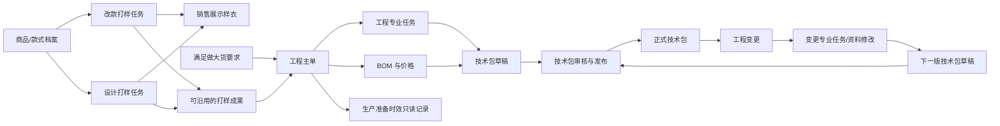
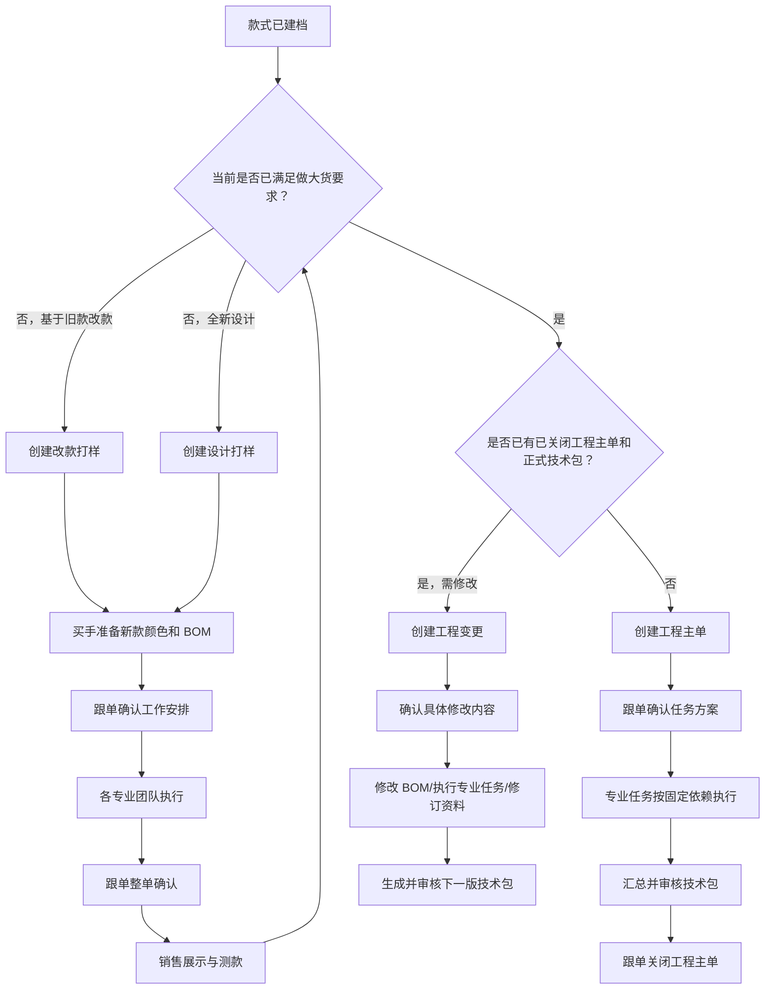
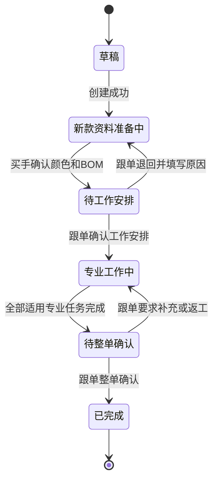
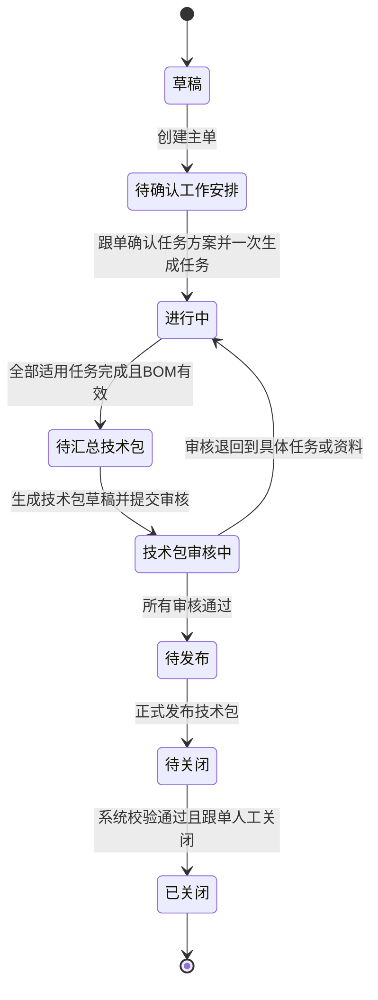
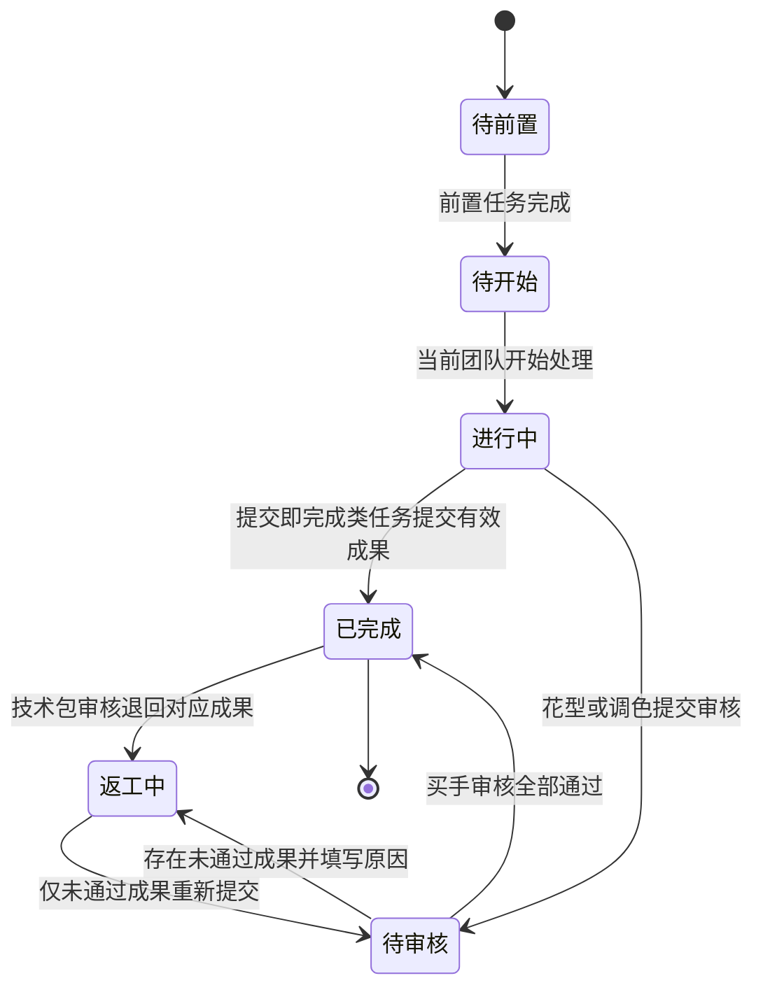
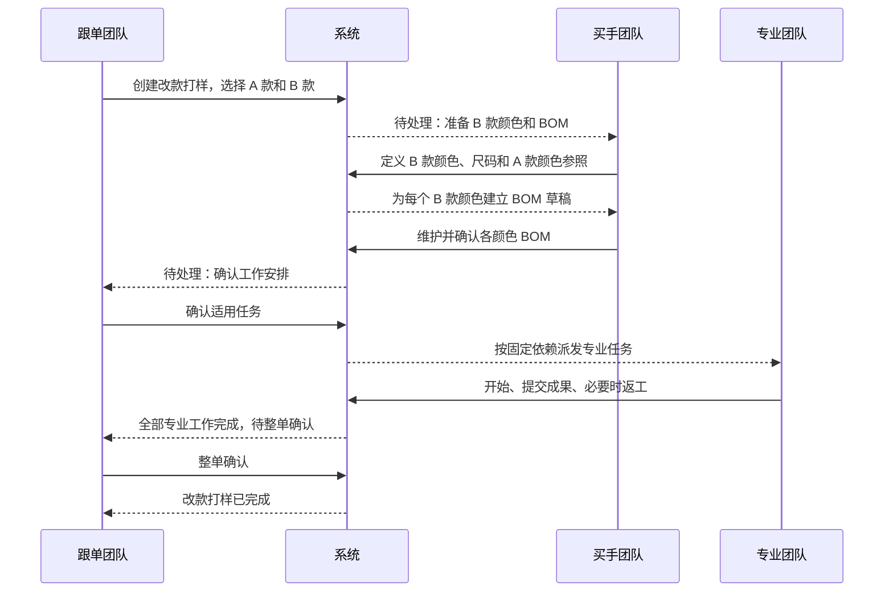
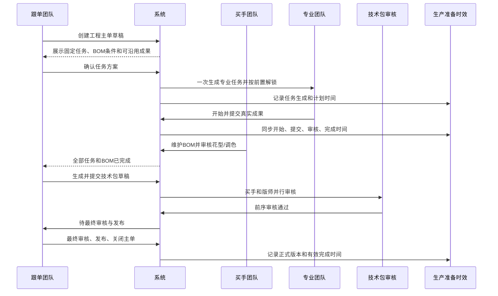
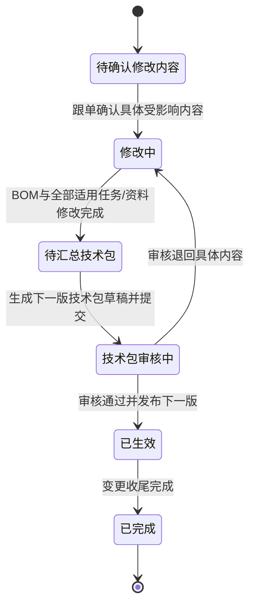
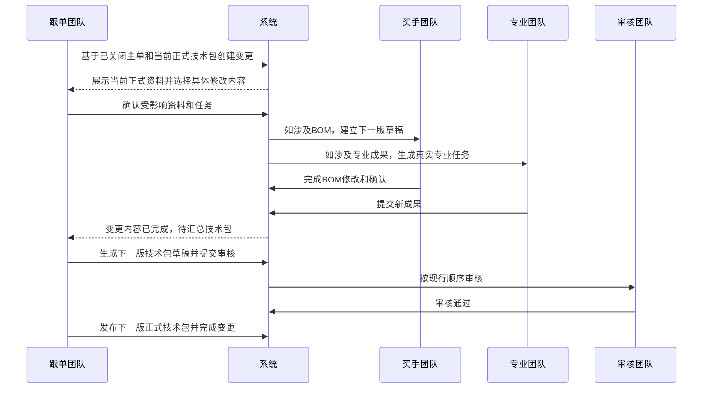
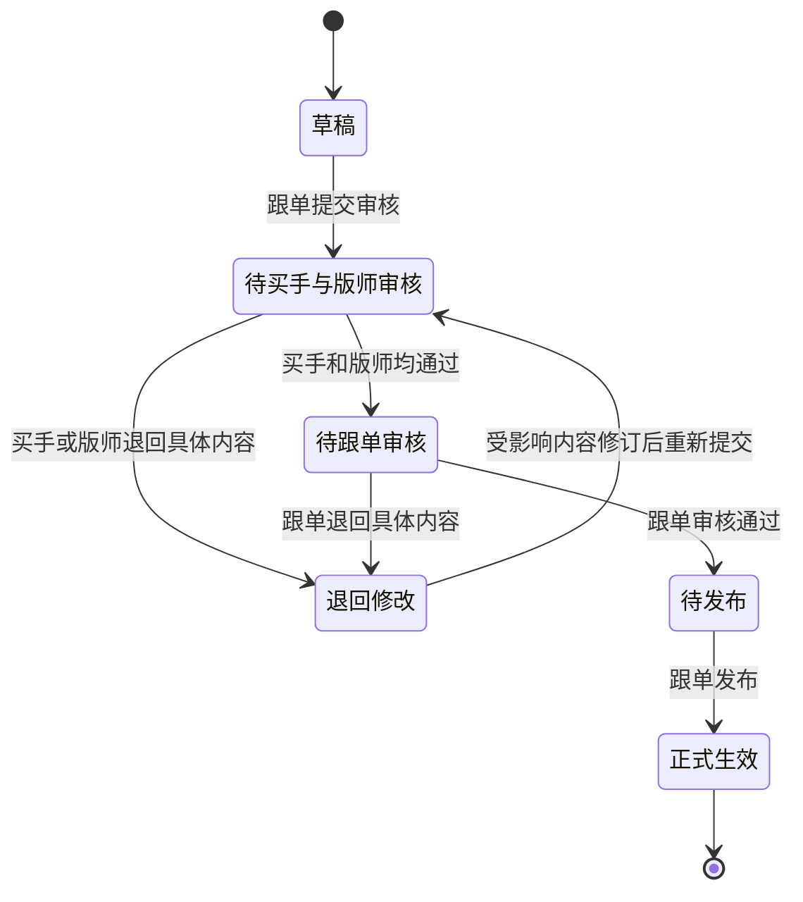

# PCS 生产工程管理产品需求说明书

> 文档类型：研发交付版产品需求说明书  
> 文档状态：可进入研发评审  
> 适用范围：商品中心系统的生产工程管理、技术资料及生产准备时效联动  
> 基线日期：2026-08-12  
> 说明：本文档使用业务语言描述需求，不包含原型实现代码。文中示例款式、单号和人员均为验收数据，不代表真实生产业务已经发生。

## 1. 文档目的

本文档用于统一产品、研发、测试和业务团队对 PCS 生产工程管理的理解，明确：

- 什么情况下做独立改款打样、独立设计打样、工程主单和工程变更；
- 每类业务单据由哪些团队按什么顺序完成；
- BOM 与价格、纸样、样衣、花型、调色、辅料采购和技术包之间如何衔接；
- 哪些成果可以沿用，哪些必须重新制作；
- 技术包如何汇总、审核、发布和形成正式版本；
- 工程任务进度如何同步到生产准备时效；
- 每项业务规则如何通过场景和测试案例验收。

本文档是本次研发交付的业务需求基线。研发实现、测试用例和验收结果均应能追溯到本文档中的需求编号。

## 2. 背景与问题

生产工程工作存在三条不同的业务路径：

1. 改款或设计款尚未达到做大货要求时，需要先做销售展示样衣，用于直播间展示和测款；
2. 款式达到做大货要求后，需要建立工程主单，完成首单生产前的全部工程准备；
3. 工程主单已关闭、正式技术包已生效后，如果仍需修改，需要通过工程变更形成下一版正式技术包。

如果把三条路径混在一起，会产生以下业务问题：

- 销售展示样衣被误当成产前版样衣；
- 改款的新款颜色和物料被旧款颜色数量限制；
- 工程变更只记录一句说明，没有真正修改 BOM 或生成实际专业任务；
- 相同的花型、制版、调色任务散落在不同列表，执行团队无法统一处理；
- 生产准备时效成为第二套任务系统，与工程主单的实际进度不一致；
- 技术包可以脱离工程主单或工程变更单独新增，无法追溯业务来源；
- 页面先展示人员而没有明确当前负责团队，跨团队交接不清楚；
- 文件上传只做展示，无法证明真实成果已经提交。

本需求通过“业务单据管范围、专业任务管执行、技术包管正式成果、生产准备时效管记录统计”的方式解决上述问题。

## 3. 产品目标与非目标

### 3.1 产品目标

| 编号 | 目标 |
|---|---|
| GOAL-001 | 建立独立打样、工程主单、工程变更三条边界清晰且可追溯的业务路径。 |
| GOAL-002 | 以团队为当前处理责任主体，按固定业务顺序顺畅交接；实际操作完成后再记录具体人员。 |
| GOAL-003 | 将同类专业任务统一进入对应任务列表，无论任务来源是独立打样、工程主单还是工程变更。 |
| GOAL-004 | 让 BOM 与价格成为花型、调色、辅料采购和技术包的共同事实来源。 |
| GOAL-005 | 确保所有纸样、图片、花型和调色成果均为真实文件，可查看、下载和追溯。 |
| GOAL-006 | 只有工程主单和工程变更可以生成技术包，技术包审核通过并发布后形成正式版本。 |
| GOAL-007 | 生产准备时效只读取工程主单的真实任务时间，不重复创建或推进任务。 |

### 3.2 明确不做

| 编号 | 非目标 |
|---|---|
| OUT-001 | 不设置“我的工程任务”模块。 |
| OUT-002 | 不按团队拆分多套任务状态，只在列表提供“当前需处理的团队”筛选条件。 |
| OUT-003 | 不允许业务人员调整固定任务依赖关系；缺少前置任务时由系统自动补齐。 |
| OUT-004 | 工程任务不设置取消流程，也不增加独立审批流；需要修改时通过返工轮次继续处理。 |
| OUT-005 | 不允许绕过工程主单或工程变更直接新增技术包。 |
| OUT-006 | 不提供导入历史技术包功能。 |
| OUT-007 | 不设置技术包模板库；技术资料仅保留技术包、BOM 与价格、花型库、部位模板库。 |
| OUT-008 | PCS 不负责实际大货染色生产，只负责调色要求、调色成果和审核。 |
| OUT-009 | PCS 不重复实现采购下单；采购人员在采购系统下单后，在 PCS 绑定采购单号。 |
| OUT-010 | 不建设独立“异常处理”模块；必要的防错、阻断和恢复动作放在对应业务功能内。 |
| OUT-011 | 本期不处理旧任务迁移、旧任务兼容或旧任务导入，页面不展示相关入口和说明。 |

## 4. 业务范围

### 4.1 本期功能范围

1. 改款打样任务；
2. 设计打样任务；
3. 目标款式颜色确认；
4. BOM 与价格草稿及正式快照；
5. 工程主单；
6. 工程变更；
7. 制版任务；
8. 销售展示样衣任务；
9. 产前版样衣任务；
10. 花型任务；
11. 调色任务；
12. 辅料下单任务；
13. 技术包确认任务；
14. 技术包汇总、审核、发布和版本管理；
15. 生产准备时效只读联动；
16. 统一任务列表、团队筛选、真实文件和操作记录。

### 4.2 上下游边界

| 业务对象 | 上游事实 | PCS 负责 | 下游去向 |
|---|---|---|---|
| 款式档案 | 商品/款式已建档 | 选择来源款与目标款、读取颜色尺码和图片 | 独立打样、工程主单、技术包 |
| 物料档案 | 物料编码、图片、单位、标准单价有效 | 选择物料、维护用量和工艺要求 | BOM 与价格、采购、技术包 |
| 做大货资格 | 测款或人工确认达到做大货要求 | 建立工程主单并保存资格依据 | 首单工程准备 |
| 采购单 | 采购人员在采购系统完成下单 | 绑定采购单号并展示必要信息 | 工程任务完成、技术包汇总 |
| 正式技术包 | PCS 审核并发布 | 保留版本、内容快照和来源 | 生产系统使用 |
| 生产准备时效 | 工程主单专业任务的真实事件 | 只读展示和统计 | 生产准备管理 |

## 5. 业务术语与对象

### 5.1 术语定义

| 术语 | 业务定义 |
|---|---|
| 首单 | 该款式此前未销售且未生产，首次进入大货生产准备。 |
| 独立改款打样 | 基于已存在的来源款式 A，制作另一个已建档目标款式 B 的销售展示样衣。 |
| 独立设计打样 | 不依赖来源款式，围绕已建档目标款式制作销售展示样衣。 |
| 工程主单 | 款式满足做大货要求后，为首单生产准备建立的唯一主业务单据。 |
| 工程变更 | 工程主单关闭且正式技术包生效后，对 BOM、纸样、样衣、花型、调色或技术资料进行下一版本修改的业务单据。 |
| 销售展示样衣 | 改款或设计打样阶段用于直播间展示和测款的样衣。 |
| 产前版样衣 | 工程主单或工程变更阶段，用于验证正式大货生产前纸样、工艺和效果的样衣。 |
| 专业任务 | 由制版、样衣制作、花型、染厂、采购或跟单团队执行的实际工作。 |
| 正式技术包 | 审核通过并明确发布后生效的生产技术资料版本。 |
| 当前需处理的团队 | 按当前业务阶段和任务状态，下一步必须执行动作的团队。 |
| 当前动作 | 当前团队为推动业务继续前进而需要完成的明确动作。 |

### 5.2 对象关系

### 5.3 唯一性与归属规则

| 编号 | 规则 |
|---|---|
| OBJ-001 | 改款打样的来源款 A 和目标款 B 必须提前建档，且不能是同一个 SPU。 |
| OBJ-002 | 设计打样的目标款必须提前建档。 |
| OBJ-003 | 改款形成的目标颜色、BOM、专业成果和销售展示样衣全部归属于目标款 B。 |
| OBJ-004 | 同一款式同一时间只允许存在一张未关闭的工程主单。 |
| OBJ-005 | 工程主单关闭前的补充任务和返工均在原主单内完成。 |
| OBJ-006 | 工程主单关闭后的修改必须创建工程变更，不得修改已生效的正式版本。 |
| OBJ-007 | 每张专业任务必须有明确来源单据，不能存在无法追溯来源的孤立任务。 |
| OBJ-008 | 同一专业类型的任务进入同一个专业任务列表，通过“任务来源”区分改款、设计、工程主单和工程变更。 |

## 6. 角色、团队与权限

### 6.1 角色职责

| 团队/角色 | 主要职责 | 不允许的操作 |
|---|---|---|
| 跟单团队 | 创建业务单据；确认工作安排；协调任务；填写具体调色要求；汇总技术包；按门禁关闭工程主单 | 不维护 BOM 物料方案；不代替专业团队提交成果；不调整固定依赖 |
| 买手团队 | 确认目标颜色和旧款颜色参照；维护 BOM 与价格；判断物料是否需要印花/染色；审核花型和调色成果 | 不修改物料档案标准单价；不代替染厂提交调色成果 |
| 版师/毛织团队 | 制作基码纸样和齐码纸样，提交真实纸样文件 | 不审核自己的纸样形成正式技术包 |
| 样衣制作团队 | 制作销售展示样衣或产前版样衣，提交真实图片和样衣信息 | 不将销售展示样衣标记为产前版样衣 |
| 花型团队 | 制作花型成果并提交源文件、预览图和说明 | 不代替买手完成最终审核 |
| 染厂 | 根据已确认色号和颜色要求完成实际调色并提交成果 | 不自行修改 BOM 是否染色的判断 |
| 采购团队 | 在采购系统下单，并在 PCS 绑定采购单号 | 不在 PCS 重复创建采购单 |
| 技术包审核人员 | 买手和版师分别审核对应专业内容；跟单完成最终汇总审核 | 不跳过前序审核直接发布 |

### 6.2 团队责任与个人操作记录

| 编号 | 规则 |
|---|---|
| ROLE-001 | 未执行前只展示“当前需处理的团队”，不预先伪造具体负责人。 |
| ROLE-002 | 团队成员第一次执行“开始处理”或实际提交动作时，记录实际操作人员。 |
| ROLE-003 | 当前团队完成本节点后，系统自动计算下一团队和下一动作。 |
| ROLE-004 | 列表只提供一个“当前需处理的团队”筛选条件，不为每个团队创建独立列表或独立状态。 |
| ROLE-005 | 详情页必须同时展示当前团队、当前动作、完成后流向，避免只看到状态不知道下一步。 |
| ROLE-006 | 审核退回时，当前团队回到需要修改的专业团队；已通过内容不重新开放。 |

## 7. 总体业务流程

### 7.1 三条业务路径

### 7.2 跨团队交接原则

1. 每个阶段只保留一个主要责任团队；并行专业任务可以有多个当前团队，但每张任务自身只有一个当前团队；
2. 上一步未完成时，后续步骤允许查看但不允许执行；
3. 完成当前节点后，系统立即刷新单据事实并进入最新可执行步骤；
4. 交接时必须保存“谁完成、何时完成、完成了什么、下一步交给哪个团队”；
5. 退回只回到具体未通过内容及其负责团队，不将整条链路全部清零；
6. 业务页面只展示必要说明，优先用明确动作和进度表达，不暴露内部技术术语。

## 8. 通用状态与交接规则

### 8.1 独立打样状态图

### 8.2 工程主单状态图

### 8.3 专业任务状态图

### 8.4 通用完成门禁

| 编号 | 门禁 |
|---|---|
| GATE-001 | 必填业务资料未完成时，不能进入下一团队。 |
| GATE-002 | 必须上传的真实文件未保存成功时，不能提交成果。 |
| GATE-003 | 前置任务未完成时，后续任务只能查看，不能开始。 |
| GATE-004 | 花型或调色存在任一未通过成果时，整张任务不能完成。 |
| GATE-005 | 任一适用专业任务未完成、BOM 无效或技术包未发布时，工程主单不能关闭。 |
| GATE-006 | 已生效的正式技术包和正式 BOM 只读，修改必须建立工程变更。 |
| GATE-007 | 系统建议的固定前置任务缺失时自动补齐，不允许形成缺少前置的任务组合。 |

## 9. 功能一：改款打样任务

### 9.1 业务目的

改款打样用于“基于已有款式 A，制作目标款式 B 的销售展示样衣”。A 款只提供参考，B 款是全部新业务资料和成果的归属款式。

### 9.2 创建规则

| 编号 | 需求 |
|---|---|
| REV-001 | 来源款 A 和目标款 B 均必须已建立款式档案。 |
| REV-002 | 来源款 A 和目标款 B 不能是同一个 SPU。 |
| REV-003 | 创建时填写改款目的和说明，并指定跟单团队。 |
| REV-004 | 创建成功时只生成业务草稿，不预先生成 BOM 或专业任务。 |
| REV-005 | 草稿第一步由买手团队处理，页面明确显示“当前需处理的团队：买手团队”。 |

### 9.3 四步执行结构

| 步骤 | 阶段名称 | 当前团队 | 主要动作 | 完成条件 | 完成后流向 |
|---|---|---|---|---|---|
| 1 | 新款资料准备 | 买手团队 | 定义 B 款颜色和尺码；确认 A 款参考颜色；维护每个 B 款颜色的 BOM 与价格 | 每个 B 款颜色均有已确认 BOM，必填物料信息完整 | 跟单团队 |
| 2 | 工作安排 | 跟单团队 | 查看系统建议；选择本次适用专业任务；确认固定前置关系 | 任务方案一次确认并生成 | 各专业执行团队 |
| 3 | 专业工作 | 版师、样衣制作、花型、染厂等 | 按前置和并行关系执行并提交成果 | 全部适用任务完成 | 跟单团队 |
| 4 | 整单确认 | 跟单团队 | 核对 B 款 BOM、成果和销售展示样衣 | 整单确认通过 | 任务完成，可用于后续测款和工程主单沿用 |

步骤使用清晰的阶段页签或步骤条表达。已完成步骤可回看但不可直接改写；未来步骤锁定；仅允许业务规则明确的退回动作。

### 9.4 B 款颜色与 A 款颜色对照

| 编号 | 需求 |
|---|---|
| REV-COLOR-001 | B 款颜色由买手独立定义，数量可以少于、等于或多于 A 款颜色数量。 |
| REV-COLOR-002 | B 款至少有一个颜色，每个颜色名称去除首尾空格后必须唯一。 |
| REV-COLOR-003 | 买手为每个 B 款颜色选择一个 A 款参考颜色，或者选择“无参考颜色”。 |
| REV-COLOR-004 | 一个 A 款颜色允许被多个 B 款颜色参考。 |
| REV-COLOR-005 | 不允许系统仅按颜色名称或排列顺序自动认定对应关系。 |
| REV-COLOR-006 | B 款每个颜色均需选择适用尺码；至少选择一个有效尺码。 |
| REV-COLOR-007 | 买手确认 N 个 B 款颜色后，应一次建立 N 份 B 款颜色 BOM 草稿和对应颜色尺码资料；任一份建立失败时，本次确认整体不生效。 |

### 9.5 物料继承与修改

当 B 款颜色选择了 A 款参考颜色时，以 A 款最近一份“已完成且已确认”的物料方案作为初始参考。若存在多份有效方案，按完成确认时间优先、更新时间次优，默认选择最近一份；买手可以改选其他已完成且已确认的历史版本。

买手逐项选择以下物料处理方式：

1. 沿用同一物料 SKU；
2. 替换为另一已有物料 SKU；
3. 沿用坯布并重新染色；
4. 沿用底料并重新印花；
5. 本次不使用；
6. 新增物料。

每条 B 款物料保留来源款、来源颜色、来源物料方案版本、来源物料和处理方式。A 款后续发生变化，不自动改变已经确认的 B 款方案。

B 款没有参考颜色时，建立空白 BOM，由买手从零新增物料，不得自动复制 B 款历史方案冒充本次方案。

### 9.6 改款打样系统建议任务

独立改款打样允许建议的专业任务为：

- 基码纸样；
- 销售展示样衣；
- 花型任务；
- 调色任务（纱线）；
- 调色任务（面料）。

独立改款打样不得生成齐码纸样、产前版样衣、正式大货辅料下单和技术包确认任务。

系统结合改款目的和 BOM 中的印花、染色要求给出建议；跟单确认适用任务。固定前置由系统自动补齐且不可调整。任务方案确认后一次生成，不能重复确认生成重复任务。

### 9.7 改款打样场景

| 场景编号 | 场景 | 前置条件 | 业务动作 | 预期结果 |
|---|---|---|---|---|
| REV-S01 | B 款颜色少于 A 款 | A 款有黑、白、蓝三个颜色 | 买手仅建立 B 款黑色和白色 | 建立两份 B 款 BOM，不要求补齐蓝色 |
| REV-S02 | B 款颜色多于 A 款 | A 款只有黑色 | B 款建立黑、蓝、杏三色；三色均可参考 A 款黑色 | 建立三份 BOM，一个 A 色可对应多个 B 色 |
| REV-S03 | B 款新增无参考颜色 | A 款没有杏色 | 买手将 B 款杏色设为无参考颜色 | 杏色 BOM 为空白草稿，等待买手新增物料 |
| REV-S04 | 继承后修改物料 | B 款黑色参考 A 款黑色 | 买手删除一条旧物料、替换一条并新增一条 | B 款保存修改后方案；A 款方案不变化 |
| REV-S05 | 变更参考颜色 | 买手已手工修改 B 款 BOM | 改选另一 A 款参考颜色 | 系统提示是否重新生成；未明确确认前不覆盖已编辑方案 |
| REV-S06 | 工作安排退回 | 买手资料缺少目标尺码 | 跟单填写原因并退回 | 当前团队回到买手，已填写资料保留，缺失项明确提示 |
| REV-S07 | 整单确认 | 所有专业任务完成 | 跟单核对并确认 | 改款打样完成，成果可作为以后工程主单的候选输入 |

### 9.8 改款打样时序图

## 10. 功能二：设计打样任务

### 10.1 业务目的

设计打样用于“不基于既有款式，围绕一个已建档目标款式制作销售展示样衣”。页面结构、阶段表达和专业任务展示与改款打样保持一致，但不展示来源款和旧款颜色参照。

### 10.2 业务规则

| 编号 | 需求 |
|---|---|
| DES-001 | 目标款式必须已建档。 |
| DES-002 | 创建成功只生成业务草稿，不预先生成 BOM 或专业任务。 |
| DES-003 | 买手从零定义目标颜色、尺码和每个颜色的 BOM。 |
| DES-004 | 设计打样不展示“来源款”“来源颜色”“沿用旧款物料”等改款专属信息。 |
| DES-005 | 执行阶段同样为“新款资料准备 → 工作安排 → 专业工作 → 整单确认”。 |
| DES-006 | 允许的专业任务范围与独立改款打样一致。 |
| DES-007 | 设计打样完成后，成果可在目标款满足做大货要求时供工程主单逐项选择沿用。 |

### 10.3 设计打样场景

| 场景编号 | 场景 | 前置条件 | 业务动作 | 预期结果 |
|---|---|---|---|---|
| DES-S01 | 从零建立两个颜色 | 目标款已建档 | 买手建立黑色、米白色及尺码 | 两个颜色分别建立空白 BOM 草稿 |
| DES-S02 | 需要印花 | 某物料标记需要印花 | 跟单确认工作安排 | 系统建议花型任务并生成，花型任务进入统一任务列表 |
| DES-S03 | 需要面料调色 | 某面料标记需要染色 | 跟单确认工作安排 | 系统建议面料调色任务；按调色三阶段处理 |
| DES-S04 | 不需要印花和染色 | BOM 无对应要求 | 跟单确认工作安排 | 不生成花型和调色任务，只生成实际需要的任务 |
| DES-S05 | 资料未完成 | 一个颜色尚无有效 BOM | 买手尝试完成资料准备 | 阻断并提示需完成的颜色方案 |
| DES-S06 | 整单完成 | 所有适用任务已完成 | 跟单整单确认 | 设计打样完成，销售展示样衣和专业成果归目标 SPU |

## 11. 功能三：BOM 与价格

### 11.1 业务定位

BOM 与价格用于维护某个目标 SPU、某个业务来源、某个目标颜色的物料方案和成本。打样及工程阶段为草稿；只有技术包发布时才形成正式快照。

### 11.2 BOM 版本与归属

| 编号 | 需求 |
|---|---|
| BOM-001 | BOM 按目标 SPU、目标颜色和来源业务单据分别管理。 |
| BOM-002 | 改款或设计打样的 BOM 属于独立打样，不因整单完成自动成为正式技术包。 |
| BOM-003 | 工程主单沿用前期 BOM 时，应生成本工程主单自己的草稿版本，不直接改写前期版本。 |
| BOM-004 | 工程变更修改 BOM 时，应基于当前正式版本形成下一版草稿。 |
| BOM-005 | 正式技术包发布时冻结 BOM 内容、标准单价和成本结果，形成正式快照。 |
| BOM-006 | 正式版本只读；后续修改必须通过工程变更。 |

### 11.3 BOM 字段

每个颜色版本至少包含：

- 目标 SPU、颜色、适用 SKU/尺码；
- 物料类型、物料编码、物料名称、真实物料图片、规格；
- 单位用量、单位、损耗率、打样数量、总需求量；
- 是否需要印花、印花要求；
- 是否需要染色、染色对象；
- 水溶等工艺要求；
- 物料档案标准单价、物料小计；
- 备注；
- SPU 级自定义费用。

### 11.4 数量、价格和币种

| 编号 | 规则 |
|---|---|
| BOM-CALC-001 | 总需求量 = 单位用量 × 打样数量 ×（1 + 损耗率）。 |
| BOM-CALC-002 | 单位用量和标准单价保留 4 位小数；损耗率保留 2 位小数；人民币合计保留 2 位小数。 |
| BOM-CALC-003 | 物料标准单价统一使用人民币，且只读取物料档案，买手不可修改。 |
| BOM-CALC-004 | 自定义费用统一作用于整个 SPU，使用印尼盾，例如车位费。 |
| BOM-CALC-005 | 综合成本同时展示物料成本人民币、自定义费用印尼盾、当前汇率、综合成本人民币和综合成本印尼盾。 |
| BOM-CALC-006 | 汇率由系统配置统一维护，当前业务只读取最新汇率，不处理历史汇率变化。 |
| BOM-CALC-007 | 草稿阶段始终读取最新有效标准单价；只有正式技术包发布时形成单价快照。 |

### 11.5 权限和价格门禁

| 编号 | 需求 |
|---|---|
| BOM-PERM-001 | BOM 与价格模块只有买手可以新增、修改、删除和确认。 |
| BOM-PERM-002 | 其他团队只能查看；如发现问题，线下联系买手，由买手直接修改。 |
| BOM-PERM-003 | 没有有效标准单价的物料不能加入 BOM，提示：“该物料暂无标准单价，无法加入。请先维护该物料的标准单价。” |
| BOM-PERM-004 | 已加入 BOM 的物料标准单价失效时，该行立即标记“标准单价失效”，并禁止提交技术包审核。 |
| BOM-PERM-005 | 买手必须等待物料档案恢复有效标准单价或替换物料后，才能继续。 |

### 11.6 BOM 驱动任务

| BOM 事实 | 驱动结果 |
|---|---|
| 任一物料需要印花 | 花型任务成为候选适用任务 |
| 任一纱线需要染色 | 纱线调色任务成为候选适用任务 |
| 任一面料需要染色 | 面料调色任务成为候选适用任务 |
| 任一辅料需要采购 | 辅料下单任务成为候选适用任务 |
| 只有水溶等要求 | 写入技术包对应资料，不额外制造无业务意义的专业任务 |

如果 BOM 要求在专业任务尚未开始前被移除，对应任务可以变为“不适用”；如果任务已经开始或已提交成果，则保留原任务事实，并按新要求建立新的处理轮次，不能静默删除历史。

### 11.7 BOM 场景

| 场景编号 | 场景 | 业务动作 | 预期结果 |
|---|---|---|---|
| BOM-S01 | 增加有效物料 | 买手选择有标准单价的物料并填写用量 | 成功加入并计算需求量和小计 |
| BOM-S02 | 物料无标准单价 | 买手尝试加入 | 阻断并显示规定提示 |
| BOM-S03 | 已选物料单价失效 | 物料档案中的标准单价变为无效 | BOM 行标红/明确提示，技术包审核提交被阻断 |
| BOM-S04 | 草稿期间标准价更新 | 物料档案标准价发生更新 | 草稿展示最新标准价和最新综合成本 |
| BOM-S05 | 正式版后标准价更新 | 技术包已发布 | 正式版本保留发布时快照，不随档案变化 |
| BOM-S06 | 自定义费用 | 买手新增“车位费”15,000 印尼盾 | SPU 级成本显示人民币、印尼盾和当前汇率 |
| BOM-S07 | 改款复制后调整 | 从 A 款参考 BOM 填充 B 款 | 买手可修改、删除、新增物料，且不改变 A 款 |

## 12. 功能四：工程主单

### 12.1 业务定位

工程主单用于款式满足做大货要求后的首单生产工程准备。它不是生产批次管理，而是围绕款式首次生产形成完整工程成果。

### 12.2 创建方式与共同入口

工程主单支持两种创建方式：

1. 款式达到系统定义的做大货条件后，由系统建议创建；
2. 跟单基于明确的做大货资格事实人工创建。

两种方式创建后的业务过程完全一致：先进入草稿，由跟单结合系统建议确认任务方案；确认前不生成正式执行任务。

### 12.3 创建门禁

| 编号 | 需求 |
|---|---|
| MASTER-001 | 目标款式必须已建档。 |
| MASTER-002 | 必须保存“首次生产资格”和“满足做大货要求”的业务依据。 |
| MASTER-003 | 同一款式存在未关闭工程主单时，禁止再次创建。 |
| MASTER-004 | 系统建议的资格事实与目标 SPU 不一致时，禁止创建并提示跟单核实。 |
| MASTER-005 | 人工创建和系统建议创建均先进入任务方案确认，不得跳过。 |
| MASTER-006 | 跟单确认任务方案后，一次性生成本主单固定专业任务。 |

### 12.4 生产准备类型与固定主线

| 生产准备类型 | 固定主线 | 可并行任务 |
|---|---|---|
| 纯梭织 | 梭织基码纸样 → 产前版样衣 → 梭织齐码纸样 | 花型、纱线/面料调色、辅料下单 |
| 纯毛织 | 毛织基码纸样 → 产前版样衣 → 毛织齐码纸样 | 花型、纱线/面料调色、辅料下单 |
| 毛织与梭织组合 | 梭织基码纸样与毛织基码纸样并行 → 产前版样衣 → 梭织齐码纸样与毛织齐码纸样并行 | 花型、纱线/面料调色、辅料下单 |

技术包确认等待全部适用任务完成。热转印、直接印花等特殊准备类型只启用与其业务相符的花型、资料和技术包要求，不机械套用不适用的纸样或样衣主线。

### 12.5 任务方案确认

系统根据生产准备类型、BOM 要求和前期独立打样成果给出建议。跟单需要完成：

1. 确认生产准备类型；
2. 查看固定必做任务；
3. 确认 BOM 驱动的条件任务；
4. 对每项可用的前期成果选择“沿用现有成果”“重新制作”或“本次不用”；
5. 确认系统自动补齐的前置任务；
6. 一次确认并生成任务。

销售展示样衣只能作为参考，不能沿用为产前版样衣，也不能解除产前版样衣任务。

### 12.6 前期成果沿用规则

| 编号 | 需求 |
|---|---|
| REUSE-001 | 系统只推荐同一目标 SPU 最近完成且已整单确认的独立打样成果。 |
| REUSE-002 | 每类成果必须由跟单逐项选择处理方式，不允许系统静默沿用。 |
| REUSE-003 | 选择沿用时，工程主单保存来源打样单、来源任务、成果版本和确认人。 |
| REUSE-004 | 选择重新制作时，生成本工程主单的新任务。 |
| REUSE-005 | 选择本次不用时，不将该成果写入工程主单，但固定必做任务不能因此取消。 |
| REUSE-006 | 前期成果未完成、未整单确认或版本失效时，禁止沿用。 |

### 12.7 工程主单任务表

工程主单详情以清晰表格展示，不使用复杂泳道图。任务表至少包含：

- 任务名称；
- 所属阶段；
- 当前需处理的团队；
- 当前动作；
- 前置任务；
- 完成后流向；
- 计划完成时间；
- 实际开始、提交、审核和完成时间；
- 当前状态；
- 查看详情操作。

### 12.8 工程主单关闭

系统先校验以下条件：

1. 所有适用专业任务均已完成；
2. 所有适用颜色 BOM 均有效且已确认；
3. 技术包审核全部通过；
4. 正式技术包已发布并生效；
5. 不存在尚未处理的技术包退回内容。

校验通过后，由工程主单跟单人工执行“关闭工程主单”。关闭后主单及原任务只读，后续修改进入工程变更。

### 12.9 工程主单场景

| 场景编号 | 场景 | 前置条件 | 业务动作 | 预期结果 |
|---|---|---|---|---|
| MASTER-S01 | 人工创建首单 | 款式已建档且有做大货资格 | 跟单创建草稿 | 进入任务方案确认，不立即生成任务 |
| MASTER-S02 | 系统建议创建 | 系统识别满足做大货条件 | 跟单接受建议 | 同样进入草稿和任务方案确认 |
| MASTER-S03 | 重复创建 | 同款已有未关闭主单 | 再次创建 | 阻断并展示已有主单 |
| MASTER-S04 | 纯梭织任务方案 | 选择纯梭织 | 确认任务方案 | 生成梭织基码、产前版、梭织齐码及适用条件任务 |
| MASTER-S05 | 组合类型 | 选择毛织与梭织组合 | 确认任务方案 | 双基码并行；完成后才能做产前版；再解锁双齐码 |
| MASTER-S06 | 沿用打样成果 | 存在已确认基码和花型成果 | 跟单选择沿用 | 保存来源并将对应任务视为已有有效输入 |
| MASTER-S07 | 销售样衣不能沿用 | 存在销售展示样衣 | 尝试用其替代产前版 | 系统不提供替代选项，产前版任务仍存在 |
| MASTER-S08 | 提前关闭 | 技术包未发布 | 跟单尝试关闭 | 阻断并列出未满足门禁 |

### 12.10 工程主单跨团队时序图

## 13. 功能五：专业任务

### 13.1 统一任务列表

制版、销售展示样衣、产前版样衣、花型、调色、辅料下单和技术包确认分别使用统一专业任务列表。任务无论来自独立改款、独立设计、工程主单还是工程变更，都进入其所属专业列表。

列表至少展示：任务号、任务来源、目标款式真实图片与 SPU/名称、当前需处理的团队、当前动作、状态、计划完成时间、更新时间和详情操作。

### 13.2 制版任务

| 任务类型 | 适用范围 | 前置 | 提交内容 | 完成规则 |
|---|---|---|---|---|
| 基码纸样 | 独立打样、工程主单、工程变更 | 任务已解锁 | 真实纸样文件、版本、适用款式/尺码、必要预览 | 制作团队提交有效成果即完成；最终在技术包审核 |
| 齐码纸样 | 工程主单、工程变更 | 产前版样衣完成 | 真实齐码纸样文件、版本、完整尺码范围、必要预览 | 制作团队提交有效成果即完成；最终在技术包审核 |

纸样文件至少支持业务认可的 `.prj` 文件；如业务同时需要 DXF、RUL、PDF 或预览图，应一并保存。文件必须真实可下载，不能仅保存文件名。

### 13.3 销售展示样衣任务

| 编号 | 需求 |
|---|---|
| DISPLAY-001 | 仅用于独立改款和独立设计打样。 |
| DISPLAY-002 | 提交目标颜色、尺码、数量、使用纸样版本和真实样衣图片。 |
| DISPLAY-003 | 制作团队提交有效信息和图片后任务完成。 |
| DISPLAY-004 | 成果用于直播展示和测款，只能作为工程主单参考，不能替代产前版样衣。 |

### 13.4 产前版样衣任务

| 编号 | 需求 |
|---|---|
| PRE-001 | 仅用于工程主单和工程变更。 |
| PRE-002 | 必须等待适用基码纸样完成。组合类型必须等待两类基码均完成。 |
| PRE-003 | 提交真实图片、颜色、尺码、数量、纸样版本和关键工艺说明。 |
| PRE-004 | 制作团队提交有效成果后任务完成，并解锁适用齐码纸样。 |

### 13.5 花型任务

一张花型任务可以包含多个花型成果。每个成果至少包含名称、版本、使用部位、真实预览图、真实源文件和说明。

审核规则：

1. 花型团队提交整张任务；
2. 买手对整张任务审核；
3. 全部通过时任务完成；
4. 任一未通过时，买手逐个标记通过/不通过，并为每个不通过成果填写原因；
5. 已通过成果锁定，只有未通过成果进入下一返工轮次；
6. 返工成果重新提交后再次由买手审核；
7. 全部成果通过后，花型任务完成；审核通过的成果进入花型库，并可被技术包引用；
8. 花型库保留成果来源款式、来源任务、版本、审核人和审核时间，不能将未审核成果当作正式花型资产。

### 13.6 调色任务

调色任务按染色对象分为“纱线调色”和“面料调色”，两类任务统一采用三个阶段：

| 阶段 | 当前团队 | 输入 | 动作 | 完成条件 |
|---|---|---|---|---|
| 1. 读取染色需求 | 系统/买手已确认事实 | BOM 中物料是否需要染色 | 识别需要调色的具体物料 | 存在有效染色需求 |
| 2. 确认具体颜色要求 | 跟单团队 | 需染色物料 | 填写潘通色卡色号、颜色名称和必要说明 | 每项染色需求信息完整 |
| 3. 实际调色与审核 | 染厂 → 买手团队 | 已确认颜色要求 | 染厂提交真实调色成果；买手审核 | 全部成果通过 |

如买手审核未通过，逐项标记未通过成果和原因，仅未通过项重新调色。跟单不承担最终调色审核。

### 13.7 辅料下单任务

采购人员在采购系统完成下单后，在 PCS 输入或选择采购单号。系统读取并展示：

- 采购单号；
- 供应商；
- 采购物料；
- 采购数量和单位；
- 下单时间；
- 当前采购状态。

同一任务可以绑定多张采购单，但同一采购单不得重复绑定。全部需要采购的辅料行均被有效采购单覆盖后，任务完成。采购单不存在、不可读取、物料不匹配或数量未覆盖时必须阻断完成，并说明具体问题。

### 13.8 技术包确认任务

技术包确认任务由跟单团队负责汇总工程成果。该任务不能通过普通“提交成果”直接完成；只有对应技术包完成审核并正式发布后，任务才完成。

### 13.9 专业任务场景

| 场景编号 | 场景 | 业务动作 | 预期结果 |
|---|---|---|---|
| TASK-S01 | 前置未完成 | 尝试开始产前版样衣 | 阻断并显示等待的基码纸样 |
| TASK-S02 | 提交真实纸样 | 版师选择本地 `.prj` 文件并提交 | 保存真实文件、版本、人员和时间，任务完成 |
| TASK-S03 | 空文件/错误格式 | 提交无内容或不支持格式 | 上传失败，任务不能完成，可重新选择 |
| TASK-S04 | 花型部分退回 | 三个成果中一个不通过 | 两个通过项锁定，一个进入返工并保存原因 |
| TASK-S05 | 调色三阶段 | 跟单填色号，染厂提交，买手审核 | 节点按团队顺序流转，全部通过后完成 |
| TASK-S06 | 采购多单覆盖 | 两张采购单共同覆盖全部辅料 | 均有效后任务完成，并展示两张单据 |
| TASK-S07 | 技术包退回纸样 | 正式审核退回齐码纸样 | 对应制版任务从已完成进入返工，其他已通过任务保持完成 |

## 14. 功能六：工程变更

### 14.1 业务定位

工程变更用于已关闭工程主单和当前正式技术包的后续修改。它必须真正修改受影响的业务资料或生成相应专业任务，不能只记录一句通用成果说明。

### 14.2 创建前提

| 编号 | 需求 |
|---|---|
| CHANGE-001 | 来源工程主单必须已关闭。 |
| CHANGE-002 | 来源款式必须存在当前生效的正式技术包。 |
| CHANGE-003 | 创建时填写变更原因、影响范围和跟单团队。 |
| CHANGE-004 | 来源工程主单和当前正式技术包保持只读。 |

### 14.3 变更内容与处理方式

| 变更内容 | 负责团队 | 处理方式 | 是否生成专业任务 |
|---|---|---|---|
| 颜色、物料、用量、损耗、成本 | 买手团队 | 基于当前正式 BOM 形成下一版草稿并修改 | 否；但新要求可驱动花型、调色、辅料任务 |
| 基码纸样或齐码纸样 | 版师/毛织团队 | 创建真实制版任务并提交新版本文件 | 是 |
| 产前版样衣 | 样衣制作团队 | 创建真实产前版样衣任务 | 是 |
| 花型 | 花型团队 | 创建真实花型任务并由买手审核 | 是 |
| 调色 | 跟单、染厂、买手 | 创建纱线或面料调色任务 | 是 |
| 工艺、尺码、设计说明、附件、质量要求 | 对应资料维护团队 | 直接修改下一版技术包草稿中的具体资料 | 否，不制造通用假任务 |

工程变更产生的花型、制版、调色、产前版样衣等任务必须进入对应专业任务列表，并显示“任务来源：工程变更”和来源变更单号。

### 14.4 工程变更状态图

### 14.5 工程变更时序图

### 14.6 工程变更场景

| 场景编号 | 场景 | 业务动作 | 预期结果 |
|---|---|---|---|
| CHANGE-S01 | 仅修改 BOM | 买手替换物料并调整用量 | 形成下一版 BOM 草稿，不创建无关专业任务 |
| CHANGE-S02 | BOM 新增染色要求 | 买手将面料设为需要染色 | 自动成为面料调色候选任务，经确认后生成 |
| CHANGE-S03 | 修改齐码纸样 | 跟单选择“齐码纸样”受影响 | 生成新的制版任务并进入统一制版列表 |
| CHANGE-S04 | 修改设计说明 | 仅修改文字和附件 | 在下一版技术包草稿直接修订，不生成“设计资料修订”假任务 |
| CHANGE-S05 | 审核退回一个花型 | 技术包审核指定花型成果不通过 | 仅对应花型任务/成果进入返工，其他内容保持通过 |
| CHANGE-S06 | 来源主单未关闭 | 尝试创建变更 | 阻断，提示先完成原工程主单 |

## 15. 功能七：技术包

### 15.1 创建来源

| 编号 | 需求 |
|---|---|
| PACK-001 | 技术包只能由工程主单或工程变更生成。 |
| PACK-002 | 技术包列表不提供“新增技术包”和“导入历史技术包”。 |
| PACK-003 | 独立改款/设计打样完成后不直接形成正式技术包。 |
| PACK-004 | 工程主单全部适用任务完成且 BOM 有效后，才允许生成首版技术包草稿。 |
| PACK-005 | 工程变更全部受影响内容完成后，才允许生成下一版技术包草稿。 |
| PACK-006 | 不设置技术包模板库，不以模板决定技术包资料范围。 |

### 15.2 技术包内容

技术包至少汇总：

1. BOM 与价格；
2. 基码纸样和齐码纸样；
3. 产前版样衣资料；
4. 花型成果；
5. 调色及物料颜色对应；
6. 工艺要求；
7. 尺码资料；
8. 设计说明；
9. 附件；
10. 质量要求。

每个模块应显示来源业务单据、来源任务/资料、当前完整状态和最近更新时间。缺少必需模块时不能提交审核。

### 15.3 审核和发布

技术包沿用当前审核流程：

1. 买手审核 BOM、物料、价格、颜色、花型和调色相关内容；
2. 版师审核纸样、尺码和制版相关内容；
3. 买手和版师可并行审核；
4. 两者均通过后，跟单进行最终汇总审核；
5. 全部审核通过后进入待发布；
6. 跟单明确执行发布，形成正式版本；
7. 只有发布后的正式版本才对下游生效。

### 15.4 审核退回

审核退回必须指定：

- 退回模块；
- 具体颜色 BOM、具体资料段落、具体任务或具体成果；
- 退回原因；
- 需要重新处理的团队。

只重新开放受影响内容。已经审核通过且不受影响的内容继续锁定，不要求全量重做。受影响专业成果回到对应任务的返工轮次，修改后重新进入相应审核。

### 15.5 技术包状态图

### 15.6 技术包场景

| 场景编号 | 场景 | 业务动作 | 预期结果 |
|---|---|---|---|
| PACK-S01 | 任务未完成 | 跟单尝试生成草稿 | 阻断并列出未完成任务 |
| PACK-S02 | BOM 未确认 | 某颜色 BOM 仍为草稿 | 阻断并指出颜色和版本 |
| PACK-S03 | 买手和版师并行审核 | 两个角色分别完成审核 | 两者均通过后才流向跟单 |
| PACK-S04 | 定点退回 | 买手退回 Black 颜色某物料行 | 仅该行/对应任务解锁，其他模块保持通过 |
| PACK-S05 | 发布快照 | 跟单发布审核通过版本 | 冻结 BOM 单价、文件和成果，形成正式版本 |
| PACK-S06 | 绕过来源新增 | 在技术包列表尝试直接新增 | 页面无入口，业务上也禁止创建 |

### 15.7 技术包列表

技术包列表参考现行业务使用习惯，至少支持按技术包编号、SPU/款式名称、关联生产单号、状态、审核、商品品牌、完整度、做货难度、跟单、版师和创建时间查询，并可选择“每个 SPU 只看最新版本”。

列表至少展示：

- 技术包编号；
- 款式真实图片、SPU 和名称；
- 状态；
- 版本和当前正式版本标记；
- 完整度；
- 做货难度；
- 跟单；
- 版师；
- 关联生产单；
- 创建/更新时间；
- 查看详情和版本记录。

历史技术包继续可查，但新业务只能从工程主单或工程变更产生。列表不得提供独立新增和历史导入入口。

### 15.8 花型库与部位模板库边界

- 花型库保存已经买手审核通过的花型成果，可查看来源任务和历史版本；
- 部位模板库保存技术资料中可复用的部位结构和名称，用于规范资料填写；
- 部位模板库不是技术包模板库，不决定一整套技术包内容，也不绕过工程主单生成技术包；
- 花型库和部位模板库均属于技术资料，但不能替代专业任务执行和技术包审核。

## 16. 功能八：生产准备时效联动

### 16.1 业务定位

生产准备时效是工程主单执行事实的记录和统计线，不是第二套任务系统。所有任务创建、开始、提交、审核、返工和完成均在 PCS 工程任务中发生，时效模块只读取。

### 16.2 数据范围

| 编号 | 需求 |
|---|---|
| TIME-001 | 仅工程主单专业任务进入生产准备时效。 |
| TIME-002 | 独立改款打样、独立设计打样和工程变更不进入生产准备时效。 |
| TIME-003 | 同步团队、计划时间、开始时间、提交时间、审核时间、首次完成时间、有效完成时间、等待时间、返工轮次和技术包结果。 |
| TIME-004 | 调色任务分别展示“具体颜色要求确认”和“买手审核调色成果”等实际节点时间。 |
| TIME-005 | 沿用前期成果时记录沿用事实和来源，不伪造本次开始、提交人员和时间。 |
| TIME-006 | 时效页面不得提供开始、完成、退回或修改工程任务的入口。 |
| TIME-007 | 同一业务事件只能记录一次，重复查看或刷新不得产生重复时效记录。 |

### 16.3 时效场景

| 场景编号 | 场景 | 业务动作 | 预期结果 |
|---|---|---|---|
| TIME-S01 | 开始工程任务 | 专业团队开始制版 | 时效记录实际开始时间和团队 |
| TIME-S02 | 花型返工 | 买手退回一个花型成果 | 时效记录首轮提交、审核、返工和有效完成时间 |
| TIME-S03 | 沿用前期成果 | 主单沿用已完成基码 | 显示沿用及来源，不生成虚假的本次执行时间 |
| TIME-S04 | 独立打样执行 | 销售展示样衣完成 | 不写入生产准备时效 |
| TIME-S05 | 页面只读 | 用户查看时效详情 | 只能查看和统计，不能推进任务 |

## 17. 页面与交互需求

### 17.1 导航结构

生产工程管理至少包含：

- 工程主单；
- 工程变更；
- 改款打样任务；
- 设计打样任务；
- 制版任务；
- 花型任务；
- 调色任务；
- 辅料下单任务；
- 技术包确认任务；
- 销售展示样衣任务；
- 产前版样衣任务。

技术资料至少包含：

- 技术包；
- BOM 与价格；
- 花型库；
- 部位模板库。

不得出现“我的工程任务”和“技术包模板库”。

### 17.2 标准列表

| 编号 | 需求 |
|---|---|
| PAGE-001 | 改款、设计和各专业任务列表采用一致的企业后台表格样式。 |
| PAGE-002 | 改款列表保留“基于款式 → 做成款式”；设计列表只显示目标款式。 |
| PAGE-003 | 真实款式图片与 SPU、款式名称在同一信息单元展示。 |
| PAGE-004 | 列设置放在数据列表表头最右侧，不放在页面标题中间。 |
| PAGE-005 | “新建”按钮放在页面标题区域右侧。 |
| PAGE-006 | 列表提供“当前需处理的团队”筛选，默认全部团队。 |
| PAGE-007 | 列表分页并展示总数、当前范围、每页条数、当前页和总页数。 |
| PAGE-008 | 宽表在表格区域内部横向滚动，操作列固定右侧，页面主体不横向溢出。 |
| PAGE-009 | 状态使用业务语言，不展示内部英文状态码。 |

### 17.3 任务详情

改款和设计打样详情使用“分步骤、分团队”结构；各专业任务详情使用一致的信息骨架：

1. 任务标题、状态和返回列表；
2. 目标款式真实图片、SPU 和名称；
3. 任务来源及来源单据；
4. 当前团队、当前动作、完成后流向；
5. 任务业务资料和成果；
6. 前置依赖；
7. 返工轮次；
8. 操作记录。

页面不放置过多解释性文案，只保留业务人员完成当前动作所必需的信息。

### 17.4 图片查看

| 编号 | 需求 |
|---|---|
| IMAGE-001 | 每一个款式和每一种物料均展示与对象真实对应的图片。 |
| IMAGE-002 | 缩略图可点击，弹窗按原始宽高比展示高清大图。 |
| IMAGE-003 | 大图支持关闭按钮、点击遮罩关闭和键盘关闭。 |
| IMAGE-004 | 图片加载失败时显示明确失败状态，不使用无关占位图冒充。 |
| IMAGE-005 | 低分辨率下大图不溢出屏幕。 |

### 17.5 交互反馈

- 点击业务按钮后立即出现处理中、成功或失败反馈；
- 成功完成阶段动作后重新读取最新业务事实并自动进入最新可执行步骤；
- 输入内容不应导致整页闪烁、滚动位置丢失或明显卡顿；
- 重复点击不可重复创建任务、BOM、时效记录或技术包版本；
- 阻断提示应说明“缺什么、由哪个团队补、补完后做什么”。

### 17.6 性能与分辨率

| 编号 | 需求 |
|---|---|
| PERF-001 | 普通按钮和步骤切换应在 200 毫秒内出现可见反馈。 |
| PERF-002 | 文件上传可以超过 200 毫秒，但必须立即显示处理中，页面不能无响应。 |
| PERF-003 | 标准列表必须分页，只读取和展示当前页所需内容；打开页面不能因无关的大量数据计算长期卡住。 |
| PERF-004 | 在约定测试网络和验收数据规模下，标准列表 3 秒内展示首屏可操作内容。 |
| PERF-005 | 管理端按 1366×768 验收，最低 1280×720；主要功能无需浏览器整体横向滚动。 |
| PERF-006 | 打开大图、切换颜色 BOM、筛选当前团队和翻页时，不应整页闪烁或丢失当前滚动位置。 |

## 18. 真实文件、图片与操作追溯

### 18.1 上传规则

| 编号 | 需求 |
|---|---|
| FILE-001 | 所有“上传”均打开真实文件选择，并读取用户实际选择的文件。 |
| FILE-002 | 按业务用途校验文件格式、文件大小和非空内容。 |
| FILE-003 | 上传开始后立即显示进度或处理中；完成后显示成功；失败后显示原因和重试动作。 |
| FILE-004 | 保存后的文件可以查看或下载；图片提供缩略图和大图。 |
| FILE-005 | 记录原文件名、实际格式、文件大小、提交团队、实际操作人员、提交时间、用途和返工轮次。 |
| FILE-006 | 必传文件未成功保存时，禁止提交、审核或完成任务。 |
| FILE-007 | 草稿文件允许替换或删除并保留操作记录；已提交轮次只读，返工建立新轮次，不覆盖旧成果。 |
| FILE-008 | 技术包发布时冻结实际文件和元数据。 |
| FILE-009 | 历史记录缺少原文件时明确显示“原文件缺失，请重新上传”，不得伪造可下载文件。 |

### 18.2 操作记录

所有关键动作至少记录：

- 业务单据和目标款式；
- 动作名称；
- 动作前后状态；
- 当前处理团队；
- 实际操作人员；
- 操作时间；
- 业务说明或退回原因；
- 关联的颜色、物料、任务、成果、文件或版本。

操作记录只用于追溯，不允许直接编辑或删除。

## 19. 权限矩阵

| 功能动作 | 跟单 | 买手 | 版师/毛织 | 样衣制作 | 花型团队 | 染厂 | 采购 | 审核人员 |
|---|---:|---:|---:|---:|---:|---:|---:|---:|
| 创建独立打样/工程主单/工程变更 | ✓ | 查看 | 查看 | 查看 | 查看 | 查看 | 查看 | 查看 |
| 确认目标颜色和颜色参照 | 查看 | ✓ | 查看 | 查看 | 查看 | 查看 | 查看 | 查看 |
| 维护 BOM 与价格 | 查看 | ✓ | 查看 | 查看 | 查看 | 查看 | 查看 | 查看 |
| 确认工作安排 | ✓ | 查看 | 查看 | 查看 | 查看 | 查看 | 查看 | 查看 |
| 提交纸样 | 查看 | 查看 | ✓ | 查看 | 查看 | 查看 | 查看 | 查看 |
| 提交样衣成果 | 查看 | 查看 | 查看 | ✓ | 查看 | 查看 | 查看 | 查看 |
| 提交花型成果 | 查看 | 查看 | 查看 | 查看 | ✓ | 查看 | 查看 | 查看 |
| 填写具体调色要求 | ✓ | 查看 | 查看 | 查看 | 查看 | 查看 | 查看 | 查看 |
| 提交调色成果 | 查看 | 查看 | 查看 | 查看 | 查看 | ✓ | 查看 | 查看 |
| 审核花型/调色 | 查看 | ✓ | 查看 | 查看 | 查看 | 查看 | 查看 | 按角色 |
| 绑定采购单 | 查看 | 查看 | 查看 | 查看 | 查看 | 查看 | ✓ | 查看 |
| 汇总、最终审核、发布技术包 | ✓ | 分项审核 | 分项审核 | 查看 | 查看 | 查看 | 查看 | 按角色 |
| 关闭工程主单 | ✓ | 查看 | 查看 | 查看 | 查看 | 查看 | 查看 | 查看 |

## 20. 测试总体要求

### 20.1 测试目标

测试同时承担两个目的：

1. 验证本文档描述的产品设计在真实业务场景下能够闭环；
2. 用完整案例检查现有功能是否存在遗漏、错误边界、数据不同步或无法继续推进的问题。

### 20.2 测试层次

| 层次 | 验证内容 |
|---|---|
| 规则测试 | 唯一性、权限、数量公式、固定依赖、完成门禁和版本规则 |
| 功能测试 | 每个功能的创建、开始、提交、审核、返工、完成和筛选 |
| 链路测试 | 独立打样 → 工程主单 → 专业任务 → 技术包 → 关闭/变更 |
| 页面测试 | 列表、详情、步骤交接、图片大图、文件上传、分页和列设置 |
| 数据一致性测试 | BOM、专业任务、技术包、正式快照和生产准备时效之间的一致性 |

### 20.3 测试前置条件

1. 准备至少 12 个已建档款式，包含真实对应图片、颜色和尺码；
2. 准备覆盖面料、纱线、辅料、包装材料的物料档案及真实图片；
3. 同时准备有标准单价、无标准单价和标准单价失效的物料；
4. 准备至少 2 份真实 `.prj` 纸样文件、花型源文件、调色成果文件和多张真实样衣图片；
5. 准备可读取和不可读取的采购单号；
6. 配置一条明确的人民币/印尼盾当前汇率；
7. 每个团队至少准备一个可操作测试身份；
8. 所有示例验收数据应使用独立测试空间，避免与真实业务数据混用。

### 20.4 原型与验收数据覆盖

为避免列表有入口但任务内容长期为空，验收数据至少满足：

- 2 张直接创建的工程主单；
- 2 张改款打样及其后续工程主单；
- 2 张设计打样及其后续工程主单；
- 2 张工程变更；
- 每一种专业任务至少有待开始、进行中/待审核、返工中和已完成中的适用状态；
- 每个专业任务详情至少有一条完整成果案例，不能全部显示空状态；
- 同时覆盖纯梭织、纯毛织、毛织与梭织组合、印花、染色、采购和无条件任务场景；
- 同时覆盖真实文件成功、格式错误、图片失败、采购单不可读取和标准单价失效等门禁数据；
- 所有款式和物料示例均使用与对象真实对应的图片。

## 21. 六条全流程验收案例

以下 6 条案例必须从业务起点连续执行到正式技术包，不允许只用预置完成状态代替中间步骤。

### 21.1 案例 E2E-M01：纯梭织直接创建工程主单

**业务目的：** 验证没有前期独立打样时，纯梭织首单可以从工程主单完整走到正式技术包。

**示例数据：**

- 目标款式：STYLE-PRJ-202603-012，Kaos Polos Premium 高端纯色 T 恤；
- 颜色：Black、White；
- 尺码：S、M；
- 生产准备类型：纯梭织；
- BOM 要求：面料调色、纱线调色、辅料采购；不需要花型；
- 自定义费用：车位费 15,000 印尼盾。

| 步骤 | 操作团队 | 测试动作 | 预期结果 |
|---:|---|---|---|
| 1 | 跟单 | 选择目标款式和做大货资格，创建工程主单 | 建立草稿；当前团队为跟单；尚无执行任务 |
| 2 | 跟单 | 选择纯梭织并确认系统建议 | 一次生成梭织基码、产前版、梭织齐码、纱线调色、面料调色、辅料下单和技术包确认任务 |
| 3 | 买手 | 建立 Black、White 两个颜色 BOM，维护用量、损耗、标准价和车位费 | 两份 BOM 计算正确；综合成本同时显示人民币、印尼盾和汇率 |
| 4 | 版师 | 开始梭织基码，上传真实 `.prj` 并提交 | 基码完成；产前版样衣解锁；时效记录开始和完成时间 |
| 5 | 跟单/染厂/买手 | 分别完成两类调色三阶段，其中第一次面料调色被退回 | 退回项进入返工；通过项锁定；第二次通过后任务完成 |
| 6 | 采购 | 绑定一张或多张采购单覆盖全部辅料 | 采购信息可读取且覆盖完整后任务完成 |
| 7 | 样衣制作 | 上传产前版真实图片和信息并提交 | 产前版完成；梭织齐码解锁 |
| 8 | 版师 | 上传齐码纸样并提交 | 齐码任务完成 |
| 9 | 跟单 | 生成技术包草稿并提交审核 | 草稿汇总两色 BOM、纸样、产前版和调色/采购资料 |
| 10 | 买手、版师、跟单 | 按顺序审核并发布 | 形成正式技术包首版；BOM 和文件形成快照 |
| 11 | 跟单 | 关闭工程主单 | 关闭成功；原主单只读；生产准备时效完整展示任务事件 |

**关键阻断验证：** 基码未完成时不能开始产前版；产前版未完成时不能开始齐码；任一 BOM 未确认时不能生成技术包；未发布时不能关闭主单。

### 21.2 案例 E2E-M02：毛织与梭织组合工程主单

**业务目的：** 验证双基码、双齐码的并行与汇合关系，以及花型、调色、采购的并行执行。

**示例数据：**

- 目标款式：STYLE-PRJ-202604-011，通勤薄款针织开衫；
- 颜色：深灰、米白；
- 生产准备类型：毛织与梭织组合；
- BOM 要求：花型、纱线调色、辅料采购。

| 步骤 | 操作团队 | 测试动作 | 预期结果 |
|---:|---|---|---|
| 1 | 跟单 | 创建并确认组合型任务方案 | 同时生成梭织基码和毛织基码；产前版等待两者 |
| 2 | 版师/毛织团队 | 并行开始两类基码，只先完成梭织基码 | 产前版仍不可开始，并明确等待毛织基码 |
| 3 | 毛织团队 | 完成毛织基码 | 产前版解锁 |
| 4 | 花型/调色/采购团队 | 与主线并行完成各自任务 | 每张任务独立推进，互不阻断非依赖任务 |
| 5 | 样衣制作 | 完成产前版样衣 | 梭织齐码和毛织齐码同时解锁 |
| 6 | 版师/毛织团队 | 并行提交双齐码真实文件 | 两类齐码均完成后，主线完成 |
| 7 | 跟单及审核团队 | 汇总、审核并发布技术包 | 正式技术包包含双纸样、花型、调色、BOM 和样衣资料 |
| 8 | 跟单 | 关闭主单 | 只有全部任务和正式技术包满足后才能关闭 |

**关键阻断验证：** 只完成一个基码不能开始产前版；只完成一个齐码不能汇总完成；固定依赖不可在页面调整。

### 21.3 案例 E2E-R01：改款同色参照后进入工程主单

**业务目的：** 验证 A 款颜色一对多映射、物料继承修改、销售展示样衣与产前版样衣分离，以及前期成果沿用。

**示例数据：**

- A 款：STYLE-PRJ-202603-009，Rok Mini Plisket 百褶短裙；
- B 款：STYLE-PRJ-202603-010，Blazer Wanita Formal 女装正装外套；
- A 款参考颜色：Black；
- B 款颜色：Black、White，均参考 A 款 Black；
- 独立打样任务：基码纸样、销售展示样衣、花型任务。

| 步骤 | 操作团队 | 测试动作 | 预期结果 |
|---:|---|---|---|
| 1 | 跟单 | 创建改款草稿，选择 A 款和 B 款 | 当前团队为买手，无 BOM、无专业任务 |
| 2 | 买手 | 建立 B 款 Black、White，均参照 A 款 Black | 建立两份 B 款 BOM；允许一对多参照 |
| 3 | 买手 | Black 沿用部分物料；White 替换面料并新增辅料 | 两色 BOM 可独立编辑，A 款不变化 |
| 4 | 跟单 | 确认基码、销售展示样衣、花型任务 | 一次生成三张任务，显示相应团队和依赖 |
| 5 | 专业团队/买手 | 完成基码、花型制作与审核、销售展示样衣 | 所有真实成果归属 B 款；跟单可整单确认 |
| 6 | 跟单 | 整单确认，随后 B 款达到做大货要求并创建工程主单 | 工程主单显示可沿用的基码和花型成果 |
| 7 | 跟单 | 选择沿用基码、沿用花型、重新制作产前版 | 保存沿用来源；仍生成产前版和齐码任务 |
| 8 | 专业团队 | 完成产前版和齐码 | 销售展示样衣不替代产前版 |
| 9 | 跟单及审核团队 | 汇总、审核、发布正式技术包并关闭主单 | 正式包属于 B 款，保留沿用来源和本次新成果 |

### 21.4 案例 E2E-R02：改款新增无参照颜色并发生部分返工

**业务目的：** 验证 B 款颜色多于 A 款、无参照颜色从零建 BOM、花型部分退回和调色任务。

**示例数据：**

- A 款：STYLE-PRJ-202603-007，Dress Wanita Casual 休闲连衣短裙；
- B 款：STYLE-PRJ-202603-008，男士休闲长裤；
- B 款颜色：Black 参考 A 款 Black；White 选择无参考颜色；
- 专业任务：基码、销售展示样衣、花型、面料调色。

| 步骤 | 操作团队 | 测试动作 | 预期结果 |
|---:|---|---|---|
| 1 | 买手 | 建立 Black 和 White | Black 初始填充参考物料；White 为空白 BOM |
| 2 | 买手 | 为 White 从零新增面料、辅料和染色要求 | 保存独立 White BOM，并驱动面料调色候选任务 |
| 3 | 跟单 | 确认专业任务 | 花型和面料调色任务均生成 |
| 4 | 花型团队 | 提交三个花型成果 | 整张任务进入买手审核 |
| 5 | 买手 | 两个通过、一个不通过并填写原因 | 仅未通过成果进入返工；已通过两个锁定 |
| 6 | 花型团队/买手 | 重提未通过成果并审核通过 | 花型任务全部完成，保留两轮记录 |
| 7 | 跟单/染厂/买手 | 完成 White 面料调色 | 三阶段人员、时间和成果完整 |
| 8 | 跟单 | 整单确认并在达到做大货要求后创建工程主单 | 可以逐项选择沿用成果 |
| 9 | 跟单 | 基码重新制作；花型和调色沿用 | 新基码任务生成，沿用项记录来源 |
| 10 | 全部团队 | 完成工程主单、正式技术包和关闭 | 正式版包含两色 BOM、最新基码和沿用成果 |

### 21.5 案例 E2E-D01：无印花设计款进入工程主单

**业务目的：** 验证设计款从零建颜色/BOM、独立打样完成后沿用基码和调色成果。

**示例数据：**

- 目标款：STYLE-PRJ-202603-005，Celana Jogger Pria 运动裤；
- 颜色：黑色、军绿色；
- 独立任务：基码、销售展示样衣、面料调色；不需要花型。

| 步骤 | 操作团队 | 测试动作 | 预期结果 |
|---:|---|---|---|
| 1 | 跟单 | 创建设计打样 | 页面不展示来源款或旧款颜色 |
| 2 | 买手 | 从零建立两个颜色和 BOM | 每色一份空白起始 BOM，物料归目标款 |
| 3 | 跟单 | 确认工作安排 | 生成基码、销售展示样衣和面料调色，不生成花型 |
| 4 | 专业团队 | 完成三类任务 | 跟单整单确认后设计打样完成 |
| 5 | 跟单 | 款式满足做大货要求，创建工程主单 | 显示基码和调色可沿用候选 |
| 6 | 跟单 | 沿用基码和调色，重新制作产前版 | 主单仍生成产前版和齐码任务 |
| 7 | 专业/审核团队 | 完成任务、技术包审核和发布 | 形成正式技术包并可关闭主单 |

### 21.6 案例 E2E-D02：印花设计款及技术包定点退回

**业务目的：** 验证设计款花型任务、工程主单成果沿用，以及技术包只退回具体内容。

**示例数据：**

- 目标款：STYLE-PRJ-202603-003，春季休闲印花短袖 T 恤；
- 颜色：Black、White；
- 独立任务：基码、销售展示样衣、花型。

| 步骤 | 操作团队 | 测试动作 | 预期结果 |
|---:|---|---|---|
| 1 | 买手 | 从零建立两色 BOM，并标记面料需要印花 | 系统建议花型任务 |
| 2 | 跟单/专业团队 | 确认任务并完成独立打样 | 花型经买手审核通过，销售展示样衣完成 |
| 3 | 跟单 | 创建工程主单，沿用基码和花型 | 记录来源，产前版、齐码和辅料采购仍按需生成 |
| 4 | 专业团队 | 完成产前版、齐码和采购 | 技术包生成门禁满足 |
| 5 | 跟单 | 生成并提交技术包 | 汇总两色 BOM、纸样、花型、样衣和采购资料 |
| 6 | 买手 | 退回 Black 某物料行和一个花型成果 | 仅两项重新开放；White BOM 和其他成果保持通过 |
| 7 | 买手/花型团队 | 分别修正并重新提交 | 受影响内容重新审核，历史轮次保留 |
| 8 | 审核团队/跟单 | 全部通过并发布、关闭主单 | 正式快照为修订后内容，未受影响内容未被重置 |

## 22. 两条工程变更全流程验收案例

### 22.1 案例 E2E-C01：正式技术包生效后修改 BOM 和工艺说明

**业务目的：** 验证工程变更直接修改真实 BOM 和技术资料，不生成无意义专业任务。

**前置条件：** E2E-M01 工程主单已关闭，首版正式技术包已生效。

| 步骤 | 操作团队 | 测试动作 | 预期结果 |
|---:|---|---|---|
| 1 | 跟单 | 基于当前正式技术包创建工程变更 | 来源主单和首版技术包只读；状态为待确认修改内容 |
| 2 | 跟单 | 选择修改 Black BOM 和水溶说明 | 系统明确两个受影响资料，不生成通用“资料修订任务” |
| 3 | 买手 | 将 Black 某面料替换为有效新物料并调整用量 | 基于正式 BOM 形成下一版草稿；White 不受影响 |
| 4 | 跟单 | 修改水溶说明并上传真实附件 | 变更内容进入下一版技术包草稿来源 |
| 5 | 跟单 | 汇总并提交下一版技术包 | 草稿显示与首版的具体变化和受影响范围 |
| 6 | 买手/版师/跟单 | 完成审核并发布 | 形成第二版正式技术包；首版仍可只读追溯 |
| 7 | 跟单 | 完成工程变更 | 当前生效版本切换为第二版，不改写首版快照 |

**关键阻断验证：** 未关闭主单不能创建；无有效标准单价的新物料不能加入；第二版未发布时不能完成变更。

### 22.2 案例 E2E-C02：修改纸样、花型并重做产前版样衣

**业务目的：** 验证工程变更生成真实专业任务并进入统一任务列表，完成后形成下一版技术包。

**前置条件：** E2E-M02 工程主单已关闭，首版正式技术包已生效。

| 步骤 | 操作团队 | 测试动作 | 预期结果 |
|---:|---|---|---|
| 1 | 跟单 | 创建变更并选择梭织基码、花型、产前版样衣受影响 | 生成三类实际任务；均显示来源工程变更 |
| 2 | 版师 | 提交新版梭织基码真实文件 | 制版任务在统一制版列表可见；提交后产前版按依赖解锁 |
| 3 | 花型团队/买手 | 提交两个花型成果，买手退回其中一个 | 仅未通过花型进入返工，另一个保持通过 |
| 4 | 样衣制作 | 基于新版纸样上传新产前版照片和资料 | 产前版任务完成，成果归本次工程变更 |
| 5 | 花型团队/买手 | 重提并通过花型成果 | 全部变更专业任务完成 |
| 6 | 跟单 | 汇总下一版技术包 | 包含新版纸样、新花型和新产前版；未修改资料沿用当前正式版 |
| 7 | 审核团队/跟单 | 完成审核和发布 | 形成下一版正式技术包；所有变更任务保留来源和轮次 |

**关键阻断验证：** 变更任务必须出现在对应专业列表；旧版文件保持只读；未完成任一受影响任务不能生成下一版草稿。

## 23. 分功能原子测试案例

### 23.1 单据创建与唯一性

| 测试编号 | 测试场景 | 操作 | 预期结果 |
|---|---|---|---|
| TC-DOC-001 | 改款来源款和目标款相同 | 选择同一 SPU 创建 | 创建被阻断并说明两者不能相同 |
| TC-DOC-002 | 改款款式未建档 | 选择缺少档案的来源款或目标款 | 创建被阻断 |
| TC-DOC-003 | 设计款未建档 | 选择缺少档案的目标款 | 创建被阻断 |
| TC-DOC-004 | 同款有未关闭主单 | 再建工程主单 | 创建被阻断并可查看已有主单 |
| TC-DOC-005 | 系统资格与目标 SPU 不一致 | 接受系统建议创建 | 创建被阻断并提示跟单核实 |
| TC-DOC-006 | 已关闭主单但无正式技术包 | 创建工程变更 | 创建被阻断 |

### 23.2 团队交接与步骤

| 测试编号 | 测试场景 | 操作 | 预期结果 |
|---|---|---|---|
| TC-HAND-001 | 新建独立打样 | 创建草稿 | 当前团队为买手，当前动作为准备颜色和 BOM |
| TC-HAND-002 | 买手完成第一步 | 确认所有颜色 BOM | 页面自动进入工作安排，当前团队变为跟单 |
| TC-HAND-003 | 跟单确认工作安排 | 一次确认 | 任务生成，当前团队按任务分别显示，不重复生成 |
| TC-HAND-004 | 专业任务全部完成 | 完成最后一张任务 | 单据自动进入待整单确认，当前团队为跟单 |
| TC-HAND-005 | 未执行前查看负责人 | 打开新任务 | 只显示负责团队，不伪造具体人员 |
| TC-HAND-006 | 团队成员开始处理 | 执行开始动作 | 记录实际人员和时间 |
| TC-HAND-007 | 跟单退回买手 | 填写原因并退回 | 回到第一步，资料保留，退回原因可见 |

### 23.3 目标颜色与参照

| 测试编号 | 测试场景 | 操作 | 预期结果 |
|---|---|---|---|
| TC-COLOR-001 | B 色少于 A 色 | 只建部分 B 色 | 按 B 色实际数量建 BOM |
| TC-COLOR-002 | B 色多于 A 色 | 新增多个 B 色 | 全部允许并分别建 BOM |
| TC-COLOR-003 | 一个 A 色对应多个 B 色 | 为多个 B 色选同一 A 色 | 保存一对多关系 |
| TC-COLOR-004 | B 色无参考 | 选择无参考颜色 | 建空白 BOM，不复制旧方案 |
| TC-COLOR-005 | 颜色重名 | 输入去空格后相同名称 | 阻断确认并指出重复颜色 |
| TC-COLOR-006 | 未选尺码 | 某颜色不选任何尺码 | 阻断确认 |
| TC-COLOR-007 | 多版本参考 | A 色有多份已确认方案 | 默认使用最近完成确认/更新的有效方案 |
| TC-COLOR-008 | 重新进入已确认步骤 | 刷新或再次打开 | 不重复建立 BOM，不将正式/已确认方案重置成草稿 |

### 23.4 BOM 与价格

| 测试编号 | 测试场景 | 操作 | 预期结果 |
|---|---|---|---|
| TC-BOM-001 | 正常数量计算 | 输入用量、损耗、打样数量 | 按规定公式和精度计算 |
| TC-BOM-002 | 无标准单价 | 选择该物料 | 禁止加入并显示规定文案 |
| TC-BOM-003 | 单价失效 | 已选物料价格失效 | 标记失效并阻断技术包审核 |
| TC-BOM-004 | 非买手修改 | 跟单或其他团队尝试编辑 | 只读，不能保存 |
| TC-BOM-005 | 自定义费用 | 新增印尼盾费用 | 费用作用于 SPU，双币成本和汇率显示正确 |
| TC-BOM-006 | 正式快照 | 发布后修改物料档案价格 | 正式 BOM 保持发布时价格 |
| TC-BOM-007 | 草稿价格更新 | 发布前修改物料档案价格 | 草稿读取最新价格并重新计算 |
| TC-BOM-008 | 修改参考物料 | 删除、替换、新增 | B 款方案独立保存，不改变 A 款 |
| TC-BOM-009 | 颜色确认部分失败 | N 份 BOM 中一份无法建立 | N 份均不生效，不出现半成功 |

### 23.5 任务方案与依赖

| 测试编号 | 测试场景 | 操作 | 预期结果 |
|---|---|---|---|
| TC-PLAN-001 | 草稿未确认 | 查看新主单 | 无执行任务，只显示建议方案 |
| TC-PLAN-002 | 固定前置未勾选 | 选择依赖它的后续任务 | 系统自动补齐前置 |
| TC-PLAN-003 | 尝试调整依赖 | 查看工作安排 | 不提供依赖编辑能力 |
| TC-PLAN-004 | BOM 需要印花 | 确认方案 | 花型成为候选并可生成 |
| TC-PLAN-005 | BOM 不需要印花 | 确认方案 | 不生成花型任务 |
| TC-PLAN-006 | 任务已开始后移除 BOM 要求 | 买手修改要求 | 保留原任务事实并建立新处理轮次，不静默删除 |
| TC-PLAN-007 | 组合主线 | 只完成一类基码 | 产前版保持锁定 |
| TC-PLAN-008 | 销售样衣替代产前版 | 尝试选择沿用 | 不允许，产前版仍为必做任务 |

### 23.6 专业任务执行与审核

| 测试编号 | 测试场景 | 操作 | 预期结果 |
|---|---|---|---|
| TC-TASK-001 | 前置未完成 | 点击开始 | 不进入进行中，并明确等待任务 |
| TC-TASK-002 | 基码有效提交 | 上传真实纸样并提交 | 提交即完成，文件可下载 |
| TC-TASK-003 | 齐码未满足前置 | 产前版未完成时开始 | 阻断 |
| TC-TASK-004 | 花型全部通过 | 买手整单通过 | 任务完成 |
| TC-TASK-005 | 花型部分不通过 | 逐项标记并填写原因 | 仅不通过项返工 |
| TC-TASK-006 | 调色缺色号 | 跟单未填潘通色号 | 不能交给染厂 |
| TC-TASK-007 | 调色成果未审核 | 染厂提交成果 | 任务为待买手审核，不能直接完成 |
| TC-TASK-008 | 采购单不可读取 | 绑定无效单号 | 阻断并说明原因 |
| TC-TASK-009 | 采购未覆盖全部物料 | 只绑定部分采购 | 任务不能完成并列出未覆盖物料 |
| TC-TASK-010 | 工程变更专业任务 | 新建变更制版/花型任务 | 对应统一专业列表可查询且来源明确 |

### 23.7 文件与图片

| 测试编号 | 测试场景 | 操作 | 预期结果 |
|---|---|---|---|
| TC-FILE-001 | 真实文件上传 | 选择本地有效文件 | 可查看实际名称、大小并下载原文件 |
| TC-FILE-002 | 空文件 | 选择 0 字节文件 | 失败并可重试 |
| TC-FILE-003 | 格式不符 | 纸样任务上传不支持格式 | 明确提示并禁止提交 |
| TC-FILE-004 | 必传文件未上传 | 点击提交成果 | 阻断并指出缺失文件 |
| TC-FILE-005 | 已提交成果替换 | 尝试覆盖上一轮文件 | 不允许覆盖，返工建立新轮次 |
| TC-IMAGE-001 | 点击缩略图 | 打开款式或物料图片 | 弹窗展示正确对象高清图 |
| TC-IMAGE-002 | 大图关闭 | 点击关闭、遮罩或键盘 | 均可关闭且页面位置不丢失 |
| TC-IMAGE-003 | 图片加载失败 | 资源不可用 | 显示失败状态，不显示无关图片 |

### 23.8 技术包、关闭与工程变更

| 测试编号 | 测试场景 | 操作 | 预期结果 |
|---|---|---|---|
| TC-PACK-001 | 直接新增技术包 | 查看技术包列表 | 无新增和导入历史入口 |
| TC-PACK-002 | 任务未完成生成 | 点击生成草稿 | 阻断并列出任务 |
| TC-PACK-003 | 买手或版师一方未通过 | 查看审核进度 | 不能进入跟单最终审核 |
| TC-PACK-004 | 定点退回 | 指定 BOM 行或成果 | 仅受影响内容和任务重开 |
| TC-PACK-005 | 发布前快照 | 审核通过但未发布 | 下游仍读取旧正式版本 |
| TC-PACK-006 | 发布新版本 | 明确发布 | 新版本生效，旧版本只读可追溯 |
| TC-PACK-007 | 每个 SPU 只看最新版本 | 开启筛选 | 每个 SPU 仅展示最新一条，关闭后恢复全部版本 |
| TC-PACK-008 | 新业务来源核对 | 查看新生成版本 | 来源明确为工程主单或工程变更 |
| TC-CLOSE-001 | 条件未满足关闭 | 缺任务/BOM/正式包之一 | 阻断并列出原因 |
| TC-CLOSE-002 | 条件全部满足 | 跟单人工关闭 | 主单关闭，后续修改只能走工程变更 |
| TC-CHANGE-001 | 变更 BOM | 选择具体颜色物料 | 建下一版 BOM 草稿，不改旧正式版 |
| TC-CHANGE-002 | 变更纸样/花型/样衣 | 确认受影响内容 | 生成真实专业任务并进入统一列表 |
| TC-CHANGE-003 | 只改文字资料 | 修改工艺/设计说明 | 直接修订下一版草稿，不生成假任务 |
| TC-ASSET-001 | 花型任务审核通过 | 查看花型库 | 正式成果可见并保留来源、版本和审核事实 |
| TC-ASSET-002 | 未审核花型 | 查看花型库 | 不作为正式花型资产出现 |
| TC-ASSET-003 | 部位模板引用 | 技术资料选择部位模板 | 仅填充部位结构，不自动生成整套技术包 |

### 23.9 生产准备时效与列表

| 测试编号 | 测试场景 | 操作 | 预期结果 |
|---|---|---|---|
| TC-TIME-001 | 工程任务开始/完成 | 推进主单任务 | 时效记录同步且无重复 |
| TC-TIME-002 | 独立打样任务完成 | 推进销售展示样衣 | 不进入生产准备时效 |
| TC-TIME-003 | 工程变更任务完成 | 推进变更任务 | 不进入生产准备时效 |
| TC-TIME-004 | 时效页面操作 | 查看记录 | 不存在任务推进按钮 |
| TC-LIST-001 | 当前团队筛选 | 选择买手、跟单等团队 | 只显示当前轮到该团队的记录 |
| TC-LIST-002 | 列设置位置 | 打开列表 | 列设置位于表头最右侧 |
| TC-LIST-003 | 分页 | 切换每页条数和页码 | 当前范围、总数、页码正确 |
| TC-LIST-004 | 改款/设计页面一致性 | 对比两类列表和详情 | 结构一致，业务差异保留 |
| TC-LIST-005 | 已移除模块 | 查看导航 | 无“我的工程任务”和“技术包模板库” |
| TC-PERF-001 | 普通交互反馈 | 点击筛选、步骤或开始处理 | 200 毫秒内出现可见反馈 |
| TC-PERF-002 | 标准列表首屏 | 使用约定验收数据打开列表 | 3 秒内可操作，且只展示当前页数据 |
| TC-PERF-003 | 局部交互稳定性 | 切换颜色、翻页、打开/关闭大图 | 无整页闪烁，滚动位置和输入内容不丢失 |
| TC-PERF-004 | 低分辨率 | 在 1280×720 查看并完成主要动作 | 页面主体无整体横向滚动，操作列和主按钮可用 |

## 24. 跨功能一致性与防重复规则

| 编号 | 需求 |
|---|---|
| CONSIST-001 | 同一业务动作重复点击时，只能产生一份结果，不得重复生成任务、BOM、技术包版本或时效记录。 |
| CONSIST-002 | 页面重新打开或刷新时，必须按已保存业务事实恢复到最新步骤，不得回到旧步骤重复执行。 |
| CONSIST-003 | 列表、详情、技术包和时效页面对同一任务的状态、当前团队和时间必须一致。 |
| CONSIST-004 | 来源款、目标款、颜色、物料、任务和成果的归属关系一经确认必须可追溯，不能因来源资料后续变化而静默改变。 |
| CONSIST-005 | 同一成果只能被一条明确的沿用记录引用；沿用不等于复制新的执行人员和时间。 |
| CONSIST-006 | 专业任务完成、审核退回或返工后，来源单据的阶段、当前团队和进度应立即同步。 |
| CONSIST-007 | 技术包发布和工程主单关闭必须串行完成，发布成功前不能关闭；关闭成功后不能回写原正式版本。 |

## 25. 需求与测试追踪

| 需求范围 | 主要需求编号 | 全流程案例 | 原子测试 |
|---|---|---|---|
| 范围与非范围 | GOAL、OUT | 全部案例 | TC-LIST-005、TC-PACK-001 |
| 对象关系和唯一性 | OBJ | E2E-R01、E2E-R02、E2E-M01、E2E-C01 | TC-DOC-001～006 |
| 团队责任和交接 | ROLE | 六条主流程案例 | TC-HAND-001～007 |
| 改款打样 | REV、REV-COLOR | E2E-R01、E2E-R02 | TC-COLOR-001～008 |
| 设计打样 | DES | E2E-D01、E2E-D02 | TC-DOC-003、TC-PLAN-004～005 |
| BOM 与价格 | BOM、BOM-CALC、BOM-PERM | 全部六条主流程、E2E-C01 | TC-BOM-001～009 |
| 工程主单 | MASTER、REUSE | E2E-M01、E2E-M02、E2E-R01～D02 | TC-DOC-004～005、TC-PLAN-001～008、TC-CLOSE-001～002 |
| 专业任务 | DISPLAY、PRE、任务分类规则 | E2E-M01、E2E-M02、E2E-R01、E2E-R02、E2E-C02 | TC-TASK-001～010 |
| 工程变更 | CHANGE | E2E-C01、E2E-C02 | TC-CHANGE-001～003 |
| 技术包 | PACK | 全部八条流程案例 | TC-PACK-001～006 |
| 生产准备时效 | TIME | E2E-M01、E2E-M02 | TC-TIME-001～004 |
| 页面和图片 | PAGE、IMAGE | 全部页面案例 | TC-LIST-001～005、TC-IMAGE-001～003 |
| 性能与分辨率 | PERF | 全部列表和详情页面 | TC-PERF-001～003 |
| 真实文件与追溯 | FILE | 所有包含成果提交的案例 | TC-FILE-001～005 |
| 完成门禁与一致性 | GATE、CONSIST | 全部案例 | 对应各组阻断案例 |

## 26. 验收执行记录要求

每条测试执行后至少保留以下证据：

| 证据项 | 要求 |
|---|---|
| 测试编号 | 使用本文档中的稳定编号 |
| 执行版本 | 记录本次验收的版本标识和日期 |
| 测试身份 | 记录使用的团队和实际测试人员 |
| 前置数据 | 记录款式、颜色、物料、来源单据和当前状态 |
| 实际步骤 | 与本文档步骤逐项对应，不能只写“已测试” |
| 实际结果 | 写明页面展示、状态、数据、文件和下一团队 |
| 文件证据 | 保留真实上传文件及查看/下载结果 |
| 页面证据 | 保留关键列表、详情、阻断提示、图片大图和正式版本截图 |
| 结论 | 仅使用“通过”“不通过”“阻塞” |
| 问题关联 | 不通过时关联具体需求编号、测试编号和修复后复测记录 |

## 27. 测试准入与退出标准

### 27.1 准入标准

满足以下条件后，方可开始完整验收：

1. 六条主流程和两条工程变更案例所需款式、物料、采购单及团队身份可用；
2. 真实纸样、花型、调色和样衣图片文件已准备；
3. 物料标准单价和最新汇率配置可验证；
4. 各列表、详情和跨模块入口可以访问；
5. 测试数据与真实业务数据隔离；
6. 已知阻塞问题有明确记录，不使用预置完成状态绕过待测步骤。

### 27.2 退出标准

只有同时满足以下条件，才能判定本需求通过产品验收：

1. E2E-M01、E2E-M02、E2E-R01、E2E-R02、E2E-D01、E2E-D02、E2E-C01、E2E-C02 全部通过；
2. 所有适用原子测试通过，不存在无说明的未执行项；
3. 所有跨团队交接均能明确当前团队、当前动作和完成后流向；
4. 所有要求的文件均以真实文件验证，图片缩略图和大图均通过；
5. BOM 数量、价格、币种、汇率和正式快照核对一致；
6. 任务状态在列表、详情、技术包和生产准备时效中一致；
7. 技术包无法绕过来源新增，技术包模板库和“我的工程任务”均不存在；
8. 所有阻断提示均说明缺失事实和恢复动作；
9. 最后一次业务修改后重新执行受影响案例并通过；
10. 产品、研发和测试对最终版本完成会签。

## 28. 产品验收重点清单

### 28.1 业务边界

- [ ] 销售展示样衣和产前版样衣严格分开；
- [ ] 改款打样、设计打样、工程主单、工程变更边界清晰；
- [ ] 同款只存在一张未关闭工程主单；
- [ ] 工程主单关闭后只能通过工程变更修改；
- [ ] 技术包只能由工程主单或工程变更生成。

### 28.2 团队衔接

- [ ] 每个阶段显示当前需处理团队、当前动作和完成后流向；
- [ ] 未执行前不预先填具体人员；
- [ ] 实际动作后记录实际人员；
- [ ] 完成当前动作后自动进入最新步骤；
- [ ] 退回只回到受影响团队和内容。

### 28.3 资料和成果

- [ ] B 款颜色可比 A 款少、相同或多；
- [ ] B 款无参考颜色时从空白 BOM 开始；
- [ ] BOM 只有买手可维护；
- [ ] 纸样、花型、调色和样衣均使用真实文件/图片；
- [ ] 工程变更修改真实资料或生成真实专业任务；
- [ ] 正式技术包冻结完整快照。

### 28.4 页面和统计

- [ ] 任务统一进入对应专业列表并显示来源；
- [ ] 仅提供“当前需处理的团队”筛选；
- [ ] 列设置在表头最右侧；
- [ ] 款式和物料显示真实图片并可查看大图；
- [ ] 生产准备时效只读且只包含工程主单任务；
- [ ] 不存在“我的工程任务”和“技术包模板库”。

## 29. 已确认业务结论

1. 工程主单是款式级首单生产准备，不是生产批次级管理；
2. 生产准备时效只读取工程主单任务事实；
3. 改款和设计可先独立打样，满足做大货要求后再建工程主单；
4. 改款 A 款只作参考，所有新资料和成果归目标 B 款；
5. 技术包包含 BOM，不把 BOM 当作与技术包并列的第二个正式发布物；
6. 花型和调色由买手最终审核，纸样和样衣制作团队提交即完成，最终在技术包审核；
7. 调色由 BOM 染色事实、跟单具体颜色要求、染厂实际调色、买手最终审核组成；
8. 工程任务依赖固定，缺少前置由系统自动补齐；
9. 工程任务不设置取消流程；
10. 工程主单通过系统校验后由跟单人工关闭；
11. 采购在采购系统下单，PCS 只绑定采购单号并读取信息；
12. 所有上传均为真实文件；
13. 技术资料不设置技术包模板库。
