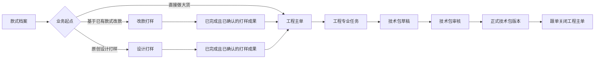
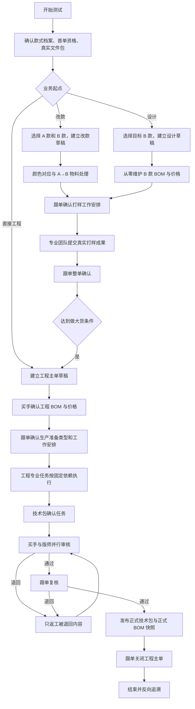
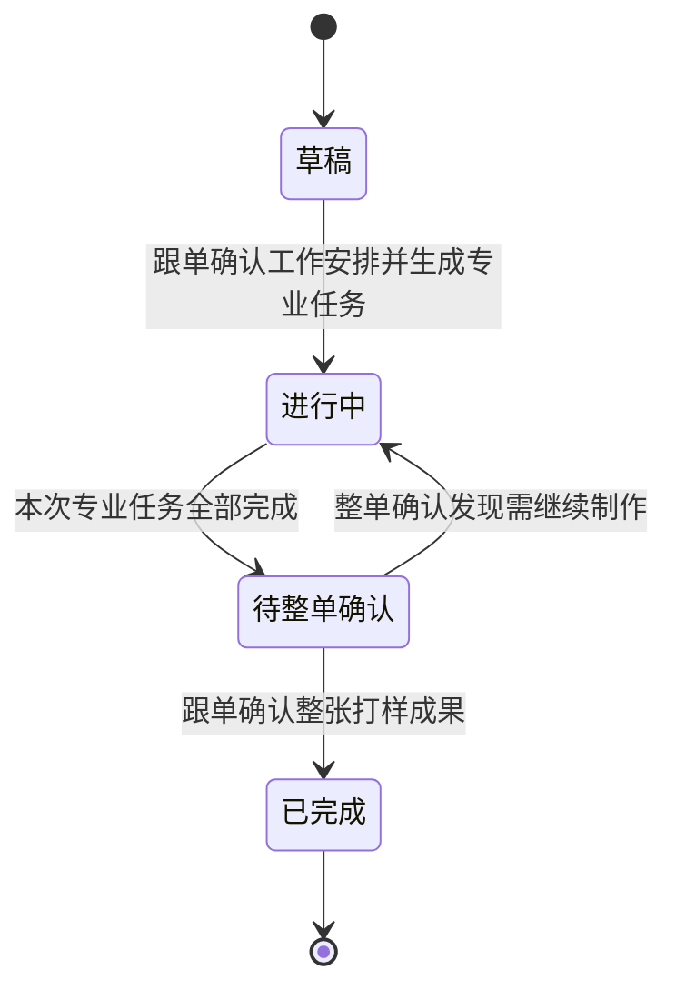
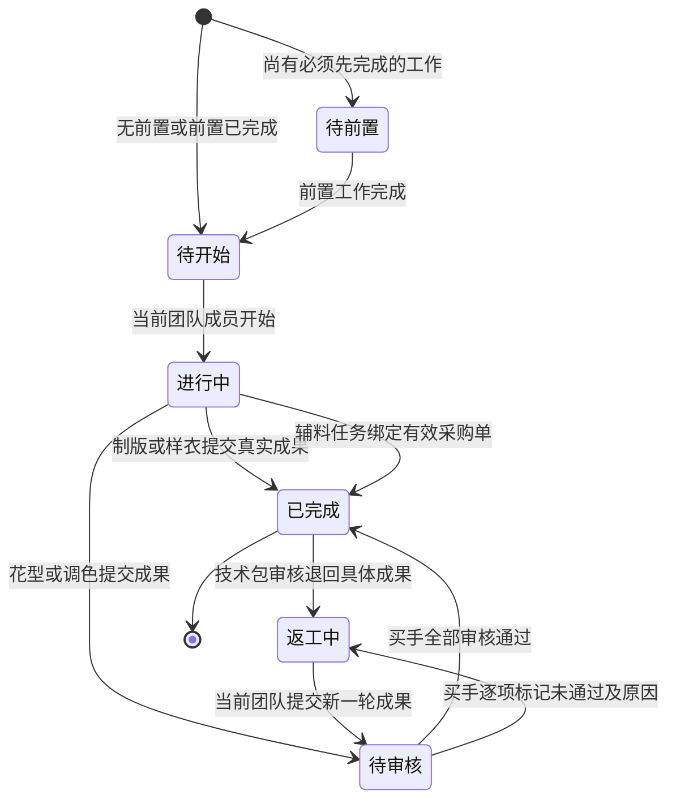
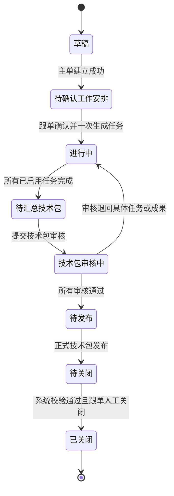
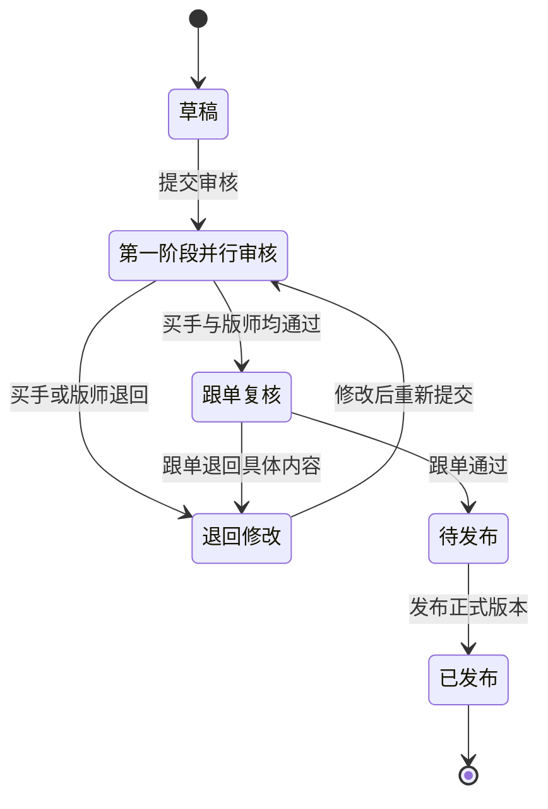
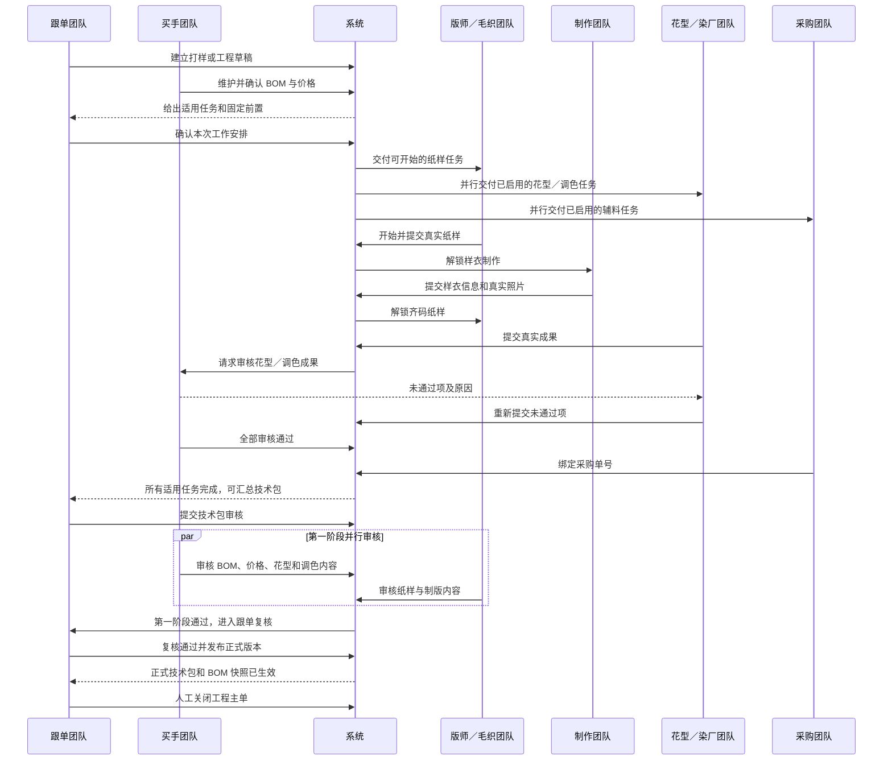

# PCS 生产工程管理全流程测试方案与实际案例

| 文档信息 | 内容 |
| --- | --- |
| 文档版本 | V1.0 |
| 编制日期 | 2026-08-12 |
| 测试基线分支 | `codex/pcs-engineering-v4` |
| 测试基线提交 | `f6933c301822cd5b070b4b85f053caaf3e79291a` |
| 对照发布基线 | `main@a9837eda5c9d9921e11fa62c8ee8ba72b224b554` |
| 适用范围 | PCS 改款打样、设计打样、工程主单、专业任务、BOM 与价格、技术包审核发布、生产准备时效 |
| 不包含 | 工程变更、正式生产单执行、工厂大货生产、老任务迁移 |
| 当前文档状态 | 测试方案已编制；六条完整业务链待按本文执行并填写实测结果 |

---

## 1. 文档目标

本文不是只验证按钮能否点击的页面清单，而是一套可以由产品、业务、研发和测试共同执行的业务全链路测试手册。

本文同时完成两件事：

1. **验证产品设计**：用六个具体款式案例，从业务发起一直走到正式技术包，确认对象、角色、顺序、门禁、交接和完成条件符合已经确认的业务规则。
2. **查漏补缺**：把实际操作结果与预期业务结果逐步对照，区分设计遗漏、实现问题、Mock 数据问题、测试资料问题和环境问题，形成可整改的问题台账。

本文至少覆盖：

- 2 条“直接建立工程主单”的完整链路；
- 2 条“改款打样 → 工程主单”的完整链路；
- 2 条“设计打样 → 工程主单”的完整链路；
- 6 条链路全部形成并发布各自的正式技术包版本；
- 6 张工程主单在正式技术包发布后由跟单关闭。

> 说明：这里的“2 个工程主单”指 2 条直接从工程主单开始的案例。两个改款和两个设计案例在打样完成、满足做大货条件后，也必须各自建立工程主单。因此整套测试最终应形成 **6 张工程主单、6 个正式技术包版本**。

### 1.1 业务依据

本文按以下文档中已经确认的业务事实编制：

- [PCS 生产工程管理总体设计文档](./PCS生产工程管理总体设计文档.md)
- [PCS 生产工程管理完整调整方案](./PCS生产工程管理完整调整方案.md)
- [PCS 生产工程管理实施计划](./PCS生产工程管理实施计划.md)
- [PCS 生产工程管理需求追踪与交付矩阵](./PCS生产工程管理需求追踪与交付矩阵.md)
- [PCS 生产工程管理 V4 逐项验收结果](./PCS生产工程管理V4逐项验收结果.md)

业务设计和用户最新确认优先于历史验收记录。历史记录只作为已有证据索引，不能替代本文六条业务链在当前版本的重新执行。

---

## 2. 测试结论的使用规则

### 2.1 不允许用局部通过代替全链路通过

- 构建通过，只说明代码可构建。
- 单个领域检查通过，只说明该条业务规则有自动化证据。
- 页面能打开，只说明路由和首屏可用。
- 只有从业务单建立、任务交接、真实成果提交、审核返工、技术包发布到主单关闭全部完成，才算该案例全流程通过。

### 2.2 结果状态

| 状态 | 含义 |
| --- | --- |
| 待执行 | 尚未开始实际操作 |
| 执行中 | 已开始，但未走完整条链路 |
| 通过 | 全部步骤、门禁、数据和证据均符合预期 |
| 失败 | 实际结果与已确认业务规则不一致 |
| 阻塞 | 缺少真实文件、权限、测试数据或环境，无法继续 |
| 不适用 | 本案例明确不涉及，且已写明原因 |

### 2.3 问题归类

| 问题类型 | 判定口径 | 示例 |
| --- | --- | --- |
| 产品设计问题 | 已确认规则本身不能覆盖真实业务，或不同规则互相冲突 | 已有成果到底能否替代产前版样衣没有明确口径 |
| 实现问题 | 规则已明确，但页面、数据或动作没有按规则工作 | 基码纸样完成后，产前版样衣仍然不能开始 |
| Mock 数据问题 | 页面能力存在，但演示数据无法覆盖场景或与对象不真实对应 | A、B 款只有相同颜色，无法自然测试新增颜色 |
| 测试资料问题 | 缺少真实可上传文件、采购单号或业务图片 | 仓库没有可用于验收的真实 `.prj` 文件 |
| 需求文档问题 | 研发、测试无法从文档判断对象、规则或完成条件 | 只写“完成技术包”，未写清三级审核和发布门禁 |
| 环境问题 | 代码与数据正确，但当前服务、浏览器或存储环境阻断 | 浏览器使用旧缓存，页面读取到上一次测试数据 |

发现问题时必须记录“实际业务影响”，不得只写“页面不对”或“报错”。

---

## 3. 测试范围与业务边界

### 3.1 本次验证范围

1. 款式档案存在和首单资格校验。
2. 改款打样和设计打样的建立、颜色处理、BOM 与价格、工作安排、专业任务、整单确认。
3. 工程主单的人工建立、唯一性校验、工作安排确认、固定依赖和一次生成任务。
4. 制版、销售展示样衣、产前版样衣、花型、调色、辅料下单、技术包确认等任务的真实推进。
5. 独立打样成果进入工程主单时的“沿用、重新制作、本次不用”。
6. BOM 标准单价、用量、数量、损耗、工艺要求、自定义费用、汇率展示和正式快照。
7. 技术包的买手与版师并行审核、跟单复核、退回返工、重新提交和正式发布。
8. 工程任务开始、提交、审核和完成时间同步到生产准备时效，且生产准备时效只读。
9. 正式技术包发布后，系统校验通过，由跟单人工关闭工程主单。
10. 当前需处理的团队筛选、真实图片、大图、真实文件上传、下载和历史轮次。

### 3.2 明确不在本次范围

- 工程变更和下一版技术包；
- 老任务、老数据迁移及兼容文案；
- 正式生产单、裁剪、车缝、质检、入库、发货；
- 大货实际染色和大货实际印花；
- 真实后端、接口、鉴权和数据库能力；
- 汇率历史变化；测试时只读取系统当前最新汇率。

### 3.3 业务对象关系



---

## 4. 角色、团队与交接原则

测试首先验证“当前轮到哪个团队”，团队成员真正开始该节点后，才记录本轮具体操作人。

| 团队 | 当前 Mock 身份 | 主要动作 | 完成后交给 |
| --- | --- | --- | --- |
| 跟单团队 | 跟单-林晓 | 建立业务单、确认工作安排、确认调色要求、整单确认、技术包复核、关闭主单 | 买手或相应专业团队 |
| 买手团队 | 买手-阿乐 | 维护 BOM 与价格、确认 A→B 物料处理、审核花型／调色成果、审核技术包 | 专业团队返工或跟单复核 |
| 版师团队 | 周师傅 | 制作和提交真实基码／齐码纸样；审核技术包纸样部分 | 制作团队、技术包 |
| 毛织团队 | 以页面实际显示为准 | 毛织基码和齐码纸样 | 制作团队、技术包 |
| 制作团队 | Lina | 制作销售展示样衣或产前版样衣，提交真实样衣信息和照片 | 跟单／后续纸样任务 |
| 花型团队 | 陈敏 | 制作花型并提交每项真实成果 | 买手审核 |
| 染厂团队 | Rudi | 根据已确认颜色要求提交真实色样 | 买手审核 |
| 采购团队 | 采购人员-阿昊 | 在采购系统下单，在 PCS 绑定采购单号 | 技术包汇总 |

### 4.1 交接必须验证的五个事实

每次交接都检查：

1. 当前由哪个团队处理；
2. 该团队当前要做什么；
3. 必须先完成什么；
4. 完成后交给哪个团队或解锁什么工作；
5. 实际开始、提交、审核和完成时间由本次真实动作产生。

---

## 5. 测试环境与执行前准备

### 5.1 版本与环境记录

执行前填写：

| 项目 | 实际值 |
| --- | --- |
| Git 分支 |  |
| Git 提交 |  |
| 本地／演示地址 |  |
| 浏览器及版本 |  |
| 屏幕分辨率 | 1366×768；补测 1280×720 |
| 测试开始时间 |  |
| 测试负责人 |  |
| 产品确认人 |  |

必须确认浏览器访问的服务就是上述分支和提交，不得在一个工作树修改、用另一个服务的页面验收。

### 5.2 数据隔离

六条链路应在独立测试浏览器配置或全新浏览器上下文中执行，避免个人日常演示数据互相污染。

建议分两轮：

- **第一轮：单案例隔离执行**。每个案例从清洁数据状态开始，验证自身流程。
- **第二轮：六案例共存执行**。不重置数据，验证列表、分页、筛选、唯一性、专业任务混合来源和正式技术包共存。

禁止直接清除全部业务浏览器数据。若使用原型重置能力，只允许重置 PCS 工程测试域，并在执行记录中保存重置前后时间和范围。

### 5.3 真实文件测试包

所有上传都必须通过本地文件选择器真实读取并保存。不得在控制台直接写文件名、URL 或数据地址。

| 资料类型 | 每案例准备 | 要求 | 当前仓库可用情况 |
| --- | ---: | --- | --- |
| 款式／样衣图片 | 至少 2 张 | `.jpg`／`.png`，非空，内容与款式、颜色对应 | `public/*-sample.jpg` 有图片，但执行前仍需人工确认对应关系 |
| 基码纸样 | 1 份／适用分支 | 真实 `.prj`；可附预览图 | 当前仓库未发现 `.prj`，执行前必须由版师提供 |
| 齐码纸样 | 1 份／适用分支 | 真实 `.prj`，必要时附 `.dxf`／`.rul`／`.pdf` | 当前仓库未发现，执行前必须由版师提供 |
| 花型源文件 | 每个成果 1 份 | 真实 `.ai`／`.psd`／`.pdf` 或允许格式，并有预览图 | 当前仓库未发现，执行前必须由花型团队提供 |
| 调色色样 | 每个颜色 1 张 | 真实色样照片，能辨认色号和颜色 | 执行前准备 |
| 错误文件 | 各 1 份 | 空文件、错误扩展名、超限文件，用于阻断测试 | 执行前准备 |

每个文件记录：原文件名、扩展名、大小、SHA-256、提供团队、提供人、提供时间、用于哪个案例。真实文件包未准备齐全时，对应案例只能标记“阻塞”，不能用演示文件冒充通过。

### 5.4 文件命名建议

| 案例 | 基码纸样 | 样衣图 | 齐码纸样 | 花型／调色 |
| --- | --- | --- | --- | --- |
| EM-01 | `EM01-POLO-BASE-v1.prj` | `EM01-PRE-SAMPLE-BLACK.jpg` | `EM01-POLO-SIZE-v1.prj` | `EM01-FABRIC-BLACK.jpg` |
| EM-02 | `EM02-CARDIGAN-WOVEN-BASE-v1.prj`、`EM02-CARDIGAN-KNIT-BASE-v1.prj` | `EM02-PRE-SAMPLE-WHITE.jpg` | 两类齐码纸样 | `EM02-PATTERN-01.ai` |
| RV-01 | `RV01-BLAZER-BASE-v1.prj` | `RV01-DISPLAY-SAMPLE-BLACK.jpg` | 工程阶段另备齐码纸样 | `RV01-PATTERN-01.ai` |
| RV-02 | `RV02-PANTS-BASE-v1.prj` | `RV02-DISPLAY-SAMPLE-WHITE.jpg` | 工程阶段另备齐码纸样 | `RV02-COLOR-WHITE.jpg` |
| DS-01 | `DS01-JOGGER-BASE-v1.prj` | `DS01-DISPLAY-SAMPLE-BLACK.jpg` | 工程阶段另备齐码纸样 | `DS01-COLOR-BLACK.jpg` |
| DS-02 | `DS02-TSHIRT-BASE-v1.prj` | `DS02-DISPLAY-SAMPLE-WHITE.jpg` | 工程阶段另备齐码纸样 | `DS02-PRINT-01.ai` |

### 5.5 命名页面与路由

| 业务页面 | 路由 | 本文用途 |
| --- | --- | --- |
| 工程主单列表 | `/pcs/engineering/masters` | 新建、唯一性、列表、分页、团队筛选 |
| 工程主单详情 | `/pcs/engineering/masters/:id` | 工作安排、任务表、技术包和关闭 |
| 改款打样列表／详情 | `/pcs/engineering/revision-sampling`、`/pcs/engineering/revision-sampling/:id` | RV-01、RV-02 |
| 设计打样列表／详情 | `/pcs/engineering/design-sampling`、`/pcs/engineering/design-sampling/:id` | DS-01、DS-02 |
| 独立打样专业任务 | `/pcs/engineering/sampling-professional/:taskId` | 打样阶段真实成果执行 |
| 制版任务 | `/pcs/patterns/plate-making`、`/pcs/patterns/plate-making/:taskId` | 基码／齐码纸样 |
| 花型任务 | `/pcs/patterns/artwork`、`/pcs/patterns/artwork/:taskId` | 花型成果和买手审核 |
| 调色任务 | `/pcs/engineering/color`、`/pcs/engineering/color/:taskId` | 三阶段调色 |
| 辅料下单任务 | `/pcs/engineering/purchase`、`/pcs/engineering/purchase/:taskId` | 采购单绑定 |
| 技术包确认任务 | `/pcs/engineering/tech-pack`、`/pcs/engineering/tech-pack/:taskId` | 工程成果汇总和审核入口 |
| 产前版样衣任务 | `/pcs/samples/first-sample`、`/pcs/samples/first-sample/:taskId` | 产前版样衣执行 |
| BOM 与价格 | `/pcs/technical-data/bom-pricing`、`/pcs/technical-data/bom-pricing/:bomVersionId` | 每颜色 BOM 和成本 |
| 技术包列表 | `/pcs/technical-data/tech-packs` | 审核状态、正式版本、版本追溯 |
| 正式技术包详情 | `/pcs/products/styles/:styleId/technical-data/:technicalVersionId` | 正式内容和快照反查 |
| 生产准备时效 | `/fcs/production/preparation-timing` | 只读同步核对 |
| 生产准备时效统计 | `/fcs/production/preparation-timing-statistics` | 跨案例时效统计核对 |

---

## 6. 全流程测试方法

### 6.1 执行阶段

| 阶段 | 动作 | 输出 |
| --- | --- | --- |
| T0 基线核对 | 核对版本、路由、角色、款式、物料、测试文件 | 基线记录、阻塞项 |
| T1 建立业务对象 | 新建打样或工程主单草稿 | 业务单号、目标款式、来源 |
| T2 确认颜色与 BOM | 买手维护 B 款 BOM、成本与工艺要求 | 每颜色 BOM 草稿、成本结果 |
| T3 确认工作安排 | 跟单确认系统建议和固定依赖 | 一次生成的任务骨架 |
| T4 专业任务执行 | 各团队按前后关系开始、提交、审核、返工 | 真实成果、轮次、操作记录 |
| T5 转工程主单 | 独立打样整单确认后，满足做大货条件并建立主单 | 前期成果处理决定、工程任务 |
| T6 技术包汇总 | 所有适用任务完成，形成技术包草稿 | 完整技术包内容 |
| T7 审核与返工 | 买手和版师并行审核，跟单复核；必要时退回 | 审核意见、返工和重提记录 |
| T8 正式发布 | 审核通过并发布 | 正式技术包版本、正式 BOM 快照 |
| T9 主单关闭 | 系统校验后由跟单关闭 | 已关闭主单 |
| T10 反向核对 | 从正式版本回查来源、任务、文件、BOM 和时间 | 追溯结果、问题台账 |

### 6.2 总体流程



### 6.3 改款／设计打样状态图



### 6.4 专业任务状态图



### 6.5 工程主单状态图



### 6.6 技术包审核状态图



### 6.7 跨团队时序图



---

## 7. 六个实际案例总览

| 案例 | 业务起点 | 来源款 A | 目标款 B | 准备类型 | 核心验证点 | 最终产出 |
| --- | --- | --- | --- | --- | --- | --- |
| EM-01 | 直接工程主单 | 不适用 | `STYLE-PRJ-202603-012` Kaos Polos Premium 高端纯色T恤 | 纯梭织 | 面料／纱线调色、辅料采购、固定纸样主线 | 1 张已关闭主单 + 1 个正式技术包 |
| EM-02 | 直接工程主单 | 不适用 | `STYLE-PRJ-202604-011` 通勤薄款针织开衫 | 毛织＋梭织 | 双基码、双齐码、花型并行、技术包汇总门禁 | 1 张已关闭主单 + 1 个正式技术包 |
| RV-01 | 改款打样 | `STYLE-PRJ-202603-009` Rok Mini Plisket 百褶短裙 | `STYLE-PRJ-202603-010` Blazer Wanita Formal 女装正装外套 | 纯梭织 | A→B 颜色一对多、物料沿用／替换、成果沿用 | 1 个已完成改款 + 1 张已关闭主单 + 1 个正式技术包 |
| RV-02 | 改款打样 | `STYLE-PRJ-202603-007` Dress Wanita Casual 休闲连衣短裙 | `STYLE-PRJ-202603-008` 男士休闲长裤 | 纯梭织 | B 款新增颜色、重新染色、花型部分返工、主单重新制作决定 | 1 个已完成改款 + 1 张已关闭主单 + 1 个正式技术包 |
| DS-01 | 设计打样 | 不适用 | `STYLE-PRJ-202603-005` Celana Jogger Pria 运动裤 | 纯梭织 | 从零建立 BOM、销售展示样衣、调色三阶段、成果复用 | 1 个已完成设计 + 1 张已关闭主单 + 1 个正式技术包 |
| DS-02 | 设计打样 | 不适用 | `STYLE-PRJ-202603-003` 春季休闲印花短袖T恤 | 毛织 | 从零设计、花型多成果审核、技术包退回 BOM 后重提 | 1 个已完成设计 + 1 张已关闭主单 + 1 个正式技术包 |

> 若执行时某目标款不具备首单资格，不允许临时换款掩盖问题。先记录资格事实和原因；如果是 Mock 资格缺失，归入 Mock 数据问题，补齐后重跑同一案例。

---

## 8. 共用业务数据与计算口径

### 8.1 款式与规格

上述款式均来自当前款式档案 Mock。当前常见颜色为 Black、White，尺码为 S、M。执行前必须在款式档案中再次确认目标款存在、图片可见、缩略图可打开大图、规格档案可用。

### 8.2 可使用的真实物料 Mock

| 物料 SKU | 物料名称 | 类型 | 颜色／规格 | 计价单位 | 标准单价（人民币） |
| --- | --- | --- | --- | --- | ---: |
| `CNIDML360-white-1` | 经编8坑-C2813 | 面料 | white／主布 | Yard | 6.3800 |
| `CNIDML360-blue-1` | 经编8坑-C2813 | 面料 | blue／扩展色 | Yard | 6.5800 |
| `FAB-COTTON-180-WHT` | 纯棉毛织布 180g | 面料 | White／180g | 米 | 23.6000 |
| `FAB-COTTON-180-BLK` | 纯棉毛织布 180g | 面料 | Black／180g | 米 | 24.2000 |
| `THREAD-40S-002-WHT` | 缝纫线 40s/2 | 纱线 | White／40s/2 | 卷 | 0.3200 |
| `THREAD-40S-002-BLK` | 缝纫线 40s/2 | 纱线 | Black／40s/2 | 卷 | 0.3200 |
| `FLSZ26041134-blue` | 欧根纱刺绣蕾丝小花 | 辅料 | blue | PCS | 0.4600 |
| `FLSZ26041134-white` | 欧根纱刺绣蕾丝小花 | 辅料 | white | PCS | 0.4600 |
| `FLSZ26041135-sameasphoto` | 20.5cm 刺绣花边辅料 | 辅料 | sameasphoto | PCS | 5.8000 |
| `PKG-HANGTAG-STD` | 品牌吊牌 55×90mm | 包材 | 白卡黑字 | PCS | 0.1800 |

### 8.3 计算公式

```text
本次总需求量 = 单位用量 × 打样数量 ×（1 + 损耗率）
物料成本（CNY） = 本次总需求量 × 物料档案当前标准单价
综合成本（CNY） = 物料成本合计 + 自定义费用按当前汇率折算后的人民币金额
```

验证要求：

- 物料标准单价只读，来源于物料档案；买手不能在 BOM 中直接改标准单价。
- 草稿阶段读取最新标准单价；正式技术包发布时冻结快照。
- 自定义费用统一按整个 SPU 维护，币种为 IDR。
- 页面同时显示物料成本 CNY、自定义费用 IDR、系统当前汇率和折算后的综合成本。
- 不验证历史汇率，只记录发布当时页面显示的最新汇率。

---

## 9. 案例 EM-01：纯梭织直接工程主单

### 9.1 业务目的

验证一款没有前期改版／设计成果的首单款式，能否由跟单人工建立工程主单，并完成梭织纸样主线、面料与纱线调色、辅料采购、技术包审核发布和主单关闭。

### 9.2 基础数据

| 项目 | 测试值 |
| --- | --- |
| 目标 SPU | `STYLE-PRJ-202603-012` |
| 款式 | Kaos Polos Premium 高端纯色T恤 |
| 颜色／尺码 | Black、White；S、M |
| 建立方式 | 跟单人工建立 |
| 生产准备类型 | 纯梭织 |
| 建立原因 | 首次达到做大货条件，需要完成生产前工程准备 |
| 跟单 | 跟单-林晓 |

### 9.3 BOM 与价格数据

| B 款颜色 | 物料 SKU | 单位用量 | 打样数量 | 损耗率 | 本次总需求量 | 工艺／采购要求 |
| --- | --- | ---: | ---: | ---: | ---: | --- |
| White | `CNIDML360-white-1` | 1.60 Yard | 2 | 5% | 3.36 Yard | 不印花、不染色 |
| Black | `CNIDML360-white-1` | 1.60 Yard | 2 | 5% | 3.36 Yard | 需要面料调色，目标 Black |
| White | `THREAD-40S-002-WHT` | 0.02 卷 | 2 | 2% | 0.0408 卷 | 不染色 |
| Black | `THREAD-40S-002-WHT` | 0.02 卷 | 2 | 2% | 0.0408 卷 | 需要纱线调色，目标 Black |
| 两色 | `PKG-HANGTAG-STD` | 1 PCS | 2 | 0% | 各 2 PCS | 需要采购 |

自定义费用：车位费 15,000 IDR，作用于整个 SPU。

### 9.4 预期任务

1. 梭织基码纸样；
2. 产前版样衣；
3. 梭织齐码纸样；
4. 调色任务（纱线）；
5. 调色任务（面料）；
6. 辅料下单任务；
7. 技术包确认任务；
8. 花型任务不启用，并显示本次不需要印花。

### 9.5 操作步骤与预期

| 步骤 | 当前团队 | 操作 | 预期业务结果 | 必留证据 | 实测 |
| --- | --- | --- | --- | --- | --- |
| EM01-01 | 跟单 | 新建工程主单并选择目标 SPU | 建立草稿；记录系统生成主单号；同款不得再建第二张未关闭主单 | 草稿截图、主单号 |  |
| EM01-02 | 买手 | 为 Black、White 分别维护 BOM 和价格 | 两个颜色版本独立；标准单价只读；公式正确；显示 CNY、IDR、汇率 | BOM 截图、计算表 |  |
| EM01-03 | 跟单 | 选择“纯梭织”，查看系统建议 | 必做、条件启用、不适用和前置关系完整；依赖不可编辑 | 任务建议截图 |  |
| EM01-04 | 跟单 | 确认并生成任务 | 一次生成完整任务骨架；主单进入进行中 | 主单任务表 |  |
| EM01-05 | 版师 | 开始梭织基码纸样，上传真实 `.prj` 并提交 | 记录实际操作人和时间；任务完成；产前版样衣自动可开始 | 文件信息、下载哈希、日志 |  |
| EM01-06 | 制作团队 | 制作产前版样衣，上传 Black／M 真实照片并提交 | 任务完成；梭织齐码纸样自动可开始 | 样衣照片、大图、日志 |  |
| EM01-07 | 版师 | 上传齐码纸样并提交 | 纸样成果完成并进入技术包草稿 | 文件信息、技术包引用 |  |
| EM01-08 | 跟单 | 在两个调色任务分别确认颜色名称和潘通色号 | 未确认前染厂不能提交；确认后进入染厂处理 | 要求截图、操作记录 |  |
| EM01-09 | 染厂 | 分别上传纱线和面料真实色样 | 两张任务进入待买手审核 | 色样、大图、提交记录 |  |
| EM01-10 | 买手 | 先退回面料色样并说明偏色；纱线通过 | 面料任务返工，纱线完成；通过项不被重开 | 逐项审核截图 |  |
| EM01-11 | 染厂／买手 | 面料重新调色、提交，买手通过 | 面料任务完成，保留两轮成果 | 两轮对比、审核记录 |  |
| EM01-12 | 采购 | 在 PCS 绑定 `CG-260801-001` 和 `CG-260801-002` | 展示供应商、物料和数量；不在 PCS 重建采购单；任务完成 | 绑定前后截图 |  |
| EM01-13 | 系统／跟单 | 查看生产准备时效 | 只读显示主单任务的真实开始、提交、审核和完成时间 | 主单与时效对照 |  |
| EM01-14 | 跟单 | 打开技术包草稿并核对全部内容 | 纸样、样衣、BOM、调色、采购资料均有来源；缺一项不能提交审核 | 技术包模块截图 |  |
| EM01-15 | 买手＋版师 | 并行审核；均通过 | 两者可并行，未全部通过前跟单不能完成复核 | 两个审核记录 |  |
| EM01-16 | 跟单 | 复核并发布正式技术包 | 形成正式版本和正式 BOM／价格快照 | 正式版本号、快照 |  |
| EM01-17 | 跟单 | 关闭工程主单 | 系统校验所有适用任务和正式版本后允许关闭 | 关闭前后状态 |  |

### 9.6 必测边界

- 在主单未关闭时再次选择该 SPU 建立主单，应阻断。
- 未上传真实 `.prj` 时提交基码纸样，应阻断。
- 面料色样被退回后，技术包确认不得提前完成。
- 采购单号不存在或不可读取时，辅料任务不得完成。
- 技术包未发布时，主单不得关闭。

---

## 10. 案例 EM-02：毛织＋梭织直接工程主单

### 10.1 业务目的

验证同一款式同时需要毛织和梭织工程准备时，两类基码可以并行、产前版样衣必须等待两类基码、两类齐码可以在样衣完成后并行，花型和辅料任务可以与纸样主线并行。

### 10.2 基础数据

| 项目 | 测试值 |
| --- | --- |
| 目标 SPU | `STYLE-PRJ-202604-011` |
| 款式 | 通勤薄款针织开衫 |
| 颜色／尺码 | Black、White；S、M |
| 建立方式 | 跟单人工建立 |
| 生产准备类型 | 毛织＋梭织 |
| 建立原因 | 首次达到做大货条件，款式同时包含毛织主体与梭织拼接 |

### 10.3 BOM 与价格数据

| 颜色 | 物料 SKU | 单位用量 | 打样数量 | 损耗率 | 总需求量 | 要求 |
| --- | --- | ---: | ---: | ---: | ---: | --- |
| White | `FAB-COTTON-180-WHT` | 1.20 米 | 2 | 6% | 2.544 米 | 毛织主布，不印花 |
| Black | `FAB-COTTON-180-BLK` | 1.20 米 | 2 | 6% | 2.544 米 | 毛织主布，不印花 |
| 两色 | `CNIDML360-white-1` | 0.35 Yard | 2 | 5% | 各 0.735 Yard | 梭织拼接；White 用原色，Black 需调色 |
| 两色 | `FLSZ26041134-white` | 4 PCS | 2 | 0% | 各 8 PCS | 辅料采购；Black 款需要印花效果确认 |
| 两色 | `PKG-HANGTAG-STD` | 1 PCS | 2 | 0% | 各 2 PCS | 辅料采购 |

自定义费用：整烫费 20,000 IDR，作用于整个 SPU。

### 10.4 预期任务和依赖

- 梭织基码纸样、毛织基码纸样同时待开始；
- 产前版样衣等待两类基码全部完成；
- 梭织齐码纸样和毛织齐码纸样等待产前版样衣，解锁后可以并行；
- 花型任务、面料调色任务、辅料下单任务按 BOM 启用并与主线并行；
- 技术包确认等待全部已启用任务完成。

### 10.5 操作步骤与预期

| 步骤 | 当前团队 | 操作 | 预期业务结果 | 必留证据 | 实测 |
| --- | --- | --- | --- | --- | --- |
| EM02-01 | 跟单／买手 | 建立主单、维护两色 BOM | 毛织和梭织物料分别可识别，成本按各自单位计算 | 主单号、BOM |  |
| EM02-02 | 跟单 | 选择毛织＋梭织并确认任务 | 同时生成双基码、样衣、双齐码及条件任务 | 任务表 |  |
| EM02-03 | 版师／毛织团队 | 分别开始双基码任务 | 两任务可并行；产前版样衣仍待前置 | 状态对照 |  |
| EM02-04 | 版师 | 只完成梭织基码 | 产前版样衣仍不能开始，并显示还等待毛织基码 | 前置文案 |  |
| EM02-05 | 毛织团队 | 完成毛织基码 | 产前版样衣自动转为待开始 | 状态变化 |  |
| EM02-06 | 制作团队 | 提交产前版样衣和真实照片 | 双齐码同时解锁 | 大图、状态变化 |  |
| EM02-07 | 版师／毛织团队 | 并行完成双齐码 | 两份真实文件分别进入技术包 | 文件和技术包引用 |  |
| EM02-08 | 花型团队／买手 | 提交两项花型成果；买手整张审核通过 | 每项结果可辨认；整张全部通过后任务完成 | 审核明细 |  |
| EM02-09 | 跟单／染厂／买手 | 完成 Black 梭织拼接面料调色三阶段 | 要求确认、调色提交、买手审核顺序不能跳过 | 三阶段日志 |  |
| EM02-10 | 采购 | 绑定有效采购单号 | 采购信息可读，任务完成 | 采购信息 |  |
| EM02-11 | 跟单 | 提交技术包审核 | 未完成双齐码前应阻断；完成后允许提交 | 阻断与成功证据 |  |
| EM02-12 | 买手／版师／跟单 | 完成三级审核并发布 | 正式版本包含双类纸样、花型和 BOM 快照 | 正式版本 |  |
| EM02-13 | 跟单 | 关闭主单并回查时效 | 主单关闭；时效仍能追溯各团队实际时间且只读 | 关闭状态、时效 |  |

### 10.6 必测边界

- 只选择后置齐码任务时，系统必须自动补齐适用的前置任务。
- 不允许取消必做双基码、产前版样衣、双齐码和技术包确认任务。
- “热转印／直接印花”准备类型不能与本案例任务计划混用。
- 技术包中两类纸样文件不得互相覆盖。

---

## 11. 案例 RV-01：同色系改款并沿用部分成果

### 11.1 业务目的

验证改款必须明确“基于什么 SPU、做成什么 SPU”，完成 B 款颜色和物料处理后才生成专业任务；改款成果确认后，在工程主单中逐项决定沿用、重新制作或本次不用。

### 11.2 基础数据

| 项目 | 测试值 |
| --- | --- |
| 来源款 A | `STYLE-PRJ-202603-009` Rok Mini Plisket 百褶短裙 |
| 目标款 B | `STYLE-PRJ-202603-010` Blazer Wanita Formal 女装正装外套 |
| 目标颜色／尺码 | Black、White；S、M |
| 改款原因 | 沿用已验证的部分面料与花型方向，调整版型、长度和成衣结构 |
| 打样工作 | 基码纸样、销售展示样衣、花型任务 |
| 工程准备类型 | 纯梭织 |

### 11.3 颜色和物料处理

| B 款颜色 | A 款参考颜色 | A 款物料处理 | B 款结果 |
| --- | --- | --- | --- |
| Black | A 款 Black | 主布沿用；辅料替换为 `FLSZ26041135-sameasphoto`；吊牌新增 | 形成 B-Black 独立 BOM |
| White | A 款 Black | 同一 A 色作为参考；主布改为 `CNIDML360-white-1`；蕾丝改为 `FLSZ26041134-white` | 形成 B-White 独立 BOM |

该表专门验证“一种 A 款颜色对应多个 B 款颜色”。每个 B 款颜色必须形成自己的处理结论，不允许只复制一份无归属的 A 款 BOM。

### 11.4 打样阶段步骤

| 步骤 | 当前团队 | 操作 | 预期业务结果 | 必留证据 | 实测 |
| --- | --- | --- | --- | --- | --- |
| RV01-01 | 跟单 | 新建改款，选择 A、B 款 | 两个 SPU 必须均已建档且不能相同；只建立草稿，不提前生成任务 | 改款号、款式信息 |  |
| RV01-02 | 买手 | 完成颜色对应和每条物料处理 | 所有结论归 B 款；未处理完时不能确认工作安排 | 处理表、阻断证据 |  |
| RV01-03 | 买手 | 核对 B 款 BOM、用量、损耗、标准价和自定义费用 | 两个颜色版本完整，标准价只读 | BOM 截图 |  |
| RV01-04 | 跟单 | 确认打样工作安排 | 系统自动补齐基码纸样；生成销售展示样衣和花型任务 | 任务列表 |  |
| RV01-05 | 版师 | 上传真实基码 `.prj` 并完成 | 销售展示样衣解锁 | 文件与状态 |  |
| RV01-06 | 制作团队 | 提交 Black、White 销售展示样衣照片 | 样衣任务完成；照片可大图查看 | 样衣图 |  |
| RV01-07 | 花型团队／买手 | 提交并审核花型成果 | 买手通过后花型任务完成 | 成果和审核 |  |
| RV01-08 | 跟单 | 整单确认 | 改款变为已完成；形成“已完成且已确认”的前期成果 | 整单状态 |  |

### 11.5 转工程主单步骤

| 步骤 | 当前团队 | 操作 | 预期业务结果 | 必留证据 | 实测 |
| --- | --- | --- | --- | --- | --- |
| RV01-09 | 跟单 | B 款达到做大货条件，建立工程主单 | 系统推荐最近一份已完成且已确认的改款成果 | 推荐来源 |  |
| RV01-10 | 跟单 | 基码纸样选择“沿用现有成果” | 工程主单记录来源，不重复生成基码任务 | 处理决定 |  |
| RV01-11 | 跟单 | 花型选择“沿用现有成果” | 已确认花型进入工程输入，不重复制作 | 处理决定 |  |
| RV01-12 | 跟单 | 销售展示样衣只能作为参考；产前版样衣选择“重新制作” | 系统仍生成产前版样衣，不能用销售展示样衣直接替代 | 任务计划 |  |
| RV01-13 | 制作团队／版师 | 完成产前版样衣和齐码纸样 | 工程主线完成 | 真实成果 |  |
| RV01-14 | 跟单 | 核对技术包草稿 | 沿用成果有明确来源；新成果为工程本轮产出 | 来源对照 |  |
| RV01-15 | 买手／版师／跟单 | 完成审核并发布 | 正式版本和 BOM 快照形成 | 版本信息 |  |
| RV01-16 | 跟单 | 关闭主单 | 所有适用任务和正式版本校验通过 | 关闭状态 |  |

### 11.6 必测边界

- A、B 选择同一 SPU 时应立即阻断。
- 任一 B 款颜色或物料未确认时，不得生成任务。
- 沿用成果必须显示来源打样单、成果版本和确认时间。
- 销售展示样衣不能直接满足产前版样衣。

---

## 12. 案例 RV-02：新增颜色、重新染色和部分返工的改款

### 12.1 业务目的

验证 B 款颜色与 A 款不完全一致时，系统不会错误地整单复制 A 款 BOM；同时验证花型多成果部分未通过、调色三阶段和进入工程主单后的“重新制作”决定。

### 12.2 基础数据

| 项目 | 测试值 |
| --- | --- |
| 来源款 A | `STYLE-PRJ-202603-007` Dress Wanita Casual 休闲连衣短裙 |
| 目标款 B | `STYLE-PRJ-202603-008` 男士休闲长裤 |
| B 款颜色 | Black、White |
| 改款原因 | 沿用部分面料逻辑，改为裤装结构，并重新确定颜色与花型 |
| 打样工作 | 基码纸样、销售展示样衣、花型、面料调色 |

### 12.3 颜色和物料处理

| B 款颜色 | A 款参考 | 处理 | 预期 |
| --- | --- | --- | --- |
| Black | A 款 Black | 主布沿用，单位用量调整为 1.45 Yard；花边不使用；新增吊牌 | B-Black BOM 只保留适用物料 |
| White | 不选择 A 款颜色，按“B 款新增颜色”处理 | 新增 `CNIDML360-white-1`；需要重新染色到目标暖白；新增 `THREAD-40S-002-WHT` | 不自动复制 A 款物料，形成独立 B-White BOM |

> 当前基础 Mock 普遍只有 Black／White。若页面无法把 White 明确标记为“无 A 款来源的新增颜色”，应记录为 Mock 数据或实现缺口，不能把“选择了同名 A 色”当作新增颜色通过。

### 12.4 操作步骤与预期

| 步骤 | 当前团队 | 操作 | 预期业务结果 | 必留证据 | 实测 |
| --- | --- | --- | --- | --- | --- |
| RV02-01 | 跟单 | 建立改款草稿 | 展示 A→B 关系；不提前生成专业任务 | 改款号 |  |
| RV02-02 | 买手 | 完成 Black 沿用和 White 新增颜色处理 | 每条处理有 B 款归属；不使用项不进入 B 款 BOM | 处理表 |  |
| RV02-03 | 跟单 | 确认打样计划 | 按 BOM 启用基码、展示样衣、花型和面料调色 | 任务列表 |  |
| RV02-04 | 版师／制作团队 | 依次完成基码和展示样衣 | 串行解锁正确；真实文件可回查 | 文件、照片 |  |
| RV02-05 | 花型团队 | 一张任务提交“裤脚花型”和“口袋花型”两项成果 | 两项成果独立可审核 | 成果列表 |  |
| RV02-06 | 买手 | 裤脚通过，口袋不通过并填写原因 | 整张任务返工；通过项锁定，只有口袋进入下一轮 | 审核截图 |  |
| RV02-07 | 花型团队／买手 | 只重做口袋花型并通过 | 保留第一轮和第二轮，任务完成 | 轮次记录 |  |
| RV02-08 | 跟单／染厂／买手 | 维护暖白颜色要求、上传色样并审核 | 三阶段顺序正确，最终完成 | 三阶段记录 |  |
| RV02-09 | 跟单 | 整单确认改款 | 改款已完成，成果可被工程主单引用 | 整单状态 |  |
| RV02-10 | 跟单 | 建立工程主单并处理前期成果 | 基码选择“重新制作”；花型选择“沿用”；展示样衣仅参考；调色选择“沿用” | 逐项决定 |  |
| RV02-11 | 系统 | 生成工程任务 | 重新制作的基码进入任务；沿用成果不重复生成；产前版和齐码仍按主线生成 | 主单任务表 |  |
| RV02-12 | 各团队 | 完成工程任务并汇总技术包 | 新旧成果来源清楚，不混淆展示样衣和产前版样衣 | 来源对照 |  |
| RV02-13 | 审核团队 | 完成审核、发布、关闭 | 正式技术包发布，主单由跟单关闭 | 版本和状态 |  |

### 12.5 必测边界

- 花型一项通过、一项不通过时，任务不能显示全部完成。
- 第二轮不得覆盖第一轮文件和审核意见。
- 选择重新制作后，不得继续把旧基码当作工程完成依据。
- 选择本次不用的前期成果，不得用于满足必做前置。

---

## 13. 案例 DS-01：从零设计、调色后转工程

### 13.1 业务目的

验证设计打样不需要来源 SPU，但目标 SPU 必须先建档；买手从零维护目标款 BOM，系统根据 BOM 建议任务；打样成果确认后进入工程主单并选择沿用。

### 13.2 基础数据

| 项目 | 测试值 |
| --- | --- |
| 目标 SPU | `STYLE-PRJ-202603-005` |
| 款式 | Celana Jogger Pria 运动裤 |
| 设计原因 | 新设计运动裤，先制作销售展示样衣测款 |
| 颜色／尺码 | Black、White；S、M |
| 打样工作 | 基码纸样、销售展示样衣、面料调色 |
| 工程准备类型 | 纯梭织 |

### 13.3 BOM 与价格

| 颜色 | 物料 SKU | 单位用量 | 打样数量 | 损耗 | 总需求 | 要求 |
| --- | --- | ---: | ---: | ---: | ---: | --- |
| Black | `CNIDML360-white-1` | 1.50 Yard | 2 | 5% | 3.15 Yard | 重新染为 Black |
| White | `CNIDML360-white-1` | 1.50 Yard | 2 | 5% | 3.15 Yard | 原色使用 |
| Black | `THREAD-40S-002-BLK` | 0.02 卷 | 2 | 2% | 0.0408 卷 | 无染色 |
| White | `THREAD-40S-002-WHT` | 0.02 卷 | 2 | 2% | 0.0408 卷 | 无染色 |
| 两色 | `PKG-HANGTAG-STD` | 1 PCS | 2 | 0% | 各 2 PCS | 打样阶段不采购；工程阶段确认是否采购 |

自定义费用：设计打样车位费 18,000 IDR。

### 13.4 操作步骤与预期

| 步骤 | 当前团队 | 操作 | 预期业务结果 | 必留证据 | 实测 |
| --- | --- | --- | --- | --- | --- |
| DS01-01 | 跟单 | 新建设计打样，只选择目标款 | 不出现来源 SPU；目标未建档时阻断 | 设计号、目标款 |  |
| DS01-02 | 买手 | 从零维护两色 BOM 和费用 | 不自动带出其他款式的业务 BOM；标准价来自物料档案 | BOM 与成本 |  |
| DS01-03 | 跟单 | 确认工作安排 | 基码和销售展示样衣必做；面料调色按 BOM 启用 | 任务列表 |  |
| DS01-04 | 版师 | 完成基码纸样 | 销售展示样衣解锁 | 文件、状态 |  |
| DS01-05 | 制作团队 | 提交两色展示样衣 | 两色照片与对象对应；可查看大图 | 样衣图 |  |
| DS01-06 | 跟单 | 确认 Black 调色要求 | 颜色名称、潘通色号完整 | 要求记录 |  |
| DS01-07 | 染厂／买手 | 提交色样并审核通过 | 调色任务完成 | 色样、审核 |  |
| DS01-08 | 跟单 | 整单确认 | 设计打样完成；产生可推荐的已确认成果 | 整单状态 |  |
| DS01-09 | 跟单 | 达到做大货条件后建立工程主单 | 推荐该设计打样成果 | 推荐来源 |  |
| DS01-10 | 跟单 | 沿用基码和调色成果，产前版重新制作 | 不重复制作已沿用成果；仍建立产前版和齐码 | 任务计划 |  |
| DS01-11 | 各团队 | 完成剩余工程任务 | 生产准备时效同步真实节点时间 | 任务与时效对照 |  |
| DS01-12 | 审核团队 | 审核、发布技术包并关闭主单 | 正式 BOM 快照采用发布时标准价和汇率 | 正式版本、快照 |  |

### 13.5 必测边界

- 设计打样页面不应要求或展示来源 SPU。
- BOM 为空时不能确认工作安排。
- 无标准单价物料不能加入 BOM，并提示先维护标准单价。
- 买手以外角色不能维护 BOM 与价格。

---

## 14. 案例 DS-02：印花设计、技术包退回后重提

### 14.1 业务目的

验证原创印花款从设计打样开始，经过花型多成果审核、工程主单复用、毛织主线和技术包审核退回；被退回的 BOM／花型内容重开，其他已通过内容保持有效。

### 14.2 基础数据

| 项目 | 测试值 |
| --- | --- |
| 目标 SPU | `STYLE-PRJ-202603-003` |
| 款式 | 春季休闲印花短袖T恤 |
| 设计原因 | 新建印花 T 恤，制作直播销售展示样衣 |
| 颜色／尺码 | Black、White；S、M |
| 打样工作 | 基码纸样、销售展示样衣、花型任务 |
| 工程准备类型 | 毛织 |

### 14.3 BOM 与价格

| 颜色 | 物料 SKU | 单位用量 | 打样数量 | 损耗 | 总需求 | 要求 |
| --- | --- | ---: | ---: | ---: | ---: | --- |
| White | `FAB-COTTON-180-WHT` | 1.10 米 | 2 | 5% | 2.31 米 | 胸前印花 |
| Black | `FAB-COTTON-180-BLK` | 1.10 米 | 2 | 5% | 2.31 米 | 背部印花 |
| White | `THREAD-40S-002-WHT` | 0.02 卷 | 2 | 2% | 0.0408 卷 | 无染色 |
| Black | `THREAD-40S-002-BLK` | 0.02 卷 | 2 | 2% | 0.0408 卷 | 无染色 |
| 两色 | `PKG-HANGTAG-STD` | 1 PCS | 2 | 0% | 各 2 PCS | 工程阶段采购 |

自定义费用：印花打样费 25,000 IDR。

### 14.4 操作步骤与预期

| 步骤 | 当前团队 | 操作 | 预期业务结果 | 必留证据 | 实测 |
| --- | --- | --- | --- | --- | --- |
| DS02-01 | 跟单／买手 | 建立设计草稿并维护 BOM | 两色分别有印花要求，系统建议花型任务 | BOM、建议 |  |
| DS02-02 | 跟单 | 确认打样工作安排 | 生成毛织基码、销售展示样衣、花型任务 | 任务列表 |  |
| DS02-03 | 毛织团队／制作团队 | 完成基码和展示样衣 | 串行关系正确，真实成果可回查 | 文件、照片 |  |
| DS02-04 | 花型团队 | 提交“White 胸前图”和“Black 背部图”两项成果 | 每项包含预览和真实源文件 | 成果文件 |  |
| DS02-05 | 买手 | 两项全部审核通过 | 花型任务完成 | 审核结果 |  |
| DS02-06 | 跟单 | 整单确认设计打样 | 设计已完成，可供后续工程引用 | 整单状态 |  |
| DS02-07 | 跟单 | 建立工程主单，沿用基码／花型，重新制作产前版 | 系统保留来源并生成毛织齐码、产前版、采购、技术包任务 | 主单任务表 |  |
| DS02-08 | 各团队 | 完成工程任务 | 所有工程成果进入技术包草稿 | 技术包内容 |  |
| DS02-09 | 跟单 | 提交技术包审核 | 买手与版师并行收到待审核 | 审核任务 |  |
| DS02-10 | 买手 | 退回 Black BOM 行，原因“印花位置与用量不一致”；其他内容通过 | 只解锁 Black BOM／关联花型目标；其他已通过内容保持有效 | 退回目标、意见 |  |
| DS02-11 | 买手／花型团队 | 修正 Black BOM 和关联花型成果后重提 | 仅受影响内容形成新轮次 | 前后对照 |  |
| DS02-12 | 买手＋版师 | 第一阶段全部通过 | 进入跟单复核 | 审核状态 |  |
| DS02-13 | 跟单 | 复核通过并发布 | 形成正式技术包；快照为修正后的 Black BOM | 正式版本、快照 |  |
| DS02-14 | 跟单 | 关闭主单 | 正式版本发布后才允许关闭 | 关闭状态 |  |

### 14.5 必测边界

- 花型任务没有真实源文件时不得提交。
- 技术包退回必须具体到 BOM 行、资料栏目、任务或成果项，不能整包无差别重开。
- 退回后旧正式内容不得被提前覆盖；只有新版本正式发布后生效。
- 买手与版师未全部通过时，跟单不能越过第一阶段直接发布。

---

## 15. 每个案例共用的逐项检查清单

### 15.1 列表与筛选

- [ ] 改款、设计、工程主单和各专业任务列表均有足够 Mock 行，分页工作正常。
- [ ] 每个专业任务列表只有一个“当前需处理的团队”筛选条件。
- [ ] 不出现“我的工程任务”入口、路由或文案。
- [ ] 改款打样、设计打样的页面骨架、列表密度、筛选和详情结构与制版等专业任务一致，同时保留各自业务字段差异。
- [ ] 同一专业列表能同时看到来源于独立打样、工程主单的任务，并清楚显示任务来源。

### 15.2 款式与物料图片

- [ ] 每个款式和每种物料均有与对象对应的真实图。
- [ ] 图片与名称、SPU／物料编码在同一信息块。
- [ ] 缩略图可点击查看大图，支持按钮、遮罩和 `Esc` 关闭。
- [ ] 大图保持比例，1366×768 和 1280×720 不溢出。
- [ ] 断开图片地址后有明确失败状态，不显示破图或无关占位图。

### 15.3 真实上传

- [ ] 所有文件均通过本地选择器读取。
- [ ] 正确格式、非空文件可保存、下载，下载后 SHA-256 与原文件一致。
- [ ] 错误扩展名、空文件、超限文件、读取失败均立即阻断并说明恢复动作。
- [ ] 已提交轮次只读；返工形成新轮次，不覆盖旧文件。
- [ ] 非图片文件显示“无图片预览”，不生成假预览。
- [ ] 正式技术包冻结原文件名、大小、团队、操作人、时间和真实文件内容。

### 15.4 团队接力

- [ ] 未开始前只显示当前团队，不预先编造具体负责人。
- [ ] 团队成员点击开始后记录该轮实际操作人。
- [ ] 当前动作、需要先完成、完成后去向全部使用业务名称。
- [ ] 前置完成后，后续任务自动解锁并切换当前团队。
- [ ] 并行任务可以同时待开始，互不阻塞。
- [ ] 当前需处理团队筛选与实际状态一致。

### 15.5 BOM 与价格

- [ ] 只有买手可以维护。
- [ ] 按目标款颜色分别形成草稿，行归属明确。
- [ ] 标准单价来自物料档案，不能直接修改。
- [ ] 无标准单价或标准单价失效时阻断加入／提交审核。
- [ ] 单位用量、打样数量、损耗和总需求量计算正确。
- [ ] 自定义费用为 IDR，作用于整个 SPU。
- [ ] 综合成本同时显示 CNY、IDR 和系统当前汇率。
- [ ] 草稿随最新标准价更新；正式发布时形成不可变快照。

### 15.6 技术包与关闭门禁

- [ ] 新业务不能绕过工程主单直接新增技术包。
- [ ] 技术包包含 BOM、纸样、样衣、花型、调色、工艺、采购关联等适用成果。
- [ ] 买手与版师并行审核，跟单在第一阶段全部通过后复核。
- [ ] 退回目标具体，未退回内容保持有效。
- [ ] 正式发布后形成版本和 BOM／价格快照。
- [ ] 技术包未正式发布时，工程主单不能关闭。
- [ ] 所有启用任务完成、依赖完整、正式版本有效后，只有跟单可以人工关闭。

### 15.7 正式技术包反向追溯

每个正式版本必须逐项反查：

| 正式内容 | 必须能追溯到 | 验证方法 |
| --- | --- | --- |
| 款式与颜色规格 | 当前目标款式档案和 SKU 档案 | 对比 SPU、颜色、尺码和图片 |
| BOM 与价格 | 该工程主单的各颜色 BOM 草稿 | 对比物料 SKU、用量、数量、损耗、标准价、自定义费用和汇率 |
| 正式成本 | 发布当时的标准价和汇率快照 | 发布后修改草稿或物料档案，再确认正式值不变 |
| 基码／齐码纸样 | 对应制版任务的已提交轮次 | 下载文件并对比 SHA-256、文件名、团队、人和时间 |
| 产前版样衣 | 工程主单的产前版样衣任务 | 对比颜色、尺码、数量、引用纸样和真实照片 |
| 花型 | 已通过的花型成果项 | 对比成果版本、位置、预览、源文件和买手审核意见 |
| 调色 | BOM 染色要求、跟单颜色要求、染厂色样和买手审核 | 对比三阶段记录，确认不是只保存最终图片 |
| 辅料采购 | 已绑定的有效采购单 | 对比单号、供应商、物料、数量和下单时间 |
| 工艺要求 | BOM 和工程成果中的印花、染色、水溶等要求 | 确认进入正确技术包模块，且未错误产生多余工程任务 |
| 审核结论 | 买手、版师、跟单三类审核节点 | 对比审核人、团队、时间、意见和退回目标 |

---

## 16. 跨案例专项测试

| 编号 | 专项 | 操作 | 预期 | 覆盖案例 |
| --- | --- | --- | --- | --- |
| X-01 | 同款唯一未关闭主单 | EM-01 未关闭时再次为同 SPU 建立主单 | 阻断并说明已有未关闭主单 | EM-01 |
| X-02 | 系统建立与人工建立同口径 | 分别进入两类来源主单 | 都先由跟单确认工作安排，任务规则一致 | EM-01、EM-02 |
| X-03 | 固定依赖不可调整 | 尝试取消必做任务或修改前置 | 不允许；选择后置时自动补齐前置 | EM-02 |
| X-04 | 并行与串行 | 同时开始双基码、花型和采购；只完成一个基码 | 并行可做，样衣仍等待另一基码 | EM-02 |
| X-05 | A 色一对多 | 一个 A-Black 同时作为 B-Black、B-White 参考 | 两个 B 色各自产生独立物料结论 | RV-01 |
| X-06 | B 款新增颜色 | B-White 不选择 A 色来源 | 允许新增，但必须从零维护该颜色物料 | RV-02 |
| X-07 | 前期成果三选一 | 对同一批成果分别选择沿用、重新制作、本次不用 | 来源、任务生成和前置满足结果均不同 | RV-02、DS-01 |
| X-08 | 展示样衣不替代产前版 | 沿用销售展示样衣后查看主单计划 | 产前版仍必须重新制作 | RV-01、DS-02 |
| X-09 | 调色三阶段 | 跳过跟单要求确认，直接由染厂提交 | 阻断；必须要求确认 → 染厂调色 → 买手审核 | EM-01、DS-01 |
| X-10 | 花型部分返工 | 一张任务两项成果，退回其中一项 | 任务返工；通过项锁定，未通过项新轮次 | RV-02 |
| X-11 | 采购单绑定 | 输入无效号和有效号 | 无效阻断；有效读取必要信息并完成 | EM-01、EM-02 |
| X-12 | 技术包审核退回 | 买手退回一条 BOM，版师通过纸样 | 只重开被退回内容，版师已通过结果保留 | DS-02 |
| X-13 | 正式快照冻结 | 发布后修改物料档案标准价 | 正式版本成本不变，草稿读取新价 | DS-01、DS-02 |
| X-14 | 生产准备时效只读 | 对照主单任务推进，并尝试在时效页面修改 | 时间同步；页面无独立修改入口 | 六案例 |
| X-15 | 当前团队筛选 | 每种任务分别筛选当前团队 | 仅显示当前轮到该团队处理的任务 | 六案例 |
| X-16 | 六案例共存 | 六条链执行后查看全部列表和分页 | 记录完整、来源明确、无串单和编号冲突 | 六案例 |
| X-17 | 热转印／直接印花准备类型 | 另建临时草稿选择该准备类型并查看计划，不进入正式六案例 | 只启用适用的花型、条件任务和技术包确认；不错误生成纸样与样衣主线 | 补充边界 |
| X-18 | 水溶要求边界 | 在 EM-02 BOM 维护对应工艺要求并确认任务 | 要求进入技术包工艺内容，不额外生成工程专业任务或时效准备项 | EM-02 |
| X-19 | 技术包建立入口 | 检查技术包列表和打样／主单详情 | 新业务不能绕过工程主单直接新增或导入历史技术包 | 六案例 |

---

## 17. 生产准备时效专项对照表

生产准备时效是工程主单执行事实的读取与统计线，不是第二套任务执行入口。

| 主单动作 | 时效页面预期 | 不允许出现 |
| --- | --- | --- |
| 任务生成但未开始 | 显示当前团队和计划时间，实际开始为空 | 虚构开始时间或具体个人 |
| 团队成员开始任务 | 同步实际开始时间和实际操作团队 | 人工在时效页面补写开始时间 |
| 任务提交成果 | 同步提交时间 | 与任务详情时间不一致 |
| 花型／调色进入买手审核 | 显示审核阶段和当前团队 | 把染厂提交直接当作完成 |
| 买手退回 | 显示返工阶段和新一轮 | 覆盖上一轮时间 |
| 任务完成 | 同步首次完成／本轮完成口径 | 在时效页面手工改成完成 |
| 主单关闭 | 保留完整历史统计 | 关闭后丢失过程时间 |

每个案例至少抽查 3 个任务；EM-01 和 EM-02 必须抽查全部启用任务。

---

## 18. 当前代码与 Mock 数据预审发现

以下是编制本文时已经通过当前代码和数据确认的测试风险。它们不是六条链已经实测失败的结论；必须在执行时验证并更新状态。

| 编号 | 已确认现状 | 初步分类 | 对全流程测试的影响 | 建议动作 |
| --- | --- | --- | --- | --- |
| GAP-001 | 现有自动化以领域和页面专项为主，尚未形成六个案例从业务单到正式技术包的连续回归 | 测试覆盖缺口 | 局部绿灯不能证明完整交接已贯通 | 以本文六案例补充端到端业务回归 |
| GAP-002 | 工程主单测试存储默认没有稳定的六案例种子，而独立打样有批量种子 | Mock／测试性问题 | 每次执行生成编号和状态可能不同，不利于复现 | 建立仅用于测试的确定性数据准备与重置方式 |
| GAP-003 | 当前仓库未发现真实 `.prj`、花型 `.ai`／`.psd` 等源文件 | 测试资料阻塞 | 无法真实验证纸样和花型源文件上传、下载与快照 | 由版师、花型团队提供真实非空文件并登记哈希 |
| GAP-004 | 独立打样默认 BOM 会选取“第一条有效且有价格的物料”，没有按目标款式业务相关性推荐 | 实现／Mock 设计风险 | 新建设计可能默认出现与目标款不相关的物料 | 六案例均核对默认行；若不相关必须删除并记问题，不得直接接受 |
| GAP-005 | 独立打样种子成果使用图片形式模拟多类专业成果，不能替代真实 `.prj` 和真实花型源文件 | Mock 数据问题 | 种子记录看似完成，但不能作为真实上传通过证据 | 六案例必须新建并真实上传；种子只用于列表和状态演示 |
| GAP-006 | 款式图片由有限图片池按编号分配，不保证每个款式一款一图 | Mock 素材问题 | 不同款式可能展示相同或不准确图片，违反对象真实对应门禁 | 执行前逐款人工核图；错误对应直接记录并补真实素材 |
| GAP-007 | 当前常用款式颜色主要是 Black／White、尺码主要是 S／M | Mock 数据覆盖不足 | 无法自然覆盖丰富的 A／B 不同色和新增色场景 | RV-02 先按新增色规则实测；若页面无真实数据支持，补一组明确不同色 Mock 后重跑 |
| GAP-008 | 已有 V4 验收记录覆盖规则和命名页面，但其基线早于本文当前对照提交 | 证据时效问题 | 历史“通过”不能自动继承为当前六案例结果 | 最后一次实质修改后重新执行本文涉及场景 |
| GAP-009 | 技术包审核、正式快照、主单关闭已有专项能力，但尚需验证由本次六条业务链实际产生的数据能否连续进入 | 集成验证缺口 | 可能出现各段单独可用、跨段对象关联断裂 | 每案例反向核对正式版本来源和主单关闭门禁 |

### 18.1 已确认存在的能力

当前代码已提供下列能力入口，本文重点验证它们能否在同一业务链中正确协作：

- 改款和设计独立建单，改款要求来源与目标不同，设计只要求目标款；
- 颜色对应、物料处理、BOM 草稿和系统任务建议；
- 工程主单首单资格、同款唯一未关闭主单、工作安排一次确认；
- 纯梭织、热转印／直接印花、毛织、毛织＋梭织四种准备类型；
- 固定前置、自动补齐和条件任务按 BOM 启用；
- 制版、样衣、花型、调色、采购、技术包任务推进；
- 花型和调色买手逐项审核与返工；
- 真实文件上传校验、保存、下载和技术包引用；
- 技术包两类并行审核、跟单复核、正式发布和 BOM 快照；
- 工程主单关闭门禁；
- 生产准备时效读取工程主单事实。

是否“完整可用”仍以六个实际案例的最终结果为准。

---

## 19. 产品设计验证问题

每个案例结束后，产品负责人必须回答以下问题，不允许只签“页面通过”：

1. 业务人员是否能在首屏判断当前轮到哪个团队、要做什么、先等什么、做完交给谁？
2. 改款的 A→B 颜色和物料关系是否符合真实业务理解？
3. 设计打样是否真正做到从 B 款事实出发，而不是借用一个无关来源款？
4. 销售展示样衣和产前版样衣是否始终清楚区分？
5. 系统建议是否减少了操作，而没有替业务人员做不可解释的决定？
6. 固定依赖是否符合已确认的生产准备顺序？
7. 条件任务是否确实由 BOM 需要触发，而不是靠款式名称猜测？
8. 团队交接是否顺畅，是否出现“上一个团队完成了，但下一个团队不知道要做什么”？
9. 审核退回是否精确到需要返工的内容，是否避免无关团队重复工作？
10. 正式技术包是否能反向解释每项内容来自哪个任务、哪一轮、哪个团队和哪份真实文件？
11. 生产准备时效是否只做记录统计，没有形成第二套维护入口？
12. 跟单关闭主单前，系统门禁是否足够且不过度复杂？

任一问题回答“否”，都必须形成问题单；不能以“后续优化”跳过业务影响说明。

---

## 20. 实际执行记录模板

### 20.1 六案例对象编号登记

| 案例 | 打样单号 | 工程主单号 | BOM 版本 | 技术包草稿版本 | 正式技术包版本 | 主单最终状态 |
| --- | --- | --- | --- | --- | --- | --- |
| EM-01 | 不适用 |  |  |  |  |  |
| EM-02 | 不适用 |  |  |  |  |  |
| RV-01 |  |  |  |  |  |  |
| RV-02 |  |  |  |  |  |  |
| DS-01 |  |  |  |  |  |  |
| DS-02 |  |  |  |  |  |  |

### 20.2 团队交接记录

| 案例 | 任务 | 当前团队 | 实际操作人 | 开始时间 | 提交时间 | 审核／完成时间 | 下一个团队 | 是否顺畅 |
| --- | --- | --- | --- | --- | --- | --- | --- | --- |
|  |  |  |  |  |  |  |  |  |

### 20.3 文件证据记录

| 案例 | 任务／资料 | 文件名 | 格式 | 大小 | SHA-256 | 上传团队／人 | 下载校验 | 正式版本是否冻结 |
| --- | --- | --- | --- | ---: | --- | --- | --- | --- |
|  |  |  |  |  |  |  |  |  |

### 20.4 发现问题记录

| 问题编号 | 案例／步骤 | 预期业务结果 | 实际结果 | 问题分类 | 业务影响 | 严重度 | 责任方向 | 修复版本 | 复测结果 |
| --- | --- | --- | --- | --- | --- | --- | --- | --- | --- |
|  |  |  |  |  |  |  |  |  |  |

严重度口径：

- **P0 阻断**：正式数据错误、不可逆错误或整条链路无法继续。
- **P1 严重**：角色、状态、对象、版本、成本或成果关联错误。
- **P2 一般**：存在可绕行的问题，但增加明显操作负担或误解风险。
- **P3 体验**：不影响业务结果，但文案、布局或反馈不清晰。

### 20.5 单案例结论

```text
案例编号：
执行版本：
执行时间：
最终结果：待执行／执行中／通过／失败／阻塞
正式技术包版本：
工程主单是否已关闭：
通过的业务门禁：
发现的问题：
未执行／不适用项及原因：
产品结论：
测试结论：
```

---

## 21. 需求—案例—证据追踪矩阵

| 业务规则 | 覆盖案例 | 最低证据 | 通过条件 |
| --- | --- | --- | --- |
| 改款必须有不同的 A、B 款 | RV-01、RV-02 | 建立页阻断和成功记录 | 同款阻断，不同款成功 |
| 设计只要求目标款已建档 | DS-01、DS-02 | 建立页和草稿 | 无来源款字段，目标未建档阻断 |
| BOM 只由买手维护 | 六案例 | 角色操作对照 | 非买手不能修改，买手可保存 |
| A→B 颜色和物料逐项确认 | RV-01、RV-02 | 对应表、B 款 BOM | 每个 B 色有独立结论 |
| 工作安排一次确认、任务一次生成 | 六案例 | 确认前后任务数量 | 确认前 0，确认后完整且不重复 |
| 固定依赖、缺前置自动补齐 | EM-01、EM-02 | 任务表和状态变化 | 不能调依赖，后置不能缺前置 |
| 未开始只显示团队，开始后记录个人 | 六案例 | 任务概要和日志 | 身份出现时点正确 |
| 制版／样衣提交即完成 | 六案例 | 提交前后状态 | 真实成果保存后完成，无额外任务审核 |
| 花型／调色由买手审核 | EM-01、EM-02、RV-02、DS-01、DS-02 | 逐项审核和返工轮次 | 全部通过才完成 |
| 调色三阶段 | EM-01、EM-02、RV-02、DS-01 | 三类角色日志 | 顺序不可跳过 |
| 辅料通过采购单号绑定 | EM-01、EM-02、DS-02 | 采购信息 | 有效号完成，无效号阻断 |
| 展示样衣不替代产前版样衣 | RV-01、RV-02、DS-01、DS-02 | 前期成果决定和主单任务 | 主单仍有产前版样衣 |
| 技术包必须经过现有审核流程 | 六案例 | 审核记录 | 买手＋版师通过后跟单复核 |
| 正式技术包冻结 BOM 和真实文件 | 六案例 | 发布前后快照和哈希 | 发布后草稿变化不改正式版本 |
| 生产准备时效只读同步 | 六案例 | 主单／时效对照 | 时间一致，无编辑入口 |
| 跟单人工关闭工程主单 | 六案例 | 关闭门禁和操作日志 | 正式版本发布且任务完成后才允许 |
| 当前需处理团队筛选 | 六案例 | 各专业任务列表 | 只保留一个团队筛选且结果正确 |
| 真实图片和大图 | 六案例 | 截图、失败态 | 对象对应、可放大、失败可见 |
| 真实上传和历史轮次 | 六案例 | 文件哈希、轮次 | 下载一致，返工不覆盖旧文件 |

---

## 22. 进入测试和退出测试门禁

### 22.1 进入测试条件

- [ ] 分支、提交和服务地址已确认一致。
- [ ] 六个目标款式和两个来源款式均能在款式档案找到。
- [ ] 每款图片与对象对应并可打开大图。
- [ ] 物料档案的标准单价和图片有效。
- [ ] 六案例真实文件包齐全并登记 SHA-256。
- [ ] 各团队测试身份可切换或可明确模拟。
- [ ] 测试数据隔离和重置方式已确认。
- [ ] 采购单测试号可读取，或已明确为 Mock 联动数据。

### 22.2 单案例退出条件

- [ ] 全部适用步骤有实际结果和证据。
- [ ] 所有专业任务完成，返工轮次可追溯。
- [ ] 技术包三级审核完成并正式发布。
- [ ] 正式 BOM／价格和文件快照可查。
- [ ] 生产准备时效与工程任务时间一致。
- [ ] 工程主单由跟单关闭。
- [ ] 失败、阻塞和不适用项均有说明，没有空白结果。

### 22.3 总体退出条件

只有同时满足以下条件，才能宣称“PCS 生产工程管理全流程已验证”：

1. 6 个案例全部达到“通过”；
2. 形成 6 个正式技术包版本和 6 张已关闭工程主单；
3. 六案例共存回归通过，无串单、编号冲突和分页遗漏；
4. 全部 P0、P1 问题已修复并在最后一次实质修改后重测；
5. P2、P3 问题有产品明确结论和计划；
6. 需求—案例—证据矩阵没有无说明空项；
7. 产品负责人确认设计结论，测试负责人确认执行证据；
8. 不使用历史截图、旧分支绿灯或 Mock 占位文件冒充当前证据。

---

## 23. 建议的自动化补充顺序

本文首先是业务测试手册，后续可按以下顺序把稳定场景自动化：

1. 建立“清洁测试数据 → 六案例固定输入”的测试数据准备器。
2. 自动化 EM-01，贯通主单、任务、技术包和关闭门禁。
3. 自动化 RV-01，重点覆盖 A→B 转换和前期成果沿用。
4. 自动化 DS-02，重点覆盖花型、多角色审核、退回和正式快照。
5. 补 EM-02 的双分支依赖、RV-02 的部分返工、DS-01 的调色三阶段。
6. 最后增加六案例共存、列表分页、当前团队筛选和反向追溯。

自动化可以读取固定测试文件，但仍必须保留至少一轮真实浏览器上传、大图、下载、低分辨率和业务团队接力验收。

---

## 24. 本文交付结论

本文已经把“2 个直接工程、2 个改款、2 个设计”展开为六条可以实际执行的业务链，并全部延伸到正式技术包发布和工程主单关闭。当前已经完成代码、路由、Mock 款式、物料和既有验收证据的预审，同时明确列出了现阶段的测试资料、Mock 数据和集成覆盖缺口。

本文不把未执行的六条业务链写成“已通过”。下一步应先补齐真实 `.prj`、花型源文件和逐款真实图片，再按 EM-01 → RV-01 → DS-01 → EM-02 → RV-02 → DS-02 的顺序执行；每发现一项问题，按本文问题分类和证据要求记录，修复后从受影响步骤向后重测，最后执行六案例共存回归。

### 24.1 2026-08-12 V4.1 已执行回归

本次调整已经执行两条改款／设计打样浏览器流程，但它们是对 V4.1 变化范围的专项验收，不等同于本文件定义的六条“直到正式技术包和关闭工程主单”的完整案例已经全部执行。

| 已执行流程 | 实际覆盖 | 结果 |
| --- | --- | --- |
| 改款打样专项 | 新建草稿、买手自定义目标颜色和尺码、参考／无参考 BOM、跟单退回、工作安排、专业任务、真实 `.prj`／JPEG、下载、大图、整单确认 | 通过 |
| 设计打样专项 | 与改款相同四步骨架、无 A 款参考关系、已完成步骤回看 | 通过 |
| 既有专业成果与技术包回归 | 产前版样衣、制版、调色、花型、技术包真实 Zip | 5／5 通过 |

因此，当前可声明“V4.1 改款／设计调整范围已验证”；仍不得把 EM-01～DS-02 六个完整业务案例标记为已执行或已通过。六案例继续按第 22 节退出门禁记录产品和测试结论。
