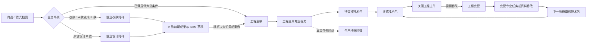
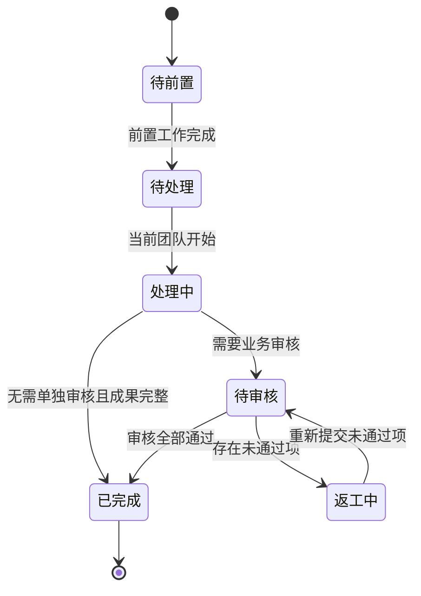
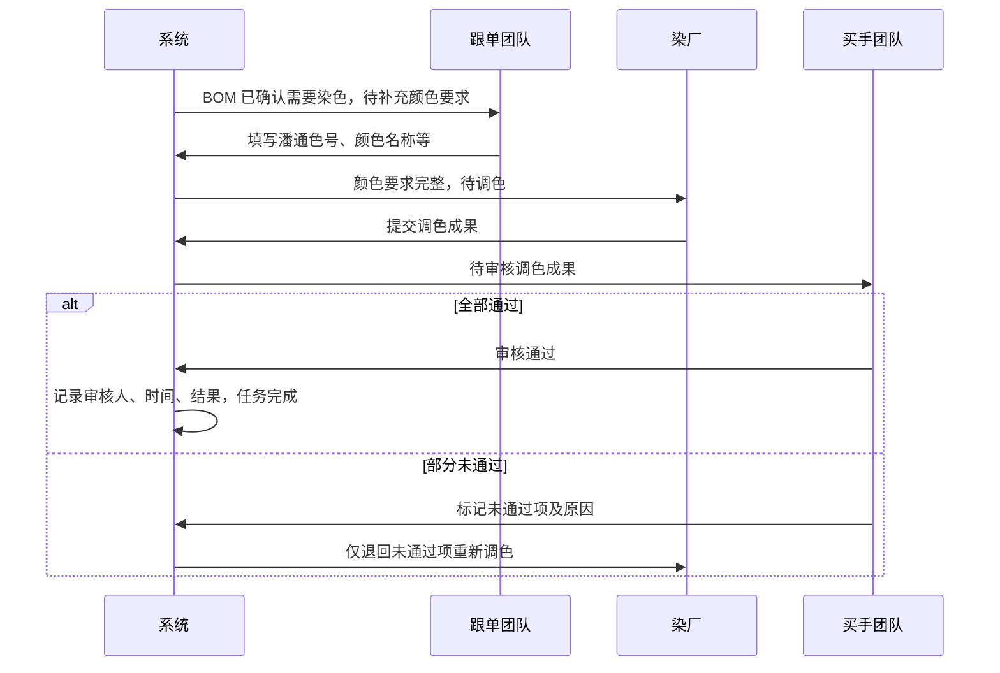
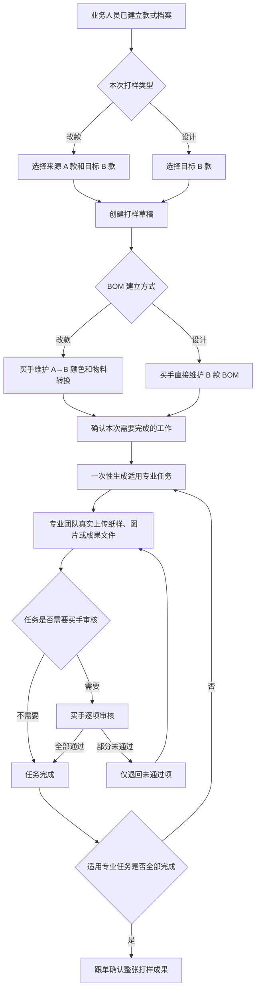
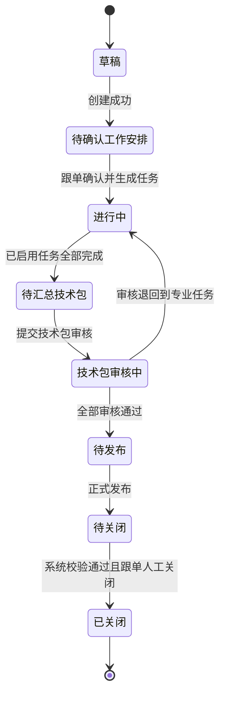
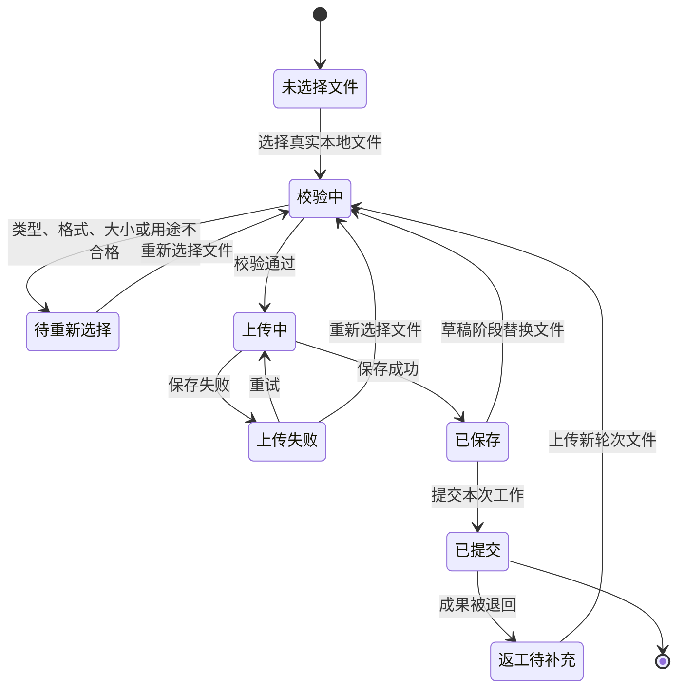
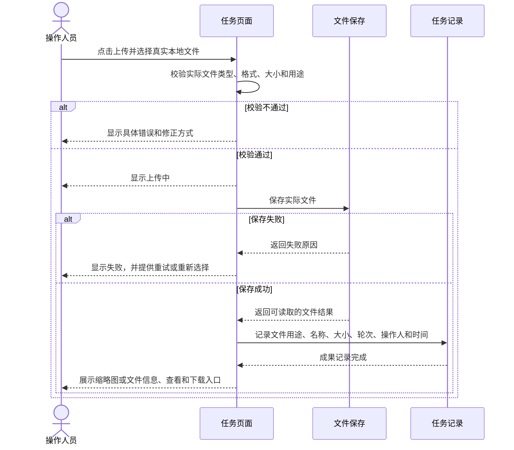
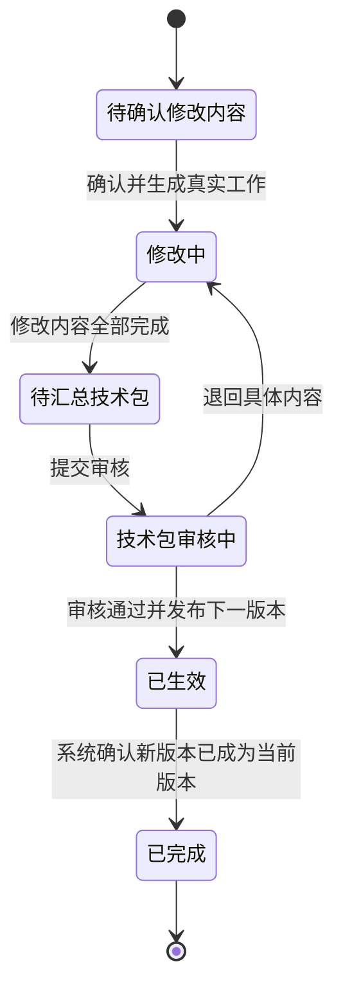
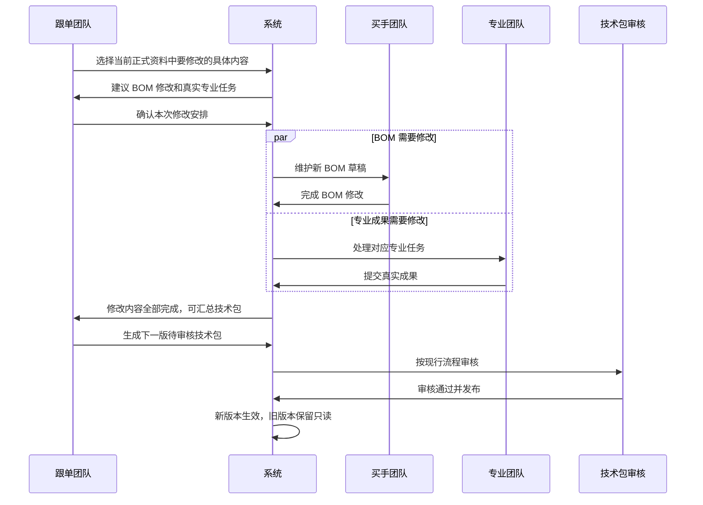

# PCS 生产工程管理完整调整方案

> 本文包含：当前原型事实、与当前相比的具体改动、调整后的完整业务方案、团队衔接规则、页面调整、状态与时序、Mock 场景及逐项验收要求。

| 文档信息 | 内容 |
| --- | --- |
| 文档版本 | V4.0 |
| 文档日期 | 2026-08-11 |
| 文档状态 | 已确认，V4 实施与验收的权威调整基线 |
| 适用系统 | 商品中心系统（PCS） |
| 适用范围 | 独立改款打样、独立设计打样、工程主单、BOM 与价格、专业任务、工程变更、技术包、生产准备时效 |
| 核查基线 | 当前 `main` 分支提交 `e1232195`；当前线上页面 `higoods.vercel.app/pcs/engineering/revision-sampling`、`higoods.vercel.app/pcs/engineering/design-sampling` 及现有 PCS 生产工程管理原型 |
| 后续动作 | 以总体设计、实施计划、需求追踪矩阵和逐项验收记录完成实现与证据闭环 |

---

## 1. 调整目标

本次调整不是给当前页面增加几个字段，而是把生产工程管理重新收口为一套业务人员容易理解、各专业团队能够顺畅接力、所有成果能够形成正式技术包的业务体系。

调整后的核心口径是：

1. 做大货前的改款、设计打样，与满足做大货条件后的工程主单，是两条不同路径。
2. 销售展示样衣与产前版样衣是两种不同成果，不得再合并或互相替代。
3. 改款必须说明“基于 A 款做成 B 款”，所有新成果和 BOM 都归属于 B 款。
4. BOM 不是简单复制 A 款，而是由买手逐颜色、逐物料确认如何形成 B 款。
5. 工程主单和独立打样都先形成工作安排，再由系统一次性建立专业任务骨架。
6. 专业任务按真实业务类型执行，不允许用通用弹窗填写一句说明就完成。
7. 当前责任先落到团队，不在任务开始前强行指定个人。
8. 团队成员完成实际动作后，系统再记录实际操作人、操作时间和结果。
9. 工程变更修改的是当前生效技术包中的真实内容；需要专业工作的，建立真实专业任务。
10. 所有来源的真实专业任务进入同一类专业任务列表，并明确标注来源。
11. 生产准备时效只读取工程主单任务的时间事实，不创建或管理任务。
12. 页面使用业务语言、标准管理表格和清晰动作，不展示系统内部概念或花哨流程图形。
13. 任务列表保持统一业务状态，只增加“当前需处理的团队”筛选，不建立“待本团队处理”等团队专属列表状态。
14. 所有图片、纸样和附件必须通过真实文件选择与上传形成成果，不允许用文件名、文件地址或一句成果说明冒充上传成功。
15. 改款打样和设计打样的列表、详情与交互样式，以制版任务等现有专业任务页面为统一基准；业务字段仍按改款和设计场景分别展示。

---

## 2. 与当前相比，改动在哪里

### 2.1 总体差异表

| 调整编号 | 当前原型／当前文档 | 调整后 | 改动性质 |
| --- | --- | --- | --- |
| ADJ-001 | 改款、设计、工程主单、工程变更虽然都有页面，但任务来源和成果边界仍有混用 | 明确三条路径：独立改款／设计打样、工程主单、工程变更；三者来源、目的、结果分别记录 | 业务对象调整 |
| ADJ-002 | 使用“版衣／销售展示样衣”混合名称 | 统一改为“销售展示样衣任务”；工程主单中的任务单独叫“产前版样衣任务” | 名称与业务边界调整 |
| ADJ-003 | 新建独立打样时直接让跟单勾选专业任务 | 新建时只选择业务对象和基本原因；进入详情后按系统建议确认本次工作安排 | 操作顺序调整 |
| ADJ-004 | 当前默认勾选前三个专业任务，缺少真实判断依据 | 基码纸样、销售展示样衣按打样目的和款式事实建议；花型、调色按 B 款 BOM 要求建议 | 建议规则调整 |
| ADJ-005 | 当前按目标款颜色自动建立 BOM 空壳；没有 A 款颜色到 B 款颜色的对应 | 改款先维护颜色对应，再逐行决定物料沿用、替换、重新染色、重新印花、不使用或新增 | 核心业务补齐 |
| ADJ-006 | 当前 BOM 只会推荐目标 SPU 自身同颜色的历史版本 | 改款可引用 A 款最近一份已完成且已确认的 BOM 作为参考，但必须转换成 B 款 BOM | BOM 来源调整 |
| ADJ-007 | 当前可能把 A 款物料原样复制给 B 款 | A 款只作参考；B 款每条物料都必须有明确处理结论，最终归属于 B 款 | 归属规则调整 |
| ADJ-008 | 当前任务和旧文档要求预先指定个人负责人 | 任务节点只确定当前处理团队；不要求预先指定个人 | 责任模型简化 |
| ADJ-009 | 当前数据存在用团队名称拼接虚拟个人负责人的情况 | 删除虚拟负责人；只有真实动作发生后才记录实际操作人 | 数据真实性调整 |
| ADJ-010 | 当前专业列表和旧文档强调“我负责的任务”，旧方案又增加“待本团队处理”等团队专属状态 | 保留统一任务列表和正常业务状态；筛选区只增加“当前需处理的团队” | 列表入口调整 |
| ADJ-011 | 当前没有统一说明一项工作完成后如何交给下一团队 | 每个节点明确当前团队、当前动作、完成条件和完成后去向；满足条件后系统自动交给下一团队 | 团队衔接补齐 |
| ADJ-012 | 当前工程主单页面已改成任务展示，但仍突出负责人和内部节点 | 保留表格，改为任务、当前团队、当前动作、需要先完成、完成后去向、计划／实际、状态 | 主单页面调整 |
| ADJ-013 | 当前专业任务详情多为通用概要、通用成果名称和图片地址 | 每类专业任务使用自己的业务字段、成果内容、审核与返工规则 | 任务详情重做 |
| ADJ-014 | 当前专业任务前置条件可能展示原始任务编号 | 页面展示业务名称及来源，如“需要先完成：产前版样衣” | 文案调整 |
| ADJ-015 | 当前工程变更让用户勾选“受影响资料模块” | 改为选择“本次要修改的内容”，直接选择具体 BOM、颜色、纸样、花型、调色、样衣或技术资料 | 变更对象调整 |
| ADJ-016 | 当前把工艺、尺码、设计、附件、质量等栏目直接转换为临时任务 | 只有需要真实专业制作的内容才生成专业任务；普通技术资料在新技术包草稿中维护 | 任务生成调整 |
| ADJ-017 | 当前工程变更中的任务只存在变更详情，未进入专业任务体系 | 变更生成的制版、花型、调色、样衣等任务进入对应专业列表，并标注来源为工程变更 | 入口与事实源调整 |
| ADJ-018 | 当前工程变更任务由跟单开始、跟单填写一句成果说明后完成 | 真实专业任务由对应团队处理；BOM 由买手维护；技术资料由对应团队在技术包草稿中维护 | 执行方式调整 |
| ADJ-019 | 当前工程变更只区分进行中、待发布、已完成 | 改为待确认修改内容、修改中、待汇总技术包、技术包审核中、已生效、已完成 | 状态调整 |
| ADJ-020 | 当前来源主单任务与变更任务容易被理解为重复或互相覆盖 | 来源主单任务保留历史只读；变更任务形成新一轮工作，两者通过来源和版本区分 | 追溯规则调整 |
| ADJ-021 | 当前技术包已具备部分审核能力，但专业成果与退回对象的对应不够清晰 | 退回必须指向具体 BOM 行、资料栏目、专业任务或成果项，只重做被退回内容 | 返工闭环调整 |
| ADJ-022 | 当前生产准备时效仍展示个人负责人，并混有独立生成的模拟信息 | 只投影工程主单真实任务；显示责任团队和已发生的实际操作事实 | 时效事实调整 |
| ADJ-023 | 当前部分页面仍使用“系统建议专业任务、受影响资料模块、前置依赖”等系统词 | 统一改成“本次需要完成的工作、本次要修改的内容、需要先完成”等业务词 | 术语调整 |
| ADJ-024 | 当前 Mock 数据不能完整展示 A→B 用料转换、多团队接力、变更返工 | 补齐成组场景，覆盖颜色一对多、无来源颜色、部分退回、并行团队和多版本变更 | 演示数据调整 |
| ADJ-025 | 当前旧设计、实施计划、矩阵仍保留个人指派等已失效口径 | 本方案确认后，三份权威文档同时更新，并把冲突条目改为待实施／待验证 | 文档治理调整 |
| ADJ-026 | 当前部分任务以图片地址、文件名、通用输入框或弹窗说明模拟成果提交 | 所有图片、`.prj` 纸样及其他附件均使用真实文件选择和上传；上传结果可查看、下载、追溯，失败时不得推进任务 | 成果真实性调整 |
| ADJ-027 | 当前改款打样、设计打样与制版等专业任务页面在标题、筛选、表格、详情骨架和操作反馈上不一致 | 以制版任务等专业任务页面为样式和交互基准，统一列表及详情骨架；保留 A→B、目标款、BOM 等业务差异 | 页面一致性调整 |

### 2.2 当前正确且继续保留的内容

以下能力方向正确，本次不推翻，只做业务补强：

1. 改款要求来源 SPU 与目标 SPU 同时存在且不能相同。
2. 设计打样要求目标 SPU 已存在；实际基于旧款修改时应走改款。
3. 工程主单仅用于满足做大货条件后的首单工程准备。
4. 同一 SPU 只允许存在一张未关闭的工程主单。
5. 工程主单创建后需要“系统建议＋跟单确认工作安排”。
6. 专业任务依赖关系固定，不允许业务人员拖动或调整。
7. 花型和调色最终由买手审核；未通过项返工，通过项保留。
8. 齐码纸样在任务提交完成后不单独审核，质量统一在技术包审核中判断。
9. BOM 与价格只由买手维护，物料标准单价来自物料档案。
10. 技术包只能从工程主单或工程变更形成。
11. 技术包继续使用当前线上审核流程。
12. 生产准备时效只读。
13. “我的工程任务”整体删除，不恢复。
14. 主单任务区继续采用表格，不恢复泳道图或花哨卡片图。
15. 团队仍是任务节点的责任单位，但列表不产生团队专属状态或团队专属页面。
16. 真实文件上传属于成果提交的必要动作，不以 Mock 文案或外部地址替代。

---

## 3. 范围与非范围

### 3.1 本次调整范围

1. 独立改款打样和独立设计打样。
2. A 款到 B 款的颜色和物料转换。
3. BOM 与价格草稿及正式版本。
4. 工程主单的创建、工作安排、任务生成、执行、技术包和关闭。
5. 制版、销售展示样衣、产前版样衣、花型、调色、辅料下单和技术包确认任务。
6. 工程变更的创建、修改内容、专业任务、新技术包版本和完成。
7. 专业任务列表、详情和团队接力。
8. 技术包审核、退回、发布和版本追溯。
9. 生产准备时效只读投影。
10. 页面文案、标准列表、真实文件上传、图片、Mock 和验收场景。

### 3.2 本次明确不做

1. 商品测款完整流程。
2. 样衣唯一条码、库存、借用、实物流转和退回。
3. 实际大货染色、印花和生产执行。
4. 在 PCS 中创建采购单。
5. 自定义任务类型、自定义依赖或拖拽编排。
6. 通用任务审批流。
7. 任务取消功能。
8. 个人接单、抢单、待指派、人员移交和个人工作台。
9. 异常中心、问题提报和异常处理模块。
10. 历史数据导入、迁移和兼容入口。
11. 从技术包列表直接新增或导入技术包。
12. 由生产准备时效创建、修改或安排任务。

---

## 4. 调整后的业务对象与关系

| 业务对象 | 用途 | 来源 | 最终结果 |
| --- | --- | --- | --- |
| 商品／款式档案 | 所有打样和工程工作的款式事实 | 业务人员提前建立 | 为打样、主单、BOM 和技术包提供唯一 SPU |
| 独立改款打样 | 基于 A 款做成 B 款并形成销售展示成果 | 已存在的 A、B 两个 SPU | B 款纸样、销售展示样衣、花型、调色和 B 款 BOM 草稿 |
| 独立设计打样 | 围绕 B 款原创打样 | 已存在的 B 款 SPU | B 款纸样、销售展示样衣、花型、调色和 B 款 BOM 草稿 |
| 工程主单 | 达到做大货条件后的首单工程准备 | 做大货资格事实或跟单人工创建 | 正式生产前成果和正式技术包 |
| 专业任务 | 专业团队真实执行的一项工作 | 独立打样、工程主单或工程变更 | 可进入技术包或供后续复用的专业成果 |
| BOM 与价格 | 记录一款商品各颜色的用料、用量、损耗、工艺和成本 | 独立打样、工程主单或工程变更 | 草稿 BOM；技术包生效后形成正式版本记录 |
| 技术包 | 汇总正式生产所需资料 | 工程主单或工程变更 | 审核通过并发布的正式版本 |
| 工程变更 | 已有正式技术包后的修改工作 | 当前生效技术包 | 新一版正式技术包 |
| 生产准备时效 | 记录首单工程准备的实际时间 | 工程主单任务事件 | 查询、统计和超时分析 |

### 4.1 总体业务流程图



### 4.2 三条路径不得混用

| 对比项 | 独立改款／设计打样 | 工程主单 | 工程变更 |
| --- | --- | --- | --- |
| 发生时点 | 达到做大货条件前 | 达到做大货条件后，首次正式生产前 | 工程主单关闭且正式技术包生效后 |
| 主要目的 | 做出销售展示成果，支持直播销售或继续判断 | 完成大货生产前工程准备 | 修改当前正式生产资料 |
| 核心样衣 | 销售展示样衣 | 产前版样衣 | 根据本次修改内容决定是否重新做产前版样衣 |
| 是否计入生产准备时效 | 否 | 是 | 否 |
| 技术包结果 | 形成可复用草稿成果，不直接形成正式技术包 | 形成首个正式技术包 | 形成下一版正式技术包 |

---

## 5. 团队责任与最简衔接规则

### 5.1 核心原则

本方案以团队作为任务节点的当前责任单位，个人只作为已经发生操作的审计事实。

任务开始前不预先指定个人，不引入以下概念：

- 待指派；
- 当前处理人；
- 下一处理人；
- 个人接单；
- 个人转派；
- 人员移交确认；
- “我的工程任务”。

页面只需要让业务人员一眼看懂四件事：

1. 现在轮到哪个团队；
2. 这个团队现在要做什么；
3. 做到什么程度才算完成；
4. 完成后交给哪个团队或解锁哪项工作。

### 5.2 统一任务列表与唯一团队筛选

所有专业任务保留在各自统一列表中，不按团队拆页面、拆 Tab、拆分组，也不创造“待本团队处理”“本团队处理中”“待本团队审核”“本团队返工中”等团队专属状态。

列表只增加一个筛选条件：**当前需处理的团队**。

| 筛选规则 | 要求 |
| --- | --- |
| 默认值 | 全部 |
| 可选项 | 当前数据中实际承担处理节点的团队，如跟单团队、买手团队、版师团队、花型团队、样衣制作团队、染厂、采购团队 |
| 专业任务列表口径 | 当前任务节点的责任团队等于所选团队 |
| 改款／设计打样及工程主单列表口径 | 只要单内任一项尚未完成的专业任务当前轮到所选团队处理，该业务单即命中；同一业务单可同时命中多个团队 |
| 已完成任务 | 已经没有待处理团队，只在“全部”结果中出现，不归入任何团队待办 |
| 与状态组合 | 与草稿、待前置、待处理、处理中、待审核、返工中、已完成、不适用等正常业务状态按“同时满足”组合 |
| 翻页规则 | 修改筛选条件后回到第 1 页 |
| 禁止做法 | 不增加“我的任务”“本团队任务”入口，不按当前登录人自动隐藏其他团队任务 |

“当前需处理的团队”只帮助查找当前轮到谁做，不改变任务状态，也不代替任务详情中的团队衔接信息。

### 5.3 任务节点展示

| 信息 | 展示规则 |
| --- | --- |
| 当前处理团队 | 由任务类型和当前节点自动确定 |
| 当前动作 | 使用业务动作短句，如“上传基码纸样”“填写潘通色号”“审核调色成果” |
| 需要先完成 | 展示业务任务名称，不展示内部编号 |
| 完成条件 | 展示当前节点必须提交或确认的内容 |
| 完成后去向 | 展示下一团队或被解锁的任务；无下一团队时显示“本任务完成” |
| 实际操作人 | 节点完成后记录当前登录人员；完成前不显示虚拟姓名 |
| 操作时间 | 节点完成后记录实际时间 |
| 操作结果 | 节点完成后记录提交内容、审核结论或绑定结果 |

### 5.4 自动接力

1. 当前节点未满足前置条件时，状态为“待前置”，不显示开始按钮。
2. 前置条件全部满足后，系统自动把任务交给对应团队，状态变成“待处理”。
3. 对应团队成员均可执行本团队动作，不要求先认领。
4. 团队提交的内容通过完整性检查后，系统记录实际操作人、时间和结果。
5. 如果当前节点还有下一团队，系统自动切换当前处理团队和当前动作，不增加“移交”按钮。
6. 花型、调色审核未通过时，任务自动回到制作团队，且只退回未通过项。
7. 多个任务可并行时，各任务分别显示自己的当前团队，不制造一个假的“总当前负责人”。
8. 主单顶部可以保留实际创建人和跟单协调人；专业任务节点不使用该人员代替专业团队。

#### 5.4.1 专业任务状态图



### 5.5 多团队自动接力时序图

以调色任务为例：



---

## 6. 独立改款打样

### 6.1 创建条件

1. “基于款式（A 款 SPU）”必须提前存在。
2. “做成款式（B 款 SPU）”必须提前存在。
3. A 款和 B 款不能是同一个 SPU。
4. A 款只作为参考来源，不被改写。
5. 所有新纸样、样衣、花型、调色和 BOM 都归属于 B 款。
6. 创建人为当前登录的跟单人员，系统记录创建人和时间。

### 6.2 创建页面调整

当前创建弹窗同时要求选择专业任务，并提示系统会按目标颜色自动生成 BOM。调整后：

| 当前字段／区域 | 调整后 |
| --- | --- |
| 基于款式（SPU） | 保留，显示 A 款真实图片、SPU、名称和颜色数量 |
| 做成款式（SPU） | 保留，显示 B 款真实图片、SPU、名称和颜色数量 |
| 跟单 | 只读显示当前登录人员，不允许手填 |
| 系统建议专业任务复选框 | 从创建弹窗移除 |
| “自动生成 BOM”说明 | 改为“创建后进入 B 款用料确认和本次工作安排” |
| 创建草稿 | 保留；创建后进入改款打样详情 |

### 6.3 创建后的步骤

1. 系统为 B 款建立“用料与成本（待完善）”工作草稿。
2. 买手维护 A 款颜色与 B 款颜色的对应。
3. 买手逐行确定 A 款物料如何形成 B 款物料。
4. 系统根据打样目的、款式类型和 B 款 BOM，建议本次需要完成的工作。
5. 跟单确认本次工作安排。
6. 系统一次性建立专业任务骨架和固定依赖。
7. 各团队按任务逐步处理。
8. 全部专业任务完成后，由跟单确认整张改款打样成果。

---

## 7. 独立设计打样

### 7.1 创建条件

1. B 款 SPU 必须提前存在。
2. 不选择来源 SPU。
3. 如果实际是基于某个旧款进行修改，必须改走“改款打样”。
4. 所有成果和 BOM 均归属于 B 款。

### 7.2 与改款的差异

| 项目 | 改款打样 | 设计打样 |
| --- | --- | --- |
| 是否有 A 款 | 必须有 | 没有 |
| BOM 建立方式 | 以 A 款为参考进行 A→B 转换 | 买手直接为 B 款建立 BOM |
| 页面是否展示 A→B 对比 | 是 | 否 |
| 专业任务 | 按打样目的和 B 款 BOM 生成 | 按设计目的和 B 款 BOM 生成 |

### 7.3 独立打样可用专业任务

独立打样的专业任务类型是受控清单，但不是每张单固定全部生成：

| 专业任务 | 何时需要 | 结果 |
| --- | --- | --- |
| 基码纸样任务 | B 款需要重新建立或修改基码纸样 | B 款基码纸样成果 |
| 销售展示样衣任务 | 需要制作直播／销售展示样衣 | B 款销售展示样衣成果 |
| 花型任务 | B 款 BOM 存在印花／花型需求 | B 款花型成果 |
| 调色任务（纱线） | B 款 BOM 存在纱线染色需求 | B 款纱线调色成果 |
| 调色任务（面料） | B 款 BOM 存在面料染色需求 | B 款面料调色成果 |

独立打样不生成：

- 齐码纸样任务；
- 产前版样衣任务；
- 大货辅料下单任务；
- 技术包确认任务。

### 7.4 销售展示样衣与产前版样衣

| 对比项 | 销售展示样衣 | 产前版样衣 |
| --- | --- | --- |
| 所属路径 | 独立改款／设计打样 | 工程主单或必要的工程变更 |
| 用途 | 直播间或销售展示、市场验证 | 大货生产前确认工艺和版型 |
| 形成时点 | 达到做大货条件前 | 达到做大货条件后 |
| 是否计入生产准备时效 | 否 | 是，仅工程主单来源任务 |
| 是否可以互相替代 | 不可以 | 不可以 |
| 是否可作为参考 | 可供工程主单查看和参考 | 不适用 |

原页面中的“版衣／销售展示样衣”必须统一改成“销售展示样衣任务”。

### 7.5 改款与设计打样页面统一基准

改款打样和设计打样仍是独立业务单，但其页面视觉和操作方式必须与制版任务、花型任务、调色任务等专业任务保持一致，不能再形成另一套页面习惯。

#### 7.5.1 列表页统一内容

| 页面区域 | 统一要求 |
| --- | --- |
| 页面标题区 | 左侧显示业务标题，右侧显示“新建改款打样”或“新建设计打样”；按钮尺寸、位置和层级与制版任务一致 |
| 筛选区 | 使用与制版任务一致的单行／紧凑筛选区；增加“当前需处理的团队”，不增加团队专属状态 |
| 结果摘要 | 使用统一的“共 N 条”摘要，不重复展示多个总数区域 |
| 表格 | 使用统一表头、行高、字号、状态标签、边框、图片规格和操作按钮 |
| 列设置 | 与制版任务一致，支持显示、顺序、冻结；必需业务列不可隐藏 |
| 分页 | 使用相同的每页条数、当前范围、页码和上一页／下一页样式 |
| 操作反馈 | 点击筛选、翻页、查看详情后立即反馈，不整页闪烁，不丢失滚动位置 |

视觉统一不得删除业务差异：

- 改款打样的款式列固定展示“基于款式 A → 做成款式 B”，两款均展示真实对应图片、SPU 和名称；
- 设计打样的款式列只展示目标款 B 的真实对应图片、SPU 和名称；
- 两类列表均可展示业务状态、专业任务进度、BOM 与价格状态、跟单、更新时间和详情入口；
- “当前需处理的团队”只放在筛选区，不建立“待本团队处理”等状态，也不强制新增团队专属列表列。

#### 7.5.2 详情页统一内容

详情页沿用专业任务页面的共同骨架：

1. 页面标题、状态和返回列表；
2. 款式对象摘要及真实图片；
3. 当前动作区；
4. 本次工作安排；
5. 专业任务表格；
6. BOM 与价格入口及状态；
7. 成果、真实附件和操作记录。

改款详情额外展示 A→B 颜色与物料转换；设计详情不展示不存在的 A 款。统一页面骨架不等于把两类业务字段强行做成相同。

### 7.6 独立打样业务流程图



---

## 8. A 款到 B 款的颜色与物料转换

### 8.1 先确认颜色对应

系统不能根据颜色名称、排序或相似文字自动判断 A、B 两款颜色关系。买手必须逐个 B 款颜色选择参考来源：

| B 款颜色 | 可选处理 |
| --- | --- |
| B 款红色 | 参考 A 款黑色 |
| B 款蓝色 | 参考 A 款黑色 |
| B 款米白 | 参考 A 款白色 |
| B 款新增色 | 无来源颜色，从空白建立 |

允许：

1. 一个 A 款颜色对应多个 B 款颜色。
2. B 款颜色不选择任何 A 款来源。
3. 不同 B 款颜色选择不同 A 款颜色。

不允许：

1. 仅凭“black／黑色”等文字自动对应。
2. 按颜色列表的第几行自动对应。
3. 把 A 款颜色名称直接替换成 B 款颜色名称后视为转换完成。

### 8.2 再确认每条物料如何处理

每个 B 款颜色下，买手对参考 A 款的每条物料选择一种处理方式：

| 处理方式 | 业务含义 | B 款需要确认的内容 |
| --- | --- | --- |
| 沿用同一物料 | A、B 使用完全相同的物料 SKU | B 款适用颜色、单位用量、损耗和工艺要求 |
| 替换为已有物料 | B 款使用物料档案中的另一个 SKU | 新物料 SKU 及其 B 款用量和要求 |
| 同坯布／胚料重新染色 | 使用同类基础物料，但 B 款需要新颜色 | 目标物料、染色标记、颜色名称、后续潘通色号 |
| 使用基础物料重新印花 | B 款需要新的花型或印花效果 | 目标基础物料、印花标记和花型任务要求 |
| 本次不用 | A 款有该物料，但 B 款不使用 | 不使用原因 |
| 新增物料 | B 款需要 A 款没有的物料 | 从物料档案选择新 SKU 并填写用量和要求 |

### 8.3 物料转换后的归属与追溯

1. B 款 BOM 是新的 B 款业务版本，不是 A 款 BOM 的别名。
2. 每一行保留参考来源：A 款 SPU、A 款颜色、A 款 BOM 版本、A 款物料行和物料 SKU。
3. 每一行记录处理方式、处理原因、确认团队、实际操作人和确认时间。
4. B 款物料必须来自物料档案。
5. 新物料没有标准单价时，不允许加入 B 款 BOM。
6. A 款后续发生变化，不自动改写已经形成的 B 款 BOM。
7. B 款单位用量、损耗和工艺要求即使从 A 款带入，也只能作为待确认内容，必须由买手确认。

### 8.4 页面结构

改款详情中的“用料与成本（待完善）”采用三步表格：

1. B 款颜色列表：选择每个 B 款颜色参考哪个 A 款颜色。
2. 物料转换表：逐行选择处理方式和目标物料。
3. B 款 BOM 预览：展示转换后的最终物料、用量、损耗、印花／染色要求和成本。

表格至少包含：

- A 款颜色；
- A 款物料图片、编码、名称、规格；
- A 款单位用量；
- 处理方式；
- B 款颜色；
- B 款物料图片、编码、名称、规格；
- B 款单位用量；
- 单位；
- 损耗率；
- 是否需要印花；
- 是否需要染色；
- 水溶要求；
- 转换说明。

### 8.5 转换示例

以 A 款黑色改为 B 款红色和蓝色为例：

| A 款物料 | B 款红色处理 | B 款蓝色处理 |
| --- | --- | --- |
| 黑色面布 A-001 | 同坯布重新染红，形成／选择 B-RED-001 | 同坯布重新染蓝，形成／选择 B-BLUE-001 |
| 黑色里布 A-002 | 替换为红色里布 B-RED-002 | 沿用黑色里布 A-002 |
| 黑色花边 A-003 | 本次不用 | 使用基础花边重新印花，选择 B-BLUE-003 |
| 吊牌 A-004 | 沿用同一物料 | 沿用同一物料 |

系统不得因为两个 B 款颜色都参考 A 款黑色，就把同一批物料原样复制两份并自动视为已确认。

---

## 9. BOM 与价格

### 9.1 BOM 在哪里建立

| 场景 | BOM 草稿建立方式 | 内容维护团队 |
| --- | --- | --- |
| 独立改款打样 | 创建改款草稿时系统建立 B 款 BOM 工作草稿；买手通过 A→B 转换完善 | 买手团队 |
| 独立设计打样 | 创建设计草稿时系统建立 B 款空白 BOM 工作草稿 | 买手团队 |
| 工程主单 | 优先承接 B 款最近一份已完成且已确认 BOM；无可用版本时建立待完善草稿 | 买手团队 |
| 工程变更 | 复制当前生效技术包内的正式 BOM，形成新版本草稿 | 买手团队 |

系统建立的是版本外壳，真正的用料内容只能由买手维护。

### 9.2 BOM 字段

每个颜色版本至少维护：

- 目标 SPU；
- 商品颜色；
- 适用 SKU；
- 物料类型；
- 物料编码；
- 物料名称；
- 物料图片；
- 规格；
- 单位用量；
- 单位；
- 损耗率；
- 打样数量；
- 本次总需求量；
- 是否需要印花；
- 是否需要染色；
- 染色对象类型；
- 水溶要求；
- 标准单价；
- 物料成本小计；
- 备注。

本次总需求量：

```text
本次总需求量 = 单位用量 × 打样数量 ×（1 + 损耗率）
```

### 9.3 标准单价门禁

1. 标准单价只从物料档案读取，币种为人民币。
2. 买手不能在 BOM 中修改标准单价。
3. 草稿阶段直接读取物料档案的最新标准单价。
4. 物料没有标准单价时禁止加入 BOM，并提示：

> 该物料暂无标准单价，无法加入。请先维护该物料的标准单价。

5. 已加入物料的标准单价失效时，该行标记“标准单价失效”，禁止提交技术包审核。
6. 技术包正式发布时才保存正式价格记录。

### 9.4 自定义费用与双币种成本

1. 自定义费用统一作用于整个 SPU，如车位费、特殊加工费。
2. 自定义费用只由买手维护，币种为印尼盾。
3. 汇率由系统配置统一维护，页面只读展示最新汇率。
4. 不处理汇率历史变化和手工选择汇率。
5. 综合成本同时显示：人民币物料成本、印尼盾自定义费用、最新汇率、折算人民币总成本、折算印尼盾总成本。

精度：

| 字段 | 精度 |
| --- | --- |
| 单位用量 | 4 位小数 |
| 标准单价 | 4 位小数 |
| 损耗率 | 2 位小数 |
| 人民币小计与总计 | 2 位小数 |
| 印尼盾金额 | 使用系统金额展示规则 |
| 汇率 | 使用系统配置精度 |

### 9.5 BOM 与条件任务

| BOM 事实 | 系统处理 |
| --- | --- |
| 存在印花／花型需求 | 启用花型任务 |
| 存在纱线染色需求 | 启用调色任务（纱线） |
| 存在面料染色需求 | 启用调色任务（面料） |
| 工程主单存在需要采购的辅料 | 启用辅料下单任务 |
| 对应需求全部移除且任务未开始 | 任务变为“不适用” |
| 对应任务已经开始 | 不删除任务；在原任务中形成新的需求轮次 |
| 已有成果项审核通过 | 通过项锁定；新增或变化项进入新轮次 |

任务骨架只建立一次；BOM 后续变化只调整任务适用性或任务内需求轮次，不重复生成同类型任务。

---

## 10. 本次工作安排确认

### 10.1 独立打样

系统建议分为两类：

1. 核心工作：根据打样目的和款式类型建议基码纸样、销售展示样衣。
2. 用料工作：根据 B 款 BOM 建议花型、纱线调色、面料调色。

跟单看到的是“本次需要完成的工作”，不是技术任务代码。

### 10.2 工程主单

工程主单创建后立即进入“确认工作安排”，但在确认前不得生成可执行任务。

页面应同时显示：

- 款式生产准备类型；
- 必做任务；
- 根据 BOM 启用的任务；
- 不适用任务及原因；
- 每项任务需要先完成什么；
- 前期成果可沿用、重新制作或本次不用的判断。

### 10.3 一次生成与固定依赖

1. 跟单确认后，系统一次性建立任务骨架。
2. 必做任务不得取消。
3. 选择后置任务时，系统自动补齐缺少的前置任务。
4. 依赖结构由业务规则固定，不允许调整。
5. 条件任务在任务骨架中保留适用状态，后续根据 BOM 启用或变为不适用。

---

## 11. 工程主单

### 11.1 创建条件

1. 目标商品／款式档案已存在且可用于正式生产。
2. 该款式此前没有正式售卖。
3. 该款式此前没有正式生产。
4. 已满足做大货条件，并有明确业务依据。
5. 同一 SPU 没有未关闭工程主单。

系统自动创建和跟单人工创建进入同一后续流程，不产生两套规则。

### 11.2 工作安排与前期成果

如果 B 款存在已完成且已确认的独立打样成果，系统推荐最近一份。跟单逐项选择：

| 选择 | 处理 |
| --- | --- |
| 沿用现有成果 | 把前期成果作为工程主单输入，并记录来源 |
| 重新制作 | 在工程主单建立对应专业任务 |
| 本次不用 | 该成果不进入主单；不能用于满足必做前置 |

销售展示样衣只能作为参考，不能直接满足产前版样衣任务。

### 11.3 固定任务主线

| 准备类型 | 固定串行主线 |
| --- | --- |
| 纯梭织 | 梭织基码纸样 → 产前版样衣 → 梭织齐码纸样 |
| 毛织 | 毛织基码纸样 → 产前版样衣 → 毛织齐码纸样 |
| 毛织＋梭织 | 梭织基码纸样＋毛织基码纸样 → 产前版样衣 → 梭织齐码纸样＋毛织齐码纸样 |

花型、调色和辅料下单可与纸样主线并行，但技术包必须等待全部已启用且适用的任务完成。

### 11.4 主单状态



### 11.5 主单详情表格

主单详情不使用泳道图。任务表格固定展示：

| 列 | 说明 |
| --- | --- |
| 任务 | 业务任务名称和任务号 |
| 阶段 | 基码、样衣、齐码、花型／调色、辅料、技术包 |
| 当前处理团队 | 当前轮到的团队 |
| 当前动作 | 当前团队需要做什么 |
| 需要先完成 | 业务前置任务名称 |
| 完成后去向 | 下一团队或被解锁工作 |
| 计划完成 | 统一时效规则计算的时间 |
| 实际时间 | 开始、提交、审核或完成时间摘要 |
| 状态 | 待前置、待处理、处理中、待审核、返工中、已完成、不适用 |
| 操作 | 进入专业任务 |

主单顶部保留主单号、款式、跟单协调人、状态、当前并行任务数和最后更新时间。

---

## 12. 专业任务统一体系

### 12.1 任务来源

每张专业任务必须明确“由哪张单发起”：

- 独立改款打样；
- 独立设计打样；
- 工程主单；
- 工程变更。

禁止没有来源业务单的孤立专业任务。

### 12.2 专业任务列表

所有真实专业任务进入对应类型的共享列表。例如：

- 主单产生的花型任务和工程变更产生的花型任务，都进入“花型任务”列表；
- 主单产生的制版任务和工程变更产生的制版任务，都进入“制版任务”列表；
- 独立打样产生的销售展示样衣进入“销售展示样衣任务”列表；
- 工程主单产生的产前版样衣进入“产前版样衣任务”列表。

列表至少展示：

- 任务号；
- 来源类型和来源单号；
- 款式真实图片、SPU 和名称；
- 任务类型；
- 当前处理团队；
- 当前动作；
- 状态；
- 计划完成；
- 最后更新时间；
- 详情入口。

列表使用统一业务状态，不创建团队专属状态。筛选区增加且只增加一个团队相关条件“当前需处理的团队”，具体口径遵循第 5.2 节。

专业任务常规筛选至少包括：

- 任务号／SPU／款式名称；
- 来源类型；
- 正常业务状态；
- 当前需处理的团队；
- 计划完成时间或更新时间。

### 12.3 专业任务详情首屏

详情首屏只突出：

1. 当前任务；
2. 当前对象；
3. 当前处理团队；
4. 当前动作；
5. 当前结果或缺少内容。

下方再展示来源、需要先完成、成果记录、审核记录、返工轮次和操作记录。

---

## 13. 各专业任务的具体规则

### 13.1 基码纸样任务

| 项目 | 要求 |
| --- | --- |
| 当前团队 | 版师团队或毛织团队 |
| 当前动作 | 制作并上传基码纸样成果 |
| 必填成果 | 真实上传的 `.prj` 纸样文件、纸样说明、版本、适用部位／尺码；必要图片同样真实上传 |
| 完成规则 | 制作团队提交完整成果即完成 |
| 审核 | 不在任务内审核；进入技术包后统一审核 |

### 13.2 销售展示样衣任务

| 项目 | 要求 |
| --- | --- |
| 来源 | 独立改款或设计打样 |
| 当前团队 | 样衣制作团队 |
| 当前动作 | 制作并提交销售展示样衣 |
| 必填成果 | 真实上传且与 B 款对应的实物图片、制作数量、颜色、尺码、使用的纸样版本、制作说明 |
| 完成规则 | 制作团队提交完整成果即完成 |
| 后续 | 供直播／销售展示和工程主单参考，不替代产前版样衣 |

### 13.3 产前版样衣任务

| 项目 | 要求 |
| --- | --- |
| 来源 | 工程主单，或确有必要的工程变更 |
| 当前团队 | 样衣制作团队 |
| 需要先完成 | 当前准备类型适用的全部基码纸样 |
| 当前动作 | 制作并提交产前版样衣 |
| 必填成果 | 真实上传且与当前款式对应的实物图片、制作数量、颜色、尺码、使用纸样版本、工艺说明 |
| 完成规则 | 制作团队提交完整成果即完成 |
| 后续 | 解锁适用的齐码纸样任务；成果进入技术包 |

### 13.4 齐码纸样任务

| 项目 | 要求 |
| --- | --- |
| 当前团队 | 版师团队或毛织团队 |
| 需要先完成 | 产前版样衣 |
| 当前动作 | 完成并上传齐码纸样 |
| 必填成果 | 真实上传的全尺码 `.prj` 纸样文件、尺码范围、版本、必要说明 |
| 完成规则 | 制作团队提交完整成果即完成 |
| 审核 | 在技术包审核中统一判断 |

### 13.5 花型任务

| 节点 | 当前团队 | 动作 | 完成条件 |
| --- | --- | --- | --- |
| 制作 | 花型团队 | 按 BOM 物料行制作并真实上传花型成果文件及预览图 | 所有本轮待制作项都有可查看、可下载的真实成果 |
| 审核 | 买手团队 | 整张任务审核；逐项标记通过／不通过 | 每项都有结论；未通过项有原因 |
| 返工 | 花型团队 | 只重做未通过项 | 未通过项重新提交 |

全部通过后花型任务完成；已通过项锁定并保留。

### 13.6 调色任务

纱线和面料分别建立任务，不得混在同一张任务中。

| 节点 | 当前团队 | 动作 | 完成条件 |
| --- | --- | --- | --- |
| 颜色要求 | 跟单团队 | 维护潘通色号、颜色名称和必要说明 | 所有待调色物料要求完整 |
| 调色 | 染厂 | 按颜色要求真实上传色样／调色成果图片及必要附件 | 所有本轮待调色项都有可查看的真实成果 |
| 审核 | 买手团队 | 整张任务审核；逐项标记通过／不通过 | 每项都有结论；未通过项有原因 |
| 返工 | 染厂 | 只重做未通过项 | 未通过项重新提交 |

买手在 BOM 中确认“是否需要染色”；跟单维护“具体染什么颜色”；染厂实际调色；买手审核成果。这四项责任不得混用。

### 13.7 辅料下单任务

1. 采购人员在采购系统创建采购单。
2. PCS 只绑定采购单号，不在 PCS 创建采购单。
3. 绑定后系统读取供应商、采购物料、数量、下单时间和采购状态。
4. 一张任务可以绑定多个采购单。
5. 所有需要采购的辅料行都被有效采购单覆盖后，任务完成。
6. 采购单状态失效或解除绑定时，重新计算覆盖情况。

### 13.8 技术包确认任务

1. 当前团队为跟单团队。
2. 当前动作是汇总已完成专业成果，生成待审核技术包。
3. 任务不得由人工按钮直接标记完成。
4. 技术包审核通过并正式发布后，技术包确认任务完成。
5. 技术包退回时，任务回到处理中，并显示退回的具体内容和入口。

### 13.9 全系统真实文件上传硬门禁

本规则适用于改款打样、设计打样、工程主单、工程变更、制版、销售展示样衣、产前版样衣、花型、调色、技术包及其他任何出现“上传”的页面。

#### 13.9.1 真实上传的定义

一次合格的上传必须同时满足：

1. 用户点击上传后打开真实的本地文件选择器；
2. 用户选择的是本地真实文件，不是手工填写文件名、文件路径或网络地址；
3. 系统读取并校验实际文件；
4. 页面明确显示校验、上传、成功或失败结果；
5. 上传成功后能够再次查看或下载原文件；
6. 系统记录文件用途、原文件名、格式、大小、提交轮次、实际操作人和操作时间；
7. 需要返工时形成新一轮成果，不覆盖已经提交过的历史文件。

以下行为一律不算真实上传：

- 输入图片 URL 后显示图片；
- 输入一个 `.prj` 文件名但没有选择实际文件；
- 点击按钮后直接生成“上传成功”的 Mock 提示；
- 用一段成果说明代替成果文件；
- 用通用占位图冒充用户刚上传的实物图；
- 上传失败后仍允许提交任务或改变任务状态。

#### 13.9.2 不同成果的文件要求

| 成果类型 | 必须真实上传的内容 | 上传后展示 |
| --- | --- | --- |
| 基码纸样 | 实际 `.prj` 纸样文件；有必要时附真实纸样图片 | 文件名、大小、版本、适用部位／尺码、上传人、上传时间、下载入口 |
| 齐码纸样 | 覆盖相应尺码范围的实际 `.prj` 文件 | 文件名、大小、尺码范围、版本、上传人、上传时间、下载入口 |
| 销售展示样衣 | 与当前 B 款实际对应的样衣图片 | 缩略图、高清大图、颜色、尺码、制作数量、上传人和时间 |
| 产前版样衣 | 与当前生产准备款式实际对应的产前版样衣图片 | 缩略图、高清大图、纸样版本、颜色、尺码、数量、上传人和时间 |
| 花型成果 | 实际花型成果文件及可视预览图 | 成果项、版本、预览、原文件下载、上传人和时间 |
| 调色成果 | 实际色样／调色成果图片及必要附件 | BOM 物料行、颜色名称、潘通色号、预览、原文件下载、上传人和时间 |
| 技术资料附件 | 实际附件文件 | 所属栏目、文件名、版本、大小、上传人、上传时间、下载入口 |

图片必须与当前款式、物料或成果真实对应。图片上传成功后应立即生成真实缩略图，点击可查看保持宽高比的高清大图；图片加载失败时显示明确失败状态，不得用无关占位图替换。

#### 13.9.3 校验与状态推进

1. 文件类型、实际格式、大小或必填用途不符合要求时，阻止上传并说明如何修正。
2. 上传开始后立即显示进度或处理中状态，避免重复点击。
3. 上传失败时保留当前任务和已填写内容，提供重试或重新选择文件。
4. 必填成果文件尚未成功保存时，“提交本次工作”“提交审核”或“完成”按钮不可推进状态。
5. 草稿阶段可删除或替换尚未提交的文件；提交后文件只读，返工通过新轮次补充新文件。
6. 删除或替换必须保留操作事实；已被技术包引用的正式成果不得直接删除。
7. 同一成果存在多份文件时，必须分别标明用途，不能只显示一个无法识别的附件数量。

#### 13.9.4 真实上传状态图



#### 13.9.5 真实上传时序图



---

## 14. 工程变更

### 14.1 当前问题

当前工程变更的主要问题不是页面难看，而是业务模型不对：

1. 把“BOM、纸样、工艺、尺码、设计、附件、质量”等资料栏目直接转换为一组临时任务。
2. 这些任务没有真正进入制版、花型、调色、样衣等专业任务列表。
3. 跟单可以开始临时任务，并用弹窗填写一句成果说明后完成。
4. BOM 修改没有真正进入 BOM 版本链。
5. “工艺资料修订、设计资料修订”等被包装成专业任务，但没有专业产出内容。
6. 变更依据仍容易回看来源主单，而不是明确以当前生效技术包为准。

### 14.2 工程变更真正修改什么

工程变更的唯一基线是该 SPU 当前正在使用的正式技术包，包括：

1. 当前正式 BOM 与价格；
2. 当前纸样成果；
3. 当前产前版样衣成果；
4. 当前花型成果；
5. 当前调色和颜色物料对应；
6. 工艺资料；
7. 尺码资料；
8. 设计资料；
9. 附件；
10. 质量要求。

因此，“本次要修改的内容”不只是主单的 BOM 和主单任务，也包括当前正式技术包中直接维护的技术资料。

### 14.3 哪些修改生成专业任务

| 本次修改内容 | 处理方式 |
| --- | --- |
| BOM 物料、用量、损耗、印花／染色要求、自定义费用 | 由买手在新 BOM 草稿中修改 |
| 基码／齐码纸样 | 建立真实制版任务 |
| 产前版样衣 | 建立真实产前版样衣任务 |
| 花型 | 建立真实花型任务 |
| 调色 | 建立真实调色任务（纱线或面料） |
| 普通工艺文字、尺码资料、设计说明、附件、质量要求 | 在下一版技术包草稿对应栏目中维护，不建立假的通用任务 |

BOM 修改后如果新增印花、染色或辅料采购需求，系统按 BOM 联动规则启用相应真实任务。

### 14.4 创建工程变更

创建页调整为：

1. 选择已关闭工程主单对应的目标 SPU。
2. 展示当前使用的正式技术包版本。
3. 填写变更原因。
4. 从当前正式资料中选择“本次要修改的内容”。
5. 选择必须具体到对象，例如某个颜色、某条 BOM 物料、某个纸样版本、某个花型成果。
6. 系统根据选择建议需要建立的真实专业任务。
7. 跟单确认后生成工程变更和相关任务。

### 14.5 变更专业任务是否进入专业列表

必须进入。

同一专业列表同时展示不同来源的真实任务，通过“来源”区分：

| 任务 | 来源示例 |
| --- | --- |
| 制版任务 | 工程主单 EM-013 |
| 制版任务 | 工程变更 EC-004 |
| 花型任务 | 独立改款打样 ES-R-008 |
| 花型任务 | 工程主单 EM-013 |
| 花型任务 | 工程变更 EC-004 |

来源主单中的原任务保持已完成和只读，不重新打开、不覆盖。工程变更产生的是新任务、新轮次和新成果。

### 14.6 工程变更状态



### 14.7 工程变更时序



---

## 15. 技术包与技术资料

### 15.1 创建边界

1. 技术包只能从工程主单或工程变更生成。
2. 技术包列表不提供“新增技术包”。
3. 不提供“导入历史技术包”。
4. 商品档案只查看技术包版本及来源，不创建新业务版本。

### 15.2 技术包内容

技术包至少汇总：

- BOM 与价格；
- 纸样成果；
- 产前版样衣成果；
- 花型成果；
- 调色成果和颜色物料对应；
- 工艺资料；
- 尺码资料；
- 设计资料；
- 附件；
- 质量要求。

技术资料菜单保留：

- 技术包；
- BOM 与价格；
- 花型库；
- 部位模板库。

不设置“技术包模板库”。技术包的资料结构直接由工程主单或工程变更中的 BOM、纸样、样衣、花型、调色、工艺、尺码、设计、附件和质量成果组成，不读取另一套模板，也不保留菜单、路由、页面或兼容入口。

### 15.3 审核与发布

1. 提交审核前先校验资料完整度、BOM 标准单价和必填成果。
2. 买手团队和版师团队按现行职责并行审核。
3. 第一阶段通过后，由跟单团队复核。
4. 全部审核通过后仍需明确发布，审核通过不等于已经发布。
5. 发布后形成正式技术包版本和正式 BOM／价格记录。
6. 旧版本保持只读，可查看版本差异和来源。

### 15.4 退回

退回必须选择具体对象：

- 某条 BOM 物料；
- 某个纸样成果；
- 某个样衣成果；
- 某个花型成果项；
- 某个调色成果项；
- 某个技术资料栏目。

系统只重新打开被退回的内容，保留已通过内容、原成果、退回原因、返工轮次和再次提交记录。

---

## 16. 生产准备时效

### 16.1 边界

1. 只接收工程主单来源任务。
2. 独立改款／设计打样不进入。
3. 工程变更不进入首单生产准备时效。
4. 时效页面不创建任务、不选择准备项、不修改依赖、不上传成果、不审核。

### 16.2 读取内容

| 时效内容 | 来源 |
| --- | --- |
| SPU、名称、主图 | 商品／款式档案 |
| 工程主单号、创建方式、做大货依据 | 工程主单 |
| 当前准备类型 | 工程主单确认结果 |
| 适用任务 | 工程主单任务骨架 |
| 当前处理团队 | 任务当前节点 |
| 开始、提交、审核、完成时间 | 任务实际动作记录 |
| 实际操作人 | 已发生动作记录；未发生时不显示虚拟姓名 |
| 当前等待原因 | 固定前置和当前节点 |
| 技术包结果 | 已发布技术包 |

时效系统只做记录和统计，不作为任务事实源。

---

## 17. 页面逐项调整

### 17.1 菜单

| 当前 | 调整后 |
| --- | --- |
| 工程主单 | 保留 |
| 工程变更 | 保留，重做业务内容和详情 |
| 改款打样任务 | 保留 |
| 设计打样任务 | 保留 |
| 制版任务 | 保留，共享展示全部来源真实任务 |
| 花型任务 | 保留，共享展示全部来源真实任务 |
| 调色任务 | 保留，共享展示全部来源真实任务 |
| 辅料下单任务 | 保留，仅工程主单／需要的工程变更来源 |
| 技术包确认任务 | 保留 |
| 产前版样衣任务 | 保留 |
| 版衣／销售展示样衣 | 改名为销售展示样衣任务，并与产前版样衣分开 |
| 我的工程任务 | 不存在且不恢复 |

### 17.2 独立打样列表

改款打样和设计打样列表以制版任务等专业任务列表为页面基准，不另做特殊卡片、独立视觉或另一套筛选交互。

统一部分包括：标题和新建按钮位置、筛选容器、结果摘要、表格样式、状态标签、图片尺寸、列设置、固定操作列、分页、空状态和操作反馈。

业务差异列包括：

| 页面 | 款式列 | 其他核心列 |
| --- | --- | --- |
| 改款打样 | 基于款式 A → 做成款式 B；两款均显示真实图片、SPU 和名称 | 状态、专业任务进度、BOM 与价格、跟单、更新时间、操作 |
| 设计打样 | 目标款 B 的真实图片、SPU 和名称 | 状态、专业任务进度、BOM 与价格、跟单、更新时间、操作 |

筛选区增加“当前需处理的团队”。不增加“待本团队处理”等团队专属状态、Tab 或快捷入口。

### 17.3 独立打样详情

详情视觉和交互骨架同样与制版任务等专业任务详情统一，业务内容调整为七个区域：

1. 标题、状态、返回列表；
2. 款式对象摘要；改款展示 A→B，设计只展示 B 款；
3. 当前动作；
4. B 款用料与成本；
5. 本次工作安排；
6. 专业任务表格及真实成果入口；
7. 整张成果、真实附件和操作记录。

### 17.4 工程主单详情

继续使用表格，删除花哨泳道表达。并行关系用同一阶段的多行任务表示，串行关系用“需要先完成”列表示。

### 17.5 专业任务详情

当前通用“成果名称＋图片地址”表单改为专业业务表单。所有图片、`.prj` 纸样和附件使用第 13.9 节真实文件上传；款式和物料均展示真实缩略图并可打开高清大图。

### 17.6 工程变更详情

当前“专业任务＋一句成果说明”改为：

- 本次要修改的具体内容；
- 当前正式版本与新版本草稿对比；
- BOM 修改入口；
- 真实专业任务表格；
- 技术资料修改状态；
- 下一版技术包及审核状态；
- 完整操作记录。

### 17.7 页面响应

1. 点击开始、提交、审核、绑定采购单等动作后 200ms 内出现可见反馈。
2. 局部动作只更新当前表格行、当前卡片或当前弹窗，不整页闪烁。
3. 任务状态、当前团队和当前动作必须同步更新。
4. 列表必须分页，不在首屏构造全部详情。
5. 选择文件后立即展示校验或上传状态，不允许点击上传后无反馈。
6. 上传成功只更新当前成果区，不触发整页重绘。

---

## 18. 业务术语统一

| 当前／不推荐文案 | 调整后文案 |
| --- | --- |
| 系统建议专业任务 | 本次需要完成的工作 |
| 任务方案确认 | 确认工作安排 |
| 受影响资料模块 | 本次要修改的内容 |
| 来源对象 | 由哪张单发起 |
| 来源 SPU | 基于哪一款 |
| 目标 SPU | 要做成哪一款 |
| 前置依赖 | 需要先完成 |
| 复用 | 沿用现有成果 |
| 重做 | 重新制作 |
| 不采用 | 本次不用 |
| 条件任务 | 根据用料要求增加的工作 |
| BOM 草稿 | 用料与成本（待完善） |
| 当前正式技术包 | 当前使用的技术包 |
| 生成新技术包草稿 | 汇总修改结果，生成待审核技术包 |
| 提交成果并完成 | 提交本次工作 |
| 快照 | 正式版本记录 |
| 版衣／销售展示样衣 | 销售展示样衣 |
| Owner／Assignee 等英文状态 | 当前处理团队／实际操作人 |
| 待本团队处理／本团队处理中／待本团队审核／本团队返工中 | 状态仍使用待处理／处理中／待审核／返工中；团队通过“当前需处理的团队”筛选 |
| 图片地址／纸样地址／填写文件名 | 上传真实图片／上传真实 `.prj` 纸样／上传真实附件 |

员工和专业执行页面不显示内部任务类型代码、英文状态码、来源投影、执行对象或写回等系统词。

---

## 19. 操作记录与追溯

### 19.1 任务记录

每张任务必须记录：

- 任务号；
- 来源类型和来源单号；
- 目标 SPU；
- 当前处理团队；
- 当前动作；
- 需要先完成；
- 当前轮次；
- 计划时间；
- 实际开始、提交、审核和完成时间；
- 每次实际操作人；
- 每次操作结果；
- 返工原因和返工项；
- 最终成果。

### 19.2 不记录的内容

不建立以下字段或流程：

- 预先指定的个人负责人；
- 下一处理人；
- 接单人；
- 转派人；
- 个人接单时间；
- 个人移交确认。

### 19.3 BOM 转换记录

每条 A→B 物料转换还必须记录：

- 来源 A 款及颜色；
- 来源 BOM 版本；
- 来源物料行和物料 SKU；
- 目标 B 款及颜色；
- 目标物料行和物料 SKU；
- 处理方式；
- 处理原因；
- 实际操作人和时间。

### 19.4 文件成果记录

每一份真实上传文件必须能够回到具体任务、成果项和轮次，并至少记录：

- 所属业务单和专业任务；
- 成果类型和具体用途；
- 原文件名、实际格式和文件大小；
- 所属版本或返工轮次；
- 上传状态；
- 实际操作人和上传时间；
- 当前是否被技术包引用；
- 查看、下载、替换或删除的操作记录。

---

## 20. Mock 数据要求

至少准备以下成组场景，不能只提供空任务或同一种状态：

1. A 款黑色改成 B 款红色和蓝色。
2. 一个 A 款颜色对应多个 B 款颜色。
3. B 款存在无来源的新颜色。
4. 物料沿用同一 SKU。
5. 替换为已有物料 SKU。
6. 同坯布重新染色。
7. 使用基础物料重新印花。
8. A 款物料在 B 款不使用。
9. B 款新增物料。
10. 基码纸样沿用与重新制作两种情况。
11. 销售展示样衣完成但工程主单仍必须做产前版样衣。
12. 花型整单提交、部分未通过、只返工未通过项。
13. 调色经过跟单补充颜色要求、染厂调色、买手审核。
14. 纯梭织主线。
15. 毛织主线。
16. 毛织＋梭织双基码、双齐码场景。
17. 花型、调色、采购与纸样并行。
18. 多个采购单覆盖多条辅料。
19. 缺少标准单价时阻止加入 BOM。
20. 人民币物料成本、印尼盾自定义费用和汇率同时展示。
21. 技术包买手与版师并行审核。
22. 技术包退回纸样。
23. 技术包退回花型部分成果。
24. BOM 单独变更，不生成假专业任务。
25. 工程变更同时修改纸样和花型。
26. 第二次工程变更基于最新正式版本，而不是最初主单版本。
27. 多个团队并行处理，主单显示多个当前团队。
28. 团队成员完成节点后，日志显示真实操作人、时间和结果。
29. 用“当前需处理的团队”分别筛出版师团队、买手团队、花型团队和染厂待处理任务。
30. 选择真实 `.prj` 文件成功上传、下载和形成成果版本。
31. 图片上传后显示真实缩略图和高清大图；错误格式、超限和保存失败均有阻断与重试。
32. 改款打样、设计打样和制版任务在相同分辨率下展示一致的标题、筛选、表格、状态、分页和详情骨架。

每一个款式和物料都必须有真实对应图片；缩略图可点击查看高清大图，并有加载中、失败和关闭状态。任务成果文件必须是可实际选择、查看或下载的真实文件，不得用 Mock 文件名、Mock 地址或占位图代替。

---

## 21. 关键验收场景

### 21.1 改款创建与 A→B 转换

1. A、B 款相同，禁止创建。
2. A 或 B 款不存在，禁止创建。
3. 创建时不出现专业任务勾选。
4. 创建后进入 B 款用料确认和工作安排。
5. 买手能把 A 黑色分别映射给 B 红色和蓝色。
6. 每条物料必须有处理方式后才能确认 B 款 BOM。
7. 未确认目标物料或缺标准单价时不能完成 BOM。
8. B 款 BOM 可追溯 A 款来源，但 A 款不被修改。

### 21.2 工作安排与任务生成

1. BOM 未完成时，花型和调色显示“待用料确认”，不能盲目生成。
2. BOM 确认后，系统按印花／染色事实建议任务。
3. 跟单确认后只建立一次任务骨架。
4. 后置任务缺少前置时系统自动补齐。
5. 页面不允许调整固定依赖。

### 21.3 团队衔接

1. 任务待前置时明确显示需要先完成的工作。
2. 前置完成后自动变为对应团队待处理。
3. 页面不要求先指定个人或接单。
4. 团队成员完成动作后记录真实操作人。
5. 完成后自动切换下一团队和当前动作。
6. 花型／调色部分未通过时只退回未通过项。
7. 并行任务分别显示各自团队，不显示虚假单一负责人。

### 21.4 销售展示样衣与产前版样衣

1. 两个任务名称、来源、用途和列表均分开。
2. 销售展示样衣完成不能自动完成产前版样衣。
3. 产前版样衣必须等待适用基码纸样。
4. 产前版样衣完成后解锁适用齐码纸样。

### 21.5 工程变更

1. 无当前正式技术包时禁止创建。
2. 修改内容必须具体到 BOM、颜色、物料、专业成果或技术资料栏目。
3. BOM 单独变更只进入买手 BOM 维护，不产生“BOM 修订临时任务”。
4. 修改纸样时生成真实制版任务，并出现在制版任务列表。
5. 修改花型时生成真实花型任务，并出现在花型任务列表。
6. 普通设计说明修改在新技术包草稿中维护，不生成“设计资料修订”假任务。
7. 来源主单任务保持只读，变更任务形成新轮次。
8. 新技术包基于当前正式版本。
9. 发布后新版本成为当前版本，旧版本仍可追溯。

### 21.6 技术包与时效

1. 技术包列表不能直接新增或导入。
2. 技术包退回能够定位具体内容和专业任务。
3. 生产准备时效只出现工程主单来源任务。
4. 时效页不能修改任务。
5. 时效页未发生动作时不显示虚拟个人姓名。

### 21.7 统一列表与团队筛选

1. 改款打样、设计打样和各专业任务列表不存在“待本团队处理”等团队专属状态。
2. 各列表提供名称完全一致的“当前需处理的团队”筛选。
3. 默认“全部”时不因当前登录人或所属团队隐藏任务。
4. 选择版师团队时，只出现当前轮到版师团队处理的任务；历史上由版师处理但当前已完成或已转交的任务不混入。
5. 团队筛选和正常业务状态筛选可以组合，修改筛选后回到第 1 页。
6. 页面仍能从任务详情查看当前团队、当前动作、完成条件和完成后去向。

### 21.8 真实文件上传

1. 所有上传按钮都打开真实本地文件选择器。
2. 基码和齐码纸样能够选择真实 `.prj` 文件，并在成功后查看文件名、大小、版本、上传人、时间和下载入口。
3. 样衣、花型和调色图片上传后显示实际图片缩略图，并可点击查看高清大图。
4. 只输入文件名、图片地址或成果说明不能形成上传成果。
5. 文件类型、实际格式、大小或用途不符合要求时阻止上传，并明确提示如何修正。
6. 上传中、成功、失败和重试均有可见反馈；失败时不能推进任务状态。
7. 必填成果文件未保存成功时，不能提交任务、提交审核或完成任务。
8. 返工上传形成新轮次，历史文件和原审核结论仍可追溯。
9. 技术包引用的正式成果文件不能被直接删除或静默替换。

### 21.9 改款／设计打样页面一致性

1. 改款打样、设计打样与制版任务使用一致的标题区、筛选区、表格、状态标签、列设置、分页、空状态和操作按钮样式。
2. 三类页面在 1366×768 和最低 1280×720 下均可完成主要操作，页面主体不横向溢出。
3. 改款列表仍清楚展示 A→B 两个款式；设计列表只展示 B 款，不为统一样式删除业务差异。
4. 三类详情使用一致的任务详情骨架和当前动作区，改款／设计的 BOM、工作安排和整张成果仍保留。
5. 筛选、翻页、查看详情和上传文件不触发无必要的整页闪烁。

---

## 22. 调整实施顺序

### 第一阶段：同步权威文档

1. 把本方案确认内容写入总体设计。
2. 删除总体设计、实施计划和追踪矩阵中“预先指派个人、个人筛选、待指派”等冲突口径。
3. 为 ADJ-001～ADJ-027 建立原子需求编号和验收证据位置。
4. 将当前被新方案推翻但仍标记“已验证”的需求改为“待实施”或“已实现待验证”。

### 第二阶段：收口业务对象和术语

1. 分开销售展示样衣和产前版样衣。
2. 统一三条业务路径和专业任务来源。
3. 清理非业务术语和混合名称。

### 第三阶段：完成 A→B BOM 转换

1. 建立颜色对应。
2. 建立逐行物料处理方式。
3. 形成 B 款 BOM 草稿和来源追溯。
4. 衔接标准单价、双币种成本和条件任务。

### 第四阶段：改造工作安排和团队责任

1. 创建页移除任务勾选。
2. 在详情中提供系统建议和跟单确认。
3. 任务责任改为团队级。
4. 增加当前动作、完成条件、完成后去向和实际操作记录。
5. 专业列表只增加“当前需处理的团队”筛选，删除“待本团队处理”等团队专属状态方案。

### 第五阶段：重做专业任务页面

1. 共享专业任务列表展示全部来源。
2. 各类任务建立专属详情和完成规则。
3. 补齐花型、调色逐项审核和返工。
4. 补齐采购单绑定和技术包确认。
5. 把纸样、样衣、花型、调色及附件成果统一改为真实文件上传。
6. 以制版任务为基准统一改款打样、设计打样的列表和详情样式。

### 第六阶段：重做工程变更

1. 从当前正式技术包选择具体修改内容。
2. BOM 修改进入 BOM 版本链。
3. 专业修改生成共享专业任务。
4. 普通技术资料在新技术包草稿维护。
5. 完成新版本审核、发布和追溯。

### 第七阶段：收口技术包、时效、页面和 Mock

1. 完成退回对象映射。
2. 收口生产准备时效只读边界。
3. 统一表格、“当前需处理的团队”筛选和业务文案。
4. 补齐真实图片、真实 `.prj`／附件、高清大图和完整 Mock 场景。
5. 验证上传成功、失败、重试、查看、下载和返工版本。
6. 完成逐项浏览器验证。

---

## 23. 文档与实现追踪要求

本方案确认后，必须形成以下闭环：

```text
本调整方案
  → PCS 生产工程管理总体设计文档
  → PCS 生产工程管理实施计划
  → PCS 生产工程管理需求追踪与交付矩阵
  → 原型实现
  → 自动化契约
  → 命名页面浏览器证据
  → 产品确认
```

每一条调整编号都必须能回答：

1. 总体设计写在哪一节；
2. 实施计划由哪个工作包负责；
3. 原子需求编号是什么；
4. 实际页面或业务事实在哪里体现；
5. 用什么自动化契约验证；
6. 用哪个命名页面和场景验证；
7. 当前状态是待实施、实施中、已实现待验证还是已验证；
8. 由谁在什么版本确认。

当前实现存在但与本方案冲突的能力，不得继续沿用旧的“已验证”结论；必须在调整后重新生成证据。

---

## 24. 完成定义

只有同时满足以下条件，才能宣布本次调整全部完成：

1. ADJ-001～ADJ-027 全部进入需求追踪矩阵。
2. 总体设计、实施计划和追踪矩阵不存在互相冲突的口径。
3. 页面不再出现“版衣／销售展示样衣、受影响资料模块、系统建议专业任务”等已废弃文案。
4. 不存在预先生成的虚拟个人负责人。
5. 不存在“我的工程任务”、个人接单、待指派或人员移交流程。
6. A→B 颜色和物料转换可以完成并可追溯。
7. BOM、专业任务、技术包和工程变更读取同一组业务事实。
8. 工程变更不再用通用任务和一句成果说明代替真实专业工作。
9. 所有来源的真实专业任务都能在对应专业列表中找到。
10. 销售展示样衣和产前版样衣完全分开。
11. 团队衔接能够明确回答当前团队、当前动作、完成条件和完成后去向。
12. 节点完成后能够记录真实操作人、时间和结果。
13. 技术包退回能定位并重新打开具体内容。
14. 生产准备时效只读取工程主单真实任务。
15. 第 20 节 Mock 场景均有可操作数据。
16. 第 21 节全部验收场景逐项通过。
17. 最后一次实质修改后重新执行相关自动化和浏览器验收。
18. 追踪矩阵没有无说明的待实施、实施中、已实现待验证或已阻塞项。
19. 所有上传入口都使用真实文件选择和保存，必填文件未成功保存时不能推进状态。
20. 改款打样、设计打样与制版任务等专业任务页面在列表和详情骨架上保持一致。
21. 任务列表只有“当前需处理的团队”这一团队筛选，不存在团队专属状态、Tab 或快捷入口。

---

## 25. 最终业务口径

1. 改款是“基于 A 款做成 B 款”，不是复制 A 款资料后改个颜色名。
2. B 款的颜色、物料、BOM 和成果必须由 B 款自己承担，A 款只提供参考。
3. 销售展示样衣服务于销售展示，产前版样衣服务于大货生产准备，两者绝不互相替代。
4. 专业任务可以来自独立打样、工程主单或工程变更，但必须进入统一专业任务体系。
5. 工程变更修改当前正在使用的正式资料；需要专业工作的，建立真实专业任务。
6. 当前任务先明确团队，不预先指定个人；个人只在实际动作完成后被记录。
7. 一项工作完成后由系统自动衔接下一团队，不增加接单和移交手续。
8. BOM 决定花型、调色和采购需求，专业任务结果反过来进入技术包。
9. 技术包是正式生产资料的最终载体，发布后形成正式版本记录。
10. 生产准备时效只是工程主单执行时间的记录线，不是第二套任务系统。
11. 团队用于任务节点责任和列表筛选，不用于制造另一套团队专属任务状态。
12. 图片、纸样和附件只有真实文件成功保存后才算成果，文件名、地址和说明文字都不能代替文件。
13. 改款、设计和专业任务保持相同页面习惯，但各自的业务对象和内容边界不能被统一样式抹平。
