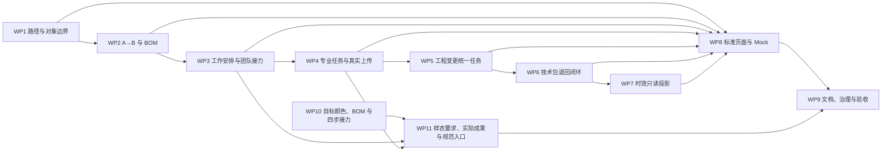

# PCS 生产工程管理实施计划

| 文档信息 | 内容 |
| --- | --- |
| 版本 | V5.0 |
| 日期 | 2026-08-13 |
| 状态 | V5.0 当前隔离分支已实现；WP11 直接需求证据、CodeGraph 和任务范围治理已闭环；项目级任务收据仅被未修改的 PFOS 历史列表欠账阻断；待提交、推送和产品确认 |
| 设计来源 | 《PCS 生产工程管理总体设计文档》V5.0 |
| 调整来源 | 《PCS 生产工程管理完整调整方案》V5.0，以及用户对样衣制作要求、多颜色多尺码实际成果和专业任务规范入口的最终确认 |

## 1. 实施目标与完成标准

目标是将 ADJ-001～050 全部转为当前原型可观察、可操作、可验证的业务结果。完成不是“页面能打开”或“构建通过”，而是同时满足：

1. 三条业务路径、BOM、专业任务、工程变更、技术包和时效读取同一组业务事实。
2. 菜单、路由、数据、页面、事件、Mock、专项契约和文档不存在相互冲突的旧口径。
3. 真实文件上传、状态推进、团队交接、审核退回和版本形成可完整演示。
4. 每个 ADJ 编号在追踪矩阵中有实现位置、自动化证据和页面验收结果。
5. 当前分支最后一次修改后重新执行构建、治理检查和命名页面验收。

## 2. 范围与实施纪律

### 2.1 本期文件范围

- 领域与 Mock：`src/data/pcs-engineering-*`、技术资料版本与审核数据。
- 页面：独立打样、工程主单、工程变更、各专业任务、技术包、生产准备时效。
- 路由和事件：PCS 路由、页面渲染器、主事件处理、菜单配置。
- 公共最小能力：真实工程文件上传、团队筛选展示。
- 契约与文档：PCS 专项测试、总体设计、实施计划、追踪矩阵、验收结果和原型审查记录。

### 2.2 非范围

- 不修改真实后端、鉴权、数据库、云存储或生产接口。
- 不处理历史任务迁移、历史技术包导入。
- 不恢复“我的工程任务”或旧泛入口。
- 不引入 React 页面体系、全局状态库或复杂上传基础设施。
- 不吸收工作区中与 PCS 无关的 FCS 修改。

### 2.3 实施原则

1. 设计规则先变成领域契约，再连接页面动作，最后补 Mock 和浏览器证据。
2. 只保留正常业务状态；团队是筛选与当前责任，不另造状态机。
3. 依赖由固定规则统一生成；所有入口复用同一任务事实。
4. 文件必须来自 `File` 对象并保存可预览数据，不接受地址字符串。
5. 用户可见改变必须形成完整原型审查记录。

## 3. 依赖顺序



## 4. WP1：业务路径、命名和入口收口

**覆盖：ADJ-001、ADJ-002、ADJ-003、ADJ-023。**

### 业务目标

独立打样、工程主单、工程变更各自建立业务单；销售展示样衣与产前版样衣彻底分开；不再暴露旧任务入口和内部术语。

### 实现位置

- `src/data/app-shell-config.ts`
- `src/router/routes-pcs.ts`
- `src/router/route-renderers.ts`
- `src/main-handlers/pcs-handlers.ts`
- `src/pages/pcs-independent-sampling.ts`
- `src/pages/pcs-engineering-tasks.ts`
- `src/pages/production/preparation-timing.ts`

### 修改

1. 保留改款打样、设计打样、工程主单、工程变更的独立规范路由。
2. 增加销售展示样衣任务入口；产前版样衣继续使用工程任务入口。
3. 独立打样新建时只写入业务对象、来源／目标款、跟单和原因，专业任务数组为空。
4. 删除当前菜单、路由和事件中的旧泛入口；不以重定向保留历史入口。
5. 用户可见文本统一为“本次需要完成的工作、本次要修改的内容、需要先完成”。
6. 完整删除误建的“技术包模板库”菜单、路由、渲染入口、静态页面和 Mock，不提供重定向或兼容入口。

### 验证证据

- `tests/pcs-engineering-navigation-removal.spec.ts`
- `tests/pcs-independent-sampling.spec.ts`
- `tests/pcs-engineering-v4-contract.spec.ts`
- `tests/pcs-engineering-technical-data-and-change.spec.ts`
- 浏览器检查四个业务入口、两个样衣列表、技术资料保留项及不存在的旧入口。

### 完成条件

入口、页面标题、详情来源和建立动作均能区分三条路径；创建草稿后任务数为 0。

## 5. WP2：改款 A→B 颜色、物料与 BOM

**覆盖：ADJ-004、ADJ-005、ADJ-006、ADJ-007。**

### 业务目标

把 A 款作为参考，逐颜色、逐物料形成归属于 B 款的 BOM；系统建议任务只依据目的、款式事实和 B 款 BOM。

### 实现位置

- `src/data/pcs-engineering-master-sampling.ts`
- `src/data/pcs-engineering-bom-repository.ts`
- `src/pages/pcs-independent-sampling.ts`
- `src/main-handlers/pcs-handlers.ts`

### 修改

1. 增加颜色对应记录，支持一对一、一对多、B 款无来源颜色。
2. 读取 A 款最近已完成且已确认 BOM 作为参考来源。
3. 每条参考物料生成处理行，买手选择沿用、替换、重新染色、重新印花、不使用；允许新增 B 款物料。
4. 处理行记录 B 款颜色、目标物料、染色／印花要求和确认人。
5. 颜色和物料全部确认前阻断工作安排确认。
6. 生成的 BOM 使用 B 款 SPU、颜色和 SKU；总需求量按单位用量、打样数量和损耗率计算。
7. BOM 与价格只有买手可维护；标准单价从物料档案读取。

### 验证证据

- `tests/pcs-independent-sampling.spec.ts`：A→B、权限、公式、B 款归属、阻断。
- `tests/pcs-engineering-bom-pricing.spec.ts`：标准单价、成本和正式快照既有契约。
- 浏览器检查颜色对应表、物料处理表和 BOM 链接。

### 完成条件

一对多、无来源颜色和六类物料处理均能演示；任何未确认行都不能进入下一步。

## 6. WP3：工作安排、固定依赖和团队接力

**覆盖：ADJ-008、ADJ-009、ADJ-010、ADJ-011、ADJ-012、ADJ-014。**

### 业务目标

任务先落到团队，完成条件满足后自动交给下一团队；列表只以一个团队筛选查询当前应处理工作。

### 实现位置

- `src/data/pcs-engineering-team-directory.ts`
- `src/data/pcs-engineering-dependency-policy.ts`
- `src/data/pcs-engineering-master-repository.ts`
- `src/data/pcs-engineering-master-view-model.ts`
- `src/data/pcs-engineering-master-sampling.ts`
- `src/components/ui/filter-bar.ts`
- `src/pages/pcs-engineering-master-detail.ts`
- `src/pages/pcs-engineering-tasks/master-task-page.ts`

### 修改

1. 任务建立只写当前团队；未发生动作时实际操作人为空。
2. 开始、提交、审核、返工动作记录真实操作人、团队、时间和轮次。
3. 固定依赖规则自动补齐前置任务，拒绝缺少或被篡改的依赖结构。
4. 前置完成后把后续任务从待前置推进为待开始，并切换当前团队。
5. 各列表统一原有业务状态，仅增加 `team` 筛选；选项展示团队名称，值保持稳定。
6. 主单详情改为标准任务表格，使用业务名称显示需要先完成和完成后去向。

### 验证证据

- `tests/pcs-engineering-dependency-policy.spec.ts`
- `tests/pcs-engineering-v4-contract.spec.ts`
- `tests/pcs-independent-sampling-pages.spec.ts`
- 浏览器逐项推进一条串行链和一组并行任务。

### 完成条件

未预指派个人、无虚拟负责人、没有团队专属状态；每次交接后当前团队和主动作准确变化。

## 7. WP4：专业任务详情、审核返工和真实上传

**覆盖：ADJ-013、ADJ-026、ADJ-027。**

### 业务目标

每类任务用真实专业字段推进；所有附件来自真实文件；改款／设计页面与专业任务基准一致。

### 实现位置

- `src/data/pcs-engineering-file-upload.ts`
- `src/data/pcs-engineering-task-upload-repository.ts`
- `src/data/pcs-engineering-pattern-result.ts`
- `src/data/pcs-engineering-tech-pack-workspace.ts`
- `src/data/pcs-technical-data-version-types.ts`
- `src/data/pcs-technical-data-version-repository.ts`
- `src/data/pcs-technical-data-version-bootstrap.ts`
- `src/components/ui/engineering-file-upload.ts`
- `src/pages/pcs-independent-sampling.ts`
- `src/pages/pcs-engineering-tasks/plate-making-task.ts`
- `src/pages/pcs-engineering-tasks/pattern-task.ts`
- `src/pages/pcs-engineering-tasks/color-task.ts`
- `src/pages/pcs-engineering-tasks/first-sample-task.ts`
- `src/pages/pcs-engineering-tasks/master-task-common.ts`
- `src/pages/tech-pack/events.ts`
- `src/pages/tech-pack/asset-domain.ts`
- `src/pages/tech-pack/pattern-domain.ts`

### 修改

1. 建立按用途区分的文件规则：款式图、纸样源文件、纸样预览、花型、调色、样衣、技术附件。
2. 从浏览器 `File` 读取数据，校验扩展名、大小和非空文件，保存文件名、类型、大小、数据、操作者、团队、时间、轮次。
3. 纸样源文件支持 `.prj`；图片可查看高清大图；全部文件可下载、未锁定时可删除。
4. 缺失、失败或未保存文件阻断任务提交；已提交轮次只读，返工新建轮次。
5. 花型和调色支持整张审核、逐项结果与逐项不通过原因；齐码纸样和样衣提交即完成。
6. 改款／设计列表采用标准列表；详情统一任务头部、当前动作、成果记录、操作日志和即时反馈。
7. 制版成果保存真实源文件和预览图；生成技术包草稿时继续携带 PRJ、DXF、RUL、PDF 的真实内容和文件信息，正式版本按快照隔离。
8. 非图片附件只提供真实下载并明确无图片预览；旧记录缺少原文件时提示重新上传，不补造假预览、假下载或种子缩略图。

### 验证证据

- `tests/pcs-independent-sampling.spec.ts`
- `tests/pcs-independent-sampling-pages.spec.ts`
- `tests/pcs-engineering-prior-result-reuse.spec.ts`
- `tests/pcs-engineering-v4-contract.spec.ts`
- `tests/pcs-technical-data-version-snapshot-compat.spec.ts`
- `tests/pcs-tech-pack-real-pattern-file.spec.ts`
- 浏览器真实选择 `.prj` 和图片，验证错误、成功、预览、下载、删除和提交门禁。
- 浏览器上传纸样压缩包后下载并逐字节比对；检查任务成果存储和技术包草稿均保留真实文件内容。

### 完成条件

不存在用文件名、URL 或一句说明冒充成果的当前入口；所有可推进任务的上传动作均可真实操作，任务成果、技术包草稿和正式版本之间不丢失真实文件。

## 8. WP5：工程变更具体内容与统一专业任务

**覆盖：ADJ-015、ADJ-016、ADJ-017、ADJ-018、ADJ-019、ADJ-020。**

### 业务目标

工程变更以正式技术包具体内容为修改对象，专业制作进入统一任务事实，原主单与原版本只读。

### 实现位置

- `src/data/pcs-engineering-change-workspace.ts`
- `src/data/pcs-engineering-master-repository.ts`
- `src/data/pcs-technical-data-version-repository.ts`
- `src/pages/pcs-engineering-change.ts`
- `src/pages/pcs-engineering-tasks/master-task-page.ts`

### 修改

1. 从当前正式技术包列出具体 BOM 行、纸样、样衣、花型、调色及技术资料栏目。
2. 三种处理方式：BOM 直接编辑、真实专业任务、技术资料直接编辑。
3. 确认修改内容后只建立一份下一版技术包草稿。
4. 专业任务由对应团队开始、真实上传、提交和审核；BOM 项由买手完成。
5. 专业任务投影到制版、花型、调色、样衣等统一列表，来源显示工程变更及变更单号。
6. 实现六状态推进；全部具体项完成才进入待汇总技术包。
7. 原主单任务和原正式版本不修改；新任务、新成果和新技术包版本完整留痕。

### 验证证据

- `tests/pcs-engineering-technical-data-and-change.spec.ts`
- `tests/pcs-engineering-v4-contract.spec.ts`
- 浏览器检查变更创建、具体修改项、统一列表来源、任务推进和下一版技术包。

### 完成条件

页面没有“受影响资料模块”和通用完成弹窗；每项修改都有明确责任、处理位置和完成事实。

## 9. WP6：技术包具体退回和版本闭环

**覆盖：ADJ-021。**

### 业务目标

审核退回精确指向受影响内容，避免全部重做；发布后形成正式版本并支持主单／变更收口。

### 实现位置

- `src/data/pcs-technical-data-version-types.ts`
- `src/data/pcs-technical-data-version-repository.ts`
- `src/data/pcs-tech-pack-review.ts`
- `src/data/pcs-engineering-task-review.ts`
- `src/pages/tech-pack/context.ts`
- `src/pages/tech-pack/core.ts`
- `src/pages/tech-pack/events.ts`

### 修改

1. 审核退回目标支持 BOM 行、技术资料栏目、专业任务、具体成果项。
2. 保存退回原因、审核人、时间、来源任务和成果标识。
3. 只回开指定任务／成果；其他已通过内容保持有效。
4. 返工提交后只复核受影响内容；全部通过后发布正式版本。

### 验证证据

- `tests/pcs-tech-pack-engineering-task-rework-bridge.spec.ts`
- `tests/pcs-engineering-technical-data-and-change.spec.ts`
- 浏览器检查具体退回选项、任务返工轮次和重新审核。

### 完成条件

任何退回都有具体目标和原因；不存在整包模糊退回导致无关成果重做。

## 10. WP7：生产准备时效只读投影

**覆盖：ADJ-022。**

### 业务目标

生产准备时效只记录工程主单执行线产生的真实任务时间和团队事实。

### 实现位置

- `src/data/pcs-engineering-preparation-projection.ts`
- `src/pages/production/preparation-timing.ts`

### 修改

1. 只从工程主单及其任务事件投影准备记录。
2. 把产前版样衣、纸样、花型、调色、辅料、技术包等映射为固定准备项。
3. 显示团队以及实际开始、提交、审核、首次完成和有效完成事实。
4. 删除时效页面对任务的独立创建和编辑能力；独立打样、工程变更不进入时效统计。

### 验证证据

- `tests/pcs-engineering-preparation-projection.spec.ts`
- `tests/pcs-engineering-preparation-color-projection.spec.ts`
- 浏览器对照同一主单任务详情和时效页面时间。

### 完成条件

时效记录与主单一致，且页面只能查看、筛选和统计。

## 11. WP8：标准列表、业务文案和丰富 Mock

**覆盖：ADJ-010、ADJ-012、ADJ-023、ADJ-024、ADJ-027。**

### 实现位置

- 独立打样、主单、变更和专业任务页面。
- `src/data/pcs-engineering-master-view-model.ts`
- `src/data/pcs-engineering-master-sampling.ts`

### 修改

1. 管理列表接入标准列表骨架、列设置、分页和表格内部滚动。
2. 改款／设计列表与专业任务基准统一，分别保留 A→B 和目标款信息。
3. 主单详情以表格取代花哨泳道。
4. 所有款式／物料缩略图与编号、名称组合显示，可打开高清大图。
5. 补齐 32 组验收场景：多状态、A→B、多团队、并行、部分退回、变更和版本。

### 验证证据

- `tests/pcs-independent-sampling-pages.spec.ts`
- `tests/pcs-engineering-v4-contract.spec.ts`
- `npm run check:list-page-governance`
- 1366×768 和 1280×720 浏览器截图与交互记录。

### 完成条件

列表具有足够数据分页；团队筛选只有一项；页面不存在空壳任务和难懂系统术语。

## 12. WP9：文档、追踪、治理与交付

**覆盖：ADJ-025、ADJ-050 及 ADJ-001～050 的最终闭环。**

### 实现位置

- `docs/product-design/PCS生产工程管理完整调整方案.md`
- `docs/product-design/PCS生产工程管理总体设计文档.md`
- `docs/product-design/PCS生产工程管理实施计划.md`
- `docs/product-design/PCS生产工程管理需求追踪与交付矩阵.md`
- `docs/product-design/PCS生产工程管理V4逐项验收结果.md`
- `docs/prototype-review-records/2026-08-11-pcs-engineering-v4.md`

### 修改

1. 三份权威文档只保留 V4 现行口径。
2. 追踪矩阵按 ADJ 编号记录实现位置、自动化和页面证据。
3. 逐项验收结果包含正常、阻断／边界、团队衔接、上传、状态和版本场景。
4. 原型审查记录覆盖页面、文案、图片、大图、交互、Mock、分辨率和风险。
5. ADJ-042 逐项核对菜单、路由、渲染器、页面、Mock、测试、文档和兼容入口均已收口。

### 验证命令

```bash
node --import tsx --test tests/pcs-engineering-v4-contract.spec.ts
node --import tsx --test tests/pcs-independent-sampling.spec.ts tests/pcs-independent-sampling-pages.spec.ts
node --import tsx --test tests/pcs-engineering-technical-data-and-change.spec.ts tests/pcs-tech-pack-engineering-task-rework-bridge.spec.ts
node --import tsx --test tests/pcs-engineering-prior-result-reuse.spec.ts tests/pcs-engineering-preparation-projection.spec.ts tests/pcs-engineering-dependency-policy.spec.ts
npm run build
npm run check:prototype-design-governance
npm run check:list-page-governance
```

### 完成条件

矩阵没有无说明的待实施、实施中、已实现待验证或已阻塞；所有证据来自当前分支最后一次修改之后。

## 13. WP10：V4.1 目标颜色、BOM 建立时点与四步团队接力

**覆盖：ADJ-028～041。**

### 业务目标

新建改款／设计打样时不再提前生成 BOM。由买手先定义本次目标颜色和尺码，再按确认结果建立 B 款 BOM；买手、跟单、专业团队和整单确认按四步自动接力。列表、详情和真实上传继续沿用既有标准能力。

### 实现位置

- `src/data/pcs-engineering-master-types.ts`：目标颜色、目标尺码、买手资料完成／退回事实和四步类型。
- `src/data/pcs-engineering-master-sampling.ts`：草稿建立、颜色／SKU／BOM 原子生成、来源 BOM 选择、锁定退回、步骤／团队推导和 Mock。
- `src/data/pcs-engineering-bom-repository.ts`：按目标颜色协调 BOM、编辑锁、来源复制及明确重新生成。
- `src/data/pcs-engineering-bom-version.ts`、`src/data/pcs-engineering-bom-types.ts`：来源快照资格和编辑锁事实。
- `src/pages/pcs-independent-sampling.ts`：标准列表、四步详情、颜色／尺码编辑、BOM 页签、退回、专业工作和真实上传。
- `tests/pcs-independent-sampling.spec.ts`、`tests/pcs-independent-sampling-pages.spec.ts`、`tests/pcs-independent-sampling-v41-e2e.spec.ts`：领域、页面和真实浏览器证据。

### 修改

1. 创建草稿时 BOM 和专业任务均为 0；目标颜色确认前 BOM 页签可见但锁定。
2. 买手可新增、选用或移出本次目标颜色；每个颜色选择目标尺码以及 A 款参考色／无参考色。
3. 去空格和忽略大小写后校验重名；任一颜色无尺码、SKU 或 BOM 建立失败时整体回退。
4. N 个目标颜色建立 N 份 B 款草稿 BOM；有明确 A 款参考时只复制合格来源，无参考时保持空白。
5. 已人工维护的 B 款 BOM 不因再次确认颜色而被覆盖；明确“重新按参考色生成”后才重置。
6. 买手完成资料准备后锁定 BOM 并自动进入跟单步骤；跟单可在工作安排前写明原因退回，退回后重新开放。
7. 跟单确认工作安排后一次生成固定任务；专业任务完成后自动进入整单确认。
8. 列设置仅位于列表表头最右侧，列表只保留“当前需处理的团队”筛选；改款和设计共用四步页面骨架。
9. 真实 `.prj`、图片和附件保存可下载内容；空文件、错误类型和缺失文件阻断提交；图片支持大图和 `Esc` 关闭。
10. Mock 覆盖少色、多色、一对多、无参考、并行工作和已完成只读。

### 验证证据

- 领域：`tests/pcs-independent-sampling.spec.ts`。
- 页面结构：`tests/pcs-independent-sampling-pages.spec.ts`。
- 浏览器全流程：`tests/pcs-independent-sampling-v41-e2e.spec.ts`。
- 总门禁：`npm run check:pcs-engineering-master`。
- 标准列表与原型治理：`npm run check:list-page-governance`、`npm run check:prototype-design-governance`。
- 构建、CodeGraph 状态和任务收据按最终交付门禁执行。

### 完成条件

ADJ-028～041 全部具有当前实现、自动化和适用页面证据；四步流程可从新建草稿推进到整单完成；设计打样保留同一骨架但不出现 A 款参考；不存在旧的提前建 BOM、隐式读取 B 款历史 BOM、跨步骤编辑或假上传入口。

## 14. WP11：样衣制作要求、实际成果与规范专业入口

**覆盖：ADJ-043～050。**

### 业务目标

销售展示样衣和产前版样衣都必须先有跟单下达的多行制作要求，再由制作团队按真实交付提交多行实际成果；父单只负责安排和汇总，“进入任务”必须进入对应专业任务的规范详情。

### 实现位置

- `src/data/pcs-engineering-master-types.ts`：制作要求行、实际成果行及任务归属类型。
- `src/data/pcs-engineering-master-sampling.ts`：独立打样制作要求确认、销售展示样衣实际成果校验、Mock 和完成事实。
- `src/data/pcs-engineering-master-repository.ts`：工程主单产前版样衣要求确认、任务生成、实际成果保存及边界门禁。
- `src/pages/pcs-independent-sampling.ts`：跟单工作安排中的销售展示样衣要求、规范专业任务跳转、销售样衣多行实际成果和汇总。
- `src/pages/pcs-engineering-master-detail.ts`：工程主单确认工作安排前的产前版样衣制作要求。
- `src/pages/pcs-engineering-tasks/first-sample-task.ts`：产前版样衣要求只读展示、多行实际成果、真实上传、差异及合计。
- `src/pages/pcs-engineering-tasks/master-task-common.ts`：独立任务规范入口和实际制作数量汇总。
- `src/router/routes-pcs.ts`：制版、花型、调色、销售展示样衣规范详情路由。
- `tests/pcs-independent-sampling*.spec.ts`、`tests/pcs-engineering-pre-production-sample-submit*.spec.ts`、`tests/pcs-engineering-prior-result-reuse.spec.ts`：领域、页面和真实浏览器契约。

### 修改

1. 改款／设计工作安排增加销售展示样衣制作要求表；工程主单工作安排增加产前版样衣制作要求表。
2. 每条要求包含颜色、尺码、要求数量（件）和可选说明；同一颜色与尺码不可重复，至少一条且数量必须为正整数。
3. 工作安排确认与任务生成采用同一个动作；成功后要求立即锁定，专业任务详情只读展示。
4. 制作团队可为一个要求提交一条或多条实际成果；每行记录实际颜色、尺码、数量、真实图片、纸样版本、制作说明和差异说明。
5. 实际颜色、尺码或数量与要求不同可以如实提交，但必须填写差异说明；不新增异常、审批或要求变更模块。
6. 页面分别汇总要求件数、实际件数和差异；专业列表中的完成数量使用实际数量之和，不使用成果行数。
7. 销售展示样衣不再作为产前版样衣前期成果或完成依据；工程主单仍须重新下达要求并单独完成产前版样衣。
8. 父单“进入任务”按任务类型进入制版、花型、调色或销售展示样衣规范详情，并与专业列表共用同一任务事实。
9. 设计打样使用与改款打样相同四步和样衣要求规则，但不出现 A 款参考关系。
10. 同步总体设计、实施计划、追踪矩阵、专项契约、Mock、原型审查记录和逐项验收结果。

### 验证证据

- 独立打样领域与页面：`tests/pcs-independent-sampling.spec.ts`、`tests/pcs-independent-sampling-pages.spec.ts`。
- 工程主单产前版样衣：`tests/pcs-engineering-pre-production-sample-submit.spec.ts`、`tests/pcs-engineering-pre-production-sample-submit-dom.spec.ts`。
- 边界与入口：`tests/pcs-engineering-prior-result-reuse.spec.ts`、`tests/pcs-engineering-task-submit.spec.ts`、`tests/pcs-engineering-tasks.spec.ts`。
- 浏览器：改款、设计、销售展示样衣、工程主单和产前版样衣命名路由，含真实本地图片上传、大图和差异阻断。
- 项目门禁：构建、标准列表治理、原型治理和任务收据。

### 完成条件

ADJ-043～050 在追踪矩阵中都有当前实现、专项契约和适用的当前页面证据；两个样衣对象的要求、实际、数量、上传和边界均可完整演示；所有“进入任务”进入正确的专业详情；代码、Mock、测试和文档中不存在销售展示样衣替代产前版样衣或以成果行数表示件数的旧口径。

## 15. 调整编号到工作包的完整映射

| 调整编号 | 工作包 | 主要交付 |
| --- | --- | --- |
| ADJ-001 | WP1 | 三条业务路径和独立入口 |
| ADJ-002 | WP1 | 两种样衣命名与事实分离 |
| ADJ-003 | WP1 | 创建业务单与任务确认分步 |
| ADJ-004 | WP2 | 目的／BOM 驱动建议 |
| ADJ-005 | WP2 | A→B 颜色与物料逐行决策 |
| ADJ-006 | WP2 | A 款已确认 BOM 只作参考 |
| ADJ-007 | WP2 | B 款归属与全量处理结论 |
| ADJ-008 | WP3 | 团队优先责任 |
| ADJ-009 | WP3 | 实际动作后记录人员 |
| ADJ-010 | WP3、WP8 | 单一团队筛选与统一状态 |
| ADJ-011 | WP3 | 自动团队交接 |
| ADJ-012 | WP3、WP8 | 主单任务表格 |
| ADJ-013 | WP4 | 专业详情与成果规则 |
| ADJ-014 | WP3 | 业务名称依赖表达 |
| ADJ-015 | WP5 | 具体工程变更项 |
| ADJ-016 | WP5 | 专业任务／资料编辑分流 |
| ADJ-017 | WP5 | 变更任务进入统一列表 |
| ADJ-018 | WP5 | 对应团队真实执行 |
| ADJ-019 | WP5 | 工程变更六状态 |
| ADJ-020 | WP5 | 原事实只读与新版本追溯 |
| ADJ-021 | WP6 | 具体退回和局部返工 |
| ADJ-022 | WP7 | 主单时效只读投影 |
| ADJ-023 | WP1、WP8 | 业务术语统一 |
| ADJ-024 | WP8 | 丰富 Mock 和分页场景 |
| ADJ-025 | WP9 | 四文档与证据同步 |
| ADJ-026 | WP4 | 真实文件上传硬门禁 |
| ADJ-027 | WP4、WP8 | 改款／设计页面基准统一 |
| ADJ-028 | WP10 | 列设置归入列表表头最右侧 |
| ADJ-029 | WP10 | 草稿不提前建立 BOM |
| ADJ-030 | WP10 | 买手自定义本次目标颜色和数量 |
| ADJ-031 | WP10 | 明确参考色／无参考色及一对多 |
| ADJ-032 | WP10 | 颜色、尺码、SKU、BOM 整组校验与回退 |
| ADJ-033 | WP10 | 目标颜色与 B 款 BOM 一一对应 |
| ADJ-034 | WP10 | 只读取明确 A 款合格来源 BOM |
| ADJ-035 | WP10 | B 款 BOM 独立维护、锁定与明确重新生成 |
| ADJ-036 | WP10 | 改款／设计四步详情 |
| ADJ-037 | WP10 | 当前步骤、当前团队和自动交接 |
| ADJ-038 | WP10 | 已完成只读、未来锁定和跟单退回 |
| ADJ-039 | WP10 | V4.1 完整 Mock 场景 |
| ADJ-040 | WP10 | 改款／设计与专业任务统一页面骨架 |
| ADJ-041 | WP10 | 新步骤真实文件上传回归 |
| ADJ-042 | WP1、WP9 | 完整删除误建的技术包模板库及其全部入口和静态数据 |
| ADJ-043 | WP11 | 跟单下达销售展示样衣制作要求 |
| ADJ-044 | WP11 | 跟单下达产前版样衣制作要求 |
| ADJ-045 | WP11 | 多行制作要求、实际成果和件数对照 |
| ADJ-046 | WP10、WP11 | 设计打样完整覆盖四步和销售展示样衣 |
| ADJ-047 | WP1、WP11 | 父单进入规范专业任务详情 |
| ADJ-048 | WP1、WP11 | 销售展示样衣不得替代产前版样衣 |
| ADJ-049 | WP8、WP11 | 样衣数量统一按实际件数求和 |
| ADJ-050 | WP9、WP11 | 文档、契约、Mock 和页面证据同步 |

## 16. 最终审查方法

### 15.1 正向追踪

从 ADJ-001 开始，逐项检查总体设计、工作包、实现文件、专项契约、命名页面和验收记录，直到 ADJ-050；任何缺口不得标记已验证。

### 15.2 反向追踪

从当前 PCS 菜单、路由、页面、领域数据、Mock、处理器和测试反查 ADJ 编号，重点检查：旧入口、虚拟负责人、团队专属状态、通用成果说明、图片地址、抽象工程变更模块、独立时效任务等未确认能力是否仍可见或可操作。

### 15.3 交付判定

- `implemented`：代码和页面实现存在，但最终证据尚未全部生成。
- `verified`：专项契约、构建、治理和命名页面全部在当前分支闭环。
- 未提交和未推送时，不声明远端已交付。

## 17. 当前分支实施与验证结果

### 16.1 实施范围

- ADJ-001～050 已全部落到 WP1～WP11 对应实现位置；本轮新增的 ADJ-043～050 已完成正向和反向追踪。
- 改款、设计和工程主单均能由跟单先下达样衣制作要求，再由制作团队提交多行实际结果；设计打样完整复用四步业务骨架。
- 制版、花型、调色、销售展示样衣和产前版样衣均进入规范专业详情；销售展示样衣不再替代产前版样衣。
- 真实图片、真实 `.prj` 和普通附件均由本地文件选择器读取，不接受文件名或地址模拟上传。
- 隔离工作树没有吸收主工作树中的无关 FCS 修改。

### 16.2 本轮最终证据

| 证据 | 结果 | 说明 |
| --- | --- | --- |
| V5 直接专项契约 | 8／8 通过 | 覆盖主单任务方案、产前版提交、任务汇总、实际数量、复用边界、独立打样领域和页面 |
| PCS 生产工程总门禁 | 23／23 通过 | 最后一次源代码修改后重跑，0 失败 |
| Playwright 命名业务流程 | 3／3 通过 | 改款、设计、产前版样衣；含真实 `.prj`、真实仓库图片、空文件阻断、纸样版本选择、多行实际和大图 |
| Vite 生产构建 | 通过 | 2,340 个模块；既有包体积提示不阻断原型验收 |
| 标准列表模板治理 | 通过 | TypeScript、列表模板和 Chromium 列拖拽契约均通过 |
| 完整列表总治理 | 失败（仓库既有项） | 被未修改的 `src/pages/process-factory/cutting/fei-tickets.ts` PFOS 历史治理欠账阻断；本次 PCS 列表模板已单独通过 |
| 任务范围原型治理 | 通过 | 隔离临时索引覆盖 9 个用户可见 PCS 文件和 1 份审查记录，不读取真实暂存区 |
| Git 差异检查 | 通过 | `git diff --check` 无空白错误 |
| CodeGraph | 通过 | 当前隔离工作树已初始化并同步：1,495 个文件、46,038 个节点、180,002 条边；待同步文件 0，工作树不匹配为 null |
| 任务收据 | 已生成，状态 `implemented` | `/private/tmp/pcs-professional-task-routing-task-receipt.json`；菜单路由、原型治理、构建和 CodeGraph 通过，仅完整列表总治理被未修改的 PFOS 历史欠账阻断 |

### 16.3 当前交付边界

- ADJ-043～050 的实现、专项契约、命名页面和任务范围治理已经闭环；当前分支尚未提交、推送，因此不是 `delivered`。
- 当前任务范围的原子需求均已验证；由于项目级收据仍记录未修改的 PFOS 历史列表欠账，分支交付状态保持 `implemented`，不将任务范围证据夸大为全仓 `verified`。
- 产品确认人仍待确认；产品确认前不标记 `accepted`。
- 完整列表总治理的 PFOS 既有欠账与本次 PCS 功能结果分开记录，不修改、不隐藏，也不将其误报成本次回归。
