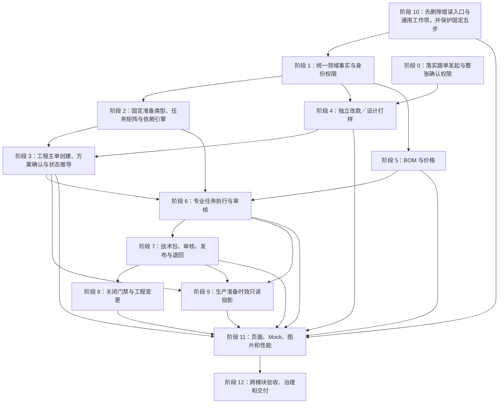

# PCS 生产工程管理实施计划

> 版本：V1.1（二次查漏补缺）
>
> 日期：2026-08-04
>
> 实施分支：`codex/pcs-engineering-master-design`
>
> 设计基线：`docs/product-design/PCS生产工程管理总体设计文档.md`
>
> 原子需求与交付登记：`docs/product-design/PCS生产工程管理需求追踪与交付矩阵.md`
>
> 文档性质：研发、测试和产品验收的实施依据；不是已实现证明

---

## 1. 实施目标与完成标准

本计划只落实《PCS 生产工程管理总体设计文档》已经确认的业务方案，不以现有原型的错误行为、旧实施计划或历史页面作为需求来源。

完成必须同时满足以下条件：

1. 设计文档 P01-P37 及追踪矩阵全部原子需求均有明确实施任务、实际实现位置和验收证据。
2. 工程主单、专业任务、BOM 与价格、技术包、生产准备时效形成一条可追溯的首单工程闭环。
3. “我的工程任务”整体删除；专业任务入口保留且各自可办理真实业务。
4. 商品项目通用工作项、工作项模板和工作项库从运行代码中删除，但商品测款固定五步不得合并。
5. 工程主单的任务结构由四类生产准备类型和固定依赖规则产生；不得依赖名称关键词猜测，不得允许人工调整依赖。
6. 生产准备时效只读取工程主单任务事实，不创建、不安排、不编辑、不审核任务。
7. 技术包只能由工程主单或工程变更产生，并沿用现行审核与显式发布流程。
8. Mock 数据覆盖全部任务类型、关键状态、并行、审核、返工、采购、关闭和变更场景，专业任务列表不得大面积为空。
9. 每个款式和每种物料都有真实对应图片，缩略图可查看高清大图，并覆盖加载和失败状态。
10. 命名页面冷启动、局部交互和分页满足性能门禁，不再出现启动时构造全量搜索索引或重复生成派生数据。
11. 所有专项契约、页面验收、设计治理、构建、CodeGraph 和任务收据在最后一次实质修改后重新通过。

---

## 2. 权威事实、范围和禁止曲解项

### 2.1 事实优先级

实施时按以下优先级处理冲突：

1. 用户后续明确确认的业务事实。
2. 《PCS 生产工程管理总体设计文档》。
3. 当前实际页面和可复现业务行为。
4. 当前代码、路由、Mock 和测试。
5. 历史文档、旧计划和旧截图。

旧计划 `docs/superpowers/plans/2026-07-30-pcs-production-engineering-master-implementation.md` 含错误入口、错误依赖和过期流程，仅作为历史记录，不得继续执行，也不得复制其中的任务拆分和验收口径。

### 2.2 本期范围

- 独立改款打样与独立设计打样。
- 工程主单创建、首单资格校验、任务方案确认、发布、执行、关闭。
- 制版、产前版样衣、花型、调色、辅料下单、技术包确认等专业任务。
- BOM 与价格草稿、版本承接、双币综合成本和正式快照。
- 技术包创建、现行审核、退回、显式发布和版本来源。
- 花型库、部位模板库、技术包模板库及其技术资料归属。
- 生产准备时效的只读投影、计划、超时、统计、筛选和导出。
- 工程主单关闭后的工程变更任务和新技术包版本。
- 删除“我的工程任务”。
- 删除商品项目通用工作项／模板／工作项库代码，同时保护测款固定五步。

### 2.3 本期非范围

- 不实现完整商品测款改造，只处理通用工作项删除与固定五步保护。
- 不实现样衣唯一条码、库存、借用、流转和退回。
- 不实现实际大货染色、印花和生产执行。
- 不在 PCS 创建采购单，只绑定采购系统已有采购单号。
- 不提供自由任务编排、依赖拖动或依赖修改。
- 不提供专业任务取消、暂停或额外行政审批流。
- 不建设异常中心、问题提报或异常处理流程。
- 不迁移、不转换、不兼容老任务；页面中也不得出现老任务迁移文案。
- 不导入历史技术包，不允许绕过工程主单直接新增技术包。
- 本阶段不新增 PCS 工程 PDA 页面；管理和专业执行均使用 Web。
- 本阶段不新增工程打印面；已有技术包打印如受数据结构影响，仅做回归验证。

### 2.4 不得曲解的关键口径

- 工程主单是款式首单的大货前工程对象，不是生产批次单。
- 首单必须同时满足“未正式售卖”和“未正式生产”。
- 当前工程主单由人工创建；系统满足条件自动创建不在本期。
- 工程主单创建后的第一步是“系统建议 + 跟单确认任务方案”，不能创建后直接进入执行。
- 任务骨架一次性生成；固定依赖不可编辑；选择后置任务时系统自动补齐前置任务。
- “生产准备时效”是记录和统计线，不是任务执行线。
- 纸样和产前版样衣由制作团队提交成果后即完成，不在任务页重复审核；质量统一在技术包审核。
- 花型和调色采用整单提交、逐项审核；买手审核，未通过项单独返工。
- 技术包确认任务不得人工完成，必须由技术包显式发布自动完成。
- BOM 与价格只由买手维护；物料标准单价只读物料档案，草稿读取最新价，正式发布时才形成快照。
- 生产准备时效中的“确认染色要求”和 BOM 中买手勾选“是否需要染色／印花”不是同一个动作。
- 一个款式只允许一张未关闭工程主单；关闭后的修改走工程变更，不重开原主单。
- “因需求变更结束”只适用于条件任务因条件消失而结束，不能用于必做任务。
- 商品开发不属于商品测款；改款／设计打样属于生产工程管理的独立路径，不复用商品项目通用工作项。
- 测款不通过并完成收尾的档案只读保留，不能作为首单主单目标；暂保留档案仍处于测款状态，也不能提前进入首单工程。

---

## 3. 独立打样角色确认

独立改款打样和独立设计打样均由跟单发起，并由跟单确认整张任务成果。

实施规则：

1. 只有当前登录角色为跟单且具备对应权限时，才显示并允许执行独立改款／设计打样创建动作。
2. 只有跟单可以确认整张独立打样任务成果；系统记录确认人和确认时间，不允许手填身份。
3. 跟单的整张任务确认不替代专业责任：BOM 与价格仍仅由买手维护；花型、调色仍由买手逐项审核；纸样和样衣仍按制作团队提交完整成果即完成。
4. 只有整张任务已经由跟单确认的成果，才可进入“已完成且已确认”的前期成果候选，供工程主单推荐复用。

完成证据：创建权限、整张确认权限、当前用户身份、确认时间、专业审核不被绕过以及未确认成果不能复用的专项测试全部通过。

---

## 4. 总体实施依赖



阶段编号是需求追踪编号，不代表代码提交顺序。执行时严格按总体设计第 28 节：先建立固定五步保护契约并删除“我的工程任务”和商品项目通用工作项，再统一事实源和依赖规则，随后打通专业任务、技术包、时效、变更、页面与性能。删除前先把错误 `/pcs/patterns` 入口迁移到现有制版专业路由，避免误删制版任务；这只是同一删除步骤内的安全顺序，不构成旧模块兼容期。

---

## 5. 阶段 1：统一领域事实、事件时间和身份权限

### 5.1 业务目标

建立工程主单、专业任务、成果轮次、责任人、审核、技术包和时效投影共同读取的唯一事实结构，消除页面自行推导、自由文本冒充身份和时间混写。

### 5.2 文件与符号

- `src/data/pcs-engineering-master-types.ts`
- `src/data/pcs-engineering-master-repository.ts`
- `src/data/pcs-engineering-task-field-policy.ts`
- `src/data/pcs-engineering-task-review.ts`
- 当前登录用户／角色的既有共享事实源
- 对应 `scripts/check-pcs-engineering-*.ts` 专项契约

### 5.3 修改内容

1. 工程主单补齐：创建方式、创建原因、资格事实、资格达成时间、生产准备类型、跟单、创建人、确认人、发布时间、关闭人和关闭时间。
2. 每张任务独立记录：任务编号、任务类型、来源类型／编号、目标 SPU、负责团队、负责人、指派人、指派时间、固定前置及满足方式、当前轮次、计划完成、成果摘要、提交人、审核人和操作／返工记录；不得共用一个“负责人”字段代替。
3. 任务事件分开记录：生成、解锁、开始、提交、审核、完成；没有真实开始动作时开始时间为空，不得用提交时间回填。
4. 成果返工使用轮次记录，保留每轮输入、成果、逐项审核结论、原因和时间。
5. 操作身份只读取当前登录用户及权限；移除页面手填审核人、确认人和操作人的输入。
6. 统一任务状态：未启用、待前置、待开始、进行中、待审核、返工中、已完成、因需求变更结束。
7. 不增加暂停、取消、异常处理或审批流状态。

权限实现必须落实到动作门禁，而不只是页面提示：

| 角色 | 本期可执行的核心动作 |
| --- | --- |
| 跟单 | 发起和整张确认独立改款／设计打样；创建主单、确认任务方案、判断前期成果、指派负责人、维护准确颜色要求、推动技术包、关闭／终止主单 |
| 买手 | 维护 BOM 与自定义费用、判断物料印花／染色、逐项审核花型／调色、审核技术包 |
| 版师 | 开始和提交本人梭织纸样任务、维护被授权部位模板 |
| 毛织团队 | 开始和提交本人毛织纸样任务 |
| 样衣制作团队 | 开始和提交本人产前版样衣任务 |
| 花型团队 | 开始、整单提交花型成果、返工未通过项 |
| 染厂 | 在准确颜色要求完成后开始、整单提交调色成果、返工未通过项 |
| 采购人员 | 查询、绑定及在允许阶段解除有效采购单 |
| 技术包审核人员 | 按现行职责查看差异、通过、退回并填写意见 |

专业人员只能操作本人负责或被授权任务，管理角色可以查看全链路；独立改款／设计打样的创建和整单确认权限按第 3 节落实为跟单专属动作。

### 5.4 验证证据

- 类型与仓库专项测试覆盖所有责任事实和六类时间事件。
- 页面动作提交时验证操作人为当前用户，构造自由文本身份无法生效。
- 同一任务从生成到完成的日志时间单调且可追溯。
- 未点击开始直接提交时被阻断，不产生伪造执行时长。

### 5.5 完成条件

所有后续模块只读取该统一事实；页面不再维护第二套任务状态、责任人或时间字段。

---

## 6. 阶段 2：固定生产准备类型、任务矩阵与依赖引擎

### 6.1 业务目标

按纯梭织、烫画／直喷、毛织、毛织＋梭织四类准备类型，一次性生成适用任务骨架，并用固定依赖驱动解锁、并行和关闭门禁。

### 6.2 文件与符号

- `src/data/pcs-engineering-dependency-policy.ts`
- `src/data/pcs-engineering-first-production-policy.ts`
- `src/data/pcs-engineering-master-repository.ts`
- `src/data/pcs-engineering-master-view-model.ts`
- 新增或改写准备类型矩阵专项测试

### 6.3 修改内容

1. 删除以款式名称、关键词或本地正则猜测准备类型和任务的逻辑。
2. 准备类型读取明确的款式／工程属性事实；缺失时在方案确认阶段要求跟单选择，不能静默猜测。
3. 纯梭织：梭织基码纸样 → 产前版样衣 → 梭织齐码纸样。
4. 毛织：毛织基码纸样 → 产前版样衣 → 毛织齐码纸样。
5. 毛织＋梭织：两类基码纸样并行 → 同一产前版样衣 → 两类齐码纸样并行。
6. 烫画／直喷：花型任务默认必做；本类型不自动生成纸样、产前版样衣、染色或辅料准备任务。未来如需承载服装结构纸样，必须先调整结构化准备类型规则，不能靠名称关键词临时推断。
7. 技术包确认只依赖本主单已启用且适用的任务；未启用、不适用和条件消失任务不阻塞。
8. 辅料下单、花型、纱线调色、面料调色均为条件任务，条件来自 BOM 明确字段。
9. 选择任一后置任务时自动补齐全部固定前置任务；界面不提供删除前置或调整依赖动作。
10. 任务骨架只生成一次；后续 BOM 条件变化只启用条件任务或创建新返工轮次，不重建主单全量任务。
11. “因需求变更结束”仅允许条件任务在对应 BOM 条件消失时使用；条件恢复时新建轮次。

### 6.4 验证证据

- 四类准备类型逐一断言启用任务、禁用任务、前置依赖和并行组。
- 断言纯梭织和毛织的样衣只依赖一项基码，混合款依赖两项。
- 断言技术包不等待未启用任务。
- 断言后置选择自动补齐前置，且依赖配置无编辑入口。
- 断言必做任务不能进入“因需求变更结束”。

### 6.5 完成条件

任何主单的任务结构只由准备类型、固定矩阵和 BOM 条件得出；同一输入得到同一任务结构。

---

## 7. 阶段 3：工程主单创建、方案确认、发布和状态推导

### 7.1 业务目标

形成“系统按做大货资格自动创建／跟单人工创建 → 双重首单校验 → 系统建议 → 跟单确认 → 一次发布 → 专业执行”的主线。

### 7.2 文件与符号

- `src/data/pcs-engineering-first-production-policy.ts`
- `src/data/pcs-engineering-master-repository.ts`
- `src/data/pcs-engineering-master-view-model.ts`
- `src/pages/pcs-engineering-master-list.ts`
- `src/pages/pcs-engineering-master-detail.ts`
- 商品正式售卖与正式生产的权威 Mock 事实源

### 7.3 修改内容

1. 创建入口只允许跟单选择已存在且可进入首单工程的商品／款式档案，并选择跟单负责人、满足做大货条件的业务依据和人工创建原因；不在创建弹窗混入任务选择或临时创建档案。
2. 分别读取“是否正式售卖”和“是否正式生产”：正式销售只认有效正式销售订单，测款数据、测试订单和已取消订单不算；正式生产只认已经进入执行或已完成的正式生产单。任一为是即禁止创建；权威来源不可用或互相冲突时也禁止放行，不能靠手填“首单”绕过。
3. 同一款式存在未关闭主单时禁止再次创建。
4. 创建后主单状态为“草稿”、当前阶段为“待确认任务方案”，不能直接开始任务。
5. 系统首次建议只依据创建时可用的准备类型和款式属性；不依赖尚未完善的 BOM。
6. 跟单逐项确认建议任务和前期成果处理：复用、重做、不采用；系统推荐最近一份已完成且已确认成果，也允许改选其他历史版本。
7. BOM 完善后第二次联动条件任务，不改写已开始或已有成果的历史事实。
8. 发布时一次生成任务骨架、依赖、并行组、负责团队和默认负责人；发布后不允许再次执行全量生成。
9. 移除主单详情中的通用“提交成果”入口；卡片只展示状态和跳转到专业详情。
10. 主单状态严格使用：草稿、已发布、进行中、技术包审核中、待关闭、已关闭、已终止；页面不提供任意改状态动作。
11. 当前阶段按依赖阶段展示；同阶段多任务未完成时显示“并行准备（N 项）”和主要待办。
12. 最后更新时间取主单、任务、审核、采购绑定和技术包事件的最大时间。
13. 主单状态按真实事实推导：跟单确认任务方案后进入已发布；任一适用任务真实开始后进入进行中；技术包送审后进入技术包审核中；审核退回并重开来源任务后回到进行中；正式技术包已发布且其他关闭门禁通过后进入待关闭。
14. 只有跟单可终止整张处于草稿、已发布、进行中或技术包审核中的主单；终止必须填写原因并二次确认，不增加审批流。已关闭和已终止均不可恢复，终止不等于取消单张专业任务。
15. 主单保留创建方式、触发业务对象、做大货条件、门槛数量、达到数量、达到时间、创建原因和唯一触发标识；系统创建和人工创建均落相同资格事实，系统创建必须按唯一触发标识幂等，两种方式创建后都进入任务方案确认。
16. 当前阶段按固定优先级唯一推导：已关闭／已终止 → 待关闭 → 技术包审核中 → 技术包整理 → 任务依赖阶段／并行准备 → 成果复用确认／技术包整理 → 已发布待开始 → 草稿待确认任务方案。命中高优先级后不得再采用低优先级结果。
17. 复用成果满足依赖，但不生成假的已完成任务，也不计本次完成数量、执行时长和准时率；进入技术包后仍参加技术包审核。

### 7.4 验证证据

- 正式售卖、正式生产、已有未关闭主单三类阻断分别有专项用例。
- 新主单必须先确认任务方案，未确认不能发布。
- 发布两次不会重复生成任务。
- 主单详情不存在通用成果提交控件。
- 并行阶段、技术包审核中、待关闭和最后更新时间均由真实事件推导。
- 主单终止权限、原因、二次确认和不可恢复规则通过；专业任务不存在单独取消入口。

### 7.5 完成条件

从工程主单列表人工创建一张主单，可完整走到发布，且生成的任务结构、状态、阶段和时间均与设计一致。

---

## 8. 阶段 4：独立改款打样与独立设计打样

### 8.1 业务目标

承接达到大货条件前的改款和设计出样，不把独立打样伪装成工程主单，也不把“改版”作为两类业务的混合名称。

### 8.2 文件与符号

- `src/pages/pcs-engineering-tasks/revision-task.ts`
- `src/data/pcs-revision-task-types.ts`
- `src/data/pcs-revision-task-material-types.ts`
- `src/data/pcs-revision-task-repository.ts`
- 新建 `src/data/pcs-design-sampling-task-types.ts` 和 `src/data/pcs-design-sampling-task-repository.ts`，单独承载设计打样，不把它继续塞进改款任务类型
- 新建 `src/pages/pcs-engineering-tasks/design-sampling-task.ts`，并在 `src/router/routes-pcs.ts` 注册独立设计打样列表与详情
- 改款／设计打样 Mock 与专项契约
- 前期成果检索和复用服务

### 8.3 修改内容

1. 改款打样要求来源 SPU 和目标 SPU 均提前存在，且不得相同；成果归属目标 SPU，来源只作为依据，不被覆盖。
2. 设计打样要求目标 SPU 提前存在，不要求来源 SPU。
3. 两类独立任务可关联花型、调色、制版、样衣等专业任务；这些任务来源标记为独立改款或独立设计。
4. 独立任务不进入工程主单进度，也不写入生产准备时效。
5. 物料方案保留单位用量、打样数量、损耗和本次总需求量；总需求按设计公式计算。
6. 达到大货条件后创建工程主单时，检索并推荐前期已完成且已确认成果，跟单逐项决定复用、重做或不采用。
7. 复用保留来源任务、来源版本、选择人和时间；重做创建工程主单来源的新轮次，不覆盖前期成果。
8. 独立改款和独立设计打样均由跟单创建，并由跟单确认整张任务成果；确认前成果不得进入工程主单推荐复用候选。

### 8.4 验证证据

- 改款同 SPU、缺来源 SPU、缺目标 SPU均阻断。
- 设计打样无目标 SPU 阻断，但不要求来源 SPU。
- 独立任务关联专业任务后可执行，但不计入任何工程主单进度和时效。
- 工程主单能检索、改选、复用或重做前期成果，并显示来源。

### 8.5 完成条件

独立打样和首单工程边界清晰，前期成果可以成为工程主单输入，但两类业务对象互不混同。

---

## 9. 阶段 5：BOM 与价格

### 9.1 业务目标

形成由买手维护、按 SPU＋颜色管理、贯穿打样和工程、技术包发布时固化的 BOM 与价格事实。

### 9.2 文件与符号

- `src/data/pcs-engineering-bom-types.ts`
- `src/data/pcs-engineering-bom-repository.ts`
- `src/data/pcs-engineering-bom-material-resolver.ts`
- `src/data/pcs-engineering-bom-pricing.ts`
- `src/data/pcs-engineering-bom-snapshot-source.ts`
- `src/data/pcs-engineering-bom-snapshot-validation.ts`
- `src/data/pcs-engineering-master-repository.ts`
- `src/data/pcs-engineering-master-sampling.ts`
- `src/data/pcs-engineering-tech-pack-workspace.ts`
- `src/data/pcs-tech-pack-version-activation.ts`
- `src/pages/pcs-technical-data.ts`
- `src/pages/pcs-engineering-master-detail.ts`
- `src/pages/pcs-independent-sampling.ts`
- `src/router/routes-pcs.ts`
- `src/router/route-renderers.ts`
- `src/pages/tech-pack/bom-process-linkage.ts`
- 技术包 BOM 页面事件与物料档案价格事实源

### 9.3 修改内容

1. 删除独立新建、手工 BOM 编号和历史导入入口；创建工程主单、改款打样或设计打样时，按目标款式档案中的有效颜色与 SKU 原子创建 BOM 草稿，任一环节失败整体回滚。
2. 每个颜色只创建一份当前草稿；无有效 SKU 时创建“待确认颜色”草稿。系统推荐同 SPU、同颜色最近已完成且已确认的版本并复制为新草稿，无推荐时创建空白草稿。
3. 将“技术资料－BOM 与价格”建设为唯一编辑入口；主单和独立打样详情只显示版本、颜色、物料数、成本与跳转，不保留嵌入式编辑器。
4. BOM 按 SPU＋颜色维护，默认适用该颜色全部尺码 SKU；允许明确适用 SKU。
5. 物料行补齐：序号、类型、编码、名称、真实图片、规格、单位用量、单位、损耗率、打样数量、总需求量、印花需求及说明、染色需求及说明、缩率／水洗／水溶要求、印花正反面、正面花型、里布花型、适用 SKU、关联花型成果、工艺编码、标准单价和小计。
6. 总需求量按“单位用量 × 打样数量 ×（1＋损耗率）”统一计算，精度和舍入按设计文档执行。
7. 同一物料同时需要水溶和染色时，技术要求顺序固定为先水溶、后染色；缩水、水洗、水溶仅进入技术包，不生成工程任务或时效项。
8. 只有买手能新增、删除和修改 BOM 行、自定义费用及染色／印花需求。
9. 标准单价只从物料档案读取，人民币、四位小数，只读；草稿每次读取最新标准价，不提供“同步最新价格”按钮。
10. 无标准单价时禁止加入 BOM，并提示：“该物料暂无标准单价，无法加入。请先维护该物料的标准单价。”
11. 已加入物料的标准价失效时立即标记，禁止提交技术包审核，必须等待档案恢复或替换物料。
12. 单位不一致时必须通过明确单位换算规则，不能直接相乘。
13. 自定义费用作用于整个 SPU，币种固定印尼盾，记录名称、金额、备注、顺序、维护人和时间。
14. 综合成本同时展示人民币、印尼盾和系统配置的最新汇率；汇率只展示，不在本页维护，不考虑历史汇率变化。
15. 统一展示 `1 CNY = X IDR`；人民币物料成本为各物料小计之和，人民币综合成本 = 人民币物料成本 + 印尼盾自定义费用合计 ÷ 当前汇率，印尼盾综合成本 = 人民币物料成本 × 当前汇率 + 印尼盾自定义费用合计。
16. 人民币标准单价保留 4 位，物料小计和人民币汇总保留 2 位，印尼盾金额按整数展示；中间计算不提前截断，所有页面使用同一舍入规则。
17. 自定义费用仅记录不属于物料标准单价的整款费用，例如车位费、印花加工费；物料标准价不含运费，需要计入时以独立自定义费用体现。
18. 草稿阶段不形成价格快照；技术包显式发布时固化物料标准价、汇率、BOM 和自定义费用。
19. BOM 草稿从改款／设计打样、后续打样到工程主单按版本复制承接，保留来源、时间、操作人和逐行差异，不覆盖旧版本；系统推荐最近一份已完成且已确认方案，买手可改选其他有效版本。
20. BOM 条件变化按尚未开始、已经开始、已提交／待审核、已审核通过、已正式发布五个时点处理，只启用既有骨架或新增需求／返工轮次；不得物理删除已经发生的任务和成果。
21. 工程主单的固定任务方案不受空 BOM 阻断；买手保存 BOM 后，按印花、纱线染色、面料染色和辅料采购要求启用条件任务骨架，任务中的物料明细只读取 BOM 投影。
22. 独立打样整单成果确认和工程技术包生成均校验全部颜色 BOM 已由买手确认；缺任一颜色均阻断并明确提示。
23. 工程主单生成技术包草稿时复制全部已确认颜色 BOM，记录来源版本；技术包审核通过并发布时将复制版本固化为正式快照，发布失败整体回滚。
24. 技术资料列表、详情、工程主单摘要和独立打样摘要使用同一 BOM 仓储事实，不再维护重复 Mock 或页面本地状态。

### 9.4 验证证据

- 字段完整性、计算公式、单位换算、四位单价和两位合计专项测试。
- 买手以外角色所有写入动作被阻断。
- 无价、失效价、汇率展示、双币换算和正式快照逐一测试。
- 版本承接和差异展示验证旧版本不被覆盖。
- BOM 条件启用／结束花型、调色和辅料下单任务的联动测试。
- `tests/pcs-engineering-bom-version-workflow.spec.ts` 验证按颜色自动创建、唯一编辑入口、完整字段、技术包复制来源和正式快照。
- `tests/pcs-independent-sampling.spec.ts` 验证独立打样自动建 BOM、买手权限、全部颜色确认门禁及总需求量公式。
- 主单创建失败和独立打样创建失败分别验证业务对象与 BOM 仓储均回滚，不留下孤立版本。
- 命名页面验证 `/pcs/technical-data/bom-pricing`、`/pcs/technical-data/bom-pricing/:versionId`、工程主单详情和独立打样详情的摘要跳转与编辑边界。

### 9.5 完成条件

BOM 草稿能真实驱动条件任务和综合成本；技术包发布后得到不可变且可追溯的正式 BOM 与价格快照。

---

## 10. 阶段 6：专业任务执行与成果审核

### 10.1 公共任务壳

涉及文件：

- `src/pages/pcs-engineering-tasks/master-task-common.ts`
- `src/pages/pcs-engineering-tasks/master-task-page.ts`
- `src/pages/pcs-engineering-tasks/shared.ts`
- `src/data/pcs-engineering-task-review.ts`

修改：公共壳只负责列表、对象识别、依赖、责任、日志、返工轮次和导航；每种任务的业务表单、成果、完成规则留在专业页面。每张真实任务独立显示一张卡片，按专业任务类型分组，并在卡片上展示所属主单／独立任务、来源、依赖、状态、团队和负责人。

验证：所有专业列表使用标准列表组件、分页、列设置、排序和冻结；详情能识别真实款式／物料图片；公共壳不存在通用完成逻辑。

### 10.2 制版任务

涉及：`plate-making-task.ts`、`pattern-task.ts` 及纸样成果事实源。

修改：区分梭织／毛织基码和齐码纸样；按任务要求上传图片、PDF、DXF、RUL，维护成果版本、适用尺码、说明、下载和替换；替换必须新建版本。制作团队提交规定资料即完成，不增加任务级审核。

验证：缺必需成果不能提交；提交完成后技术包可读取；替换后旧版本仍可追溯；不同准备类型只生成适用纸样任务。

### 10.3 产前版样衣任务

涉及：`first-sample-task.ts` 及样衣成果事实源。

修改：展示样衣真实图片、数量、制作说明、提交人和提交时间；依赖当前类型适用的全部基码成果；制作团队提交完成即完成。只记录工程成果，不复制样衣库存、借用和流转逻辑。

验证：纯梭织／毛织／混合款依赖分别正确；缺真实图片或数量不能提交；完成后技术包可读取成果。

### 10.4 花型任务

涉及：`pattern-task.ts`、`material-review-task-ui.ts`、花型库事实源。

修改：由 BOM 印花需求产生；制作方整单提交多个物料项成果；买手一次审核整单并逐项标记通过／不通过，不通过项必须填写原因；只重做不通过项，全部通过后任务完成；通过成果沉淀花型库。

验证：不能绕过逐项审核；部分未通过时整单返工且已通过项保持；全部通过后花型库出现来源清晰的资产。

### 10.5 调色任务

涉及：`color-task.ts`、`pcs-engineering-color-task-service.ts`、`material-review-task-ui.ts`。

修改：按物料类型拆成纱线调色和面料调色；阶段一读取 BOM 中买手确认的是否需要染色，阶段二由跟单逐项维护潘通色卡色号、颜色名称、颜色图片和补充说明，阶段三由染厂提交实际调色成果；跟单未完成准确要求前染厂不能开始该物料项；买手整单审核、逐项判定，未通过项重新调色。

验证：纱线和面料不会进入错误任务；跟单只能维护精确信息，不能改 BOM 染色开关；染厂提交后必须经买手逐项审核；部分失败只返工失败项。

### 10.6 辅料下单任务

涉及：`purchase-task.ts`、`pcs-engineering-purchase-linkage.ts`。

修改：仅当 BOM 有外购辅料时启用；采购人员仍在采购系统下单，在 PCS 直接绑定一个或多个采购单号；系统按编号读取供应商、采购物料、数量、状态、采购人员和实际下单时间。全部需要采购的辅料被有效且物料匹配的采购单完整覆盖、每张单均有实际下单时间后完成，完成时间为所绑定采购单中最晚实际下单时间。

解除绑定规则：技术包发布／主单关闭前，仅有权限采购人员可操作；二次确认、记录原因和操作日志，解除后重新计算覆盖及任务状态；发布或关闭后禁止解除。

验证：无外购辅料不生成空任务；覆盖不足不完成；多单最晚时间正确；解除绑定的权限、回退、留痕和禁止阶段正确。

### 10.7 完成条件

所有专业列表均有足够 Mock 任务；每类任务只能在自己的详情完成业务动作；成果、审核、返工、责任和时间能回写统一事实源。

---

## 11. 阶段 7：技术包、技术资料、审核、发布与退回

### 11.1 业务目标

技术包汇总工程成果并沿用现行审核流程，显式发布时形成正式版本和 BOM 价格快照。

### 11.2 文件与符号

- `src/pages/pcs-engineering-tasks/tech-pack-task.ts`
- `src/pages/tech-pack/` 下技术包核心、事件、BOM 和审核模块
- 技术资料版本和审核事实源
- `src/pages/pcs-product-archives.ts`
- `src/data/app-shell-config.ts`

### 11.3 修改内容

1. 新业务技术包来源只允许工程主单或工程变更；技术包确认任务只是状态承载，不是第三种来源。
2. 技术包列表参考线上技术包列表，筛选包含技术包 ID、SPU／生产单号关键词、状态、待我审核、品牌、完整度、做货难度、跟单、版师和创建时间；保留“每个 SPU 只显示最新一条”的 SPU 去重选项。
3. 列表列包含技术包编号、商品真实图片／名称／SPU、状态、版本、完整度、做货难度、跟单、版师、关联生产单、创建时间和操作；分页包含每页条数、总数、当前页／总页数、上一页和下一页，筛选变化返回第一页。只有真实实现跳页处理时才显示跳页输入。
4. 列表移除“新增技术包”，且不提供“导入历史技术包”。
5. 商品档案只能查看技术包版本和来源，不得新增、复制或导入。
6. 技术包内容完整覆盖：BOM 与价格、纸样、产前版样衣、花型资产、调色／物料颜色、工艺、尺码、设计说明、附件和质量要求。
7. 技术资料菜单下放置技术包、BOM 与价格、技术包模板库、部位模板库和花型库；同步修改页面面包屑。模板只能生成和组织技术资料，不能成为正式技术包旁路来源。
8. 技术包确认任务页展示当前版本和状态、完整度及缺失模块、各模块来源任务及最近成果、买手／版师／跟单审核进度和意见、退回模块／原因／待返工任务，并按状态提供生成草稿、进入技术包和查看审核记录。
9. 审核顺序沿用当前流程：完整度与价格门禁 → 买手与版师并行审核 → 跟单复核 → 待发布 → 有权限人员显式发布。
10. 发布时固化正式技术包和 BOM／价格／汇率快照，并自动完成技术包确认任务；页面禁止人工标记完成。
11. 退回按资料模块映射来源任务：BOM 与价格、纸样、样衣、花型、调色、工艺等分别回到对应专业任务并新增返工轮次。
12. 纸样和样衣的业务质量审核只在技术包审核发生，不在上游任务重复。
13. 来源任务完成返工后更新技术包草稿并重新进入现行审核流程；已发布版本不被覆盖。

技术包模块责任必须按设计落地，不得用“跟单审核其他内容”笼统代替：

| 模块 | 主要维护角色 | 主要审核角色 | 退回位置 |
| --- | --- | --- | --- |
| BOM 与价格 | 买手 | 买手、跟单 | BOM 与价格草稿 |
| 基码／齐码纸样 | 版师或毛织团队 | 版师、跟单 | 对应纸样任务 |
| 产前版样衣 | 样衣制作团队 | 跟单 | 产前版样衣任务 |
| 花型 | 花型团队 | 买手、跟单 | 花型任务及具体成果项 |
| 颜色与物料对应 | 跟单、染厂 | 买手、跟单 | 对应调色任务及具体成果项 |
| 工艺说明 | 跟单及对应专业人员 | 跟单 | 技术包草稿或对应来源任务 |
| 尺码资料 | 版师或毛织团队 | 版师、跟单 | 对应齐码纸样任务 |
| 设计资料 | 买手／设计责任人 | 买手、跟单 | 技术包草稿或对应来源任务 |
| 附件 | 跟单 | 跟单 | 技术包附件区 |
| 质量要求 | 跟单及质量责任人 | 跟单 | 技术包质量要求区 |

### 11.4 验证证据

- 所有直建、复制、导入入口和路由均不可达。
- 工程主单与工程变更均能创建技术包草稿，其他来源被阻断。
- 并行审核、跟单审核、待发布、显式发布按现行规则回归。
- 人工完成技术包确认任务被阻断；发布事件自动完成。
- 每个资料模块退回都能重开正确任务和轮次。
- 正式发布后快照可由下游生产读取，旧版本保持不变。

### 11.5 完成条件

技术包从工程来源生成、审核、退回、重提、发布和快照形成完整闭环，且无旁路新增入口。

---

## 12. 阶段 8：关闭门禁与工程变更

### 12.1 业务目标

由系统逐项校验、跟单人工确认关闭；关闭后的新修改形成独立工程变更和新技术包版本。

### 12.2 文件与符号

- `src/data/pcs-engineering-master-repository.ts`
- `src/data/pcs-engineering-master-view-model.ts`
- `src/pages/pcs-engineering-master-detail.ts`
- 新增工程变更列表、创建和详情页面及路由
- 技术包生成入口

### 12.3 修改内容

1. 固定展示关闭清单：所有已启用必做／条件任务完成、花型调色逐项通过、采购覆盖完整、技术包已发布、正式技术包含有效 BOM 与价格快照等设计要求。
2. 每个未通过项展示具体原因和对应业务入口，不仅隐藏关闭按钮。
3. 系统校验通过后，只有跟单能执行“关闭工程主单”；必须二次确认，系统不自动关闭。
4. 同一款式关闭后允许创建工程变更；变更关联款式、当前正式技术包版本和所需变更模块。
5. 工程变更创建相应专业任务和返工轮次，完成后生成下一技术包草稿，走完整审核和发布。
6. 工程变更不得修改已关闭主单、不得覆盖已发布技术包、不得重新打开原生产准备时效。
7. 同一款式仍只允许一张未关闭工程主单；工程变更不伪装成第二张主单。
8. 生产需求、生产单、大货印花单和大货染色单是否创建，不作为工程主单关闭条件。
9. 工程变更至少记录：变更编号、目标 SPU、来源工程主单、当前生效技术包版本、变更原因、变更范围、已启用专业任务、负责人、创建人、创建时间、完成时间和新技术包版本；缺少当前生效技术包时禁止创建。
10. 工程变更列表、创建、详情、关联专业任务、技术包版本和操作记录必须均有可用页面，不能只有数据对象。

### 12.4 验证证据

- 每种关闭阻断项单独测试原因和跳转。
- 非跟单关闭、未通过校验关闭和重复关闭均阻断。
- 关闭后二次修改通过工程变更生成新版本，原主单和原技术包不变。
- 工程变更不产生新的首单时效记录。

### 12.5 完成条件

正常主单可以由跟单人工关闭；关闭后修改只有工程变更一条合法路径。

---

## 13. 阶段 9：生产准备时效只读投影

### 13.1 业务目标

从工程主单执行事实投影 11 项准备记录，提供计划、实际、超时和统计，不形成第二套任务系统。

### 13.2 文件与符号

- `src/data/pcs-engineering-preparation-projection.ts`
- `src/pages/production/preparation-timing.ts`
- 生产准备时效统计与导出模块
- 统一 SLA／准备类型规则

### 13.3 修改内容

1. 新体系记录唯一来源为工程主单任务；不混合、不转换其他体系任务记录。
2. 只投影设计文档确认的 11 个准备项：梭织基码纸样、毛织基码纸样、产前版样衣、梭织齐码纸样、毛织齐码纸样、花型准备、纱线染色要求确认、纱线调色、面料染色要求确认、面料调色、辅料下单。不适用项显示“无需”，不参与时效和完成率。
3. 款式主图、买手、来源、门槛数量、资格达成时间和准备类型全部读取工程主单／上游资格事实，不硬编码。
4. 计划规则统一：梭织 2→1→1 天；毛织 2→1→2 天；混合款两类基码并行 2 天→样衣 2 天→两类齐码并行 2 天；花型 2 天；辅料下单 2 天；调色按设计配置规则。
5. 烫画／直喷只产生数码印／DTF／DTG 花型 2 天的准备项，不自动生成纸样、样衣、染色或辅料时效项；条件花型和条件辅料下单与纸样主线并行。
6. 使用自然日。无前置任务时，计划开始取跟单确认并发布任务方案的时间；有前置任务时，计划开始取任务方案确认时间与全部适用前置“当前有效完成时间”中的最大值。计划完成 = 计划开始 + 统一配置天数，跨日保持计划开始时刻；有统一固定截止时刻时以配置为准。
7. 生成、解锁、开始、提交、审核、首次完成和当前有效完成读取任务真实事件；无真实开始时间显示“时效数据不完整”，不计算伪造执行时长。返工更新当前有效完成时间但永久保留首次完成。
8. 明确计划完成、实际完成、超期未完成、逾期完成、等待时长和执行时长；每个并行任务独立计算，不用主单结束时间代替。
9. 投影字段逐一读取权威事实：款式档案提供 SPU／名称／真实主图和买手；主单提供跟单、创建方式、触发原因、门槛／达到数量与时间、准备类型和关闭结果；专业任务提供适用性、团队、负责人、计划与真实事件、当前阻断和成果；采购任务提供采购成果；已发布技术包提供正式成果。
10. 上游事实缺失时显示“待补充”，且不参与依赖或时效计算；不得用固定买手、固定人工加入、固定数量或固定纯梭织代替。
11. 只统计工程主单来源任务；独立打样、补单、返单、工程变更均不进入首单时效。
12. 主单内返工继续计入同一准备项的真实周期，不另建首单记录；主单关闭后投影保持稳定。
13. 时效页面只读；删除创建、确认准备项、编辑任务、上传成果、维护 BOM、审核成果等动作。同一任务同一轮次只投影一次。
14. 列表和统计支持设计文档要求的筛选、分页、列设置、排序、冻结、月度统计、完成明细和导出。
15. 统计单位固定为“生产准备记录 + 准备项 = 1”；同项多轮只计一条当前有效完成项。月份取当前有效完成时间所在月，未启用、无需、未完成、无有效成果、因需求变更结束和已终止主单不计完成数量、耗时或准时率。
16. “确认染色要求”和“调色”分别计数；梭织／毛织基码和齐码也分别计数。按时完成以当前有效完成时间小于等于计划完成时间判定，平均耗时按有效完成项从计划开始到当前有效完成的总耗时除以有效完成数量。
17. 月度统计支持月份、跟单、记录状态、准备项、责任团队和关键词筛选；展示完成、按时、超时、平均耗时、责任团队和最近完成时间。明细展示记录编号、商品、跟单、准备项、责任团队／责任人、计划、实际完成、耗时、超时结果和成果摘要。
18. 月度和明细导出当前全部筛选结果而非当前页；导出总数与页面统计一致，并正确处理中文、换行、引号和表格公式注入。

### 13.4 验证证据

- 11 项映射完整且无额外项。
- 四类准备类型的计划日期和并行依赖计算正确。
- 页面展示与主单任务实际开始／完成时间一致。
- 独立任务、补单、返单和工程变更不会进入时效。
- 页面无写入入口；导出结果与当前筛选、单位和状态一致。

### 13.5 完成条件

生产准备时效成为工程主单的可追溯只读统计视图，不再拥有任务编排事实。

---

## 14. 阶段 10：导航、路由、旧模块与通用工作项删除

### 14.1 业务目标

形成清晰、唯一的入口；删除明确废弃的模块和代码，不留下隐藏兼容层，同时保护仍需保留的专业任务和测款五步。

生产工程管理最终菜单固定为：工程主单、改款打样任务、设计打样任务、制版任务、花型任务、调色任务、辅料下单任务、技术包确认任务、产前版样衣任务。技术资料最终菜单固定为：技术包、BOM 与价格、花型库、部位模板库、技术包模板库。

### 14.2 文件与符号

- `src/data/app-shell-config.ts`
- `src/router/routes-pcs.ts` 及路由注册
- `src/pages/pcs-engineering-tasks.ts`
- `src/data/pcs-project-node-instance-registry.ts`、`src/data/pcs-project-node-factory.ts`、`src/data/pcs-project-inline-node-record-*` 等仍承载通用工作项运行时的代码；实施前以调用影响分析确认最终删除清单
- `src/data/pcs-project-phase-definitions.ts`、`src/data/pcs-project-flow-service.ts` 和 `src/pages/pcs-projects.ts` 中固定五步仍需保留的部分，改为直接的固定业务步骤，不得随通用工作项一起删除
- `tests/pcs-work-item-module-removal.spec.ts`、`tests/pcs-project-fixed-step-flow.spec.ts` 及商品项目相关专项契约
- 所有指向 `/pcs/patterns` 别名的链接和测试

### 14.3 修改内容

1. 删除“我的工程任务”菜单、页面、路由、处理器、Mock 和全部需求文案。
2. 保留专业入口：工程主单、改款／设计打样、制版、产前版样衣、花型、调色、辅料下单、技术包确认。
3. `/pcs/patterns` 当前同时承载别名和专业制版入口，先把所有制版链接统一到 `/pcs/patterns/plate-making`，再删除 `/pcs/patterns` 别名；不得误删制版模块。
4. 将部位模板库、花型库和技术包模板库归入“技术资料”，更新面包屑和入口文案。
5. 商品项目侧删除通用工作项模型、工作项模板、工作项库、运行时生成和兼容路由，不做软隐藏。
6. 商品测款仍保留五个固定步骤：项目与档案建立 → 样衣准备 → 测款前准备 → 市场测款 → 测款判断与收尾。
7. 测款通过或不通过都必须完成退货后才结束；暂保留只是等待后续人工判断，不自动发起下一轮。
8. 创建商品项目时同步创建完整结构但可逐步完善的商品／款式档案，并标记为商品测款；通过后同一档案转正式，不创建第二份。
9. 测款不通过并完成收尾的档案保留为只读历史，不得作为首单主单目标；暂保留档案继续维持测款状态，等待人工判断，不得提前进入工程主单。
10. 商品开发和独立改款／设计打样不进入商品测款固定五步，也不调用被删除的通用工作项。
11. 删除范围覆盖菜单、路由、页面、事件处理、Mock／事实数据、检查脚本和文案，不保留隐藏入口、别名或仅从菜单移除的残余功能。
12. 删除旧计划或旧模块关联的可见文案，不增加历史迁移、兼容或导入提示。

### 14.4 验证证据

- 全仓 literal 检查不存在“我的工程任务”及其独立模块标识。
- `/pcs/patterns` 不再注册，所有制版入口进入规范路由。
- 专业任务列表仍可访问并有数据。
- 商品项目通用工作项／模板／库的路由、仓库和处理器均不存在。
- 商品测款固定五步、退货闭环、暂保留和同档案转正专项契约持续通过。

### 14.5 完成条件

废弃模块彻底删除，保留业务没有被误删或合并，导航与信息架构符合设计。

---

## 15. 阶段 11：页面、Mock、真实图片、交互和性能

### 15.1 页面实现

1. 管理端标准列表全部使用现有标准列表组件，提供分页、总数、每页条数、列设置、排序和冻结。
2. 工程主单列表提供新建；按主单编号、SPU、名称、跟单、状态、当前阶段和时间筛选；商品真实图片／名称／SPU 同列；展示状态摘要、当前阶段、进度和最后更新时间，并能区分全部七种主单状态。
3. 工程主单详情固定按业务顺序组织：款式与主单摘要 → 草稿任务方案确认 → 前期成果处理 → 工程任务表格 → BOM 与价格摘要 → 技术包版本与审核 → 时效摘要 → 操作记录与关闭校验。
4. 工程主单详情不使用泳道卡片图；每张真实任务独立一行，展示阶段、专业类型、负责人、固定前置、当前节点、计划／实际时间和状态。点击任务名称打开详情抽屉；并行任务以相同阶段的多行表达，串行关系以固定前置列表达。
5. 专业任务列表至少展示任务编号、来源、商品图、名称、目标 SPU、负责人、前置、状态、轮次、计划完成和最后更新时间，并支持按负责人筛选“我负责的任务”；该筛选不形成新的“我的工程任务”模块。
6. 页面只保留完成当前任务必需的说明，避免大段教学文案。
7. 专业执行 Web 首屏突出当前任务、当前对象、当前动作和当前结果；完成动作进入专业详情，不能把管理表格直接照搬为执行页。
8. 所有按钮使用业务动作词；阻断信息说明原因和下一步入口。
9. 弹窗、抽屉、下拉、行操作和输入使用局部 DOM 更新；输入不触发整页重绘。

### 15.2 Mock 数据矩阵

至少建立以下成组数据，不允许仅用两张主单或同质空列表：

| 场景 | 必备数据 |
| --- | --- |
| 四类准备类型 | 纯梭织、烫画／直喷、毛织、毛织＋梭织各至少一张主单 |
| 主单阶段 | 草稿／待确认方案、已发布／待开始、进行中、并行准备、技术包整理、技术包审核中、待关闭、已关闭、已终止 |
| 独立打样 | 改款来源／目标 SPU、设计目标 SPU、成果复用和重做 |
| 制版与样衣 | 梭织／毛织基码、产前版样衣、梭织／毛织齐码、不同成果版本 |
| 花型与调色 | 待提交、待审核、部分通过、返工中、全部通过；纱线和面料分别存在 |
| 辅料采购 | 不需采购、单采购单覆盖、多采购单覆盖、覆盖不足、可解绑、禁止解绑 |
| BOM 与价格 | 多颜色、多尺码、无价阻断、失效价、单位换算、自定义 IDR 费用、双币成本 |
| 技术包 | 草稿、不完整、并行审核、跟单审核、退回各资料模块、待发布、已发布 |
| 关闭与变更 | 多种关闭阻断、可关闭、已关闭、关闭后工程变更和新版本 |
| 时效 | 待前置、待开始、按时、超期未完成、逾期完成、并行、返工 |
| BOM 需求变化 | 未开始、已开始、已提交／待审核、已通过、已发布五种变化时点 |
| 门禁失败 | 档案缺失、非首单、重复主单、无价／失效价／缺换算、采购单无效／作废／不匹配／覆盖不足、技术包审核通过未发布 |
| 图片反馈 | 款式、物料、花型、调色、纸样和样衣分别覆盖加载中、失败、无权限和可恢复动作 |

每组数据必须使用共享事实源，列表、详情、技术包和时效读取同一记录，不得各页手写互相矛盾的数据。

### 15.3 真实图片门禁

1. 每个款式、每种物料和需要图片的成果均使用与对象真实对应的稳定资源。
2. 表格中图片与名称／编码同一单元格，非表格在同一信息块。
3. 缩略图可点击打开原图／高清图；支持关闭按钮、遮罩、Esc，保持比例且低分辨率不溢出。
4. 提供可理解的替代文字、加载状态、失败状态和无权限状态；禁止无关占位图、图标、色块或渐变冒充真实图片。
5. 缺图对象必须登记为素材阻塞，相关页面不得宣称完成。

### 15.4 性能门禁

1. PCS 路由按页面动态加载；PDA 路由继续独立动态加载，PCS 工程页面不得启动时加载 PDA 模块。
2. 跨系统“查生产”能力只在点击时构造需要的搜索数据，不在页面启动时生成全量索引。
3. 工程主单、任务、技术包和时效的派生 Mock 一次构造、复用结果，禁止按每张任务重复全量生成。
4. 图标只初始化实际插入区域和实际使用图标，不全页面重复扫描。
5. 列表首屏按当前页渲染，不把全部记录先拼接到 DOM。
6. 本地按钮和轻交互 200ms 内出现可见反馈。
7. 记录工程主单列表／详情、各专业任务列表／详情、技术包列表／详情和生产准备时效的冷启动与热切换时间；34 秒视为直接失败。

### 15.5 设备和运行验收

- 管理端按 1366×768、最低 1280×720 验收。
- 专业执行 Web 按 1024×768 验收主要任务。
- 检查页面主体不横向溢出，宽表只在表格容器内滚动。
- 本阶段无 PCS 工程 PDA 新页面；只验证路由懒加载没有破坏现有 PDA。
- 已有技术包打印如读取正式快照，验证内容、图片和金额未回归；不新增打印功能。

### 15.6 完成条件

所有命名页面有足量、相互一致、可交互的 Mock；图片和性能通过真实浏览器验收，不以构建成功代替页面证据。

---

## 16. 阶段 12：专项测试、跨模块验收、治理和交付

### 16.1 专项契约组织

优先更新已有契约，避免同一业务规则出现两套测试。`scripts/check-pcs-engineering-master.ts` 应成为生产工程专项聚合入口，并纳入：

- 首单双重资格和一款一张未关闭主单。
- 四类准备类型、依赖、并行和自动补前置。
- 方案确认、成果复用、发布一次性。
- 任务真实开始、专属成果、逐项审核和返工轮次。
- BOM 字段、价格、汇率、版本和条件任务联动。
- 采购绑定、覆盖、解除和完成时间。
- 技术包来源、审核、退回、显式发布和快照。
- 主单状态、当前阶段、最后更新时间、关闭门禁和工程变更。
- 11 项生产准备时效投影、计划、超时和统计。
- “我的工程任务”和通用工作项完整删除。
- Mock 数量、真实图片、大图和命名页面性能。
- 原子需求矩阵的编号唯一性、章节覆盖、状态值和证据登记完整性。

### 16.2 浏览器验收路线

按以下顺序在同一分支、同一工作树和同一服务验收：

1. `/pcs/engineering/masters`：创建、筛选、分页、真实图片和首单阻断。
2. `/pcs/engineering/masters/:id`：方案确认、依赖阶段、并行、跳转、关闭清单。
3. 独立改款／设计打样列表和详情：SPU 关系、物料、成果、复用。
4. `/pcs/patterns/plate-making` 及详情：纸样成果和版本。
5. 产前版样衣任务列表和详情：图片、数量、提交完成。
6. 花型任务列表和详情：整单提交、逐项审核、部分返工、花型库。
7. `/pcs/engineering/color` 及详情：三阶段、纱线／面料、买手审核。
8. `/pcs/engineering/purchase` 及详情：多采购单绑定、覆盖、解绑。
9. `/pcs/engineering/tech-pack` 及详情：进入技术包、审核状态、退回和自动完成。
10. 技术包列表／详情：无新增、无导入、完整模块、审核和显式发布。
11. 商品／款式档案：只读技术包版本，无新建／复制／导入。
12. `/fcs/production/preparation-timing` 和统计：只读、11 项、计划、超时、筛选、导出。
13. 工程变更列表和详情：关闭后新版本，不改原主单。
14. 商品测款相关命名路由：固定五步仍存在，通用工作项模块已消失。

每条路线同时检查缩略图、大图关闭方式、加载失败、局部交互、滚动位置和响应时间。

### 16.3 治理与最终命令

实现产生用户可见影响，必须创建完整记录：

- `docs/prototype-review-records/2026-08-04-pcs-production-engineering-management.md`

最后一次实质修改后依次执行：

```bash
npm run check:prototype-design-governance
npm run check:list-page-governance
npm run check:pcs-engineering-master
npm run build
codegraph sync
codegraph status
npm run workflow:verify -- --output /tmp/pcs-production-engineering-task-receipt.json --task-boundary "PCS 生产工程管理：工程主单、专业任务、BOM 与价格、技术包、生产准备时效、旧入口删除、Mock、图片与性能"
```

说明：若专项脚本的实际 npm 名称不同，应在实施时补齐统一脚本入口；不得通过修改基线或跳过检查规避失败。工作区存在无关修改时，任务收据必须在可隔离工作树运行。

### 16.4 交付判定

- `implemented`：代码和页面已存在，但最终证据未闭环。
- `verified`：专项、浏览器、治理、构建、CodeGraph 和任务收据全部基于最后一次修改通过。
- `delivered`：在 verified 基础上，GitHub 确认目标分支指向对应提交。

不得把 Mock 演示、构建绿灯或历史截图表述为生产能力已上线。

---

## 17. 设计问题 P01-P37 实施追踪矩阵

| 编号 | 实施阶段 | 主要交付与验收 |
| --- | --- | --- |
| P01 | 阶段 10 | 删除“我的工程任务”全部入口、路由、页面和文案；专业任务入口可用 |
| P02 | 阶段 2 | 四类准备类型任务矩阵和专项契约 |
| P03 | 阶段 2、6 | 样衣依赖当前类型的全部适用基码成果 |
| P04 | 阶段 2、7 | 技术包只等待已启用且适用任务 |
| P05 | 阶段 3、6 | 删除主单通用提交成果，只允许专业页办理 |
| P06 | 阶段 6、7 | 纸样必需成果后完成，质量审核放在技术包 |
| P07 | 阶段 6 | 花型／调色整单提交、逐项买手审核、失败项返工 |
| P08 | 阶段 7 | 技术包显式发布自动完成确认任务，禁止手工完成 |
| P09 | 阶段 3、8 | 主单状态由任务和技术包事件确定性推导 |
| P10 | 阶段 3、4 | 前期成果检索、推荐、改选、复用、重做和来源记录 |
| P11 | 阶段 7 | 技术包确认任务页补齐版本、完整度、审核、退回和入口 |
| P12 | 阶段 7 | 技术包按资料模块退回正确专业任务并新增轮次 |
| P13 | 阶段 1、6、9 | 真实开始动作和六类事件时间，不伪造执行时长 |
| P14 | 阶段 2、9 | 统一 SLA 规则，删除页面固定日期偏移 |
| P15 | 阶段 5、6 | 纱线进入纱线调色，面料进入面料调色 |
| P16 | 阶段 2、5、6 | 仅外购辅料条件成立时启用采购任务 |
| P17 | 阶段 6 | 每种专业任务独立字段、动作、成果和完成规则 |
| P18 | 阶段 8 | 工程变更创建、列表、详情、任务和新技术包版本闭环 |
| P19 | 阶段 1、6 | 每任务负责团队＋负责人，权限真实阻断 |
| P20 | 阶段 15 | 全任务、全状态、并行、返工和关闭 Mock 矩阵 |
| P21 | 阶段 15 | 款式／物料真实图片、高清大图、加载和失败态 |
| P22 | 阶段 1、3 | 主单最后更新时间取全部相关事件最大值 |
| P23 | 阶段 2、3、15 | 当前依赖阶段和“并行准备（N 项）” |
| P24 | 全阶段 | 页面、类型、Mock、测试统一使用“毛织” |
| P25 | 本计划 | 旧计划作废，以总体设计和本计划重新拆解 |
| P26 | 阶段 3 | 同时校验未正式售卖和未正式生产 |
| P27 | 阶段 1、9 | 时效完整读取主单和资格事实，清除硬编码 |
| P28 | 阶段 9 | 新时效只读取新工程主单，不混合其他体系 |
| P29 | 阶段 2、3、5 | 首次建议与后续 BOM 条件联动分开，禁止关键词猜测 |
| P30 | 阶段 1 | 团队、负责人、提交人、审核人、指派人和指派时间分离 |
| P31 | 阶段 1、6、7、8 | 操作身份只取当前登录用户，删除手填身份 |
| P32 | 阶段 7 | 商品档案技术包只读，无新增、复制、导入 |
| P33 | 阶段 8 | 关闭清单逐项展示原因、入口和二次确认 |
| P34 | 阶段 2 | 需求变更结束仅限条件任务，必做任务禁止 |
| P35 | 阶段 6 | 采购解绑权限、二次确认、留痕、状态回退和阶段禁止 |
| P36 | 阶段 10 | 删除通用工作项代码但保护测款固定五步和退货闭环 |
| P37 | 阶段 15、16 | 懒加载、派生复用、局部图标、分页和命名页面性能验收 |

矩阵验收规则：P01-P37 每项必须在合并前附一组“实现位置＋自动化证据＋需要时的浏览器证据”；不得用一个宽泛构建结果替代多项业务验收。

---

## 18. 总体设计章节覆盖矩阵

| 设计章节 | 计划覆盖位置 |
| --- | --- |
| 1-4 文档定位、结论、问题、范围 | 第 1-3、17 节 |
| 5 菜单与信息架构 | 阶段 10、阶段 7 |
| 6 核心对象与关系 | 阶段 1、3、4、5、7、8、9 |
| 7 角色、责任与权限 | 第 3 节及阶段 1、5、6、7、8 |
| 8 独立打样路径 | 阶段 4 |
| 9 工程主单创建与唯一性 | 阶段 3 |
| 10 任务方案确认 | 阶段 2、3 |
| 11 固定依赖与并行表达 | 阶段 2、15 |
| 12 专业任务通用规则 | 阶段 1、6 |
| 13 制版任务 | 阶段 6.2 |
| 14 产前版样衣任务 | 阶段 6.3 |
| 15 花型任务 | 阶段 6.4 |
| 16 调色任务 | 阶段 6.5 |
| 17 辅料下单任务 | 阶段 6.6 |
| 18 BOM 与价格 | 阶段 5 |
| 19 技术包与技术资料 | 阶段 7 |
| 20 工程主单状态 | 阶段 3 |
| 21 关闭与关闭后变更 | 阶段 8 |
| 22 生产准备时效 | 阶段 9 |
| 23 页面设计 | 阶段 15 |
| 24 关键业务时序 | 第 4 节与阶段 3-9 |
| 25 门禁与业务提示 | 阶段 3、5、6、7、8、15 |
| 26 Mock 数据与原型验收 | 阶段 15.2 |
| 27 验收场景 | 阶段 16.2 与各阶段专项证据 |
| 28 实施收口顺序 | 第 4 节及阶段 1-12 |
| 29 研发与测试验收清单 | 阶段 16、17 |
| 30 最终业务口径 | 第 2.4 节 |
| 31 补充确认口径 | 第 3 节 |

---

## 19. 风险、回退与实施纪律

### 19.1 主要风险

1. **误删专业制版入口**：`/pcs/patterns` 同时被错误菜单和制版别名使用。必须先迁移所有链接，再删别名。
2. **把现有 Mock 当权威事实**：列表和详情可能各自构造数据。先统一仓库，再改页面。
3. **依赖一次性大改导致状态回归**：先建立矩阵契约，再替换旧策略；每类准备类型逐一验证。
4. **技术包现行审核被重写**：只补来源、退回映射和发布联动，保留已确认审核顺序。
5. **BOM 价格与物料档案单位不一致**：未定义换算时必须阻断，不允许静默换算。
6. **删除通用工作项误伤测款步骤**：先建立固定五步保护契约，再删除通用模型。
7. **性能修复只看构建**：必须记录实际命名页面冷启动和热交互时间。
8. **真实图片不足**：缺图作为交付阻塞，不用占位资源掩盖。

### 19.2 回退边界

- 每阶段独立提交，提交说明绑定设计条目和验证证据。
- 领域事实、依赖、页面、Mock 和删除任务分开提交，便于定位回归。
- 不通过恢复旧“我的工程任务”、通用工作项、直建技术包或时效写入来临时绕过问题。
- 若阶段验收失败，只回退该阶段受管文件，不覆盖工作区其他修改。

### 19.3 进入下一阶段的门禁

- 前一阶段的核心专项契约必须通过。
- 若共享类型或事实源变化，受影响页面测试必须同步更新。
- 页面实质修改后，之前的浏览器证据自动失效，必须重新验收。
- 阶段 12 之前不得宣称总体方案 verified 或 delivered。

---

## 20. 最终交付清单

- [x] 独立打样由跟单创建并由跟单确认整张任务成果，业务角色口径已确认。
- [ ] P01-P37 均有实现、测试和必要页面证据。
- [ ] 原子需求追踪矩阵无待实施、实施中、已实现待验证或无说明阻塞项，每条均登记当前版本证据和确认人。
- [ ] 四类准备类型、固定依赖、自动补前置和并行表达正确。
- [ ] 工程主单完整走通人工创建、方案确认、发布、执行、技术包、关闭。
- [ ] 各专业任务有真实业务表单、成果、权限、审核和返工规则。
- [ ] BOM 与价格字段、双币成本、最新汇率、正式快照和版本承接正确。
- [ ] 技术包无旁路新增／导入，现行审核和显式发布正确。
- [ ] 工程变更能生成新版本且不改原主单。
- [ ] 生产准备时效仅只读工程主单任务事实，11 项和统计正确。
- [ ] “我的工程任务”及通用工作项／模板／库代码彻底删除。
- [ ] 商品测款固定五步、退货收尾、暂保留和同档案转正未被破坏。
- [ ] Mock 矩阵足量，所有专业列表可用于验收。
- [ ] 所有款式和物料真实图片及大图交互通过。
- [ ] 管理端、专业执行 Web、既有 PDA 懒加载和技术包打印回归通过。
- [ ] 冷启动、热切换、局部交互和分页性能通过。
- [ ] 完整原型审查记录、专项检查、构建、CodeGraph 和任务收据通过。

---

## 21. 设计需求转译为实施任务的方法

本计划没有按现有页面逐页“照着改”，而是先把设计文档拆成七类可验证约束，再落到代码、页面和验收。这样可以避免把原型缺陷误认为需求，也可以避免只改界面不改业务事实。

### 21.1 第一步：把业务名词转成唯一业务对象

设计中的商品／款式档案、独立打样、工程主单、专业任务、BOM 草稿、技术包版本、工程变更和时效记录，分别对应不同生命周期和来源关系。因此阶段 1、3、4、5、7、8、9 分别建立或收口各自事实源，而不是把所有内容塞进一张“工程任务”记录。

判断标准：两个概念只要来源、责任、完成条件或是否计入时效不同，就不能合并成同一对象。例如独立打样专业任务不计入主单进度，而主单来源任务要计入，因此必须记录来源类型和来源编号。

### 21.2 第二步：把业务动作转成专属命令和权限

“创建主单、确认方案、开始任务、提交成果、逐项审核、绑定采购单、发布技术包、关闭主单”不是一个通用状态修改按钮，而是八类有不同前置、角色和结果的业务动作。因此计划要求删除通用提交入口，在阶段 1 和阶段 6-8 为每个动作定义身份、必填、门禁、事件时间和操作记录。

判断标准：设计中出现明确动词时，实施项必须回答“谁操作、对什么对象、前置是什么、写入什么事实、失败如何提示”，不能只增加一个可见按钮。

### 21.3 第三步：把矩阵和依赖转成确定性规则

四类生产准备类型、必做／条件／不适用、固定前置和并行组，转成阶段 2 的结构化适用矩阵与依赖策略；页面只读取结果。烫画／直喷不自动生成纸样，混合款两项基码共同前置，技术包只等待已启用任务，均由同一规则计算。

判断标准：同一结构化输入必须得到同一任务集合、依赖和并行组；任何依赖若需要靠商品名称、页面顺序或人工拖动才能成立，说明转译错误。

### 21.4 第四步：把状态描述转成事件驱动状态机

任务八状态、主单七状态、技术包审核节点和“因需求变更结束”限制，分别落到阶段 1、3、7。状态不由页面任意选择，而由生成、解锁、开始、提交、审核、发布、关闭或终止等真实事件推导。

判断标准：每个状态必须能说明进入事件、退出事件、允许动作、阻断条件和是否计入进度／时效；不能从文案、第一张未完成任务或固定字段猜测。

### 21.5 第五步：把时间口径转成统一事件账和计算公式

生成、解锁、开始、提交、审核、首次完成、当前有效完成分开记录；计划开始取确认时间和全部前置当前有效完成时间的最大值；完成、超时、返工和统计都从这些事实计算。因此阶段 1 先补事件，阶段 9 再做只读投影，页面不得自算日期。

判断标准：执行线只有一套时间事实，时效线只能读取；缺开始时间必须显示不完整，不能为了统计好看而倒填。

### 21.6 第六步：把资料要求转成字段、版本和审核责任

BOM 的每个字段、双币公式、单位换算、价格来源、草稿承接和正式快照进入阶段 5；纸样、样衣、花型、调色、采购成果进入阶段 6；技术包模块责任、现行审核、退回位置和发布进入阶段 7。

判断标准：设计中列出的资料字段必须能被维护、查看、审核、退回和进入正式版本；“页面展示了一个名称”不等于资料闭环完成。

### 21.7 第七步：把页面和验收描述转成可观察证据

列表字段、详情顺序、专业入口、真实图片、大图、Mock 场景、分辨率和性能要求进入阶段 11；每条正常场景、门禁场景和跨模块流程进入阶段 12 的专项契约与浏览器路线。

判断标准：自动化验证业务公式和状态，浏览器验证真实路由、操作、图片和性能，构建只验证工程可编译；三者不能互相替代。

### 21.8 典型需求到实施项的追踪示例

| 设计需求 | 理解出的业务约束 | 实施位置 | 验证证据 |
| --- | --- | --- | --- |
| 同一款式只允许一张未关闭主单 | 这是仓库级唯一性，不是按钮置灰 | 阶段 3 的首单策略和主单仓库 | 并发／重复创建均阻断，页面进入已有主单 |
| 主单先系统建议、再由跟单确认 | 创建和发布是两个动作，任务不能创建后直接执行 | 阶段 2 的建议矩阵、阶段 3 的草稿与确认 | 未确认不能开始；确认后任务骨架只生成一次 |
| 固定依赖不允许调整 | 依赖属于系统规则，页面只读 | 阶段 2 的矩阵、自动补前置和依赖引擎 | 四类型矩阵测试、无编辑入口、后置选择自动补齐 |
| 生产准备时效只是读取 | 执行事实只能在主单／专业任务产生 | 阶段 9 的投影服务和只读页面 | 无任何写入动作，11 项时间与源任务一致 |
| 花型／调色整单审核、逐项结论 | 提交边界是整单，返工边界是失败项 | 阶段 6 的专业服务和审核页 | 部分失败时已通过项锁定，只重做失败项 |
| 技术包发布后才形成正式 BOM | 审核通过与正式生效是两个事件 | 阶段 5 的快照、阶段 7 的显式发布 | 审核通过未发布不能关闭，发布时才冻结价格和汇率 |
| 删除“我的工程任务” | 删除重复聚合模块，但保留专业列表的负责人筛选 | 阶段 10 的菜单／路由／页面／Mock／测试删除 | 全仓无模块残余，各专业列表仍可按负责人筛选 |
| 删除商品项目工作项但保留固定五步 | 删除可配置运行时，不删除真实业务步骤 | 阶段 10 的删除清单和五步保护契约 | 无工作项／模板／库代码，五步、退货、暂保留和档案转正仍通过 |
| 每个款式和物料都要真实图片 | 图片是对象识别和防错证据，不是装饰 | 阶段 11 的图片门禁 | 全对象缩略图、大图、加载、失败、无权限和低分辨率验收 |
| 34 秒冷启动不可接受 | 性能问题来自加载边界和重复派生，不靠删 Mock 掩盖 | 阶段 11 的路由懒加载、按需搜索、派生复用和分页 | 指定数据量下记录冷启动、再次进入和 200ms 交互反馈 |

---

## 22. 实际实施完成登记

本节记录本计划各阶段在当前原型中的实际落点。它用于确认“计划项已进入实现”，最终是否通过仍以《需求追踪与交付矩阵》的原子需求状态、专项检查和命名页面验收为准。

| 阶段／工作包 | 实际实现范围 | 主要实现位置 | 直接验证 |
| --- | --- | --- | --- |
| 阶段 1／WP01 | 主单、专业任务、角色、事件时间、首单资格和当前用户身份 | src/data/pcs-engineering-master-types.ts、src/data/pcs-engineering-master-repository.ts、src/data/pcs-engineering-current-user.ts | 主单领域、状态、权限和关闭门禁专项检查 |
| 阶段 2／WP02 | 四类生产准备、任务适用矩阵、固定依赖、自动补齐和并行阶段 | src/data/pcs-engineering-first-production-policy.ts、src/data/pcs-engineering-dependency-policy.ts | 依赖策略、主单领域专项检查 |
| 阶段 3／WP03 | 系统或跟单创建、系统幂等、草稿确认、一次发布、唯一未关闭主单 | src/data/pcs-engineering-master-repository.ts、src/pages/pcs-engineering-tasks.ts | 主单领域和页面专项检查 |
| 阶段 4／WP04 | 独立改款／设计打样、来源与目标 SPU、物料和成果复用 | src/data/pcs-engineering-master-sampling.ts、src/pages/pcs-engineering-tasks.ts | 主单领域、专业页面浏览器场景 |
| 阶段 5／WP05 | BOM 草稿、物料标准价、双币成本、自定义费用、正式快照和条件任务联动 | src/data/pcs-engineering-bom-*、src/pages/pcs-engineering-tasks.ts | BOM 价格、物料审核和任务联动专项检查 |
| 阶段 6／WP06 | 制版、样衣、花型、调色、采购专业任务及各自成果规则 | src/pages/pcs-engineering-tasks/、src/data/pcs-engineering-pattern-result.ts、src/data/pcs-engineering-purchase-linkage.ts | 专业任务、审核、采购绑定专项检查 |
| 阶段 7／WP07 | 技术包聚合、审核、退回、发布、正式 BOM 和技术资料三类页面 | src/data/pcs-engineering-tech-pack-workspace.ts、src/pages/pcs-engineering-tasks/tech-pack-task.ts、src/pages/pcs-technical-data.ts | 技术包联动、原子发布、技术资料专项检查 |
| 阶段 8／WP08 | 主单关闭门禁、关闭后工程变更及新技术包版本 | src/data/pcs-engineering-change-workspace.ts、src/pages/pcs-engineering-change.ts | 关闭门禁、工程变更专项与页面检查 |
| 阶段 9／WP09 | 11 项生产准备时效只读投影、计划、实际、超时和统计 | src/data/pcs-engineering-preparation-projection.ts、src/pages/production/preparation-timing.ts | 只读时效门禁和投影专项检查 |
| 阶段 10／WP10 | 删除“我的工程任务”和商品项目工作项／模板入口，保留测款固定五步 | src/data/app-shell-config.ts、src/router/routes-pcs.ts、src/router/route-renderers.ts | 导航删除、工作项删除和测款保护专项检查 |
| 阶段 11／WP11 | 多场景 Mock、分页、真实图片、高清大图、失败态和按需派生 | 主单仓库种子、专业页面、技术资料页面及公共图片弹窗 | 页面专项、图片门禁和浏览器命名路由验收 |
| 阶段 12／WP12 | 总门禁、设计治理、列表治理、构建、CodeGraph 和任务收据 | scripts/check-pcs-engineering-master.ts、scripts/check-pcs-engineering-delivery-matrix.ts | 最终验证命令与交付收据 |

完成判定：

1. 上表十二个工作包均有实际实现位置，不再以计划描述代替代码。
2. 原子需求不得只依赖工作包级结论；每条需求仍须在交付矩阵中标记并由对应证据组覆盖。
3. 最后一次实质修改后重新执行专项、页面、治理、构建、CodeGraph 和任务收据，旧结果自动失效。

### 22.1 调整方案 A0／A9 执行登记

本节专门记录《PCS 生产工程管理遗漏调整方案》中 A0“先纠正交付事实”与 A9“需求追踪、专项检查和最终门禁”的执行状态。它不代替业务实现，也不得在实现和运行证据补齐前恢复“已验证”。

| 项目 | 覆盖范围 | 当前结论 | 恢复已验证的条件 |
| --- | --- | --- | --- |
| A0 需求状态纠偏 | PCS-SCP-002～003、PCS-IA-002～003、PCS-OBJ-004～005、PCS-ROLE-004～007、PCS-ROLE-016～017、PCS-SMP-001～012、PCS-PLN-005、PCS-PLN-017、PCS-MOCK-007、PCS-MOCK-011 | 28 条原子需求统一降级为“实施中” | 每条的领域、页面、角色、Mock 和命名路由证据均与最后实质修改一致 |
| A0 工作包结论纠偏 | WP01、WP02、WP03、WP04、WP05、WP10、WP11 | 实施与交付登记、实现证据索引同步标记为“实施中” | 该工作包下全部原子需求均已验证或不适用 |
| A9 证据文件门禁 | WP01～WP12 | 实现证据索引改为实际存在的代码、页面目录和专项检查文件 | 检查脚本对每个证据路径执行存在性检查，任一虚假或失效路径必须失败 |
| A9 状态一致性门禁 | 527 条原子需求及 WP01～WP12 | 支持实施期真实性检查和最终交付严格检查 | 工作包存在未闭环需求时不得标记已验证；最终严格检查不得存在任何未闭环项 |

执行方式：

1. 实施期使用 `npm run check:pcs-engineering-delivery-matrix -- --allow-incomplete`，它只允许真实登记未闭环项，仍会校验需求编号、状态、工作包结论和证据文件。
2. 最终交付使用 `npm run check:pcs-engineering-delivery-matrix`，任何“待实施”“实施中”“已实现待验证”或“已阻塞”都必须阻断交付。
3. A9 收口时必须逐条更新原子需求、工作包结论和交付批次，禁止仅修改脚本来跳过未完成实现。
